## CONCURRENT PROGRAMMING IN ML

Concurrent Programming in ML presents the language Concurrent ML (CML), which
supports the union of two important programming models: concurrent programming
and functional programming. CML is an extension of the functional language
Standard ML (SML) and is included as part of the Standard ML of New Jersey
(SML/NJ) distribution. CML supports the programming of process communication and
synchronization using a unique higher-order concurrent programming mechanism
which allows programmers to define their own communication and synchronization
abstractions.

The main focus of the book is on the practical use of concurrency to implement
naturally concurrent applications. In addition to a tutorial introduction to
programming in CML, this book presents three extended examples of using CML for
systems programming: a parallel software build system, a simple concurrent
window manager, and an implementation of distributed tuple spaces.

This book includes a chapter on the implementation of concurrency using features
provided by the SML/NJ system and provides many examples of advanced SML
programming techniques. The appendices include the CML reference manual and a
formal semantics of CML.

This book is aimed at programmers and professional developers who want to use
CML, as well as students, faculty, and other researchers.

## CONCURRENT PROGRAMMING IN ML

## JOHN H. REPPY

Bell Labs, Lucent Technologies, Murray Hill, New Jersey

Logo


## CAMBRIDGE UNIVERSITY PRESS

Cambridge, New York, Melbourne, Madrid, Cape Town, Singapore, São Paulo

Cambridge University Press The Edinburgh Building, Cambridge CB2 8RU, UK

Published in the United States of America by Cambridge University Press, New
York

www.cambridge.org Information on this title: www.cambridge.org/9780521480895

© AT&amp;T. All rights reserved. 1999

This publication is in copyright. Subject to statutory exception and to the
provisions of relevant collective licensing agreements, no reproduction of any
part may take place without the written permission of Cambridge University
Press.

First published 1999 This digitally printed version (with corrections) 2007

A catalogue record for this publication is available from the British Library

Library of Congress Cataloguing in Publication data

Reppy, John H.

Concurrent programming in ML John H. Reppy.

p. cm.

Includes bibliographical references. ISBN 0 521 48089 2 hardback

1.  ML (Computer program language) 2. Parallel processing

(Electronic computers) I. Title.

QA76.73.M6R47 1999

005.2´752 - dc21 99-20465

CIP

ISBN 978-0-521-48089-5 hardback ISBN 978-0-521-71472-3 paperback

Cambridge University Press has no responsibility for the persistence or accuracy
of URLs for external or third-party Internet websites referred to in this
publication, and does not guarantee that any content on such websites is, or
will remain, accurate or appropriate.

## Contents

| Preface   | Preface                                      | page ix   |
|-----------|----------------------------------------------|-----------|
| Legend    | Legend                                       | xv        |
| 1         | Introduction                                 | 1         |
| 1.1       | Concurrency as a structuring tool            | 2         |
| 1.2       | High-level languages                         | 6         |
| 1.3       | ConcurrentML                                 | 7         |
| 2         | Concepts in Concurrent Programming           | 11        |
| 2.1       | Processes                                    | 12        |
| 2.2       | Interference                                 | 13        |
| 2.3       | Correctness issues in concurrent programming | 14        |
| 2.4       | Shared-memory languages                      | 16        |
| 2.5       | Message-passing languages                    | 22        |
| 2.6       | Parallel programming mechanisms              | 31        |
| 3         | An Introduction to ConcurrentML              | 39        |
| 3.1       | Sequential programming                       | 39        |
| 3.2       | Basic concurrency primitives                 | 40        |
| 3.3       | First-class synchronous operations           | 52        |
| 3.4       | Summary                                      | 60        |
| 4         | CMLProgramming Techniques                    | 63        |
| 4.1       | Process networks                             | 63        |
| 4.2       | Client-server programming                    | 72        |
| 5         | Synchronization and Communication Mechanisms | 85        |
| 5.1       | Other base-event constructors                | 85        |

|   5.2 | External synchronous events            |   87 |
|-------|----------------------------------------|------|
|   5.3 | Synchronizing shared-memory            |   91 |
|   5.4 | Buffered channels                      |   97 |
|   5.5 | Multicast channels                     |   99 |
|   5.6 | Meta-programming RPC protocols         |  105 |
|   6   | The Rationale forCML                   |  117 |
|   6.1 | Basic design choices                   |  117 |
|   6.2 | First-class synchronous operations     |  120 |
|   6.3 | Extending PML events                   |  124 |
|   6.4 | The expressiveness of CML              |  127 |
|   6.5 | Discussion                             |  129 |
|   7   | A Software Build System                |  131 |
|   7.1 | The problem                            |  131 |
|   7.2 | The design                             |  133 |
|   7.3 | Building the dependency graph          |  134 |
|   7.4 | Creating the graph nodes               |  137 |
|   7.5 | Parsing make fi les                    |  139 |
|   7.6 | Putting it all together                |  140 |
|   8   | A Concurrent Window System             |  145 |
|   8.1 | Overview                               |  146 |
|   8.2 | Geometry                               |  146 |
|   8.3 | The display system                     |  147 |
|   8.4 | The Toy Window System architecture     |  152 |
|   8.5 | Some simple components                 |  156 |
|   8.6 | The implementation of a window manager |  163 |
|   8.7 | A sample application                   |  173 |
|   9   | A CMLImplementation of Linda           |  183 |
|   9.1 | CML-Linda                              |  184 |
|   9.2 | An implementation overview             |  187 |
|   9.3 | The protocols                          |  190 |
|   9.4 | The major components                   |  193 |
|   9.5 | The network layer                      |  194 |
|   9.6 | The server layer                       |  204 |
|   9.7 | The client layer                       |  215 |

## Contents

vii

| 10           | Implementing Concurrency in SML/NJ   | Implementing Concurrency in SML/NJ   |   221 |
|--------------|--------------------------------------|--------------------------------------|-------|
| 10.1         | First-class continuations            | First-class continuations            |   221 |
| 10.2         | Coroutines                           | Coroutines                           |   223 |
| 10.3         | Shared-memory concurrency            | Shared-memory concurrency            |   225 |
| 10.4         | Simple message passing               | Simple message passing               |   231 |
| 10.5         | First-class synchronous operations   | First-class synchronous operations   |   236 |
| 10.6         | Scheduling issues                    | Scheduling issues                    |   244 |
| Appendix A   | Appendix A                           | A CMLReference                       |   249 |
| Appendix B   | Appendix B                           | The Semantics ofCML                  |   275 |
| Bibliography | Bibliography                         | Bibliography                         |   293 |
| Index        | Index                                | Index                                |   301 |

## Preface

This book is about the union of two important paradigms in programming
languages, namely, higher-order languages and concurrent languages. Higher-order
programming languages, often referred to as ' functional programming '
languages, 1 are languages that support functions as fi rst-class values. The
language used here is the popular higherorder language Standard ML ( SML)
[MTH90, MTHM97], which is the most prominent member of the ML family of
languages. In particular, the bulk of this book focuses on concurrent
programming using the language Concurrent ML ( CML), which extends SML with
independent processes and higher-order communication and synchronization
primitives. The power of CML is that a wide range of communication and
synchronization abstractions can be programmed using a small collection of
primitives.

A concurrent program is composed from two or more sequential programs, called
processes, that execute (at least conceptually) in parallel. The sequential part
of the execution of these processes is independent, but they also must interact
via shared resources in order to collaborate on achieving their common purpose.
In this book, we are concerned with the situation in which the concurrency and
process interaction are explicit. This is in contrast with implicitly parallel
languages, such as parallel functional languages [Hud89, Nik91, PvE93] and
concurrent logic programming languages [Sha89]. The choice of language
mechanisms used for process interaction is the key issue in concurrent
programming language design. In this aspect, CML takes the unique approach of
supporting higher-order concurrent programming, in which the communication and
synchronization operations are fi rst-class values, in much the same way that
functions are fi rst-class values in higher-order languages.

Concurrent programming is an especially important technique in the construction
of systems software. Such software must deal with the unpredictable sequencing
of external events, often from multiple sources, which is dif fi cult to manage
in sequential languages.

1 I choose the term 'higher-order' to avoid confusion with 'pure' ( i.e.,
referentially transparent) functional languages.

Structuring a program as multiple threads of control, one for each external
agent or event, greatly improves the modularity and manageability of the
program. Concurrent programming replaces the arti fi cial total ordering of
execution imposed by sequential languages by a more natural partial ordering.
The resulting program is nondeterministic, but this is necessary to deal with a
nondeterministic external world ef fi ciently.

This book differs from most books on concurrent programming in that the
underlying sequential language, SML, is a higher-order language. The use of SML
as the sequential sub-language has a number of advantages. SML programs tend to
be 'mostly-functional' and typically do not rely on heavy use of global state;
this reduces the effort needed to migrate from a sequential to a concurrent
programming style. The high-level features of SML, such as datatypes, pattern
matching, the module system, and garbage collection, provide a more concise
programming notation. Recent advances in implementation technology allow us to
take advantage of the bene fi ts of SML, without sacri fi cing good performance
[SA94, Sha94, TMC + 96]. One of the theses of this book is that ef fi cient
system software can be written in a language such as SML.

## History

The language design ideas presented in this book date back to the language PML
[Rep88], an ML dialect developed at AT&amp;T Bell Laboratories as part of the
Pegasus system [RG86, GR92]. The purpose of the Pegasus project was to provide a
better foundation for building interactive systems than that provided by the C
/UNIX world circa 1985. We believed then, and still do, that interactive
applications are inherently concurrent, and that they should be programmed in a
concurrent language. This was the motivation for designing a concurrent
programming language. We fi nished an implementation of the Pegasus run-time
system before the design of PML was complete. We tested our ideas on this
run-time system by writing prototype applications in C with calls to our
concurrency library. Our experience with these applications convinced us that
the concurrency features of PML should be designed to support abstraction. It
was this design goal that led me to develop ' fi rst-class synchronous
operations' [Rep88].

Shortly thereafter, I began a graduate program at Cornell University, and
started working with early versions of Standard ML of New Jersey ( SML/NJ)
[AM87, AM91]. In the spring of 1989, Appel and Jim developed a new back-end for
SML/NJ, based on a continuation-passing style representation [AJ89, App92]. A
key feature of this backend is that the program stack was replaced by
heap-allocated return closures. In the fall of 1989, this led to the addition of
fi rst-class continuations as a language extension in SML/NJ [DHM91], which made
it possible to implement concurrency primitives directly in SML. Exploiting this
feature, I implemented a coroutine version of the PML primitives on top of
SML/NJ [Rep89]. Others also exploited the fi rst-class con-

tinuations provided by SML/NJ: Ramsey, at Princeton, implemented PML -like
primitives [Ram90], and Cooper and Morrisett, at Carnegie-Mellon, implemented
Modula 2+ style shared-memory primitives [CM90]. Morrisett and Tolmach later
implemented a multiprocessor version of low-level shared-memory primitives
[MT93].

While fi rst-class continuations provided an important mechanism for
implementing concurrency primitives, they did not provide a mechanism for
preemptive scheduling, which is key to supporting modular concurrent
programming. To address this problem, I added support for UNIX style signal
handling to the SML/NJ run-time system [Rep90]. With this support, I modi fi ed
my coroutine version of the PML primitives to include preemptive scheduling, and
the fi rst version of CML was born. It was released in November of 1990. This
implementation evolved into the version of CML that was described in the fi rst
published paper about CML [Rep91a], and was the subject of my doctoral
dissertation [Rep92]. In February of 1993, version 0.9.8 of CML was released as
part of the SML/NJ distribution. After that release, a major effort was
undertaken to redesign the Basis Library provided by SML implementations [GR04].
This effort grew into what is now known as Standard ML 1997 ( SML '97), which
includes the new basis library, as well as a number of language improvements and
simpli fi cations. From the programmer's perspective, the most notable of these
changes is the elimination of imperative type variables and the introduction of
new primitive types for characters and machine words [MTHM97]. CML has also been
overhauled to be compatible with SML '97 and the new Basis Library, and to use
more uniform naming conventions. Although some of the names have changed since
version 0.9.8, the core features and concepts are the same. Most recently,
Riccardo Pucella has ported CML to run on Microsoft's Windows NT operating
system.

Since its introduction, CML has been used by many people around the world. Uses
include experimental telephony software [FO93], as a target language for a
concurrent constraint programming language [Pel92], as a basis for distributed
programming [Kru93], and for programming data fl ownetworks
[ ˇ Cub94b, ˇ Cub94a]. My own use of CML has focused on the original motivation
of the Pegasus work: providing a foundation for user interface construction.
Emden Gansner and I have constructed a multithreaded X Window System toolkit,
called eXene, which is implemented entirely in CML [GR91, GR93].

CML has also been the focus of a fair bit of theoretical work. The semantics of
the PML subset of the language has been formalized in several different ways
[BMT92, MM94, FHJ96]. My dissertation also presents a full semantics of the CML
concurrency mechanisms [Rep91b, Rep92] (Appendix B presents this semantics, but
without the proofs). Nielson and Nielson have worked on analyzing the
communication patterns (or topology) of CML programs [NN93, NN94] as well as on
controlfl ow analysis for CML [GNN97]. Such analysis can be used to specialize
communication operations to provide better performance.

While CML is not likely to change, there will continue to be improvements and
enhancements to its implementation. The most important improvement is to provide
the bene fi ts of kernel-level threads to CML applications ( e.g., to mask the
latency of system calls). To provide these bene fi ts requires a new run-time
system, which is under construction as of this writing. This new run-time system
should also make a multiprocessor implementation of CML possible. The other
major effort is to build useful libraries, particularly in the area of
distributed programming and network applications. The CML home page (see below)
will provide information about these, and other, improvements as they become
available.

## Getting the software

The SML/NJ system, CML, eXene, and other related software are all available,
free of charge, on the internet.

Information about the latest and greatest version of CML, as well as user
documentation, technical papers, and the sample code from this book can be found
at the Concurrent ML home page:

```
http://cml.cs.uchicago.edu/index.html

```

CML is also available as part of the SML/NJ distribution, which can be found at
the SML/NJ home page:

```
http://smlnj.org/index.html

```

This page also provides links to the SML/NJ Library documentation and to the
online version of the Standard ML Basis Library manual.

## Overview of the book

This book was written with several purposes in mind. The primary purpose of this
book is to promote the use of CML as a concurrent language; it provides not only
a tutorial introduction to the language, but also examples of more advanced
uses. Although it is not designed as a teaching text, this book does provide an
introduction to Concurrent Programming, and drafts of it have been used in
courses at various universities. Because of the strong typing of SML and the
choice of concurrency primitives, CML provides a friendlier introduction to
concurrent programming than in many other languages. CML also provides a good
example of systems programming using SML/NJ, and I hope that this book will
inspire other non-traditional uses of the language. This book does not make an
attempt to introduce or describe SML, as there are a number of books and
technical

reports that already fi ll that purpose; a list of these can be found in the
Chapter 1 notes (and on the SML/NJ home page).

The book is loosely organized into three parts: an introduction to concurrent
programming, an expository description of CML (essentially a CML tutorial), and
fi nally, a practicum consisting of example applications.

The fi rst chapter motivates the rest of the book by arguing the merits of
concurrent programming. Chapter 2 introduces various concepts and issues in
concurrent programming and concurrent programming languages.

The next four chapters focus on the design and use of CML. First, Chapters 3 and
4 give a tutorial introduction to the basic CML features and programming
techniques. Chapter 5 expands on this discussion by exploring various
synchronization and communication abstractions. Finally, Chapter 6 describes the
rationale for the design of CML; this chapter is mainly intended for those
interested in language design issues, and may be skipped by the casual reader.

The subsequent three chapters present extended examples of CML programs. While
space restrictions constrain the scope of these examples, each is a
representative of a natural application area for concurrent programming.
Furthermore, they provide examples of complete CML programs, rather than just
program fragments. Chapter 7 describes a controller for a simple parallel
software-build system. This illustrates the use of concurrency to manage
parallel system-level processes. The next example, in Chapter 8, is a toy
concurrent window manager, which illustrates the use of concurrency in user
interface software. Chapter 9 describes an implementation of distributed tuple
spaces. This provides both an illustration of how a distributed systems
interface might fi t into the CML framework, and how systems programming can be
done in SML and CML.

The book concludes with a chapter on the implementation of concurrency in SML/NJ
using its fi rst-class continuations. SML/NJ provides a fairly unique test-bed
for experimenting in concurrent language design, and this chapter provides a
'how-to' guide for such experimentation.

There are two appendices, which provide a more concise description of CML.
Appendix A is an abridged version of the CML Reference Manual; the complete
manual is available from the CML home page. Appendix B gives an operational
semantics for the concurrency features of CML, along with statements of some of
its properties (proofs can be found in my dissertation [Rep92]).

Citations and a discussion of related work are collected in ' Notes ' sections
at the end of each chapter. These notes also provide some historical context.
The text is illustrated with numerous examples; the source code for most of
these is available from the CML home page.

## Acknowledgements

This book has taken a long time for me to write, and many people have helped
along the way. Foremost, I would like to thank my wife, book coach, and primary
proofreader, Anne Rogers. Without her encouragement, I doubt this book would
have been fi nished. My graduate advisor at Cornell University, Tim Teitelbaum,
provided support for the research that produced CML. 2 Andrew Appel and Dave
MacQueen encouraged me to start this project, and have helped with
implementation issues.

In addition to Anne, a number of other people provided feedback on portions of
the text. Emden Gansner and Lorenz Huelsbergen performed the second pass of
proofreading on many of the chapters. Greg Morrisett provided detailed feedback
about Chapter 10, and Jon Riecke helped with the semantics in Appendix B. Nick
Afshartous, Lal George, Prakash Panangaden, and Chris Stone also provided
feedback on various parts of the book. Riccardo Pucella has helped with recent
versions of the CML implementation, including the Windows NT port. I would also
like to thank my editor at Cambridge University Press, Lauren Cowles, for her
patience with this book - I hope the fi nal result was worth the wait. I would
also like to thank the many users of CML, who found those pesky bugs and used
the language in ways that I never envisioned.

John H. Reppy Murray Hill, NJ

2 While a graduate student at Cornell, I was supported, in part, by the NSF and
ONR under NSF grant CCR-85-14862, and by the NSF under NSF grant CCR-89-18233.

In this image, we can see a diagram.<end_of_utteranc

Engineering drawing

Legend

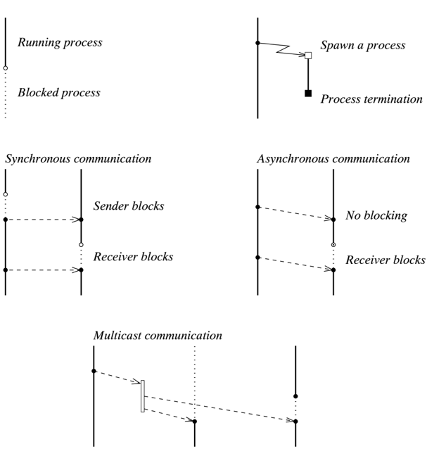

## Introduction

Concurrent programming is the task of writing programs consisting of multiple
independent threads of control, called processes. Conceptually, we view these
processes as executing in parallel, but in practice their execution may be
interleaved on a single processor. For this reason, we distinguish between
concurrency in a programming language, and parallelism in hardware. We say that
operations in a program are concurrent if they can be executed in parallel, and
we say that operations in hardware are parallel if they overlap in time.

Operating systems, where there is a need to allow useful computation to be done
in parallel with relatively slow input/output (I/O) operations, provide one of
the earliest examples of concurrency. For example, during its execution, a
program P might write a line of text to a printer by calling the operating
system. Since this operation takes a relatively long time, the operating system
initiates it, suspends P, and starts running another program Q. Eventually, the
output operation completes and an interrupt is received by the operating system,
at which point it can resume executing P. In addition to introducing parallelism
and hiding latency, as in the case of slow I/O devices, there are other
important uses of concurrency in operating systems. Using interrupts from a
hardware interval timer, the operating system can multiplex the processor among
a collection of user programs, which is called time-sharing. Most time-sharing
operating systems allow user programs to interact, which provides a form of
user-level concurrency. On multiprocessors, the operating systems are, by
necessity, concurrent programs; furthermore, application programs may use
concurrent programming to exploit the parallelism provided by the hardware.

One important motivation for concurrent programming is that processes are a
useful abstraction mechanism: they provide encapsulation of state and control
with well-de fi ned interfaces. Unfortunately, if the mechanisms for concurrent
programming are too expensive, then programmers will break the natural
abstraction boundaries in order to ensure acceptable performance. The
concurrency provided by operating system processes is

the most widespread mechanism for concurrent programming. But, there are several
disadvantages with using system-level processes for concurrent programming: they
are expensive to create and require substantial memory resources, and the
mechanisms for interprocess communication are cumbersome and expensive. 1 As a
result, even when faced with a naturally concurrent task, application
programmers often choose complex sequential solutions to avoid the high costs of
system-level processes.

Concurrent programming languages, on the other hand, provide notational support
for concurrent programming, and generally provide lighter-weight concurrency,
often inside a single system-level process. Thus, just as ef fi cient subroutine
linkages make procedural abstraction more acceptable, ef fi cient
implementations of concurrent programming languages make process abstraction
more acceptable.

## 1.1 Concurrency as a structuring tool

This book focuses on the use of concurrent programming for applications with
naturally concurrent structure. These applications share the property that fl
exibility in the scheduling of computation is required. Whereas sequential
languages force a total order on computation, concurrent languages permit a
partial order, which provides the needed fl exibility.

For example, consider the xrn program, which is a popular UNIX program that
provides a graphical user interface for reading network news. It is both an
example of an interactive application and of a distributed-systems application,
since it maintains a connection to a remote news server. This program has a
rather annoying 'feature' that is a result of its being programmed in a
sequential language. 2 If xrn loses its connection to the remote news server
(because the server goes down, or the connection times out), it displays a
message window (or ' dialog box ') on the screen to inform the user of the lost
connection. Unfortunately, after putting up the window, but before writing the
message, xrn attempts to reestablish the connection, which causes it to hang
until the server comes back on line. Thus, you have the phenomenon of a blank
message window appearing on the user's screen, followed by a long pause,
followed by the simultaneous display of two messages: the fi rst saying that the
connection has been lost, and a second saying that the connection has been
restored. Besides being an example of poor interface design, this illustrates
the kind of sequential orderings that concurrent programming easily avoids.

1 It should be noted that most recent operating systems provide support for
multiple threads of control inside a single protection domain.

2 This anecdote refers to version 6.17 of xrn .

## 1.1.1 Interactive systems

Interactive systems, such as graphical user interfaces and window managers, are
the primary motivation of much of the work described in this book, and the
author believes that they are one of the most important application areas for
concurrent programming. Interactive systems are typically programmed in
sequential languages, which results in awkward program structures, since these
programs are naturally concurrent. They must deal with multiple asynchronous
input streams and support multiple contexts, while maintaining responsiveness.
In the following discussion, we present a number of scenarios that demonstrate
the naturally concurrent structure of interactive software.

## User interaction

Handling user input is the most complex aspect of an interactive program. An
application may be sensitive to multiple input devices, such as a mouse and
keyboard, and may multiplex these among multiple input contexts ( e.g.,
different windows). Managing this many-to-many mapping is usually the province
of User Interface Management System (UIMS) toolkits. Since most UIMS toolkits
are implemented in sequential languages, they must resort to various techniques
to emulate the necessary concurrency. Typically, these toolkits use an
event-loop that monitors the stream of input events and maps the events to
call-back functions (or event handlers) provided by the application programmer.
In effect, this structure is a poor-man's concurrency: the event-handlers are
coroutines, and the event-loop is the scheduler.

The call-back approach to managing user input leads to an unnatural program
structure, known as the ' inverted program structure ,' where the application
program hands over control to the library's event-loop. While event-driven code
is sometimes appropriate for an application, this choice should be up to the
application programmer, and not be dictated by the library.

## Multiple services

Interactive applications often provide multiple services; for example, a
spreadsheet might provide an editor for composing macros, and a window for
viewing graphical displays of the data, in addition to the actual spreadsheet.
Each service is largely independent, having its own internal state and controlfl
ow, so it is natural to view them as independent processes.

An additional bene fi t of using process abstraction to structure such services
is that it makes replication of services fairly easy. This is because processes
are reentrant by their very nature ( i.e., they typically encapsulate their own
state). In our spreadsheet example, supporting multiple data sets or graphical
views should be as easy as spawning an additional process.

This is a situation where an 'object-oriented' language might also claim bene fi
ts, since

each service could be encapsulated as an object. In many respects, processes and
objects provide the same kind of abstraction: hiding state and providing well-de
fi ned interfaces. The obvious difference is that concurrent languages provide
the additional bene fi t of interleaved execution of services, whereas in a
sequential object-oriented language the execution of services must be
serialized. 3

## Interleaving computation

Even on a uniprocessor, it is possible to gain performance bene fi ts from
concurrency. An event driven interactive system has large amounts of 'dead-time'
between input events. If an application receives a hundred input events per
second (which is quite a lot), then it has millions of instructions it can
execute between events. Since most events can be handled in a few thousand
instructions ( e.g., add a character to an input buffer, and echo it), there is
an opportunity to execute other useful computation between input events. While
multi-tasking operating systems support this kind of interleaving between
processes, it is dif fi cult to interleave computation with I/O inside a single
sequential program. Applications that are programmed in a concurrent language,
however, can exploit this interleaving for 'free.' Furthermore, as processors
become faster, the amount of useful work that can be done between input events
increases.

In addition to the performance bene fi ts, interleaving computation is very
important to the responsiveness of an application. For example, a user of a
document preparation system may want to edit one part of a document while
another part is being formatted. Since formatting may take a signi fi cant
amount of time, providing a responsive interface requires interleaving
formatting and editing. A traditional UIMS toolkit makes it dif fi -cult to
write applications that provide responsive interactive interfaces and do
substantial computation, since the application cannot handle events while
computing. Typically, the computation must be broken into short-duration chunks
that will not affect responsiveness. This structure has the added disadvantage
of destroying the separation between the application and the interface.
Concurrent programs, in contrast, avoid this problem without any additional
complexity.

## Output-driven interfaces

The inverted program structure required by traditional UIMS toolkits has the
disadvantage of biasing a program's structure towards input. The application is
quiescent until the user prods it, at which time it reacts in some way, and then
waits for the next event. This is fi ne for many applications, such as text
editors, which do not have much to do when the user's attention is elsewhere,
but it is a hindrance for applications with output-driven interfaces.

3 Of course, this restriction does not apply to concurrent object-oriented
languages.

Consider, for example, a computationally intensive simulation that maintains a
graphical display of its current state. The interface to this application is
output-driven, since under normal circumstances the display is updated only when
a new state is computed. But this application must also monitor window events,
such as refresh and resize notifi cations, so that it can redraw itself when
necessary. In a sequential implementation, the handling of these events must be
postponed until the simulation is ready to update the displayed information.
Separating the display code and simulation code into separate processes simpli
fi es the handling of asynchronous redrawing.

## Discussion

While the use of heavy-weight operating-system processes provides some support
for multiple services and interleaved computation, it does not address the other
two sources of concurrent program structure. Similarly, although event-loops and
call-back functions provide fl exibility in reacting to user input, they bias
the application towards an inputdriven model and do not provide much support for
interleaved computation. A concurrent language, on the other hand, addresses all
of these concerns.

## 1.1.2 Distributed systems

Distributed programs are, by their very nature, concurrent; each processor, or
node, in a distributed system has its own state and control fl ow. But, in
addition to the obvious concurrency that results from executing on multiple
processors, there are natural uses of concurrency in the individual node
programs.

As the story about xrn illustrated, synchronous communication over a network can
block a program for unacceptable periods of time. This phenomenon is called
remote delay, where the execution on one machine is delayed while waiting for a
response from another. Using multiple threads to manage such communications
allows other tasks to be interleaved with remote interactions.

Another performance problem that should be avoided in distributed programs is
local delay, where execution is blocked because some resource is unavailable.
For example, a fi le server might have to wait for a disk operation to complete
before completing a fi le operation. In a server that allows multiple
outstanding requests, local delay can be a serious bottleneck, since the delay
associated with one request affects the servicing of other requests. A solution
to this is to use a separate local process for each outstanding request; when
one process experiences local delay, the others can still proceed. This is
essentially the same as using concurrency to hide I/O latency in operating
systems.

## 1.1.3 Other uses of concurrency

Reactive systems are another class of naturally concurrent programs. A reactive
system is one that reacts to its environment at a speed determined by its
environment. Examples of reactive systems include call processing, process
control, and signal processing. User interfaces and, to some extent, the node
programs in distributed systems might be considered reactive systems, although
they do not have the hard real-time requirements of 'pure' reactive systems.

Many other kinds of programs also have a naturally concurrent structure.
Discrete event simulations, for example, can be structured as a collection of
processes representing the objects being simulated. Concurrency can also be used
to provide a different look at a sequential algorithm. For example, power series
can be programmed elegantly as data fl ow networks. And, of course, concurrency
is important in expressing parallel algorithms.

## 1.2 High-level languages

Writing correct concurrent programs is a dif fi cult task. In addition to the
bugs that may arise in sequential programming, concurrent programs suffer from
their own particular kinds of problems, such as races, deadlock, and starvation.
What makes this even more dif fi cult is that concurrent programs execute
nondeterministically, which means that a program may work one time and fail the
next. A common suggestion to address this problem is to use formal methods and
logical reasoning to verify that one's program satis fi es various properties.
While this is a useful pedagogical tool, it does not scale well to large
programs.

For large systems, one has to mostly rely on good design and careful
implementation, which is where the choice of programming language makes an
important difference. A high-level language with well-designed primitives is the
most important ingredient in helping the programmer write correct and robust
software.

The question of which programming notation to use is often the subject of
religious debate. The trade-offs are fairly obvious: higher-level languages help
programmer productivity and improve the robustness of software, while
lower-level languages allow more programmer control over performance details. As
implementation technology improves (and computer time becomes cheaper), the
trend has been to migrate towards higher-level languages. While most people
would agree that the performance lost when switching from assembly language to C
is well worth the improved programmer productivity, there is no such consensus
about the next step.

It is the view of the author that the higher-order language Standard ML ( SML),
which provides the sequential substrate for the programming examples in this
book, is a good

candidate for the next step. SML provides a number of important bene fi ts for
programmers:

*   A strong type system, which guarantees that programs will not have run-time
  type errors (or 'dump core').
*   Agarbage collector, which improves modularity and prevents many kinds of
  memory management errors.
*   An expressive module system, which supports large-scale software construction
  and code reuse.
*   Higher-order functions and polymorphism, which further support code reuse.
*   A datatype mechanism and pattern matching facility, which provide a concise
  notation for many data structures and algorithms.
*   Awell-de fi ned semantics and independence from architectural details, which
  makes code truly portable.

SML also provides a level of performance that is becoming competitive with
lowerlevel languages, such as C. In particular, there is a widely used and
freely distributed SML system, called Standard ML of New Jersey ( SML/NJ), which
provides quite good performance. 4 It is the author's view that the notational
advantages of programming in SML outweigh the slight loss of performance, when
compared to C. A thesis of this book is that ef fi cient system software can be
written in a language such as SML.

## 1.3 Concurrent ML

This book uses a concurrent extension to SML, called Concurrent ML ( CML), as
its primary programming notation. CML can either be viewed as a library, since
it compiles directly on top of SML/NJ, or as a language in its own right, since
it de fi nes a different programming discipline.

Following the tradition of SML, CML is designed to provide high-level, but ef fi
cient, mechanisms for concurrent programming. Its basic model of communication
and synchronization is synchronous message-passing (or rendezvous) on typed
channels. Creation of both threads and channels is dynamic. Most importantly,
CML provides a mechanism for users to de fi ne new communication and
synchronization abstractions. This allows proper isolation of the implementation
details, improving the robustness of

4 Of course, this is application speci fi c. SML beats C on many symbolic
applications, but does not compete as well on array-based numerical
applications.

the system. CML also addresses performance issues by providing ef fi cient
concurrency primitives. CML has a number of features that make it a good
programming notation for building large-scale systems software:

*   CML is a higher-order concurrent language. Just as SML supports functions as
  fi rst-class values, CML supports synchronous operations as fi rst-class
  values. These values, called events, provide the tools for building new
  synchronization abstractions.
*   It provides integrated support for I/O operations. Potentially blocking I/O
  operations, such as reading from an input stream, are fullfl edged synchronous
  operations. Low-level support is also provided, from which distributed
  communication abstractions can be constructed.
*   It provides automatic reclamation of threads and channels, once they become
  inaccessible. This permits a technique of speculative communication, which is
  not possible in other concurrent languages and libraries.
*   Scheduling is preemptive, which ensures that a single thread cannot monopolize
  the processor. This allows 'off-the-shelf' code to be incorporated in a
  concurrent thread without destroying interactive responsiveness.
*   It has an ef fi cient implementation. Concurrency operations, such as thread
  creation, context switching, and message passing are very fast, often faster
  than lowerlevel C -based libraries.
*   CML is implemented on top of SML/NJ and is written completely in SML. It runs
  on every hardware and operating system combination supported by SML/NJ
  (although we have not had a chance to test all combinations).

CML, and the multithreaded user-interface toolkit eXene, which is built on top
of CML, have been used for a number of substantial applications ( i.e.,
applications consisting of at least 10,000 lines of SML / CML code).

## Notes

The importance of using concurrency in the construction of user-interface
software has been argued by a number of people. Most notably by Pike
[Pik89a, Pik94], and by Gansner and the author [RG86, GR92]. A recent paper by
Hauser et al. describes the various paradigms of thread use in two large
interactive software systems [HJT + 93].

Liskov, Herlihy, and Gilbert give arguments as to why the node programs in
distributed systems should either have dynamic thread creation or use one-way
message

passing (which they call asynchronous communication) for communicating with
other nodes [LHG86]. The basic argument is that without one of these features,
avoiding performance problems with local and remote delays requires too much
complexity. These arguments are also motivation for using a concurrent language,
instead of a sequential one, to program the nodes. Many languages and toolkits
for distributed programming provide some form of light-weight concurrency for
use in the node programs. Examples include the language Argus [LS83], the
language SR [AOCE88, AO93], and the Isis toolkit [BCJ + 90].

In addition to the examples found in later chapters of this book, there are a
number of examples of the application of concurrency in the literature. McIlroy
describes the implementation of various power series computations using the
language newsqueak [McI90]. Andrews and Olsson illustrate the use of SR with a
number of small application examples, including parallel numerical computation
and simulation [AO93]. A book by Armstrong, et al. gives examples of the use of
the concurrent language Erlang for a number of applications, including database
servers, real-time control, and telephony [A VWW96]. CML has also been used for
experimental telephony applications [FO93].

It is expected that the reader is familiar with the 1997 revision of SML, since
it is the primary notation used in this book. A number of books give good
introductions to SML. The second edition of Paulson's book [Pau96] gives a
comprehensive description of the language, concentrating mostly on 'functional
programming' using SML, but it also discusses the module system and imperative
features. A book by Ullman provides an introduction to SML aimed at people with
experience programming in traditional imperative languages, and has been
recently revised for SML '97 [Ull98]. Other books include Reade's book on
functional programming using SML [Rea89], Stansifer's primer on ML [Sta92], and
a book on abstract data types in SML by Harrison [Har93]. A recent book by
Okasaki describes many purely functional data structures [Oka98]; these can be
particularly useful for concurrent programming since there is no danger of
shared state. In addition, there are tutorials written by Harper [Har86] and
Tofte [Tof89]. The formal de fi nition of SML and commentary on the de fi nition
were published as a pair of books [MTH90, MT91]; a revised de fi nition, which
covers SML '97, has also been published [MTHM97]. In addition, the SML Basis
Library Manual is available electronically from
http://standardml.org/Basis/index.html

and also as a book [GR04].

This book also uses libraries and features that are speci fi c to the SML/NJ
system; these are described as they are encountered. More detailed documentation
is included in the SML/NJ distribution, and is also available from the SML/NJ
home page. An abridged

version of the CML Reference Manual is provided in Appendix A. As described in
the preface, both SML/NJ and CML are distributed electronically free of charge.

## Concepts in Concurrent Programming

Concurrent programming differs from sequential programming in several signi fi
cant ways. Conceptually, we can view the execution of a concurrent program as an
interleaving of the sequential execution of its constituent processes. Since
there are many possible interleavings, the execution of a concurrent program is
nondeterministic; i.e., different interleavings may produce different results.
In effect, a concurrent program de fi nes a partial order on its actions,
whereas a sequential program de fi nes a total order. This nondeterminism is
both the bane and boon of concurrent programming: on the one hand, it creates
additional correctness problems, while on the other hand, it provides fl
exibility and a more natural program structure. As argued in Chapter 1, the
choice of programming notation can help the programmer control the complexity of
concurrency, while reaping its bene fi ts.

A concurrent language typically consists of a sequential core (or sub-language),
extended with support for concurrency. The concurrency support can be divided
into three different kinds of mechanism:

*   A mechanism for introducing independent sequential threads of control, called
  processes. The process creation mechanism can be either static, restricting
  the program to a fi xed number of processes, or dynamic, allowing new
  processes to be created 'on-thefl y.'
*   A mechanism for processes to communicate. Communication involves exchanging
  data, either through shared memory locations ( e.g., variables) or by explicit
  message passing.
*   And a mechanism for processes to synchronize. Synchronization restricts the
  ordering of execution in otherwise independent threads, and is used to limit
  the program's nondeterminism where necessary.

The choice of language features used to provide these mechanisms, along with the
se-

quential sub-language, characterize a concurrent programming language. In
particular, the choice of synchronization and communication mechanisms are the
most important aspects of concurrent language design. Most concurrent languages
can be classi fi ed as either shared-memory languages or message-passing
languages (sometimes called distributed-memory languages). Shared-memory
languages rely on the imperative features of the sequential sub-language for
interprocess communication, and provide separate synchronization primitives to
control access to the shared state. Message-passing languages provide a single
uni fi ed mechanism for both synchronization and communication. Note that the
distinction between shared-memory and message-passing languages has to do with
the style of process interaction; many message-passing languages, including CML,
are implemented in shared address spaces.

In this chapter, we survey the important issues in concurrent programming, and
examine some of the better known language features for supporting concurrency.
This discussion is partially to give the reader a feeling for some of the design
choices, as well as a way of highlighting some of the important issues in
concurrent programming. It also provides de fi nitions of various abstractions
that are implemented later in the book using CML.

## 2.1 Processes

Aprocess consists of a thread of control ( i.e., an instruction stream and
program counter), and a local state ( i.e., local variables, program stack,
etc.). A process is essentially a sequential program that shares some of its
state with other sequential programs. A concurrent programming language must
provide a mechanism for de fi ning the processes that comprise a program; in the
remainder of this section, we examine some of the ways in which this mechanism
is provided.

Perhaps the simplest notation for process creation is the static concurrent
composition of statements, which has the form:

```
s t m t _1 | |  s t m t _2 | | |  \cdots | | |  s t m t _n
```

and is executed by executing each of the stmt i in parallel; the whole statement
terminates when each of the individual statements has terminated. This construct
is often called a cobegin statement, since it was fi rst introduced as a way to
compose concurrent beginblocks. If combined with recursive procedures, the
cobegin statement can support the creation of arbitrary numbers of processes,
but it is an awkward programming notation.

Another approach to process creation is to provide a declarative notation for
processes, similar to procedure or module declarations. The Ada task declaration
provides one example of this. In Ada, task implementations are de fi ned in task
type declarations and instances of a task are created by declaring variables of
the corresponding task type.

While this approach provides more fl exibility than the cobegin statement, it is
still rather heavyweight and cumbersome.

Most recent concurrent languages provide process creation via a spawn (or fork)
primitive that dynamically creates a new thread of control to run concurrently
with its creator. While there are widely used concurrent languages that only
provide static process creation, there do not seem to be very strong arguments
in favor of it. On the other hand, there are strong arguments in favor of
providing dynamic process creation, many of which are presented in this book.

## 2.2 Interference

Most concurrent programs require some sharing of data between different
processes, but if independent processes are accessing and modifying shared
state, the order of accesses can affect the result of the program. Sequential
programs do not suffer from this problem, since the order of execution is
deterministic. To illustrate this point, consider the following program:

```
let val x = ref 0
  in
    x := !x + 1;  x := !x + 2;
    print (!x)
  end

```

Simple examination is suf fi cient to determine that this program will print the
integer 3 every time it is executed. But consider a version where the assignment
statements are composed in parallel, instead of sequentially:

```
let val x = ref 0
  in
    (x := !x + 1) || (x := !x + 2);
    print (!x)
  end

```

The execution of each assignment statement consists of three individual steps:
read x, add a constant to it, and store the result. We assume that the
individual steps are atomic; i.e., that they are executed as indivisible
operations. Since the statements are composed in parallel, the steps can be
interleaved in different ways, resulting in either 1, 2, or 3 being printed.
This is the canonical example of interference between processes. The two
assignment statements are examples of critical regions; i.e., regions of code
that are potential sources of interference in the absence of proper concurrency
control. Synchronization provides the mechanism for avoiding this interference.

While the above example is expressed in terms of shared-memory primitives, it is
important to realize that interference also occurs in message-passing concurrent
programs. For example, memory could be an independent process and the memory
operations could be implemented using messages.

## 2.3 Correctness issues in concurrent programming

Because concurrent programs consist of multiple processes and have
nondeterministic behavior, they give rise to a number of correctness issues not
found in sequential programs.

A common problem suffered by concurrent programs is deadlock, which is a
situation in which a set of processes are blocked waiting for some event that
cannot occur. Deadlock is caused by cyclic dependencies among processes. For
example, consider the following program, where two processes P and Q share two
resources A and B:

```
P: acquire A; acquire B; compute; release B; release A
	 Q: acquire B; acquire A; compute; release A; release B
```

Assuming that only one process can hold a resource at a time, the following
program can deadlock with P holding A and Q holding B. The problem is that there
is a cyclic dependency between P 's acquiring of resource B and Q 's acquiring
of resource A.

A problem that is similar to deadlock is livelock, where processes are not
making progress, even though they are not blocked. For example, suppose that we
modi fi ed the above program so that P and Q release the fi rst resource that
they acquire when the second is held, and then try again:

```
P
                                  Q
  l: acquire A;
     if (B is held)
        then     (release A; goto l)
        else     acquire B
     compute
      release B; release A           compute A

O

```

One possible execution of this program is a strict interleaving of P and Q,
which results in an in fi nite execution:

```
P: acquire A
Q: acquire B
P: if (B is held)
Q: if (A is held)
P:  then release A
Q:  then release B
out:

```

Neither process is blocked, but neither makes progress.

When reasoning about concurrent programs, it is necessary to consider all
possible execution sequences (or process histories). Wede fi ne a property of a
concurrent program to be a statement about the program's behavior that is true
in all possible executions of the program. There are two classes of properties
that are of interest:

*   Safety properties assert that a program never enters a bad state. Or more
  formally, that for any program execution, every state satis fi es the
  statement. Mutual exclusion is an example of a safety property, since it
  asserts that the program is never in a state where two processes are executing
  in a critical region. Another important safety property is the absence of
  deadlock.
*   Liveness properties assert that a program eventually reaches a desirable state
    *   for every execution there is some state in which the statement is true.
  Termination is an example of a liveness property, since it asserts that a
  program will eventually terminate.

Fairness is a particular form of liveness property that is important to
concurrent programming. The most general concept of fairness is that a system
component that is enabled suf fi ciently often should not be delayed inde fi
nitely. For example, in a time-sharing system, is a process guaranteed to make
progress if it is ready? If the scheduler is priority based, and there are
always higher priority processes that are also ready to run, then the process
will be delayed (this is called starvation). There are different strengths of
fairness based on how the phrase 'suf fi ciently often' is interpreted. Under
strong fairness, any component that is enabled in fi nitely often is never
delayed inde fi nitely. While under weak fairness, any component that is enabled
'almost always' is never delayed inde fi nitely. 1 For example, if we have a
component that alternates being enabled for a second then not enabled for a
second ad in fi nitum, then under strong fairness it will not be starved
(because it is enabled in fi nitely often), whereas under weak fairness it can
be starved (because it is not enabled in fi nitely often).

We can also distinguish different notions of fairness by the kind of system
component that they refer to: process fairness says that a process will get to
make progress, while event fairness says that an enabled event will get to
occur. The scheduling example in the previous paragraph is an example of a
process fairness concern. An example of event fairness can be found in selective
communication. Consider a process that repeatedly synchronizes on the choice of
reading from two channels, where there is always input available on both
channels. If the process always reads from the same channel, then the 'event' of
reading from the other channel is delayed inde fi nitely, which is unfair.

In the implementation of concurrent programming languages, fairness concerns are
closely coupled with scheduling policies. For example, consider a process
scheduling policy for a uniprocessor that lets the currently running process
have sole access to the processor until it either blocks or terminates. Such a
policy allows an in fi nitely looping process to starve other processes, and
thus is unfair. While a strongly fair scheduling

1 This terminology is a bit confusing. The statement that a component is enabled
almost always means that it is not enabled only fi nitely often.

policy is impractical to implement in general, it is possible to implement
strongly fair policies for many higher-level concurrency primitives.

## 2.4 Shared-memory languages

As seen in Section 2.2, correct execution of shared-memory programs requires
synchronization to control the access to shared state. In general, there are two
kinds of situations in which synchronization is required between processes: to
avoid interference when accessing shared variables, and to ensure that
operations are only performed under certain conditions.

As we saw above, when the operations on a shared value consist of a sequence of
statements, concurrent execution of the operations by two or more threads can
result in indeterminate results. To avoid this, the operations must be executed
atomically. For example, if the assignment statements in the above example are
atomic, then the answer will always be 3. Mutual exclusion synchronization is
used to ensure that processes execute the critical regions atomically.

The other situation arises when the state of the shared object determines which
operations are enabled. For example, a shared object might allow multiple
readers to access it concurrently, but require exclusive access for writers. In
this case, both the read and write operations are disabled when another process
is writing, and the write operation is disabled when processes are performing
reads. A process uses condition synchronization to wait until some condition
holds before executing an operation.

To illustrate the different forms of shared-memory synchronization primitives,
we use the classic example of a producer/consumer buffer. This is an abstraction
of a common situation in which one, or more, processes, called producers are
generating data that are being fed to one, or more, consumer processes. Figure
2.1 gives the basic structure of the system. The interesting part is the fi nite
buffer used to connect the producer and consumer processes. A natural way to
implement the buffer is as an abstract data type with the following interface:

Flow chart

Figure 2.1: Producer/consumer system

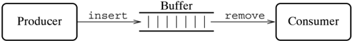

```
type 'a buffer
    val buffer : unit -> 'a buffer
    val insert : ('a * 'a buffer) -> unit
    val remove : 'a buffer -> 'a
```

The buffer is the shared state in the system, and access to its internal
representation must be controlled, which requires mutual exclusion
synchronization. There is additional condition synchronization required to keep
the producer from inserting items into a full buffer, and to keep the consumer
from attempting to remove items from an empty buffer. To simplify the
presentation, we use a buffer size of one.

## 2.4.1 Semaphores

One of the most basic synchronization mechanisms is the semaphore, which is a
special integer variable with two operations: P and V. Given a semaphore s, the
execution of P ( s) by a process p forces it to delay until s &gt; 0, at which
point p executes s := s -1 and proceeds; the test and update of s are performed
together as an atomic operation. Execution of V ( s) results in the atomic
execution of s := s +1.

A semaphore s can be used to implement mutual exclusion for a critical region by
initializing s to 1, and by bracketing the critical region with P ( s)... V (
s). When a process P enters the critical region, s goes to 0, which prevents any
other process from entering until P exits. Such a semaphore is called a binary
semaphore, since it only has two values. Semaphores can also be used to
implement condition synchronization. In this case, the semaphore is initialized
to 0. When a process wants to wait for a condition to become true, it executes P
( s), causing it to block. When another process makes the condition true, it
executes V ( s), which signals to the waiting process that it may proceed.

The code in Listing 2.1 gives a possible implementation of the one-element
producer/ consumer buffer using semaphores, which illustrates both styles of
semaphore use. We assume that the function semaphore creates a new semaphore
initialized to the given value, and that the functions P and V are as described
above. The semaphore lockSem is used for mutual exclusion synchronization to
ensure that only one process can access the buffer's state at a time, while the
auxiliary counter waiting and the semaphore waitSem are used to provide
condition synchronization on the state of the buffer ( i.e., empty or full). The
actual condition synchronization scheduling is performed by the functions wait
and signal. This implementation allows multiple producers and consumers to share
the buffer. The key to making this sharing work is that signal wakes up all the
waiting processes, which means that when a producer puts a value into the buffer
it is guaranteed that if there is a blocked consumer, then the value will be
consumed (and vice versa).

There is a more concise implementation of the one-element producer/consumer
buffer that uses one semaphore to mark the empty state, and another to mark the
full state. In

```
18                     2 Concepts in Concurrent Programming


-------------------------------------------------------------------------------
    datatype 'a buffer = BUF of {
        data    : 'a option ref,
        waiting : int ref,
        lockSem : semaphore,
        waitSem : semaphore
      }

    fun buffer () = BUF{
            data    = ref NONE,
            waiting = ref 0,
            lockSem = semaphore 1,
            waitSem = semaphore 0
        }

    fun wait (BUF{waiting, lockSem, waitSem, ...}) = (
            waiting := !waiting+1; V lockSem; P waitSem)

    fun signal (buf as BUF{waiting, waitSem, ...}) =
            if (!waiting > 0)
                when (
                    waiting := !waiting-1; V waitSem;
                else ()
            else ()

    fun insert (buf as BUF{data, lockSem, ...}, v) = (
            P lockSem;
            case !data
            of NONE => (data := SOME v; signal buf; V lockSem)
            | (SOME _) => (wait buf; insert (buf, v))

        (fun remove (buf as BUF{data, lockSem, ...}) = (
            P lockSem;
            case !data
            of (SOME v) => (data := NONE; signal buf; v lockSem; v)
            | (e end case *)

    Listing 2.1: Producer/consumer buffer implemented with lock and wait semaphores

-------------------------------------------------------------------------------

```

Listing 2.1: Producer/consumer buffer implemented with lock and wait semaphores

effect, this scheme implements both the mutual exclusion and condition
synchronization using the same semaphores. Listing 2.2 gives the code for this
version. While this version is more compact, the alternating use of the two
semaphores is subtle and makes its harder to extend.

Amajor problem with semaphores is that there is no linguistic support for their
correct use. For example, the code in Figures 2.1 and 2.2 have P and V
operations scattered throughout; insuring that they are properly matched and
that all accesses to shared state

```
2.4 Shared-memory languages

    datatype 'a buffer = BUF of {
        data      : 'a option ref,
        emptySem : semaphore,
        fullSem   : semaphore
    }

  fun buffer () = BUF{
                data     = ref NONE,
                fullSem  = semaphore 0
            }

  fun insert (BUF{data, emptySem, fullSem}, v) = (
        P emptySem;
        v fullSem)

  fun remove (BUF{data, emptySem, fullSem}) = let
        val _ = P fullSem
        val (SOME v) = !data
        i
        data  := NONE;
        v emptySem;
        v
        end

Listing 2.2: Producer/consumer buffer implemented with condition semaphores
```

Listing 2.2: Producer/consumer buffer implemented with condition semaphores

are protected requires close examination. Furthermore, implementing patterns of
synchronization that are more complicated than mutual exclusion can be tricky.

## 2.4.2 Mutex locks and condition variables

The term mutex lock is essentially another name for a binary semaphore (it is a
contraction of 'mutual exclusion'). A mutex lock has two states: locked or
unlocked. One of the advantages of mutex locks is that they are supported
naturally by the test-and-set instruction found on many multiprocessors.

Mutex locks are meant to be used to control access to shared data. The idea is
that each piece of shared data has an associated lock, which a process must
acquire before it can access the data. We have already seen an example of this;
the semaphore lockSem in Listing 2.1 is essentially a mutex lock. This idiom can
be supported by syntactic sugar; for example, Modula-3 provides the statement
syntax

```
LOCK m DO statements END

```

which executes by fi rst acquiring the lock m, then executing the statements,
and fi nally

releasing m. In SML, this idiom might be supported by a higher-order function
with the type

<!-- formula-not-decoded -->

The semantics of the expression

<!-- formula-not-decoded -->

are that fi rst the lock mu is acquired, then the function f is applied to x,
and then the function's result is returned after releasing the lock.

Mutex locks are suf fi cient for insuring mutual exclusion in critical regions,
but do not provide an easy way to implement condition synchronization. In our
producer/consumer example, if the buffer is empty, then the consumer must wait
for the producer to add something to it; likewise, if the buffer is full, the
producer must wait for the consumer to remove something. While it is possible to
program this using only mutex locks, it is more natural to use condition
variables. A condition variable is used to delay a process until some condition
in a critical region is satis fi ed ( e.g., the buffer is not empty). Just as a
mutex lock is specialized to support mutual exclusion synchronization, the
condition variable is designed to support condition synchronization.

The basic operations on condition variables are

```
val wait : condition -> unit

```

which causes a process to block on the condition variable, and

```
val signal : condition -> unit

```

which wakes up one waiting process. A condition variable is associated with a
speci fi c mutex lock, which must be held when performing a wait operation on
the variable. The semantics of the wait operation are that the mutex lock is
released, and then the process is blocked; when the condition is signaled, the
next process in the condition's waiting queue is unblocked and it reacquires the
mutex lock and proceeds. A signal operation on a condition variable that has an
empty waiting queue has no effect; in this sense condition variables are
memoryless.

The implementation of the producer/consumer buffer is much cleaner using mutex
locks and condition variables than using semaphores. The code for this is given
in Listing 2.3. Here we use the mutex lock mu to provide mutual exclusion, and
the two condition variables dataAvail and dataEmpty to block waiting processes.
Note that waiting on a condition is implemented as a loop, with the waiting
process checking the condition after it wakes up. This is necessary to avoid the
potential problem of another

```
2.4 Shared-memory languages

                        21

    -----------------------------------------------------------------------------
        datatype 'a buffer = BUF of {
            data        : 'a option ref,
            mu          : mutex,
            dataAvail : condition,
            dataEmpty : condition
        }

      fun buffer () = let
            val mu = mutex()
            in
              BUF{
                    data        = ref NONE,
                    mu          = mu,
                    dataAvail = condition, mu,
                    dataEmpty = condition, mu
              }
          end

      fun insert (BUF{data, mu, dataAvail, dataEmpty}, v) = let
            fun waitLp NONE = (data :: SOME v; signal dataAvail)
            | waitLp (SOME v) = (wait dataEmpty; waitLp(!data))
            in
              withLock mu waitLp (!data)
            end

      fun remove (BUF{data, mu, dataAvail, dataEmpty}) = let
            fun waitLp NONE = (wait dataAvail; waitLp(!data))
            | waitLp (SOME v) = (data := NONE; signal dataEmpty; v)
            in
              withLock mu waitLp (!data)
            end

          Listing 2.3: Producer/consumer buffer implemented with mutex locks


```

Listing 2.3: Producer/consumer buffer implemented with mutex locks

process acquiring the mutex lock and invalidating the condition between the time
the waiting process is unblocked and the time it reacquires the lock. This
situation is an example of a race condition, which is a situation where the
relative speed and scheduling of processes can affect the correctness of the
program. By rechecking the condition after being signaled, we avoid the
possibility of a race. We could use a single condition variable to block waiting
processes, but then we would have had to use broadcast to support sharing of the
buffer between multiple producers and consumers (as we did in the semaphore
implementation).

## 2.4.3 Monitors

Monitors are a special form of module that can be used to encapsulate shared
state. As with a regular module, a monitor provides data abstraction, with
access to its state being

restricted to a collection of exported procedures. In addition to data
abstraction, monitors provide mutual exclusion by only allowing a single process
to be executing inside the monitor at a time. In effect, this is equivalent to
having a single mutex lock for the whole monitor, and wrapping the body of each
exported procedure with a LOCK statement. In addition to the implicit locking
provided by the exported procedures, monitors also provide condition variables
for condition synchronization. In fact, programming languages with monitors
predate the kind of support for mutex locks and condition variables described in
the previous section. While monitors provide more linguistic support than mutex
locks, it can be argued that providing mutex locks as a separate mechanism is a
better approach, since it separates two orthogonal language features ( i.e.,
modules and mutual exclusion).

## 2.5 Message-passing languages

In the previous section, we used the producer/consumer buffer as an example to
illustrate different shared-memory primitives. Message-passing languages support
this style of interprocess communication more directly. The basic operations in
message-passing languages are ' send a message ' and ' receive a message .'
Since a message must be sent before it can be received, message-passing imposes
an causal order on the actions of the program.

One way to distinguish message-passing languages is by the mechanism used to
specify the destination of a send operation and the source of a receive. This
pair of names is called a communication channel. Different schemes for
specifying communication channels support different communication topologies.
The most basic way to specify a communication channel is direct naming, where
the endpoints ( i.e., the sending and receiving processes) are named explicitly.
In this case, the topology of a channel is a one-to-one connection. A variation
on this is to allow receive operations to accept messages from any sending
process, which allows many-to-one connections. Direct naming is quite
restrictive, so a natural generalization is to allow process names to be stored
in variables and sent in messages. In a strongly-typed language direct naming
has the additional disadvantage that a process can only receive messages of one
type, which means that the programmer must use a union type and case analysis to
support multiple types of messages. This problem can be addressed by associating
multiple ports with each process, where each port can support a different type
of message. The send operation then must specify both the destination process
and port, while the receive operation speci fi es an input port. Another common
mechanism is to make the communication channels into fi rst-class citizens, and
specify them independently of the sender and receiver processes. When
communication channels are supported as values, many-to-many connections are
possible using a single channel (multiple processes may read and write from the
chan-

nel). When we discuss message passing in the sequel, we use channels as the
naming scheme, and allow multiple processes to read or write on a channel. In
addition to pointto-point messages, where each message that is sent is received
by only one process, some message-passing schemes support broadcast (or
multicast), where a message can be sent to every process in a group of
processes.

Another, more important, way to distinguish between different forms of message
passing is the amount of synchronization provided by the message-passing
operations. The basic issue is whether an operation is blocking or non-blocking
(the terms synchronous and asynchronous are sometimes used instead). Since there
are two different operations, we can organize the design space into a taxonomy
of four choices. In practice, the receive operation is almost always a blocking
operation, 2 which leaves us the choice of non-blocking versus blocking send.
There is also the question of whether communication is bidirectional ( i.e.,
whether the send operation blocks until a reply is received). In the next three
sections, we discuss these choices in more detail.

## 2.5.1 Asynchronous message passing

An asynchronous message-passing mechanism buffers the communication between the
sender and receiver, which allows the sender to continue execution after sending
a message. This is analogous to mailing a letter; once the letter is in the
postbox, the sender can continue with other tasks. One issue is whether the
ordering of messages that the sender sees is also seen by the receiver. Most
languages with asynchronous message passing provide FIFO ( First-In, First-Out)
ordering of messages, but FIFO ordering of messages is not guaranteed in
distributed systems or in some implementations of asynchronous message passing.
Figure 2.2 gives examples of asynchronous message passing. The vertical lines
are pictorial representations of the process histories (or time-lines) for the
processes P and Q, with time progressing down the page. Both fi gures cover a
situation in which P sends two messages to Q, and then receives one, and Q
receives a message, sends one, and then receives another. The difference is in
the ordering of P's messages; in Figure 2.2(a), the messages obey a FIFO
ordering, whereas they do not in Figure 2.2(b). An asynchronous channel can be
viewed as a semaphore with data. The send operation corresponds to V, and the
recv operation to P. The number of outstanding messages in the buffer represents
the value of the semaphore.

Some implementations of asynchronous message passing only provide fi nite
buffering. In this situation, if the producer outpaces the consumer, then the
send operation eventually becomes blocking, since the sender must wait for empty
space in the buffer. While this violates the spirit of asynchronous message
passing, the alternative may be worse.

2 One notable exception is the SR language, which allows one to de fi ne a
receive operation that is asynchronously invoked when a message arrives.

In this image, we can see a diagram.<end_of_utteranc

Line chart

Figure 2.2: Asynchronous message passing

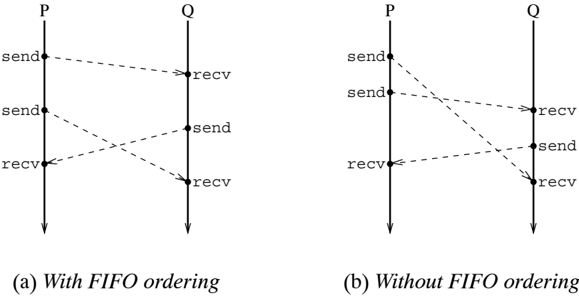

If the language implementation allows buffers to grow without bound, then the
available memory could be exhausted, causing the system to crash.

The producer/consumer example illustrates this problem well. The producer and
consumer processes can be connected directly using an asynchronous communication
channel, but if the producer generates new items faster than the consumer uses
them, the program will have unbounded space consumption. To avoid this, some
form of fl ow-control is required. The fi nite buffer provides this, since the
buffer size limits the distance the producer can get ahead of the consumer.
Listing 2.4 gives the code for an implementation of the producer-consumer buffer
using asynchronous message passing. This version of the implementation avoids
the need for mutual exclusion synchronization, since only one process can access
the buffer's state directly. The condition synchronization is provided by the
buffer process sending messages on the emptyCh and remCh channels (recall that
an asynchronous channel is like a semaphore with data). The producer (or
consumer) process must wait for a message to be available, before it can insert
(resp. remove) an item. Flow-control is provided by handshaking on the remove
operation; the buffer process waits for an acknowledgement, before sending the
'empty' message. This type of handshaking could also be used for the insert
operation, but that would effectively increase the buffer size by the number of
producers, since each producer could send a message and then wait for the
acknowledgement. Figure 2.3 illustrates the message traf fi c used in this
implementation. It is also interesting to note that the buffer's state is
implemented as a pair of mutually recursive functions: empty and full. This is a
common idiom when programming message-passing concurrency in ML -style
languages.

3In the race of cunchronone maccars naccina 41

```
2.5 Message-passing languages

    datatype 'a buffer = BUF or {
        empty Ch   : unit chan,
        insCh  : 'a chan,
        remCh   : 'a chan,
        remAckCh : unit chan
    }

    fun buffer () = let
            val emptyCh = channel () and insCh = channel ()
            val remCh = channel () and remAckCh = channel ()
            fun empty () = (
                    send (emptyCh, ());
                    full (recv insCh))
            and full x = (
                    send (remCh, x);
                    empty (recv remAckCh))
        in
            spawn empty;
            BUF{
                emptyCh = emptyCh,  insCh    = insCh,
                remCh    = remCh,   remAckCh = remAckCh
            }
        end

    fun insert (BUF{insCh, emptyCh, ...}, v) = (
            recv emptyCh; send ((insCh, v))

    fun remove (BUF{remCh, remAckCh, ...}) =
            (recv remCh) before send(remAckCh, ())

Listing 2.4: Producer/consumer buffer implemented with asynchronous message passing
```

Listing 2.4: Producer/consumer buffer implemented with asynchronous message
passing

## 2.5.2 Synchronous message passing

In synchronous message passing, the sender is blocked until its message is
received. 3 This is somewhat analogous to making a phone call, where the caller
must wait until someone picks up the phone ( i.e., accepts the call) before
talking. There are two basic scenarios for synchronously sending a message:
either the sender waits or the receiver waits. Figure 2.4 shows the process
histories for these two scenarios, where the dotted lines correspond to a
process being blocked. Because the two processes must wait for each other,
synchronous message passing is sometimes called rendezvous (or simple
rendezvous).

Implementing the producer/consumer buffer using synchronous message passing is
straightforward; the code is given in Listing 2.5. As with the asynchronous
case, a process is used to encapsulate the buffer state, but unlike the
asynchronous case, no extra

3 In the case of synchronous message passing, the ' recv ' operation is
sometimes called ' accept .'

In this image there is a chart. On the chart there are two columns. The first
column is titled as "Producer" and the second column is titled as "Buffer". In
the first column there are two rows. In the first row there is a text "INSERT"
and in the second row there is a text "Buffer".<end_of_utteranc

Flow chart

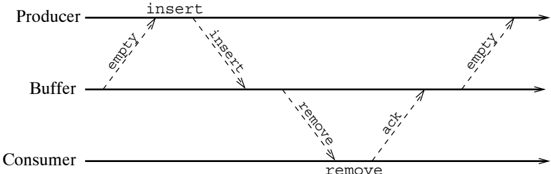

remove

Figure 2.3: Message traf fi c in asynchronous producer/consumer buffer
implementation

communication is required for fl ow-control. The condition synchronization is
implemented by the enabling of communication on the channels. When the buffer is
empty, then communication on the channel insCh is enabled, but not on the
channel remCh. Conversely, when the buffer is full, the situation is reversed.

While synchronous communication patterns are more common than asynchronous
patterns, it is occasionally necessary to communicate asynchronously - for
example, when cyclic communication patterns are required that might otherwise
result in deadlock. The producer/consumer buffer example illustrates one
technique for supporting asynchronous communication in a synchronous language.
Another technique is to have the sender dynamically spawn a new process to
actually send the message; this way the new process

In this image, we can see a diagram.<end_of_utteranc

Line chart

Figure 2.4: Synchronous message passing (simple rendezvous)

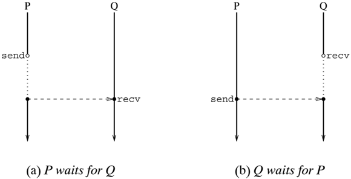

```
datatype: 'a buffer = BUF of {
            insCh : 'a chan,
            remCh : 'a chan
        }

      fun buffer () = let
            val insCh = channel() and remCh = channel()
            fun empty () = full (recv insCh)
            and full x = (send (remCh, x); empty())
            in
                spawn empty;
                BUF{
                    insCh = insCh,
                    remCh = remCh
                }
            end

      fun insert (BUF{insCh, ...}, v) = send (insCh, v)

      fun remove (BUF{remCh, ...}) = recv remCh

string 2.5: Producer/consumer buffer implemented with synchronous message passi
```

Listing 2.5: Producer/consumer buffer implemented with synchronous message
passing

may block, but the sender can continue executing. When process creation is
inexpensive, this is a useful technique. Note, however, that unlike using a
buffer process, this technique does not guarantee a FIFO ordering of the
messages.

## 2.5.3 Selective communication

In message-passing programs, it is often necessary to manage communication with
multiple partners. For example, if we wish to modify the producer/consumer
buffer implementation of Listing 2.5 to use a larger buffer, then when the
buffer is partially full, the buffer process must be able to handle
communications with both the producer and the consumer. There are several ways
that this might be accomplished.

It is possible to design a protocol based on the simple operations used in
Listing 2.5. The idea is to use a single channel for both insert and remove
requests. The producer (or consumer) fi rst sends a request, and then attempts
its operation; when the buffer process receives an insert (or remove) request,
it enables communication on the appropriate channel. This becomes quite
complicated, however, because the buffer process must also manage outstanding
insert requests when it is full (and outstanding remove requests when it is
empty). Another problem is that we have lost the bene fi ts of rendezvous, and
have reverted to explicit handshaking. Furthermore, this kind of protocol is not
very ab-

stract, and may have to be modi fi ed to be used in other contexts (for example,
a process that wants to read from two different buffered channels).

To avoid the complexities and inef fi ciencies of such protocols, most
message-passing languages provide a mechanism for selecting from a choice of
several blocking communications. One approach is to provide a polling operation
(or non-blocking recv operation) that allows a process to attempt a
communication without blocking (if the operation would block, then the attempt
fails). Using this, one might implement the buffer by repeatedly polling the
insCh and remCh channels. While this spinning provides the desired
nondeterministic choice of communications, it is wasteful of computing
resources. A better approach is to provide a selective communication operation
that allows a process to block until one of a choice of operations is possible.
Using such a mechanism, the fi nite producer/consumer buffer process can be
implemented quite elegantly as follows (using the previous implementation of
insert and remove):

```
fun loop [] = loop [recv insCh]
      | loop buf = if (length buf > maxLen)
          then (send (remCh, hd buf); loop (tl buf))
          else (select remCh!(hd buf) => loop (tl buf)
                     or insCh? => loop (buf @ [x]))
```

where we are assuming syntactic support for selective communication in the form
of the select expression, and use a list to represent the buffer. This has two
clauses: the fi rst attempts to send the fi rst item in the buffer on the remCh
channel (the '! ' operator), and the second attempts to receive a message from
the insCh channel (the '? ' operator). The communications in these clauses are
called guards, because they 'guard' the actions following the ' =&gt; .' The
select operation becomes enabled, when one of the guards becomes enabled; if
both guards are simultaneously enabled, then one is selected
nondeterministically.

There are variations in the design of selective communication mechanisms. Many
languages provide input-only selective communication, where the guards are
restricted to input operations only. For the above example, that would mean that
the remove operation would have to be implemented using a request from the
consumer, so that the buffer process could select on two input operations. When
both input and output guards are allowed, the mechanism is called generalized
selective communication.

## 2.5.4 Remote procedure call

A common idiom in message-passing programs is the client-server structure, where
one process, called the server, provides some service (usually involving access
to shared state) to clients. A typical client-server protocol involves the
client sending a request, and then waiting for a reply from the server, where
the server is structured as a loop with

In this image, we can see a diagram. There are two lines, one is written as
"call" and another is written as "reply".<end_of_utteranc

Line chart

Figure 2.5: Remote procedure call (rendezvous)

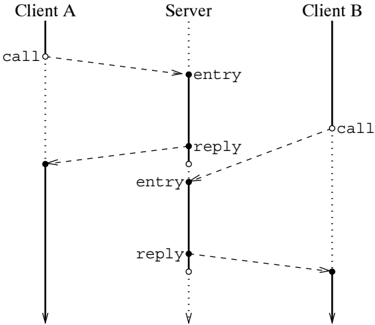

each iteration corresponding to the handling of one client request. Because of
the importance of this idiom, some languages, such as Ada, provide it as the
basic communication mechanism. In such a mechanism, the clients use a call
operation to request a service and wait for the reply, while the server uses the
entry operation to wait for requests and a reply operation to return the result.
The server-side entry operations are typically gathered into a selective
communication. Figure 2.5 shows a process history for a server responding to
requests from two different clients. Languages based on this mechanism typically
also supply a selective communication construct to allow the server to offer a
choice of different entries.

There are a number of different names for this mechanism. Because it involves
blocking both the sender and receiver, it is sometimes called rendezvous (or
extended rendezvous). Others describe the communications as transactions. In
this book, we use the term Remote Procedure Call (RPC), because the
request/reply protocol is similar to the procedure call/return linkage. This
analogy can be made stronger; the server process is actually playing the rˆ ole
of a monitor, with the entries corresponding to the monitor's procedures. The
server process provides both data abstraction, by encapsulating its state, and
concurrency control, by only accepting one request at a time.

One variant on RPC is the mechanism of asynchronous RPC, also called promises.
The idea is that the client can decouple the sending of a request from the
waiting for a reply. When the client sends a request, it gets a promise of a
reply; later it can claim the promise, which causes the client process to block
until the reply is received. Figure 2.6 illustrates this mechanism. This is
useful for hiding network and server latency when

In this image, we can see a chart. On the chart, we can see some
text.<end_of_utteranc

Line chart

Figure 2.6: Asynchronous RPC

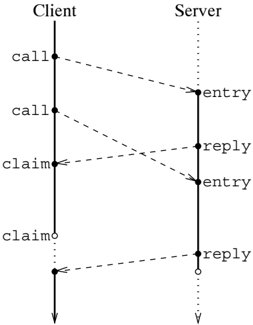

using the client-server paradigm.

## 2.5.5 Comparison of message-passing mechanisms

Given these various choices of mechanisms, it is worth comparing them (Chapter 6
contains a more technical discussion of some of these issues).

The main argument in favor of asynchronous message passing is performance; both
because the implementation overhead of the asynchronous primitives is lower, and
because the senders do not have to block. In practice, however, most uses of
asynchronous message passing involve synchronization via acknowledgement
messages (such as the fl ow-control in the producer/consumer example). This
explicit synchronization loses the advantage of lower overhead; in fact, it is
likely to be more expensive than the implicit acknowledgements provided by the
synchronous send operation. Using asynchronous messages, one can achieve
parallelism by overlapping useful computation with waiting for the
acknowledgement. This is not as big of an advantage as it may seem at fi rst for
two reasons. Often there is no suitable computation for a thread to do while
waiting for the acknowledgement, and when there are multiple threads in a
program, parallelism can be gained by running other threads. To use asynchronous
message passing correctly without acknowledgements usually requires some a
priori knowledge of the system's behavior. The main disadvantages of
asynchronous message passing are rooted in the fact that it provides very little
synchronization. Thus, the programmer is forced to implement more complicated
protocols to achieve the necessary synchronization.

Rendezvous (or blocking send), on the other hand, provides a very strong form of
synchronization; namely, the two processes involved in a rendezvous achieve
common knowledge about the communication. This property makes synchronous
message passing easier to reason about, since it avoids a kind of interference
where the state of the sender when the message is sent is different than when
the message is received. This is also re fl ected in the typical failure modes
of erroneous programs. In asynchronous systems, the typical failure mode is an
over fl ow of the memory used to buffer messages, which is likely to be far
removed in time (and possibly place) from the source of the problem. In
synchronous systems, the typical failure mode is deadlock, which is immediate
and easily detected. Thus, detecting and fi xing bugs in a synchronous
message-passing program is easier.

Occasionally the buffering provided by asynchronous message passing can be
semantically useful, such as in situations where some buffering is required to
avoid cyclic dependencies that might cause deadlock. For example, processes can
send messages to themselves via a buffered channel, which is not possible over a
synchronous channel. In these cases, however, the buffering can be easily
provided using an additional process (` a la the producer/consumer example), or
by spawning a new thread to send the message.

The main disadvantage of choosing RPC as the basic communication mechanism is
that it is asymmetric. While it makes programming client-server abstractions
easier, it does not support other styles, such as producer-consumer networks.
For this reason, and because implementing RPC using message passing is more
natural than vice versa, message passing is a better choice than RPC for the
basic communication primitive of a concurrent language.

A related issue is the choice between generalized selective communication and
the input-only form. The advantage of the input-only form is that it is fairly
easy to implement ef fi ciently, whereas the generalized form can be quite
expensive. On the other hand, the input-only form suffers from the same
asymmetry as RPC.

## 2.6 Parallel programming mechanisms

While the focus of this book is on programming with explicit concurrency, there
are some parallel programming mechanisms that are of interest later in the book.

## 2.6.1 Futures

Various parallel dialects of Lisp, such as Multilisp, provide a mechanism called
futures for specifying the parallel evaluation of expressions. Futures combine
thread creation, communication, and synchronization into a single mechanism. The
Lisp expression

```
(let
  ((x (future exp)) )
  body)
```

is evaluated by creating a placeholder (sometimes called a future cell) binding
the variable x to it, and spawning a new process to evaluate exp. Whenthe new
process has completed the evaluation of exp, it fi lls in the future cell with
the result. An attempt to access the value of x in body is called touching x,
and must synchronize on the availability of the value. If the value of x is not
available, then the touching process blocks until the evaluation of exp is
complete and the future cell has been fi lled.

Futures are not designed to support concurrent programming, rather they are
designed to be a parallel programming mechanism. Their main limitation as a
concurrent programming notation is that they only provide one chance for
communication and synchronization between the parent and child threads.
Multilisp provides shared memory and low-level locking mechanisms (essentially
test-and-set) for supporting other patterns of communication and
synchronization. Using other communication and synchronization mechanisms in
conjunction with futures can lead to problems, since some implementations
consider it optional as to whether a new thread actually gets spawned for each
future. For example, if the body of a future has code that synchronizes with its
context, this can result in deadlock if the run-time system chooses to use the
same process to evaluate both the future's body and its context.

## 2.6.2 Synchronizing shared-memory

The programming language ID-90, and its predecessors, provide synchronizing
sharedmemory for process communication and synchronization. There are two fl
avors of this: I-structures provide write-once semantics, while M-structures
allow multiple updates. 4 In both cases, the semantics are generalized to
various different classes of data structures ( e.g., vectors and tuples), but
for simplicity, we consider the case of single cells.

An I-structure cell has two states: empty and full. Unlike variables in SML
(which are also 'single assignment'), an I-structure cell is fi rst allocated
and then initialized, which allows one to build up a data structure
incrementally. In addition to creation, there are two operations on
I-structures: put, which puts a value into an empty cell, and take, which
returns the value of a full cell. Figure 2.7(a) gives the allowed state
transitions of an I-structure cell. Applying put to a full cell is a dynamic
error, while attempting a take on an empty cell causes a process to block until
the cell is full ( i.e., some other process does a put). Notice that
I-structures capture the basic synchronization mechanism of futures; completing
the evaluation of a future causes a put of the result, and a touch corresponds
to a get.

4 The 'I' stands for incremental , and the 'M' for mutable .

In this image, we can see some text and numbers.<end_of_utteranc

Flow chart

Figure 2.7: Synchronizing-memory state transitions

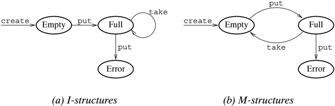

Like an I-structure, an M-structure cell also has two states ( empty and full).
The difference is that a full M-structure becomes empty when a process takes its
value (see Figure 2.7(b)). This leads to a protocol for atomic updates:
take-modify-put. If an Mstructure cell is initialized by its creator, and if
subsequent to that, every process takes the value, uses it, and then puts a new
value back, access to the value will be serialized. This is because taking the
value has the effect of locking out other processes until the cell is full
again.

A unit valued M-structure effectively implements a binary semaphore, with take
as the P operation, and put as the V operation. Exploiting this fact, we can
translate the producer/consumer buffer implementation of Listing 2.2 to one
using M-structures, which is given in Listing 2.6. We also make a slight
improvement by storing the data value in the full M-structure, instead of using
a separate reference cell.

## 2.6.3 Tuple spaces

Tuple spaces are a model of communication for parallel distributed-memory
programming. A tuple space is basically an associative memory that is shared by
the processes of a system. Unlike hardware memory, the values in a tuple space
are tuples of typed fi elds, which are similar to SML tuples. Processes
communicate by reading and writing tuple values. Reading a tuple is done by
pattern matching on a subset of the tuple's fi elds.

Tuple spaces have been popularized by the Linda family of programming languages.
The Linda languages are traditional sequential languages, such as C, extended
with a small collection of tuple-space operations. There are four basic
operations in the Linda model:

out is used to add a tuple to the tuple space.

in takes a tuple template (or pattern) as an argument, and removes a tuple that
matches the template from the tuple space, binding the values in the tuple to
the formal parameters in the template. If there is no tuple that matches the
template, then the process suspends until the in can complete.

*   rd is like in , but does not remove the tuple from the tuple space.

eval is used to add an active tuple to the tuple space. This mechanism creates a
new process that computes the active tuple value; when the process terminates,
the tuple becomes passive, and may be read by other processes.

There are also non-blocking variants of in and rd, called inp and rdp (the 'p'
suf fi x stands for polling).

Communication in Linda differs from most other distributed-memory communication
models, in that the messages ( i.e., tuples) are not directed at any particular
destination. Instead, once inserted into tuple space, a tuple can be read by any
process that executes a matching rd operation. This fl exibility of
communication is further aided by the fact that the templates used in rd
operations can have unde fi ned fi elds, called formals. A formal matches any fi
eld of the right type, no matter what its value. A formal also provides a
mechanism to bind the values in the tuple being read to local variables in the
process.

As with message passing, tuple spaces can be used directly to provide a
connection between a producer and consumer, but, as in the case of asynchronous
channels, controlfl ow must be explicitly programmed. Ensuring FIFO ordering in
tuple spaces is also a

```
m s t r u c t ( ) \

```

```
datatype 'a buffer = BUF of {
            empty : unit m_struct,
            full   : 'a m_struct
        }

        fun buffer () = let
            val empty = m_struct ()
            in
                put(empty, ());
                BUF{empty = empty, full = m_struct()}
            end

        fun insert (BUF{empty, full}, v) = (
            take empty;
            put (full, v))

        fun remove (BUF{empty, full}) = (
            (take full) before put(empty, ()))


Listing 2.6: Producer/consumer buffer implemented using M-struct
```

Listing 2.6: Producer/consumer buffer implemented using M-structures

```
fun mkBuffer () = let
            val bufName = a new buffer name
            in
            out (bufName, "empty");
            bufName
        end

    fun insert (bufName, v) = (
        in (bufName, "empty");
        out (bufName, "full", v))

    fun remove bufName = (
        in (bufName, "full"),  formal v);
        out (bufName, "empty");
        v)

string 2.7: Producer/consumer buffer implemented in Line
```

Listing 2.7: Producer/consumer buffer implemented in Linda

problem, since reading tuples is nondeterministic. FIFO ordering can be imposed
independently of fl ow-control, by including sequence numbers in the tuples,
although to support multiple producer or consumer processes requires keeping the
sequence counters in tuple space. The implementation of the one-element
producer/consumer buffer is given in Listing 2.7 and is quite simple. In this
code, v is assumed to be a local variable of the correct type. Unlike in the
message-passing case, no extra process is required for the buffer. The tuple 〈
bufName, "empty" 〉 is used to synchronize the producer and consumer; when it is
present in the tuple space, the buffer is 'empty.' The buffer name is a globally
unique value used to distinguish one buffer from another. This use of names to
tag tuples is very common in Linda. It is also one of the weaknesses of Linda as
a programming notation, since it forces the user to manage the names of the
communication channels explicitly. On the other hand, Linda does make it easy to
support a wide range of different communication patterns, such as multicast and
shared work lists.

## Notes

There are a number of good surveys of concurrent language design. Bryant and
Dennis compare a number of different concurrency mechanisms using two example
problems [BD80]. Andrews and Schneider [AS83] survey a broad range of
concurrency mechanisms. A more recent survey by Bal, Steiner, and Tanenbaum
[BST89] reviews over 90 different concurrent and distributed programming
languages, including CML 's predecessor PML [Rep88]. Wegner and Smolka compare
the use of processes and monitors to protect shared state [WS83].

There are also many books on concurrent programming. Andrews [And91] covers

concurrent programming using various different languages, as well as covering in
detail most of the issues surveyed in this chapter. Birrell gives a tutorial on
programming with threads, mutex locks, and condition variables in Modula-3
[Bir91]. A paper by Hauser et al. describes ten different paradigms of
concurrency used in two large interactive applications (one research, one
commercial) [HJT + 93]. And Gehani and McGettrick [GM88] have collected reprints
of signi fi cant papers on concurrent languages and programming (including
[AS83] and [WS83]).

There are many languages and concurrency libraries based on various
shared-memory primitives. Semaphores are often supported by operating systems as
a synchronization mechanism ( System V, Release 4 is one example [UNI90]).
Monitors were an early attempt to provide more programming language support for
shared-memory concurrency [Hoa74]. A number of languages, such as Concurrent
Pascal [Bri77], Concurrent Euclid [Hol83b], and Mesa [MMS79, LR80] provide
monitors along with condition variables. The experiences with Mesa directly in
fl uenced the language Modula2+ [RLW85] and its successor Modula-3 [Nel91],
which provide independent mutex locks instead of monitors. Following this trend,
Cooper and Morrisett, at CarnegieMellon University, have developed a concurrency
package, called ML-threads, which provides threads, mutex locks, and condition
variables for SML [CM90]. The design of ML-threads is owed to the C-threads
package [CD88], which in turn owes its design to Modula-2+. A principal
application of the ML-threads library is the construction of low-level operating
system services, which requires heavy use of shared state [CHL91]. There is also
a multiprocessor implementation of a version of ML-threads done by Morrisett and
Tolmach [MT93]. With the popularity of object-oriented sequential languages, the
monitor is making a comeback in the form of synchronizing objects, which provide
mutual exclusion in method calls. The most well-known example of this comeback
is Java [AG98], although Java confuses the issue by allowing an object's lock to
be used in other ways.

The concept of a set of sequential processes running in parallel and
communicating by synchronous message passing was introduced in a seminal paper
by Hoare [Hoa78], which described the language Communicating Sequential
Processes ( CSP). While CSP was quite limited as fi rst described (static
process creation, direct naming, and input-only guards), it has been the
inspiration for many synchronous message-passing languages. The language occam
[INM84, Bur88] is derived from CSP, but includes channels and a limited form of
dynamic process creation. The higher-order language Amber [Car86] provides
generalized selective communication on typed channels, as well as dynamic
process and channel creation. Other languages that owe an intellectual debt to
CSP include Joyce [Bri89] and Pascal-m [AB86]. A pared down version of CSP,
called TCSP, has been used for theoretical study of concurrent systems [Hoa85].

Actors are a well-known class of concurrent programming languages and systems
[Agh86]

that are based on asynchronous message passing. The concurrent language Erlang
is a dynamically typed higher-order language based on asynchronous message
passing [AVWW96] and can be viewed as an example of an actor language. It uses
dynamic direct naming to specify the destination of messages, and provides an
input-only form of selective communication that uses pattern matching to choose
between messages in a process's mailbox. Erlang was developed at the Ellemtel
Computer Science Laboratory for use in programming telephony software. The
distributed programming language SR provides both shared-memory primitives for
local concurrency, and an orthogonal collection of message-passing operations
for distributed communication (including an interrupt-driven asynchronous
receive mechanism) [AO93].

The choice between asynchronous versus synchronous message passing, and between
input-only and generalized selective communication, comes down to two issues:
performance and expressiveness. Panangaden and the author have examined the
relative expressiveness of different rendezvous primitives [PR97]. These issues
are discussed further in Chapter 6.

In the author's personal experience, synchronous message passing is an easier
framework for debugging concurrent programs. An early version of the Pegasus
system [RG86] used asynchronous message passing, but we had great dif fi culty
in debugging our programs. Our experience with implementing eXene in CML [GR91],
on the other hand, demonstrates that large synchronous message-passing programs
can be debugged fairly easily, even without debugging tools.

The term 'synchronous languages' is used to describe a family of languages that
are globally synchronous. The semantics of these languages restrict the history
of a system to a totally ordered sequence of instances at which events occur.
Because of the total ordering of events, these languages are deterministic.
Applications of synchronous languages include specifying hardware systems and
programming reactive systems. A description of four different synchronous
languages and their use in programming reactive systems is given by Halbwachs
[Hal93]. Recently, Pucella has been exploring the support of synchronous
programming in the context of SML (and CML) [Puc98].

Futures were originally developed by Halstead in Multilisp [Hal85]; they also
appear in other parallel Lisp s, such as Mul-T [KH88]. I-structures and
M-structures are from the language ID [Nik91]. Arvind, Nikhil, and Pingali
discuss the use of I-structures in parallel programs with some small example
programs [ANP89]. Barth, Nikhil, and Arvind give some examples of the use of
M-structures in ID [BNA91]. Milewski proposed a mechanism similar to
M-structures for use as an update-in-place data structure in implementations of
functional programming languages [Mil90].

The tuple spaces supported by the Linda family of languages were fi rst
described by Gelernter and Bernstein [GB82, Gel85]. Tuple spaces have been shown
to be a portable model of parallel computation, with implementations on machines
ranging from shared-

memory multiprocessors to distributed-memory multiprocessors to networks of
workstations [BCGL87]. A book by Carriero and Gelernter uses C-Linda to
illustrate parallel programming techniques [CG90]. In Chapter 9, we present a
distributed implementation of tuple spaces in the CML framework.

While most concurrent languages consist of a sequential sub-language (often a
language in its own right) extended with concurrency mechanisms, there are a few
languages that have concurrency built in from the ground up. For example, in the
language occam there are only a few sequential mechanisms, such as iteration
[INM84, Bur88]. Another example is the parallel language ID, where computation
is implicitly parallel, unless explicitly sequenced [Nik91]. An even more
extreme case is the recent experimental language Pict, in which every construct,
including both control and data structures, is expressed in terms of processes
and communication [PT97].

There are a number of different approaches to reasoning about concurrent
systems. Andrews uses axiomatic reasoning based on fi rst-order logic of
programs [And91]. While this approach is suf fi cient to prove safety
properties, a richer logic is required to prove liveness properties. Such a
logic is called a temporal logic and includes modal operators for expressing
such concepts as ' always ' and ' eventually .' Manna and Pnueli describe the
use of temporal logic for specifying reactive and concurrent systems [MP92].
Other approaches to the study of concurrency are the various process calculi
[Mil89, MPW89a, MPW89b]and process algebras [Hen88] that have been developed.
These attempt to capture the essence of concurrent computation, much the same
way that the λ -calculus captures the essence of sequential computation. While
this work is theoretically oriented, it may have an affect on the design of
future concurrent languages; for example, the experimental language Pict [PT97]
is derived from Milner's π -calculus [MPW89a, MPW89b].

Most books on concurrent programming discuss fairness, albeit in an informal
way. Kwiatkowska gives a more rigorous treatment in her survey [Kwi89], which is
the source of the taxonomy presented in Section 2.3. A wide ranging study of
fairness issues can be found in a book by Francez [Fra86]. The fairness
requirements on CML implementations are discussed in Appendix B.

## An Introduction to Concurrent ML

This chapter is the fi rst of three tutorial chapters on the basic features and
programming techniques of CML. This chapter focuses on the features that make up
CML 's semantic core. The next chapter continues with a discussion of the two
most important styles of CML programming: process networks and client-server
protocols. Chapter 5 completes the tutorial with further discussion of CML 's
synchronization and communication mechanisms.

## 3.1 Sequential programming

As is the case with most concurrent languages, CML consists of a sequential core
language - Standard ML - extended with concurrency primitives. The individual
processes in a CML program are programmed using the features of SML. 1 While we
conceptually view CML as a programming language, it is actually implemented as a
collection of modules on top of SML/NJ. The aspects of CML described in this
chapter all belong to the core structure of this library, which is named CML. To
reduce notational clutter, most of the examples in this chapter are assumed to
be given in an environment where the CML structure has been pre-opened ( i.e.,
all of its bindings are at top-level). The CML structure's interface is
described in Appendix A, which contains an abridged version of the CML Reference
Manual.

CML is a message-passing language, which means that processes are viewed as
executing in independent address spaces with their only communication being via
messages. But, since SML provides updatable references, this is a fi ction that
must be maintained by programming style and convention. It is good practice to
avoid situations where two or more threads share access to a reference or array.
Usually, this is not a signi fi cant restriction. Shared-state is most likely to
be an issue when incorporating existing sequential

1 The term ' communicating sequential processes ' is often used to describe this
style of programming.

code into a CML application, but even this situation is usually not a problem,
since the preferred ML programming style is mostly functional. Another potential
source of interference is input/output (I/O) using ML 's buffered I/O streams.
To avoid this problem, CML provides its own implementation of the SML I/O
modules. Discussion of I/O is left to Chapter 5 and the CML Reference Manual in
Appendix A.

## 3.2 Basic concurrency primitives

We start with a discussion of the basic concurrency primitives provided by CML,
which includes process creation and simple message passing via typed channels.
In keeping with the fl avor of SML, both processes and channels are created
dynamically.

## 3.2.1 Threads

Processes in CML are called threads; this choice of terminology is both to
emphasize that they are lightweight, and to distinguish between them and the
host operating system's notion of processes. When a CML program starts
executing, it consists of a single thread of control. This initial thread may
create additional threads using the spawn primitive, which has the type

```
val spawn : (unit -> unit) -> thread_id

```

The spawn function takes a function as an argument and creates a new thread of
control to evaluate the function applied to the unit value. This use of a
function as an argument is a standard technique to delay a computation in a
call-by-value language. The newly created thread is called the child, and its
creator is the parent. The return value of spawn is a thread ID that uniquely
identi fi es the child thread. 2 The child thread will run until the evaluation
of the function application is complete, at which time it terminates. CML does
not attach any semantics to the parent-child relationship. For example, the
termination of the parent thread does not affect the child - once created, the
child thread is an independent agent. In particular, this means that the initial
thread may terminate without the whole program terminating.

In addition to completing execution of its body, there are two other ways that a
thread may terminate. First, it may explicitly terminate itself by calling the
exit function, which has the type

```
val exit : unit -> 'a

```

2 See Appendix A for information on the operations on thread IDs.

Like a raise expression, the result type of exit is 'a, since it never returns.
The other way a thread may terminate is if its execution causes an exception to
be raised that is not caught by any handler. Note that such an exception is
local to the thread in which it is raised; it does not propagate to its parent.
3

Since the number of threads in a CML program is unbounded and the number of
processors on the system is limited, the processors are multiplexed among the
threads. This is handled automatically by the CML run-time system, which uses
periodic timer interrupts to provide preemptive scheduling. This is in contrast
with so-called coroutine implementations of concurrency, which require the
application programmer to ensure that each thread yields the processor at
regular intervals. Preemptive scheduling is important for program modularity,
since it allows 'off-the-shelf' sequential code, such as libraries, to be used
in concurrent programs, without having to add explicit scheduling code. As
discussed above, incorporating sequential code into a concurrent program still
requires some care, since the code may not be reentrant ( e.g., it may use
globally allocated mutable data structures).

One important property of threads in CML is that they are represented by SML
values (see Chapter 10). This has two signi fi cant consequences: fi rst, they
are extremely cheap to create and impose very little space overhead; and second,
the storage used to represent a thread is reclaimed by the garbage collector. As
we show throughout this book, these properties allow a programming style that
uses threads very liberally.

## 3.2.2 Channels

For multiple threads to be useful, they must have some mechanism for
communication and synchronization. CML provides a collection of such mechanisms,
both as primitives and as libraries. For now, we focus on the most important of
these, which is synchronous message passing on typed channels. The type
constructor

```
type 'a chan
```

is used to generate the types of channels. A channel for communicating values of
type τ has the type τ chan. Two operations are provided for channel
communication: 4

```
val recv : 'a chan -> 'a
  val send : ('a chan * 'a) -> unit

```

Message passing is synchronous, which means that both the sender and receiver
must be ready to communicate before either can proceed (see Section 2.5.2). When
a thread

3 The CML run-time system provides a mechanism for reporting the termination of
threads as a result of uncaught exceptions. This mechanism is described in the
release notes included in the distribution.

4 Earlier versions of CML used the name accept for the recv operation.

executes a send or recv on a channel, we say that it is offering communication.
The thread will block until some other thread offers a matching communication,
that is, the complementary operation on the same channel. When two threads offer
matching communications, the message is passed from the sender to the receiver
and both threads continue execution. Thus, message passing involves both
communication of data and synchronization.

Channels can be viewed as labels for rendezvous points - they do not name the
sender or receiver, and they do not specify a direction of communication. More
than one thread may attempt to send or recv a message on the same channel.
Channels are created dynamically by the function:

```
val channel : unit -> 'a chan

```

## 3.2.3 Example - Updatable storage cells

Anatural fi rst example is the implementation of updatable storage cells on top
of threads and channels. We de fi ne the following abstract interface to storage
cells:

```
signature CELL =
      sig
        type 'a cell

        val cell : 'a -> 'a cell
        val get  : 'a cell -> 'a
        val put  : ('a cell * 'a) -> unit

      end


```

The operation cell creates a new cell initialized to the given value; and the
operations get and put are used to read and update a cell's value. Our approach
is to represent the state of a cell by a thread, which we call the server, and
represent the cell type as a pair of channels for communicating with the server.
The request messages and cell type are de fi ned as follows:

```
datatype 'a request = GET | PUT of 'a

    datatype 'a cell = CELL of {
        reqCh : 'a request chan,
        replyCh : 'a chan
    }

```

The channel reqCh carries both PUT and GET client requests, and the channel
replyCh carries replies to GET requests. The client-side implementation of the
get and put operations is straightforward. Each operation requires sending the
appropriate request message, and in the case of get, accepting a reply:

Flow chart

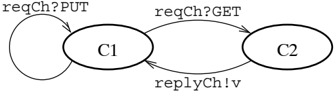

Figure 3.1: The state diagram for the cell server thread

```
fun get (CELL{reqCh, replyCh}) = (
            send (reqCh, GET);
            recv replyCh)

    fun put (CELL{reqCh, ...}, x) = send(reqCh, PUT x)

```

Note that this protocol requires that the server send a reply to any GET request
it receives. The cell function creates a new cell, which involves allocating the
two channels and spawning a new server thread, with the initial value as its
state:

```
fun cell x = let
          val reqCh = channel()
          val replyCh = channel()
          fun loop x = (case (recv reqCh)
                  of GET => (send (replyCh, x); loop x)
                  | (PUT x') => loop x'
              (* end case *)
          in
            spawn (fn () => loop x);
            CELL(reqCh = reqCh, replyCh = replyCh)
          end

vers are typically implemented as infinite loops with each iteration corresponding
```

Servers are typically implemented as in fi nite loops, with each iteration
corresponding to a single client request (or transaction). Since we are
programming in ML, we use tail recursion to code the loop ( i.e., the loop
function). These de fi nitions are collected together in the Cell structure,
which is shown in Listing 3.1.

While this example is trivial, it illustrates a number of important points. This
implementation is a prototypical example of the client-server style of
concurrent programming (see Section 2.5.4). It is often useful to view a server
as a state machine; for example, Figure 3.1 gives the state transition diagram
for the cell server thread. We use the notation channel? value for input
transitions and channel! value for output transitions ( e.g., reqCh?GET means
read a GET request from the reqCh channel). In this diagram, State C1 represents
the situation where the server is waiting for a message on the reqCh channel,
and State C2 represents the situation where a GET request has been received, and
the server is attempting to send the reply.

```
3 An Introduction to Concurrent ML

------------------------
        structure Cell  : CELL =
          struct

            datatype 'a request = GET  | PUT  of 'a

            datatype 'a cell = CELL of {
                reqCh : 'a request  chan,
                replyCh : 'a chan
            }

            fun get (CELL{reqCh, replyCh}) = (
                send (reqCh, GET));
                recv replyCh)

            fun put (CELL{reqCh, ...}, x) = send(reqCh, PUT x)

            fun cell x = let
                  val reqCh = channel()
                  val replyCh = channel()
                  fun loop x = (case (recv reqCh)
                            of GET => (send (replyCh, x); loop x)
                            | (PUT x'') => loop x'
                      (* end case *)))
                in
                    spawn (fn () => loop x);
                    CELL{reqCh = reqCh, replyCh = replyCh}
                end

          end (* Cell *)

          Listing 3.1: The complete implementation of updatable cells

```

Listing 3.1: The complete implementation of updatable cells

These kinds of state diagrams are quite useful for informal reasoning about the
behavior of a protocol. For example, the correctness of this implementation
relies on the fact that each client's GET request is answered by a server reply,
and that each client-server transaction is atomic. The latter fact is a direct
result of using synchronous message passing; once the server receives a GET
request, it will not accept another request until its reply has been received by
the client. This is illustrated in Figure 3.1 by the fact that a GET message
causes a transition to State C2, and the only way back to State C1 is by sending
the reply message. This guarantees that the transactions are serialized, and
thus that multiple clients cannot interfere, even though they share the same
request and reply channels. If send was not a blocking operation, then we would
have to add additional synchronization to guarantee that the reply to a GET
request reaches the right client.

This implementation could still be broken by a client violating the protocol (
e.g., trying to read a reply without sending a GET request). This problem is
avoided by making the cell type abstract, and restricting the user to the get
and put operations, which are

guaranteed to be well-behaved. For example, the client state transitions
associated with the get operation are

Flow chart

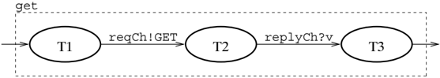

Matching the transitions in this state diagram with those in Figure 3.1 shows
that the get operation can only proceed when the server is in State C1, and that
it completes with the server back in State C1. Looking at the system as a whole,
the transitions are

<!-- formula-not-decoded -->

Thus, we see that by protecting the implementation inside an abstraction, we can
guarantee that clients use it correctly. The use of data and procedural
abstraction is an important technique in writing correct concurrent programs (or
sequential ones for that matter!).

The above example also illustrates the use of SML 's scoping and abstraction
mechanisms to implement the hiding of channels. The cell function allocates two
channels and uses lexical scoping to pass them to the server thread that it
spawns ( i.e., the channels are in the server's closure). The channels used to
communicate with the server are hidden from the client's direct access by the
use of an SML datatype to hold them, coupled with the CELL signature, which does
not expose the datatype's representation.

Another important paradigm in message-passing programs is the structuring of
computations as networks of processes. These are sometimes called data fl ow
networks, since the data fl ows from one process to another. The simplest
example of this is a pipeline, where a group of processes are arranged in series
(much like a factory assembly line). Process networks can be viewed as graphs,
where the processes are the nodes, and the channels are the edges.

A classic application of data fl ow networks is for stream processing. A stream
can be viewed as a possibly in fi nite sequence of values. For example, the
recurrence

<!-- formula-not-decoded -->

<!-- formula-not-decoded -->

de fi nes the in fi nite sequence of natural numbers. This de fi nition can be
implemented in CML as follows:

```
fun makeNatStream () = let
       val ch = channel()
       fun count i = (send(ch, i); count(i+1))
       in
         spawn (fn () => count 0);
         ch
       end
```

which has the type

```
val makeNatStream : unit -> int chan

```

Each call to makeNatStream creates a new instance of the stream of natural
numbers. Values are consumed from the stream by applying recv to the channel.

## 3.2.4 Example - Sieve of Eratosthenes

A traditional example of stream programming is computing prime numbers using the
Sieve of Eratosthenes. We start with the stream of integers beginning with 2
(the fi rst prime). To compute the primes, we fi lter out multiples of 2, which
gives a stream with 3 (the second prime) as its head. We then fi lter out
multiples of 3, giving a stream with 5 (the third prime) as its head. At each
step, we take the head of the stream (which is the next prime), and construct a
new stream by fi ltering out multiples of the prime.

The implementation of this sifting process starts with a generalization of the
natural number stream that allows us to specify the fi rst number in the
sequence. This more general function has the type

```
val counter : int -> int chan

```

The fi ltering of a stream is provided by the following function, which takes a
prime number p and an input stream as arguments, and returns an new stream with
multiples of p removed:

```
p removed:
            fun filter (p, inCh) = let
                  val outCh = channel()
                  fun loop () = let val i = recv inCh
                        in
                        if ((i mod p)  0)    then send (outCh, i) else ();
                        loop ()
                      end
                in
                spawn loop;
                outCh
            end
    Using the filter and counter functions, we can define the sieve, which creates a
```

Using the filter and counter functions, we can de fi ne the sieve, which creates
a stream of primes:

```
fun sieve () = let
            val primes = channel ()
            fun head ch = let val p = recv ch
                in
                    send (primes, p);
                    head (filter (p, ch))
                end

        in
            spawn (fn () => head (counter 2));
            primes
        end

```

In this image, we can see a diagram.<end_of_utteranc

Chemistry structure

Figure 3.2: Evaluating primes(4)

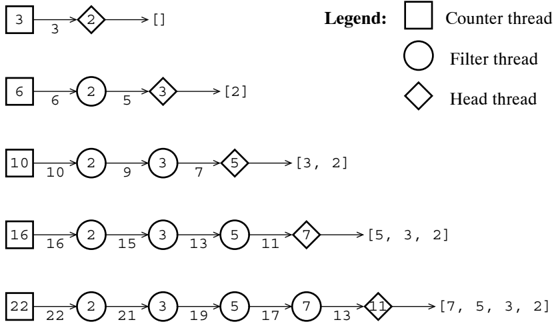

The sieve function creates a network of threads consisting of a counter thread,
which produces the stream of integers, and a chain of filter threads, which end
in a head thread. The sieve function returns the channel primes, on which the
head thread sends the stream of primes. There is one filter thread in the chain
for each prime number sent by the head thread. After the head thread sends a
prime p on the primes channel, it spawns a new filter thread to remove multiples
of p from the stream, and then reads the next prime from the channel provided by
the new filter thread.

The function primes uses the sieve function to compute a list of the fi rst n
prime numbers:

Table

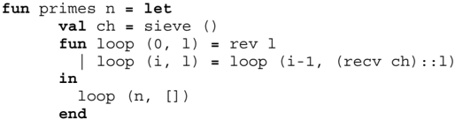

Figure 3.2 shows the state of the sieve at each iteration of evaluating
primes(4). The counter thread is represented as a square labeled by the current
counter value. The fi lters are circles labeled by their prime number, and the
head is represented by a diamond labeled with the next prime. The number
labeling an arrow between two threads is the value that the thread on the left
is offering the thread on the right.

This style of stream processing is similar to the notion of lazy streams found
in functional languages. The main difference is that there is no mechanism for
capturing an

In this image, we can see a diagram with some text and a
picture.<end_of_utteranc

Flow chart

Figure 3.3: The Fibonacci stream network

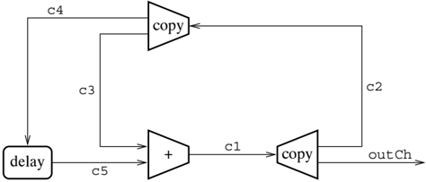

intermediate value and using it multiple times (the way one can do with a lazy
stream). The streams here are stateful, once a value is read from a stream it
cannot be read again. As we will see in the next example, we can introduce copy
nodes when we need to use a stream in multiple places.

## 3.2.5 Example - Fibonacci series

Another classic example of data fl ow programming is the Fibonacci series, which
is defi ned by the recurrence

<!-- formula-not-decoded -->

<!-- formula-not-decoded -->

Before implementing a CML program that generates this series, let us examine the
process network. Each new element in the series is computed from the two
previous elements. This means that when the value fib i is computed, it needs to
be fed back into the network for the computation of fib i +1 and fib i +2. This
will require nodes that copy their input to two output channels, and a node that
provides a one-element delay. Figure 3.3 gives a picture of this network (the
labels on the arcs correspond to the names of the channels used in the
implementation below). When the addition node (labeled by a '+') produces a
result, it is fed back into the computation of the next two elements in the
series.

As shown in Figure 3.3, we can implement the Fibonacci stream using three
general purpose data fl ow combinators: add, which adds the values from two
streams; delay, which provides a one-element delay; and copy, which copies its
input to two output

```
fun add (inCh1, inCh2, outCh) =
         forever () (fn () =>
            send (outCh, (recv inCh1) + (recv inCh2)))

    fun delay init (inCh, outCh) =
         forever init (
             fn NONE => SOME(recv inCh)
             | (SOME x) => (send(outCh, x); NONE)
             (* end fn *))

    fun copy (inCh, outCh1, outCh2) =
         forever () (fn () => let
             val x = recv inCh
             in
                send(outCh1, x); send(outCh2, x)
             end)

         Listing 3.2: Some general dataflow combinators
```

Listing 3.2: Some general data fl ow combinators

streams. Each of these combinators is implemented as an in fi nitely looping
thread; the following function is useful in constructing such threads:

```
val forever : 'a  -> ('a  -> 'a)  -> unit

```

The forever function takes two arguments: an initial state, and a function from
states to states ( forever is polymorphic in the type of states), and it spawns
a thread that repeatedly iterates the function. The implementation is

```
fun forever init f = let
           fun loop s = loop (f s)
           in
           ignore (spawn (fn () => loop init))
       end

```

It is expected that the iterated function does some form of blocking
communication. Note that we choose to ignore the thread ID of the spawned
thread, which gives forever a result type of unit.

The implementation of the combinators is given in Listing 3.2. Unlike in the
Sieve of Eratosthenes example, the node creation functions do not create their
own channels. This is because we need to construct a cyclic process network,
which would require a fi x-point operator on channel bindings. Instead, we
pre-allocate the channels and pass them in as arguments to the node creation
functions. The delay combinator is essentially the oneelement producer/consumer
buffer discussed in Chapter 2. Note that the initial state of the buffer is
speci fi ed as an argument.

The implementation of the network is essentially a direct construction of the
picture

```
----------------
        fun mkFibNetwork () = let
            val outCh = channel()
            val c1 = channel() and c2 = channel() and c3 = channel()
            val c4 = channel() and c5 = channel()
            in
              delay (SOME 0) (c4, c5);
              copy (c2, c3, c4);
              add (c3, c5, c1);
              copy (c1, c2, outCh);
              send (c1, 1);
              outCh
          end
```

Listing 3.3: Implementing the Fibonacci network

in Figure 3.3. As mentioned above, we start by allocating the channels that
connect the nodes in the network, and then we create the nodes. Listing 3.3
gives the code for this implementation; note that we use the channel names from
the fi gure in the code. The tricky part in this code is initializing the
network. We do this by initializing the delay node to 0 (one may think of this
as fib 0), and by sending the value 1 ( fib 1) on channel c1. This value then
feeds back (via c2 and c3) to be added to 0 to produce the value 1 ( fib 2).

There is a subtlety to the implementation of the Fibonacci network that is worth
examining. The correctness of this implementation depends on the order in which
the copy combinator sends messages on its two output channels, and on the order
that the add combinator receives messages on its input channels. If one were to
reverse the order of the sends on c3 and c4, the network would deadlock. The
problem is that the add node would be attempting to read a value from c3, while
the copy node would be attempting to send a value on channel c4, and the delay
node would be attempting to send a value to the add node on c5. Although careful
coding can avoid this problem in this case, a more robust solution is to make
the order of the blocking communication operations nondeterministic. This
nondeterminism can be introduced using the mechanism of selective communication
(see Section 2.5.3).

## 3.2.6 Selective communication

Selective communication is a key programming mechanism in message-passing
concurrent languages. The basic idea is to allow a thread to block on a
nondeterministic choice of several blocking communications - the fi rst
communication that becomes enabled is chosen. If two or more communications are
simultaneously enabled, then one is chosen nondeterministically. CML provides
the select operator for this purpose. This opera-

tor takes a list of communications as its argument, and blocks the calling
thread until one of the operations is enabled. For example, the add combinator
from Listing 3.2 could be recoded to use select to block on reading a value from
either inCh1 or inCh2. If it gets a value from inCh1 fi rst, then it must wait
to read a value from inCh2 (and vice versa). In CML, this is written as:

```
fun add (inCh1, inCh2, outCh) =
        forever () (fn () => let
          val (a, b) = select [
                  wrap (recvEvt inCh1, fn a => (a, recv inCh2)),
                  wrap (recvEvt inCh2, fn b => (recv inCh1, b))
              ]

        in
          send (outCh, a + b)
        end)

```

This code introduces three new CML features: the select operation selects from a
choice of communications, the recvEvt function speci fi es a recv operation
inside a select, 5 and the wrap function associates an action with a
communication operation. In this example, we are choosing between the operation
of receiving a message on inCh1 and the operation of receiving a message on
inCh2. In each case, we use wrap to associate the action of waiting for a
message on the other channel. The result of this is a pair of values, one from
each input channel, that gets summed and sent out on outCh. The body of the add
thread executes by blocking until another thread offers a matching send
operation on either inCh1 or inCh2, at which point both threads perform the
communication. For example, assume that the add thread is blocked on the select
operation, and that a thread P executes the following operation:

```
send (inCh1, 17)

```

where inCh1 is bound to the same channel in both threads. Then the add thread
receives the value 17 on inCh1, and applies the associated action function to
it; in effect, it evaluates the expression

```
(fn a => (a, recv inCh2)) 17
```

which blocks the thread until a value is available from inCh2 .

We can also select among output operations, as is illustrated by this recoding
of the copy combinator:

5 Earlier versions of CML used the name receive instead of recvEvt for this
function.

```
fun copy (inCh, outCh1, outCh2) =
            forever () (fn () => let
            val x = recv inCh
            in
                select [
                    wrap (sendEvt (outCh1, x),
                    fn () => send (outCh2, x)),
                    wrap (sendEvt (outCh2, x),
                    fn () => send (outCh1, x))
                ]
            end)

recyEvt  the sendEvt function specifies a send operation
```

Similar to recvEvt, the sendEvt function speci fi es a send operation inside a
select. 6 A select may include both input and output operations. In fact, a
thread may even offer to both send and receive a message on the same channel in
the same select, although this does not allow a thread to communicate with
itself, since select can only choose one communication.

## 3.2.7 Example - Updatable cells revisited

An alternative implementation of updatable cells provides a good example of
selective communication. Instead of using two different kinds of request
messages ( GET and PUT), we can use two different channels: one to get the
current value from the server, and one to send a new value to the server.
Listing 3.4 gives the code for this implementation (the interface is as before).
Again the server consists of a tail-recursive loop, with the cell's state as an
argument to the function and with each iteration corresponding to one client
request. In this implementation, however, the body of the loop consists of a
select operation. The server offers to either send the current value on the
getCh channel or receive a new value on the putCh channel. The get and put
operations are simply implemented as the complementary message-passing
operations on the appropriate channel.

## 3.3 First-class synchronous operations

We have seen wrap, sendEvt, and recvEvt used to form the clauses of selective
communications, but they have another important rˆ ole as part of the general
mechanism of fi rst-class synchronous operations. The basic idea is to decouple
the description of a synchronous operation ( e.g., 'send the message m on
channel c ') from the actual act of synchronizing on the operation. We introduce
a new kind of abstract value, called an event, for representing synchronous
operations. CML de fi nes the type constructor

type 'a event

6 Earlier versions of CML used the name transmit instead of sendEvt for this
function.

```
datatype 'a cell = CELL of {
            getCh: 'a chan,
            putCh: 'a chan
        }

        fun get (CELL{getCh, ...}) = recv getCh

        fun put (CELL{putCh, ...}, x) = send(putCh, x)

        fun cell x = let
                val getCh = channel()
                val putCh = channel()
                fun loop x = select [
                        wrap (sendEvt(getCh, x), fn () => loop x),
                        wrap (recvEvt, putCh, loop)
                ]
                in
                spawn (fn () => loop x);
                CELL{getCh = getCh, putCh = putCh}
            end

            Listing 3.4: Updatable cells implemented with select
```

Listing 3.4: Updatable cells implemented with select

which is used to generate the types of abstract synchronous operations. The type
τ event is the type of a synchronous operation that returns a value of type τ
when it is synchronized upon. The aforementioned selective communication
operators all produce event values. For example, sending a message returns the
type unit, so the sendEvt operator has the type

```
val sendEvt : ('a char * 'a) -> unit event

```

The argument to the chan type constructor speci fi es the type of the messages
carried by the channel, so the recvEvt operation has the type

```
val recvEvt : 'a chan -> 'a event

```

The functions sendEvt and recvEvt are called base-event constructors, because
they create event values that describe a single primitive synchronous operation.
CML follows the convention of appending the ' Evt ' suf fi x to base-event
constructor names.

The power of fi rst-class synchronous operators comes from event combinators,
which can be used to build more complicated events from the base event values.
We have already seen the wrap combinator, which has the type

```
val wrap : ('a event * ('a -> 'b) ) -> 'b event

```

The wrap combinator associates a post-synchronization action, which is called
the wrapper function, with an event value. For example, synchronizing on

```
wrap (recvEvt ch, fn x => x+1)

```

causes the thread to block until a matching communication is available on ch, at
which point it completes the communication and applies the wrapper function to
the received value ( i.e., it adds 1 to it).

This raises the question of how do threads synchronize on events? We have
already seen examples of the select operator, which has the type:

```
val select : 'a event list -> 'a
```

This takes a list of events and blocks the calling thread until one of the
events is enabled, at which point the thread synchronizes on the enabled event.
If two or more events in the list are enabled simultaneously, then one is chosen
nondeterministically. The select operator is actually syntactic sugar for the
composition of the sync operator and the choose event combinator 7

```
val select = sync o choose
```

The sync operator is the basic mechanism for synchronization in CML. It takes an
event value and synchronizes on it, returning the result. As might be expected,
sync has the type

```
val sync : 'a event -> 'a
```

The choose combinator is used to express nondeterministic choice in an event
value, and has the type

```
val choose : 'a event list -> 'a event

```

This combinator takes a list of events and returns an event that represents the
nondeterministic choice of the events. When choose is applied to the empty list,
it returns an event that can never be synchronized on; if a thread attempts to
do so, it blocks forever (likewise, executing ' select[] ' blocks the thread
forever).

As with the select operator, we can also view the message-passing operations
recv and send as the composition of sync and the corresponding event-valued
function

```
val recv = sync o recvEvt
    val send = sync o sendEvt
```

7 For performance reasons, select is actually implemented as a separate
primitive.

This illustrates the decoupling of the description of the operation ( i.e., the
values created by recvEvt and sendEvt) from the act of synchronization. A good
analogy is the use of procedural abstraction, which decouples the description of
a computation (the body of the procedure) from the act of computing (the
application of the procedure).

The purpose of this separation is to permit user-de fi ned communication and
synchronization abstractions that are ' fi rst-class citizens.' Speci fi cally,
these new abstractions can be used in the context of selective communication. We
have seen examples of using procedural abstraction to protect the integrity of
protocols (the implementation of the Cell structure in Listing 3.1, for
example). The limitation of this approach to abstraction is that the operations
( e.g., get and put) are functions, which cannot be used as clauses of a
selective communication. Procedural abstraction hides too much, because it hides
the synchronous nature of the operations. While this is not important in the
case of updatable cells, there are many examples where this limitation would be
a problem. Fortunately, by using CML 's fi rst-class synchronous operations, we
can have our abstractions and use them too!

It is worth noting that the fact that choose and select take lists of events as
arguments makes it easy to support dynamically changing communication structures
(an example of this can be found in Chapter 5). This is in contrast with most
other messagepassing languages, which support selective communication with a
select statement. Since any instance of a select statement has a fi xed number
of clauses, supporting selection from a dynamic number of communications is not
possible.

Before looking at examples of using the event constructors and combinators to
construct new synchronous abstractions, an informal discussion of their
semantics is in order. An event value can be viewed as a tree, where the leaves
are the base events ( e.g., recvEvt and sendEvt events), and the internal nodes
correspond to applications of wrap and choose. For example, consider the event
value constructed by

```
val ev = choose [
         wrap (bev1, w1),
         wrap (choose [
             w1:rap (bev2, w2),
             wrap (bev3, w3) ,
           ] , w4)
      ]

```

where the bev i are base events, and the w i are wrapper functions. This value
can be viewed as the tree in Figure 3.4. In this picture, the choose nodes are
labeled with ⊕, and the wrap nodes are labeled with the wrapper functions. We
can understand the semantics of applying sync to the event value ev in terms of
this picture. The thread blocks until one of the bev i is enabled by some other
thread offering a matching communication. At that point, the communication can
proceed, producing result () for the sender, and the sent message for the
receiver. The wrapper functions on the path from the selected

In this image, we can see a diagram.<end_of_utteranc

Flow chart

Figure 3.4: An event value tree representation

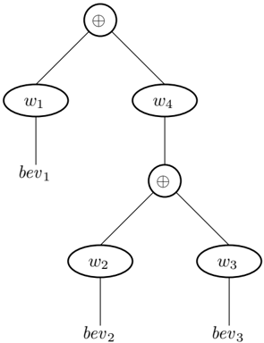

bev i to the root are then applied to the result, producing the result of the
synchronization. For example, if bev 2 is selected, with result v, then the
result of the sync is w 4 ( w 2 ( v)).

## 3.3.1 Example - Directional channels

Channels in CML are bidirectional; a thread that has access to a channel can
both send and receive messages on it. A safer discipline would be to distinguish
between input and output accesses to a channel, so that threads could be
restricted to only send or receive on a channel. Another way to think of a
channel is as a directional pipe, with each end represented by a value of a
different type. While such a view of channels could be built into the language,
in CML we can use events to provide this different style of channels as a fi
rst-class abstraction. The interface signature for directional channels is given
in Listing 3.5. Values of the in\_chan type can only be used to read messages,
and those of the out\_ch type can only be used to send messages. Both procedural
and event-valued versions of the channel operations are provided. The
implementation is very simple, and can be found in Listing 3.6; note that we use
quali fi ed names for the operations from the CML structure, since we use the
same names for the directional operations. A directional channel is represented
by two values, which share the same underlying bidirectional channel. The
communication operations are implemented directly using

```
signature DIR_CHAN =
        sig
          type 'a in_chan and 'a out_chan

          val channel : unit -> ('a in_chan * 'a out_chan)

          val recv    : 'a in_chan -> 'a
          val send     : ('a out_chan * 'a) -> unit

          val recvEvt : 'a in_chan -> 'a event
          val sendEvt : ('a out_chan * 'a) -> unit event

        end; (* DIR_CHAN *)

                  | listing 3.5: Directional channels signature
```

Listing 3.5: Directional channels signature

their bidirectional counterparts. We use SML signature matching to control
access to the underlying channel.

The importance of this example is that the event-valued operations allow
directional channels to be used in selective communications. If we were only
interested in providing the procedural operations send and recv, then we could
have implemented this abstraction without events. The problem is that send and
recv are synchronous operations, and we would like to use them in selective
communications, but the procedural

```
structure DirChan : DIR_CHAN =
  struct

    datatype 'a in_chan = IN of 'a CML.chan
    and 'a out_chan = OUT of 'a CML.chan

    fun channel () = let val ch = CML.channel()
            in
            (IN ch, OUT ch)
          end

    fun recv (IN ch) = CML.recv ch
    fun send (OUT ch, x) = CML.send(ch, x)

    fun recvEvt (IN ch) = CML.recvEvt ch
    fun sendEvt (OUT ch, x) = CML.sendEvt(ch, x)

  end;

Listing 3.6: The implementation of directional channels

```

Listing 3.6: The implementation of directional channels

```
fun cell x = let
          val (getInCh, getOutCh) = DirChan.channel()
          val (putInCh, putOutCh) = DirChan.channel()
          fun loop x = select [
                  wrap (DirChan.sendEvt(getOutCh, x),
                      fn () => loop x),
                  wrap (DirChan.recvEvt putInCh, loop)
              ]

        in
            spawn (fn () => loop x);
            (getInCh, putOutCh)
        end

    I tostring 3:7, I[nodetable.colls.immonented with directional.alphones,
```

Listing 3.7: Updatable cells implemented with directional channels

abstraction used to implement them hides too much. The abstraction provided by
events, however, allows access to the channel to be controlled, while not
disguising the fact that recvEvt and sendEvt are synchronous operations. In this
sense, the directional channel abstraction is fi rst-class, since its operations
can be used in any context that the built in channel operations can be used in.
For example, we can implement the updatable cells, using a pair of directional
channels to represent each cell. This version does not require get or put
operations; instead, we use directional nature of the channels in the return
type of cell:

```
val cell : 'a -> ('a DirChan.in_chan * 'a DirChan.out_chan)

```

The cell server must be able to handle either get or put operations at any time,
which means that selective communication is required. But since the directional
channel abstraction provides event-valued operations, there is no problem with
combining them with selective communication. Listing 3.7 gives this
implementation of the cell function. We use these directional channels again in
the next chapter.

We have seen the wrap combinator, which allows a post -synchronization action to
be associated with an event; CML also provides the guard combinator, which
allows a pre -synchronization action to be associated with an event. This is
useful to allocate resources, such as reply channels, and to initiate
communication with a server. This combinator has the type

```
val guard : (unit -> 'a event) -> 'a event

```

It takes an event-valued function, called a guard function, and makes it into an
event value; when sync is applied to a guard event, the function is fi rst
evaluated and then sync is applied to its result. Each time a thread
synchronizes on the event, the guard function is invoked.

Flow chart

Figure 3.5: A swap mismatch

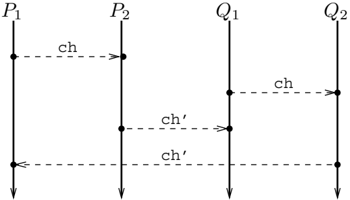

## 3.3.2 Example - Swap channels

Asimple example of a communication abstraction that uses guards in its
implementation is the swap channel. This is a new type of channel that allows
two processes to swap values when they rendezvous (one might call this symmetric
rendezvous, since there is no sender/receiver distinction). The interface
consists of an abstract type:

```
type 'a swap chan
```

and functions for creating channels and ' swap ' events:

```
val swapChannel : unit -> 'a swap_chan
    val swap         : ('a swap_chan * 'a) -> 'a event

```

When two processes communicate on a swap channel, each sends a value and each
receives a value. Implementing this correctly requires some care.

Our implementation is based on the asymmetric message passing operations, so to
ensure the symmetry of the operation, each thread in a swap must both offer to
send a message and to receive a message on the same channel. We can use the
choose combinator for this purpose. Once one thread completes a send (which
means that the other has completed an recv), we need to complete the swap, which
means sending a value in the other direction. A fi rst solution might be to use
another channel for completing the swap, but this results in a race condition
when two separate pairs of threads attempt swap operations on the same swap
channel at the same time. For example, Figure 3.5 shows what might happen if
threads P 1, P 2, Q 1, and Q 2 all attempt a swap operation on the same swap
channel at roughly the same time (where the swap channel is represented by the
channels ch and ch'). In this scenario, P 1 and P 2 are initially paired, as are
Q 1 and Q 2. But there is a race in the second phase of the swaps, and P 1 ends
up being paired with Q 2, and P 2 ends up with Q 1 (because Q 1 beats P 1 to
reading a value from ch', and P 2 beats Q 2 to sending a value on ch').

```
----------------
        datatype 'a swap_chan = SC of ('a * 'a chan) chan

        fun swapChan () = SC(channel ())

        fun swap (SC ch, msgOut) = guard (fn () => let
            val inCh = channel ()
            in
                choose [
                    wrap (recvEvt ch,
                      fn (msgIn, outCh) => (send(outCh, msgOut); msgIn)),
                    wrap (sendEvt (ch, (msgOut, inCh)),
                      fn () => recv inCh)
                ]
            end)


                    [listing 3:8: The swap channel implementation
```

Listing 3.8: The swap channel implementation

To avoid this problem, we need to allocate a fresh channel for completing the
second phase of the swap operation each time the swap operation is executed.
Listing 3.8 shows how the implementation of the swap channel abstraction can
allocate a fresh channel for each swap operation. The representation of a swap
channel is a single channel that carries both the value communicated in the fi
rst phase, and a channel for communicating the other value in the second phase.
The channel for the second phase must be allocated before the synchronization on
the fi rst message, which is the kind of situation for which guard was designed.
The guard function fi rst allocates the channel for the second phase, and then
constructs the swap event using the choose combinator. Because of the symmetry
of the operation, each side of the swap must allocate a channel, even though
only one of them will be used. Fortunately, allocating a channel is very cheap,
and the garbage collector takes care of reclaiming it after we are done.

The swap channel example illustrates several important CML programming
techniques. The use of dynamically allocating a new channel to serve as the
unique identi fi er of a transaction comes up quite often in client-server
protocols. It is also an example where the nondeterministic choice is used
inside an abstraction, which is why we have both choose and sync, instead of
just the select operator. And, lastly, this example illustrates the use of the
guard combinator.

## 3.4 Summary

This chapter has focused on a small core set of CML features: thread creation,
channel operations, and fi rst-class synchronous operations. The next chapter
continues this tutorial with a discussion of more advanced programming
techniques. CML extends

this set of primitives with additional combinators, base-event constructors, and
various miscellaneous operations. These are described in Chapter 5 and in
Appendix A.

## Notes

The use of threads and channels to implement mutable storage cells is one of a
number of examples of encoding sequential language features using concurrency.
Berry, Milner, and Turner have shown that this encoding is faithful to the
sequential semantics of references [BMT92]. Other examples include the Y
combinator [GMP89, Rep92] and various data structures [PT97]. The Y combinator
encoding leads to an implementation of reference cells without explicit
recursion [Rep92].

## CML Programming Techniques

This chapter continues the tutorial introduction to CML by examining a number of
important CML programming techniques, as well as introducing some additional CML
features. The discussion is focused around two important styles of concurrent
programming: process networks and client-server programming. We have already
seen examples of these styles, but we look at them in much greater depth here.

## 4.1 Process networks

Process networks are an important tool for structuring concurrent computations.
In the previous chapter, we saw two examples of process networks: computing
primes using the Sieve of Eratosthenes and generating the Fibonacci series. In
this section, we look at two more examples of programming in this style: merge
sort, and computing the product of two power series. Both examples illustrate
the use of recursively expanding networks, as well as further illustrating the
CML features that we have seen so far.

## 4.1.1 Example - Merge sort

Our fi rst example is concerned with sorting a fi nite sequence of integers
using merge sort. Merge sort is a divide and conquer algorithm that proceeds by
dividing its input into two equal sized sequences, recursively sorting them, and
then merging the resulting sorted sequences into a single sorted sequence. The
high-level code is

```
fun mergeSort seq = if (length seq = 1)
          then seq
          else let val (s1, s2) = split seq
          in
            merge (mergeSort s1, mergeSort s2)
          end

```

In this image, we can see a diagram with some circles and
numbers.<end_of_utteranc

Flow chart

Figure 4.1: Splitting the sequence [3,5,1,8,10]

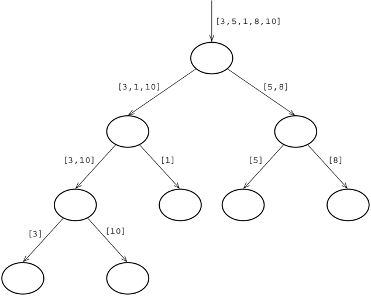

where the split operation divides the input sequence into two subsequences,
which are recursively sorted, and the merge operation merges the two sorted
subsequences.

In our CML implementation of merge sort, each recursive invocation corresponds
to a separate thread, and the sequences are represented by sequences of values
sent on a channel. Figure 4.1 shows the downward fl ow of data in the process
network when sorting the sequence [3,5,1,8,10]. Each node represents a thread,
and the edges represent the connecting channels. The edges are labeled with the
sequence that is passed from the parent to the child.

There are a couple of design details to address. The sequences are fi nite, so
we need a way to mark the end of a sequence. We do this by making the channels
carry int option values, and use NONE to represent the end of the sequence. The
other issue we need to address is the interface between a merge-sort thread and
its two children. We could use two channels for each child thread: one to pass
the subsequences from the parent down to the child, and another to pass the
sorted subsequences back up. But we can get away with just one channel for each
child by exploiting a property of the algorithm. A merge-sort thread will not
start reading the sorted subsequences until after

```
4.1. PreprocessNewOps

        fun mergeSort () = let
            val ch = channel ()
            fun sort () = (
                    case (recv ch)
                    of NONE => ()
                    | v1 => (case (recv ch)
                        of NONE => send(ch, v1)
                        | v2 => let
                            val ch1 = mergeSort()
                            val ch2 = mergeSort()
                            in
                            send (ch1, v1); send (ch2, v2);
                            split (ch, ch1, ch2);
                            merge (ch1, ch2, ch)
                            end
                    (* end case *)
                    (* end case *);
                in
                spawn sort;
                ch
            end

            Listing 4.1: The implementation of a merge-sort thread
```

Listing 4.1: The implementation of a merge-sort thread

it has completely passed both of the unsorted subsequencesto its children, and
its children must see the entire subsequence before they can pass back the
sorted subsequence. Thus, there is no danger of both the child and parent trying
to send at the same time.

With these design points decided, we can now look at the implementation. Listing
4.1 gives the code for the body of a merge-sort thread. The mergeSort function
creates a new sorting thread and returns the channel for communicating with the
thread. It has the type

```
val mergeSort : unit -> int option chan

```

The actual work is done in the sort function, which fi rst attempts to read the
fi rst two values in the sequence. If there are fewer than two values, no
sorting is required, and it just sends the sequence back. If the sequence has
two or more values in it, it recursively creates two sorting threads, with
channels ch1 and ch2 as their interfaces. It sends the fi rst two values to its
children, and then calls the function split to distribute the rest of the
incoming sequence to its children. The implementation of split is given in
Listing 4.2. This function is a good example of using the order of arguments to
encode state; it alternates between sending a value on ch1 and ch2. The fi rst
argument is the incoming value, the second argument is the channel to send the
value out on, and the third argument is the other channel. On each iteration,
split swaps the second and

```
66                  4 CML Programming Techniques

 -----------------------------------------------------------------------------
      fun split (inCh, outCh1, outCh2) = let
           fun loop (NONE, _) = (
                  send (outCh1, NONE); send (outCh2, NONE))
               | loop (out1, out2) = (
                  loop (recv inCh, out2, out1))
           in
           loop (recv inCh, outCh1, outCh2)
         end

   fun merge (inCh1, inCh2, outCh : int option chan) = let
           fun copy (fromCh, toCh) = let
                   fun loop v = (
                       send (toCh, v);
                       if (isSome v) then loop(recv fromCh) else ())
                   in
                   loop (recv fromCh)
               end
           fun merge' (from1, from2) = (
                  case (from1, from2)
                  of (NONE, NONE) => send (outCh, NONE)
                  | (_, NONE) => (
                      send (outCh, from1); copy (inCh1, outCh))
                  | (NONE, _) => (
                      send (outCh, from2); copy (inCh2, outCh))
                  | (SOME a, SOME b) =>
                      if (a < b)
                          then (
                              send (outCh, from1);
                              merge' (recv inCh1, from2))
                          else (
                              send (outCh, from2);
                              merge' (from1, recv inCh2))
                  | (* end case *)
               in
               merge' (recv inCh1, recv inCh2)
           end

      Listing 4.2: The implementation of the split and merge operations

------------------------------------------------------------------------------

```

Listing 4.2: The implementation of the split and merge operations

third arguments. When split receives the terminating NONE, it sends NONE to both
children.

Once sort has received and split its entire input, it then calls the function
merge to merge the sorted subsequences. The code for this function is also given
in Listing 4.2. The merge function takes the two input channels to merge and the
output channel for the merged sequences as arguments. Its body consists of a
loop (the merge' function), which repeatedly compares the heads of the two
subsequences, sending the smaller value on the output channel. When one of the
subsequences is exhausted, the loop continues

to copy the other. When both are exhausted, a NONE is sent on the output channel
to mark the end of the merge. Note that the merge function does not require
selective communication, because we know a priori that there will be values on
both input channels until a NONE is encountered.

## 4.1.2 Example - Power series multiplication

Our second example concerns computations on power series, which are a natural
application of stream programming. A power series

<!-- formula-not-decoded -->

can be represented as the in fi nite stream of its coef fi cients, with the
exponents implicit in the position. For notational convenience, we drop the
argument x, and write F to denote the power series F ( x). In this example, we
consider power series with rational coef fi cients, and assume the existence of
a structure named RatNum that implements a rational numbers package. While
RatNum presumably provides a full range of operations on rationals, for our
example we need only the following limited interface:

```
type rational

    val zero : rational

    val add : (rational * rational) -> rational
    val mul : (rational * rational) -> rational
```

The type rational is the representation of a rational number; the value zero is
the representation of 0 as a rational, and the functions add and mul provide
rational addition and multiplication, respectively. With this type, a power
series can be represented as a channel carrying a sequence of rational coef fi
cients. Since there is a direction to these channels, we use the directional
channel abstraction from Listing 3.5. To make the example code more concise, we
make the following local structure bindings: 1

```
structure R = RatNum
    structure DC = DirChan
```

With these bindings, the type of a power series stream is

```
type ps_stream = R.rational DC.in_chan

```

The basic structure of a power-series operation is to allocate a channel for the
result, spawn a thread to consume the inputs and calculate the result series,
and return the input end of the result channel.

1 This kind of local renaming of structures is a much better way to reduce
typing than the wanton use of open.

The fi rst power series operation that we consider is the addition of two power
series, which is achieved by pointwise addition of coef fi cients:

<!-- formula-not-decoded -->

This operation is implemented as a ps\_stream using a thread that repeatedly
reads a value from each of two input streams and sends their sum on its output
stream. As we saw in the Fibonacci example, we do not want to constrain the
order that the inputs are read. It is useful to de fi ne a general-purpose
function for combining the values from a pair of events that are synchronized in
arbitrary order:

```
fun combine f (ev1, ev2) = select [
            wrap (ev1, fn a => f (a, sync ev2)),
            wrap (ev2, fn b => f (sync ev1, b))
        ]

```

This function takes a combining function f, and two events as arguments, and
synchronizes on the choice of the two events. When one, or the other, event is
chosen, combine synchronizes on the other, and then returns the result of
applying f to the pair of synchronization results. It has the type

```
val combine : (('a * 'b) -> 'c) -> ('a event * 'b event) -> 'c
```

In addition, we use the forever function de fi ned above (page 49). The
implementation of power series addition is similar to the revised version of the
add function from the Fibonacci example

```
fun psAdd (psF, psG) = let
          val (inCh, outCh) = DC.channel ()
          fun add (f, g) = DC.send (outCh, R.add(f, g))
          in
          forever () (fn () =>
              combine add (DC.recvEvt psF, DC.recvEvt psG) );
          inCh
        end.

```

The main difference is that the psAdd function takes its input channels as
arguments, but allocates its output channel, which it returns as its result. We
structure it this way to exploit the directional nature of the channels.

Multiplying a power series by a constant is de fi ned as multiplying the coef fi
cients by the constant

<!-- formula-not-decoded -->

Implementing this as a ps\_stream is straightforward:

```
fun psMulByConst (c, psF) = let
          val (inCh, outCh) = DC.channel()
          in
          forever () (fn () =>
            DC.send (outCh, R.mul(c, DC.recv psF)));
          inCh
        end

```

Multiplying a power series by a term is slightly more complicated. We have the
de fi nition

<!-- formula-not-decoded -->

which can be viewed as the series

<!-- formula-not-decoded -->

In terms of the stream implementation, this is implemented by adding a leading 0
coef fi -cient, and then copying the rest of the stream

```
fun psMullByTerm psF = let
       val (inCh, outCh) = DC.channel ()
       fun loop () = (DC.send (outCh, DC.recv psF); loop())
       in
       spam (fn () => (
           DC.send (outCh, R.zero);
           loop()));
       inCh
     end

W.->:match: this:W:1:d:H:s:J:m:u:s:d:f:s:t:h:u:s:u:t:f:s:u:u:t:u:s:u:t:t:

```

Wenowhavethe building blocks we need for the main part of our example -
computing the product of two power series. This is a signi fi cantly more
complicated problem. The product is de fi ned as

<!-- formula-not-decoded -->

Expanding the de fi nitions gives

<!-- formula-not-decoded -->

From this we get the de fi nition of the k th coef fi cient of P :

<!-- formula-not-decoded -->

This does not map well onto our streams model, since it requires all of the
previous inputs to compute the next output. A better approach is to treat the
computation recursively. We

conste ne lall

×G

FXG

FxG

d G

FXG)

te F × C

, A

G

In this image, we can see a diagram with a square and a line.<end_of_utteranc

Flow chart

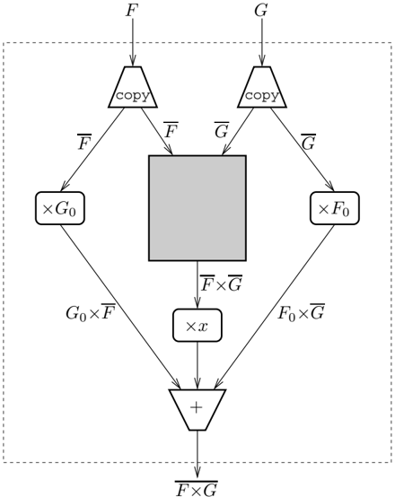

F

×

G

Figure 4.2: The process network for power-series multiplication

use the notation F for the power series that forms the tail of F; i.e., F = F 0
*   xF. We can then write the product of F and G as

<!-- formula-not-decoded -->

which gives

<!-- formula-not-decoded -->

<!-- formula-not-decoded -->

This is much more attractive. The tail of P is the sum of a constant G 0 times
the series F, a constant F 0 times the series G, and a term times the series
formed by multiplying F and G, which we know how to compute by recursion. Figure
4.2 gives the process network for this computation; the shaded box represents
the recursive invocation of the network to compute F × G. Not shown in this
picture is the reading of F 0 and G 0 from the input streams, and the output of
F 0 G 0 as the fi rst coef fi cient in F × G.

x (FxG)

P=GoF+G+

esenting F and G mus

```
fun psCopy psF = let
                val (in1, out1) = DC.channel()
                val (in2, out2) = DC.channel()
                in
                forever () (fn () => let
                    val f = DC.recv psF
                    in
                    combine (fn _ => ())
                        (DC.sendEvt(out1, f), DC.sendEvt(out2, f))
                end);
                (in1, in2)
            end;


```

Listing 4.3: Copying a power series stream

In addition to multiplication by a constant, and multiplication by a term, this
computation also needs to copy a stream into two copies. This is done by the
function psCopy, which has the type

```
val pSCopy : pS_stream -> (pS_stream * pS_stream)

```

The implementation of this function is given in Listing 4.3. Note that we again
use combine to synchronize on a pair of events in arbitrary order, although this
time the operations are outputs and the resulting unit values are discarded.

Listing 4.4 gives the code for the function psMul, which implements power series
multiplication. This function allocates its result channel, and then spawns a
thread (the function mul) to implement the network of Figure 4.2. The function
mul fi rst reads the heads of the two input streams ( f0 and g0). The product of
these two values is the fi rst element of the result stream. The remainder of
the result stream is copied from the stream psFG, which represents the
computation

<!-- formula-not-decoded -->

Note that the streams representing F and G must be copied.

An important correctness issue with recursive functions is termination. In this
case, the corresponding question is can the recursive invocation of the
multiplication network get unfolded in fi nitely deep? We are saved from this
problem by the fact that the mul function fi rst reads f0 and g0 before
recursively invoking psMul. Since communication is synchronous, the number of
recursive invocations is proportional to the number of terms of the result that
are demanded ( n values require n +6 nested invocations of the network).

Although these two examples of process networks are somewhat contrived, they
serve to illustrate many of the techniques used in constructing process networks
in CML.

```
-------------------------------------------------------------------
        fun psMul (psF, psG) = let
            val (inCh, outCh) = DC.channel()
            fun mul () = let
                val f0 = DC.recv psF
                val g0 = DC.recv psG
                val (psF', psF') = psCopy psF
                val (psG', psG') = psCopy psG
                val psFG = psAdd (
                        psMulByTerm (psMul(psF', psG')),
                        psAdd (
                            psMulByConst (f0, psG''),
                            psMulByConst (g0, psF'')))
                fun loop () = (DC.send (outCh, DC.recv psFG); loop())
                in
                DC.send (outCh, R.mul(f0, g0));
                loop ()
            end

        in
            spawn mul; inCh
        end

                Listing 4.4: Implementing power series multiplication
```

Listing 4.4: Implementing power series multiplication

Chapters 7 and 8 describe more realistic applications that are structured around
process networks.

## 4.2 Client-server programming

The client-server paradigm is a very important model for structuring CML
programs. Many applications need some notion of shared state; in a
message-passing framework, server threads provide a mechanism for mediating
access to such shared state. We have already seen simple examples of
client-server abstraction in the various versions of updatable cells. In this
section, we examine a number of additional examples of client-server protocols.

A typical client-server protocol involves a request message sent by the client
to the server, followed by a reply sent by the server to the client. In the
simplest case, the request or reply may be implicit in the synchronization. For
example, the put operation of the updatable cell example did not involve an
explicit reply from the server. The fact that the client's send operation blocks
until the server accepts it means that the send serves as its own
acknowledgement.

## 4.2.1 Example - A unique ID service

An example where the request is implicit is a unique ID server that provides
globally unique IDs (represented by integers) to clients. This service has the
following simple interface:

```
val mkUIdSrc : unit -> unit -> int

```

This function creates a fresh source of IDs, which is represented as a function.
In a sequential implementation, this would be implemented using an integer
counter stored in a reference cell

```
fun mkUUIDSrc () = let
        val cnt = ref 0
        fun next () = let val n = !cnt
                in
                cnt := n+1; n
                end
        in
        next
        end

notation is not safe for CML, since accesses to the counter
```

This implementation is not safe for CML, since accesses to the counter cnt are a
potential source of interference. For example, if two threads attempt to get
unique IDs from the same source at the same time, they might get the same IDs,
which violates the global uniqueness property that we are trying to implement.
To provide this service in CML, we need to encapsulate the state in a server
thread and use a channel to get the IDs. The function mkUIdSrc allocates a new
channel, spawns a new server, and returns a function that reads values from the
channel:

```
fun mkIdSrc () = let
        val ch = channel()
        fun loop i = (send(ch, i); loop(i+1))
        in
            spawn (fn () => loop 0);
            fn () => recv ch
        end

of using a refarraycall as a counter we keep track of the next ID as the
```

Instead of using a reference cell as a counter, we keep track of the next ID as
the argument to loop. Because communication on the channel is synchronous, we do
not need any kind of request or acknowledgement message.

Notice that the mkUIdSrc function is similar to some of the functions we used to
generate streams. Sometimes the distinction between stream-style and
client-server style programming is fuzzy.

## 4.2.2 Commit points

While one-way communication is useful in client-server implementations, a more
typical interaction involves communication in both directions ( e.g., the
storage cell in Sec-

tion 3.2.3). When presenting such a protocol as an abstract synchronous
operation, there is a question about when the client should synchronize on the
event. For example, consider the following client-side implementation of a
simple request-reply protocol:

```
fun rpc req = wrap (
        sendEvt (reqCh, req),
        fn () => recv replyCh)

```

If this is used inside a select, the decision to choose this event over another
is going to be based on whether the sendEvt event is enabled ( i.e., whether the
server is offering to accept a request). We call the sendEvt base event the
commit point (or synchronization point) of the protocol, because of its rˆ ole
in a selective communication. Once a thread has synchronized on the commit point
of a protocol, it is committed to the choice of that particular protocol.

For client-server protocols that use two-way communication, there are two
possible choices for the commit point: either the request message communication
or the reply message communication. Which is better depends on the server's
semantics and protocol. The simplest choice is to make the request be the commit
point, since this has both the client and server agreeing to the transaction up
front. We have already seen the wrap combinator used to implement this style of
protocol; in the remainder of this chapter, we look at the issues related to
making the reply be the commit point.

## 4.2.3 Guards in RPC

The guard combinator introduced in the previous chapter is an important
mechanism in the implementation of RPC-style protocols; namely, it allows a
client to send a request, and then use the acceptance of the server's reply as
the commit point. For example, the client-server protocol from above can be
recast as follows:

```
fun rpc req = guard (fn () => (
        send(reqCh, req);
        recvEvt replyCh))

```

where the guard function fi rst sends the request, and then returns the event
value for accepting the server's reply. In practice, however, there are a number
of subtleties to this kind of protocol.

When using guard to construct an event value, one must be careful to make sure
that the guard function is a 'good citizen.' It should be written so as to
execute in a bounded and reasonably short amount of time, and should not raise
exceptions. The most common problem is when a guard involves communication, such
as in the example above. Unless one has a priori knowledge that sending the
request to the server will not block for an unbounded amount of time, such as in
the case when the server is always available, one should use asynchronous
communication.

## 4.2.4 Example - A clock server

A simple example of the use of guards in a client-server protocol, where the
client synchronizes on the reply, is the implementation of a timeout mechanism
using a clock server. We want to de fi ne a module, called ClockServer, that
provides an event constructor atTimeEvt, which returns an event for
synchronizing on a speci fi ed time. This constructor has the signature

```
val atTimeEvt : Time.time -> unit event

```

The basic client-server protocol is for the client to send a request to the
clock server, which includes the wake-up time and a fresh reply channel; when
the wake-up time arrives, the server sends a message on the reply channel. The
reply channel serves as a unique identi fi er for the client's request. We use a
top-level channel for requests:

```
val timerReqCh : (time * unit char) chan
```

This channel is global in the sense that it is shared by all clients of the
server; of course, it is hidden inside the ClockServer structure, and clients
only access it via the atTimeEvt function. 2 The implementation of atTimeEvt
uses a guard function to allocate the reply channel, and send the request,
returning an event that synchronizes on the reply:

```
fun atTimeEvt t = guard (fn () => let
        val replyCh = channel()
        in
        spawn (fn () => send (timerReqCh, (t, replyCh)));
        recvEvt replyCh
      end))

```

Note that the request is sent asynchronously (by spawning a new thread to send
it).

The implementation of the clock server is given in Listing 4.5. In this fi gure,
we assume that there is a unit event called tick, which produces a
synchronization event at regular intervals (this can be viewed as a read-only
channel that provides a unit message every tick of the clock). 3

As usual, the clock server is written as a tail-recursive loop; its state is the
set of waiting threads, which is represented as a sorted list. Each element
contains the time to wake the thread, and the channel on which to send the
wake-up message. The function insert is used to insert an element into the
sorted list. The server waits on the choice of two events: either receiving a
client's request or a clock tick. When a client request

2 The initialization and management of global channels and servers requires some
special hooks. The CML Reference Manual that comes with the CML distribution
describes these in detail.

3 Such a channel does not exist in CML, but CML does directly support the
timeout mechanism described in this example (see Section 5.2.2).

```
4 CML Programming Techniques

     fun serverwaitingList = let
            fun insert (req as (t, _)), []) = [req]
            | insert (req as (t, _)), (elem as (t', _))::r) =
                if Time.< (t, t')
                then req::all
                else elem(:insect(req, r))
        fun wakeup () = let
                val now = Time.now()
                fun wake [] = []
                | wake (waiting as ((t, replyCh)::r)) =
                    if Time.< (now, t)
                    then waiting
                    else (
                        spawn (fn () => send (replyCh, ()));
                        wake r)
                in
                wake waitingList
            end

        in
            select [
                wrap (recvEvt timerReqCh,
                fn req => server (insert (req, waitingList))),
                wrap (tick,
                fn () => server (wakeup ())
                ]
            end


                Listing 4.5: The clock server implementation
```

Listing 4.5: The clock server implementation

is received, it is inserted into the waiting list. When a clock tick occurs, the
server calls the wakeup function, which gets the current time and sends wake-up
messages to those clients whose time has come.

The sending of the wake-up messages must be done asynchronously, because the
client may have been synchronizing on the choice of an atTimeEvt event and some
other synchronous operation. If the other operation is chosen before the speci
fi ed time, then the client will never accept the wake-up message, and the
thread that sends the wake-up message will deadlock. Therefore, the wakeup
function spawns a new thread to send the wake-up message. Figure 4.3 shows the
two possible histories for an interaction between a client and the clock-server.
We assume that the client has executed the expression

```
select [ev, atTimeEv t]

```

where ev is some other synchronous event. In these pictures, the jagged arrows
represent spawning a thread, the open square is the beginning of a thread's
execution, and the fi lled square represents a thread's termination. In Figure
4.3(a), the waiting time occurs before the event ev was enabled, and the client
receives the wake-up message. On the

In this image, we can see a diagram.<end_of_utteranc

Engineering drawing

(a) The client times out

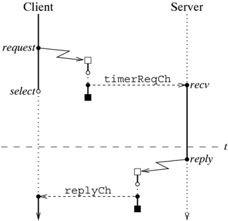

In this image, we can see a diagram.<end_of_utteranc

Engineering drawing

(b) The client selects some other event ev

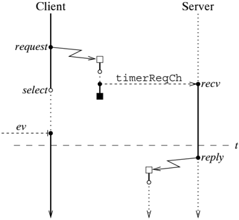

Figure 4.3: Clock-server histories

client's history, the label request is the point at which the atTimeEvt guard
function is evaluated, and the label select is where it starts waiting for the
base events that make up the choice. The other scenario, which is depicted in
Figure 4.3(b), is where the event ev becomes enabled and is chosen before time t
occurs. Note that the thread spawned by the server is blocked forever, since the
client selected ev and will not accept the reply.

One might be concerned that this implementation has a space leak, since each
time a client thread chooses some other event, there is a reply thread left
blocked forever. In CML, however, these blocked threads are not a problem
because they will be automatically garbage collected. When a thread is blocked
waiting for a synchronous operation to be enabled, its state is only reachable
through the data structures associated with the operation ( e.g., through the
channel waiting queue, when the thread is sending a message). If those data
structures are not reachable from some active thread, then both they, and the
blocked thread, will be garbage collected. In this example, since neither the
client nor the server has a reference to the channel that was allocated for the
reply, both it and the thread spawned by the server to send the reply will be
garbage collected. This style of speculatively spawning threads to send
communication that might never be accepted is an important CML programming
technique.

## 4.2.5 Negative acknowledgements

The clock server example has the property that the server is idempotent; i.e.,
that the handling of a given request is independent of other requests. Thus,
using a new thread to send a reply is suf fi cient to protect the server against
the situation in which the client selects some other event. For some services,
however, this is not suf fi cient; the server needs to know whether to commit or
abort the transaction. The synchronization involved in sending the reply allows
the server to know when the client has committed to the transaction, but there
is no way to know when the client has aborted the transaction by selecting some
other event. While a timeout on the reply might work in some situations, the
absence of a reply does not guarantee that the client has selected some other
event; the client might just be slow. To ensure the correct semantics, we need a
mechanism for negative acknowledgements. The following event combinator provides
such a mechanism:

```
val withBlack : (unit event -> 'a event) -> 'a event

```

This combinator behaves like guard, in that it takes a function whose evaluation
is delayed until synchronization time, and returns it as an event value. The
main difference is that at synchronization time, the guard function is applied
to an abort event, which is enabled only if some other event is selected in the
synchronization.

To make the workings of negative acknowledgements more concrete, consider the
following simple use of withNack:

```
fun mkEvent (ev, ackMsg, nackMsg) = withNack (fn nack => (
        spawn (fn () => (sync nack; TextIO.print nackMsg)) ;
        wrap(ev, fn _ => TextIO.print ackMsg))

```

This function takes an event, and returns one that will print the message
ackMsg, if it is chosen, and the message nackMsg if another event is chosen.
Printing the acknowledgement is easy mkEvent wraps the event with a wrapper
function that prints ackMsg. To print the negative acknowledgement message,
mkEvent spawns a thread that waits for the negative acknowledgement event nack
and then prints nackMsg. If the event is chosen, then the nack event will never
be enabled, and thus the nackMsg will not be printed (instead, the thread will
be garbage collected). For example, consider what happens if ch2 is chosen when
executing the following synchronization:

```
select [
        mkEvent (recvEvt ch1, "ch1\n", "not ch1\n"),
        mkEvent (recvEvt ch2, "ch2\n", "not ch2\n")
    ]

```

This will cause the messages ' ch2 ' and ' not ch1 ' to be printed (the actual
order of the messages is nondeterministic).

There are a couple of points about withNack that are worth clari fi cation. Let
ev be an event value constructed by applying withNack to a guard function g.
Then, each time ev is involved in a synchronization, g will be applied to a
fresh abort event. This property holds even in situations such as

```
select [ev, ev]
```

where there are multiple instances of ev in a single synchronization. In this
case, each instance of ev has its own abort event. If the event value returned
by withNack is composed of the choice of several base events, then the abort
event is only enabled if none of the base events is chosen.

## 4.2.6 Example - Lock server

To illustrate the use of withNack, we present the implementation of a lock
server. This service provides a collection of locks that can be acquired or
released (much like mutex locks). The interface is

```
type lock

    val acquireLockEvt : lock -> unit event
    val releaseLock     : lock -> unit

```

where the abstract type lock represents a lock identi fi er. For purposes of
this example, we ignore the question of how lock names are created.

If a client attempts to acquire a lock that is held, then it must wait until the
holder of the lock releases it. Since a client may not want to wait inde fi
nitely, the acquireLockEvt function is event-valued so that it can be used in
selective communication (with a timeout, for example). This is clearly a case
where we want to synchronize on the acquiring of the lock, rather than on the
sending of the request. Thus, we need to use a guard function to send the
request, and return an event that represents the acquisition of the lock.

The server maintains a set of locks that are currently held; for each lock in
the set, it keeps a queue of pending requests for the lock. When a lock is
released, the next requesting thread on the queue gets the lock. There is a
subtlety to the servicing of pending requests. Consider the case where a client
A requests a lock l that is held by some other thread B. By the time B releases
l, A may no longer be interested in it ( e.g., its attempt to synchronize on
acquiring the lock may have timed out). In this case, if the server still thinks
that A wants the lock l, it will assign l to A, resulting in starvation for any
future attempt to acquire the lock. Clearly, this situation is a problem - we
need to structure the protocol so that the server gets the negative information
that the requesting client is no longer interested in the lock. This problem is
what withNack is designed to solve.

The lock type is represented by integer lock IDs wrapped by a datatype
constructor:

```
datatype: lock = LOCK of int

```

We assume that there is some mechanism for generating the lock IDs, such as an
instance of the unique ID server from above. As with the clock server, we use a
top-level channel, called reqCh, for sending requests to the lock server. There
are two kinds of request messages, corresponding to the two operations:

```
datatype req_msg
      = AQC of {
          lock      : int,
          replyCh  : unit chan,
          abortEvt : unit event
        }
    | REL of int
```

In these messages, we strip off the LOCK constructor and just send the integer
ID of the lock.

The client-side implementation of the acquireLockEvt operation is implemented
using withNack applied to a guard function:

```
fun acquireLockEvt (LOCK id) = withNack (fn nack => let
        val replyCh = channel()
        in
          spawn (fn () => send (reqCh, ACQ{
              lock= id, replyCh= replyCh, abortEvt= nack
            }));
        recvEvt replyCh
      end))

```

4Tha Int DinaryMon drupture providec o fon

```
4.2 Client-server-programming
                             81

-------------------------------------------------------------------------------
    structure M = IntBinaryMap

    fun mkLockServer () = let
            fun replyToAcquire (replyCh, abortEvt) = select [
                    wrap (sendEvt(replyCh, ()), fn () => true),
                    wrap (abortEvt, fn () => false)
                ]
            fun server locks = (case (recv reqCh)
                of (ACQ{lock, replyCh, abortEvt}) => (
                    case M.find(locks, lock)
                    of NONE =>
                            if (replyToAcquire (replyCh, abortEvt))
                            then server (M.insert(locks, lock, ref[])
                            else server locks
                        | (SOME pending) => (
                            pending := !pending @ [(replyCh, abortEvt)];
                            server locks)
                    (* end case *)
            | (REL lock) => let
                    val (locks', pending) = M.remove(locks, lock)
                    fun assign [] = locks'
                    | assign (req::r) = if (replyToAcquire req)
                        then (pending := r; locks)
                        else assign r
                    in
                        server (assign (!pending))
                    end
                (* end case *))
            in
            spawn (fn () => server(M.empty)); ()
            end


                    Listing 4.6: The lock server implementation

-------------------------------------------------------------------------------

```

Listing 4.6: The lock server implementation

The guard function allocates a channel for the server's reply, and sends an ACQ
request message, containing the lock's ID, the reply channel, and the abort
event, to the server. The guard function returns the reply event. The
client-side implementation of the releaseLock operation is trivial:

```
fun releaseLock (LOCK id) = send (reqCh, REL id)
```

The implementation of the lock server is given in Listing 4.6. The server's
state is represented by fi nite map from lock IDs to queues of pending acquire
requests. We use the SML/NJ Library's IntBinaryMap structure to implement the fi
nite map. 4 The ID map has the type

4 The IntBinaryMap structure provides a functional implementation of fi nite
maps with integer keys.

```
(unit chan * unit event) list ref IntBinaryMap.map

```

where each pending acquire request is represented by the pair of the reply
channel and abort event. We use a reference to a list to represent the pending
request queue, because it simpli fi es the code for inserting and removing
requests for held locks.

Whenan ACQ request comes in, the server checks to see if the lock is held (
i.e., if it is in the domain of locks). If so, the request is added to the end
of the pending request queue for the lock; otherwise, the server attempts to
assign the lock to the requesting client by calling replyToAcquire. This
function synchronizes on the choice of the client accepting the reply and the
transaction's abort event. We are guaranteed that exactly one of these events
will be enabled. 5 The function replyToAcquire returns true if the transaction
commits, and false if it aborts.

When a REL request comes in, the server checks to see if there are any pending
acquire requests for the lock. If there are no pending requests, then the lock
is released by removing it from locks. In the case that there are pending
acquire requests, the server attempts to assign the lock to the next pending
request in the queue. The recursive function assign repeatedly attempts this
until either a client commits to acquiring the lock or the queue is exhausted.
In the latter case, the lock is released.

Figure 4.4 shows process histories for the two scenarios that an interaction
between a client and the lock server might follow. We assume that the client has
executed the expression

```
select [ev, acquireLockEv l]

```

where ev is some other synchronous event, such as a timeout. The picture in
Figure 4.4(a) shows the history when the client successfully acquires the lock.
The history when the client selects some other event and the transaction is
aborted is shown in Figure 4.4(b). The diagonal dashed arrow represents the
enabling of the abort event.

## Notes

The structuring of programs using streams dates back to Landin [Lan65]. Abelson
and Sussman discuss the use of streams for programming a number of problems
[ASS85]. The realization of streams programs as process networks can be traced
to a seminal paper by Kahn and MacQueen [KM77]; for this reason, these are often
called Kahn-MacQueen networks. The use of process networks to implement power
series computations was suggested by Kahn and MacQueen, but not described in any
detail. The presentation here is owed to McIlroy, who described implementations
of power series multiplication

5 This guarantee assumes well-behaved guards in the client's synchronization
expression.

In this image, we can see a diagram.<end_of_utteranc

Engineering drawing

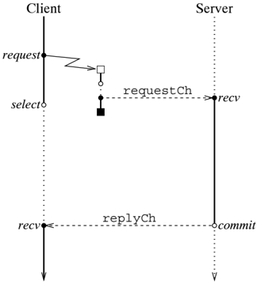

(a)

The client commits

In this image, we can see a diagram.<end_of_utteranc

Engineering drawing

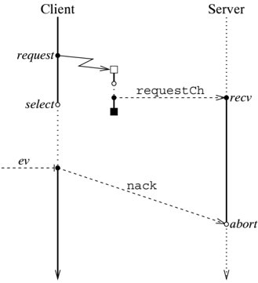

(b)

The client aborts

Figure 4.4: The commit/abort lock server histories

and a number of additional power series computations, such as composition and
exponentiation [McI90], using the language newsqueak [Pik89b]. ˇ Cubri´ c has
developed a library package on top of CML for data fl ow programming
[ ˇ Cub94b, ˇ Cub94a]. The main focus of her work is the use of data fl ow to
implement DSP (Digital Signal Processing) applications.

Earlier versions of CML [Rep91a] provided support for negative acknowledgements
in the form of the event combinator wrapAbort, which has the type

```
val wrapAbort : ('a event * (unit -> unit)) -> 'a event

```

This function takes an event value ev and an abort action as arguments, and
returns an event ev'. Whenever a thread synchronizes on a choice of events that
includes ev', and chooses some other event, a thread is spawned that executes
the abort action. We can de fi ne this combinator in terms of withNack

```
fun wrapAbort (ev, abortFn) = withNack (fn nack => (
        spawn (fn () => (sync nack; abortFn())));
        ev))

```

It is also possible to implement withNack using wrapAbort. The main reason for
favoring withNack is that it more closely matches common usage. Most uses of
wrapAbort involved abort actions that consisted solely of sending a negative
acknowledgement message.

The lock server example in Section 4.2 was motivated by Gehani and Roome's
description of a Concurrent C implementation of a similar server [GR86]. Their
implementation uses the conditional accept mechanism of Concurrent C to accept
only requests for locks that are free. This mechanism is necessary because in
Concurrent C the client can synchronize only on the server accepting the
request, and not on the server's reply. Chapter 5 of the author's dissertation
describes an implementation of Concurrent C 's conditional entry mechanism using
CML primitives, and presents a version of the lock server built using it
[Rep92].

## Synchronization and Communication Mechanisms

In the previous two chapters, we have studied CML as a message-passing language.
While this is the most natural model of CML programming, we can also view it as
a language for programming synchronization. CML 's event values provide a
uniform framework for incorporating a range of synchronous operations. Some are
implemented as primitives in the CML, while others are provided by libraries,
and still others are de fi ned by the application programmer. Independent of
their implementation, however, these operations all fi t into the same uniform
framework of event values. In this chapter, we examine a variety of
synchronization mechanisms in the context of CML.

## 5.1 Other base-event constructors

So far, we have seen event constructors for synchronous message passing, but
there are a number of other constructors. The simplest of these is the
event-valued constant never, which has the type

<!-- formula-not-decoded -->

This value will never be enabled for synchronization (it is equivalent to the
expression ' choose[] '), and is the identity for the choose combinator.

The alwaysEvt constructor is used to build an event-value that is always
available for synchronization. It has the type

```
val alwaysEvt : 'a -> 'a event
```

When applied to a value v, it returns an event value that is always enabled for
synchronization with the result v. For example, an in fi nite stream of 1 s can
be implemented as

```
val ones = always 1

```

## Synchronization and Communication Mechanisms

In the previous two chapters, we have studied CML as a message-passing language.
While this is the most natural model of CML programming, we can also view it as
a language for programming synchronization. CML 's event values provide a
uniform framework for incorporating a range of synchronous operations. Some are
implemented as primitives in the CML, while others are provided by libraries,
and still others are de fi ned by the application programmer. Independent of
their implementation, however, these operations all fi t into the same uniform
framework of event values. In this chapter, we examine a variety of
synchronization mechanisms in the context of CML.

## 5.1 Other base-event constructors

So far, we have seen event constructors for synchronous message passing, but
there are a number of other constructors. The simplest of these is the
event-valued constant never, which has the type

<!-- formula-not-decoded -->

This value will never be enabled for synchronization (it is equivalent to the
expression ' choose[] '), and is the identity for the choose combinator.

The alwaysEvt constructor is used to build an event-value that is always
available for synchronization. It has the type

```
val alwaysEvt : 'a -> 'a event
```

When applied to a value v, it returns an event value that is always enabled for
synchronization with the result v. For example, an in fi nite stream of 1 s can
be implemented as

```
val ones = always 1

```

Note that using alwaysEvt in a choice does not provide a reliable polling
mechanism. For example, the following function does not poll a channel for input
accurately:

```
fun pollCh ch = select [
            alwaysEvt NONE,
            wrap (recvEvt ch, SOME)
        ]

```

Although it will never block, it may return NONE even when there is a matching
communication available on ch. This result is because there is no priority
ordering of base events and the alwaysEvt might be chosen over the recvEvt.

In general, polling is the wrong technique to use in CML. It is much simpler,
and more ef fi cient, to use selective communication and additional threads of
control. There are some protocols, however, where polling for the availability
of a communication may improve ef fi ciency. One example is the implementation
of asynchronous RPC (or promises) in a distributed setting (see Section 2.5.4).
This mechanism might have the interface

```
val promiseEvt : t -> s event

```

where ' t ' is the argument type and ' s ' is the result type of the RPC. The
result of calling promiseEvt is an event value that represents the promise of a
reply from the server. 1 The basic implementation of this might consist of a
client-side buffer thread that collects requests and occasionally forwards them
to the remote server. The reason that we do not transmit each request directly
to the remote server is that by batching the messages, we can reduce system call
overhead and make better use of network bandwidth. The buffer thread is also
responsible for forwarding the server's replies to the clients. A possible
communication pattern for this implementation is given in Figure 5.1. Notice
that if the client thread synchronizes on the promise before the buffer thread
has forwarded the requests, it will have to wait longer than necessary. We can
avoid this inef fi ciency by polling for the reply in the event value that
represents the promise. The following is a sketch of how this might be
implemented:

```
fun promiseEvt x = let
              val replyCh = channel ()
              in
                request (x, replyCh);
                guard (fn () => (case (recvPoll) replyCh)
                    of NONE => (flush(); recvEvt replyCh)
                    | (SOME y) => alwaysEvt y
                  (* end case *))
            end

is example the request function is used to initiate the RPC by sending the a
```

In this example, the request function is used to initiate the RPC by sending the
argument to the buffer thread, and the flush function is used to tell the buffer
thread to fl ush

1 Note that unlike some of the other client-server examples we have seen, each
synchronization on the promise event does not result in another request.

Note that many of the communication mechan

In this image, we can see a diagram. There are two lines, one is connected with
the other. We can also see a text.<end_of_utteranc

Engineering drawing

Figure 5.1: Asynchronous remote procedure call

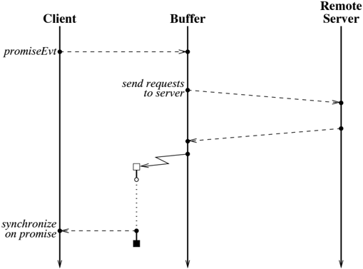

messages to the server. The recvPoll function is provided by CML, and has the
type

<!-- formula-not-decoded -->

Notice that in the case where the reply is available already, we use alwaysEvt
to turn the reply into an event value. 2

## 5.2 External synchronous events

In Chapter 1, we argued that concurrency was necessary to handle external
synchronous events, but, so far, we have not seen how these external events
manifest themselves in CML programs. In this section, we describe the CML
interface to various kinds of external synchronous events. Again, we exploit fi
rst-class synchronous operations to treat these in the same framework as
internal synchronization.

## 5.2.1 Input/output

An important form of external event is the availability of user input. The SML
Basis Library organizes the portable I/O interface into three levels:

2 Note that many of the communication mechanisms provide a primitive polling
operation; see Appendix A for details.

1.  Primitive I/O - provides readers and writers, which are an abstraction of the
   underlying operating system's unbuffered I/O operations.
2.  Stream I/O -provides functional input streams and buffered output streams.
3.  Imperative I/O -provides dynamically redirectable input and output streams.

In addition, there are operating system speci fi c I/O operations. CML supports
eventbased input operations at every level of I/O, including the operating
system speci fi c operations.

CML extends the SML Basis Library stream and imperative I/O interfaces with
eventvalue constructors for the input operations. 3 The CML versions of these
signatures match the corresponding SML signatures, which supports easier reuse
of code between CML and SML. At the primitive I/O level, the CML interface is
not compatible with the SML interface - the main difference is that the
non-blocking I/O operations in the readers and writers are replaced with
event-value constructors. CML also provides a mechanism for making a text input
or output stream from a string-valued channel.

The availability of event constructors for input operations allows threads to
combine them with other synchronous operations. For example, one could read a
user-supplied input, such as a password, with a time limit using the following
function:

```
fun inputOrTimeOut timeLimit = select [
            wrap (timeOutEvt timeLimit, fn () => NONE),
            wrap (TextIO.inputLineEvt TextIO.stdin, SOME)
        ]

```

The timeOutEvt constructor is described in the next section.

CML does not provide event-value constructors for imperative and stream-level
output operations, since output streams are buffered. At the primitive I/O
level, however, there are event-value constructors for output operations, but
synchronization on output is only useful for devices with fl ow-control.

## 5.2.2 Timeouts

Timeouts are another important example of external synchronous events. Most
concurrent languages provide special mechanisms for 'timing out' on a blocking
operation; in CML this notion fi ts naturally into the framework of events. CML
provides two event constructors for synchronizing on time events: 4

```
val timeOutEvt : Time.time -> unit event
    val atTimeEvt : Time.time -> unit event
```

3 The text versions of these extensions are described in Appendix A.

4 In earlier versions, these were called timeout and waitUntil .

The timeOutEvt constructor returns an event for synchronizing on a time that is
relative to time at which synchronization is performed. For example, the
following code delays the calling thread for one second:

```
sync (timeOutEvt (Time,fromSeconds 1) )

```

The atTimeEvt constructor is used to synchronize on an absolute time.

Synchronization on time values is, by necessity, approximate. The granularity of
the underlying system's clock, scheduling delays in the underlying operating
system, and delays in the CML scheduler tend to delay synchronization on a time
value slightly. For example, consider the following code for advancing the
display of a clock face:

```
fun loop () = (
        sync (timeOutEvt (Time.fromSeconds 60));
        advanceClock();
        loop())
```

Because of the possible delays in resuming the thread, the clock face would
slowly lose time. To avoid this kind of problem, one should use atTimeEvt when
the application is sensitive to clock drift.

Whenusing a timeout in conjunction with other synchronizations, some thought
should be given to the desired semantics. For example, consider the buffer
thread in the implementation of promises given in Section 5.1. We might program
the main loop of this thread as follows:

```
fun loop msgs = select [
            wrap (timeOutEvt tq,
                fn () => (flushMsgs msgs; loop [])),
            wrap (recvEvt recvCh,
                fn (MSG m) => loop (m :: msgs)
                | FLUSH => (flushMsgs msgs; loop [])
        ]

```

where the value tq is the amount of time to wait before sending data over the
network, the function flushMsgs sends the messages over the network, and reqCh
is the channel on which new messages ( MSG) and fl ush requests ( FLUSH) arrive.
The problem with this implementation is that the timeout gets reset each time a
new message comes in, which will delay the sending of messages over the network.
In fact, if new messages arrive at a rate that is greater than 1 tq, then the
messages will never be sent (unless a FLUSH request comes in). To avoid this
problem, we could use the atTimeEvt constructor, or we could use a separate
timer thread. We chose the latter in the following code:

```
fun loop () = let
          fun timerThread () = (sync(timeOutEvt tq); send(reqCh, FLUSH))
          fun empty () = (case (recv reqCh)
                  of (MSG m) => (spawn timerThread; nonempty [m])
                  | FLUSH => msgs)
                  (* end case *)
          and nonempty msgs = (case (recv reqCh)
                  of (MSG m) => nonempty (m :: msgs)
                  | FLUSH => (flushMsgs msgs; empty())
                  (* end case *))
          in
            empty ()
          end

In this code, whenever a message is received when the buffer is empty, a new timer
```

In this code, whenever a message is received when the buffer is empty, a new
timer thread is spawned. This ensures that a message will have to wait no longer
than the time speci fi ed by tq before being sent over the network.

## 5.2.3 Signals

Signals are a mechanism for presenting external events to a UNIX process. While
they are OS-speci fi c, a small subset of them have equivalents on almost every
modern operating system. These include alarms, keyboard interrupts, program
termination, and a signal from the run-time system notifying the application
that a garbage collection has occurred. Since CML already provides a timeout
mechanism, it only provides interrupt ( sigINT), termination ( sigTERM), and
garbage collection ( sigGC) signals. 5 Signals are delivered to the CML
application as a buffered stream of messages. Whether a signal is actually
delivered to an application depends on the signal's state, which can be handled,
ignored, or default. In the handled case, when a signal occurs, it is sent on
the appropriate signal stream. If a signal is being ignored, then no action is
taken when it occurs. The default action depends on the operating system and the
signal, but it will either be to ignore the signal or to terminate the program.

For example, an application may wish to print a message and terminate upon
receiving a sigINT signal. The following initialization code enables this
behavior:

```
a sig INT signal. The following initialization code enables this behavior:
            let fun handler () = let
                  val strm = Signals.signalStream()
                  in
                  Signals.setHandler (Signals.sigINT, Signals.HANDLE strm);
                  Signals.recvSig strm;
                  TextIO.print "[Interrupt]\n";
                  OS.Process.exit OS.Process.failure
                end
          in
          spawn handler
        end

      -------------------

```

5 On some operating systems, such as UNIX, a larger collection of signals is
supported. The details are in the documentation distributed with the CML
software.

The handler thread works by creating a new signal stream and installing it as
the stream for sigINT. It then waits for a signal on the stream, and then
terminates the program with a failure status code. For further information about
CML 's signal mechanism, see the documentation distributed with the CML
software.

## 5.3 Synchronizing shared-memory

Synchronizing shared-memory provides an attractive alternative to traditional
sharedmemory mechanisms, since it couples synchronization with memory access.
Because of the synchronous aspect of memory accesses, synchronizing
shared-memory fi ts into the CML framework in a natural way. In this section, we
fi rst show how M-structure cells, which we call M-variables, can be implemented
as an abstraction. CML provides both M-variables and I-variables, and we
describe uses of these in Section 5.3.2.

## 5.3.1 Implementing M-variables

We have seen threads used to hold the state of an updatable cell. This technique
can also be used to implement synchronizing memory, such as an M-structure cell.
Recall from Section 2.6.2 that M-structure cells are either empty or full, and
that the take operation blocks until the cell is full, and that attempting to
put a value into a full cell is an error. The interface is as follows:

```
type 'a mvar

        val mVar : unit -> 'a mvar

        exception Put

        val mTakeEvt : 'a mvar -> 'a event
        val mPut      : ('a mvar * 'a) -> unit

public aro.arooted in on.empty.stdio.The.toko.operation is cump
```

M-variable cells are created in an empty state. The take operation is supported
by the event-value constructor mTakeEvt, since it may block, and the mPut
operation raises the Put exception when the cell is already full.

The implementation of this abstraction is given in Listing 5.1. The mvar type is
an abstraction of a set of channels for communicating with the server. The getCh
channel is used to take values from the server, and the putCh and ackCh channels
are used to implement that mPut operation. The mvar function creates the
M-variable server and allocates the channels for communicating with clients. The
server implementation follows the state machine described in Figure 2.7(b) (page
33), with the exception that there is no error state. The mutually recursive
functions empty and full represent the two states of the M-variable. In the
empty state, the server will only accept a mPut operation; when it does so, it
sends a true acknowledgement and becomes full. In

```
5 Synchronization and Communication Mechanisms


-----------------------------------------------------------------------------
        datatype 'a mvar = MV of {
            takeCh : 'a chan,
            putCh : 'a chan,
            ackCh : bool chan
          }

        fun mVar () = let
                val takeCh = channel()
                val putCh = channel()
                val ackCh = channel()
                fun empty () = let val x = recv putCh
                        in
                            send (ackCh, true);
                            full x
                    end
                and full x = select [
                        wrap (sendEvt(takeCh, x), empty),
                        wrap (recvEvt putCh,
                           fn _ => (send(ackCh, false); full x))
                    ]
                in
                    spawn empty;
                    MV{ takeCh = takeCh, putCh = putCh, ackCh = ackCh }
                end

        fun mTakeEvt (MV{takeCh, ...}) = recvEvt takeCh

        exception Put

        fun mPut (MV{putCh, ackCh, ...}, x) = (
                send (putCh, x);
                if (recv ackCh) then () else raise Put)

                        Listing 5.1: The M-variable implementation

```

Listing 5.1: The M-variable implementation

the full state, the server offers its contents on the getCh; when this is taken,
the server becomes empty again. The server will also accept a put request when
full, but in this case it sends a false acknowledgement and does not change its
state.

The mTake operation is very simple: it just attempts to read a value from the
getCh channel. Effectively, this implementation uses the channel's waiting queue
to manage waiting threads. The mPut operation involves communication in both
directions: the client fi rst sends a put request, and then accepts an
acknowledgement. If the acknowledgement is true, the cell was empty and the mPut
operation succeeded, but if the acknowledgement is false, then the cell was full
and the Put exception is raised.

```
exception Put

    type 'a ivar

    val iVar      : unit -> 'a ivar
    val iPut      : ('a ivar * 'a) -> unit
    val iGet      : 'a ivar -> 'a
    val iGetEvt  : 'a ivar -> 'a CML.event
    val iGetPoll : 'a ivar -> 'a option
    val sameIVar : ('a ivar * 'a ivar) -> bool
```

Listing 5.2: I-variable operations

## 5.3.2 Synchronous variables in CML

CML provides 'variables' with I-structure and M-structure semantics; these can
be found in the SyncVar structure (see Appendix A for the full interface). While
we have seen how these objects can be implemented in terms of threads and
message passing, the actual CML implementation is more direct and ef fi cient.
Because of this, I-variables and M-variables can often be used to improve
performance in situations where the full generality of message passing is
overkill. M-variables are used typically to hold some rarely changing shared
state (essentially a safe replacement for reference cells). In the remainder of
this section, we examine situations where I-variables can be useful. The CML
interface to the principal I-variable operations is given in Listing 5.2; a
complete list can be found in Appendix A (as well as a description of the
M-variable operations).

Futures

Futures are a mechanism for specifying parallel computation found in many
parallel dialects of Lisp (see Section 2.6.1). The future construct wraps up a
computation as a logically separate thread, and returns a placeholder, called a
future cell for the computation's result. The act of attempting to read a value
from a future cell is called touching. If a thread attempts to touch a future,
before the computation of its value is completed, then the touching thread
blocks.

Implementing a simple version of futures in CML is quite easy. Since touching a
future cell is a synchronous operation, we represent the future cells directly
as event values (instead of introducing new type), and we use sync to touch a
value. The future operation has the type:

```
val future : ('a -> 'b) -> 'a -> 'b event

```

We use an I-variable to represent a future cell, since it directly supports the
right synchronization semantics. Because the evaluation of a future might result
in a raised

exception, the I-variable must be able to hold either the result or an
exception. The following datatype is used to represent the contents of a future
cell:

```
datatype 'a' result = RESULT of 'a'  EXN of exn

```

The implementation of future is straightforward:

```
fun future f x = let
            val futureCell = SyncVar.iVar()
            fun f' () = (RESULT(f x) handle ex => EXN ex)
            in
              spawn (fn () => SyncVar.iPut (futureCell', f' ()));
              wrap (
                  SyncVar.iGetEvt futureCell,
                  fn (RESULT x) => x || (EXN ex) => raise ex)
            end

This function spawns a new thread to evaluate its first argument applied to its second
```

This function spawns a new thread to evaluate its fi rst argument applied to its
second, and creates an I-variable for reporting the result. The application of f
to x is wrapped up in f'; notice that if the application raises an exception,
then it is caught and returned as the result. The result of future is an event
value that synchronizes on the result of the application being written into
futureCell. This event is wrapped with a function that strips off the RESULT
constructor in the normal case, and raises the exception otherwise. Note that
the exception is raised in the touching thread's exception context.

## RPC protocols

An important use of I-variables is for the ef fi cient implementation of
'one-shot' communications. For example, the communication from the timer thread
to the buffer thread in Section 5.2.2 is done only once, and could be
implemented using an I-variable. A prime example of one-shot communications are
the reply communications found in many RPCstyle protocols. For example, the
clock server of Section 4.2.3 allocated a new reply channel for each request,
which was used to send only one reply (the wake-up message). We can reimplement
this server using an I-variable to replace the reply channel. The changes are
quite simple. We replace the reply channel with an I-variable, and the channel
operations with the corresponding I-variable operations, and change the request
channel's type to

```
val timerReqCh : (time * unit SyncVar.ivar) chan
```

The advantage of this implementation is that sending a message on a channel is
significantly more expensive than writing to an I-variable. An additional bene
fi t is gained by the fact that writeVar is a non-blocking operation, which
means that the server does not have to spawn a thread to send the wake-up
message. Listing 5.3 shows the new implementation of the clock server from
Section 4.2.3 (modi fi cations are underlined). The

val replyV = SyncVar. iVar ()

SyncVar. iGetEvt replyv end)

SyncVar. iPut (replyV, ()) ;

6Thic cheeruation chould come ae no currice

```
3. Synchronizing shared-memory
                   5.3 Synchronizing shared-memory
           95

fun atTimeEvt t = guard (fn () => let
           val replyV = SyncVar.iVar()
           in
             spawn (fn () => send (timerReqCh, (t, replyV)));
             SyncVar.iGetEvt replyV
           end)

    fun server waitingList = let
          fun insert ...
          fun wakeup () = let
               val now = Time.now()
               fun wake [] = []
                  | wake (waiting as ((t, replyV)::r)) =
                     if Time.< (now, t)
                        then waiting
                        else (
                             SyncVar.iPut (replyV, ()));
                     in
                      wake waitingList
                     end
               in
                  ...
               end

               Listing 5.3: The clock server using I-variables
```

Listing 5.3: The clock server using I-variables

changes affect only the atTimeEvt function and the wakeup function in the
server.

Measurements suggest that using an I-variable for the reply in an RPC protocol
can save around 35% of the synchronization and communication costs. In this
example, the savings are even greater, since we avoid spawning a thread for the
reply. Of course, we can only use an I-variable when the protocol does not
depend on the server synchronizing on its reply being accepted. Protocols that
involve negative acknowledgements, such as the lock-server protocol in Section
4.2.5, cannot be implemented using I-variables.

## Stream programming

In Chapter 3, we saw several examples of stream-style programming, where streams
were represented as channels. The drawback to this representation is that the
streams are stateful, once a value is read, it cannot be read again. I-variables
can be used to implement 'true' streams; i.e., stream values that can be used
multiple times without copying. 6 The type of streams as seen by a consumer is

6 This observation should come as no surprise, since I-variables were designed
for implementing incremental data structures, such as streams.

wake r)

uȚ

```
datatype 'a' stream = NIL | ID of ('a * 'a stream event)
```

where NIL represents the termination of a fi nite stream, and HD represents the
head element plus an event for getting the stream's tail. In practice, it is
useful to view a stream as represented by a stream event. Using this
representation, the following function constructs a list of the fi rst n
elements of a stream:

```
fun takeN (s, n) = let
                fun f (_, _, l) = rev l
                | f (i, HD(x, s), l) = f (i-1, sync s, x::l)
            in
                f (n, sync s, [])
            end

```

The recursion here is quite similar to the recursion used to iterate on lists;
the only difference is that we synchronize to get the next element of the
stream. The difference between this view of streams, and that of Chapter 3 is
that a stream value is 'functional.' Reading from it multiple times will always
produce the same answer.

We could implement this representation using threads and channels. It requires
creating a new thread and channel for each element in the stream, where the
thread repeatedly offers to send the element's value on the channel. A more
direct approach is to implement these streams using I-variables. For the
producer of a stream, each element of a stream is represented as an I-variable:

```
type 'a stream elem = 'a stream SyncVar.ivar

```

The following function creates a new stream and returns the pair of the
producer's view and the consumer's view:

```
fun stream () = let
        val iv = SyncVar.iVar()
        in
        (iv, SyncVar.iGetEvt iv)
        end

```

A producer can extend or terminate a stream using the following two functions:

```
fun extendStream (iv, v) = let
            val iv' = SyncVar.iVar()
            in
            SyncVar.iPut (iv, HD(v, SyncVar.iGetEvt iv'));
            iv'
        end

    fun terminateStream iv = SyncVar.iPut (iv, NIL)

```

Asimple example of a producer is a thread that generates a fi nite stream of
integers from i to j:

```
fun fromTo (i, j) = let
        val (iv, strm) = stream()
        fun iter (iv, i) = if (i < j)
                then iter (extendStream (iv, i), i+1)
                else terminateStream iv
        in
            spawn (fn () => iter (iv, i));
            strm
        end

val approximation of this program reveals fatal flow in this representation of stream
```

Careful examination of this program reveals a fatal fl aw in this representation
of streams -these streams are being evaluated eagerly instead of lazily. For
example, calling the function fromTo will immediately result in the entire
stream being computed. The problem is that writing to an I-variable is an
asynchronous operation, so there is no fl owcontrol to inhibit evaluation (see
Section 2.5.1). As is shown in Section 5.5, there are situations where the eager
version of streams is useful, but for the stream algorithms given in Chapter 3
we need lazy evaluation.

To force lazy evaluation, we need to introduce synchronization to inhibit the
producer from racing ahead of the consumer. This synchronization can be achieved
either by having the consumer demand the next value or by having the consumer
acknowledge the consumption of a value. A potential problem with these schemes
is that multiple consumers may demand (or acknowledge) the same value, but only
the fi rst of these communications matters. One solution is to use a datatype to
represent the forward link, with constructors for evaluated and unevaluated
links, and an M-variable to hold the link. To get the next element, one can take
the value from the variable, and if it is evaluated follow it (after putting it
back), and if it is unevaluated demand the value. CML uses a mechanism similar
to this one to implement the functional input streams described in Section
5.2.1.

## 5.4 Buffered channels

Buffered channels provide a mechanism for asynchronous communication between
threads. Buffering of communication is useful in a number of situations. One
important example is when a cyclic communication pattern is required, which
would result in deadlock if programmed using synchronous communication.
Sometimes this buffering can be provided by having additional threads on the
communication path (the copy nodes played this rˆ ole in the Fibonacci example
in Section 3.2), but in other cases it is necessary to introduce unbounded
buffering.

A buffered channel consists of a queue of messages; when a thread sends a
message on a buffered channel, it is added to the queue without blocking the
sender. If a thread attempts to read a message from an empty buffered channel,
then it blocks until some other thread sends a message. This design is a
generalization of the one-element producer/consumer buffer that was used as a
running example in Chapter 2. The signature

```
signature BUFFER_CHAN =
      sig
        type 'a buffer_chan

        val bufferChannel : unit -> 'a buffer_chan

        val send     : ('a buffer_chan * 'a) -> unit
        val recvEvt : 'a buffer_chan -> 'a event

    end; (* BUFFER_CHAN *)

```

Listing 5.4: The buffered channels interface

of this abstraction is given in Listing 5.4. Sending a message is non-blocking,
so the send operation is provided as a unit-valued function ( send), while a
thread attempting to receive a message may block, so the receive operation is
provided as an event constructor ( recvEvt).

The queue of messages is maintained by a buffer thread. Communication to the
buffer thread is via a pair of channels, one for send operations, and one for
recvEvt operations. The implementation is given in Listing 5.5. The function
bufferChannel creates the channels that represent the buffer channel, and spawns
the buffer thread. The channel inCh is used to send messages to the buffer
thread, while the channel outCh is used to receive messages from the buffer. As
usual, the buffer thread is a tail-recursive function, with its state maintained
in its arguments. The state is the message queue, which is represented using the
functional queues provided by the Fifo structure from the SML/NJ Library. When
the queue is empty, the buffer thread can only offer to accept messages from
inCh, which means that any attempt to read a message from the buffer will block.
When there is at least one message in the queue, the buffer thread offers to
both accept an additional message, which gets added to the rear of the queue,
and to send the queue's fi rst message on the outCh. The operations send and
recvEvt perform the corresponding CML operation on the appropriate channel in
the buffer channel's representation. Note that although send is implemented
using the blocking send operation, it cannot be delayed inde fi nitely, since
the buffer thread is always willing to accept a communication on the inCh.
Sometimes it is useful to apply a fi lter or translation to the messages in the
buffer, in which case the implementation described here can be easily modi fi
ed. CML supports buffered asynchronous communication via the mailbox abstract
type, which is described in the reference manual (see Appendix A).

```
5.5 Multicast channels

    structure BufferChan : BUFFER_CHAN =
      struct

        datatype 'a buffer_chan = BC of {
            inCh : 'a chan,
            outCh : 'a chan
          }

        structure Q = Fifo

        fun bufferChannel () =
              val inCh = channel() and outCh = channel()
              fun loop q = if (Q.isEmpty q)
                    then loop((Q.enqueue(q, recv inCh))
                    else select [
                      wrap (recv.evt inCh,
                        fn y => loop(Q.enqueue(q, y))),
                      wrap (sendEvt(outCh, Q.head q),
                        fn () => loop(#1(Q.dequeue q)))
                    ]
              in
              spawn (fn () => loop(Q.empty));
              BC{inCh=inCh, outCh=outCh}
            end

        fun send (BC{inCh, ...}, x) = CML.send (inCh, x)

        fun recvEvt  (BC{outCh, ...}) = CML.recvEvt outCh

      end; (* BufferChan *)

        Listing 5.5: The implementation of buffered channels

```

Listing 5.5: The implementation of buffered channels

## 5.5 Multicast channels

Another useful abstraction is a buffered multicast channel, which builds on the
buffered channel abstraction by providing fan-out to multiple readers. A
multicast channel has a single input port and number of output ports. When a
thread sends a message on a multicast channel, it is delivered once to each
output port. The interface to the multicast channel abstraction is given in
Listing 5.6. The type constructor mchan generates the types of multicast
channels, and port is the corresponding type of output ports. The interface
includes operations for creating a new channel ( mChannel), asynchronously
sending a message to the ports of a channel ( multicast), creating a new output
port ( port), and constructing an event for receiving a message from a port (
recvEvt).

Amulticast channel is implemented as a process network, consisting of a server
thread that supports the multicast and port operations, and a chain of ports
ending in a sink. Figure 5.2 gives a pictorial view of this process network.
Each port consists of a pair

```
signature MULTICAST =
      sig

        type 'a mchan
        type 'a port

        val mChannel   : unit -> 'a mchan
        val port        : 'a mchan -> 'a port
        val multicast : ('a mchan * 'a) -> unit
        val recvEvt    : 'a port -> 'a event

    end  (** MULTICAST *)

        I listening 5: The multicast channel interface
```

Listing 5.6: The multicast channel interface

of threads: a tee thread that provides the linkage between the ports, and a
buffer thread that provides the output buffering for the port. For the buffer,
we use CML mailboxes, which are similar to the buffered channels described in
the previous section. When a message is multicast, the server sends it to the fi
rst thread in the chain. When a tee thread gets a message, it sends the message
to the corresponding mailbox and to the next tee thread in the chain (or to the
sink). New ports are added to the front of the chain by the server.

The implementation of the multicast abstraction is given in Listing 5.7. A
multicast channel value is represented by a request/reply channel pair that
provides an interface

In this image, we can see a diagram with some text and images.<end_of_utteranc

Flow chart

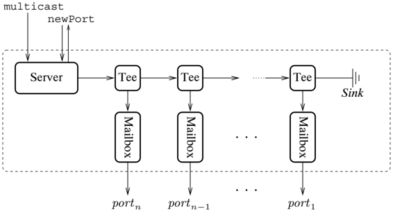

*

Figure 5.2: Multicast channel process network

```
5.5 Multicast channels
                             101

structure Multicast := MULTICAST =
  struct

    structure MB = Mailbox

    datatype 'a port = Port of 'a MB.mbox

    datatype 'a mchan = MChan of ('a request chan * 'a port chan)

    and 'a request
      = Message of 'a
      | NewPort

    fun mChannel () = let
          val reqCh = channel() and replyCh = channel()
          fun mkPort outFn = let
                  val mbox = MB.mailbox()
                  val inCh = channel()
                  fun tee () = let val m = recv inCh
                          in
                          MB.send(mbox, m);
                          outFn m;
                          tee()
                      end

                  in spawn tee;
                  (fn msg => send(inCh, msg), Port = mbox)
            end
        fun serverOut fn = (case (recv reqCh)
                of NewPort => val out (outFn', port) = mkPort outFn
                        in
                        send (replyCh, port);
                        server outFn'
                    | (Message m) => (outFn m; server outFn)
                (* (end case *)) =>
            in
            spawn (fn () => server (fn _ => ())));
            MChan(reqCh, replyCh)
          end

    fun multicast (MChan(ch, _), m) = send (ch, Message m)

    fun port (MChan(reqCh, replyCh)) = (
        send (recvCh, NewPort);
        recv replyCh)

    fun recvEvt (Pcr mbox) = MB.recvEvt mbox

end (* Multicast *)

            Listing 5.7: The implementation of multicast channels

-----------------------------------------------------------------------------

```

Listing 5.7: The implementation of multicast channels

to the server thread. A request is either a message to be broadcast or a request
for a new port. The multicast and port functions are trivial; the interesting
function is mChannel, which implements the process network in Figure 5.2.

The mChannel function creates the request and reply channels, and spawns the
server thread. In its initial state, any messages that are sent on the channel
will just be dumped in the sink. Instead of directly representing the links in
the chain of ports as channels, which would require making the sink a thread, we
use an abstract output function ( outFn) to implement the links ( i.e., the
right-pointing arrows in Figure 5.2). For the sink, this output function is a
no-op, and for the other links, it is implemented using send. The server
thread's state consists of the output function for the current head of the
chain. As usual, each iteration of the server handles a client request. When the
server gets a Message request, it simply passes the message on to the head of
the chain. When it gets a NewPort request, it calls the mkPort function with the
current output function as an argument. This returns a new output function for
the server and the event value that represents the port, which the server sends
back to the requesting client. The mkPort function creates the new tee thread
and buffer channel, and connects them together.

There are problems with this implementation of the multicast-channel
abstraction. Once a thread acquires a port, it must consume all future messages
that are sent on the channel. If it stops consuming messages while another
process is still producing them, the buffering of these messages in the port
becomes a space leak. Of course this problem can occur with the simple buffered
channel abstraction of the previous section, but it is a greater restriction in
the case of the multicast channel, since often the set of consumers is dynamic.
For example, multicast channels can be used in GUIs to support multiple views of
a shared object. If the user closes one of the views, then some provision for
releasing the corresponding port must be made. There are several possible
solutions to this problem:

*   A client can attach a ' sink ' thread to the port, which consumes any future
  messages. This addresses the main source of space leaks, but does not work
  very well in the situation where clients are repeatedly creating and
  discarding ports, since the chain of ports continues to grow. It also has the
  disadvantage of requiring the client to manage the freeing of ports
  explicitly.
*   The abstraction can be extended to include a delete operation that removes the
  port from the multicast network. This approach avoids the problem of the
  monotonically growing chain of ports, but the implementation is fairly
  complicated, and it also requires explicit management of ports by the client.
*   One might use some form of fi nalization mechanism (as provided by the SML/NJ
  garbage collector), but this does not address the basic complexity of the
  deleting ports from the chain.

Another approach, which is much more attractive, uses a completely different
implementation of the abstraction. The idea is to generalize the 'true' streams
implementation described in Section 5.3.2. These streams allow multiple threads
to read the same value, which is the essence of multicast. We can view the
sequence of values sent on a multicast channel as a stream, and the state of
each multicast port as a point in the stream. Reading a value from a port
advances that port's view of the stream, but does not affect the other ports.
Using a stream obviates the need for providing a port for each buffer, but we
still use a tee thread for each port to keep track of the port's state and to
map the stream value to a message on a channel.

An element v in the stream of values is represented by the pair ( v, iv), where
iv is the I-variable that refers to the next stream element. The concrete
representation of a stream cell is the recursive datatype

```
datatype: 'a' mc_state = MCState of: ('a * 'a  a  mc_state SyncVar.ivar)

```

The type name includes the word state, because the state of a port is one of
these values.

The stream-based implementation has the same interface as the previous version
(see Listing 5.6), and the representation of multicast channels and the
implementation of the multicast and port operations is almost identical to those
given in Listing 5.7. The only difference is that we use a synchronous channel
to connect the tee thread with the client of a port - this has the effect of
reducing space consumption. Most of the changes are localized to the mChannel
operation, which is shown in Listing 5.8. The body of the server thread handles
newPort messages in essentially the same way as before. The main difference in
the server thread is that its state is now represented by the I-variable that
will hold the next stream value ( iv). When the server receives a Message
request, it allocates a new I-variable ( nextIV) for the next stream element,
and writes the pair of the message value and nextIV into iv; nextIV then becomes
the server's new state. The main difference in the mkPort function is in the tee
thread, which now consumes the stream of values, sending each one on its output
channel.

Figure 5.3 gives a pictorial view of the process network for the stream-based
version of Figure 5.2. In this picture, the shaded band represents the stream of
values that have been multicast ( v 1 through v 5 so far). Each element in the
stream is represented as a pair of the value and a reference to the next value
in the stream; the symbol Λ is used to represent the empty I-variable. The
dotted lines connect the threads (represented as rounded rectangles) with the
stream element that they are currently holding. For example, the client of port
1 will see v 4 as its next message. The initial I-variable and the fi rst stream
cell, which holds v 1, are not referenced by any thread and thus can be
reclaimed by the garbage collector.

```
104            5 Synchronization and Communication Mechanisms

-----------------------------------------------------------------------------
structure Multicast : MULTICAST =
  struct
    datatype 'a port = Port of 'a chan

    datatype 'a mchan = MChan of ('a request chan * 'a port chan)

    and 'a request
      = Message of 'a
      | NewPort

    datatype 'a mc_state = MCState of ('a * 'a mc_state SyncVar.ivar)

    fun mChan () = let
          val reqCh = channel() and replyCh = channel()
          fun mkPort iv = let
                  val outCh = channel()
                  fun tee iv = let
                        val (MCState(v, nextIV)) = SyncVar.iGet iv
                        in
                        send (outCh, v);
                        tee nextIV
                      end
                    in
                    spawn (fn () => tee iv);
                    Port outCh
              end
        fun server iv = (case (recv reqCh)
                of NewPort => (
                    send (replyCh, mkPort iv);
                    server iv)
                | (Message m) => let val nextIV = SyncVar.iVar()
                    in
                    SyncVar.iPut (iv, MCState(m, nextIV));
                    server nextIV
                end
                (* end case *))
            in
            spawn (fn () => server (SyncVar.ivar()));
            mChan (reqCh, replyCh)
          end

      ...
    end (* Multicast *)

                  Listing 5.8: Multicast channels using I-variables
-----------------------------------------------------------------------------

```

Listing 5.8: Multicast channels using I-variables

In this image, we can see a diagram. There are some text and numbers on the
image.<end_of_utteranc

Flow chart

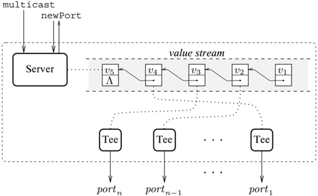

*

Figure 5.3: Stream-based multicast network

## 5.6 Meta-programming RPC protocols

As we have seen, client-server (or RPC) communication structures are very
important in many concurrent programs. This importance has led the designers of
several languages, such as Ada and Concurrent C, to provide RPC-style
communication as the basic communication and synchronization mechanism (see
Section 2.5.4). Unfortunately, this approach has the disadvantage of making
other communication patterns, such as process networks, more dif fi cult to
program. CML takes the alternative approach of providing one-way communication
as its primitive, and providing an abstraction mechanism for building more
complicated protocols such as RPC. Of course, the CML approach has the
disadvantage of requiring more programming when using RPC-style protocols. In
this section, we show how a combination of higher-order functions and event
values can be used to provide a ' meta-programming ' facility for RPC-style
protocols, which eliminates most of the programming overhead.

## 5.6.1 Simple RPC

The basic idea is to take a de fi nition of a server operation and package up
the communication protocol as a pair of operations: one for the server and one
for the client. A server operation is an instance of the polymorphic type:

```
( 'a * 'b)  -> ( 'a * 'c)

```

7The CMI. Iibrary ded provided an RDC met

```
signature MAKE_RPC =
          sig

            val mkRPC : (('a * 'b) -> ('a * 'c)) -> {
                  call     : 'b -> 'c,
                  entryEvt : 'a -> 'a event
                }

          val mkServer : 'a -> ('a -> 'a event) list -> unit

        end;

```

Listing 5.9: Meta-programming RPC signature

where the type variable 'a is the type of the server's state, the variable 'b is
the type of the operation's argument, and the variable 'c is the type of the
operation's result. Thus, a server operation takes a state and an argument and
returns a new state and result.

The RPC meta-programming module, called MakeRPC, 7 has two operations: mkRPC,
which implements the client and server-side operations for a given server
operation, and mkServer, which implements the server from a list of server
operations. Listing 5.9 gives the interface of these operations. The mkRPC
function takes a server operation, and returns a record consisting of the
client-side call, and the server-side entryEvt. The resulting entryEvt function
maps the server's state to an event that returns the new state as a
synchronization result. The mkServer function takes an initial server state and
a list of entries, and spawns a server that handles the entries.

Listing 5.10 gives the implementation of the MakeRPC structure. The mkRPC
function implements a vanilla RPC protocol with the client-side call operation
represented as a blocking function call. On the client side, the call function
allocates an I-variable for the reply, sends the server a request consisting of
the call's arguments and the reply variable, and then waits for the reply. The
server-side entryEvt function is not much more complicated. It wraps the doCall
function around the receiving of a client's request. The doCall wrapper
evaluates the operation on the given state and arguments, sends the result back
to the client, and returns the new state as the synchronization state. The
mkServer function is quite simple. It spawns a thread that repeatedly
synchronizes on the choice of the list of entry events. The selection is
constructed by applying each entry event function to the current state. The
result of the selection is the server's next state.

7 The CML Library also provides an RPC meta-programming module called SimpleRPC.
See the CML Reference Manual in Appendix A for details.

```
5.6 Meta-programming RPC protocols


-----------------------
    structure MakeRPC : MAKE_RPC =
      struct

        fun mkRPC f = let
                val reqCh = channel ()
                val call arg = let
                    val reply = SyncVar.iVar ()
                    in
                        send (reqCh, (arg, reply));
                        SyncVar.iGet reply
                    end
            fun entryEvt state = let
                fun doCall (arg, replyV) = let
                        val (newState, result) = f (state, arg)
                        in
                            SyncVar.iPut (replyV, result);
                            newState
                        end
                    in
                        wrap(recvEvt reqCh, doCall)
                end
            in
                {call=call, entryEvt=entryEvt}
            end

        fun mkServer initState entries = let
                fun selectEntries state =
                    select (map (f ref => f state) entries)
                fun loop state = loop (selectEntries state)
                in
                    spawn (fn () => loop initState);
                ()
            end

      end;


                      Listing 5.10: The MakeRPC structure

-----------------------

```

Listing 5.10: The MakeRPC structure

We use an I-variable for the reply message in order to improve performance. We
could also use asynchronous communication ( e.g., a mailbox) to communicate the
request to the server. We choose not to do this because the examples in the
sequel require the extra synchronization provided by synchronous message
passing.

To illustrate the use of the MakeRPC module, we revisit the updatable cells
example from Chapter 3. Recall that the updatable cell abstraction supports two
RPC-style operations: get, which gets the cell's current state, and put, which
updates the cell's state. Listing 5.11 shows how we can use meta-programming to
implement this abstraction.

fun call arg = guard (fn () =&gt; let wrap (

val reply = SyncVar.iVar fn () =&gt; SyncVar. iGet reply)

```
fun mkCell initVal = let
            val {call=get, entryEvt=get'} =
                    MakeRPC.mkRPC (fn (x, _) => (x, x))
            val {call=put, entryEvt=put'} =
                    MakeRPC.mkRPC (fn (_, x) => (x, ()))
            in
                MakeRPC.mkServer initVal [get', put'];
                {get = get, put = put}
            end

```

Listing 5.11: Example of MakeRPC : updatable cells

## 5.6.2 Event-valued RPC

The MakeRPC structure provides support for the asymmetric Ada -style extended
rendezvous, where the client-side operation cannot be used in selective
communication. In CML, we can extend this package to provide an event-valued
interface to the client by adding the following function:

```
val mkRPCEvt : (('a * 'b) -> ('a * 'c)) -> {
            call      : 'b -> 'c event,
            entryEvt : 'a -> 'a event
        }
```

There are two possible implementations of this operation, depending on whether
the client's request or the server's reply is the commit event (see Section
4.2.2). For this example, we choose the client's request as the commit event.
The mkRPCEvt function can then be implemented by a small modi fi cation to the
mkRPC function from Listing 5.10:

```
fun mkRICEvt f = let
               val reqCh = channel ()
               fun call arg = guard (fn () => let
                  val reply = SyncVar.iVar ()
                  in
                     ~wrap (
                        sendEvt (reqCh, (arg, reply)),
                        fn () => SyncVar.iGet reply)
                  end)
               fun entryEvt state = ...
               in
                  {call=call, entryEvt=entryEvt}
               end

forre, we underline the changes. The server-side entryEvt function is unchae
```

As before, we underline the changes. The server-side entryEvt function is
unchanged, but we now implement the call function as a guard event. We could
also provide functions to create RPC protocols where the server's response is
the commit point (with or without negative acknowledgements); how to implement
this form is left as an exercise.

sendEvt (regch, (arg, reply)), end)

()

## 5.6.3 Conditional RPC

In systems programming, it is often necessary to deal with the possibility that
some expected event might not occur. To this end, Ada supports several
variations on its basic rendezvous mechanism - namely, a delay clause in the
server's select statement, a timed entry call, and a conditional entry call.
These operations can be implemented easily in CML. The server-side delay clause
is implemented using the following function:

```
fun delay (tim, act) state =
        wrap (timeOutEvt tim, fn () -> act state)
```

This takes a timeout interval and an associated action, and returns a function
that can be used as an argument to mkServer. Using event-valued client-side
calls, we can implement the timed entry call as

```
select [wrap (timeOutEvt, t, timeout action) ,
        wrap (call args, call action)
    ]

```

where t is the timeout interval and call is the RPC event

An implementation of Ada's conditional entry requires modifying the call
function in mkRPC (see Listing 5.10) to poll the server to see if it will accept
a request:

```
fun condCall arg = let
          val reply = SyncVar.iVar ()
          in
            if sendPoll(reqCh, (arg, reply))
              then SOME(SyncVar.iGet reply)
              else NONE
          end

```

Modifying mkRPCEvt to support conditional entry requires a more complicated
protocol, since even if the poll of the server succeeds, the client may still
choose a different event and the transaction will have to be aborted.
Implementing this protocol can be done using negative acknowledgements, and is
left as an exercise.

Some languages, such as Concurrent C and SR, go further in their support for
conditional entry and provide a mechanism for a server to conditionally accept a
request based on a boolean predicate. This predicate can depend on both the
state of the server, and on the contents of the message. In this section, we
look at how we can emulate this mechanism in CML.

In the case where this predicate only depends on the server's state, there are a
couple of ways to program it in CML. For the buffered channel example in Section
5.4, we structured the server to select from different sets of events in
different states. The other technique is to use guard to test the predicate. For
example, the following event constructor takes a predicate on states ( pred) and
a function for making an event from a state ( mkEvt), and returns a function for
conditionally making an event from a state:

```
fun condEvt (pred, mkEvt) state = guard (fn () => (
          if (pred state) then mkEvt state else never) )
```

This function returns the event value never when the predicate is false, which
is the identity for choose. It has the type

```
val condEvt: (('a -> bool) * ('a -> 'b event)) -> 'a -> 'b event
```

where ' 'a ' is the type of the server's state.

When the predicate depends on the message's contents, the techniques of the
previous paragraph do not apply. We have already seen one example where this
situation arises. The lock server presented in Section 4.2.5 can only handle a
request when the lock speci fi ed in the request message is not held. This can
be described as a predicate on the server's state and the request message's
contents. The approach used in the lock server to handle this case is to
tentatively accept any request, but to only commit to accepting a request when
the requested lock is actually available. In the remainder of this section, we
examine ways to support conditional acceptance of RPCs as an abstraction.

We can extend the RPC meta-programming module to support conditional acceptance
of requests. We extend the interface of Listing 5.9 with the following function:

```
val mkCondRPC : (('a -> 'b -> bool) * (('a * 'b) -> ('a * 'c)))
            -> {{
                call     : 'b -> 'c,
                entryEvt : 'a -> 'a event
            }

```

This function is like the makeRPC function in Section 5.6.1, except that it also
takes a predicate function as an argument. The predicate is curried over the
state and the call argument. As an illustration of this abstraction, Listing
5.12 gives the implementation of a lock server using the MakeRPC structure. Note
that this implementation can represent the set of held locks as a set of
integers, instead of as a map from integers to outstanding requests ( cf.,
Listing 4.6).

Our implementation of makeCondRPC uses a buffer thread between the client and
the server. When the client executes a call, it sends a request message to the
buffer thread, which tracks the outstanding requests. The buffer thread is also
responsible for testing requests against the predicate; when the server offers
to accept an entry, it partially evaluates the predicate against its current
state, and then sends the partially evaluated predicate to the buffer. When the
buffer fi nds a request that satis fi es the predicate, it forwards the call to
the server; the server's reply goes directly back to the client. Figure 5.4
illustrates this communication network.

The communication pattern described above is a simpli fi cation, however, since
it does not address the issue of selective communication in the server (recall
that mkServer can handle a list of entries). For this we must use negative
acknowledgements to inform

```
datatype lock = LOCK of int

    fun mkLockServer () = let
            fun isLocked locks (LOCK lock) =
                IntBinarySet.member(locks, lock)
            fun lockFn (locks, LOCK lock) =
                (IntBinarySet.add(locks, lock), ())
            val {call=lock, entryEvt=lockEntryEvt} =
                MakeRPC.mkCondRPC (isLocked, lockFn)
            fun unlockFn (lockss, LOCK lock) =
                (IntBinarySet.delete(locks, lock), ())
            val {call=unlock, entryEvt=unlockEntryEvt} =
                MakeRPC.mkRPC unlockFn

            MakeRPC.mkServer IntBinarySet.empty [
                    lockEntryEvt,
                    unlockEntryEvt
                ];
            {lock=lock, unlock=unlock}
        end

    Listing 512: Lock server implemented using mkCondRPC
```

Listing 5.12: Lock server implemented using mkCondRPC

the buffer thread that the predicate it has is stale. We split mkCondRPC 's
implementation into the construction of the client and server operations, and
the implementation of the buffer. Listing 5.13 gives the code for makeRPC. This
code is a slight modi fi cation of the code in Listing 5.10 and again we
underline the changes. In addition to the request channel ( reqCh), the
mkCondRPC function also allocates a channel for the server to send the predicate
to the buffer ( predCh), and a channel for the buffer to forward client messages
to the server ( forwCh). The client-side operation ( call) is identical to the
unconditional version, but the server side is more complicated. The entryEvt
function now constructs an event using the withNack combinator. The guard
function fi rst sends

### Image Description

The image depicts a simple workflow diagram for a project management system. The
diagram is divided into two main sections: "Client" and "Buffer."

#### Client Section
* **Client Call**:
    *   The client is represented by a box labeled "Client."
    *   The client's name is "Client."
* **Buffer Call**:
    *   The buffer is represented by a box labeled "Buffer."
    *   The buffer's name is "Buffer."

#### Server Section
* **Server**:
    *   The server is represented by a box labeled "Server."
    *   The server's name is "Server."

#### Reply Section
* **Reply**:
    *   The reply is represented by a box labeled "Reply."
    *   The reply's name is "Reply."

#### Analysis

The diagram is structured to show the workflow from client to server. The client
is responsible for sending a message to th

Flow chart

Figure 5.4: The conditional client/server communication network

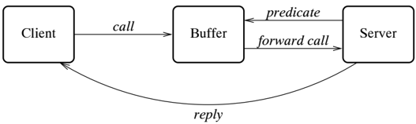

condbuffer val predch = channel ()

send (predch, (pred state, nak)) ;

wrap (recvEvt forwCh, doCall)

condBuffer (recvEvt predch, recvEvt regch, forwch) ;

SyncVar. iPut val forwch = channel ()

(replyv, result) ;

end)

{call=call, entryEvt=entryEvt}

(* the client side call *)

```
112          5   Synchronization and Communication Mechanisms

      ------------------------------------------------------------------------
              fun mkConcordRPC (pred, f) = let
                  val reqCh = channel()
                  val predCh = channel()
                  (val forCh = channel()
                  (* the client side call *)
                  fun call arg = let
                        val reply = SyncVar.iVar ()
                        in
                        send (reqCh, (arg, reply));
                        SyncVar.iGet reply
                  end
              (* the server side entry event *)
              fun entryEvt state = withNack (fn nak => let
                    fun doCall (arg, replyV) = let
                        val (newState, result) = f (state, arg)
                        in
                        send (predCh, (pred state, nak));
                        SyncVar.iPut (replyV, result);
                        newState
                    end
              in
                  wrap (recvEvt forCh, doCall)
              end)
              in
              condBuffer (recvEvt predCh, recvEvt reqCh, forCh);
              {call=call, entryEvt=entryEvt}
            end


              |Listing 5.13: Making a conditional RPC operation

```

Listing 5.13: Making a conditional RPC operation

the partially applied predicate and the negative acknowledgement event to the
buffer, and then constructs the entry event.

The most complicated part of makeCondRPC is in the implementation of the
condition buffer, which is given in Listing 5.14. The buffer maintains a queue
of outstanding client calls, which is represented as a list of pairs, where the
fi rst item is the call argument and the second is the I-variable for sending
the reply. The function ins adds a call to the end of the queue, and the
function scan searches the queue for the fi rst call whose argument satis fi es
the predicate pred. The queue maintains a FIFO ordering of requests, so that if
two requests both satisfy the server's predicate, then the fi rst request is
chosen by scan. The other utility function is forwCall, which is used to forward
a call to the server. Since the server might have selected some other entry,
forwCall selects on the choice of the negative acknowledgement ( disable) and
the server accepting the call; it returns true, if the call is accepted. The
buffer can be in one of two states: it is said to be enabled if it has a valid
predicate from the server; otherwise, it is disabled. The

```
5.6 Meta-programming RPC protocols

  -----------------------------------------------------------------------------
  fun condBuffer (predEvt, reqEvt, fcrWCh) = let
        fun fcrWCall (call, disable) = select [
                wrap (disable, fn _ => false),
                wrap (sendEvt(forCh,call), fn () => true)
                ]
        fun ins (calls, call) = calls@ [call]
        fun scan (pred, calls) = let
                | scan' ([], _) = NONE
                | scan' ((call as (req, _))::r, front) =
                    if (pred req)
                    then SOME(call, List.revAppend(front, r))
                    else scan'(r, call::front)
                in
                scan' (calls, [])
            end
        fun enabledBuf (calls, pred, disable) = select [
                wrap (disable, fn () => disabledBuf calls),
                wrap (reqEvt, fn () => disabled(req, _)) => (
                    if pred req)
                    then if (forCall (call, disable))
                    then disabledBuf calls
                    else disabledBuf (ins(calls, call))
                    else enabledBuf
                )
        and disabledBuf calls = select [
                wrap (reqEvt, fn call=>
                disabledBuf (ins(calls, call))),
                wrap (predEvt, fn (pred, disable) => (
                    case (scan (pred, calls))
                    of NONE => enableBuf (calls, pred, disable)
                    | (SOME(call, calls')) =>
                        if (forCall (call, disable))
                        then disabledBuf calls'
                        else disabledBuf calls
                    (* end case *)))
        in
        span (fn () => disabledBuf []); ()
        end


                    Listing 5.14: The condition buffer


```

Listing 5.14: The condition buffer

mutually recursive functions enabledBuf and disabledBuf are used to represent
these states.

The enabledBuf function synchronizes on the choice of two events: either
receiving a call request ( reqEvt) or being informed that the predicate is stale
because the server has selected some other entry ( disable). This function
maintains the invariant that no outstanding call satis fi es the predicate. When
a new call comes in, it checks it against the predicate; if it is not satis fi
ed, then the message is added to the outstanding call queue. If the new call
satis fi es the predicate, then the call is forwarded to the server. As
mentioned above, forwarding a message may fail if the predicate is stale; in
this case, the new call is added to the outstanding call queue, but independent
of whether the call is forwarded successfully, the buffer becomes disabled.

The disabledBuf function also synchronizes on the choice of two events: either
receiving a call request ( reqEvt) or receiving a new predicate from the server
( predEvt). When a new call request is received, it adds the request to the
outstanding call queue. If a new predicate is received, then the outstanding
queue must be checked for any calls that match the predicate. If no such calls
are found, then the buffer becomes enabled (note that the enabled state
invariant is satis fi ed). Otherwise, the matching call is forwarded to the
server.

One might complain that this abstraction does not provide a way for the client
to use its side of the protocol in a selective communication. One can imagine
combining the mkRPCEvt function of Section 5.6.2 with a form of conditional
accept mechanism implemented using the condition buffer from above.
Unfortunately, this is provably impossible. The problem is that such an
implementation would require a three-way rendezvous between the client, buffer,
and server, and it is not possible to implement a three-way rendezvous in CML,
since it only provides two-way rendezvous as a primitive. 8 It should be noted,
however, that if we move the predicate test into the server thread (reducing the
number of threads involved to two), then it would work. But this would lose the
modularity of the meta-programming approach.

## Notes

While we have now covered most of the features of CML in this and the previous
two chapters, the reader is referred to the CML Reference Manual for a complete
description of CML. The core parts of the reference manual can be found in
Appendix A.

CML 's I-variables and M-variables are taken from the parallel language ID
[ANP89, Nik91]. Earlier versions of CML did not provide M-variables, and used
the name ' condition variable ' instead of I-variable. An implementation of
condition variables using

8 By n -way rendezvous, we mean a synchronous communication involving n
processes. Since message passing in CML is synchronous, it provides a 2-way
rendezvous. This problem is discussed in greater detail in Section 6.4.

channels and threads can be found in the author's dissertation [Rep92]. The
language Concurrent Haskell [PGF96] also provides M-variables as a primitive; in
fact, it is the only synchronization and communication mechanism in the
language.

Futures were developed originally by Halstead in the language Multilisp [Hal85];
they also appear in other parallel Lisp s, such as Mul-T [KH88]. Most
implementations of futures are designed to support parallel programming, and so
must deal with issues such as task granularity and throttling excessive
parallelism. One way to do this is for the run-time system to decide dynamically
whether to evaluate the body of a future inline, or in parallel. Mohr, Kranz,
and Halstead have developed an approach to inlining futures called lazy task
creation, which has the advantage of being deadlock free [MKH91]. An
implementation of futures in CML that uses lazy task creation is described in
Chapter 12 of the author's dissertation [Rep92].

The buffered channel abstraction in Section 5.4 provides the communication
mechanism found in asynchronous message-passing languages, such as Erlang
[AVWW96] and actor languages [Agh86].

The multicast channels described in Section 5.5 are quite useful for
implementing so-called publish and subscribe interactions (also known as the
Observer design pattern [GHJV95]), which is why they are provided as a module in
the CML Library. Examples of their use can be found in Chapters 7, 8, and 9.

The RPC, or extended rendezvous, mechanisms of Sections 5.6, 5.6.2, and 5.6.3
are found in a number of languages. Ada [DoD83] and Concurrent C [GR86] both use
extended rendezvous as their basic communication mechanism. Concurrent C extends
the basic mechanism by allowing the server to accept requests conditionally (as
in Section 5.6.3). And the synchronization expressions found in SR are also a
form of conditional accept [AO93].

Adifferent approach to providing extended rendezvous in CML is to de fi ne an
abstract type

<!-- formula-not-decoded -->

where the fi rst type argument is the entry argument type, and the second is the
entry's result type. This abstraction provides a name for an extended rendezvous
in the same way that a channel names a simple rendezvous [Rep92].

The problems with supporting three-way rendezvous in CML were discussed
informally in the author's dissertation [Rep92]. More recently, Panangaden and
the author have developed a formal model for reasoning about these questions
[PR97]; this topic is discussed in the next chapter. Charlesworth has proposed a
generalized multiway rendezvous mechanism as an extension for Ada [Cha87].
Another proposed mechanism for de fi ning multi-party interactions are scripts
[FHT86, EFK89]. Multiway rendezvous is an instance of the committee coordination
problem [CM88].

## The Rationale for CML

The design of CML has been driven by practical experience. In particular, the
mechanism of fi rst-class synchronous operations is motivated by the fundamental
con fl ict between selective communication and abstraction. This chapter
explains the rationale for the design of CML, and especially for fi rst-class
synchronous operations. It is aimed at people interested in language design, and
is not required to understand the remainder of the book. In this chapter, we
focus on core CML -synchronous message passing plus the event combinators - the
other synchronization mechanisms found in CML, such as mailboxes, I-variables,
and M-variables, can be viewed as derived forms. Some of the discussion here
repeats earlier arguments, but is included for coherence.

## 6.1 Basic design choices

As surveyed in Chapter 2, there are many possible choices for the design of a
concurrent language. CML chooses message passing over shared memory, synchronous
communication over asynchronous, and simple rendezvous over extended rendezvous.
This section argues in favor of these choices.

While SML is an imperative language, its design greatly encourages a mostly
functional style of programming. 1 Mutable values must be declared explicitly as
such, and there is syntactic overhead on their use. For these reasons, extending
SML with sharedmemory concurrency primitives is not true to the 'spirit' of the
language. Message passing, on the other hand, encourages a mostly functional
programming style that fi ts well with ML. As we have seen, much of the state in
typical CML programs is represented as immutable arguments to the tail-recursive
functions that implement threads. The actual side-effects are hidden in the
context switching and communication operations. Furthermore, combining
synchronization and communication into the same mechanism provides

1 One might call this ' value-oriented ' programming.

a more robust programming model than shared-memory with mutex locks and
condition variables.

Given the choice of message passing as the basic communication and
synchronization mechanism, the next decision is how much synchronization should
be provided. There is an obvious trade-off between the ef fi ciency of the
communication primitives and the amount of synchronization they provide.
Asynchronous message passing can be implemented with very low overhead, but
provides no synchronization information to the sender. In synchronous message
passing, on the other hand, the sender and receiver attain common knowledge of
the message transmission, which makes synchronous message passing easier to
reason about and to program with. For example, using synchronous message
passing, we can use a single pair of channels to implement a client-server
protocol (as shown in Section 3.2.3), whereas implementing the same protocol
using asynchronous message passing requires dynamic allocation of reply
channels. Furthermore, programs based on asynchronous message passing often
require sending acknowledgement messages explicitly; once the cost of these
extra messages is factored in, the performance advantages of asynchronous
message passing may be lost. Synchronous message passing also has the advantage
that its failure mode is typically deadlock, whereas asynchronous message
passing will often postpone the detection of errors until the channel buffers
are exhausted. 2 For these reasons, we rejected asynchronous message passing as
the basis of CML. Since this design decision was made, we have proven that the
synchronous communication provided by CML is inherently more powerful than
asynchronous communication (see Section 6.4).

Another argument in favor of asynchronous message passing is that it supports
the transparent distribution of an application ( e.g., a client does not need to
know if communication with a server is done locally, or remotely via a proxy).
Figure 6.1 illustrates this situation when the client-server protocol is visible
to the client. If this protocol is based on synchronous message passing, then
the semantics of the local and distributed implementations are different. If the
client sends a request in the local case, then it knows that the server has
accepted the request, whereas in the distributed case, the proxy has accepted
the request, but the server may still refuse it. On the other hand, if the
protocol is based on asynchronous message passing, then the client knows nothing
about the server's state in either case. Effectively, because asynchronous
message passing is a weaker mechanism, it reduces the local case to the
distributed case. For some, this is a compelling argument in favor of
asynchronous communication. There are two reasons, however, why this argument
does not justify the choice of asynchronous message passing over synchronous
message passing.

First, there is a real distinction between local and distributed communication.
If the

2 If the channel buffers are unbounded, this is when memory is exhausted.

Engineering drawing

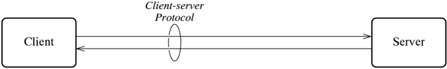

## (a) Local implementation

In this image, we can see a diagram with some text and a few
lines.<end_of_utteranc

Flow chart

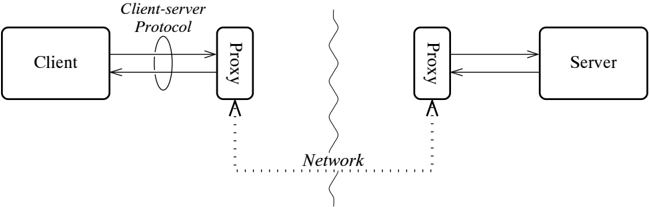

*   (b) Distributed implementation

Figure 6.1: A client-server protocol

client and server are executing on physically different processors, they may
suffer independent processor failure, or their communication link may fail. A
robust distributed program must be able to handle these situations. Furthermore,
distributed communication has higher latency and lower bandwidth than local
communication. A program that fails to note these performance differences may be
wildly inef fi cient. For this reason, distributed programming is qualitatively
different from concurrent programming, and requires a different programming
model.

Second, even if we assume a reliable distributed setting, this argument draws
the wrong conclusion from the example. The real problem with the protocol in
Figure 6.1 is that the client should not be exposed to the implementation
details of the protocol. The protocol should be abstract, so that the client
cannot distinguish between local and remote servers. Figure 6.2 illustrates an
abstract client-server protocol.

Another possible design choice is the extended rendezvous mechanism, which
involves two-way message traf fi c; languages such as Ada and Concurrent C are
based on such mechanisms. There are two problems with choosing extended
rendezvous as the base mechanism: it is not clear which of the many forms of
extended rendezvous should be chosen, and extended rendezvous does not support
producer-consumer communication

Engineering drawing

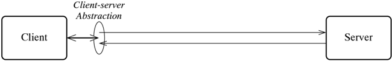

## (a) Local implementation

In this image, we can see a diagram with some text and a few
lines.<end_of_utteranc

Engineering drawing

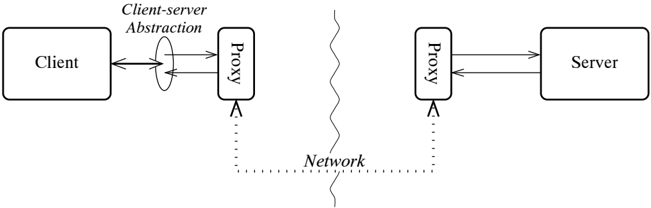

*   (b) Distributed implementation

Figure 6.2: An abstract client-server protocol

very well, where communication is unidirectional. Given the extensibility
afforded by CML 's events, it is clear that starting with the more primitive
simple rendezvous operation is a better choice than building in some complicated
extended rendezvous mechanism.

## 6.2 First-class synchronous operations

The support for fi rst-class synchronous operations is the major distinguishing
feature of CML. In this section, we describe the motivation for this approach.

## 6.2.1 The need for selective communication

A language, such as CML, with synchronous communication must provide some
mechanism for selecting between communication alternatives. For example, Figure
6.3 gives the communication network for a terminal server. The terminal server
must be able to accept output from the client (on the outstream) and from the
keyboard. Since there is no a priori way to know which input is next, the server
must be able to accept either.

In this image, we can see a diagram.<end_of_utteranc

Flow chart

Figure 6.3: A terminal manager network

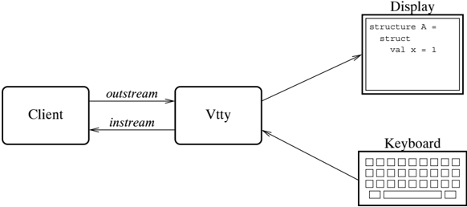

To address this need, synchronous message-passing languages provide a selective
communication mechanism. For example, in an Amber -style notation, the body of
the terminal server might be implemented as

```
select kbd?key => code to handle key press messages
    or outstrm?c => code to handle client output
```

where kbd is the keyboard channel, outstrm is the outstream channel, and '? ' is
the input operation on channels. The semantics of this operation is to wait
until there is input on either kbd or outstrm, bind the input message to the
corresponding variable ( i.e., key or c), and then take the associated action.

## 6.2.2 The need for abstraction

Abstraction is the principal mechanism for structuring software. In concurrent
programming, we use abstraction to hide the details of process interactions. For
example, consider a server thread that provides a service via a request-reply
(or RPC) protocol. The server side of this protocol is something like

```
fun serverLoop () = if serviceAvailable()
        then let
          val request = recv reqCh
          in
            send (replyCh, doit request);
            serverLoop ()
          end
        else doSomethingElse()


```

where the function doit actually implements the service. Note that the service
is not always available. This protocol requires that clients obey the following
two rules:

1.  A client must send a request before trying to read a reply.
2.  Following a request, the client must read exactly one reply before issuing
   another request.

If all clients obey these rules, then we can guarantee that each request is
answered with the correct reply, but if a client breaks one of these rules, then
the requests and replies will be out of sync. An obvious way to improve the
reliability of programs that use this service is to bundle the client-side
protocol into a function that hides the details, thus ensuring that the rules
are followed. The following code implements this abstraction:

<!-- formula-not-decoded -->

By hiding the request and reply channels ( e.g., by using the module system), we
can guarantee that clients of this implementation interact with the server
correctly.

## 6.2.3 Selective communication vs. abstraction

Unfortunately, there is a con fl ict between selective communication and using
procedural abstraction to implement abstract protocols. For example, while the
clientCall function given above ensures that the protocol is observed, it hides
too much. If a client blocks on a call to clientCall ( e.g., because the server
is not available), then it cannot respond to other communications. Avoiding this
situation requires using selective communication, but the client cannot do this
because the abstraction hides the synchronous aspect of the protocol. This is
the fundamental con fl ict between selective communication and existing forms of
abstraction. If we make the operation abstract, we lose the fl exibility of
selective communication, but if we expose the protocol to allow selective
communication, we lose the safety and ease of maintenance provided by
abstraction. Resolving this con fl ict requires introducing a new abstraction
mechanism that preserves the synchronous nature of the abstraction. This is the
rˆ ole of fi rst-class synchronous operations.

## 6.2.4 The facets of selective communication

The motivation for fi rst-class synchronous operations is to provide a way to do
selective communication with abstract communication protocols as the choices.
For this purpose we introduce a new type of value, called an event, that
represents an abstract communication protocol. In addition to the new type, we
need to de fi ne a collection of constructors, combinators, and operators on
event values. The design of these is guided by the natural decomposition of the
traditional select construct.

read current value

Operation addition

This decomposition is best explained using an example. Consider the following
loop (again using Amber -style notation):

```
fun accum sum = (
            select addCh?x => accum(sum+x)
                or subCh?x => accum(sum-x)
                or readCh!sum => accum sum)

```

This code implements the body of an accumulator thread that supports three
operations: addition, subtraction, and read the current value. Each of these
operations is implemented as a clause in the select, consisting of a channel I/O
operation and an associated action:

| Operation          | I/O operation   | Action   | Action       | Action   |
|--------------------|-----------------|----------|--------------|----------|
| addition           | addCh?          | x =>     | accum(sum+x) |          |
| subtraction        | subCh?          | x =>     | accum(sum-x) |          |
| read current value | readCh!sum      | =>       | accum sum    |          |

These clauses are joined in a nondeterministic choice, which forms the body of
the synchronization operation. This example illustrates the four facets of the
traditional select construct:

1.  the communication operations,
2.  the actions associated with the communications,
3.  the nondeterministic choice of multiple communications, and
4.  the synchronization operation.

Our approach is to unbundle these facets and support each one independently.
Most important is the separation of the description of the synchronous
operations (the fi rst three facets) from the synchronization itself. We
introduce the type of events to describe synchronous operations, and a
collection of constructors, combinators, and operations to support the different
facets of selective communication:

1.  the base-event constructors ( e.g., recvEvt and sendEvt) are used to create
   the event values that describe the communication operations,
2.  the wrap combinator is used to associate an action with a synchronous
   operation,
3.  the choose combinator is used to de fi ne the nondeterministic choice of a
   collection of synchronous operations, and
4.  the sync operator is used to synchronize on a synchronous operation ( i.e.,
   event value).

readch! sum

I/O operation

=&gt;

accum sum

Action

For example, we write the accumulator example in CML as follows:

```
fun accum sum = sync (
        choose [
            wrap (recvEvt addCh, fn x => accum(sum+x)),
            wrap (recvEvt subCh, fn x => accum(sum-x)),
            wrap (sendEvt (readCh, sum), fn () => accum sum)
        ]))

```

By starting with base-event values to represent the communication operations,
and providing combinators to associate actions with events and to build
nondeterministic choices of events, we provide a fl exible mechanism for
building new synchronization and communication abstractions. 3 Event values
provide a mechanism for building an abstract representation of a protocol
without obscuring its synchronous nature. For example, the client-call
abstraction from page 122 can be implemented as an event-value constructor:

```
fun clientCallEvt x = wrap (
        sendEvt (reqCh, x),
        fn () => recv replyCh)

```

This abstraction is ' fi rst-class' in the sense that it has the same status as
the built-in event-value constructors.

This formulation of fi rst-class synchronous operations corresponds to the
mechanism fi rst proposed in the PML language. CML extends this mechanism in a
number of signi fi cant ways; the next section motivates these extensions.

## 6.3 Extending PML events

The previous discussion explains the motivation for fi rst-class synchronous
operations as found in the language PML. There are some limitations with this
mechanism, however, which are addressed by the richer set of event combinators
provided by CML.

## 6.3.1 The need for guards

Consider a protocol consisting of a sequence of communications: c 1; c 2; · · ·;
c n. When this protocol is used in a selective communication, one of the c i
must be designated as the commit point; i.e., the communication by which this
protocol is chosen instead of the others in the select. For example, in the
events constructed by the clientCallEvt function above, the sendEvt on reqCh is
the commit point. Using the PML set of event combinators, the only possible
commit point is c 1. The wrap combinator allows one to tack on c 2; · · ·; c n
after c 1 is chosen, but there is no way to make any of the other c i the commit
point.

3 Chapter 5 gives numerous examples.

This asymmetry seriously limits the kinds of protocols that can be implemented
as abstractions. A simple example of this is the implementation of a timer
service. Suppose that we want to provide the event constructor

```
val atTimeEvt : Time.time -> unit event

```

which constructs an event that is enabled at the speci fi ed time. This can be
implemented using a request-reply protocol with a clock server. The client's
request speci fi es a wakeup time for the server, and the server's reply is sent
to notify the client that the requested time has come. Obviously, the client
needs to synchronize on the server's reply, which is not possible using only the
PML subset of events. To address this limitation, CML provides the guard
combinator

```
val guard : (unit -> 'a event) -> 'a event

```

This combinator allows computation, including communication, prior to the commit
point to be included in the abstract representation of a protocol. Using the
guard combinator, we can easily implement the atTimeEvt constructor 4

```
fun atTimeEvt t = guard (fn () => let
        val replyCh = channel()
        in
            send (reqCh, (t, replyCh));
            recvEvt replyCh
        end)

```

This example also illustrates the use of guard to include other pre-commit
computation in a protocol, such as allocating a reply channel.

Returning to the idealized client-server interaction that we have been
examining, we see that there are two basic forms for the abstraction. The form
where the client's request is the commit point:

```
fun clientCallEvt1 x = wrap (
        sendEvt (reqCh, x),
        fn () => recv replyCh)

```

and the form where the server's reply is the commit point:

```
fun clientCallEvt2 x = guard (fn () => (
        send (reqCh, x);
        recvEvt replyCh))

```

The choice, of course, depends on the semantics of the service.

There are some additional problems caused by our use of synchronous message
passing for the request and reply. For example, if the server is not available,
the sending of the request in clientCallEvt2 will block the client. This is
solved by making the request asynchronous:

4 This is a simpli fi ed presentation of the example on page 75 (Section 4.2.4).

```
fun clientCallEvt3 x = guard (fn () => (
        spawn (fn () => send (reqCh, x) );
        recvEvt replyCh))

```

There is also the problem that the client might commit to a different
communication in a choice involving this protocol; in this case, the server
would block forever on trying to send the reply. In the case of idempotent
services, such as the clock server, we can again solve this by making the
communication asynchronous. There are situations, however, where this is insuf
fi cient.

## 6.3.2 The need for negative acknowledgements

Once we introduce the ability to communicate with a server prior to the commit
point, we are faced with the problem of how to inform the server that the client
has decided to abort the transaction. As discussed above, this is not necessary
for idempotent services, but it is sometimes necessary for the server to know
whether to commit or abort the transaction. The synchronization involved in
sending the reply allows the server to know when the client has committed to the
transaction, but there is no way to know when the client has aborted the
transaction by selecting some other event. While a timeout on the reply might
work in some situations, the absence of a reply does not guarantee that the
client has selected some other event; the client just might be slow. To address
this problem, CML extends the traditional synchronous message-passing operations
with support for negative acknowledgements.

To illustrate, consider the implementation of an input-stream abstraction using
a clientserver model. Input streams provide several different operations for
reading different amounts of data (a single character, a whole line, etc.).
Furthermore, input streams should be smoothly integrated into the concurrency
model, which means that the input operations should be event-valued. For
example, the function

```
val input1 : instream -> char event

```

is used to read a single character. 5 Let us assume that the implementation of
these operations uses a request-reply protocol; thus, a successful input
operation involves the communication sequence

```
send ( c.h_req,  request) ;    recv v ( c.h_reply )
```

where ch req and ch reply are the request and reply channels. As in the case of
atTimeEvt, it is necessary for the client to synchronize on receiving the reply,
so the request is sent prior to the commit point. But what if the client does
not complete the transaction? If the server were to just send the input
character to the client asynchronously, it

5 Note that these operations should not be confused with the actual I/O stream
interface provided by CML.

would be lost. In order for the server to ensure that each character of input is
received by one client exactly once, it needs a con fi rmation of both the
successful completion and abortion of each transaction. The synchronization of
sending a reply can provide the confi rmation of the completion, but we also
need a negative acknowledgement mechanism to signal that the transaction should
be aborted. Furthermore, this mechanism should be compatible with the
abstraction provided by event values.

CML supports negative acknowledgements by providing the event combinator

```
val withack : (unit event -> 'a event)  -> 'a event

```

which is an extension of the guard combinator. 6 As does the guard combinator,
withNack takes a function whose evaluation is delayed until synchronization
time, and returns an event value. The main difference is that at synchronization
time, the guard function is applied to an abort event, which is enabled only if
some other event is selected in the synchronization (this is more fully
described in Section 4.2.5).

Returning to the input stream example, the client-side implementation of the
input event becomes something like

```
withNack (fn nack => let
        val replyCh = channel()
        in
          spawn (fn () => send(reqCh, REQ_INPUT(replyCh, nack)));
          recvEvt replyCh
        end)

```

When the server is ready to reply to a request, it synchronizes on the choice of
sending the reply, and the negative acknowledgement event

```
sync (choose [
            wrap (sendEvt(replyCh, data), fn () => commit),
            wrap (nack,                      fn () => abort),
        ])

```

## 6.4 The expressiveness of CML

The orthogonality between the primitive communication operations and the event
combinators in CML raises an interesting expressiveness question. Given a
certain set of primitive event constructors ( e.g., sendEvt and recvEvt), what
kinds of event values can be implemented? For example, can one implement a
three-way rendezvous primitive? Unfortunately, the answer to this question is
negative, as stated in the following theorem:

6 Earlier versions of CML used a different combinator for supporting abort
actions, called wrapAbort. The two combinators have the same expressive power,
but the withNack combinator is more natural to use. See the Notes section in
Chapter 4 for more discussion.

Theorem 6.1 Given the standard CML event combinators and an n -way rendezvous
base-event constructor, one cannot implement an ( n +1) -way rendezvous
operation abstractly ( i.e., as an event value).

For CML, which provides two-way rendezvous primitives, this means that it is
impossible to construct an event-valued implementation of three-way rendezvous.

While the technical arguments are beyond the scope of this book, the intuition
behind them is fairly straightforward. An n -way rendezvous mechanism is a way
for n processes to agree simultaneously. For example, in a synchronous message
transmission, both the sender and receiver agree to the communication at the
same instant. Another way of viewing this is that the processes involved in an n
-way rendezvous achieve some form of common knowledge. The intuition behind the
theorem is that if a language provides a primitive mechanism for n -way
agreement, there is no way to ensure that ( n +1) processes agree in an abstract
fashion; i.e., in a way that is independent of context. The problem is that
while one can get n of the processes in agreement, the ( n +1) th process is not
constrained to make the same choice.

One of the immediate conclusions from these results is that there is a real
difference in the expressiveness of synchronous and asynchronous message passing
(in the presence of general choice). A language based on asynchronous message
passing, even if it supports fi rst-class synchronous operations, cannot support
abstract implementations of synchronous message passing. For the programmer,
this means that situations that require both synchronous message passing and
selective communication will have to be programmed on a case-by-case basis. It
is interesting to note, however, that in a language with asynchronous
communication and input-only choice, it is possible to implement synchronous
communication (two-way rendezvous) with input-only choice as an abstraction,
using a simple acknowledgement-based protocol. From this, we conclude that
generalized selective communication is strictly more expressive than the
input-only form found in many languages. Furthermore, given a language with
two-way rendezvous and with input-only choice, one cannot implement a
communication abstraction that would allow output guards.

These arguments also explain why the two implementations of the client-server
protocol in Figure 6.1 are distinct in the synchronous case. For the distributed
implementation to mimic the local one would require a four-way rendezvous
between the two proxies, client and server processes, which is not possible in
the CML framework. The reason that we can avoid trouble in the abstract case is
that we can allow for the reduced amount of synchronization in the distributed
setting without having to modify the client's code. Of course, not all protocols
allow such adjustments, but essentially all of the client-server protocols
encountered in practice are amenable to distribution.

Flow chart

Figure 6.4: The diagram for ( g 1 ( nack 1); c 1; w 1) ⊕ ( g 2 ( nack 1); c 2; w
2)

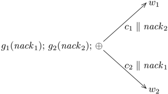

## 6.5 Discussion

CML provides four basic event combinators: choose, wrap, guard, and withNack.

The fi rst three combinators have analogs in many concurrent languages, but the
withNack combinator is unique to CML. Adding support for negative
acknowledgements was motivated originally by the need to program protocols, such
as the input stream example above. But further analysis shows that the concept
of negative acknowledgements is a natural part of the design space. To
illustrate this, consider the most general form of event value without internal
choice, which has the abstract form

<!-- formula-not-decoded -->

where g is the guard function (parameterized by the negative acknowledgement
event nack), c is the commit point, and w is the wrapper function. Figure 6.4
gives a diagrammatic view of the possible synchronization on the choice of two
such generalized event values. We see from this diagram that the negative
acknowledgement event is the complement of the commit event.

The choice of synchronous message passing for PML and CML was based on
experience and intuition, but as we see from the discussion in Section 6.4,
there are strong technical arguments for it as well. In practice, however, one
needs a richer collection of synchronization primitives. Support for timeouts
and operating system events are obvious extensions, but it is also useful to
have other fl avors of communication primitives, such as asynchronous channels
and synchronizing memory. A nice aspect of fi rst-class synchronous operations
is that additional synchronous operations can be easily incorporated in the
framework as new types and event-value constructors. Furthermore, these
additional operators can be implemented either as primitives or on top of the
existing primitives without affecting their semantics.

The fact that CML is a library on top of SML/NJ forces certain design choices,
such

as the use of functions to create threads and channels dynamically. The most
interesting of these forced choices is the introduction of a type of value to
represent communications and their associated actions. In retrospect, this
choice seems to be a natural consequence of adding message passing with choice
to SML as a library. 7 This is best explained by an example. Assume that we have
a boolean valued channel cb and an integer valued channel ci, and want to choose
a value from one of them. To make the types work out, we must use a wrapper
function around at least one of the recvEvt operations ( e.g., wrapping a
function that maps integers to booleans around the recvEvt on ci). Since type
constructors in SML have a fi xed number of arguments, we are forced to
represent the result of wrapping a channel I/O operation as an abstract value
(the underlying type of the channel cannot be part of the result type), which
requires a type constructor for the type of these abstract values. 8 If we are
willing to restrict ourselves to homogeneous choice, then fi rst-class
synchronous operations are not required (for example, see Section 10.4.3).

## Notes

The idea of fi rst-class synchronous operations was fi rst incorporated in the
design of concurrency mechanisms for PML [Rep88], which was in turn in fl uenced
by Cardelli's language Amber [Car86]. The design of CML has also been discussed
in [Rep91a], [Rep92], and [PR97]. As mentioned above, adding message passing
with selection to an ML -like language seems to result in something similar to
fi rst-class synchronous operations. Two other examples of this are Holmstr¨
om's language PFL, and Ramsey's concurrency primitives for SML [Ram90]. These
designs, however, were not motivated by the need to support abstraction.

The expressiveness results presented in Section 6.4 are joint work between the
author and Panangaden [PR97]. They are proven using an abstract model of process
interaction and knowledge theoretic arguments. The strength of the common
knowledge achieved by a rendezvous operation depends on the form of the
rendezvous mechanism. For example, a primitive notion of atomic rendezvous
achieves common knowledge in the sense of Halpern and Moses [HM90], while a
rendezvous protocol achieves the weaker concurrent common knowledge [PT92].

7 The original design of events in PML was not forced in this way, since
communication was built into the language with special syntactic forms.

8 If the SML type system were extended to support existential types, this would
no longer be the case.

## A Software Build System

A natural application of concurrency is the management of multiple independent
tasks. For example, building a large C program involves a number of individual
compilations, each of which is run as a separate UNIX command. Since these
compilations are independent, they may be run at the same time (possibly on
different machines). In this chapter, we describe the implementation of a
'parallel' build system using CML.

## 7.1 The problem

The basic problem is that we are given a set of objects, and a set of
dependencies between the objects. Associated with some objects is an action that
describes how to build the object; other objects ( e.g., source fi les) do not
have associated actions. Taken together, they form an acyclic dependency graph,
whose topological order de fi nes the order in which objects should be built. We
use the term antecedents to denote the nodes that a node depends on, and
successors to denote the nodes that depend on it. The nodes of the graph are
classi fi ed into internal nodes (those that have non-zero in-degree), leaf
nodes (those with no antecedents), and the root node (which has no successors).
We restrict ourselves to graphs with exactly one root. For the graph to be well
formed, any internal node should have an associated action. Leaf nodes may also
have actions.

Also associated with each object is a timestamp that tells when the object was
last built or modi fi ed. If a node in the graph has a timestamp that is earlier
than the timestamp of one of its antecedents, then we say that the graph is
inconsistent. The problem of incrementally rebuilding a system is that of making
the dependency graph consistent.

In more concrete terms, the objects are fi les in the system, and the actions
are UNIX commands. We specify these dependencies using a UNIX-style make fi le,
which consists of a sequence of rules, possibly separated by blank lines. Each
rule is two lines: the fi rst is the object dependency information, and the
second line is the associated action. The action is a command in the underlying
system's command shell ( e.g., /bin/sh in

```
prog : main.o util.o
    cc -o prog main.o util.o

  main.o : main.c util.h
    cc -c main.c

  util.o : util.c util.h
    cc -c util.c

```

Listing 7.1: A simple make fi le

UNIX systems). The fi rst rule in the make fi le de fi nes the root object. More
formally, our make fi les have the following simple grammar:

```
File               ->   Root  Rule*
            Root               ->   Rule
            Rule               ->   Dependency EndOfLine Action EndOfLine
            Dependency    ->   Object  :  Object*

Where EndOfLine is the end-of-line marker, Action is an action, and Object is an object

```

Where EndOfLine is the end-of-line marker, Action is an action, and Object is an
object name token (in our case, this is a sequence of characters not containing
whitespace). Listing 7.1 gives a simple example of a make fi le in this syntax.
This make fi le de fi nes dependencies and actions for the objects prog, main.o,
and util.o. The dependency graph for this system is given in Figure 7.1. Looking
at this graph, one can see the potential for parallelism: namely, that the
objects util.o and main.o can be built independently.

### Image Description

The image is a tree diagram consisting of four main branches labeled as
"util.c", "util.h", "main.c", and "main.o". Each branch is connected to the
others through a set of arrows. The arrows indicate the direction of the flow of
information from one branch to another.

#### **Util.c**
* **Util.c** is the leftmost branch.
* **Util.c** is connected to the "util.h" branch.
* **Util.c** is connected to the "main.c" branch.
* **Util.c** is connected to the "main.o" branch.

#### **Util.h**
* **Util.h** is the rightmost branch.
* **Util.h** is connected to the "main.o" branch.
* **Util.h

Flow chart

Figure 7.1: The dependency graph for the make fi le in Listing 7.1

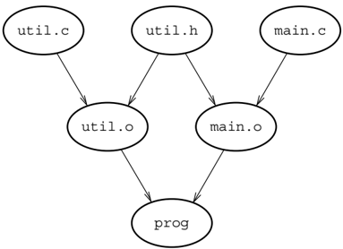

## 7.2 The design

Our make system is implemented as a function that takes a fi lename, and returns
a function for rebuilding the system:

```
val make : string -> unit -> bool

```

If the build operation is successful, then true is returned; a result of false
signi fi es that an error occurred in one of the actions.

The system translates the make fi le into a data fl ow network that represents
the dependency graph, with nodes for the objects, and communication channels for
the dependency edges. The messages sent along the dependency edges provide
double duty: in addition to notifying an object that its antecedents are
available, we also use them to communicate the timestamp of the antecedent
object. We use the following datatype to represent these messages:

```
datatype stamp
  = STAMP of Time.time
  | ERROR

```

Astamp is either the timestamp of the antecedent object or ERROR. In the latter
case, the antecedent is not available.

Each node in the graph is implemented as a separate thread. The outgoing edges
of a node ( i.e., the edges to its immediate successors) are represented as a
multicast channel, provided by the CML Library. 1 Using a single multicast
channel to represent all outgoing edges from a node has the advantage that it
simpli fi es the construction of the graph, since at the time that the node and
its channel are created we do not need to know how many successors it has.
Furthermore, it avoids introducing arti fi cial orderings among the successors,
which could inhibit parallelism or cause deadlock.

The system also has a controller thread that has a multicast channel to each of
the leaf nodes. Figure 7.2 gives the process network for the simple dependency
graph of Figure 7.1. In this picture, the ellipses represent the threads for the
leaf objects, the rectangles are the internal objects (the controller thread is
also a rectangle), and the grey bars represent the multicast channels. The
controller thread initiates a build sequence by sending a unit message to the
leaves, which in turn send timestamps to their successors. Once an internal node
has received timestamps from all of its antecedents, it executes its action to
build its object and then multicasts the timestamp of the newly created object.
Once the root receives timestamps from all of its antecedents, the build is
complete, and it noti fi es the controller.

We describe the implementation details of this design in the remainder of this
chapter. First we describe the construction of the data fl ow network from a
list of rules, then we

1 Multicast channels were also described in Section 5.5.

In this image, we can see a diagram.<end_of_utteranc

Flow chart

Figure 7.2: The process network for the simple dependency graph

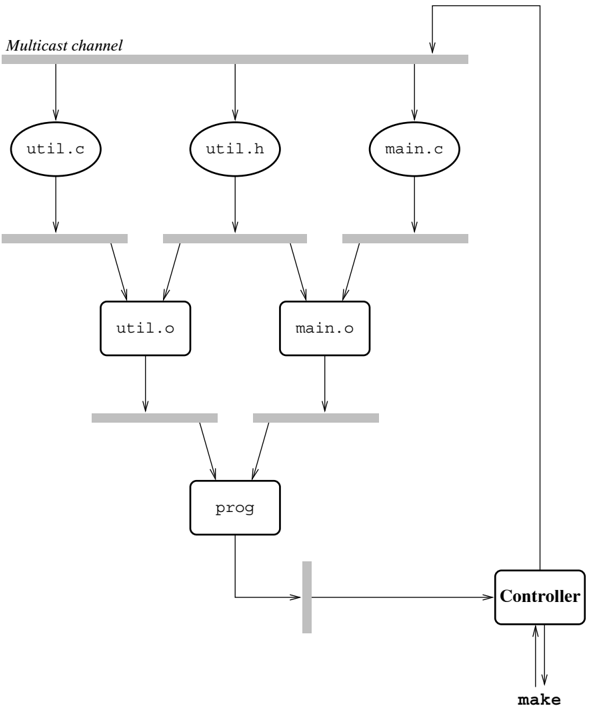

describe the implementation details of the threads at the nodes and leaves. We
complete the discussion by describing the make fi le parser and the top-level
glue that pulls it all together. The Notes section at the end of this chapter
offers implementation alternatives and possible extensions.

## 7.3 Building the dependency graph

The construction of the dependency graph network is done by the makeGraph
function (see Listing 7.2). The creation of the threads that represent the
leaves and internal nodes

```
7.3 Building the dependency graph
  135

-------------------------------------------------------------------------------
  fun makeGraph (signalCh, {root, rules}) = let
          val makeLeaf = makeLeaf signalCh
          datatype objnd_state
          = DEF of stamp Multicast.mchan
          | UNDEF of {
                  target : string,
                  antecedents : stringlist,
                  action : string
              }
          val objTbl = ObjTbl.mkTable (2 * length rules, Fail "ObjTbl")
          val insert = ObjTbl.insert objTbl
          val find = ObjTbl.find objTbl
          fun getNdName = (case (find Taint.objName)
                  of SOME(DEF nd) => Multicast.port nd
                  | _ => raise Fail "missing definition"
          (* end case *))
          fun addNd {target, antecedents=[], action} =
                  insert (target, DEF(makeLeaf{
                    target=target, action=SOME action
                  }))
          | addNd {target, antecedents, action} = (
                  insert (target, MARK);
                  insert (target, DEF(
                    makeNode {
                      target = target,
                      antecedents = map getNd antecedents,
                      action = action
                    }))
          and addLeaf target =
                  target=target, DEF(makeLeaf{
                    target=target, action=NONE
                  }))
          and insNd target = (case (find target)
                  | (SOME(DEF nd)) => ()
                  | (SOME MARK) => raise Fail "cyclic dependency"
                  | NONE => addLeaf target
                  | *end case *)
          in
          app (fn nd => insert(#target nd, UNDEF nd)) rules;
          app (fn nd => insNd(#target nd)) rules;
          case (find root)
            of (SOME(DEF nd)) => nd
            | _ => raise Fail "impossible: missing root definition"
          (* end case *)
        end

          Listing 7.2: The implementation of makeGraph

-------------------------------------------------------------------------------

```

Listing 7.2: The implementation of makeGraph

are provided, respectively, by the functions makeLeaf

```
are provided, respectively, by the functions makeLeaf

                                    val  makeLeaf  : unit Multicast.mchan -> {
                                                                target        : string,
                                                                action       : string option
                                                            } -> stamp Multicast.mchan

        and makeNode

                            val  makeNode  : {
                                                        target        : string,
                                                        antecedents : stamp Multicast.port list,
                                                        action       : string
                                                    } -> stamp Multicast.mchan

        These functions are described in Section 7.4.

```

These functions are described in Section 7.4.

The input to the makeGraph function is the multicast channel for signaling the
start of a build cycle, and a record consisting of the name of the root object
and the list of rules. Each rule in the list is a record of the target name,
list of antecedent names, and the string specifying the action. To translate
this list-based representation of the graph into the network, we need a
mechanism to map object names to nodes in the network. For this purpose, we de
fi ne the structure ObjTbl:

```
structure ObjTbl = HashTableFn (
        struct
          type hash_key = string
          val hashVal = HashString.hashString
          fun sameKey (s1 : string, s2) = (s1 = s2)
        end)

```

which implements hash tables on object names using the HashTableFn functor from
the SML/NJ Library.

The makeGraph function begins by creating a fresh hash table for mapping object
names to the state of its network node. These states are represented by the
following datatype:

```
datatype objind_state
      = DEF of stamp Multicast.mchan
      | MARK
      | UNDEF of {
              target : string,
              antecedents : string list,
              action : string
            }

thru in the input makeCspan.monotop.objfort.defined

```

Initially, for each rule in the input, makeGraph maps the object de fi ned by
the rule to the UNDEF state. There are actually four states that a node might be
in during construction of the network:

1.  De fi ned -when the node and all of its antecedents have been created and
   linked into the network. This state is represented by mapping the node to
   DEF( mc),

*   where mc is the multicast channel used by the node to send currency
  information to its successors.
2.  Marked -when the antecedents of the node are being constructed, prior to de
   fi ning the node itself. This state is necessary to detect cycles in the
   dependency graph, and is represented by mapping the node to MARK.
3.  Unde fi ned internal node -whenthe node has not been encountered yet. This
   state is represented by mapping the node to UNDEF( info), where info is the
   initial rule information for the node.
4.  Unde fi ned leaf -when the leaf node has not been encountered yet. This state
   is represented by the node not being mapped (recall that a leaf node does not
   have antecedents and thus may not be the target of any rule in the make fi
   le).

Once the hash table has been initialized, we construct the network by applying
the function insNd to the target object of each rule. This function looks the
target up in the hash table and processes it according to which of the four
possible states it is in. If the target node is de fi ned, then there is no
further action required. If the target node is marked, then there is a cycle and
the Fail exception is raised (this case occurs on recursive calls to insNd). In
the case that the target node is unde fi ned, we call the function addNd, which
does a depthfi rst traversal of the subgraph rooted at the target node. As each
internal node is visited in this traversal, it is fi rst marked, and then we
apply insNd to its antecedents, and fi nally we create the network node for the
object using makeNode. Lastly, if the target node is an unde fi ned leaf ( i.e.,
not in the table), then we call addLeaf, which adds it to the table as a de fi
ned leaf node.

## 7.4 Creating the graph nodes

The main work of the system is performed by the threads that represent the nodes
in the dependency graph. As mentioned above, there are two functions for
creating the leaf and internal nodes. The threads spawned by these functions are
responsible for running actions and getting currency information from the fi le
system. To help with this, we de fi ne a few useful system operations (see
Listing 7.3). The function getMTime gets the timestamp of a fi le (or ERROR if
the fi le does not exist); the function fileStatus checks to see if a fi le
exists, and if so returns SOME of its modi fi cation time - otherwise it returns
NONE; and the function runProcess runs an action and returns true if the
execution was successful.

The function makeNode is used to create a thread for an internal node in the
graph. It takes as arguments the name of the object corresponding to the node, a
list of antecedent events, and the action that builds the object. It creates the
thread for the object,

2Noto that cince the multiogst channel ic cunch

```
fun getMTime objName =
            STAMP(OS.FileSys.modTime objName)
            handle _ => ERROR

    fun fileStatus path = if (OS.FileSys.access (path, []))
            then SOME(OS.FileSys.modTime path)
            else NONE

    fun runProcess prog =
            (OS.Process.system prog = OS.Process.success)
            handle _ => false

```

```
fileStatus path = if (OS.FileSys.access (path, [])))
       then SOME(OS.FileSys.modTime path)
       else NONE

runProcess prog =
   (OS.Process.system prog = OS.Process.success)
     handle _ => false

           Listing 7: Useful system operations
```

and returns the multicast channel used to communicate with the node's
successors. The implementation of makeNode is given in Listing 7.4.

The body of a the thread is a loop (the function objThread) that iterates once
for each build cycle. On each iteration it fi rst waits for all of its
antecedents to be made current. 2 Once it has received stamps from all of its
antecedents, it determines the most recent stamp. If an ERROR stamp was
received, the thread immediately propagates the ERROR stamp. Otherwise, it
checks the currency of the object by comparing the most recent antecedent stamp
with the modi fi cation time of the object. In the case that the object does not
exist, we use time zero for its timestamp. If the object's timestamp predates
the antecedent's, then the object needs to be rebuilt. Finally, the object's
timestamp (after rebuilding) is multicast to its successors. If an error occurs
while rebuilding the object (signaled by an exception), an error message is
printed and the ERROR stamp is sent instead of the timestamp.

The implementation of makeLeaf is somewhat simpler, since there are no
antecedents; the implementation is given in Listing 7.5. The makeLeaf function
takes as arguments the signal channel that the controller uses to start a build
cycle, and the object name and an optional action. The function allocates a new
multicast channel for sending the objects currency information to its
successors; this channel is returned as the result. This distinction between
leaves with actions and those without is encapsulated in the doAction function.
Where there is an action, doAction runs it; otherwise, it just returns true
(signifying a successful execution).

As with makeNode, the body of a leaf thread is a loop (the function waiting)
that iterates once for each build cycle. An iteration is triggered by a signal
coming in from the controller via the multicast channel signalCh. Each iteration
consists of executing

2 Note that since the multicast channel is asynchronous, we can synchronize on
the antecedent events in any order without risking deadlock. If we were using
synchronous message passing, then we would have to use selective communication.

```
7.5 Parsingmakefiles
  139

-------------------------------------------------------------------------------
    fun makeNode {target, antecedents, action} = let
        val status = Multicast.mChannel()
        fun notify msg = Multicast.multicast (status, msg)
        fun objThread () = let
                val stamps = map Multicast.recv antecedents
                fun maxStamp (STAMP t1, STAMP t2) =
                    if (Time.< (t1, t2))
                        then STAMP t2 else STAMP t1
                    | maxStamp _ = ERROR
        in
            case foldr maxStamp (STAMP Time.zeroTime) stamps
                of ERROR => notify ERROR
                | (STAMP t) => let
                    fun doAction () = if (runProcess action)
                            then notify (getMTime target)
                            else (
                                TextIO.output(TextIO.stdErr, concat [
                                    '"Error making \"", target, "\"\n"
                                ]);
                                notify ERROR)
                    in
                        case (fileStatus target)
                        of (SOME objTime) =>
                            if (Time.< (objTime, t))
                            then doAction ()
                            else notify (STAMP objTime)
                        | NONE => doAction ()
                        (* endcase *)
                    end
                (* end case *)
                objThread ()
            end
        in
            spawn objThread;
            status
        end


                Listing 7.4: The implementation of makeNode
-------------------------------------------------------------------------------

```

Listing 7.4: The implementation of makeNode

the action (if any), getting the timestamp of the object, and then sending the
stamp out on the multicast channel to the leaf's successors. If executing the
action results in an error, then the thread prints an error message and sends
the ERROR stamp.

## 7.5 Parsing make fi les

The other major portion of the system is the parser that translates a make fi le
to a form suitable for makeGraph. We implement a low-tech parser for the grammar
given in Section 7.1; a full-featured make system would require a richer grammar
and might better

```
/* A JOWari Build System

            fun makeLeaf signalCh {target, action} = let
                val start = Multicast.signalCh
                val status = Multicast.mChannel()
                fun notify msg = Multicast.multicast (status, msg)
                val doAction = (case aaction
                        of (SOME act) => (fn () => runProcess act)
                        | NONE => (fn () => true)
                (* end case *)
                waiting () = (
                    Multicast.recv start;
                    if (doAction())
                        then notify (getMTime target)
                        else (
                            TextIO.output(TextIO.stdErr, concat [
                                "Error making \"", target, "\"\n"
                            ]);
                            notify ERROR);
                    waiting ())
                in
                    spawn waiting;
                    status
                end

                    Listing 7.5: The implementation of makeLeaf:
```

Listing 7.5: The implementation of makeLeaf

be handled using an automatic parser-generation tool, such as ML-Yacc. The code
for the parser is given in Listing 7.6. The parser works by parsing rules until
the end-offi le is encountered (signi fi ed by the empty string). We use the
Substring module from the SML Basis Library to implement various string
manipulations. The function stripWS takes a line and strips any leading and
trailing whitespace from it; stripWS returns a substring for further
manipulation. The function getRule is responsible for parsing the two lines that
comprise a rule. It uses parseRule to parse the dependency line into the target
and antecedents. If the dependency information is not well formed, or if the
action is missing, then the Fail exception is raised. The action part of the
rule is not analyzed beyond stripping any leading or trailing white space from
the line (in particular, we do not check for empty actions).

## 7.6 Putting it all together

The fi nal step is to glue the parser with the graph-builder, and to de fi ne
the controller thread. These tasks are handled in the body of the make function,
which is given in Listing 7.7. This function parses the make fi le and builds
the dependency graph from it. It then creates the controller thread, and returns
a request/reply interface to the controller.

The controller thread is a loop consisting of three simple steps. Each iteration
begins

```
7.6 Putsing it all together

-------------------------------------------------------------------------------
    structure SS = Substring

    fun parseMakefile strm = let
            fun stripWS l = SS.dropl Char.isSpace
                    (SS.dropr Char.isSpace (SS.all l))
            fun getLine () = (case (TextIO.inputLine strm) of "" => NONE
                    | l -> SOME(stripWS l)
                    | * end case *)
            fun getNonBlankLine () = (case getLine()
                    | NONE -> NONE
                    | ( SOME l) => if (SS.isEmpty l)
                        then getNonBlankLine()
                        else SOME l
            | * end case *)
            fun parseRule l =
                    map (SS.tokens Char.isSpace)
                    (SS.fields (Char.contains ":") l)
            fun getRule () = (case (getNonBlankLine ())
                    | NONE => NONE
                    | ( SOME l) => (case (parseRule l)
                            of [(dst, srcList) => (case getLine()
                                    of (SOME act) => SOME{
                                        tavents = SS.string dst,
                                        accents = map SS.string srcLst,
                                    }
                                    | NONE => raise Fail "Missing action"
                                    | _ => raise Fail "Rule syntax"
                    | (* end case *))
                    | parse rules *)
            fun (case rule) =
                    of (SOME rule) => parse (rule::rules)
                    | NONE => rev rules
            in
            case parse []
                of [] => raise Fail "Empty makefile"
                    | (rules as ({target, ..}) :: _) =>
                        {root = target, rules = rules}
            (* end case *)
        end

                        Listing 7.6: The makefile parser
-------------------------------------------------------------------------------

```

Listing 7.6: The make fi le parser

```
fun make file = let
            val reqCh = channel() and replCh = channel()
            val signalCh = Multicast.mChannel()
            val inStrm = TextIO.openIn file
            val rootCh = makeGraph (signalCh, parseMakefile inStrm)
            val handle_ex => (TextIO.closeIn inStrm; raise ex)
          val root = Multicast.port.rootCh
          fun controller () = (
                recv reqCh;
                Multicast.multicast(signalCh, ());
                case (Multicast.recv root)
                of (STAMP _) => send (replCh, true)
                | ERROR => send (replCh, false)
                (* end case *);
                controller ())
          in
            TextIO.closeIn inStrm;
            spawn controller;
            fn () => (send(reqCh, ()); recv replCh)
          end

                    Listing 7.7: The implementation of make
```

Listing 7.7: The implementation of make

with the controller waiting for a request to initiate a build of the system.
When a request is received, the controller sends out a signal to the leaves on
the multicast channel signalCh. The controller then waits for the currency
information from the root object. If it receives a timestamp, then it reports
success on the reply channel; otherwise it reports failure. At this point, the
system is ready for another iteration.

## Notes

This chapter illustrates the use of CML as a concurrent shell language. Many
applications of shell languages provide opportunity for parallelism - either
using a uniprocessor's multitasking or by exploiting multiprocessors or local
area networks of workstations. In this chapter, we have seen how CML can be used
to structure parallel execution of system processes. More traditional shells
have also been used for this purpose. For example, Fowler describes a version of
sh that supports execution on remote processors in a local area network [Fow93],
and the Condor system developed at the University of Wisconsin provides an
infrastructure for using a local area network as a parallel processor [BLL92].

The make system described in this chapter is quite restricted in its function.
There are a number of obvious extensions that the reader may wish to consider.
For example, the system could support multiple root objects and allow the
desired target to be de fi ned

as an argument to the make function. This would require a very different pattern
of communication, since only the antecedents of the target should be built. We
might also want to allow any arbitrary node to be the target. Another example is
to support tools that produce multiple objects. A common example are parser
builders, such as ML-Yacc, which produces both an interface and an
implementation.

Another issue is the mechanism used to trigger rebuilds. In most make systems,
this is under user control, but it might be useful to have a system that
automatically rebuilds the system when any leaf object changes. There are many
applications of such event-driven systems, and this may be a fruitful area for
the use of languages like CML. For example, an effort is underway to implement a
version of the Yeast system in CML, 3 which is a general-purpose tool for
implementing event-driven applications [KR95].

The UNIX make program was invented by Feldman in the late '70s [Fel79], and has
been a mainstay of the UNIX development environment ever since. Oram and Talbott
discuss the UNIX make program in detail [OT91], while Fowler discusses many of
the issues related to the design and implementation of make and related tools
[Fow90].

Another way to organize this type of system is as a demand-driven computation.
Instead of objects sending their timestamp to their successors, they could
demand the timestamps of their antecedents. This kind of communication pattern
would be able to support the multiple root objects suggested above.

3 Balachandra Krishnamurthy, personal communication, 1995.

## A Concurrent Window System

The control structure of an interactive program can be quite complex when
implemented in a sequential language. This problem arises because interactive
programs must be able to deal with asynchronous external events responsively,
while also executing the application code. The usual solution to this problem is
to structure the program around a central event loop, which dispatches control
to parts of the application in reaction to external events. Often, the
event-loop is part of a library, and applications are programmed using the
so-called ' inverted program structure .' 1 This is not too bad when the
application is purely reactive, that is, it only does something as a reaction to
user input, but many interactive applications do not fi t this model. In such
cases, the application must de fi ne special call-backs to perform computation
when the system is otherwise idle. In order to guarantee responsiveness, these
call-backs must execute quickly and then pass control back to the event loop. In
effect, the use of an event-loop is a 'poor man's concurrency.' This structure
makes programming computationally signi fi cant algorithms dif fi cult, and
leads to a bias towards reactive, or input-driven, systems. 2

A more natural way to program these systems is as a set of communicating
processes. Some window systems, such as the X Window System, provide concurrency
between applications by using multiple system processes, but the individual
applications are sequential and suffer from the problems mentioned above. Using
a concurrent language to program all aspects of the window system, from the
window manager to application code, leads to a much cleaner structure and
exposes more of the system's natural concurrency.

In this chapter, we examine a toy window system implemented in CML, along with a
simple example application. Compared to the latest graphical web applets and
fancy user interface builders, this system is primitive and crude. The reader
should understand that

1 Inverted in the sense that the library has control and calls application code,
instead of the other way around.

2 The reader may recall that these issues were discussed in somewhat greater
detail in Section 1.1.1.

the focus of this chapter is on the use of concurrency to handle user
interaction. While the graphics side of the system is primitive, it is suf fi
cient to provide a realistic context.

## 8.1 Overview

The rˆ ole of a window system is to manage multiple windows on a display, which
are being used by independent client applications. The window system provides
the client applications with access to their subset of the display, and to the
multiplexed keyboard and mouse input devices. To the clients, it is as if they
are executing with their own display, keyboard, and mouse. Thus we can view a
client as a function that takes a window, keyboard, and mouse as arguments.
Pictorially, we can view a client as

Flow chart

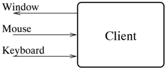

Since the window system itself executes in an environment consisting of a
window, keyboard, and mouse, we can view it as a client too.

The function of a window system is typically divided into three logically
distinct components: a display system that multiplexes the display, mouse, and
keyboard among multiple clients, and provides an abstraction layer over the
hardware; a user-interface library that provides an API for graphics and user
input; and a window manager that allows the user to manage applications. To
simplify the presentation, we assume the existence of the display system and
user-interface library, which are described in the next two sections, and focus
on the implementation of the window manager and sample clients.

## 8.2 Geometry

The display has the standard rectilinear geometry, with one unit representing
one pixel on the screen. As is conventional, the origin is in the
upper-left-hand corner, x coordinates increasing to the right and y coordinates
increasing downwards. There are two geometric types used in this chapter: points
and rectangles. These types are de fi ned in the structure Geom. In addition,
the Geom structure also provides a small collection of standard operations on
points and rectangles. Its signature is given in Listing 8.1. Most of these
operations have the obvious semantics, but a few of them may be unfamiliar:

ptLess( p 1 , p 2 ) returns true if p 1 is above and to the left of p 2 .

rectOrigin( r ) returns the upper left-hand corner of the rectangle.

```
8.3 The display system


datatype point = PT of {
        x : int, y : int
    }

 datatype rect = RECT of {
        x : int, y : int,
        wid : int, ht : int
    }

 val origin : point
 val ptAdd : point * point -> point
 val ptSub : point * point -> point
 val ptLess : point * point -> bool

 val rectOrigin : rect -> point
 val rectMid : rect -> int
 val rectHt : rect -> int
 val rectMove : (rect * point) -> rect
 val rectAdd : (rect * int) -> rect
 val rectSub : (rect * point) -> rect
 val rectWithin : (rect * rect) -> rect


    Listing 8.1: The Geom structure's signature

```

Listing 8.1: The Geom structure's signature

rectMove( r, p) moves the origin of r to p and returns the new rectangle.
rectInset( r, n) returns a rectangle that is inset from r by n pixels in each
dimension ( i.e., the origin is moved down and to the right by n pixels, and the
width and height are decreased by 2 ∗ n each). Note that by specifying a
negative value for n, we can grow the rectangle. rectAdd( r, p) adds p to the
origin of r and returns the new rectangle. rectSub( r, p) subtracts p from the
origin of r and returns the new rectangle. rectWithin ( r 1, r 2) returns a
rectangle with the size of r 2 that is within r 1. It does this by moving r 2
the minimum distance required for it to be contained by r 1. If r 2 is wider
(resp. higher) than r 1, then r 2 's left side (resp. top) is aligned with r 1
's.

## 8.3 The display system

Our display system provides a simple black and white bitmap-graphics model with
a small collection of drawing operations. For input devices, the display system
provides a simple keyboard and a single-button mouse. The DpySystem structure
implements an

```
148
                       8 A Concurrent Window System

-----------------------------------------------------------------------------
signature DPY_SYSTEM =
   sig
      ...
      datatype raster_op = COPY | XOR | OR | AND | CLR | SET

      datatype texture = SOLID | TEXTURE of word list

      val draw_line : bitmap -> raster_op -> (Geom.point * Geom.point) -> unit
      val drawRect : bitmap -> raster_op -> Geom.rect -> unit
      val fillRect : bitmap -> (raster_op * texture) -> Geom.rect -> unit

      val bitbit : {
                  dst : bitmap,
                  crop : raster_op,
                  pt : Geom.point,
                  src : bitmap,
                  srcRect : Geom.rect
               } -> unit

      val drawText : bitmap -> raster_op -> (Geom.point * string) -> unit

      val stringSize : (bitmap * string)
            -> {wid : int, ht : int, ascent : int}
      ...
   end; (* DPY_SYSTEM *)

                       Listing 8.2: Graphical types and operations

-----------------------------------------------------------------------------

```

Listing 8.2: Graphical types and operations

interface to the display system; it has the signature DPY\_SYSTEM, which is
detailed in the rest of this section.

## 8.3.1 The graphics model

The display system provides bitmaps, which are rectangular collections of
one-bit pixels. Asmall set of standard graphical operations is provided; Listing
8.2 gives the signature of these operations. Each operation takes a raster\_op
as an argument, which determines the effect of the drawing operation. Each
raster operator is a different function of the source and destination pixels;
Table 8.1 gives the semantics of these operators. For the drawText, drawLine,
and drawRect operations, the source pixel is always black. For the fillRect
operation, the source pixels are speci fi ed by the texture argument, and for
bitblt operation, the source pixels are taken from the source bitmap.

The function drawLine draws a line between the given points, which includes the
end points. Applying drawLine to the argument ( p, p) draws a single pixel at
the point p. The function drawRect draws a rectangle, and the function fillRect
fi lls a rectangle with a given texture. A texture is a 16 × 16 array of pixels;
it can either

SET

Uperator

Uperator (0 0) 10 °) (° °) 1°

rDV

3 Come airly window custome uced the «iling"

(source destination)

Table 8.1: Rastor operator semantics ( ◦ = white, · = black)

|          | (source destination)   | (source destination)   | (source destination)   | (source destination)   | (source destination)   |
|----------|------------------------|------------------------|------------------------|------------------------|------------------------|
| Operator | ( ◦                    | ◦ )                    | ( ◦                    | ( • ◦ )                | ( • • )                |
| CPY      | ◦                      |                        | ◦                      | •                      | •                      |
| XOR      | ◦                      |                        | •                      | •                      | ◦                      |
| OR       | ◦                      |                        | •                      | •                      | •                      |
| AND      | ◦                      |                        | ◦                      | ◦                      | •                      |
| CLR      | ◦                      |                        | ◦                      | ◦                      | ◦                      |
| SET      | •                      |                        | •                      | •                      | •                      |

be SOLID ( i.e., all 1 's) or represented as a list of 16 words, with the
high-order bit of the fi rst word being the upper-left-hand corner ( i.e.,
row-major order). A bit value of 0 is drawn as white and a 1 is drawn as black.
There is an important difference between the way that drawRect and fillRect
interpret their arguments: drawRect draws a rectangle that is wid +1 pixels wide
and ht +1 pixels high, while fillRect fi lls a wid × ht block of pixels.

The most complicated operation is bitblt, which copies a rectangle of pixels
from one bitmap ( src) to another ( dst). The srcRect argument speci fi es the
rectangle to copy in the source bitmap, and the pt argument speci fi es the
upper-left-hand corner of the rectangle in the destination.

There are two functions that support the drawing of text: drawText draws the
given string starting at the given point, and stringSize returns the size that
the rendered image of a string would have. The size of a piece of text is
described in terms of the rectangle that it occupies (with height ht and width
wid), and the distance from the top of the rectangle to the baseline (the
ascent). When drawing text, its position is given in terms of the baseline (
i.e., the y coordinate of the point given to drawText speci fi es the position
of the text's baseline).

## 8.3.2 Layers

Most modern window systems support the ' covered window ' paradigm, in which
windows are allowed to overlap. 3 When a portion of a window is covered by
another window

3 Some early window systems used the ' tiling ' paradigm, in which the total
area covered by windows is limited to the size of the display.

```
signature DPY_SYSTEM =
      sig
        ...
        type bitmap

        val mkBitmap : (bitmap * Geom.rect) -> bitmap
        val toFront : bitmap -> unit
        val toBack : bitmap -> unit
        val move : (bitmap * Geom.point) -> unit
        val delete : bitmap -> unit

        val sameBitmap : (bitmap * bitmap) -> bool
        val bitmapRect : bitmap -> Geom.rect
        val bitmapClr  : bitmap -> unit
        ...
      end; (* DPY_SYSTEM *)

                      Listing 8.3: Layer operations
```

Listing 8.3: Layer operations

and then becomes uncovered, the newly unobscured area must be displayed on the
screen. There are various techniques for supporting covered windows. The Toy
Display System uses the ' layers ' approach, which is perhaps the simplest
technique from the point of view of the window system. In this model, the
display system is responsible for keeping track of the contents of any obscured
regions. The refreshing of obscured regions is handled completely by the display
system, and does not require window system or client action.

Acommonalternative to the layers approach is the so-called ' damage control '
model. In this scheme, the display system informs the client when an obscured
portion of its window has become exposed. The client is responsible for
redisplaying the obscured portion. While this is much simpler for the display
system implementation, it adds an implementation burden to the client code,
which is why we use the layers model here.

Listing 8.3 gives the signature of the operations provided by the Toy Display
System to support overlapping windows. In this scheme, we use the bitmap type to
represent windows. The function mkBitmap creates a new subwindow of the given
bitmap. The rectangle argument speci fi es the position and size of the
subwindow with respect to its parent's origin. The newly created bitmap will
have its own coordinate system with its origin at its upper-left-hand corner,
and the contents of the new bitmap will occlude its parent. Using the mkBitmap
function, one can create a tree-structured hierarchy of windows. At each level
of the hierarchy, there is also a front-to-back ordering on the windows. For the
children of a single parent, this order is initially determined by the order of
creation (windows are created in front), but it can be changed by the toFront
and toBack functions, which move the speci fi ed window to the front (resp.
back) of all

4 Thece are often colled input onte but me wis

```
signature DPY_SYSTEM =
      sig
        ...
        datatype mouse_msg = M of {btn : bool, pos : Geom.point}

        val mouseUp     : mouse_msg -> bool
        val mouseDn     : mouse_msg -> bool
        val mousePos    : mouse_msg -> Geom.point
        val mouseTrans : Geom.point -> mouse_msg -> mouse_msg

        datatype key_press = K of char

        val keyDEL : key_press
        val keyBS    : key_press
        val keyRET  : key_press
        val keyTAB  : key_press
        ...
      end; (* DPY_SYSTEM *)

                  Listing 8.4: Keyboard and mouse messages
```

Listing 8.4: Keyboard and mouse messages

of its siblings. If two windows at the same level in the hierarchy have
different parents, then their order is de fi ned by the order of their parents.
The position of a window with respect to its parent can be changed by the move
operation. The move operation also has the effect of moving the window to the
front of its siblings. Lastly, the delete operation deletes a window, and all of
its subwindows.

Listing 8.3 also includes three other operations on bitmaps. The sameBitmap
function returns true when its two arguments are the same bitmap. The bitmapRect
function returns the rectangle that a bitmap occupies in its parent's coordinate
system. And the bitmapClr function clears all the pixels in the bitmap to white.

## 8.3.3 Keyboard and mouse input

The keyboard and mouse input devices each generate a stream of input messages. 4
Mouse messages carry information about the mouse's button and the current
position of the mouse cursor in the display's coordinate system. The
representation of mouse messages is given in Listing 8.4. Together, these values
constitute the mouse state. The DpySystem structure provides a small collection
of functions for examining mouse messages and a function ( mouseTrans) for
translating the mouse position relative to a point. The latter function is used
when propagating mouse messages from parents to

4 These are often called input events, but we wish to avoid confusion with CML
's events.

children. Each time the mouse state changes, the display system sends a new
mouse message.

Likewise, whenever the user presses a key on the keyboard, the display system
sends a new key\_press message, which is also de fi ned in Listing 8.4. We
assume a simple keyboard with the printable characters, and a few special keys.
Symbolic values are de fi ned for some of the special keys: return ( keyRET),
backspace ( keyBS), delete ( keyDEL), and tab ( keyTAB). As one would expect,
the interface to these streams of input messages is event-valued.

## 8.3.4 Initialization

The last part of the display system interface is the initialization function,
which has the following speci fi cation:

```
signature DPY_SYSTEM =
         sig
            ...
           val display : string option -> {
                  dpy   : bitmap,
                  mouse : mouse_msg event,
                  kbd    : key_press event
               }
         ...
      end; (* DPY_SYSTEM *)

function initializes the display system and returns the display
```

The display function initializes the display system and returns the display
bitmap and the mouse and keyboard input streams (represented as event values).
The display system is shut down when either the CML program exits or when the
display bitmap is deleted.

## 8.4 The Toy Window System architecture

The display system described above provides a way to create bitmaps and to draw
on them, and it provides a single point of access to the mouse and keyboard
input devices. In order to write graphical applications that can run
concurrently, we need mechanisms for managing bitmaps and for distributing
input. These mechanisms are the job of the window system. The window system de
fi nes a policy for how windows and their associated threads interact, and
provides code that supports the implementation of that policy in graphical
components and applications.

In the Toy Window System, a graphical component has a bitmap associated with it
that it uses to display information to the user. In many cases, the component
may also have sub-components, which, in turn, have their own associated bitmaps.
This hierarchy of nested components is supported by the display system's
mkBitmap function, which takes the parent bitmap as an argument. We also use
this hierarchy of nested components

to guide the distribution of user input. We use the same interface and
interaction protocols for all graphical components in the system, ranging from
simple components like push buttons, through applications to even the window
manager.

As we noted above, a graphical component or application can be viewed as a
function that takes its window, keyboard, and mouse as arguments, but in
practice things are a bit more complicated. In addition to the mouse and
keyboard, components need to communicate control information to their parent and
children. Thus, we represent a window environment as a record type ( win\_env)
consisting of a bitmap, three input channels (mouse, keyboard, and control in),
and a mailbox for outbound control messages. We use a mailbox for the
command-out communication channel, instead of a channel, as a way to break the
cyclic dependency between the parent and child. If not broken, this dependency
could result in deadlock ( e.g., the child is trying to send a control message
to its parent, while the parent is trying to send the child a mouse message).

The win\_env type is de fi ned in the WSys structure, whose signature can be
found in Listing 8.5. The WSys structure de fi nes a collection of types
(including win\_env) that speci fi es the interface between components. It also
implements a mapping from the display manager's interface to the interface de fi
ned by these types. The functions bmap, mouse, kbd, cmdIn, and cmdOut may be
used to project the components of a window environment. The rect function
returns the rectangle of the environment's bitmap. The sameBitmap function
returns true if the two argument environments contain the same bitmap; it is
used to check the identity of environments. Sometimes it is useful to ignore all
of the messages on one of an environment's channels; the sink function serves
this purpose. The init function initializes the display system and then wraps up
the root bitmap and raw input channels provided as a window environment. Sending
a delete command (described below) on the command-out mailbox of this
environment causes the display system to shut down. We describe the other
operations in the WSys structure in the remainder of this section.

## 8.4.1 The window manager

The window manager is an application that supports creating and destroying
applications and their windows. As noted above, the window manager has exactly
the same interface to its parent as any other component or application, which
means that it is possible to recursively run a copy of the window manager inside
an application window.

## 8.4.2 Input routing policy

A distinguishing feature of a window system is the policy used to decide which
client should receive a particular user input event. For our system, which uses
a top-down

```
8 A Concurrent Window System

-----------------------------------------------------------------------------
    signature WSYS =
        sig

            type bitmap = DpySystem.bitmap
            datatype mouse_msg = datatype DpySystem.mouse_msg
            datatype key_press = datatype DpySystem.key_press
            datatype cntl_msg = CMD of {
                msg  : string,
                rect : Geom.rect option
            }

            datatype win_env = WEnv of {
                win : bitmap,
                m    : mouse_msg chan,
                k     : key_press chan,
                ci    : cntl_msg chan,
                co    : cntl_msg Mailbox.mbox
            }

            val mkEnv : bitmap -> win_env
            val resize : (bitmap * Geom.rect) -> (win_env -> 'a) -> 'a

            val bmap   : win_env -> bitmap
            val mcode   : win_env -> mouse_msg chan
            val kbd      : win_env -> key_press chan
            val cmmd   : win_env -> cntl_msg chan
            val cmout : win_env -> cntl_msg Mailbox.mbox
            val rect    : win_env -> Geom.rect

            val saeBitmap : (win_env * win_env) -> bool

            val sink : 'a chan -> unit

            val init : string option -> win_env

        end; (* WSYS *)

                         Listing 8.5: The window system interface

------------------------------------------------------------------------------

```

Listing 8.5: The window system interface

distribution of input messages, the choice of policy determines the
implementation of routing by the window manager.

Many window managers for the X Window System use the so-called ' focus follows
mouse ' policy, in which the current location of the mouse cursor determines
which client receives any keyboard or mouse input events. One wrinkle to this
policy is the mouse grab. Consider an application menu that pops up when the
mouse is depressed; we would like the menu to stay active as long as the mouse
button is depressed, even if the mouse leaves the area of the application. The
window manager's input-event router

provides this behavior by declaring that the application has grabbed the mouse
when the button is depressed ( i.e., all mouse messages are routed to the
application until the button is released).

The other common policy is to distinguish a particular window, called the
current window, and to direct all input messages to that window. The user is
required to change the current window explicitly by clicking with the mouse
(hence the name ' click to type ' for this policy). There are two versions of
this policy, which are distinguished by the treatment of mouse messages
generated when the mouse is outside the current application window. One approach
is to discard any mouse message that is generated outside the current window. In
this case, the router must support the mouse-grab mechanism. The other approach
is to route all input messages (except the down-click used to select a new
current window) to the current window. This approach does not require a special
mouse-grab mechanism, since all messages are being routed to the current window.

For the Toy Window System, we choose the last of these policies, as it is the
simplest to implement. The others are left as an exercise for the reader. Note
that under any of these routing policies, components must be able to handle
mouse messages with coordinates outside their window.

## 8.4.3 Window creation and deletion

In addition to the input routing policy, we need protocols to specify how parent
and child windows interact. In a fullfl edged system, this interaction would
include window movement and resizing, but to keep things simple, we are
concerned only with window creation and deletion.

As noted above, the window hierarchy is created top-down. First a parent creates
the bitmap and window environment for its child. Then the parent calls the
child's realization function, passing in the child's window environment. The
realization function creates the various threads that implement the child, and
any descendants of the child. The WSys structure (see Listing 8.5) provides two
functions to help with creating the hierarchy: the function mkEnv creates a
window environment given a bitmap ( i.e., it allocates the communication
channels); and the function realize takes a parent bitmap, a child rectangle and
realization function, and realizes the child.

Whenthe window system wants to delete an application window, it sends a "Delete"
message on the application's ci channel. When an application receives a deletion
request, it is responsible for suspending any activity, and then sending its
parent a "Delete" message via its co mailbox. When the window system receives a
"Delete" request, it is free to delete the application's bitmap (which also has
the effect of deleting all child bitmaps in the application). The application is
also free to initiate its own deletion by sending a request to the window
manager ( i.e., skipping the fi rst step of the protocol).

```
signature FRAME =
      sig

        type frame

        val frameWild  : int
        val mkFrame    : (WSys.win_env -> 'a)
             -> WSys.win_env -> (frame * 'a)
        val sameFrame : (frame * frame) -> bool
        val frameEnv  : frame -> WSys.win_env
        val highlight : (frame * bool) -> unit

    end;

```

Listing 8.6: The frame interface

## 8.4.4 Naming conventions

In the rest of this chapter, we follow the convention of introducing local names
for the common modules. The bindings we use are

```
structure G = Geom
  structure D = DpySystem
  structure W = WSys

```

## 8.5 Some simple components

Before diving into the full complexity of the window system implementation, let
us consider three simple examples of UI components in this framework.

## 8.5.1 Window frames

It is very common to decorate a window with a border or frame, and often the
frame may have both normal and highlighted modes (in fact, we use this in the
window manager below). While many window systems build this feature into their
windows, it is natural in our approach to implement a frame by embedding the
window in a frame window that is a few pixels larger in each dimension.

Since the frame window is the parent of the window being framed, it must be
allocated fi rst. The mkFrame function (see Listing 8.6) handles this by taking
a realization function as an argument, and returning both the frame and the
result of realizing the child. The Frame structure provides a few additional
operations on frames: the sameFrame function tests for equality, the frameEnv
function returns the environment used to communicate with the frame component,
and the highlight function

In this image, we can see a diagram with some text and a diagram with some
text.<end_of_utteranc

Flow chart

Figure 8.1: The Frame communication network

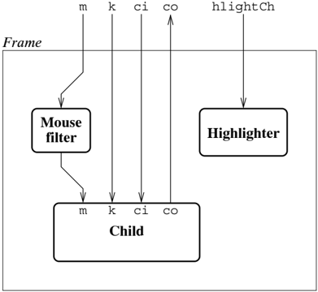

turns the highlighting of the frame's border on and off. The Frame structure
also exports the value frameWid, which is the width of the frame in pixels, so
that clients can compute layouts correctly.

For the most part, the implementation of frames is straightforward. Figure 8.1
shows the communication network that mkFrame sets up. Mouse messages must be fi
ltered to get the coordinate system right, but all other messages are passed
directly through without intervention. In addition, there is a thread for
managing the highlighting state of the frame.

Listing 8.7 gives the code for the frame implementation. Most of the
implementation of mkFrame is concerned with the geometry computations and
highlighting support. First, we compute three rectangles: frameRect is the
rectangle we draw for the outer frame; highlightRect is inset one pixel from
frameRect and is drawn when the frame is highlighted (giving a two pixel wide
frame); lastly, childRect is the rectangle that de fi nes the child bitmap
extent. Then we allocate the child's environment, which consists of a new
sub-bitmap, a new mouse channel, and the other channels from the frame's
environment. The mouseLp function is the body of the thread that translates
mouse messages from the frame's coordinate system to the child's, before passing
them onto the child. The highlightLp function provides control of the frame's
highlighting; it keeps track of the current highlighting state and accepts
requests on the hlightCh channel. After initializing the frame's graphics and
spawning the mouse fi lter and highlighting

```
8 A Concurrent Window System

---------------------------------------------------------------
    datatype frame = Fof {
        env : WSys.wenv,
        hlightCh : bool chan
    }

    fun mkFrame realize wenv = let
            val frameBM = WSys.bmap wenv
            val (frameRect, hlightRect, childRect) = let
                val G.RECT{wid, ht, ...} = D.bitmatrixRect frameBM
                in
                    ( G.RECT{x=0, y=0, wid=wid-1, ht=ht-3},
                     G.RECT{x=1, y=1, wid=wid-3, ht=ht-3},
                     G.RECT{wid=wid, y=framewid, ht=ht-2*frameWid
                     }
                )
            end
        val childEnv = WSys.WEnv{
                win = D.mkBitmap (frameBM, childRect),
                m = channel(),
                k = WSys.kbd,
                ci = WSys.cmdIn wenv,
                co = WSys.cmdOut wenv
            }
        val mTrans = D.mouseTrans (G.PT{x-frameWid, y-frameWid})
        fun mouseLp () = (
                send
                WSys.mouse childEnv,
                mtrans (recv (WSys.mouse wenv)));
            mouseLp ()
        val hlightCh = channel()
        fun drawHL interior = D.drawRect frameBM rator hlightRect
        fun hlightLp isOn = (case (isOn, recv hlightCh)
                of (true, false) => (drawHL D.CLR; hlightLp false)
                | (_, => hlightLp isOn
                | e => dcase *)
        in
            D.bitmapr frameBM;
            D.drawRect frameBM D.SET frameRect;
            ignore (spawn (fn () => hlightLp false));
            ignore (spawn (fn () => hlightLp false));
        end

    fun sameFrame (F{env=el, ...}, F{env=e2, ...}) =
            D.sameBitmap(WSys.bmap e1, WSys.bmap e2)
    fun frameEnv (F{env, ...}) = env
    fun highlight (F{hlightCh, ...}, b) = send(hlightCh, b)


                Llisting 8.7: The frame implementation
---------------------------------------------------------------

```

Listing 8.7: The frame implementation

Flow chart

Figure 8.2: The Button communication network

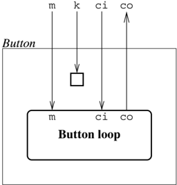

threads, the mkFrame function returns the frame and the result of realizing its
child. The representation of a frame is a record of its environment and the
channel for changing the highlighting; the other frame operations work on this
representation in the obvious way.

The observant reader will note that the frame implementation ignores the
deletion protocol described above (Section 8.4.3). We can get away with this for
two reasons: since the frame component is just a fi lter on mouse messages (and
completely ignores all other messages), it can rely on its child to handle the
deletion protocol interaction; and once the child has sent the "Delete" message
on its command-out mailbox, the parent of the frame will delete the frame's
bitmap, which also has the effect of deleting the frame's child's bitmap.

## 8.5.2 Buttons

Another standard component in user interfaces is the button. We implement
buttons in the Button structure, with the following interface:

```
val mkButton : (string * (unit -> unit))
            -> WSys.win_env -> WSys.win_env

```

The mkButton function takes a string, which is the button's label, and an action
function, and returns the button's realization function. The communication
network for the button component is quite simple: a single thread monitors both
the mouse and command-in channels, while the keyboard channel is diverted to a
sink. Figure 8.2 shows this network.

The button's implementation is given in Listing 8.8. As with the frame
component,

5 Given the routing alicy decaribed shore one

```
160

-------------------------------------------------------------------------------
  fun mkButton (msg, act) (wenv as W.ENv{win, m, k, ci, co}) = let
        val G.RECT{wid=butWid, ht=butHt, ...} = D.bitmapRect win
        val butRect = G.rectMove(D.bitmapRect G.origin)
        val {ht, wid, ascent} = D.stringSize (win, msg)
        val txtOrigin = G.PT{
                x = Int.max(0, (buWif - wid) div 2),
                y = Int.min(butHt-1, ((butHt - ht) div 2) + ascent)
                }
        fun mouseState (D.M{btn, pos}) = (btn, G.ptInRect(pos, butRect))
        fun loop wasInAndUp = let
                    fun handleM msg = (
                        case (wasInAndUp, mouseState msg)
                        of (true, (true, true)) => (act(); loop false)
                        | (_, (isDn, isIn)) => loop(not isDn andalso isIn)
                        (* end case *)
                    fun handleC (m as W.CMD{msg="Delete", ...}) =
                        Mailbox.send (co, m)
                    | handleC _ = loop wasInAndUp
                in
                select [
                    wrap (recvEvt m, handleM),
                    wrap (recvEvt ci, handleC)
                    ]
                end
        in
            D.drawRect win D.SET
                ((G.RECT{x=0, y=0, wid=butWid-1, ht=butHt-1});
             D.drawText win D.COPY (txtOrigin, msg);
             W.sink k;
             ignore (spawn(fn () => loop false));
             wenv
            end

                         Listing 8.8: The button implementation
```

Listing 8.8: The button implementation

much of the button component's implementation is concerned with geometry and
graphics, but there is a non-trivial control part as well, which is contained in
the loop function. In order to detect the difference between the mouse moving
into the button's window while the mouse button is depressed and a genuine
mouse-click in the button, the loop function keeps track of the previous mouse
state. The variable wasInAndUp is true if the previous mouse message was in the
window with the button not depressed. If wasInAndUp is true and the new state is
also in the window with the mouse button depressed, then a mouse-click has
occurred and the button's action is executed. 5 The control loop also monitors
the command-in channel for "Delete" commands. If it

5 Given the routing policy described above, one might wonder how the button can
see the mouse outside its window. This happens because of the mouse grab policy;
if the mouse button is depressed in the window and then moved out, the button
continues to see mouse messages.

sees such a message, it echoes it back on the command-out channel and
terminates. This ful fi lls the requirements of the deletion protocol.

## 8.5.3 Popup menus

Our last example component is a popup menu. Unlike the previous two examples,
this is a transient component, and as such, does not follow the standard
creation and deletion protocols. Instead, when it is determined that a mouse
message has triggered the menu, we pass control of the mouse channel to the menu
function, which has the following speci fi cation:

```
val menu : (WSys.win_env * Geom.point * 'a item list) -> 'a option

```

The arguments to the menu function are: the caller's window environment, the
position at which to place the upper-left-hand corner of the menu, and the list
of menu items. A menu item is a pair of the menu label and some associated
information, and has the following type:

```
type 'a item = (string * 'a)

```

The menu function creates a new bitmap for the menu at the requested position,
and monitors the caller's mouse channel until the mouse button is released. If
the mouse is inside the menu when it is released, then the selected item is
returned; otherwise NONE is returned.

Popup menus are implemented by the Menu structure. There are two steps to
executing the menu function: fi rst, we compute the layout of the menu items and
the total size of the menu, and then we draw it and track the mouse until its
button is released. The fi rst step is handled by the layout function, which is
given in Listing 8.9. This function fi rst computes the total height of the
items (including inter-item padding) and the maximum item width. It then uses
the rectWithin function from the Geom structure to ensure that the menu fi ts
into its parent's window. Finally, it computes and returns the menu's rectangle
and a list of layout information for each menu item.

Once the menu layout has been computed, we need to display it and then track the
mouse. This is handled by the body of the menu function, which can be found in
Listing 8.10. Given the layout, we fi rst allocate the menu bitmap and set up
the drawing functions, which are used to draw the menu items ( drawText) and
highlight the items ( fillRect). The menu function uses a simple helper function
to map mouse coordinates to menu items:

```
fun whichItem (items : 'a item_info list) pt =
        List.find (fn item => G.ptInRect(pt, #rect item) items
```

```
8 A ConcurrentWindow System

-------------------------------------------------------------------------------
        type 'a item_info = {
            lab : string,
            value : 'a,
            pt : G.point,
            rect : G.rect
        }

        val itemSep = 2

        fun layout (w, G.PT{x, y}, items) = let
                fun ((s, _), (maxWild, totHt, posns)) = let
                    val {wid, ht, ascent} = D.stringSize(w, s)
                    val y = totHt + itemSep
                    val ys = (y, y + ascent, ht)
                    in
                        (Int.max(maxWild, wid), y+ht, ys::posns)
                    end
                val (wid, ht, posns) = List.foldl f (0, 0, []) items
                val menuRect = G.rectWithin (
                    D.bitmapRect w,
                    G.RECT{
                        x = x, y = y,
                        wid = wid+2*itemSep, ht = ht+itemSep
                    })
                fun mkItemInfo ((s, v), (y, base, ht)) = {
                    lab = s, value = v,
                    pt = G.PT{x=itemSep, y=base},
                    rect = G.RECT{x=itemSep, y=y, ht=ht, wid=wid}
                }

            in
                (menuRect, ListPair.map mkItemInfo (items, rev posns))
            end


                Listing 8.9: Computing menu layout information


```

Listing 8.9: Computing menu layout information

We use this function to determine which menu item is under the initial mouse
position (this may not be the fi rst item, since the layout function may move
the position of the menu). Since the layout function has already determined the
locations of the text for the items, drawing the menu is quite simple. We then
highlight the initial item and invoke the mouse tracking loop with it. This loop
consumes mouse messages and provides feedback by highlighting the current item
until the mouse button is released. When this happens, the tracking loop
terminates and returns the current item to the menu function, which deletes the
menu window before passing the selected item to the caller.

```
8.6 The implementation of a window manager

  163

------------------------------------------------------------------------------
  fun menu (WMenu{win, m, ...}, pt, items) = let
        val (menuRect, items) = layout (win, pt, items)
        val menuWin = D.mkBitmap (win, menuRect)
        val drawText = D.drawText meuWin D.SET
        val fillRect = D.fillRect meuWin (D.XOR, D.SOLID)
        val .whichItem = .whichItem
        fun highlight (item : 'a item_info) = fillRect (#rect item)
        fun loop curItem =
                case (D.mouseTrans (G.rectOrigin menuRect) (recv m))
                of (W.M{btn=true, pos}) => let
                    val newCur = whichItem pos
                    in
                        case (curItem, newCur)
                        of (NONE, SOME item) => highlight item
                        | (SOME item, NONE) => highlight item
                        | (SOME item, SOME item') =>
                            if (#pt, item)  #pt item')
                            then (highlight item; highlight item')
                            else ()
                        | (NONE, NONE) => ()
                    (* end case *)
                    loop newCur
                end
            | (W.M{pos, ...}) => Option.map #value (whichItem pos)
        val {end case *})
        in
        List.app (fn item => drawText (#pt item, #lab item)) items;
        ignore(Option.map highlight initialItem);
        loop initialItem before D.delete menuWin
      end

                      Listing 8.10: Themed function

------------------------------------------------------------------------------

```

Listing 8.10: The menu function

## 8.6 The implementation of a window manager

We are now ready to examine the implementation of a window manager for the Toy
Window System. As we described above, a window manager is responsible for
managing a dynamic collection of application windows. This includes supporting
creation of new application windows, routing of input to the appropriate
application, and deletion of applications. It is implemented in the WinMngr
structure, and has a simple interface:

```
signature WIN_MNGR =
          sig

            type client = {
                name : string,
                size : Geom.rect,
                realize : Wsys.win_env -> unit
              }

          val winManager : (Wsys.win_env * client list) -> unit

        end;

We create a window manager by calling the winManager function with the manager's
```

We create a window manager by calling the winManager function with the manager's
environment and a list of client applications. For each client, we specify its
name, size (as a zero-based rectangle), and realization function. The window
manager uses this list to create a popup menu that can be used to start new
applications. In the remainder of this section, we describe the implementation
of the window manager.

## 8.6.1 The window map

Akey ingredient of the window system is the window map, which is a data
structure used to map messages to the correct sub-window. It keeps track of the
existing windows, their corresponding environments, and their relative stacking
order. Since the window map is useful outside the window manager, it is
implemented as a separate module (structure WinMap), which has the signature
given in Listing 8.11. A window map also allows additional information to be
associated with each window; the type of the information is given as the
argument to the win\_map type constructor. A window map is created by calling
the mkWinMap function with the environment for the parent window and its
associated information. The functions insert and delete are used to add and
remove child windows from the map, and the listAll function returns a list of
all of the children. The delete function also takes care of deleting the child
bitmap. The window map is also used to change the stacking order of the windows
(since it must keep track of this information anyway). The functions toFront,
toBack, and move have the same effect as their counterparts in the DpySystem
structure. The mapMouse function maps a mouse message to the foremost child
window that includes the mouse location (or to the parent, if no child covers
that point). It also translates the mouse position to the coordinate system of
the window that includes it. Note that the window map is only responsible for
mapping a point to a window environment; it does not handle the actual routing
of messages. There are also two functions for looking up information in the map;
findByPt returns the foremost window containing the given point, while findByEnv
returns the information associated with the given window environment. The
findByPt returns the parent window and its information when the given point is
not contained in any child window.

```
8.0 The implementation of a window manager
                   1.65

------------------------------------------------------------------------------
    signature WINMAP =
      sig

         type 'a win_map

         val mkWinMap : (WSys.win_env * 'a) -> 'a win_map

         val parent  : 'a win_map -> (WSys.win_env * 'a)
         val insert  : ('a win_map * WSys.win_env * 'a) -> unit
         val delete  : ('a win_map * WSys.win_env) -> unit
         val listAll : 'a win_map -> (WSys.win_env * 'a) list

         val toFCount : ('a win_map * WSys.win_env) -> unit
         val toBack  : ('a win_map * WSys.win_env) -> unit
         val move    : ('a win_map * WSys.win_env * Geom.point) -> unit

         val mapMouse  : ('a win_map * WSys.mouse_msg)
                             -> (WSys.mouse_msg * WSys.win_env  ** 'a)
         val finByPt  : ('a win_map * Geom.point) -> (WSys.win_env  * 'a)
         val finByEnv : ('a win_map * WSys.win_env) -> 'a

      end;

                         Listing 8.11: The window map interface
```

Listing 8.11: The window map interface

The implementation of the window map is straightforward, so we just sketch it
without presenting the code. The window map maintains the list of window
environments and their associated information as its state. The list is ordered
from front to back (note that for non-overlapping windows, the order does not
matter). Inserting and removing windows from the managed list is
straightforward. The window map implements the toFront and toBack functions by
reordering its list of windows, and having the display system reorder the
windows on the screen. A point in the parent window coordinate system is mapped
to a speci fi c subwindow by searching the window list. Because the list is
ordered front to back, if the point occurs in a region where two windows
overlap, the front window will be chosen.

## 8.6.2 The window mananger

The window manager is created by the winManager function, whose implementation
is partially given in Listing 8.12. The window manager consists of three
threads: the controller, the keyboard router, and the command-in router. These
threads share a global M-variable ( curFrame), which is used to keep track of
the current application window (more precisely, it holds the frame of the
current application, or NONE if there is no current application). There is also
a global I-variable ( quitFlg), which is used by the

```
8 A Concurrent Window System

structure MB = Mailbox
structure F = Frame

fun highlight (SOME f, onOff) = F.highlight (f, onOff)
  | highlight _ = ()

fun sameFrame (SOME f1, SOME f2) = F.sameFrame(f1, f2)

fun winManager (roootEnv as W.WEnv{m, k, ci, co, ...}, clients) = let
      val quitFlg = SyncVar.iVar()
      val curFrame = SyncVar.mVarInit NONE
      fun controller () = let
            val wMap =
                  W.WinMap.mkWinMap (rootEnv, {name="", frame=NONE})
            fun trackMouse () = let
                    fun cmdWrap (wen, {name, frame}) =
                        wrap (MB.recvEvt(W.cmdOut,
                            fn msg => (msg, wenv, valOf frame))
                    val childCmdEvt =
                        case (msg, cmdWrap (WinMap.listAll wMap))
                    in
                        mouseRouter (false, childCmdEvt)
                    and mouseRouter (wasDn, childCmdEvt) :--..
            and doMenu pos = ...
            in
                trackMouse ()
            end
      fun kbdRouter () = let
            val msg = recv k
            val current = SyncVar.mTake curFrame
            in
                case current
                of NONE => ()
                | (SOME f) => send(W.kbd(F.frameEEnv f), msg)
                (* end case *)
                SyncVar.mPut(curFrame, current);
            kbdRouter ()
          end
      fun cmdInRouter () = (case recv ci
                  of (W.CMD{msg="Delete", ...}) =>
                    SyncVar.iPut (quitFlg, ())
                  | _ => cmdInRouter()
            (* end case *))
      in
        ignore (spawn controller);
        ignore (spawn kbdRouter);
        ignore (spawn cmdInRouter)
      end


                      Listing 8.12: The window manager


```

Listing 8.12: The window manager

command-in router to signal that the window manager should quit. The controller
thread is responsible for managing the client applications and for handling the
mouse - it is described in the next section. The keyboard router is implemented
by the kbdRouter function. It monitors the keyboard channel, and whenever it
receives a keyboard message, it forwards it to the current client application.
The command-in router is implemented by the cmdInRouter function; it monitors
the command-in channel for a "Delete" message. When it receives one, it writes
the unit value into the quitFlg I-variable, which signals to the controller that
it should shut down the window manager.

Listing 8.12 also includes the code for two helper functions: highlight and
sameFrame, which extend the corresponding frame operations to accept frame
options as arguments. These functions are used by the mouseRouter and doMenu
functions in the controller thread.

## 8.6.3 The controller thread

The bulk of the window manager's code is contained in the controller function,
which implements the controller thread. Listing 8.12 shows the code for this
function, but omits the bodies of the mouseRouter and doMenu functions. The code
for the former is given in Listing 8.13, and we leave the latter for the next
section. The controller function starts by allocating the window map that it
uses to keep track of the application windows. For each entry in the window map,
we record the name of the application that owns the window and the application's
frame (as an option). For the root window ( i.e., the window manager's window),
there is no frame, so we record NONE.

Execution of the controller thread is handled by three mutually recursive
functions: trackMouse, mouseRouter, and doMenu. The trackMouse function is
called when there is a change in the set of child applications ( e.g., when a
child is created or terminated). It creates an event value ( childCmdEvt) that
monitors the co mailboxes of all of the children, and then calls the mouseRouter
with the child event as an argument. In the childCmdEvt event, when a message is
received in one of the child mailboxes, the message is wrapped up with the
child's window environment and frame.

The code for the mouseRouter function is given in Listing 8.13. It takes two
arguments: the fi rst of these ( wasDn) is a boolean that holds the mouse's
button state, and the second ( childCmdEvt) is the child command event created
by trackMouse. This function implements a loop that monitors the window
manager's mouse channel, the event childCmdEvt, and the quit fl ag. We describe
the handling of each of these in turn.

The mouseRouter function handles mouse events with the handleM function. Each
time a mouse message is received, the mouse's position is mapped to the foremost
window containing that position. As a side-effect of this mapping process, we
also get

```
8 A Concurrent Window System

-----------------------------------------------------------------------------
  fun trackMouse () = ...
    and mouseRouter = wsDn, childCmdEvt) = let
        fun handleM (msg, a D.M{btn, pos}) = let
                val (msg', wEnv, {frame = optFr, ...}) =
                in
                case (wasDn, btn, SyncVar.mTake curFrame, optFr)
                of (false, true, optFr, NONE) => (
                    highlight(optFr, false);
                    SyncVar.mPut(curFrame, NONE3);
                    do(false, true)
                    if not use, optFr, someFr) => (
                        then (
                            highlight(optFr, false);
                            highlight(someFr, true))
                        else ()
                        send(W.mouse wEnv, msg');
                        SyncVar.mPut(curFrame, someFr);
                        mouseRouter (true, childCmdEvt))
                    | _ , . SOME f, () => (
                        send(W.mouse wEnv, msg');
                        SyncVar.mPut(curFrame, SOME3f);
                        mouseRouter (btn, childCmdEvt))
                    | _ , . NONE, _ => (
                        SyncVar.mPut(curFrame, NONE3);
                        mouseRouter (btn, childCmdEvt))
                )
            (* end case *)
            end
    fun handleCC (W.cmd{msg="Delete", ...}, wEnv, fr) = let
            val current = SyncVar.mTake curFrame
            in
            WinMap.delete (wMap, wEnv);
            if (sameFrame(current, SYNC) SOME fr)
                then SyncVar.mPut(curFrame, NONE)
                else SyncVar.mPut(curFrame, nonCurrent);
            trackMouse ()
        end
    | handleCC _ = mouseRouter (wasDn, childCmdEvt)
    fun quit () = (deleteChild wMap) = 0 #1 (WinMap.listAll wMap);
            MB.serid (co, W.CMD{msg="Delete", rect=NONE})
        in
        select [
            wrap (recvEvt m, handleM),
            wrap (cicIdCmdEvt, handleCI),
            wrap (SyncVar.iGetEvt quitFlg, quit)
            ]
        end
and doMenu pos = ...

            Listing8.13: The window manager mouse router

-----------------------------------------------------------------------------

```

Listing 8.13: The window manager mouse router

the mouse message translated to the window's coordinate system and window's
frame. In the case that the mouse is not in any application window, then the
frame will be NONE. We then do a case analysis of the previous and current
mouse-button states (checking for a down transition), the current frame, and the
window's frame. There are four cases:

1.  There is a down transition, and the mouse is not inside any application
   window. In this case, we deselect the current application window and invoke
   the windowmanager menu, which is described in the next section.
2.  There is a down transition, and the mouse is in an application window. If the
   mouse is inside the current application window, then we just forward the
   translated mouse message to it. Otherwise, we need to change the window that
   contains the mouse cursor be the current window, and we also forward the
   translated mouse message to the new current application.
3.  There is not a down transition, and there is a current application window. In
   this case, the translated mouse message is forwarded to the current
   application window.
4.  Otherwise, there is not a down transition and there is no current application
   window. In this case, the mouse message is discarded.

In each of these cases, except the fi rst, the mouseRouter function is
recursively called.

The childCmdEvt event is handled by the handleCI function in the mouseRouter. If
the event is a "Delete" request, then the requesting application is removed from
the window map. If the deleted application window happens to also be the current
window, then we set the current application to be NONE. Finally, since the list
of applications has changed, we call the trackMouse function, which will
recompute the childCmdEvt event value.

The last part of the mouseRouter handles the quitFlg event. When this event is
enabled, the quit function is called. The quit function applies the deleteChild
function to each of the applications in the window map and then sends a "Delete"
message on the window manager's command-out mailbox, which completes the
termination protocol for the window manager.

Note that the quitFlg and childCmdEvt events are both asynchronous. This means
that we can ignore them for a while, while monitoring only the mouse channel (
e.g., when handling a menu) and not have to worry about deadlock.

## 8.6.4 The window manager menu

The last piece of the window manager to describe is the code that puts up its
menu and handles the menu actions. As described above, when the user presses the
mouse button

while the mouse cursor is not inside any application window, the doMenu function
is called with the mouse's position as its argument. The code for this function
is given in Listing 8.14.

The fi rst thing the doMenu function does is construct the list of menu items.
There are four kinds of menu items, which are represented by the menu\_item
datatype. For each type of client, there is a NewClient item that contains the
application name, size, and realization function. These items are constructed
using the mkCLientItem function; note that we increase the size of the client to
account for the frame. The menu item list also contains a Select item for each
application window, and one Kill and one Quit item. Once the list of items is
created, doMenu passes it, along with the window manager's environment and the
mouse's position, to the menu function described in Section 8.5.3. It then does
a case analysis on the user's menu selection, and takes the appropriate action.
The menu actions require a number of utility functions, which are given in
Listing 8.15 and will be described as they are encountered.

If the user selects a NewClient item, we need to pick a location for the
application window and then create it and realize the application. We start by
calling the utility function whileMouseBtn, which eats mouse messages until the
button state is different than its second argument, and then returns the
position of the mouse cursor at this point. In this case, we wait for the button
to be depressed, and use the position as the upper-left corner of the client
window. Since the client window might not fi t at this position, we call the
rectWithin function from the Geom module to adjust its position if necessary. We
then call the utility function createChild to create the application's window
and frame and to start it up. The createChild function uses a combination of the
realize operation from the WSys module and the mkFrame function to realize the
application in its window. It then inserts the application into the window map
and returns its frame. The doMenu function then takes this frame and makes it
the current application window, by highlighting it and storing it in the
curFrame M-variable (recall that handleM previously stored NONE in this).
Lastly, we eat mouse messages until the user releases the mouse button (recall
that trackMouse is called with a button state of false).

When the user chooses a Select item, we make the corresponding application be
the current one. We do this by highlighting the selected frame and storing it
into the curFrame M-variable.

The user can kill an application by selecting the Kill item. In this case, we
use the pickWin utility function to select the victim. This function uses the
whileMouseBtn function twice: fi rst to wait until the user presses the mouse
button and then to wait until the user releases the button. We map both
positions to windows and then check to see that they are the same window and are
not the root window. In this case, pickWin returns

```
8.6 The implementation of a window manager
                                               171
        1701

-------------------------------------------------------------------------------
    fun trackMouse () = ...
    and mouseRouter (wasDn, childCmdWt) = ...
    and doMenu pos = let
            dataMenu menu_item
            = NewClient of (string * G.rect * (WSys.win_env-> unit))
            | Select of F.frame
            | Kill
            | Quit
        val frDelta = G.PT{x=2*F.frameWild, y=2*F.frameWild}
        fun kClientItem {name, size, realize} = let
                val size = G.rectAdd(size, frDelta)
                in
                    ("new "^name, NewClient(name, size, realize))
                end
        fun kSelItem (wenv, {name, frame}) =
                (name, Select(valOf frame))
        val items =
                (List.map mkClientItem clients) @
                    (List.map mkSelItem (WinMap.listAll wMap)) @
                    [("Kill", Kill), ("Quit", Quit)]
        in
            case Menu.menu (rootEnv, pos, items)
            of SOME(NewClient(name, rect, realize)) => let:
                val pos = whileMouseBtn (m, false)
                val rect = G.rectWithin (W.rect rootEnv, rect)
                val frame = createChild wMap (name, rect, realize)
                in
                    F.highlight (frame, true);
                    ignore (SyncVar.wMap (curFrame, SOME frame));
                    ignore (whileMouseBtn (m, true))
                end
            | SOME(Select frame) => (
                F.highlight (frame, true);
                ignore (SyncVar.mSwap (curFrame, SOME frame)))
            | (SOME Kill) => (case pickWin(wMap, m)
                    of NONE => ()
                    | (SOME we) => deleteChild wMap we
                    | (SOME quit) => SyncVar.iPut (quitFlg, ())
                (* end case *)
                trackMouse ()
            end
            end

            Listing 8.14: The window manager menu handler

-------------------------------------------------------------------------------

```

Listing 8.14: The window manager menu handler

```
172            8 A ConcurrentWindow System

    -------------------------------------------------------------------
       fun whileMouseBtn (m, b) = let
            fun track () = let val D.M{ttn, pos} = recv m
                        in
                        if (btn = b) then track() else pos
            in
               track ()
           end

    fun pickWin (wMap, m) = let
            val w1 = #1(WinMap.findByPt (wMap, whileMouseBtn (m, false)))
            val w2 = #1(WinMap.findByPt (wMap, whileMouseBtn (m, true)))
            in
               if (not(W.sameBitmap(w1, #1(WinMap.parent wMap))))
               andalso  W.sameBitmap(w1, w2))
               then SOME w1
               else NONE
            end

    fun createChildW map (name, rect, realize) = let
            val (child, _) =
                    W.realize (W.bmap(#1(WinMap.parent wMap)), rect)
                    (F.mkFrame realize)

            in
               WinMap.insert (wMap, F.frameEnv child,
                {name = name, frame = SOME child});
               child
            end

    fun deleteChildW map (wEnv as W.WEnv{co, ci, ...}) = let
            fun getAck () = (case MB.recv CO
                    of W.CMD{msg="delete", ...} => ()
                    (* end case *))
                in
                 semd (ci, W.CMD{msg="Delete", rect=NONE});
                 getAck ();
                WinMap.delete (wMap, wEnv)
            end


                         Listing 8.15: Window manager utilities

-------------------------------------------------------------------

the selected window otherwise it returns NONE. In the case where a window is selected

```

Listing 8.15: Window manager utilities

the selected window, otherwise it returns NONE. In the case where a window is
selected, we call deleteChild to execute the deletion protocol on it.

If the user selects the Quit item, then we write the unit value into the quitFlg
I-variable, and call trackMouse. When control gets back to the mouseRouter
function, the quit clause of the select will be enabled and termination will
occur.

The last case in doMouse handles the situation when no item was selected by the
user. Once we have handled the user's menu selection, we conclude by calling
trackMouse,

which constructs a new childCmdEvt event that re fl ects any creation or
deletion of child applications.

## 8.7 A sample application

To conclude this chapter, we describe the implementation of a simple texture
editor. 6 The texture editor provides the user with two views of the texture
being edited: the large view allows the user to set and clear individual pixels
in the texture, while the small view shows the actual appearance of the texture
on the screen. The texture editor also has a clear button for clearing the
texture, and a quit button.

## 8.7.1 The editor's architecture

The texture editor consists of four graphical components: the clear and quit
buttons, the small view, and the large editable view. In addition, there is a
server thread that maintains the current state of the texture. Figure 8.3 shows
the communication network of the editor. The most interesting part of this is
the interaction between the small and large texture views and the texture state
server. The texture state server supports both a client-server style interface
for operations on speci fi c pixels, and a noti fi cation mechanism (using a
multicast channel) to inform views of changes. This architecture allows the
views to be decoupled from the state of the texture, which provides a modular
framework for multi-view editing. While this application only uses two fi xed
views of the texture, this architecture allows easy extension to new view types
and support for dynamic view creation and deletion.

## 8.7.2 The TextureUtil structure

The texture editor uses a small utility module in its implementation. This
module, named TextureUtil, has the following interface:

```
val dim : int

    val foreachCoord : (int * int -> unit) -> unit
```

The value dim is the size of a texture ( i.e., 16), and the function
foreachCoord is an iterator that applies its argument to each coordinate of a
texture in row-major order.

6 This might more properly be called a bitmap editor, but we are following the
naming conventions of the display manager.

The image is a diagram of a system called "Mclcast" which is a component of a
larger system called "Texture state server". The diagram shows the components of
the system, which are:

* **Mclcast**: This is the main component of the system. It is connected to the
  "Texture state server" which is a part of the system.
* **Quit**: This is a component of the system. It is connected to the "Mclcast"
  component.
* **Large view**: This is a component of the system. It is connected to the
  "Mclcast" component.
* **Small view**: This is a component of the system. It is connected to the
  "Mclcast" component.
* **Controller**: This is a component of the system. It is connected to the
  "Mclcast" component.
* **Mcl**: This is a component of the system. It is connected to the "

Flow chart

Figure 8.3: The Texture Editor communication network

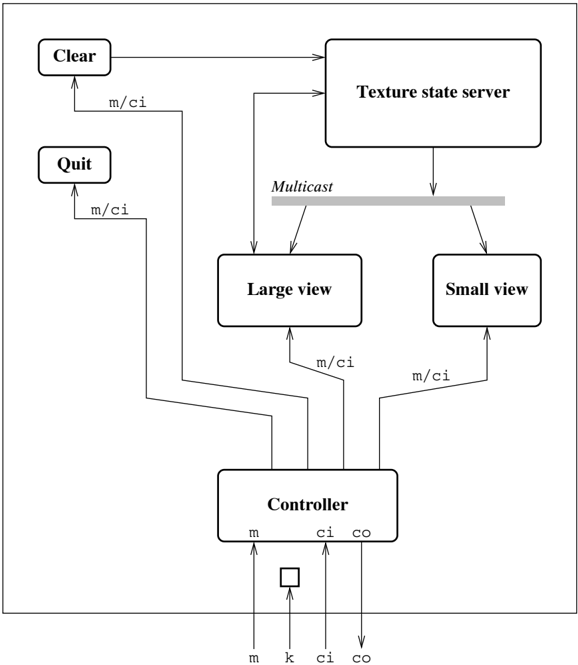

## 8.7.3 The texture state server

The current state of the texture is maintained by the texture state server
thread, which is implemented by the TextureState structure. The interface of
this structure is given in Listing 8.16. The newTexture function creates a new
texture state and returns a connection to its server. As can be seen from the
communication network diagram in Figure 8.3, the texture state server provides
two kinds of interaction. Other threads can modify and query speci fi c cells in
the texture using the functions set, clr, toggle, and get. The state server also
publishes noti fi cations about changes to its state for interested parties. A
noti fi cation message consists of the coordinates of a cell and its new

```
type texture_state

    val newTexture : unit -> texture_state

    val viewEvt : texture_state -> (int * int * bool) event

    val set      : (texture_state * int * int) -> unit
    val clr     : (texture_state * int * int) -> unit
    val toggle  : (texture_state * int * int) -> unit
    val get     : (texture_state * int * int) -> bool
```

Listing 8.16: The texture state interface

value. Threads can subscribe to these noti fi cations by calling the viewEvt
function, which returns an event value for synchronizing on the stream of noti
fi cations.

The implementation of the texture state server is typical of servers (see
Listing 8.17). The texture\_state type is a record of a request mailbox and a
multicast channel for change noti fi cations. There are request messages to set
a texture cell ( SetReq), to toggle a cell ( ToggleReq), and to get a cell's
value ( GetReq). The internal representation of the texture is a two-dimensional
array of booleans, and the server handles requests by updating, using the set
function, or reading elements of the array, using the get function. In addition
to updating the cell, the set function also sends out a change noti fi cation
when the cell's value has been modi fi ed.

## 8.7.4 The small view

The small texture view provides a read-only view of the texture as it would
appear on the screen ( i.e., each cell in the texture is represented by one
pixel). It is implemented by the SmallView structure, which has the following
signature:

```
val viewRect : Geom.rect

    val mkView : TextureState.texture_state
            -> WSys.win_env -> WSys.win_env
```

The viewRect value speci fi es the required size of the small view's window, and
the mkView function creates the view when given a connection to the texture
state server and a window environment. The small view server is a passive
component; it ignores the mouse and keyboard, and only reacts to changes in the
texture state or "Delete" messages.

The implementation of the SmallView structure is given in Listing 8.18. The
small view's window size is just the dimension of a texture (16 by 16). Much of
the mkView

```
8 A ConcurrentWindow System

--------------------------------------------------
structure MB = Mailbox

datatype req_msg
  = SetReq of (int * int * bool)
  | ToggleReq of (int * int)
  | GetReq of (int * int * bool SyncVar.ivar)

datatype texture_state = ts of {
    reqMb :: request_msg MB.mbox,
    viewCh :: (int * int * bool) MC.mchan
  }

val dim = TextureUtil.dim

fun newTexture () = let
      val reqMb = MB.mailbox()
      val data = Array.mChannel()
      val get = (i, j) = Array.sub (dim, i, j)
      fun set (i, j, v) = if (Array2.sub (data, i, j)
                  Array2.update (data, i, j, v);
                  MC.multicast (viewCh, (i, j, v)));
      fun serverLoop () = (
              case (MB.recv reqMb)
                | (ToggleReq(i, j, v)) => set(i, j, v)
                | (GetReq(i, j, replV)) => set(i, j, not(get(i, j))))
              (* endVar.iPut(replV, get(i, j)))
          )
      in
        spawn serverLoop;
        TS{reqMb = reqMb, viewCh = viewCh}
    end

fun viewEvt (TS{viewCh, ...}) = MC.recvEvt(MC.port viewCh)
fun set (TS{reqMb, ...}, i, j) = MB.send(reqMb, SetReq(i, j, true))
fun clr (TS{reqMb, ...}, i, j) = MB.send(reqMb, SetReq(i, j, false))
fun toggle (TS{reqMb, ...}, i, j) = MB.send(reqMb, ToggleReq(i, j))
fun get (TS{reqMb, ...}, i, j) = I
        val replV = SyncVar.iVar()
        in
          MB.send(reqMb, GetReq(i, j, replV));
          SyncVar.iGet replV
        end

                           Listing 8.17: The texture state server
--------------------------------------------------

```

Listing 8.17: The texture state server

```
8.7 A sample application
                                                1177

-------------------------------------------------------------------------------
    structure A = Array
    structure T = TextureState

    val dim = TextureUtil.dim

    val viewRect = G.RECT{x = 0, y = 0, wid=dim, ht=dim}

    fun mkView state (wenv as W.WEnv{win, k, m, ci, co}) = let
            val rawTexture = A.array(dim, 0w0)
            fun mkTexture () = D.TEXTURE(A.foldr (op :: []) rawTexture)
            fun update (i, j, mode) =
                    val bit = Word.< (0w1, Word.fromInt(dim - (j+1)))
                    val w = A.sub(rawTexture, i)
                    in
                        A.update (rawTexture, i,
                            if mode
                                then Word.orb(w, bit)
                                else Word.andb(w, Word.notb bit))
                    end
            val changeEvt = wrap(T.viewEvt state, update)
            val quitEvt = wrap(recvEvt ci,
                    fn (W.CMD{msg="Delete", ...}) => exit()
                    | _ => ())
            fun redraw () =
                    D.fillRect win (D.SET, mkTexture()) viewRect
            fun server () = (
                    redraw();
                    select [changeEvt, quitEvt];
                    server())
            in
                TextureUtil.foreachCoord
                W.sink k; W.sink m;
                ignore (spawn server);
                wenv
            end

                        Listing 8.18: The small texture view server

-------------------------------------------------------------------------------

```

Listing 8.18: The small texture view server

function is concerned with managing a local copy of the texture state, which is
represented by an array of words. We choose this representation as it is halfway
between the display system's representation of textures (lists of words) and the
two-dimensional array of the texture server. The mkTexture function creates a
display system texture value from this array. Changing the values of texture
cells in the local representation requires some bit twiddling, which is handled
by the update function. The small view server loop is simple: each iteration
begins by redrawing the texture, and then waiting for either a texture-state
change noti fi cation or a "Delete" message. In the former case, the local state
is updated and the server continues; in the latter case, the server thread
exits. Ini-

```
178                      8 A Concurrent Window System

------------------------------------------------------------------------------
    val blockSz = 7
    val padSz = 2
    val gridWid = 1
    val cellSz = gridWid+padSz+blockSz+padSz
    val totalSz = TextureUtil.dim*cellSz + gridWid

    val viewRect = G.RECT{
            x := 0, y = 0, wid = totalSz, ht = totalSz
          }

    fun coordToCell (x, y) = (y div cellSz, x div cellSz)

    fun cellToRect (i, j) = G.RECT{
            x = cellSz*j + gridWid + padSz,
            y = cellSz*i + gridWid + padSz,
            wid = blockSz, ht = blockSz
          }

    fun drawGrid win = let
        val drawLn = D.drawLine win D.SET
        fun drawLns (mkP1, mkP2) = let
                fun draw z = if (z <= totalSz)
                    then (drawLn (mkP1 z, mkP2 z); draw(z+cellSz))
                in
                draw 0
                end
        in
        drawLns
            (fn z => G.PT{x=0, y=z}, fn z => G.PT{x=totalSz, y=z});
        drawLns
            (fn z => G.PT{x=z, y=0}, fn z => G.PT{x=z, y=totalSz})
        end


                    Listing 8.19: The large texture-view layout
------------------------------------------------------------------------------

```

Listing 8.19: The large texture-view layout

tialization of the local state is done by doing a get operation on each cell of
the texture (note that the fi rst iteration of the server loop will draw the
initial texture).

## 8.7.5 The large view

The large texture view provides an editable view of the texture. It is
implemented by the LargeView structure, which has the same signature as the
small view above. The implementation of the LargeView structure is given in
Listings 8.19 and 8.20. The graphical appearance of the large view is as a
rectangular grid of square cells separated by grid lines. Each cell consists of
a square block, which is drawn white or black depending on the cell's value, and
padding around the block. The variables blockSz, padSz,

structure

T

=

TextureState

```
A Sample UpnP Connection

structure T = TextureState

    fun mkViewState (wenv as W.WEnv{win, k, m, ci, co}) = let
            fun mouseServer prevBtn = (case (prevBtn, recv m)
                    of (false, D.M{btn=true, pos=G.PT{x, y}}) => let
                        val (row, col) = coordToCell (x, y)
                        in
                        T.toggleState (state, row, col);
                        mouseServer true
                    end
                    | (_, D.M{btn, ...}) => mouseServer btn
            (* end case *)
            drawCell (i, j, mode) = let
                val rect = cellToRect (i, j)
                val rop = if mode then D.SET else D.CLR
                in
                D.fillRect win (rop, D.SOLID) rect
                end
            val changeEvt = wrap(T.viewEvt state, drawCell)
            val quitEvt = wrap(recvEvt ci, drawCell)
                    fn (W.CMD{msg="Delete", ...}) => exit()
                    | _ => ())
            fun drawServer () = (
                select [changeEvt, quitEvt];
                drawServer ())
        in
            drawGrid win;
            TextureUtil.foreachCoord (fn (i, j) =>
                drawCell(i, j, T.get(state, i, j)));
            W.sink k;
            ignore (spawn (fn () => mouseServer false));
            ignore (spawn drawServer);
            wenv
        end

                        Listing 8.20: The large texture-view server


```

Listing 8.20: The large texture-view server

and gridWid are the dimensions of these various graphical elements, and together
they de fi ne the size of a cell ( cellSz) and total size of the view (
totalSz). The helper function coordToCell maps a point in the view to a cell's
row and column. We also need the function cellToRect, which maps a cell's row
and column to the rectangle that de fi nes its block. Finally, the drawGrid
function draws the grid lines.

The large view actually consists of a pair of threads. The mouse thread
(implemented by the mouseServer function) monitors the mouse channel looking for
down clicks. When it sees one, it tells the texture state server to toggle the
state of the corresponding cell. The other thread (implemented by the drawServer
function) waits for texture-state change noti fi cations. When it receives one,
it redraws the affected cell. The

drawServer function also monitors the command-in channel for "Delete" events,
and exits when it receives one.

## 8.7.6 Bringing it all together

Now that we have described the individual components, we can show how these are
assembled into the texture editor application. This is handled by the following
function:

```
val mkiEditor : WYS.win_env -> unit

```

which has the appropriate type to be a window-system client. The implementation
of the mkEditor function is given in Listing 8.21. We start off by creating the
texture state server, a window environment for the application ( myEnv), and a
window map. We then create each of the subcomponents and install it in the
window map. This is done by applying the mkWin function to a list of pairs of
realization functions and rectangles. Note that we have omitted the de fi nition
of the layout geometry for the components. Finally, we set up a sink on the
texture editor's keyboard channel, and on the mouse channel of the myEnv
environment, and then spawn the editor's controller thread.

The functions quitAct and clearAct are the actions for the quit and clear
buttons. The quit action is to send a "Delete" message on the editor's
command-in channel; this will cause the controller (described below) to initiate
the termination procedure. The clear action clears each of the texture
coordinates to the texture state server, which, in turn, causes update messages
to be sent to the views. We could avoid this brute force approach by providing a
clear all operation on the texture state.

The controller thread is the central dispatcher for the texture editor. It
monitors the mouse and command-in channels (the keyboard channel is ignored by
this application). When a mouse message comes in, it calls handleM, which maps
the mouse location to a window and forwards the translated message to it.
Commands are handled by the handleCI function. When a "Delete" command is
received, the command is forwarded to each subwindow and acknowledgement is
accepted from each in turn. Note that we do not need to check the format of the
acknowledgements, since we know that the subcomponents do not send any other
messages on the co channels. Once the deletion protocol has been completed with
each of the subwindows, the texture editor sends an acknowledgement to its
parent and exits. We do not bother deleting the windows of the subcomponents,
since they will be deleted by the display system when the texture editor window
is deleted.

```
8.7 A sample'application

------------------------------------------------------------------------------
    fun mkEditor (env as W.WEnv{win, m, k, ci, co}) = let
          val state = TextureState.newTexture ()
          val myEnv = W.mkEnv win
          val wMap = WinMap.mkWinMap (myEnv, ())
          fun quitAct () =
                send (ci, W.CMD{msg="Delete", rect=NONE})
          fun clearAct () =
                TextureUtil.foreachCoord
                  (fn (i, j) => TextureState.clr(state, i, j))
          fun mkSubwin (mkFn, rect) =
                WinMap.insert (wMap, W.realize(win, rect)) mkFn, ())
          val envs = List.app mkSubwin [
                    (B.mkButton ("Quit", quitAct), quitButRect),
                    (B.mkButton ("Clear", clearAct), clearButRect),
                    (SmallView.mkView state, smallViewRect),
                    (LargeView.mkView state, largeViewRect)]
          fun handleM msg = let
              val (msg', tgt, _) = WinMap.mapMouse (wMap, msg)
              in
                send(W.mouse tgt, msg')
            end
          fun handleCI (msg as W.CMI{msg="Delete", ...}) = let
                fun fwd (W.newEnv{ci, co, ...}, _) = (
                    send(ci, msg),
                    ignore (Mailbox.recv co))
              in
                List.app fwd (WinMap.listAll wMap);
                mailbox.send(co, msg);
                exit ()
            end
          | handleCI _ = ()
          fun controller () =
                select [
                    wrap (recvEvt m, handleM),
                    wrap (recvEvt ci, handleCI)
                    ],
                controller ())
          in
            W.sink k;
            Sink (W.mouse myEnv);
            ignore(spawn controller)
          end

            Listing 8.21: The texture editor implementation

------------------------------------------------------------------------------

```

Listing 8.21: The texture editor implementation

## Notes

In this chapter, we have presented a toy implementation of a window system and
simple interactive application that illustrates some of the ways that
concurrency can be used to structure user interfaces and interactive
applications. The display system API described in Section 8.3 is implemented on
top of eXene [GR93], which is a multithreaded X Window System toolkit
implemented in CML.

The argument that user-interface software is most naturally programmed in a
concurrent language has been made by a number of people
[RG86, Pik89a, Haa90, GR92, GR93].

While the code in this chapter is necessarily simpli fi ed, it has the
user-input architecture employed by systems such as Pike's squint system
[Pik89a], Haahr's Montage system, and eXene. Earlier systems with similar
architectures include Cardelli and Pike's language squeak [CP85], which was
designed for handling user input. This language evolved into newsqueak [Pik89b],
which is the implementation language of squint. The Pegasus system [RG86, GR92]
was a precursor of CML and many of the ideas found in eXene. There are other
examples of window systems and GUI toolkits that use a concurrent programming
model. Schmidtmann et al. describe the design and implementation of a
multithreaded version of the Xlib library [STW93]. Hauser et al. describe the
different ways that threads are used in two large interactive systems
[HJT + 93]. The Haggis toolkit [PF95], which is implemented in Concurrent
Haskell [PGF96], uses concurrency quite heavily in its implementation, although
the model that is presented to the user is sequential. Some toolkits, such as
Trestle [MN91] and Java 's AWT library [CL98], are implemented in concurrent
languages, but do not exploit this fact in their programming model. If the
application programmer wishes components to run in separate threads, she must
program this explicitly.

The window system described in this chapter relies on an implementation of
overlapping bitmap graphics (Section 8.3.2). Algorithms and data structures for
this task have been described by Pike [Pik83] and Myers [Mye86]. The latter
technique was used in the Pegasus window system [GR92].

One aspect of this chapter that is different from much of the rest of the book
is that the example code makes little use of CML 's abstraction mechanisms - the
multicast channel used in Section 8.7 is the example of a more complicated
communication abstraction being used. This is mainly a result of the simpli fi
ed programming model used in this chapter. In a richer framework, such as eXene,
there are many places where CML 's abstraction mechanisms are useful. A
description of some of these can be found in Chapter 9 of [Rep92], and in
[GR93].

## A CML Implementation of Linda

A principal use of concurrent programming is in the implementation of
distributed systems. A distributed system consists of processes running in
different address spaces on logically different processors. Because the
processes are physically disjoint, there are a number of issues that arise in
distributed systems that are not present in concurrent programming:

*   Communication latency is signi fi cantly higher over a network than between
  threads running in the same address space.
*   Processors and network links can go down, and come back up, during the
  execution of a distributed program.
*   Programs running on different nodes may be compiled independently, which means
  that type security cannot be guaranteed statically.

For these reasons, the synchronous model used in CML does not map well to the
distributed setting. 1 A different programming model is required for dealing
with remote communication.

Although concurrent programming languages, such as CML, may not directly provide
a notation for distributed programming, they do have an important rˆ ole in
implementing distributed systems. A distributed system is made up of individual
programs running on different machines, which must communicate with each other.
Managing this communication is easier in a concurrent language. Furthermore,
multiple threads of control can help hide the latency of network communication.
For these reasons, most distributed programming languages and toolkits provide
concurrent programming features.

1 Strictly speaking, it is impossible to implement a language like CML, which
has synchronous channels and both input and output operations in choice
contexts, in a distributed system (see Section 6.4).

This chapter explores a distributed implementation of Linda -style tuple spaces
(described in Section 2.6.3). The implementation illustrates several points: fi
rst, it shows how CML can be used to implement low-level systems services;
second, it shows how the CML primitives can provide a useful interface to
asynchronous distributed programming primitives; and third, it is another
extended example of programming in CML. The chapter is organized into three
parts: fi rst we describe the interface to the CML-Linda Library, and present a
simple, but classic, programming example. Then we give a highlevel description
of the implementation, including the major components and protocols. Finally, we
explore into the implementation details in all their glory. The implementation
details are presented in a bottom-up order, starting with the network interface
and ending with the programmer's API. The description of the implementation is
quite involved and the casual reader may wish to skip the material after Section
9.4.

## 9.1 CML-Linda

As discussed in Chapter 2, Linda is not a programming language per se, but
rather is a small collection of primitives that can be added to an existing
language to provide distribution and parallelism. Our CML interface to tuple
spaces supports the three basic tuple I/O operations: output, input, and read.
It does not provide an eval operation, since CML 's spawn operation provides
multiple threads locally, and implementing remote evaluation is beyond the scope
of this book.

The programmer's interface to the CML-Linda library is provided by the Linda
structure, which has the interface given in Listing 9.1. In addition to the
tuple-space operations, this interface also includes the concrete representation
of tuples and templates, and a mechanism for a program to join a distributed
tuple space. For the purposes of this chapter, we choose a fairly restricted
class of tuples; it would be straightforward to extend them to richer
structures. Tuples and templates have the same internal structure, but differ in
the kinds of values found at their leaves: tuples have values, while templates
have both values and formal parameters. We use a common parameterized type,
tuple\_rep, to represent the internal structure. The datatype val\_atom is a
tagged union of the values found at the leaves of a tuple (integers, strings and
booleans). This type is also used to represent the tag of a tuple or template,
which is the fi rst element of a tuple\_rep value. The leaves of a template are
represented by the pat\_atom type, and include tagged values, typed formals, and
a wildcard that matches any value of any type. The out operation puts a tuple
into the speci fi ed tuple space. Since the input operations inEvt and rdEvt may
block, they are given an event-value return type. These input operations take a
template as an argument and return a list of values, which are the bindings for
the formals in the matched template. The rules for template/tuple matching are
de fi ned in Table 9.1.

```
9.1 CMIL-Linda
                             185

-------------------------------------------------------------------------------
        signature LINDA =
           sig

             datatype val_atom
               = IV val of int
               | SVL of string
               | BV of bool

             datatype pat_atom
               = IPT of int
               | SPAT of string
               | BP at of bool
               | IFORMal
               | SFORMal
               | BBormal
               | Wid

             datatype 'a tuple_rep = T of (:val_atom * 'a list)

             type tuple = val_atom tuple_rep
             type template = pat_atom tuple_rep

             type tuple_space

             val joinTupleSpace : {
                      localPort   : int option,
                      remoteHosts : string list
                     } -> tuple_space

             val out    : (tuple_space * tuple) -> unit
             val inEvt : (tuple_space * template) -> val_atom list event
             val rddEvt : (tuple_space * template) -> val_atom list event

          end;


                         Listing 9.1: The CMIL-Linda interface

```

Listing 9.1: The CML-Linda interface

The joinTupleSpace operation provides a mechanism for a distributed tuple space
to be established in an incremental fashion. Suppose, for example, that we want
to have three processors ( A, B, and C) share a tuple space. Then, we start by
executing the code

```
Linda.joinTupleSpace{localPort = NONE, remoteHosts = []}

```

on processor A, which creates the initial tuple space on A. Then B joins the
tuple space by executing

```
Linda.joinTupleSpace{localPort = NONE, remoteHosts = [ "A" ] }

```

Pattern

OTIM

2A more conhicticated imnlementation could re

TDat i

Matching tuple

Table 9.1: Template matching semantics

| Pattern   | Matching tuple   |
|-----------|------------------|
| IPat i    | IVal i           |
| SPat s    | SVal s           |
| BPat b    | BVal b           |
| IFormal   | IVal i           |
| SFormal   | SVal s           |
| BFormal   | BVal b           |
| Wild      | any value        |

## Lastly, C joins by executing

```
Linda.jointupleSpace{localPort = NONE, remoteHosts = ["A", "B"]}
```

Since the joinTupleSpace operation is designed for joining an existing tuple
space (as de fi ned by the list of remote hosts), the order in which these
commands get executed is important. 2

As an example of programming in CML-Linda, we consider a solution to the classic
Dining Philosophers problem. The program is a simulation of n philosophers
sitting at a round table with a bowl of noodles in the center. The philosophers
alternate between thinking and eating. To eat, a philosopher must have two
chopsticks, but there are only n chopsticks at the table (one between each pair
of adjacent philosophers). The philosophers represent processes in a concurrent
system, and the chopsticks are resources. The problem is that if each
philosopher acquires a single chopstick, then no philosopher can make progress (
i.e., eat) and the system is deadlocked. Our solution to this problem is to
introduce tickets that must be acquired by a philosopher before chopsticks are
acquired. By limiting the number of tickets to n -1, we guarantee that at least
one philosopher will be able to eat. The CML-Linda implementation of this
scheduling policy can be found in Listing 9.2. Each philosopher is assigned to a
processor in the system; the chopsticks and tickets are represented by tuples in
the tuple space. Since a philosopher may only use the chopsticks that are next
to him, the chopsticks are labeled with their position, and we use the
tuple-space pattern matching to match a philosopher with the correct chopsticks.
The function philosopher is called to start a philosopher; it takes the total
number of philosophers and list of remote hosts to join as arguments. It joins
the tuple space, and then starts executing the philsopher's actions. Since a
different list of hosts will be

2 A more sophisticated implementation could remove this restriction.

any value

```
9.2 An implementation overview
                                   187

------------------------------------------------------------------------------
    structure L = Linda

    val tagCHOSPSTICK = L.Sval "chopstick"
    val tagTICKET = L.Sval "ticket"

    fun initTS (ts, 0) = L.out (ts, L.f(tagCHOSPSTICK, [L.fval 0]))
        | initTS (ts, i) = (
            L.out (ts, L.T(tagCHOSPSTICK, [L.IVal i]));
            L.out (ts, L.T(tagTICKET, [])))

    fun philossopher (numPhils, hosts) = let
            val ts = L.joinTupleSpace {
                    localPort   = NONE,
                    remoteHosts = hosts
                    }
            val philId = length hosts
            fun input x = sync(L.inEvnt (ts, x))
            val left = philId and rigt = (philId+1) mod numPhils
            fun loop () = (
                    think philId;
                    input (L.T(tagTICKET, []));
                    input (L.T(tagCHOSPSTICK, [L.IPat left])));
                    input (L.T(tagCHOSPSTICK, [L.IPat right]));
                    eat philId;
                    L.out (ts, L.T(tagCHOSPSTICK, [L.IVal left]));
                    L.out (ts, L.T(tagCHOSPSTICK, [L.IVal rigt]));
                    L.out (ts, L.T(tagTICKET, []));
                    loop ())
            in
                initTS(ts, philId);
                loop()
            end

                    Listing 9.2: Dining philossophers in CML-Linda

------------------------------------------------------------------------------

```

Listing 9.2: Dining philosophers in CML-Linda

used on each machine (as in the example above), we can use the length of the
host list to assign philosopher IDs. Note that the initialization of the tuple
space is handled in a distributed fashion.

## 9.2 An implementation overview

A CML-Linda program consists of one, or more, CML programs running on one, or
more, machines in a network. These programs communicate via shared tuple spaces,
where a tuple-space representation is distributed among the CML programs that
have joined the space. Without loss of generality, we assume a one-to-one
correspondence between the CML programs in the system and the machines they run
on. And we use the term 'processor' to mean either the program or the machine.
To simplify the imple-

mentation, we ignore the problems related to failure ( i.e., what happens when
one of the machines or programs crashes).

In the remainder of this section, we describe the architecture of the system and
give an overview of the major system components.

## 9.2.1 Distribution of tuple space

The main design issue is how to distribute the tuples of a tuple space over the
processors in a system. There are two basic ways to implement a distributed
tuple space:

*   Read-all, write-one: where each tuple is located at a single processor. A
  write operation adds a tuple to some processor, while a read operation must
  query all the processors in the system for a match.
*   Read-one, write-all: where each processor has a copy of every tuple. A write
  operation must add the tuple to all processors, while a read operation need
  only query the local processor's copy of tuple space. Note, however, that a
  successful input operation must communicate with all of the other processors
  to remove the tuple from their copies of the tuple space. This means that both
  the inEvt and out (but not rdEvt) operations involve communicating with all
  other processors in the system.

For our implementation, we use the fi rst organization. Each processor has a
thread, called the tuple server, that maintains a tuple store, which is the
processor's portion of the tuple space.

With a read-all, write-one distribution, the implementation of the out operation
is straightforward. When a tuple is written, some decision must be made as to
where the tuple should be placed, and then a message is sent to the appropriate
processor. Simple policies for tuple placement include always placing tuples
locally, and round-robin placement. More sophisticated schemes might use static
analysis or dynamic information for better placement. In our implementation,
each processor has a thread, called the output server, that implements the
distribution policy for output operations.

The inEvt and rdEvt operations require that a client communicate with all of the
tuple servers in the system. To provide a uniform interface to the tuple
servers, each processor has a tuple-server proxy for each tuple server in the
system (including its own). Client threads in the system communicate with the
proxies, which in turn communicate with the tuple servers.

Figure 9.1 shows how these various servers are interconnected in a two-processor
tuple space. The solid lines represent local communications (using CML
operations), while the dotted lines are remote communications (using network
operations). A CML application

In this image there is a diagram with few lines and text.<end_of_utteranc

Flow chart

Figure 9.1: The communication network for a two-processor tuple space

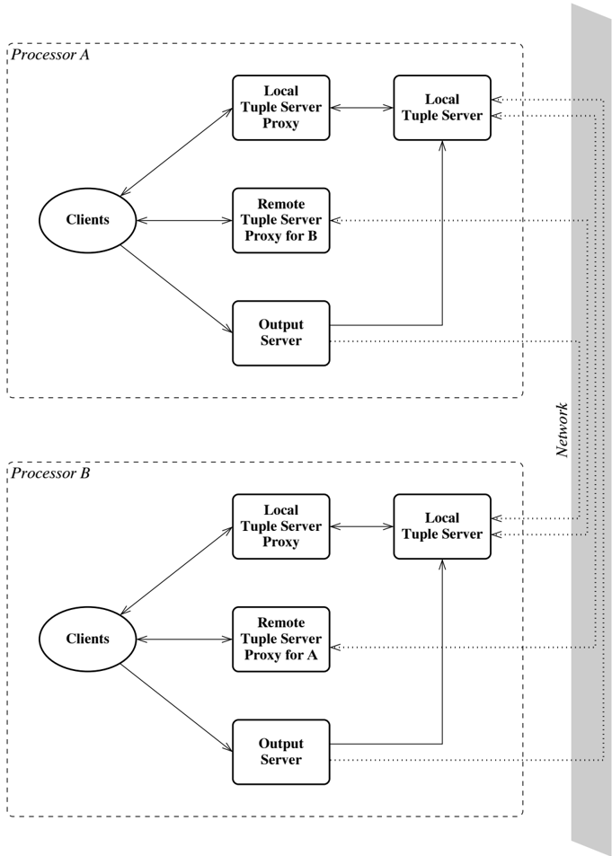

that uses the CML-Linda library (called a client) communicates with the
tuple-server proxies for input and read operations, and with the output server
for output operations. In turn, the proxies must communication with their
corresponding tuple servers. The output server also communicates with the tuple
servers when distributing tuples. Note that the actual implementation has
additional threads, such as network-buffer threads, that are not shown in this
diagram.

## 9.3 The protocols

There are three basic protocols implemented by the CML-Linda library: the input
protocol, which implements the inEvt and rdEvt operations; the protocol for
outputing tuples; and the protocol for joining a tuple space. To understand
better the detailed implementation description that follows, we fi rst give a
high-level description of how these protocols work.

## 9.3.1 The input protocol

The input operations ( inEvt and rdEvt) require a fairly complicated protocol.
The basic protocol for inEvt is as follows:

1.  The reading processor, call it P, broadcasts the template to all the
   tuple-space servers in the system.
2.  Each tuple-space server checks for a match. If it fi nds one, then it places
   a hold on the tuple and sends the tuple to P; otherwise, it remembers the
   input request in a table of outstanding requests. If some subsequent output
   tuple matches the input request, then the tuple server will send the matching
   tuple to P.
3.  The processor P waits for a matching tuple. Once P receives a matching tuple,
   say from Q, it sends Q a message acknowledging the tuple, and sends a
   cancellation message to the other processors.
4.  When Q receives the acknowledgement, it removes the tuple from its space.
   When a processor that has a matching tuple receives a cancellation message,
   it cancels the hold it placed on the matching tuple, which allows it to be
   used to match other requests. When a processor that does not have a matching
   tuple receives a cancellation message, it removes the record of the original
   request from its table of outstanding requests.

The protocol for rdEvt is similar; the main difference is that the tuple is not
removed in step 4.

3The thread ID ic manned to an interer IN bu

In this image, we can see a diagram, there are some lines and
text.<end_of_utteranc

Engineering drawing

Figure 9.2: Communication history for successful read operation

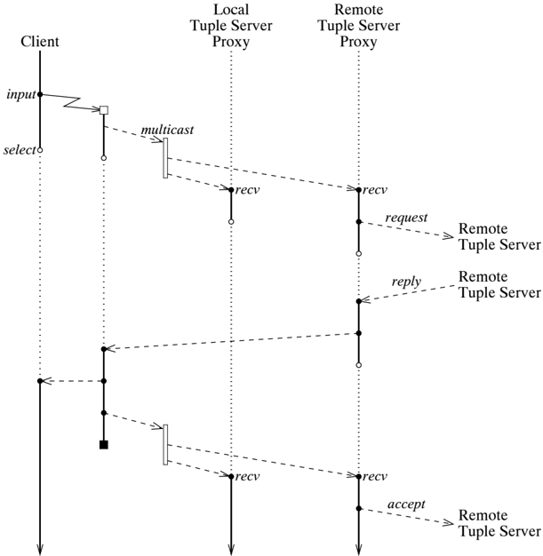

For each input (or read) request, we spawn a new thread to manage the operation.
This thread broadcasts the template to be matched to the tuple servers, and
coordinates the replies. Furthermore, its thread ID serves as a locally unique
ID for the transaction. 3 Once a matching tuple has been found, it is
communicated to the reading thread, and the cancellation messages are sent out
to the other processors. Figure 9.2 shows the message traf fi c for such a
situation. Since the inEvt and rdEvt operations are eventvalued, there is the
added complication that these operations can be used in a selection context,
where they might be aborted. We use negative acknowledgements to handle this
situation. Once the manager thread has broadcast the read request, it waits for
either

3 The thread ID is mapped to an integer ID by the proxy and this integer is
paired with the tuple-space ID to give a system-wide unique ID for the
transaction.

In this image, we can see a diagram with some text and a few
lines.<end_of_utteranc

Engineering drawing

Figure 9.3: Communication history for aborted read operation

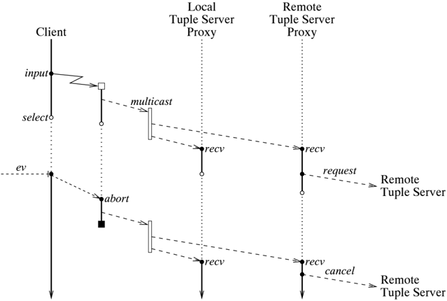

a reply from a proxy or an abort event from the client. Figure 9.3 shows the
message traf fi c when the client aborts the operation. When the manager thread
receives a negative acknowledgement, it sends cancellation messages to all of
the tuple-space servers. We also take care not to send the acknowledgement
message until we are sure that the tuple has been accepted. We do this by
synchronizing on the choice of sending the matching tuple on the reply channel
and receiving the negative acknowledgement. The semantics of CML channels
guarantee that only one of these can occur.

## 9.3.2 The output protocol

The out operation protocol is trivial. For this implementation, we choose a
round-robin distribution policy for tuples, which is implemented by the local
output server.

## 9.3.3 The join protocol

The join protocol provides a mechanism for a process to join an already existing
tuple space. When an application calls joinTupleSpace, it supplies a list of
remote hosts. Implementing this operation requires creating a local proxy for
each remote host and

establishing a connection between the proxy and the remote host. These
connections are also used by the output server to place tuples in the remote
parts of the tuple space. At each remote host, a proxy for the new member of the
tuple space must be created, and the new member must be added to output server's
list. Since our implementation is based on TCP/IP sockets, which provide
bidirectional communication, the remote hosts do not have to establish a network
connection back to the new member. One tricky point about the join protocol is
that once it is completed, the new member should have a view of the tuple-space
state that is consistent with the rest of the members, including any outstanding
input operations. Without this information, tuples at the new member cannot be
used to satisfy outstanding requests that were made prior to when it joined. To
address this problem, we employ a log server, which keeps a log of outstanding
requests that were issued by its local clients. When a new member joins, each
existing member sends the new member a list of outstanding requests, which
results in a consistent global state.

## 9.4 The major components

Before diving into a detailed description of the implementation, it is useful to
survey the major components. The system is implemented in seven distinct
modules, which are logically organized into three layers - client, server, and
network - as follows:

## Client layer

The client layer is implemented by the Linda structure, which has the interface
given in Listing 9.1. It includes the implementation of the threads that are
spawned to manage input operations.

## Server layer

The server layer contains the bulk of the system. It includes the output server,
which implements the output mapping policy for tuples; the tuple server proxies,
which provide a uniform interface between the client operations and the tuple
servers; and the tuple server itself, which maintains the local portion of the
distributed tuple space. It consists of the following modules:

structure TupleServer : TUPLE\_SERVER

This structure implements the local tuple server, the tuple-server proxies, and
the log server.

structure TupleStore : TUPLE\_STORE

This structure implements the storage mechanism for the local portion of tuple
space.

## structure

*   OutputServer

This structure implements the output server thread, including the policy for
distributing tuples.

## Network layer

The network layer provides an abstract interface to distributed communication
over some communication fabric. 4 It consists of the following modules:

structure Network : NETWORK

This structure provides the network layer API to the server layer. It includes
operations for sending/receiving messages to/from speci fi c remote hosts.

structure NetMessage

This structure de fi nes the basic message types used by the network
communication and provides operations to read and write messages over the
network.

structure DataRep

This structure implements operations for marshalling and unmarshalling tuple and
template data.

In addition, there is the Tuple structure, which de fi nes the tuple and
template types. Since these have already been described above (see Listing 9.1),
we do not discuss this structure any further. The remainder of this chapter
examines each of these layers in detail, starting from the bottom (network
interface).

## 9.5 The network layer

At the lowest level, the servers that implement the distributed tuple space must
communicate over some sort of network. There are many different kinds of network
communication, so it is useful to isolate the implementation details in an
abstraction of the required network services. The implementation of this
abstraction layer must address several issues: establishing and managing
connections to the other tuple servers in the tuple space; routing messages from
the network connections to the appropriate threads; and encoding and decoding
messages.

There are a number of ways that we might implement this layer, including a
single address space implementation on top of CML primitives. For the purpose of
this chapter, we choose an implementation on top of TCP/IP streams, which
provide ordered reliable communication between processors. While it would be
more ef fi cient to use UDP datagrams, it would require additional complexity
for handling lost and out-of-order messages, and so we leave it as an exercise
for the reader.

For any TCP/IP connection, one process is called the client and the other is the
server. This asymmetry is re fl ected in the way that the connection is
established. For a connection between a tuple server on processor A and a
tuple-server proxy for A on processor B, we designate A as the server and B as
the client.

4 We use TCP/IP for network communication, but other mechanisms could be used
without affecting the other layers of the system.

5 As of this writino. SMI/NI only has 32-hit im

In this image, we can see a diagram.<end_of_utteranc

Flow chart

Figure 9.4: The communication topology for the network layer

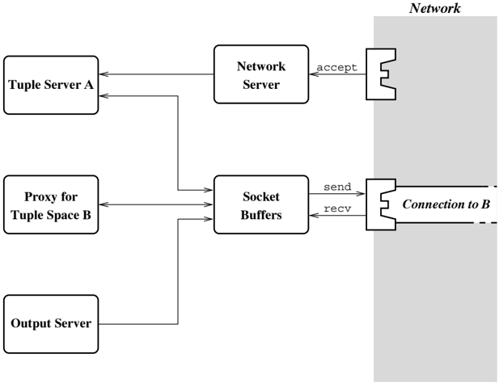

Figure 9.4 gives the local communication topology for the network layer in a
twoprocessor tuple space. The network layer consists of the network server
thread and a socket buffer thread for each remote connection. The network server
thread is responsible for accepting new connections and creating socket buffer
threads. The socket buffer threads handle socket I/O and marshalling and
unmarshalling of messages.

## 9.5.1 Message representation

The fi rst issue that must be addressed is how the various requests and replies
are represented when communicated between processors. When designing such a
representation, we must be aware that different processors in a common tuple
space may have different internal representations of ML values. For the purpose
of this system, we assume a basic machine size of 32 bits, 5 so we only have to
worry about endianess. We choose a big-endian representation for this
implementation ( i.e., the most signi fi cant byte has the lower address).
Figure 9.5 gives a pictorial view of the message representation. All

5 As of this writing, SML/NJ only has 32-bit implementations, although 64-bit
versions may appear in the future.

In this image we can see a table with some data.<end_of_utteranc

Flow chart

Figure 9.5: The network message representation

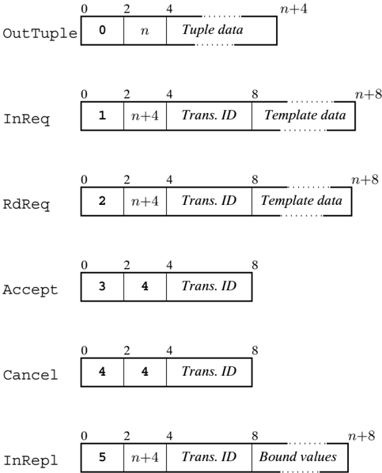

messages have a standard 4-byte header consisting of a 16-bit message kind and a
16-bit message length. The message length speci fi es the number of bytes
following the header. For all message kinds except OutTuple, the fi rst element
of the message body is the transaction ID, which is a 4-byte integer.

We also use a simple encoding scheme for tuples, templates, and bound values.
Table 9.2 gives the encoding scheme for the fi elds of a template; values are
encoded in the same format, except that there are no formals or wildcards. A
template, tuple, or sequence of bound values is represented as a sequence of the
fi eld encodings, terminated by a semicolon.

The encoding and decoding of messages is implemented across two modules: the
message header and transaction ID is handled in the NetMessage structure, which
is described in the next section; and the encoding of tuples, templates, and
value sequences

*

Encoding wild

Field

IPat k where 6 = 2246126626

Table 9.2: Template fi eld encoding

| Encoding                                                | Field                                                                        |                                                                                                         |
|---------------------------------------------------------|------------------------------------------------------------------------------|---------------------------------------------------------------------------------------------------------|
| i b 1 b 2 b 3 b 4 t f s b 1 b 2 b 3 b 4 c 1 . . . I B S | IPat k BPattrue BPatfalse SPat" c 1 · · · c k " IFormal BFormal SFormal Wild | where k = 2 2 4 · b 1 +2 1 6 · b 2 +2 8 · b 3 + b 4 where k = 2 2 4 · b 1 +2 1 6 · b 2 +2 8 · b 3 + b 4 |

is implemented by the DataRep structure, whose interface is given in Listing
9.3. This structure also provides functions for computing the size of tuples,
templates, and value sequences. The decoding functions take a vector of bytes
and an index into the vector, and return the decoded value and next index.
Similarly, the encoding functions take a value, an array of bytes, and a
starting index in the array, and return the index of the fi rst byte after the
encoded value. Returning the next index allows multiple values to be included in
a message; while our implementation does not use this feature, a more optimized
network layer might want to piggyback multiple messages in a single network
message. We do not include the implementation of the DataRep structure here,
since it is straightforward.

type vector = Word8Vector.vector val decodeTuple: (vector * int) -&gt;
(Tuple.tuple * int) val decodeTemplate: (vector * int) -&gt; (Tuple.template *
int) val decodeValues: (vector * int) -&gt; (Tuple.val\_atom list * int) type
array = Word8Array.array val encodeTuple: (Tuple.tuple * array * int) -&gt; int
val encodeTemplate: (Tuple.template * array * int) -&gt; int val encodeValues:
(Tuple.val\_atom list * array * int) -&gt; int val tupleSz: Tuple.tuple -&gt;
int val templateSz: Tuple.template -&gt; int val valuesSz: Tuple.val\_atom list
-&gt; int Listing 9.3: The DataRep interface

6 Wence the utility function roution from th

```
9 A CML Implementation of Linda

------------------------------------------------------------------------------
      datatype message
        = OutTuple of Tuple.tuple
        | InReq of {
             transId : int,
             pat : Tuple.template
         }
        | RdReq of {
             transId : int,
             pat : Tuple.template
         }
        | Accept of { transId : int }
        | Cancel of { transId : int }
        | InReply of {
             transId : int,
             vals : Tuple.val_atom list
         }

      type 'a sock = ('a, socket.active Socket.stream) Socket.sock

      val recvMessage : 'a sock -> message
      val sendMessage : ('a sock * message) -> unit


                  Listing 9.4: The NetMessage interface

------------------------------------------------------------------------------

```

## 9.5.2 Network communication

The reading and writing of messages on a socket is implemented in the NetMessage
structure; its interface is given in Listing 9.4. In addition to handling socket
I/O, the functions recvMessage and sendMessage also manage the conversion
between the message datatype and the wire representation of messages. Listing
9.5 gives the implementation of the recvMessage function. This function fi rst
reads the 4-byte header and unpacks the message kind and length (notice we use
the big-endian unpacking operations). 6 We then read the rest of the message
data, then decode it based on the message's kind (using the DataRep structure to
decode the Linda values carried in a message). We do not present the code for
the sendMessage function here, but it is similar.

## 9.5.3 Network interface

The Network structure provides the interface to the network layer; its
interface, the NETWORK signature, is given in Listing 9.6. The abstract network
type is used as a handle for the collection of network threads; its only use is
as an argument to the

6 We use the utility function, recvVec, from the SML/NJ Library to read a speci
fi c number of bytes from a socket.

Tn thic imnlementation the chut doun ic inat

```
9.3 The network layer

------------------------------------------------------------------------------
    structure DR = DataRep

    fun recvMessage sock = let
            val hdr = SockUtil.recvVec (sock, 4)
            val kind = Pack16Big.subVec(hdr, 0)
            val len = LargeWord.toInt(Pack16Big.subVec(hdr, 1))
            val data = SockUtil.recvVec (sock, len)
            fun getId () = LargeWord.toInt(Pack32Big.subVec(data, 0))
            fun getTuple () = #1 (DR.decodeTuple (data, 0))
            fun getPat () = #1 (DR.decodeTemplate (data, 4))
            fun getVals () = #1 (DR.decodeValues (data, 4)))
            in
            case kind
                of 0w0 => OutTuple(getTuple ())
                | 0w1 => InReq{transId=getId(), pat=getPat()}
                | 0w2 => RdReq{transId=getId(), pat=getPat()}
                | 0w3 => Accept{transId=getId()}
                | 0w4 => Cancel{transId=getId()}
                | 0w5 => InReply{transId=getId(), vals=getVals()}
                | _ => error "recvMessage: bogus message kind"
            (* end case *)
            end

                Listing 9.5: The implementation of recvMessage
```

Listing 9.5: The implementation of recvMessage

shutdown function. 7 The abstract server\_conn type is an abstraction of the
connection to a remote server. It is used to send requests, receive replies, and
to acknowledge replies. Tuple-server IDs are represented by the ts\_id type. The
network layer assigns these IDs when creating connections to remote members of
the tuple space. The reply type represents a reply to an input operation. It is
a record of a transaction ID (generated by the remote server) and a list of the
values bound to the free variables of input operation's template. Requests from
remote clients are represented by the client\_req datatype. Note that each of
the client request constructors corresponds to a send operation on a server
connection. The InReq constructor deserves additional comment: the remove fi eld
is used to distinguish between input requests generated from in and those from
rd operations; in the former case, the remove fl ag will be true, and the tuple
should be removed when successfully read. The reply fi eld is a function that is
used to send a reply to the appropriate remote client (via the corresponding
socket buffer thread). The last type de fi ned in the Network structure is
remote\_server\_info, which is a record of information about a remote server
(name, ID, and the server connection).

The function initNetwork is used to establish the network server thread and ini-

7 In this implementation, the shutdown is just a stub. Implementing a shutdown
protocol is left as an exercise for the reader.

```
9 A CML Implementation of Linda

signature NETWORK =
    sig
      type network =
      type server_conn
      etype ts_id

      type reply = {transId : int, vals : Tuple.eval_atom list}

      datatype client_req =
        = OutTuple of Tuple.tuple
        | InReq of {
              from :  ts_id,
              transId: int,
              remove : bool,
              pat : Tuple.template,
              reply : reply -> unit
            }
          | Accept of {:from : ts_id, transId : int}
          | Cancel of {:from : ts_id, transId : iint}

      type remote_server_info = {
              name : string,
              id : ts_id,
              conn : server_conn
            }

      val initNetwork : {
                  port    : int option,
                  remote   : string list,
                  tsRebMob : client_req Mailbox.mbox,
                  addTS    : remote_server_info -> unit
              } -> {
                  myId     : ts_id,
                  network : network,
                  servers : remote_server_info list
                }

      val sendOutTuple : server_conn -> Tuple.tuple -> unit
      val sendInReq : server_conn -> {
                  transId : int,
                  remove : bool,
                  pat : Tuple.template
              } -> unit
      val sendAccept    : server_conn -> {transId : int} -> unit
      val sendCancel    : server_conn -> {transId : int} -> unit
      val replyEvt      : server_conn -> reply event

      val shutdown : network -> unit

    end (* NETWORK *)

                  Listing 9.6: The abstract network interface

-----------------------------------------------------------------------------

```

Listing 9.6: The abstract network interface

tial remote connections. It takes as arguments an optional port number, 8 a list
of remote servers, a mailbox for communicating with the local tuple server
thread, and a function to notify the server level that a new member has joined
the tuple space. The initNetwork function returns the tuple-server ID assigned
to the local server, the network handle, and information about each of the
remote servers. Listing 9.7 gives the implementation of initNetwork. We start by
parsing the list of remote server names into host name, address, and port
records, which is done by mapping the parseHost function over the list of remote
hosts. We then spawn the network server with a call to spawnNetServer. The
network server is responsible for assigning tuple-server IDs to members that
join after initialization. Internally, we use integers for the tuple-server IDs
(type ts\_id). We assign 0 to the local server, and 1 through n for the initial
n remote hosts. We pass the fi rst ID after that ( n +1) to spawnNetServer. The
remote server information is created by folding the mkServer function over the
list of hosts. This function connects a fresh socket to the remote hosts and
calls spawnBuffers to spawn the socket buffer threads. The spawnBuffers function
(described below) returns the client connection for the remote host.

The parseHost function is responsible for translating a host name into uniform
address information. A hostname consists of a host part and an optional port
part, separated by a colon. The host part may be a numeric IP address, or a
symbolic name. Likewise, the port may be speci fi ed by an integer port number,
or by the name of a service. We use a couple of functions from the SockUtil
structure provided by the SML/NJ Library to handle the parsing of the host
information. The scanAddr function is fi rst used to parse the hostname into the
host and port parts, and to classify the parts as symbolic or numeric. Then we
use the resolveAddr function to resolve symbolic addresses. If the port is not
speci fi ed, we use the default of 7001.

The last piece of the network initialization code is the spawnNetServer
function, which creates a new socket and thread for listening for new
connections. Each time a new connection is accepted, we spawn new socket buffer
threads for the connection, fi gure out the name of the connecting host, 9 and
pass this information to the addTS function, which handles adding the new
connection at the server level (see Section 9.7.1). The spawnNetServer function
also creates the network object, which has the following representation:

```
datatype: network = NETWORK of {shutdown : unit SyncVar.ivar}

```

Note that the shutdown fi eld is not being used in this implementation.

8 The full 'address' of a socket consists of the machine that it is on and its
port number. The CML-Linda library uses port 7001 as its default port, but the
port argument allows this to be overridden.

9 The hostname is not strictly necessary, but it is useful to have this
information when debugging higher levels of the implementation.

```
9 A CML Implementation of Linda

------------------------------------------------------------------------------
    fun parseHost h = case (StringCvt.scanString SockUtil.scanAddr h)
            of NONE => error "bad hostname format"
            | (SOME inf) => (case SockUtil.resolveAddr info
                             of {host, addr = NONE} =>
                             {host, addr, addr = addr, port= 7001}
                             | {host, addr, port = SOME p} =>
                             {* endcase *}
                             (* endcase (SockUtil.BadAddr msg) => error msg
            (* end case *)})
    fun spawnNetServer (myPort, startId, tsMb, addTS ) = let
        val mySock = INetSock.TCP.socket()
        fun loop nextId = let
                val (nwid, addr) = Socket.accept mySock
                val proxyConn = spawnBuffers (nextId,newSock, tsMb)
                val (hhost, port) = INetSock.fromAddr addr
                val name = (case NetHostDB.getByAddr host
                             | NONE => ""
                             | NONE => "??"
                in
                    addTS(name = name, id = nextId, conn = proxyConn);
                    loop (nextId+1)
                end
            val port = getOpt(myPort, 7001)
            in
                Socket.bind (mySock, INetSock.any port);;
                Socket.listen (mySock, 5);
                spawn (fn () => loop startId);
                NETWORK{shudown = SyncVar.iVar()}
            end

    fun initNetwork {port, remote, tsReqMb, addTS} = let
            val hosts = List.map parseHost remote
            val startId = length hosts + 1
            val network = spawnNetServer (port, startId, tsReqMb, addTS)
                fun mkServer ({host, addr, port}) = let
                    val sock = INetSock.TCP.socket()
                    val sockAddr = INetSock.toAddr(addr, port)
                    val _ = Socket.connect (sock, sockAddr)
                    val conn = spawnBuffers (id, sock, tsReqMb)
                    in
                        (id+1, {name = host, id = id, conn = conn}::1)
                    end
            in
                {myId = 0 ,network = network,
                 servers =#2 (List.foldl mkServer (1, [] hosts)
                }
            end

                    Listing 9.7: Initializing the network interface

------------------------------------------------------------------------------

```

Listing 9.7: Initializing the network interface

```
9.5 The network layer

------------------------------------------------------------------------------
datatype server_conn = CONN of {
    out : Msg.message -> unit,
    replyEvt : reply event
  }

  fun spawnBuffers (id, sock, tsMb) = let
          val ocMb = Mailbox.mailbox()
          fun outLoop () = (
                  Msg.sendMessage (sock, Mailbox.recv outMb);
                  outLoop())
      val iMb = Mailbox.mailbox()
      fun reply r = Mailbox.send(outMb, Msg.InReply r)
      fun iLoop () = (
              case Msg.recvMessage sock
                  of (Msg.OutTuple t) => Mailbox.send(tsMb, OutTuple t)
                  | (Msg.InReq{transId, pat}) =>
                  Mailbox.send(tsMb, InReq{
                          from=id, tranlId=transId,
                          remove = true, pat=pat, reply=reply
                      })
                  | (Msg.RdReq{transId, pat}) =>
                  Mailbox.send(tsMb, InReq{
                          from=id, tranlId=transId,
                          remove = false, pat=pat, reply=reply
                      })
                  | (Msg.Accept{transId}) =>
                  Mailbox.send(tsMb, Accept{from=id, transId=transId})
                  | (Msg.Cancel{transId}) =>
                  Mailbox.send(tsMb, Cancel{from=id, transId=transId})
                  | (Msg.InReply repl) => Mailbox.send(inMb, repl)
              (* end case *)
              inLoop ())
      inLoop ()
          spawn outLoop; spawn inLoop;;
          CONN{
              out = fn req => Mailbox.send(outMb, req),
              replyEvt = Mailbox.recvEvt inMb
          }
      end

                  Listing 9.8: Creating the socket buffer threads
------------------------------------------------------------------------------

```

Listing 9.8: Creating the socket buffer threads

The spawnBuffers function (see Listing 9.8) is responsible for creating the
socket buffer threads. The output buffer thread is quite simple: it repeatedly
gets a message from a mailbox and uses sendMessage to send it out on the network
connection. The input buffer thread is more complicated. When it receives a
message from the socket, it examines the message type and routes it to the
appropriate target: to the tuple server's mailbox ( tsMb) for output operations
and requests from a remote client, and to the client connection mailbox ( inMb)
for replies to requests from local clients. The request mes-

```
------------------------------------------------------------------------------
    signatureTuple_SERVER =
      sig
        type ts_id = Network.ts_id

        datatype ts_msg
          = IN of {
                  tid : thread_id,
                  pat : Tuple.template,
                  replFn : (Tuple.val_atom list * ts_id) -> unit
              }
          | CANNEL of thread_id
          | ACCEPT of (thread_id * ts_id)

        val mkLogServer : ts_msg Multicast.port
              -> unit -> (ts_msg Multicast.port * ts_msg list)
        val mkTupleServer :
                  (ts_id * Network.client_req Mailbox.mailbox * ts_msg event)
                  -> unit
        val mkProxyServer :
                  (ts_id * Network.server_conn * ts_msg event * ts_msg list)
                  -> unit

      end

                          Listing 9.9: The TupleServer interface
```

Listing 9.9: The TupleServer interface

sages passed to the tuple server are tagged with the ID of the connection. In
the case of input or read requests, the input buffer also adds the reply
function to the message. The reply function routes the reply to the output
buffer's mailbox. With the use of this reply function and the tuple-server
mailbox, the tuple server is isolated from having to know about the individual
remote connections.

## 9.6 The server layer

The server layer is the meat of the CML-Linda system. It consists of four kinds
of threads: a set of tuple-server proxies, which provide a uniform interface
between the client level and the tuple servers (both remote and local); the
local tuple server, which maintains the local portion of the tuple space; the
log server, which maintains a log of the current outstanding requests; and the
output server, which manages the distribution of locally generated tuples. The
fi rst three of these are implemented in the TupleServer structure, which has
the signature given in Listing 9.9. The local tuple server is built on top of
the tuple storage mechanism provided by the TupleStore structure. The output
server thread is implemented in the OutputServer structure. We examine each of
these threads, as well as the tuple storage mechanism, in turn.

10 We do not use the transaction manager's thread

```
structure TransTbl = Hash2TableFn (structure Key1 = struct
            type hash_key = thread_id
            val hashVal = hashTid
            val sameKey = sameTid
        end
        structure Key2 = struct
            type hash_key = int
            val hashVal = Word.fromInt
            val sameKey = (op = : (int * int) -> bool)
        end)

```

Listing 9.10: The transaction table structure

## 9.6.1 The tuple-server proxies

The tuple server proxies provide an abstraction layer between the transaction
manager threads that implement the input operations, and the tuple servers. This
abstraction layer hides the location of the particular tuple server represented
by a given proxy.

A tuple-server proxy must maintain the set of outstanding transactions, and be
able to locate a transaction based on the local ID, which is the thread ID of
the transaction manager, and the remote ID. To accomplish this, we use the
double-keyed hash table functor from the SML/NJ Library to implement transaction
tables (see Listing 9.10). The items that we store in these tables have the
following record type:

```
type trans_info = {
        id : int,
        replFn : (T.val_atom list * ts_id) -> unit
    }

```

The id fi eld is the transaction ID that is assigned to the transaction by the
proxy server and is forwarded to the remote tuple servers, 10 and the replFn fi
eld is used to send a matching tuple to the thread that is managing the
transaction.

The actual implementation of a proxy server is contained in the proxyServer
function, which is given in Listing 9.11. This function is used to create proxy
servers for both remote tuple servers and the local tuple server, so it is
necessary to use an abstraction of the connection to the tuple server. We use a
record of functions for this interface (the conn\_ops record type). The body of
the proxy server is a simple message handling loop. Requests from local clients
are handled by handleMsg, while handleReply deals with replies from the tuple
server. The set of outstanding transactions is kept in a double-keyed hash
table, as described above. When an IN message is received from the client, a new
transaction ID is generated (using the function nextId), the request

10 We do not use the transaction manager's thread ID for this because there is
no easy way to send it to a remote system.

```
9 A CML Implementation of Linda


---------------------------
    type conn_ops = {
        sendInReq  : {
            transId : int, remove : bool, pat : T.template
        } -> unit,
        sendAccept : {transId : int} -> unit,
        sendCann:et  : {transId : int} -> unit,
        replyEvt   : Net.reply event
    }

  fun proxyServer (myId, conn : conn_ops, reqEvt, initInReqs) = let
        val tbl = TransTbl.mkTable (32, Fail "TransTbl")
        val mId = let val id = ref 0
                fn () => let val id = !cnt in cnt := id+1; id end
        fun handleMsg (IN{tid, remove, pat, replFn}) = let
            val id = ref id()
            val req = {transId = id, remove = remove, pat = pat}
            TransTbl.insert tbl (tid, id, {id=id, replFn=replFn});
            #sendInReq conn req
            end
        | hHandleMsg (CANCEL tid) = let
            val {id, ...} = TransTbl.remove tbl tid
            in
            #sendCancel conn {transId=id}
        | hHandleMsg (ACCEPT(tid, tid)) = let
            val {id, ...} = TransTbl.remove tbl tid
            in
            if (tsId = myId)
                then #sendAccept conn {transId=id}
                else #sendCancel conn {transId=id}
            end
        fun hReply {transId, vals} = (
            case TransTbl.find2 tbl transId
            | of NONE => ()
            | (* (some{id, replFn}) => replFn (vals, myId)
            | *) = ()
        fun loop () = (
            wrap (reqEvt, handleMsg),
            wrap (#replyEvt conn, handleReply)
        );
        in
        List.app handleMsg initInREQs;
        ignore (spawn loop)
      end


      Listing 9.11: The implementation of proxyServer


```

Listing 9.11: The implementation of proxyServer

```
fun mkProxyServer (myId, conn, reqEvt, initInList) = let
                val conn = {
                        sendInReq  = Net.sendInReq conn,
                        sendAccept = Net.sendAccept conn,
                        sendCancel = Net.sendCancel conn,
                        replyEvt    = Net.replyEvt conn
                    }
        in
                proxyServer (myId, conn, reqEvt, initInList)
            end

```

Listing 9.12: The implementation of mkProxyServer

is recorded in the table, and the request is forwarded to the tuple server with
the generated ID as the transaction ID. When a CANCEL or ACCEPT message is
received, the corresponding entry is removed from the table and the transaction
ID is retrieved. Then the message is tagged with the transaction ID, and
forwarded to the tuple server. Replies from the tuple server are a bit easier to
deal with, since there is only one kind of message involved. When a reply comes
in, we use the transaction ID to fi nd the corresponding item in the table, and
use the item's replFn fi eld to forward the reply back to the transaction
manager in the client level. Note that there is a race between a cancel message
being received by the remote server, and the remote server offering a matching
tuple. To avoid any problems caused by this race condition, the handleReply
function detects the situation where the transaction has already been removed
from the table and ignores the reply.

Aproxy server for a remote tuple server is created by the function
mkProxyServer, which is shown in Listing 9.12. This function is a wrapper on
proxyServer; its only work is to package up the server connection provided by
the network layer (see Listing 9.6) as a conn\_ops record.

## 9.6.2 The tuple store

The TupleStore structure implements the storage mechanism for the local piece of
the distributed tuple space ( i.e., the part managed by the local tuple server).
Listing 9.13 gives the interface of this structure. The abstract tuple\_store
type contains the tuples in the local part of the tuple space (including those
that are held), as well as a record of outstanding input requests. The id type
is used to tag input requests. It consists of the tuple server ID that generated
the request and a unique transaction ID (which is an integer). The match type
constructor is used to represent information about input requests. It is a
record consisting of the ID of the input request, a function for replying

```
-------------------------------------------------------------------
      signature TUPLE_STORE =
        sig

          type tuple_store
          type id = (Network.ts_id * int)
          type 'a match = {
              id      : id,
              reply : Network.reply -> unit,
              ext     : 'a
            }
          type bindings = Tuple.val_atom list

          val newStore : unit -> tuple_store

          val add  : (tuple_store * Tuple.tuple) -> bindings match option
          val input : (tuple_store * Tuple.template match) -> bindings option
          val cancel  : (tuple_store * id) -> bindings match option
          val remove : (tuple_store * id) -> unit

        end

                            Listing 9.13: The TUPLE_STORE signature
```

Listing 9.13: The TUPLE STORE signature

to the request, and an extension fi eld with additional information. Depending
on the context, the extension fi eld of a match is either a template or set of
variable bindings (the bindings type is a list of values that are bound to the
free variables of a template).

The TupleStore structure also provides operations that correspond to the
messages that a tuple server must handle (see Section 9.6.3). The add operation
is used to add new tuples to the store ( i.e., because of an output operation).
Since the new tuple may match some outstanding input request, the add operation
returns optional match information. The input operation is used to query the
store for possible matches to an input request. If the request cannot be satis
fi ed immediately, it is recorded in the store. Lastly, the cancel and remove
operations are used to complete the transaction initiated by an input request:
cancel removes the hold on a tuple (which frees the tuple to match another
outstanding request), and remove removes the tuple from the store.

The type declarations for the data structures used to represent the tuple store
are given in Listing 9.14. The tuple\_store type is actually represented by a
pair of hash tables. The tuple table maps the key portion of a tuple or template
to a bucket, where the bucket for a given key is a record of the list of
outstanding input requests with that key and the list of tuples with that key.
The other hash table in a tuple\_store is the hold table, which is used to keep
track of those tuples that are being held pending acceptance or cancellation of
a matching input operation.

One important operation used in the implementation of the tuple store is
matching

```
9.6 The server layer

------------------------------------------------------------------------------
    structure T = Tuple

    type id = (Network.ts_id * int)

    type 'a match = {
        id     : id,
        reply  : Network.reply -> unit,
        ext    : 'a
    }
    type bindings = T.val_atom list

    type bucket = {
        waiting : T.template match list ref,
        holds    : (id * T.tuple) list ref,
        items    : T.tuple list ref
      }

    structure TupleTbl = HashTableFn (struct
            type hash_key = T.val_atom
            | hashVal (T.BVal false) = 0w0
            | hashVal (T.BVal true) = 0w1
            | hashVal (T.IVal n) = Word.fromInt n
            fun sameKey (k1 : T.val_atom, k2) = (k1 = k2)
        end)

    structure QueryTbl = HashTableFn (struct
        type hash_key = id
        fun hashVal (_, id) = Word.fromInt id
        fun sameKey ((tsId1, tsId, (tsId2, id2) : hash_key) =
                     ((tsId1 = tsId2) andalso (id1 = id2))
        end)

    datatype query_status = Held | Waiting

    datatype tuple_store = TS of {
        queries : (query_status * bucket) QueryTbl.hash_table,
        tuples : bucket TupleTbl.hash_table
      }

      Listing 9.14: The various types used in the tuple-store representation

------------------------------------------------------------------------------

```

Listing 9.14: The various types used in the tuple-store representation

a template to a tuple. This is done by the match function given in Listing 9.15.
This function takes a template and tuple as arguments and returns NONE if there
is no match or some bindings if there is a match. The match function is only
called in contexts where the keys have already been matched (by the hash table
lookup), so only the rest of the template and tuple are compared. The
implementation is straightforward: the mFields function iterates over the fi eld
list accumulating bindings, while the mField function checks a pattern fi eld
against a value fi eld using the rules in Table 9.1.

```
!            9 A CML Implementation of Linda
!
!        fun match (T.T(_, rest1), T.T(_, rest2)) = let
!            fun mFields ([], [], binds) = SOME binds
!            | mFields (f1::r1, f2::r2, binds) = (
!                case mField(f1, f2, binds)
!                of (SOME binds) => mFields(r1, r2, binds)
!                | NONE => NONE
!            (* end case *)
!            mFields _ = NONE
!            if (a = T.Ipat a, T.Ival b, binds) =
!                if (a = b) then SOME binds else NONE
!                if (a = T.Bpat a, T.Bval b, binds) =
!                  if (a = b) then SOME binds else NONE
!                if (T.Spat a, T.Sval b, binds) =
!                  if (a = b) then SOME binds else NONE
!                mField (T.Iformal, x as (T.Ival _), binds) =
!                  SOME(x::binds)
!                mField (T.Bformal, x as (T.Bval _), binds) =
!                  SOME(x::binds)
!                mField (T.Sformal, x as (T.Sval _), binds) =
!                  SOME(x::binds)
!                mField (T.Wild, _, binds) = SOME binds
!                mField _ = NONE
!            in
            mFields (rest1, rest2, [])
          end

```

Listing 9.15: Matching a template and tuple

The implementation of the add function is given in Listing 9.16. The add
function takes a tuple store and tuple to be added and returns a match option.
We fi rst do a lookup in the tuple table using the tuple's key. The simple case
is where there is no bucket with this key in the table, in which case, we insert
a new bucket with the tuple as its only item into the tuple table and return
NONE. In the case where there is already a bucket for the tuple's key, we must
scan the list of outstanding input requests for a possible match. If we fi nd
such a match, we put the tuple in the hold table (instead of in the tuple
table), and return the match information. If there is no match, then we add the
tuple to the list of tuples in the bucket and return NONE.

The code for the remaining tuple-store operations is presented in Listings 9.17
and 9.18. The input operation searches the tuple store for a tuple that matches
the given template. Westart by using the template's key to do a lookup in the
tuple table. If there is no bucket with the given key, then we insert a new
bucket with no items and the input request information in the waiting list, and
return NONE. When the tuple table already contains a bucket with the given key,
we need to scan the item list for a matching tuple. If we fi nd a matching
tuple, then we remove it from the item list and put it into the hold table, and
we return the bindings from the match. If the matching tuple is the only tuple
in the bucket,

11 Thic is why innut reguest meccoded corry a rar

```
9.6 The server layer
                             2111

-------------------------------------------------------------------------------
    fun add (TSS{tuples, queries}, tuples AS T.T(key, _)) = (
        case
            of NONE => (
                TupleTbl.insert tuples (key, {
                    items = ref [tuple],
                    waiting = ref[],
                    holds = ref[],
                    });
                NONE)
            | ( (`sum(bucket as {items, waiting, holds})) => let
                fun scan ([], _) = (items := tuple :: !items; NONE)
                | scan ((x as {reply, id, ext})::r, wl) = (
                    case match(ext, tuple)
                    of NONE => scan(r, x:wl)
                    | (SOME binds) => (
                        waiting := List.revAppend(wl, r);
                        holds := (id, tuple) :: !holds;
                        QueryTbl.insert queries (id, (Held, bucket));
                        SOME(reply=reply, id=id, ext=binds))
                    (* end case *))
                in
                    scan (!waiting, [])
                end
            (* end case *))

                        Listing 9.16: Adding a tuple to the tuple store
```

Listing 9.16: Adding a tuple to the tuple store

then we also remove the bucket from the tuple table. When there is no matching
tuple, we add input request information to the waiting list, and return NONE.

The cancel and remove operations are quite simple. They just remove the speci fi
ed held tuple from the hold table; in the case of cancel, this tuple is then
added to the tuple table, while in the case of remove, the tuple is discarded.

## 9.6.3 The local tuple server

The tuple server thread manages a tuple store in response to request messages.
As seen in Figure 9.1, these messages come from the local output server, from
remote output servers and proxies (via the socket buffer), and from the local
proxy server. All of the sources that send client\_req messages use the same
mailbox to communicate with the tuple server, which greatly simpli fi es the
implementation. 11 Listing 9.19 gives the code for the tuple server. The body of
the server is the handleReq function, which maps each client\_req message (see
Listing 9.6) onto a tuple-store operation. In the

11 This is why input request messages carry a reply operation; it frees the
tuple server from having to know the source of the message when sending a reply.

```
9212

-------------------------------------------------------------------------------
  fun input (TS{tuples, queries}, {reply, ext as T.T(key, _), id}) = (
        case
          of NONE => let tuples key)
                  val bucket = {
                        waiting = ref([{reply=reply, id=id, ext=ext}],
                        holds = ref[],
                        items = ref[],
                      }
            in
              TupleTbl.insert tuples (key, bucket);
              QueryTbl.insert queries (id, (Waiting, bucket));
              NONE
            end
        | (SOME(bucket as {items, waiting, holds})) => let
            fun look (_, []) = (
                  waiting := !waiting @
                  [{reply=reply, id=id, ext=ext}];
                  QueryTbl.insert queries (id, (Waiting, bucket));
                  NONE)
              | look (prefix, item :: r) = (
                  case match(ext, item)
                    of NONE => look (item::prefix, r)
                    | (SOME binds) => (
                        items := List.revAppend(prefix, r);
                        holds := (id, item) :: !holds;
                        QueryTbl.insert queries (id, (Held, bucket));
                        SOME binds)
                    (* end case *))
              in
                look ([], !items)
            end
        (* end case *))


                    Listing 9.17: The tuple-store input operation
-------------------------------------------------------------------------------

```

Listing 9.17: The tuple-store input operation

case of adding a tuple or cancelling a hold, we may have to reply to an
outstanding input request. The replyIfMatch function takes care of this.
Likewise, an input request may be immediately satis fi ed, in which case we send
a reply.

The function mkTupleServer is actually responsible for creating the tuple server
and local proxy, and for hooking them together. Listing 9.20 gives the code for
this function. Most of the code is involved in implementing the conn\_ops record
for the proxy connection. Once this is built, we spawn off the tuple server and
its proxy server.

## 9.6.4 The log server

The log server keeps track of outstanding input requests, so that when a new
member joins the tuple space, it can be told about them. The log server is
created by the function

```
9.6 The server layer
  213

-------------------------------------------------------------------------------
  fun cancel (tbl as TS{tuples, queries}, id) = (
      case QueryTbl.remove queries id)
        of ((waiting, {items, waiting, holds}) => (
            case (removeFromList (f n t => (#id t = id)) (! waiting))
              of ({ext, ...}, []) =>
                  if (null(! items) andalso null(! holds))
                    then ignore(TupleTbl.remove tuples (T.key ext))
                  else waiting := []
              | (_, l) => waiting := l
            (* end case *)
            NONE)
        | ( held, {items, waiting, holds}) => let
            val ((_, tuple), l) =
                  removeFromList (f n (id', _) => (id' = id)) (! holds)
            in
              holds := l;
              add (tbl, tuple)
            end
        (* end case *))

  fun remove (tbl as TS{tuples, queries}, id) = let
        val (_, {items, waiting, holds}) = QueryTbl.remove queries id
        val (_, tuple), l) =
            removeFromList (fn (id', _) => (id' = id)) (! holds)
        in
          if (null l andalso null(! items) andalso null(! waiting))
            then ignore(TupleTbl.remove tuples (T.key tuple))
            else holds := l
          end

```

Listing 9.18: Other tuple-store operations

mkLogServer, which is shown in Listing 9.21. This function takes a port on the
client request multicast channel, and returns a function to get a new port on
the multicast channel plus a list of outstanding input requests. The list of
outstanding requests is a compressed pre fi x of the local client request
stream, which re fl ects the local contribution to the global state of the
distributed tuple space.

The implementation of the log server is a simple message handling loop that
accepts requests from the client-request multicast channel, and requests for a
new port. It maintains a hash table of outstanding input transactions: IN
requests are added to the table, while ACCEPT and CANCEL messages cause the
corresponding IN requests to be removed. When a new port is needed for the proxy
of some new member, we copy the

12The Multinat any angration aroduced

```
9 A CML Implementation of Linda

  -----------------------------------------------------------------------------
  fun tupleServer tsMb = let
        val tupleTbl = TupleStore.newStore()
        fun replyIfMatch NONE = ()
          | replyIfMatch (SOME{reply, id = (_, transId), ext}) =
                reply{transId = transId, vals = ext}
        fun handleReq (Net.Outtuple t) =
                replyIfMatch (TupleStore.add (tupleTbl, t))
            | handleReq (Net.InReq{from, transId, remove, pat, reply}) =
                let
                  val match = {
                        reply = reply,
                        id = (from, transId),
                        ext = pat
                      }
                  in
                  case TupleStore.input (tupleTbl, match)
                  of (SOME binds) => reply {transId=transId, vals=binds}
                  | NONE => ()
                (* end case *)
              end
          | handleReq (Net.Accept{from, transId}) =
                TupleStore.remove (tupleTbl, (from, transId))
          | handleReq (Net.Cancel{from, transId}) =
                replyIfMatch(TupleStore.cancel(tupleTbl, (from, transId)))
          fun serverLoop () = (
                handleReq(Mailbox.recv+tsMb) ;
                serverLoop  ())
      in
        spawn serverLoop
      end


              Listing 9.19: The implementation of the local tuple server


```

Listing 9.19: The implementation of the local tuple server

master port 12 and get the current list of outstanding requests. This
request/reply interaction is packaged up as a simple RPC using the mkRPC
function from the CML Library.

## 9.6.5 The output server

The output server is responsible for the distribution of tuples to tuple servers
according to some policy. For our system, we use a simple round-robin scheme.
The output server is implemented in the OutputServer structure, which is given
in Listing 9.22. The output server, which is created by the function
spawnServer, maintains a list of tuple servers (represented by output functions)
and distributes tuples to them in a round-robin fashion. The spawnServer takes
the local server connection as an argument, and

12 The Multicast.copy operation produces a new port that will give exactly the
same stream of messages as the port being copied.

```
9.7 The client layer
                             2115

fun mkTupleServer (myId, tsMb, reqEvt) = let
        val replyToProxyCh = channel()
        fun sendInReq {transId, remove, pat} =
                Mailbox.send (tsMb, Net.InReq{
                    from = myId, transId = transId,
                    remove = remove, pat = pat,
                    reply = fn repl => send(replyToProxyCh, repl)
                })
        fun sendAccept {transId} =
                Mailbox.send (tsMb, Net.Accept{
                    from = myId, transId = transId
                })
        fun sendCancel {transId} =
                Mailbox.send (tsMb, Net.Cancel{
                    from = myId, transId = transId
                })
        val conn = {
                sendInReq = sendInReq,
                sendAccept = sendAccept,
                sendCancel = sendCancel,
                replyEvt = recvEvt replyToProxyCh
            }
        in
            tupleServer tsMb;
            proxyServer (myId, conn, reqEvt, [])
        end

            Listing 9.20: The implementation of mkTupleServer


```

Listing 9.20: The implementation of mkTupleServer

returns a record of two operations: output for outputing a tuple, and addTS for
adding a new tuple server to the list. We use a function abstraction to
represent the connection to the tuple servers; in the local case, this sends the
tuple to the local tuple server's mailbox, and in the remote case, this sends
the tuple to the appropriate output buffer thread (see sendOutTuple in Listing
9.6). As we will see, the addTS operation is used during initialization and as
part of the join protocol.

## 9.7 The client layer

The programmer's interface to CML-Linda is provided by the Linda structure,
which has the interface given above in Listing 9.1. The implementation of this
structure collects together bindings from other structures. The type de fi
nitions for tuples and templates are de fi ned in the Tuple structure. The de fi
nition of the tuple\_space type and the clientside implementation of the
tuple-space operations is provided by the Linda structure. We also open the
Tuple structure inside the Linda structure to inherit its components.

```
9 A CML Implementation of Linda

  -----------------------------------------------------------------------------
      structure `TidTbl = HashTableFn (struct
          type hash_key = thread_id
          val hashVal = hashTid
          val sameKey = sameTid
        end)

      fun mkLogServer masterPort = let:
              val _log = TidTbl.mkTable (16, Fail "TransactionLog")
              fun handleTrans (trans as IN{tid, ...}) =
                      TidTbl.insert log (tid, trans)
                  | handleTrans (CANCEL tid) =
                      ignore(TidTbl.remove log tid)
                  | handleTrans (ACCEPT (tid, _)) =
                      ignore(TidTbl.remove log tid)
              val transEvt =
                      CML.wrap(Multicast.recvEvt masterPort, handleTrans)
              fun handleGetLog () =
                      (Multicast.copy masterPort, TidTbl.listItems log)
              val {call, entryEvt} = SimpleRPC.mkRPC handleGetLog
              fun serverLoop () = (
                      select [entryEvt, transEvt]; serverLoop())
              in
                  spawn serverLoop;
                  call
              end

                      Listing 9.21: The implementation of the log server
```

Listing 9.21: The implementation of the log server

Since the Tuple structure consists solely of the type de fi nitions, we do not
give its source here.

As noted above, the representation of the tuple\_space type is de fi ned in the
Linda structure. A tuple space is represented by a record of two functions:

```
datatype tuple_space = TS of {
        request : TupleServer.ts_msg -> unit,
        output : Tuple.tuple -> unit
    }
```

The request function multicasts a request to the tuple-server proxies, and the
output function sends a tuple to the output server. The Linda structure also
holds the clientside implementation of the tuple-space operations, which we
describe in the remainder of this section.

## 9.7.1 The joinTupleSpace operation

The implementation of the joinTupleSpace operation in the Linda structure is
given in Listing 9.23. This function brings together the various pieces that we
have

```
9.7 The client layer
                             2177

------------------------------------------------------------------------------
        structure OutputServer : sig

            val spawnServer : (Tuple.tuple -> unit) -> {
                    output : Tuple.tuple -> unit,
                    addTS : (Tuple.tuple -> unit) -> unit
                }

        end = struct
          structure MB = Mailbox

          fun spawnServer localServer = let
                    datatype msg
                    = OUT of Tuple.tuple
                    val mbox = MB.tuple -> unit)
                  fun server tupleServers = let
                        fun loop [] = 0:loop tuplesServers
                        | loop (next : r) = (case MB.recv mbox
                                of (OUT t) => (next t; loop r)
                                | (ADD f) => server (f::tupleServers)
                                (* end case *))
                      in
                        loop tupleServers
                      end
                in
                spawn (fn () => server [localServer]);
                { output = fn tuple => MB.send (mbox, OUT tuple),
                `addTS = fn f => MB.send (mbox, ADD f)
                }
            end

        end (* OutputServer *)


                Listing 9.22: The outputserver creation function

------------------------------------------------------------------------------

```

Listing 9.22: The output server creation function

described above. It starts by creating the multicast channel ( reqMCh) that is
used to communicate to the tuple-server proxies, and the request mailbox (
tsReqBox) used to send requests to the local tuple server. It then spawns the
output server (see Section 9.6.5), passing in a function ( out) for outputing a
tuple to the local tuple server. The function newRemoteTS is de fi ned for
handling a new remote tuple server. It noti fi es the output server about the
remote server and creates a new tuple server proxy. With this function de fi
ned, the network layer is initialized by a call to initNetwork (see Section
9.5.2). Once the network is initialized, we can create the local tuple server
and the proxies for the remote tuple servers. Lastly, the representation of the
tuple space is created and returned.

```
218                     9 A CML Implementation of Linda

 -----------------------------------------------------------------------------
    structure MChan = Multicast
    structure SRV = TupleServer
    structure Net = Network

    fun joinTupleSpace {localPort, remoteHosts} = let
          val reqMCh = MChan.mChannel()
          val tsReqMb = Mailbox.mailbox()
          fun out tuple = Mailbox.send(tsReqMb, Net.OutTuple tuple)
          val {output, addTS} = OutputServer.spawnServer out
          val getInReqLog = SRV.mkLogServer (MChan.port reqMCh)
          fun newRemoteTS {name, id, conn} = let
                val (port, initInReqs) = getInReqLog()
                in
                addTS (Net.sendOutTuple conn);
                SRV.mkProxyServer ((id, conn, MChan.recvEvt port, initInReqs)
                    id, conn, MChan.recvEvt port, initInReqs)
              end
          val {myId, network, servers} = Net.initNetwork({
                  port    = localPort,
                  remote  = remoteHosts,
                  tsReqMb  = tsReqMb,
                  addTS    = newRemoteTS
              }
          in
            SRV.mkTupleServer (
              myId, tsReqMb, MChan.recvEvt(MChan.port reqMCh) );
            List.app newRemoteTS servers;
            TS({
                request = fn msg => MChan.multicast(reqMCh, msg),
                output = output
            })
        end

            Listing 9.23: The implementation of joinTupleSpace

------------------------------------------------------------------------------

```

Listing 9.23: The implementation of joinTupleSpace

## 9.7.2 The tuple-space operations

The implementation of the inEvt, rdEvt, and out operations is given in Listing
9.24. Recall from the discussion of the input protocols (Section 9.3.1) that we
need negative acknowledgements to abort the operation when another event is
chosen. Thus, we use withNack to implement the inEvt and rdEvt operations. The
doInputOp function (also given in Listing 9.24) implements the actual operation
for both operations. The only difference between the two is the value of the
remove fl ag sent in the input request (recall that inEvt removes the tuple,
while rdEvt does not).

The doInputOp works by allocating a fresh reply channel and spawning the
transaction manager for the request; it returns the event of receiving a reply,
which is what the client will synchronize upon. Most of the details are in the
implementation of this thread.

```
9.7 The client layer
  219

fun doInputOp (TS{request, ...}, template, removeFlg) nack = let
      val replCh = channel ()
      fun tcallActionMngr () = let
            val tid = getTid()
            val replMB = Mailbox.mailbox()
            fun handleNack () = ?requests(SRV.CANCEL.tid)
            fun handleRepl (msg, tsId) = select [
                    wrap (nack, handleNack),
                    wrap (sendEvt(replCh, msg),
                    fn () => request(SRV.ACCEPT(tid, tsId)))
                ]
            in
            request (SRV.IN{
                tid = tid,
                remove = removeFlg,
                pat = template,
                replFn = fn x => Mailbox.send(replMB, x))
            });
            select [
                wrap (nack, handleNack),
                wrap (Mailbox.recvEvt replMB, handleRepl)
            ]
        end
    in
      spawn transactionMngr;
      recvEvt replCh
    end

fun inEvt (ts, template) = withNack (doInputOp (ts, template, true))
fun rdEvt (ts, template) = withNack (doInputOp (ts, template, false))

fun out (TS{output, ...}, tuple) = output tuple

    Listing 9.24: The client-side implementation of CML-Linda input operations

------------------------------------------------------------------------------

```

Listing 9.24: The client-side implementation of CML-Linda input operations

After creating a reply mailbox, the transaction manager thread multicasts an IN
request to all of the tuple-server proxies in the system. This request includes
the transaction manager's thread ID, which serves as the local transaction ID,
the remove fl ag, the template to be matched, and a function for sending replies
to the reply mailbox. We might have considered using an I-variable for the
reply, but that would not work in the situation where we get multiple replies.
Once the request has been sent, the transaction manager waits for a reply or for
the nackEvt to be enabled. If the manager thread receives a negative
acknowledgement, then it sends cancellation messages to all of the tuple-space
servers. We also take care not to send the acknowledgement message until we are
sure that the tuple has been accepted. We do this by synchronizing on the choice
of sending the matching tuple on the replyCh and receiving the negative
acknowledgement. The semantics of CML guarantee that only one of these can
occur.

Lastly, the user-level out operation is trivial; it is implemented by sending
the argument tuple to the tuple space's output server.

## Notes

Adiscussion of the Linda programming model can be found in Chapter 2, and
further information can be found in a survey article by Carriero and Gelernter
[CG89a], or in their book on parallel programming [CG90]. The implementation of
the Dining Philosophers problem is adapted from another article by Carriero and
Gelernter [CG89b].

This chapter was inspired by Siegel and Cooper's implementation of Linda in SML
done at Carnegie Mellon University [SC91]. The protocol we use for implementing
input requests is adopted from their implementation. One can also fi nd a
discussion of tuplespace distribution in a technical report by Bjornson et al
[BCGL87]. Harkavy and Stone have also implemented a distributed version of Linda
using CML. 13

The implementation presented in this chapter can be extended and improved in a
number of ways. At the user level, we can extend the tuple and template types to
support structured data and we can add an operation for leaving the tuple space.
The ef fi ciency of the implementation can be improved by reimplementing the
network layer on top of the UDP protocol and by using more sophisticated tuple
distribution techniques.

Another example of distributed systems programming using CML is the Distributed
ML ( DML) system, developed by Krumvieda and Cooper at Cornell
[Kru91, CK92, Kru92, Kru93]. DML is based on the reliable multicast primitives
of Isis [BJ87, Bv93], and uses the CML events to provide a synchronous interface
to a collection of distributed programming abstractions.

There are many books about low-level network programming in general, and speci
fi -cally programming with sockets. Stevens provides a comprehensive description
of UNIX network programming [Ste90], while Hall et al. describe sockets
programming on Microsoft Windows [HTA + 93]. The SML sockets API is part of the
SML Basis Library [GR04]. This chapter also used additional functions from the
SML/NJ Library, which are described in the accompanying documentation.

13 Chris Stone, personal communication, March 1995.

## Implementing Concurrency in SML/NJ

The main focus of this book is concurrent programming, but in this chapter, we
examine the related topic of using the features of SML/NJ to implement
concurrency libraries (including the basic ideas used in the implementation of
CML). The compiler technology used in the SML/NJ system makes it an excellent
basis for the implementation of concurrency primitives. Most importantly, SML/NJ
provides constant-time fi rst-class continuations as an extension. Continuations
capture the essence of the process abstraction. Because they are fi rst class in
SML/NJ, it is possible to implement process scheduling mechanisms directly in
SML without any special run-time support.

## 10.1 First-class continuations

Continuations are a semantic concept that captures the meaning of the 'rest of
the program.' They have a wide and varied rˆ ole in programming language design,
implementation, and semantics. Our main interest here, however, is the provision
of fi rst-class continuations in programming languages. At any given point in
the execution of a program, there is a notion of 'what to do next.' For example,
consider the expression ' (x+y)+z ,' at the point that x and y are added, the
next thing to do is to take the result of ' x+y ' and add z to it. In a
higher-order language such as SML, we can explicitly represent the notion of
'what to do next' by using functions

```
(fn k => k (x+y)) (fn v => v+z)
```

Here, the variable k is bound to a function that represents the next thing to do
following the addition of x and y; this function is an example of a
continuation. We could further transform this program to represent the
continuation of the whole expression explicitly:

```
fn k'>' => (fn k => k(x+y) ) (fn v => k'/'(v+z) )
```

where this is applied to a continuation representing the next thing to do after
computing the sum. The result of this transformation is called
continuation-passing style (CPS), since the continuation of a function call is
explicitly passed as an argument to the call. The CPS representation has the
property that all functions end in a call, and that all calls are tail calls.
Because of these properties of CPS, the program's control fl ow is represented
explicitly. This means that it is easy to capture the current thread of
computation (it is just the continuation value that represents the rest of the
program), which provides suf fi cient support for process abstraction. CPS is an
awkward programming style, however, so using it as the notational base of a
concurrent language is unreasonable. Fortunately, some languages provide a
mechanism for programs to capture the current continuation explicitly when
necessary. In the case where the compiler uses CPS as an internal
representation, capturing these continuations can be extremely cheap.

The SML/NJ system uses CPS as its internal representation in its optimization
phases. As a result, it can provide language-level access to fi rst-class
continuations. Continuations are represented as an abstract type with two
operations:

```
type 'a cont
   val callcc : ' (a cont -> 'a) -> 'a
   val throw   : 'a cont -> 'a -> 'b

```

The function callcc ( call with current continuation) calls a function with the
current continuation (which is the function's return continuation) as an
argument. The function throw is used to transfer control to a continuation;
notice that the application throw does not return, and thus its return type is
polymorphic. These operations are de fi ned in the SMLofNJ structure, but we
assume that they have been rebound at top-level in this chapter, so as to reduce
clutter.

First-class continuations can be used to implement loops, back-tracking,
exceptions, and various concurrency mechanisms. For example, the following is a
continuation-based version of a function that computes the product of a list of
integers:

```
fun product l = callcc (
           fn exit => let
             fun loop ([], n) = n
               | loop (0::_, _) = throw exit 0
               | loop (i::r, n) = loop (r, i*n)
             in
               loop (l, 1)
             end)

```

This function uses the continuation exit to short-circuit the evaluation if any
element in the argument list is 0.

A more complicated example is a function that prepends a function onto a
continuation:

```
val prepend : ('a -> 'b) -> 'b cont -> 'a cont

```

```
signature COROUTINES =
      sig
        val yield : unit -> unit
        val fork : (unit -> unit) -> unit
        val exit : unit -> 'a
      end (* COROUTINES *)

```

Listing 10.1: Coroutine operations

When applied to a function and a continuation, it returns a new continuation
that will evaluate the function and throw the result to the continuation. The
implementation is somewhat tricky:

```
fun prepend f k = callcc (
          fn k1 => throw k (f (callcc (fn k2 => throw k1 k2)))) )

```

The continuation bound to k2 will pass its argument to f; we use the the
continuation bound to k1 to pass k2 out as the result of prepend. One important
point about this example is what happens if f raises an exception. A
continuation in SML/NJ includes the exception handler context of the point at
which it was bound. Thus, if evaluation of f raises an exception, control will
be passed to the handler that was in effect when prepend was de fi ned.

## 10.2 Coroutines

To begin our examination of implementing concurrency in SML/NJ, we consider the
problem of introducing multiple threads of control.

The simplest example is the implementation of a coroutine package that supports
creation of threads with explicit context switching. There are three operations:
yield relinquishes the processor allowing another thread to run, fork creates a
new thread, and exit terminates the current thread. Listing 10.1 gives the
signature of this interface.

The implementation of multiple threads of control is quite straightforward, and
is based on the observation that a suspended thread of control can be
represented directly as a continuation. Listing 10.2 gives the implementation of
the coroutine interface. The main data structure is a queue of threads that are
ready to run, called the ready queue, which is represented by the top-level
variable rdyQ. We use the Queue structure from the SML/NJ Library to implement
this queue. A thread is represented as a unit continuation. The dispatch
function is a utility function that removes the next thread in the queue, which
is a continuation, and resumes executing the thread by throwing the unit value
to it. If the ready queue is empty, which is symptomatic of deadlock, then the
dispatch operation will fail (the dequeue function raises an exception).

```
structure Coroutines : COROUTINES =
  struct

    structure Q = Queue
    val rdyQ : unit cont Q.queue = Q.mkQueue()

    fun dispatch () = throw (Q.dequeue rdyQ) ()

    fun yield () = callcc (fn k => (
          Q.enqueue (rdyQ, k);
          dispatch ())))

    fun exit () = dispatch ()

    fun fork f = callcc (fn parentK => (
          Q.enqueue (rdyQ, parentK);
          (f ()) handle _ => ();
          exit ())))

end;  (* Coroutines *)

    Listing 10.2: The implementation of coroutines

```

Listing 10.2: The implementation of coroutines

The yield operation saves the current thread's state and then dispatches another
thread. Grabbing the current thread's state is just a matter of capturing its
current continuation ( i.e., callcc). The current continuation k is added to the
ready queue, and then the next thread is dispatched. The exit operation is
similar to yield, except that the current thread's continuation is not saved,
which means that the thread is terminated.

In the implementation of fork, we grab the parent's continuation and put it into
the ready queue, and start executing the newly created child thread immediately.
In effect, the parent's thread of control becomes the child, and the newly
created thread of control becomes the parent. We must ensure that when the child
thread terminates, it does not return from the fork call, so after executing the
child's body (the function f), we call exit. Note also, that the evaluation of
the thread's body is wrapped in an exception handler.

This implementation of fork de fi nes a scheduling policy that favors the child
over the parent ( i.e., the parent is suspended, while the child is dispatched
immediately). In some cases, it might be preferable to insert the newly created
child into the ready queue, and continue executing the parent. This scheduling
policy requires a bit of trickery to implement, as shown in Listing 10.3. We
need to create a continuation that will execute the body of the new thread (
i.e., the application of the function f), and store the continuation in the
ready queue. We do this by using an outer callcc to avoid having to execute

```
fun fork f = let
          val newThread = calcc (fn k1 => (
                calllcc (fn k2 => (throw k1 k2)));
                (f ()) handle _ => ();
                exit ()))
        in
          Q.enqueue (rdyQ, newThread)
        end

```

Listing 10.3: An alternative implementation of fork

the continuation of the inner callcc. In Listing 10.3, the continuation bound to
k2 is bound to the initial representation of the new thread, and the
continuation bound to k1 is used to escape the inner callcc without returning,
that is, without executing the calls to f and exit. Throwing the k2 continuation
to k1 results in k2 being bound to the variable newThread. The fork operation
then enqueues newThread in the ready queue.

An implementation of threads by itself is not very interesting; we need
mechanisms for the threads to communicate and synchronize. In the remainder of
this chapter, we look at extending this implementation with various different
synchronization and communication mechanisms.

## 10.3 Shared-memory concurrency

In this section, we extend the coroutine implementation with simple
shared-memory synchronization primitives. Listing 10.4 gives the signature of
our coroutine package extended with mutex locks and condition variables (see
Section 2.4.2). The functions mutex and condition create new locks and condition
variables, respectively. Note that condition variables are created with respect
to a speci fi c lock. The operation withLock is used to protect the execution of
a critical region; the critical region is encapsulated as a function. When in a
critical region, a thread may use the wait operation for condition
synchronization. The wait operation automatically releases the associated mutex
lock and then blocks the thread on the condition. The signal operation releases
one of the threads waiting on a condition, while the broadcast operation
releases all threads waiting on a condition. When a waiting thread is signaled,
it must fi rst reacquire the mutex lock before it can proceed; if the mutex lock
is held by some other thread, then the signaled thread must wait until the mutex
is available.

```
signature MUTEX =
        sig
          val yfield : unit -> unit
          val fork : (unit -> unit) -> unit
          val exit : unit -> 'a

          type mutex
          type condition

          val mutex : unit -> mutex
          val condition : mutex -> condition
          val withLock : mutex -> ('a -> 'b) -> 'a -> 'b
          val signal : condition -> unit
          val broadcast : condition -> unit
          val wait : condition -> unit (* implicit mutex lock *)
        end; (* MUTEX *)

          Listing 10.4: Shared-memory synchronization primitives
```

Listing 10.4: Shared-memory synchronization primitives

## 10.3.1 Implementing mutex locks

First we examine the implementation of mutex locks, which is given in Listing
10.5. A mutex lock consists of a boolean fl ag, which is true when the lock is
held by some thread, and a queue of threads that are waiting for the lock.
Initially, the lock is unheld and the queue is empty. We use two low-level
operations, acquire and release, to handle locks. The acquire operation checks
to see if the mutex is locked; if it is, then the current thread is added to the
blocked thread queue, and a new thread is dispatched. Otherwise, the acquire
function acquires the lock for the calling thread by setting the fl ag to true.
The release function is used to unlock the mutex, but there is some subtlety in
how this is accomplished. It fi rst checks to see if there are any waiting
threads; if not, then release sets the lock fl ag to false. But if there are
blocked threads, release puts the current thread on the ready queue and
dispatches the next waiting thread without changing the lock fl ag. In effect,
this passes control of the lock from the releasing thread to the fi rst thread
blocked waiting to acquire the lock, which is why the acquire function does not
have to set the fl ag when it resumes.

Using these basic operations, the implementation of withLock is straightforward;
the only subtlety is in handling the case in which the critical region raises an
exception. This situation is handled by catching the exception, releasing the
lock, and then reraising the exception.

```
10.3 Shared-memory concurrency

-----------------------
    structure Mutex : MUTEX =
      struct

        structure Q = Queue

        ...
        datatype mutex = M of {
            locked  : bool ref,
            blocked : unit cont Q.queue
        }

        fun muext () = M{locked = ref false, blocked = Q.mkQueue()}

        fun acquire (mu as M{locked, blocked}) =
              if (! locked)
                  Q.enqueue (fn k => (
                    dispatch()))
              else locked := true

        fun release (M{locked, blocked}) =
              if (Q.isEmpty blocked)
                then locked := false
                else callcc (fn k => (
                  Q.enqueue (rdyQ; k);
                  throw (Q.dequeue blocked) ()))

        fun withLock mu f x = (
              acquire mu;
              (f x) handle ex => (release mu; raise ex))
            before release mu)

        ...

      end (* Mutex *)

                  Listing 10.5: The implementation of mutex locks

-----------------------

```

Listing 10.5: The implementation of mutex locks

## 10.3.2 Implementing conditions

The Mutex structure is completed by the implementation of conditions, which is
given in Listing 10.6. A condition is represented as a record consisting of the
associated mutex lock and a queue of waiting threads. The wait operation
releases the associated mutex and suspends the thread until it is signaled, at
which point the thread reacquires the lock. This is accomplished by capturing a
continuation (bound to k) that will reacquire the lock and adding it to the
queue of treads blocked on the condition. The wait function then releases the
lock and dispatches another thread. Note that the code for releasing the lock is
a specialized version of the release function implementation from Listing 10.5.

```
228                10 Implementing Concurrency in SML/NJ

  -----------------------------------------------------------------------------
  structure Mutex : MUTEX =
    struct

      structure Q = Queue

      ...
      datatype condition = COND of {
          lock     : mutex,
          waiting : unit cont Q.queue
        }

      fun condition mu = COND{lock = mu, waiting = Q.nkQueue()}
      fun wait (COND{lock as M{locked, blocked}, waiting}) = (
            calcc (fn k => (
              Q.enqueue (waiting, k),
              if (Q.isEmpty blocked)
                then (locked := false; dispatch())
                else throw (Q.dequeue blocked) ());
          acquire lock)

      fun signal (COND{waiting, ...}) =
            if (Q.isEmpty waiting)
              then ()
            else (Q.enqueue (rcyQ, Q.dequeue waiting))

      fun broadcast (COND{waiting, ...}) = let
            fun clearQ () = if (Q.isEmpty waiting)
                then ()
                else (
                  Q.enqueue (rcyQ, Q.dequeue waiting);
                  clearQ())
            in
            clearQ ()
          end

    end (* Mutex *)

            Listing 10.6: The implementation of conditions

------------------------------------------------------------------------------

```

Listing 10.6: The implementation of conditions

A waiting thread is signaled by removing it from the waiting queue and adding it
to the ready queue. In the case of signal, this is done once (assuming the queue
is not empty), while in the case of broadcast, this is done until all the
waiting threads have been signaled.

The semantics of conditions requires that a thread holds the associated mutex
lock before waiting on a condition. This implementation does not check that this
requirement

```
signature CRXW =
        sig
          type crxw_lock

          val crxwLock     : unit -> crxw_lock
          val readAccess   : crxw_lock -> (unit -> 'a) -> 'a
          val writeAccess : crxw_lock -> (unit -> 'a) -> 'a
        end

```

Listing 10.7: Concurrent-read, exclusive-write locks

is met in the implementation of wait; to do so would require introducing some
form of thread identity.

## 10.3.3 Concurrent-read, Exclusive-write locks

Given the implementation of simple mutex locks and condition variables, one can
implement higher-level mechanisms, such as the producer/consumer buffer in
Section 2.4.2. In this section, we illustrate this with the implementation of a
more sophisticated locking mechanism using the simple mutex locks and condition
variables.

Often, a shared data object can support access by multiple, concurrent readers,
but require that write access be exclusive. We can use a concurrent-read,
exclusive-write (CRXW) lock to provide concurrency control for such objects.
Listing 10.7 gives the signature of this mechanism. The function crxwLock
creates a new CRXW lock. The two functions readAccess and writeAccess are
similar to the withLock operation: readAccess is used by readers, and allows
concurrent access, while writeAccess is used by writers, and ensures exclusive
access.

Listing 10.8 gives the implementation of the CRXW locks. A CRXW lock has three
basic states: IDLE, when the no threads are accessing the shared object; READ,
when one, or more, threads has read access to the object; and WRITE, when
exactly one thread has write access to the object. The representation of a CRXW
lock consists of its state, a mutex lock to protect access to its state, and a
condition variable for signaling when the state becomes idle. Creating a new
CRXW lock ( crxwLock) requires creating a mutex lock and associated condition
variable, and initializing the state.

The access functions have a common structure: wait until access is legal; then
execute the operation; and fi nally reset the state. The readAccess and
writeAccess functions are de fi ned in terms of the higher-order access
function, which takes the mutex lock and functions to wait for access and fi
nish access as arguments.

The readAccess wait function loops until there are no writers ( i.e., the state
is either

```
10 Implementing Concurrency in SML/NJ

-----------------------------------------------------------------------------
  structure CRXW : CRXW =
    struct

      datatype lock_state = IDLE | WRITE | READ of int

      datatype crxw_lock = LOCK of {
          state : lock_state ref,
          cond  : Mutex.condition
        }

      fun crxwLock () = let val mu = Mutex.mutex()
              LOCK{
                  state = ref IDLE,
                  lock  = mu,
                  cond  = Mutex.condition mu
              }

      fun access (lock, wait, finish) f = (
            Mutex.withLock lock wait;
            Mutex.withLock lock finish)

      fun readAccess (LOCK(state, lock, cond)) = let
              fun wait () = (case (! state)
                      f(WRITE => Mutex.wait cond; w(n+1))
                      (* [READ n] => state := READ(n+1)
                      (* end case *)))
              fun finish () = (case (! state)
                      f(READ 1) => (state := IDLE; Mutex.signal cond)
                      (* [READ n] => state := READ(n+1)
                      (* end case *)))
              in
                access (lock, wait, finish)
              end

      fun writeAccess (LOCK{state, lock, cond}) = let
                  fun () = (case (! state)
                      f(IDLE => state := WRITE
                      (* _ => (Mutex.wait cond; wait ())
                      fun finish *)))
              fun finish () = (state := IDLE; Mutex.broadcast cond)
              in
                access (lock, wait, finish)
              end

      end;

          Listing 10.8: Concurrent-read, exclusive-write lock implementation

-----------------------------------------------------------------------------

```

Listing 10.8: Concurrent-read, exclusive-write lock implementation

```
signature CHAN =
      sig
        val yield : unit -> unit
        val fork : (unit -> unit) -> unit
        val exit : unit -> 'a

        type 'a chan
        val channel : unit -> 'a chan
        val send : ('a chan * 'a) -> unit
        val recv : 'a chan -> 'a
      end; (* CHAN *)


```

Listing 10.9: Simple message-passing operations

idle or reading). When a reader fi nishes access, it decrements the number of
readers; if the number falls to zero, then the state becomes IDLE, and the
condition is signaled. Note that at this point, only writers can be waiting for
the lock, since concurrent readers are allowed. This is why the condition is
signaled, instead of being broadcast.

The writeAccess wait function must wait until the state is idle, since exclusive
access is required. When the writer fi nishes access, the state is reset to
IDLE, and the condition is broadcast. We use broadcast here, since there may be
multiple readers waiting for access.

## 10.4 Simple message passing

Using the shared-memory primitives of the previous section, one can implement
higherlevel concurrency mechanisms, such as message-passing primitives. It is
more ef fi cient, however, to implement them directly, in much the same way that
we implemented mutex locks and conditions. Listing 10.9 gives the interface of a
simple set of message-passing operations on typed channels.

The message-passing interface does not specify whether the send operation is
blocking or non-bocking, so we present implementations for both versions. Both
implementations represent channels as a pair of queues: one for pending sends
and one for pending receives.

## 10.4.1 Asynchronous message passing

We start with the asynchronous implementation of channels, which is given in
Listing 10.10. As noted above, a channel is represented by two queues; the
channel function creates a channel by allocating two new queues. The sendQ queue
contains

```
10 Implementing Concurrency in SML/NJ

    structure AsyncChan : CHAN =
      struct

        structure Q = Queue
        ...
        datatype 'a chan = CH of {
            sendQ : 'a Q.queue,
            recvQ : 'a cont Q.queue
        }
        fun channel () = CH{
                sendQ = Q.mkQueue(),
                recvQ = Q.mkQueue()
                }
        fun send (CH{sendQ, recvQ}, msg) =
                if (Q.isEmpty recvQ)
                    then Q.enqueue(sendQ, msg)
                    else callcc (fn k => (
                        Q.enqueue(rdyQ, k);
                        throw (Q.dequeue recvQ) msg) )
        fun recv (CH{sendQ, recvQ}) =
                if (Q.isEmpty sendQ)
                    then callcc (fn k => (
                        Q.enqueue(recvQ, k);
                        else Q.dequeue sendQ
                    end))
    end;  (* AsyncChan *)

Listing 10.10: An implementation of asynchronous message passing
```

Listing 10.10: An implementation of asynchronous message passing

messages that have been sent, but not received. The recvQ queue contains the
continuations of threads waiting for messages. The channel representation has
the invariant that at most one of the queues is non-empty.

The implementation of the asynchronous send operation fi rst checks to see if
recvQ is empty; if this is the case, then the message is added to sendQ and the
sender continues its execution. If recvQ is non-empty, then the send function
throws the message to the next continuation in recvQ. But before doing this, it
grabs the sender's continuation and puts it into the queue of ready threads. It
would be possible to implement a different scheduling policy, where the receiver
is added to the ready queue and the sender continues execution ( i.e., giving
higher priority to the sender), but it would require some callcc gymnastics.

The recv operation fi rst checks to see if the sendQ holds any pending messages.

When the sendQ is empty, it uses callcc to capture the receiving thread's
continuation, which it adds to the recvQ and then it dispatches another thread.
In the case that there is already a message waiting for the receiver, recv just
dequeues the message and returns it.

There is a problem with this implementation in that if a thread rapidly executes
a loop containing a send operation, the sendQ can grow without bound. To avoid
this, we can rewrite the send operation to force a context switch whenever it is
executed:

```
fun send (CH{sendQ, recvQ}, msg) = calllcc (fn k => (
        if (Q.isEmpty recvQ)
            then (
                Q.enqueue(rdyQ, k);
                Q.enqueue(sendQ, msg);
                dispatch())
            else (
                Q.enqueue(rdyQ, k);
                throw (Q.dequeue recvQ) msg)))


```

Note that the converse situation is not a problem, since the recv operation is
blocking.

## 10.4.2 Synchronous message passing

The simple channel interface can also be implemented with a blocking send
operation. The synchronous version requires a modi fi cation of the
representation of channels, since the sendQ now must contain both the message
being sent, as well as the continuation of the blocked sending thread. It also
requires minor modi fi cations to the message-passing operations. The
implementation is given in Listing 10.11; we have omitted the channel function,
since it is identical to the asynchronous case.

The synchronous send operation differs from the second asynchronous version only
in the case where the channel's recvQ is empty. In this situation, it enqueues
the pair of the message and the sender's continuation in the sendQ. The only
difference in the recv operation is when the channel's sendQ is non-empty. In
this case, both the message and sender's continuation are dequeued, and the
sender is added to the queue of ready threads.

## 10.4.3 Supporting simple selective communication

It is fairly easy to extend either of the message passing implementations
described above with support for a restricted form of selective communication.
We extend the CHAN interface, given in Listing 10.9, with the operation

```
val select : ('a chan * ('a -> 'b)) list -> 'b
```

```
10 Implementing Concurrency in SML/NJ

         structure SyncChan : CHAN =
           struct

             structure Q = Queue

             ...
             datatype 'a chan = CH of {{
                 sendQ : ('a * unit cont) Q.queue,
                 recvQ : 'a cont Q.queue
             }

             fun channel () = ...

             fun send (CH{sendQ, recv}), msg) = calcc (fn k => (
                 if (Q.isEmpty recvQ))
                 then (Q.enqueue(sendQ, (msg, k)); dispatch())
                 else
                   Q.enqueue(rdyQ, k);
                   throw (Q.dequeue recvQ) msg)))

             fun recv (CH{sendQ, recv}) =
                 if (Q.isEmpty sendQ)
                 then calcc (fn k => (
                     Q.enqueue(recvQ, k); dispatch())
                     else let val (msg, senderK) = Q.dequeue sendQ
                     in
                       Q.enqueue(rdyQ, senderK);
                       msg
                     end
                 end; (* SyncChan *)

             Listing 1011: An implementation of synchronous message passing
```

Listing 10.11: An implementation of synchronous message passing

which is an input-only, fi rst-order, selective communication operation. This
operation takes a list of input clauses; each of which consists of an input
channel and an associated action. The select operation blocks the calling thread
until there is input on one of the channels, at which time it invokes the
associated action. Note that all the channels (and actions) must have the same
type.

As mentioned above, this operation fi ts into both the asynchronous and
synchronous models; for purposes of this section, we implement the asynchronous
version. The implementation of the synchronous version is similar.

The main dif fi culty in implementing this simple form of select is bookkeeping.
When a thread attempts to read from several empty channels, its continuation
will be enqueued in each channel's recvQ, but only one of these continuations is
actually used.

Therefore, we need a mechanism to remove the unused continuations, once one of
the clauses has been selected. To manage this bookkeeping, we associate a unique
ID with each blocked input operation. 1 The unique IDs are represented as
reference cells (recall that two reference cells are equal only if they are the
same cell). Since the contents of the cell are unimportant, we use unit
references. This requires modifying the type of the recvQ in the representation
of channels:

```
datatype 'a chan = CH of {
            send(Q: 'a Q.queue,
            recv(Q: (unit ref * (unit ref * 'a) cont) Q.queue
          }

```

We add a unique ID to each element of recvQ, and add an ID as an argument to the
continuations of threads waiting for input. In the case of the basic
message-passing operations, the unique ID is mostly ignored. When resuming a
blocked thread from the recvQ, the send operation passes both the message and
the unique ID to the receiver, while the recv operation allocates a dummy ID,
which it ignores. Listing 10.12 gives the code for these as operations.

The select operation is structured into three phases: fi rst it polls for
available input; if all of the channels are empty, then it waits for input; and
when resumed, it removes the unused input continuations. Listing 10.13 gives the
code for this.

The polling phase is implemented as a linear search over the list of channels.
The fi rst non-empty channel is selected, and the associated action is applied
to the enqueued message. Such an implementation is quite unfair, which could
result in problems for the user. It could be improved by randomizing the search,
or by associating an 'age' with outstanding messages and selecting the oldest
available (we discuss this further in Section 10.5.6).

If the polling phase fails to fi nd a non-empty channel, then the thread must
wait for a message. First a list of unique IDs is generated, one for each clause
in the select. Then callcc is used to capture the thread's continuation; this
continuation, along with the corresponding ID, is added to each channel's recvQ.
The enqueueing of continuations is done by the wait function, which dispatches
another thread when it is done. The blocked thread is resumed by some other
thread sending a message on one of the channels. When this is done, the unique
tag is also passed to the blocked thread's resumption continuation. The tag of
the selected input operation is used when deleting the now defunct pending I/O
operations from the channel recvQ s. In addition, the action associated with the
selected channel is extracted and returned by the remove function. Finally, the
returned action is applied to the message which computes the result of the
select operation.

1 As shown in the next section, there are other techniques for managing this
bookkeeping.

```
10 Implementing Concurrency in SML/NJ

        structure AsyncSelectChan : CHAN =
          struct

            structure Q = Queue

            ...
            fun send (CH{sendQ, recvQ}, msg) = callcc (fn k => (
                    if (Q.isEmpty recvQ)
                      then (
                          Q.enqueue(rdyQ, k);
                          Q.enqueue(sendQ, msg);
                          dispatch())
                      else let
                        val (id, recvK) = Q.dequeue recvQ
                        in
                          Q.enqueue(rdyQ, k);
                          throw recvK (id, msg)
                      end))

            fun recv (CH{sendQ, recvQ}) =
                  if (Q.isEmpty sendQ)
                    then let
                      val (_, msg) = callcc (fn k => (
                              Q.enqueue(recvQ, (ref(), k));
                              dispatch()))
                    in
                      msg
                  end
                  else Q.dequeue sendQ

            ...
          end;  (* AsyncSelectChan *)

      Listing 10.12: Channel I/O operations with simple selective communication

```

Listing 10.12: Channel I/O operations with simple selective communication

## 10.5 First-class synchronous operations

In the previous section, we examined one approach to implementing simple
selective communication. While this approach could be extended to handle
generalized selective communication, it suffers from the serious limitation that
all of the channels must have the same type. First-class synchronous operations,
on the other hand, provide a much more general mechanism. In this section, we
extend the simple synchronous messagepassing operations with event values and
event combinators; Listing 10.14 gives the interface of this extension.

The implementation of fi rst-class synchronous operations is fairly complex, so
before diving into the details, it is useful to fi rst consider a very simple
subset of events without

```
10.5 First-class synchronous operations

  -----------------------------------------------------------------------------
      struct AsyncSelectChan : CHANNEL =
      struct
        structure Q = Queue

        ...
        fun select choices = let
              fun pollCh = (ch{sendQ, ...}, _) = not (Q.isEmpty sendQ)
              fun wait ids k = let
                    fun blk (id, (CH{recvQ, ...}, _)) =
                        Q.enqueue (recvQ, (id, k))
                  in
                    ListPair.app kblk (ids, choices);
                    dispatch()
              end
            fun remove (id, ids) = let
                  fun del ('::r1, r1) (CH{recvQ, ...}, act)::r2) =
                          if (id = id')
                              then (del (r1, r2); act)
                          else (
                              Q.delete (recvQ,
                                      fn (id', _) => (id' = id''));
                              del (r1, r2))
                          in
                          del (ids, choices)
                      end
              in
                case (List.find pollCh choices)
                  of (SOME(CH{sendQ, ...}, act)) =>
                      act(Q.dequeue sendQ)
                  | NONE => let
                      val ids = List.map (fn _ => ref()) choices
                      val (id, msg) = callc (wait ids)
                      in
                        remove (id, ids) msg
                  end
                (* end case *)
            end
        end; (* AsyncSelectChan *)

          Listing 10.13: Implementing simple selective communication

-----------------------------------------------------------------------------

```

Listing 10.13: Implementing simple selective communication

```
signature EVENTS =
      sig
        val yield : unit -> unit
        val fork : (unit -> unit) -> unit
        val exit : unit -> 'a

        type 'a chan
        type 'a event

        val channel : unit -> 'a chan
        val sendEvt : ('a chan * 'a) -> unit event
        val recvEvt : 'a chan -> 'a event
        val wrap : ('a event * ('a -> 'b)) -> 'b event
        val choose : 'a event list -> 'a event
        val sync : 'a event -> 'a
      end; (** EVENTS *)

                  Listing 10.14: Simple event operations
```

Listing 10.14: Simple event operations

choice. In particular, consider the asynchronous recv operation from Listing
10.10. For pedagogical purposes, we rewrite it as follows:

```
fun recv (CH{sendQ, recvQ}) = let
            fun body k = if (Q.isEmpty sendQ)
                    then (Q.enqueue(recvQ, k); dispatch())
                else Q.dequeue sendQ

            in callcc body
            end

```

Notice that the resumption continuation of the calling process, denoted by the
variable k, is a free variable in the body of the operation. This observation,
which holds for all synchronous operations, is the key to the implementation of
fi rst-class synchronous operations. In this simple setting, it means that an
event value can be represented as a function that abstracts over the resumption
continuation

```
type 'a event = ('a cont -> 'a)

```

Using this representation, the event-valued version of recv is

```
fun recvEvt (CH{sendQ, recvQ}) = let
            fun body k = if (Q.isEmpty sendQ)
                    then (Q.enqueue(recvQ, k); dispatch())
                else Q.dequeue sendQ

            in
                body
            end

```

It follows that sync is implemented directly by callcc. The implementation of
wrap

must feed the value produced by synchronizing on its fi rst argument to its
second argument, which can be done as follows:

```
fun wrap (evt, f) = fn k => (throw k (f (callc evt)) )
```

The continuation that applies f to its argument is passed to the event value
being wrapped; the result of evaluating f is then thrown to the continuation
that is the argument to the event value constructed by wrap. Note that this is
just a convoluted form of function composition.

## 10.5.1 Representing event values

Unfortunately, this simple representation of events is unable to support
selective communication. As we observed in Section 10.4.3, implementing choice
requires a multi-phase operation. For the richer collection of operations given
in Listing 10.14, the act of synchronizing on an event value has four distinct
phases:

*   Polling. The fi rst step is to poll the base events to see if any of them are
  satis fi able immediately.
*   Selection. If one or more of the base events is satis fi able immediately,
  then one of these is selected and executed.
*   Logging. If there are no immediately satis fi able base events, then the
  synchronizing thread must be added to the waiting queues of the base events.
*   Unlogging. Once one of the base events is satis fi ed, the thread must be
  removed from the other base events' waiting queues, and the chosen event's
  wrappers must be applied.

This organization is slightly different from that in Section 10.4.3, because the
implementation of choice is distributed over several different event operations.

The representation of base-event values re fl ects the phases of a selective
communication. A base-event value is represented as a triple of functions: the
pollFn tests an event to see if it is enabled, the doFn is used to execute an
enabled event immediately, and the blockFn is used to log an event value. To
support choice, we represent an event as a list, with one item per base event.
Listing 10.15 gives the datatype declarations for this representation of event
values. The bool ref argument to the blockFn is used to support unlogging in a
lazy fashion, and is discussed below.

```
datatype 'a base_evt = BEVT of {
        pollFn   : unit -> bool,
        doFn     : unit -> 'a,
        blockFn : (bool ref * 'a cont) -> unit
    }

    and 'a event = EVT of 'a base_evt list
```

Listing 10.15: The representation of event values

```
unittest
```

## 10.5.2 The sync operator

The sync operator's rˆ ole is to manage the synchronization; the heavy lifting
is done by the three functions that comprise the base-event values. The code for
sync is given in Listing 10.16. The basic structure is not much different from
the simple selective communication operation in Section 10.4.3. First, the list
of base events is polled until an enabled event is found, or all of the events
have been polled. If there is an enabled event, then its doFn is invoked and the
sync operation is done. Otherwise, each event is logged by calling its blockFn,
and then some other thread is dispatched. Note that each successful
synchronization involves one thread executing a blockFn followed by another
thread executing the doFn of a matching event (at least for the case of
synchronous message passing).

This implementation of events uses a lazy unlogging scheme. As we saw in Listing
10.16, each instance of a blocking sync operation has a unique boolean fl ag
associated with it, which is called its dirty fl ag. When the sync operation is
completed, the dirty fl ag is set to true by the doFn that completes the
synchronization. The pollFn s

```
-------------------------------------------------------------------
       fun sync (EVT evts) = let
            fun poll (BEVT{pollFn, ...}) = pollFn()
            in
               case (List.find poll evts)
               of (SOME(BEVT{doFn, ...})) => doFn()
               | NONE => callcc (fn k => let
                    val dirtyFlg = ref false
                    fun block (BEVT{blockFn, ...}) = blockFn(dirtyFlg, k)
                    in
                      app block evts; dispatch()
                    end)
               (* end case *)
            end

```

Listing 10.16: The implementation of sync

of base events are responsible for removing any dirty entries in the underlying
queues. To support this lazy unlogging of events, we again modify the
representation of channels:

```
datatype 'a chan = CH of {
            sendQ : (bool ref * ('a * unit cont)) Q.queue,
            recvQ : (bool ref * 'a cont) Q.queue
        }
```

We also de fi ne a function that discards dirty elements while checking for a
non-empty channel queue:

```
fun pollQ q = if (Q.isEmpty q)
            then false
            else (case (Q.head q)
                of (ref true, _) => (Q.dequeue q; pollQ q)
                | (ref false, _) => true
                (* end case *))

```

In effect, this approach uses one ID per synchronization, whereas the simple
select implementation of Section 10.4.3 used one ID per communication.

## 10.5.3 Implementing base-event constructors

The implementation of the base-event constructors sendEvt and recvEvt is mostly
a reorganization of the implementations of send and recv in Listing 10.11. The
test for an empty queue becomes the pollFn, the non-empty case becomes the doFn,
and the empty case becomes the blockFn. Listing 10.17 gives the code for these
base-event constructors. Note that the doFn s set the dirty fl ag of the
dequeued item.

## 10.5.4 Implementing event combinators

The implementation of the event combinators wrap and choose must maintain the
representation of event values in Listing 10.15. This is, in effect, a rewriting
of the event values into a 'canonical' representation. To illustrate, consider
the example event value from page 55:

```
val ev = choose [
            wrap (bev1, w1),
            wrap (choose [
                w1:rap (bev2, w2) ,
                wrap (bev3, w3) ,
            ] , w4)
        ]
        ]

```

This has the tree representation given in Figure 10.1(a). To map this to the
canonical representation, shown in Figure 10.1(b), requires composing the
wrapper functions and fl attening the lists of choices. The implementation does
this rewriting incrementally as each event combinator application is evaluated.

```
10 Implementing Uncertainty in SML/NJ

    -------------------------------------------------------------------
        fun sendEvt:(CH{sendQ, recvQ}, msg) = let
                fun pollFn () = pollQ recvQ
                fun doFn () = calllcc (fn k => let
                        val (flg, recvK) = Q.dequeue recvQ
                        in
                        flg := true;
                        Q.enqueue(rdyQ, k);
                        throw recvK msg
                    end)
                fun blockFn (flg, k) = Q.enqueue(sendQ, (flg, (msg,k)))
                in
                EVT[BEVT{pollFn = pollFn, doFn = doFn, blockFn = blockFn}]
                end

        fun recvEvt:(CH{sendQ, recvQ}) = let
                fun pollFn () = pollQ sendQ
                fun doFn () = let val (flg, (msg, senderK)) = Q.dequeue sendQ
                        in
                        flg := true;
                        Q.enqueue(rdyQ, senderK);
                        msg
                    end
                fun blockFn (flg, k) = Q.enqueue(recvQ, (flg, k))
                in
                EVT[BEVT{pollFn = pollFn, doFn = doFn, blockFn = blockFn}]
                end

                Listing 10.17: The implementation of sendEvt and recvEvt

-------------------------------------------------------------------

```

Listing 10.17: The implementation of sendEvt and recvEvt

The implementation of the event combinators is given in Listing 10.18. The wrap
operation must compose its second argument with each of the wrappers of its fi
rst argument's base events. In the canonical representation, a base event's
wrapper is folded into both the doFn and blockFn functions. For the doFn, the
composition of wrappers is implemented directly using function composition, but
in the case of the blockFn, we need a tricky use of callcc to implement function
composition. The implementation of choose is a straightforward fl attening of
lists of lists, with the proper wrapping and unwrapping of the EVT constructor
to get the types right.

## 10.5.5 Preserving tail recursion

One important, but subtle, aspect of the implementation of sync is the
preservation of tail recursion. We have seen many examples of the form

```
fun loop state = sync (choose [
            wrap (recvEvt ch1, fn x => loop (f (state, x))),
            wrap (recvEvt ch2, fn x => loop (h (state, x)))
        ]))

```

In this image, we can see a diagram with some text and numbers.<end_of_utteranc

Flow chart

Figure 10.1: An example of event-value representations

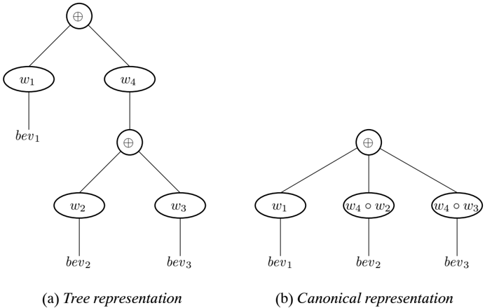

where a synchronous operation is wrapped with a tail-recursive call. If the
implementation of sync (and select) does not preserve the tail recursion, these
kinds of loops will cause the program to exhaust the available memory.

Unfortunately, it turns out that the above implementation of sync does not
preserve tail recursion, because of the semantics of callcc. In SML, the current
thread of control is actually comprised of two continuations: the regular
continuation, and the exception handler continuation. The callcc binds both
continuations into a cont value. This means that an application of callcc in a
tail-call position is not tail recursive (much the same way that an exception
handler wrapped around a tail-recursive call makes it non-tail recursive).
Because callcc is not tail-recursive, sync is not tail recursive. The
implementation of CML avoids this problem by using a special version of callcc
that does not save and restore the exception handler continuation.

## 10.5.6 Fairness

Another implementation issue is ensuring the fairness of the synchronization
primitives (see Section 2.3). The implementation of sync in Listing 10.16 is not
fair. For example, if a thread repeatedly synchronizes on the choice of two
events, where the fi rst one is always available, then the second one will never
be selected. There are several ways to

```
----------------
        fun wrap (EVT bevs, f) = let
            fun wrapBEvt (BEVT{pollFn, doFn, blockFn}) = let
                fun blockFn' (flg, k) =
                    throw k (f (falcc (fn k' => (blockFn (flg k'
                        raise Fail 'never get here'))))
            in
                BEVT{
                    pollFn = pollFn,
                    doFn = (f o dFn),
                    blockFn = blockFn'
                }
            end
        in
            EVT(map wrapBEvt bevs)
        end

    fun choose evts =
        EVT((foldr (fn (EVT bevs', bevs) => bevs' @ bevs) [] evts)

            Listing 10.18: The implementation of wrap and choose
```

Listing 10.18: The implementation of wrap and choose

avoid this problem. One simple approach is to poll all of the events, and when
there is more than one enabled, to select one randomly. This gives a
probabilistic guarantee of fairness that should be suf fi cient in practice. A
more complicated scheme is to associate priorities with channels, based on how
many times they have been enabled in a choice without being selected. In this
scheme, the pollFn returns a priority, and the highest priority base event is
selected.

## 10.6 Scheduling issues

In order to prevent a thread that is executing a long (or in fi nite)
computation from monopolizing the processor, CML uses preemptive thread
scheduling. This is done in a straightforward manner using an interval timer
provided by the operating system, and the SML/NJ signal mechanism. The interval
timer is set to generate an alarm signal every n milliseconds ( n is typically
in the range from 10 to 50). CML installs a signal handler that forces a context
switch on each alarm.

Preemption introduces some complexity to the implementation, since there can now
be interference between threads accessing the same channel data structures, and
between the threads and the signal handler when accessing the readyQ. We could
implement mutex locks to protect these critical regions, but since we are
executing on a uniprocessor, a much simpler technique will work.

We de fi ne a global fl ag that is used to mark when execution is in a critical
region:

2 The reader may rechonize that there is a noter

In this image there is a graph.<end_of_utteranc

Calendar

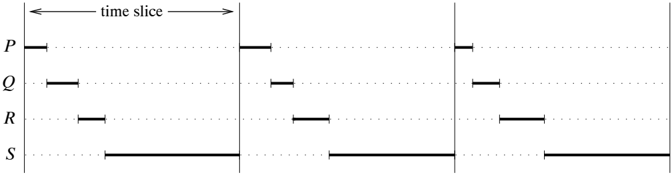

Figure 10.2: Simple round-robin scheduling

```
datatype atomic_state = NonAtomic | Atomic | SignalPending
    val atomicState : atomic_state ref

```

```
and two operations for bracketing critical regions:

                        val atomicBegin : unit -> unit
                        val atomicEnd    : unit -> unit

```

The function atomicBegin, which sets the atomicState fl ag to Atomic, is called
just prior to entering a critical region, and the function atomicEnd, which
resets the fl ag to NonAtomic, is called on exit. If a signal occurs while
atomic\_state is Atomic, then the signal handler does not force a context
switch; instead it sets atomic\_state to SignalPending and returns. The function
atomicEnd checks the fl ag before resetting it; if it is SignalPending, then a
context switch is performed. 2 Note that this mechanism is internal to the
implementation of CML; users have no access to these operations.

Another scheduling issue is insuring that computationally intensive threads do
not monopolize the processor. 3 The basic round-robin scheduling that we use in
this chapter does not prevent this. Consider the scenario where we have a single
computationally intensive thread and several threads that are communicating
frequently (so-called interactive threads). Figure 10.2 illustrates what three
successive time slices might look like in such a case; here, the threads P, Q,
and R are interactive, and the thread S is computationally intensive. This fi
gure shows that the interactive threads only get to run once per time-slice; if
there were two computationally intensive threads the interactive threads would
only get to run once per two slices. For any application that is sensitive to
realtime constraints, this scheduling results in unacceptable performance. One
obvious way

2 The reader may recognize that there is a potential race when exiting a
critical region between the time of the test for a pending signal and the
resetting of the fl ag. The implementation of signals in SML/NJ, however,
ensures that this race cannot happen.

3 A computationally intensive thread is one that computes with little or no
communication.

4A thread con dled he promoted if there are not

In this image there is a graph.<end_of_utteranc

Calendar

Figure 10.3: Two-level round-robin scheduling

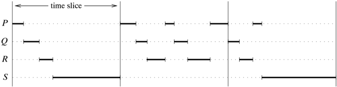

to address this problem is to use fi ner grain time slices, but many operating
systems do not support granularities fi ner than 10 ms. granularity, which is
not fi ne enough. Furthermore, using fi ner slices does not scale to large
numbers of computationally intensive threads.

The implementation of CML uses a two-level scheduling queue; interactive threads
are scheduled out of the primary queue, while computationally intensive threads
are scheduled out of the secondary queue. A simple hueristic is used to
catalogue threads. Each thread has an associated boolean fl ag, called doneComm,
which is set to true whenever it voluntarily yields the processor during a
concurrency operation. The fl ag is set to false whenever the thread is
preempted. If a thread is preempted and its doneComm fl ag is false, then it is
classi fi ed as a computationally intensive thread and is placed into the
secondary queue. If an interactive thread is preempted, then one thread from the
secondary queue is promoted to the primary queue. 4 This has the effect of
allowing a computationally intensive thread to run once every other time slice,
which means that interactive threads get at least 50% of the processor. Figure
10.3 illustrates this policy for our example.

## Notes

Continuations are one of the fundamental ideas in computer science, and appear
in many contexts. The idea of fi rst-class continuations dates back to Landin's
J operator [Lan65, Fel87], although other researchers also discovered the
concept independently. A paper by Reynolds provides an interesting history of
these multiple discoveries of continuations [Rey93]. Continuation-passing style
has been used in lazy languages to program I/O [HS88], including Holmstr¨ om's
concurrent extension of ML

4 A thread can also be promoted if there are no threads available in the primary
queue.

called PFL [Hol83a]. Continuations have also been important in the understanding
of the semantics of control [Gor79]. The use of continuation-passing style in
the SML/NJ compiler is described in Appel's book [App92].

SML/NJ 's callcc function was inspired by the language Scheme [RC86]. Most of
the work on using continuations to implement concurrency has been done in the
context of Scheme. The basic technique dates back to Wand's seminal paper in
which he described the implementation of coroutines using Scheme 's
continuations [Wan80]. This work was re fi ned further by Haynes, Friedman, and
Wand [HFW84]. Dybvig and Hieb have shown how to implement 'engines,' which are
an abstraction of time slices, using continuations [DH89]. Most recently,
Shivers has explored the connections between threads and continuations in the
context of operating system software [Shi97].

It is interesting to note that the representation of wrapped base events as
functions is required by the type system. With a richer type system, it would be
possible to represent event values as a datatype with constructors for the
different combinators, and implement sync as an interpreter of the datatype. As
noted in the text, our implementation of fi rst-class synchronous operations
omitted important implementation details, such as preserving tail recursion,
ensuring fairness, preemptive scheduling, and the full set of CML event
combinators. The event rewriting discussed in Section 10.5.4, was used as an
informal speci fi cation of the semantics of PML [Rep88]. Ferreira, Hennessy,
and Jeffrey have proved that this transformation is semantics preserving for the
PML subset of CML [FHJ96].

In addition to CML, there have been several other implementations of concurrency
features using SML/NJ 's fi rst-class continuations. The dirty fl ag technique
described in Section 10.5.2 was invented by Ramsey in his implementation of PML
-like primitives [Ram90]. The shared-memory primitives of Section 10.3 are a
subset of those implemented by Cooper and Morrisett [CM90]. Morrisett and
Tolmach implemented a multi-processor version of low-level thread primitives
[MT93].

Another approach to implementing concurrency is to provide primitives in the
runtime system that support the concurrency operations. PML was implemented this
way, as was Pike's language newsqueak [Pik90], and Cardelli described an
implementation model for Amber in terms of an abstract machine [Car84].

This chapter describes a uniprocessor implementation of selective communication,
which takes advantage of the fact that there is only one active thread of
control at any point in time in its implementation of concurrency control.
Implementing selective communication on a multiprocessor is signi fi cantly more
dif fi cult. Various researchers, such as Buckley and Silberschatz [BS83],
Bornat [Bor86], and Bagrodia [Bag89], have described such implementations. The
basic strategy in these implementations is to fi rst make tentative offers of
communication; when two tentative offers match, one thread must freeze its state
until the other thread either commits or rejects the communication.

The choice of which thread will fi x its state is based upon the order of the
threads' IDs; this avoids the possibility of cyclic dependencies and deadlock.
Generalized selective communication cannot be implemented in a distributed
setting because of the possibility of failures and communication delays. If one
assumes a reliable network, however, it is possible to design distributed
protocols for choice, as was done by Knabe for the implementation of Facile
[Kna92].

## Appendix A A CML Reference

This appendix provides a reference for the CML features used in this book. It is
excerpted from The Concurrent ML Reference Manual, which is included in the CML
distribution, and can also be found on the Web at the following URL:

http://cml.cs.uchicago.edu/index.html

The full manual contains information about additional libraries, as well as
instructions on compiling and running CML programs. The remainder of this
appendix contains descriptions of most of the modules in the CML system. In
order of their appearance, these are as follows:

```
structure CML : CML

```

This module contains the basic types and operations used by CML .

```
structure SyncVar : S
```

SYNC\_VAR

This module de fi nes synchronousmemory in the form of I-variables and
M-variables and their operations.

structure Mailbox: MAILBOX This module de fi nes buffered asynchronous channels,
which are called mailboxes.

*   structure Result: RESULT This module provides a way of communicating both
  values and exceptions as results.

```
structure OS : CML_OS

```

This module is an extension of the OS structure de fi ned in the SML Basis
Library.

signature CML\_TEXT\_STREAM\_IO

This module is an extension of the TEXT\_STREAM\_IO signature de fi ned in the
SML Basis Library.

*   structure TextIO : CML\_TEXT\_IO

This module is an extension of the TextIO structure de fi ned in the SML Basis
Library.

structure Multicast: MULTICAST This module de fi nes asynchronous multicast
channels.

*   structure SimpleRPC : SIMPLE\_RPC

This module provides some help in implementing simple servers.

The fi rst four of these are core CML modules, the next three are CML speci fi c
versions of SML Basis Library modules, 1 and the last two are CML library
modules. Note that while we do not include the documentation for CML 's version
of the binary I/O interfaces here, the extensions are similar to those provided
for text I/O.

1 We assume that the reader is familiar with the SML Basis Library speci fi
cation.

## The CML structure

The CML structure provides the basic operations for thread creation, synchronous
channels, and the event type constructor and combinators.

## Synopsis

```
The CML structure
                    The CML structure provides the basic operations for thread creation, synchronous channels,
                    and the event type constructor and combinators.


            Synopsis
            signature  CML
            structure  CML  :  CML


            Interface
            type  thread_id
            type  'a  event
            type 'a  cha chan

            val version :  {system : string, version_id : int list, date : string}
            val banner  : string

            val spawnc  : ('a -> unit) -> 'a -> thread_id
            val spawn
            val yield  : unit -> unit
            val exit  : unit -> 'a

            val wrap         : ('a event * ('a -> 'b)) -> 'b event
            val wrapHandler : ('a event * (exn -> 'a)) -> 'a event
            val guard     : (unit -> 'a event) -> 'a event
            val withNack: (unit event -> 'a event) -> 'a event
            val choose: 'a event list -> 'a event
            val sync  : 'a event -> 'a
            val select  : 'a event list -> 'a
            val never     : 'a event
            val alwaysEvt : 'a -> 'a event

            val channel : unit -> 'a chan
            val sameChamel : ('a chan * 'a chan) -> bool
            val send : ('a chan * 'a) -> unit
            val recv : 'a chan -> 'a
            val sendEvt  : ('a chan * 'a) -> unit event
            val recvEvt  : ('a chan -> 'a event
            val sendPoll : 'a chan -> 'a -> bool
            val recvPoll : 'a chan -> 'a option

            val getTid : unit -> thread_id
            val sameTid         : (thread_id * thread_id) -> bool
            val compareTid  : (thread_id * thread_id) -> order
            val hashTid      : thread_id -> word
            val tidToString : thread_id -> string
            val joinEvt  : thread_id -> unit event

            val timeOutEvt : Time.time -> unit event
            val atTimeEvt : Time.time -> unit event

```

## Description

```
type thread_id

```

Each thread in a CML execution has a unique thread ID. These IDs are in an
unspeci fi ed total order that can be used to break cyclic dependencies (see
compareTid).

type 'a event Event values are abstract representations of synchronous
operations (so-called fi rst-class synchronous operations). type 'a chan This
type constructor generates the types for synchronous channels, where the
parameter speci fi es the types of values carried on the channel. val version:
{system: string, version\_id: int list, date: string} val banner: string These
specify which version of CML is implemented by this structure ( banner is a
string representation of the version value). val spawnc: ('a -&gt; unit) -&gt;
'a -&gt; thread\_id spawnc f x spawns a new thread, which evaluates the
application of f to x. The thread ID of the new thread is returned. val spawn:
(unit -&gt; unit) -&gt; thread\_id spawn f is equivalent to the expression
spawnc f (). val yield: unit -&gt; unit This function can be used to implement
an explicit context switch. Since CML is preemptively scheduled, it should never
be necessary for user programs to call this function. It is mainly used for
performance measurements. val exit: unit -&gt; 'a This function terminates the
calling thread. val wrap: ('a event * ('a -&gt; 'b)) -&gt; 'b event wrap ( ev,
f) wraps the post-synchronization action f around the event value ev.

```
val wraphandler : ('a event * (exn -> 'a) ) -> 'a event

```

wrapHandler ( ev, h) wraps the exception handler function h around the event
value ev. If, during execution of some post-synchronization action in ev, an
exception is raised, it will be caught and passed to h. Nesting of handlers
works as would be expected: the innermost handler is the fi rst one invoked.
Note that exceptions raised in the pre-synchronization actions in ev ( i.e.,
actions de fi ned by guard and withNack) are not handled by h.

```
val guard : (unit -> 'a event) -> 'a event

```

guard g creates a delayed event value from the function g. When the resulting
event value is synchronized on, the function g will be evaluated and the
resulting event value will be used in the synchronization. This combinator
provides a mechanism for implementing pre-synchronization actions, such as
sending a request to a server.

```
val withack : (unit event -> 'a event) -> 'a event

```

withNack g creates a delayed event value from the function g. As in the case of
guard, the function g will be evaluated at synchronization time and the
resulting event value will be used in the synchronization. Furthermore, when g
is evaluated, it is passed a negative acknowledgement event as an argument. This
negative acknowledgement event is enabled in the case where some other event
involved in the synchronization is chosen instead of the one produced by g. The
withNack combinator provides a mechanism for informing servers that a client has
aborted a transaction.

```
val close : 'a event list -> 'a event

```

choose evs constructs an event value that represents the non-deterministic
choice of the events in the list evs.

```
val sync : 'a event -> 'a
```

sync ev synchronizes the calling thread on the event ev .

```
val select : 'a event list -> 'a
```

select evs synchronizes on the non-deterministic choice of the events in the
list evs. It is semantically equivalent to the expression sync (choose evs) but
is more ef fi cient.

```
val never : 'a event
```

This event value is one that is never enabled for synchronization. It is
semantically equivalent to the expression choose[].

```
val alwaysEvt : 'a -> 'a event
```

alwaysEvt x creates an event value that is always enabled, and that returns the
value x upon synchronization. A thread that synchronizes on a choice of events,
which includes an event created by alwaysEvt, is guaranteed not to block, but
there is no guarantee that the event created by alwaysEvt will be chosen, since
there may be some other enabled event ( i.e., there is no priority on enabled
events in a choice).

```
val channel : unit -> 'a chan

```

This function creates a new synchronous channel.

```
val sameChannel : ('a chan * 'a chan) -> bool

```

This function returns true , if its two arguments are the same channel.

```
val send : ('a chan * 'a)  -> unit

```

send ( ch, msg) sends the message msg on the synchronous channel ch. This
operation blocks the calling thread until there is another thread attempting to
receive a message from the channel ch, at which point the receiving thread gets
the message and both threads continue execution.

```
val recv : 'a chan -> 'a

```

recv ch receives a message from the channel ch. This operation blocks the
calling thread until there is another thread attempting to send a message on the
channel ch, at which point both threads continue execution.

```
val sendEvt : ('a chan * 'a) -> unit event
    val recvEvt : 'a chan -> 'a event
```

These functions create event values that represent the send and recv operations,
respectively.

```
val sendPoll : ('a chan * 'a) -> bool

```

sendPoll ( ch, msg) attempts to send the message msg on the synchronous channel
ch. If this operation can complete without blocking the calling thread, then the
message is sent and true is returned. Otherwise, no communication is performed
and false is returned. This function is not recommended for general use; it is
provided as an ef fi ciency aid for certain kinds of protocols.

```
val recvPoll : 'a chan -> 'a option

```

recvPoll ch attempts to receive a message from the channel ch. If there is no
other thread offering to send a message on ch, then this returns NONE. Otherwise
it returns SOME wrapped around the message. This function is not recommended for
general use; it is provided as an ef fi ciency aid for certain kinds of
protocols.

```
val getTid : unit -> thread_id

```

This function returns the thread ID of the calling thread.

<!-- formula-not-decoded -->

This function returns true if its two arguments are the same thread ID, and
otherwise returns false.

```
val compareTid : (thread_id * thread_id) -> order
```

This function compares the two thread IDs and returns their order in the total
ordering of thread IDs. The precise semantics of this ordering is left unspeci
fi ed, other than to say it is a total order.

```
val hashTid : thread_id -> word

```

This function returns a word value that can be used as a hash key for the thread
ID. Note that it is possible that two different thread IDs will have the same
hash value.

```
val tidToString : thread_id -> string
```

This function returns a string representation of the thread ID.

```
val joinEvt : thread_id -> unit event

```

joinEvt tid creates an event value for synchronizing on the termination of the
thread with the ID tid. There are three ways that a thread may terminate: the
function that was passed to spawn (or spawnc) may return; it may call the exit
function; or it may have an uncaught exception. Note that joinEvt does not
distinguish between these cases; it also does not become enabled if the named
thread deadlocks (even if it is garbage collected).

```
val timeOutEvt : Time.time -> unit event

```

timeOutEvt t creates an event value that becomes enabled at the time interval t
after synchronization. For example, the expression

```
sync (timeOutEvt (Time,fromSeconds 1) )

```

will delay the calling thread for one second. Note that the speci fi ed time
interval is actually a minimum waiting time, and the delay may be longer.

```
val atTimeEvt : Time.time -> unit event

```

atTimeEvt t creates an event value that becomes enabled at the speci fi ed time
t. For example, the expression

```
sync  (atTimeEvt  (Date.toTime  (Date.date  {
                year = 2000, month = Date.Jan, day = 0,
                hour = 0, minute = 0, second = 0,'
                offset = NONE
            }))))
the calling thread until the beginning of the year 2000

```

blocks the calling thread until the beginning of the year 2000.

## The SyncVar structure

The SyncVar structure provides Id -style synchronous variables (or memory
cells). These variables have two states: empty and full. An attempt to read a
value from an empty variable blocks the calling thread until there is a value
available. An attempt to put a value into a variable that is full results in the
Put exception being raised. There are two kinds of synchronous variables:
I-variables are write-once, while M-variables are mutable.

## Synopsis

```
a variable that is full results in the Put exception being raised.  '
                   synchronous variables: I-variables are write-once, while M-variable
           Synopsis:
           signature  SYNC_VAR
           structure  SyncVar  :  SYNC_VAR


           Interface
           exception Put

           type 'a  ivar

           val iVar      : unit -> 'a  ivar
           val iPut      : ('a  ivar * 'a) -> unit
           val iGet  : 'a  ivar -> 'a
           val iGetEvt  : 'a  ivar -> 'a CML.event
           val iGetPoll : 'a  ivar -> 'a option
           val sameVar : ('a  ivar * 'a  ivar) -> bascii

           type 'a  mvar

           val mVar     : unit -> 'a  mvar
           val mPut     : ('a  mvar * 'a) -> unit
           val mTake    : 'a  mvar -> 'a
           val mTakeEvt  : 'a  mvar -> 'a CML.event
           val mTakePoll : 'a  mvar -> 'a option
           val mGetEvt    : 'a  mvar -> 'a
           val mGetPoll   : 'a  mvar -> 'a CML.event
           val mSwap    : ('a  mvar * 'a) -> 'a
           val mSwapEvt  : ('a  mvar * 'a) -> 'a CML.event
           val sameMVar  : ('a  mvar * 'a mvar) -> bool


           Description
```

## Description

```
exception Put

```

This exception is raised when an attempt is made to put a value into a variable
that is already full (see iPut and mPut).

```
type 'a ivar
```

This type constructor generates the types for I-variables, where the parameter
speci fi es the types of values stored in the variable I-structured variables
are write-once variables that provide synchronization on read operations. They
are especially useful for one-shot communications, such as reply messages in
client/server protocols, and can also be used to implement shared incremental
data structures.

```
val ivar : unit -> 'a ivar

```

This function creates a new empty I-variable.

```
val iPut : ('a ivar * 'a) -> unit

```

iPut ( iv, x) fi lls the I-variable iv with the value x. Any threads that are
blocked on iv will be resumed. If iv already has a value in it, then the Put
exception is raised.

```
val iGet : 'a  ivar -> 'a
```

iGet iv returns the contents of the I-variable iv. If the variable is empty,
then the calling thread blocks until the variable becomes full.

```
val iGetEvt : 'a  ivar -> 'a  CML.event

```

iGetEvt iv returns an event value that represents the iGet operation on iv .

```
val iGetPoll : 'a  ivar -> 'a  option

```

This function is a non-blocking version of iGet. If the corresponding blocking
form would block, then it returns NONE; otherwise it returns SOME of the
variable's contents.

val sameIVar: ('a ivar * 'a ivar) -&gt; bool sameIVar ( iv1, iv2) returns true,
if iv1 and iv2 are the same I-variable.

```
type 'a mvar
```

This type constructor generates the types for M-variables, where the parameter
speci fi es the types of values stored in the variable. Unlike ivar values,
M-structured variables may be updated multiple times. Like I-variables, however,
they may only be written if they are empty.

val mVar: unit -&gt; 'a mvar mVar () creates a new empty M-variable. val
mVarInit: 'a -&gt; 'a mvar mVarInit x creates a new M-variable initialized to x.

val mPut: ('a mvar * 'a) -&gt; unit mPut ( mv, x) fi lls the M-variable mv with
the value x. Any threads that are blocked on mv will be resumed. If mv already
has a value in it, then the Put exception is raised. val mTake: 'a mvar -&gt; 'a
mTake mv removes and returns the contents of the M-variable mv making it empty.
If the variable is already empty, then the calling thread is blocked until a
value is available. val mTakeEvt: 'a mvar -&gt; 'a CML.event mTakeEvt mv returns
an event value that represents the mTake operation on mv. val mGet: 'a mvar
-&gt; 'a mGet mv returns the contents of the M-variable mv without emptying the
variable; if the variable is empty, then the thread blocks until a value is
available. It is equivalent to the atomic execution of the following expression:
let val x = mTake mv in mPut( mv, x); x end val mGetEvt: 'a mvar -&gt; 'a
CML.event mGetEvt mv returns an event value that represents the mGet operation
on mv. val mTakePoll: 'a mvar -&gt; 'a option val mGetPoll: 'a mvar -&gt; 'a
option These are non-blocking versions of mTake and mGet, respectively. If the
corresponding blocking form would block, then they return NONE; otherwise they
return SOME of the variable's contents. val mSwap: ('a mvar * 'a) -&gt; 'a mSwap
( mv, newV) puts the value newV into the M-variable mv and returns the previous
contents. If the variable is empty, then the thread blocks until a value is
available. It is equivalent to the atomic execution of the following expression:
let val x = mTake mv in mPut( mv, newV); x end val mSwapEvt: ('a mvar * 'a)
-&gt; 'a CML.event mSwapEvt ( mv, newV) returns an event value that represents
the mSwap operation on mv and newV. val sameMVar: ('a mvar * 'a mvar) -&gt; bool
sameMVar ( mv1, mv2) returns true, if mv1 and mv2 are the same M-variable.

## The Mailbox structure

The Mailbox structure provides support for buffered asynchronous communication,
via mailboxes. Mailbox buffers are unbounded and preserve the order that
messages are sent (e.g., FIFO ordering).

## Synopsis

```
signature MAILBOX

```

```
The Mailbox structure provides support for buffered asynchronous communication, via
                       mailboxes. Mailbox buffers are unbounded and preserve the order that messages are sent
                       (e.g., FIFO ordering).

        Synopsis
        =========================
        structure MailBOX
        structure Mailbox  : MAILBOX


        Interface
        type 'a  mbox

        val  mailbox   : unit  ->  'a  mbox
        val  sameMailbox : ('a  mbox * 'a  mbox)  ->  bool
        val  send         : ('a  mbox * 'a)  ->  unit
        val  recv         : 'a  mbox -> 'a
        val  recvEvt     : 'a  mbox -> 'a  CML.evevt
        val  recvPoll  : 'a  mbox -> 'a  option


        Description

        type 'a  mbox

                This type constructor generates the types for mailboxes, where the parameter specifies the
                types of values that can be sent to the mailbox. A mailbox is a communication channel with
                unbounded buffering.


        val  mailbox  :  unit  ->  'a  mbox

                This function creates a new mailbox.


        val  sameMailbox  :  ('a  mbox  * 'a  mbox)  ->  bool

                sameMailbox  (mb1,  mb2)   returns true, if mb1 and mb2 are the same mailbox.


        val  send  :  ('a  mbox  * 'a)  ->  unit

                send  (mb,  msg)    sends the message msg to the mailbox  mb.  Note that unlike the
                CML.send operation, sending a message on a mailbox will never block the sending thread.


        val  recv  : 'a  mbox  ->  'a

                recv  mib    receives the next message from the mailbox  mb.  If  mib is empty, then this
                blocks the calling thread until there is a message available.

```

recv mb receives the next message from the mailbox mb. If mb is empty, then this
blocks the calling thread until there is a message available.

```
val receiveVt:  : 'a  mbox  -> 'a  CML. event

```

recvEvt mb returns the event value that represents the recv operation on mb .

val recvPoll : 'a mbox -&gt; 'a option

This function is the non-blocking version of recv. If the corresponding blocking
form would block (because the mailbox is empty), then this returns NONE.
Otherwise it returns SOME of the received message.

## Discussion

Note that mailbox buffers are unbounded, which means that there is no fl ow
control to prevent a producer from greatly outstripping a consumer, and thus
exhausting memory. In situations where there is no natural limit to the rate of
send operations, it is recommended that the synchronous channels from the CML
structure be used instead.

## The Result structure

The Result structure provides support for communicating results. A result
variable is a write-once memory cell that can contain either a value or an
exception.

## Synopsis

```
signature RESULT
  structure Result : RESULT

```

## Interface

```
type 'a
```

```
val result : unit -> 'a result
    val put     : ('a result * 'a) -> unit
    val putExn : ('a result * exn) -> unit
    val get     : 'a result -> 'a
    val getEvt : 'a result -> 'a CML.event

```

```
require 'a result'

result : unit -> 'a result * a') -> unit
putExn  ('a result * exn) -> unit
get      : 'a result -> 'a
getEvt  : 'a result -> 'a CML.event

```

## Description

```
type 'a result

```

This type constructor generates the types for result variables, where the
parameter speci fi es the types of values stored in the variable A result value
has essentially the same semantics as an ivar, except that it can contain either
a value or an exception packet to raise.

```
val result : unit -> 'a result

```

This function creates a new result variable.

```
val put : ('a result * 'a) -> unit

```

put ( r, v) puts the value v into the result variable r. If the result variable
r already holds a result, then the SyncVar.Put exception is raised.

```
val putExn : ('a result * exn) -> unit

```

putExn ( r, exn) puts the exception packet exn into the result variable r. If
the result variable r already holds a result, then the SyncVar.Put exception is
raised.

```
val get : 'a result -> 'a
```

get r gets the contents of the result variable r. If r is empty, then the
calling thread blocks until another thread puts a value into r (using put or
putExn). If r holds an exception packet, then that exception is raised;
otherwise the value that r holds is returned.

```
val getEvent : 'a result -> 'a CML.event

```

This function constructs an event value that represents the get operation.

## The OS structure

CML extends the OS structure, which is part of the SML Basis Library, by adding
eventvalue constructors for low-level system events.

## Synopsis

```
signature CML_OS
  structure OS : CML_

```

```
signature CML_OS
  structure OS : CML_OS


Interface

supplied OS

```

```
Interface
      include OS

      structure Process : sig
          include OS_PROCESS
          val systemEvt : string -> status Event.event
        end

      structure IO : sig
          include OS_IO
          val pollEvt : poll_desc list -> poll_info list Event.
        end

```

```
val pollEvent : poll_desc list -> poll_info list Event.event
    end

```

## Description

```
structure Process : sig ... end

```

The Process substructure extends the OS.Process structure from the SML Basis
Library by adding an event constructor for the system function.

```
val systemEvt : string -> status Event.event

```

systemEvt cmd asks the operating system to execute the command cmd, and returns
an event value that can be used to synchronize on the termination of the
command's execution. This function will raise OS.SysErr, if the command cannot
be executed for some reason.

Note that, although this function is independent of the operating system, the
interpretation of the string cmd depends very much on the underlying operating
system and shell.

```
structure IO : sig ... end

```

The IO substructure extends the OS.IO structure from the SML Basis Library by
adding an event constructor for the poll function.

```
val pollEvent : poll_desc list -> poll_info list Event.event

```

pollEvt l returns an event value that synchronizes on one or more of a
collection of I/O devices satisfying the conditions speci fi ed by the list of
poll descriptors l. Successful synchronization will return a non-empty list of
poll\_info values

corresponding to those descriptors in l whose conditions are enabled. The
returned list respects the order of the argument list, and a value in the
returned list will re fl ect a (nonempty) subset of the conditions speci fi ed
in the corresponding argument descriptor. The pollEvt function will raise
OS.SysErr if, for example, one of the fi le descriptors refers to a closed fi
le.

Note that unlike the poll function, there is no timeout argument. A non-zero
timeout can be provided by putting the polling event in a choice with a timeout
event.

## Discussion

Note that the interface as given is not a valid SML signature, since it rede fi
nes the Process and IO substructures.

## The CML\_TEXT\_STREAM\_IO signature

The CML\_TEXT\_STREAM\_IO signature de fi nes the interface of the Stream I/O
layer in CML 's text I/O stack. It provides input streams, which are treated in
the lazy functional style, and output streams, which are treated more
conventionally. This signature is an enrichment of the TEXT\_STREAM\_IO
signature from the SML Basis Library. In addition to the operations provided by
the Basis Library, it adds event-value constructors for the various input
operations. For more information see the descriptions of the STREAM\_IO and
TEXT\_STREAM\_IO signatures in the SML Basis Library documentation.

## Synopsis

```
signature CML_TEXT_STREAM_IO

```

## Interface

include TEXT\_STREAM\_IO

```
val input1Evt     : instream -> (elem * instream) option CML.event
        val inputNEvt     : (instream * int) -> (string * instream) CML.event
        val inputEvt     : instream -> (string * instream) CML.evt
        val inputAllEvt  : instream -> (string * instream) CML.evt
        val inputLineEvt : instream -> (string * instream) CML.evt
```

## Description

```
val inputWt : instream -> (string * instream) XML.event

```

inputEvt instrm returns an event value that represents the input operation on
the instream instrm. More precisely, the returned event value can be used to
synchronize on there either being input available or an end-of-stream being
detected. In the former case, the result of synchronization is the available
input and the continuation of the stream, while in the latter case the empty
string and stream continuation are returned. While inputEvt does not raise any
exceptions itself, synchronizing on the returned event value will raise the Io
exception when there is an error in the underlying system calls.

```
val input1Kwt : instream -> (elem * instream) option CML.event

```

input1Evt instrm returns an event value that represents the input1 operation on
the instream instrm. Synchronizing on the resulting event will produce a
character and the rest of the stream, or else NONE when the end of stream is
reached. While input1Evt does not raise any exceptions itself, synchronizing on
the returned event value will raise the Io exception when there is an error in
the underlying system calls.

```
val inputNvkt : (instream * int) -> (string * instream) CML.event

```

inputNEvt ( instrm, n) returns an event value that represents the inputN
operation. This function raises the Size exception when n is either less than
zero or larger than

the maximum length string. Furthermore, synchronizing on the resulting event
value will raise the Io exception when there is an error in the underlying
system calls.

```
val inputAllEvt : instream -> (string * instream) CML.event

```

inputAllEvt instrm returns an event value that represents the inputAll operation
on the instream instrm. While inputAllEvt does not raise any exceptions itself,
synchronizing on the returned event value will raise the Io exception when there
is an error in the underlying system calls, and will raise Size when if the
number of elements to be returned is greater than the maximum string length.

```
val inputLineEvt : instream -> (string * instream) CML.event

```

inputLineEvt instrm returns an event value that represents the inputLine
operation on the instream instrm. While inputLineEvt does not raise any
exceptions itself, synchronizing on the returned event value will raise the Io
exception when there is an error in the underlying system calls, and will raise
Size when if the number of elements to be returned is greater than the maximum
string length.

## Discussion

One point that may not be obvious from the above descriptions is that these
functions construct event values with respect to a speci fi c input stream
value. Thus, each time one synchronizes on an input event one gets the same
result.

## The TextIO structure

The TextIO structure de fi nes the interface of the imperative I/O layer in the
text I/O stack. This layer provides buffered I/O using mutable streams, and the
ability to rebind imperative-level streams dynamically to different stream-level
streams. The CML implementation of imperative input streams serializes access to
the underlying functional stream. Thus, if a thread is blocked attempting to
read from a stream strm, any other thread that attempts an operation on strm
will have to wait until the fi rst thread's operation completes (even if the
second thread is attempting a non-blocking operation like endOfStream).

## Synopsis

```
signature  CML_TEXT_IO
    structure TextIO  : CML_TEXT_IO

```

```
structure CML_TEXT_IO
      structure TextIO : CML_TEXT_IO

      Interface
      include TEXT_IO

      structure StreamIO : CML_TEXT_STREAM_IO
        where type reader = TextPrimIO.reader
        where type writer = TextPrimIO.writer
        where type pos = TextPrimIO.pos
        where type vector = string
        where type elem = char

      val input1Evt    : instream -> elem option CML.event
      val inputNEvt    : (instream * int) -> string CML.event
      val inputEvt     : instream -> string CML.event
      val inputAllEvt  : instream -> string CML.event

      val openChan   : string CML.chan -> instream
      val openChanOut : string CML.chan -> outstream


      Description

      structure StreamIO : CML_TEXT_STREAM_IO

            This substructure implements the Stream I/O layer of the text I/O stack. Noe that it has the
            enriched CML specific signature.


      val input1Evt  : instream -> elem option CML.event
      val inputNEvt  : (instream * int) -> string CML.event
      val inputEvt : instream -> string CML.event
      val inputAllEvt : instream -> string CML.event

            These operations are event-value constructors for the standard input operations on input
            streams.

```

```
val input1Evt : instream -> elem option CML.event
    val inputNEvt : (instream * int) -> string CML.event
    val inputEvt : instream -> string CML.event
    val inputAllEvt : instream -> string CML.event
```

These operations are event-value constructors for the standard input operations
on input streams.

```
val openChanIn : string, CML.chan -> inputStream
```

openChanIn ch returns an input stream that is connected to the output end of the
channel ch. Strings sent on the channel ch can be read by using any of the input
operations on the stream. Note that sending a message on ch may block the
sending thread until some other thread performs an input operation on the
stream.

```
val openChanOut : string, CML.chan -> ostream
```

openChanOut ch returns an output stream that is connected to the input end of
the channel ch. Data written to the output stream is buffered, and may be read
from the channel.

## Discussion

Note that the interface as given is not a valid SML signature, since it rede fi
nes the StreamIO substructure.

## The Multicast structure

Multicast channels provide a mechanism for broadcasting a stream of messages to
a collection of threads. Threads receive multicast messages via an output port;
each port receives each message sent since the port was created. Multicast
channels are particularly useful for communicating with a dynamically varying
group of threads, since the sender does not need to know how many threads are
listening.

## Synopsis

```
signature MULTICAST
    structure Multicast : MULTICAST

```

## Interface

```
interface

type 'a mchan
type 'a port
type 'a event = 'a CML.event

val mChannel : unit -> 'a mchan
val port : 'a mchan -> 'a port
val copy : 'a port -> 'a port
val recv : 'a port -> 'a
val recvEvt : 'a port -> 'a event
val multicast : ('a mchan * 'a) -> unit

```

## Description

type 'a mchan The type constructor for multicast channels. type 'a port The type
constructor for output ports on multicast channels. val mChannel: unit -&gt; 'a
mchan This function creates a new multicast channel. val port: 'a mchan -&gt; 'a
port port mc creates a new output port on the multicast channel mc. val copy: 'a
port -&gt; 'a port copy p creates a new output port that has the same state as
the port p; i.e., the stream of messages seen on the two ports will be
identical. This function is useful when two threads need to see exactly the same
stream of messages.

val recv: 'a port -&gt; 'a recv p receives the next message from the port p. The
calling thread is blocked until there is a message available. val recvEvt: 'a
port -&gt; 'a event recvEvt p creates an event value that represents the recv
operation on the port p. val multicast: ('a mchan * 'a) -&gt; unit multicast (
mc, v) multicasts the value v on the channel mc. It is a nonblocking operation.

## The SimpleRPC structure

The SimpleRPC structure provides higher-order functions for implementing a
simple RPC ( remote procedure call) protocol. The protocol is one where the
client's call blocks until a reply is received from the server, and the server's
entry event is enabled whenever there is a client attempting a call. These
functions take a server action as an argument and return the client call
function and server entry as results.

## Synopsis

```
signature SIMPLE_RPC
    structure SimpleRPC : SIMPLE_RPC

```

## Interface

```
Interface
type 'a event = 'a CML.event

val mkRC : ('a -> 'b) -> {
        call     : 'a -> 'b;
        entryEvt : unit event
        }

val mkRC_In : (('a * 'c) -> 'b) -> {
        call     : 'a -> 'b,
        entryEvt : 'c -> unit event
        }

val mkRC_Out : ('a -> ('b * 'c)) -> {
        call     : 'a -> 'b,
        entryEvt : 'c event
        }

val mkRC_InOut : (('a * 'c) -> ('b * 'd)) -> {
        call     : 'a -> 'b,
        entryEvt : 'c -> 'd event
        }

```

## Description

```
val mkRPC : ('a -> 'b) -> {
            call : 'a -> 'b,
            entryEvt : unit event
        }
```

mkRPC action packages the action function action in a simple RPC protocol, where
the client operation is a blocking function and the server entry is an event
that is enabled whenever a client request is made. The mkRPC function is the
least general of the functions in this structure; there are no additional
arguments or results to the action function. Any state that is local to the
server must be included in the action's closure. For example, the following code
shows how mkRPC can be used to implement access to shared state:

```
fun mkServer init = let
                        val r = ref init
                        val {call=get, entryEvt=getEvt} = mkRPC(frn() => !r)
                        val {call=put, entryEvt=putEvt} = mkRPC(frnX => r := X)
                        fun server () = (select[getEvt, putEvt]; server())
                        in
                        ignore (spawn server);
                        {get = get, put = put}
                      end


  val mkRPC_In : (('a * 'c) -> 'b) ->  {
                call : 'a -> 'b,
                entryEvt : 'c -> unit event
              }

          The mkRPC_In function supports an action function that takes an additional argument.
          This argument is supplied by the server when creating the entry event value.  For example.
```

The mkRPC\_In function supports an action function that takes an additional
argument. This argument is supplied by the server when creating the entry event
value. For example, we can modify the reference cell example to use mkRPC\_In
for the get action

```
This argument is supplied by the server when creating the entry event value. For example,
                    we can modify the reference cell example to use mkRPC_In for the gget action
                    fun  mkServer init = let
                            val r = ref init
                            val {call=get, entryEvt=getEvt} = mkRPC_In(fn (_, x) => x)
                            val {call=put, entryEvt=putEvt} = mkRPC(fn x => r := x)
                            fun server () = (select [getEvt (!r), putEvt] ; server())
                            in
                                ignore (spawn server);
                                {get = get, put = put}
                            end


    val mkRPC_Out : ('a -> ('b * 'c)) ->  {
                    call : 'a -> 'b,
                    entryEvt : 'c event
                }

            The mkRPC_Out function supports an action function that returns an additional result. This
            argument is supplied by the server when creating the entry event value. Using mkRPC  In

```

The mkRPC\_Out function supports an action function that returns an additional
result. This argument is supplied by the server when creating the entry event
value. Using mkRPC\_In for the get operation and mkRPC\_Out for the put
operation results in the following implementation of the shared cell:

```
for the get operation and mkRPC_Out for the put operation results in the following
                    implementation of the shared cell:
                    fun  mkServer init = let
                            val {call=get, entryEvt=getEvt} = mkRPC_In(fn (_, x) => x)
                            val {call=put, entryEvt=putEvt} = mkRPC_Out(fn (x => ((), x))
                            fun server v = server(select[getEvt v, putEvt]))
                            in
                                ignore (spawnc server init);
                                {get = get, put = put}
                            end


    val mkRPC_InOut : (('a * 'c) -> ('b* 'd)) -> {
                    call: 'a -> 'b,
                    entryEvt : 'c -> 'd event
                }

            The mkRPC_InOut function provides for both additional arguments and results to the
            action function
```

```
273

! r)
: = x)
))


val argument.
For example,

x

: = x) x)
r r ())


```

The mkRPC\_InOut function provides for both additional arguments and results to
the action function.

## Discussion

Note that these functions do not support communicating server-side exceptions
back to the client; in fact, they are written under the assumption that the
action functions never produce uncaught exceptions.

## Appendix B

The Semantics of CML

One of the attractive properties of SML is that it has a formal de fi nition,
which serves as both a guide to implementors and users. Following this
tradition, a semantics of 'MiniCML ' has been developed, and some basic
properties of the semantics have been proven. In this appendix, we present both
the dynamic and static semantics of MiniCML, and state some theorems relating
the two. MiniCML is based on a purely functional subset of SML without
datatypes, pattern matching, modules, or exceptions. 1 This sequential base is
extended with the complete set of CML event combinators, as well as threads and
channels. While we have necessarily restricted ourselves to a subset of CML, the
full range of CML concurrency primitives is covered by this semantics. This
appendix is not meant to be a theoretical treatise, but rather an aid to
understanding the language.

## B.1 Notation

Before diving into the semantics of MiniCML, it is necessary to review notation.

If A and B are sets, then A ∪ B is their union, A ∩ B is their intersection, and
A \ B is their difference. The notation A fi n -→ B denotes the set of fi nite
maps from A to B ( i.e., partial functions with fi nite domains). If f is a map,
then the domain and range of f are de fi ned as

<!-- formula-not-decoded -->

<!-- formula-not-decoded -->

The notation { a 1 ↦→ b 1,..., a n ↦→ b n} denotes a fi nite map with domain { a
1,..., a n}, such that a i is mapped to b i; we write {} for the map with the
empty domain. If A ′ ⊂ A,

1 Of these features, exceptions are the only feature that would require signi fi
cant reworking of the dynamic semantics. This is because exception names are
global over all processes in the system, which requires extra bookkeeping in the
semantic rules.

A ′ is fi nite and b ∈ B, then { A ′ ↦→ b} ∈ A fi n -→ B is the fi nite map that
maps each a ∈ A ′ to B. If f and g are maps, then f ◦ g is their composition,
and f ± g, called f modi fi ed by g, is a map with domain dom( f) ∪ dom( g),
such that

<!-- formula-not-decoded -->

The symbol ± is used because something is added and something is take away (when
dom( g) ∩ dom( f) = ∅). We often fi nd it useful to view fi nite maps as sets of
ordered pairs and write f ⊆ g, if dom( f) ⊆ dom( g) and for x ∈ dom( f), f ( x)
= g ( x). In this case, g is called an extension of f. We write e [ x ′ ↦→ e ′ ]
for the capture-free substitution of the term e ′ for the variable x ′ in the
term e.

## B.2 Syntax

We fi rst present the surface syntax of MiniCML. 2 As is usual, we assume the
existence of countable sets of variables and constants:

<!-- formula-not-decoded -->

The set of function constants, FCONST, includes the following symbols for the
concurrency primitives: alwaysEvt, channel, choose, guard, neverEvt, recvEvt,
sendEvt, wrap, and withNack.

The surface syntax of MiniCML expressions is de fi ned by the following grammar:

In this image, we can see some text and numbers.<end_of_utteranc

Table

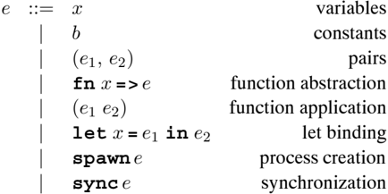

The dynamic semantics of MiniCML are de fi ned in terms of an internal syntax,
which is the surface syntax extended with special syntactic forms used to
represent semantic

2 That is, the syntax used by programmers and accepted by compilers.

/negationslash

objects. We need two additional sets of names for channels and conditions, which
are distinct from the variables and constants:

<!-- formula-not-decoded -->

γ ∈ COND condition names

We then extend the surface syntax with the following grammar productions:

In this image, we can see a diagram.<end_of_utteranc

Table

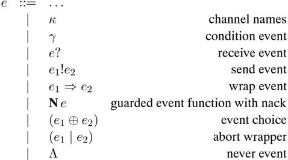

Note that we use N e to represent the product of both guard and withNack .

It is useful to distinguish two subsets of expressions: values (denoted v) and
event values (denoted ev). These are de fi ned as the least subsets of
expressions satisfying the following grammars:

In this image, we can see some text and numbers.<end_of_utteranc

Table

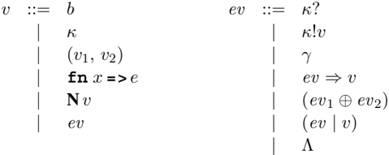

|

Variables are not included in the set of values, because our dynamic semantics
is substitution based, instead of environment based. Thus, there are three
syntactic classes of terms in MiniCML:

ev

```
e   EAX            expressions
    v   VAL < EXP            values
    ev   EVENT < VAL   event values
```

## B.3 Dynamic semantics

Specifying the dynamic semantics requires some additional notation. We use K ⊂
CH to denote fi nite sets of channels, and C ∈ COND fi n -→ { true, false} to
denote the state of a collection of conditions. Each MiniCML process has a
unique process identi fi er π ∈ PROCID. We use P ∈ PROCID fi n -→ EXP to denote
the state of a set of processes. With this notation, the state of a MiniCML
computation is de fi ned as a con fi guration C, K, P, where C is the condition
state, K is the set of allocated channel names, and P is the process state. We
say that a con fi guration C, K, P is well formed, if for any γ in the terms of
P we have γ ∈ C, and if for any κ in the terms of P we have κ ∈ K.

The dynamic semantic of MiniCML is organized around four reduction relations.
Concurrent evaluation de fi nes how con fi gurations evolve:

<!-- formula-not-decoded -->

The rendezvous projection relation describes how a collection of processes can
execute a rendezvous:

<!-- formula-not-decoded -->

where A is the set of negative acknowledgement conditions (NACK conditions) of
the rendezvous. The primitive notions of synchronization and communication are
captured by a family of event-matching relations

<!-- formula-not-decoded -->

where A ⊂ COND is the set of NACK conditions of the match. A sequential con fi
guration is a triple C, K, e. The sequential evaluation of individual processes
is de fi ned by the sequential evaluation relation on sequential con fi
gurations

<!-- formula-not-decoded -->

Each of these is de fi ned in detail in the sequel. While it would be possible
to collapse these into two relations (concurrent evaluation and event matching),
we prefer this organization because it separates the concept of concurrent
evaluation from sequential evaluation.

Our semantics is given as a transition system, and we use Felleisen's notion of
an evaluation context to de fi ne the concurrent and sequential evaluation
relations. An evaluation context is a single-hole context where the hole marks
the next redex (or is at the top if the term is irreducible). The evaluation of
MiniCML is call-by-value and left-to-right, which leads to the following grammar
for the evaluation contexts:

<!-- formula-not-decoded -->

u1,ek)k (41,..,k)/4

с,л,е»,л, е п # аот(")

PIn.

П * dom(P) T ÷ dom(P) * #T

n,l \_ ||n.

\ E 11\/A

The last of these deserves some comment. As shown below, it is necessary to
evaluate on the left-hand side of an abort expression to properly describe the
semantics of negative acknowledgements ( withNack).

## B.3.1 Concurrent evaluation

The concurrent evaluation relation is de fi ned by three simple rules. The fi
rst describes a single sequential step by one of the processes in the con fi
guration

<!-- formula-not-decoded -->

The second rule describes the spawning of a new process:

/negationslash

<!-- formula-not-decoded -->

The third rule describes communication and synchronization:

<!-- formula-not-decoded -->

As will be seen in the rules below, the set A is the set of NACK conditions of
the events not selected in this synchronization. The condition state is updated
to enable these NACK conditions.

## B.3.2 Rendezvous projection

The rendezvous projection is used to choose a possible rendezvous from a set of
wellformed processes. We de fi ne

<!-- formula-not-decoded -->

to mean that there is a rendezvous enabled in P involving P ′ ⊆ P, where the
rendezvous maps the processes in P ′ to P ′′. We require that dom( P ′) = dom( P
′′). The following rule allows the addition of processes that are not involved
in the rendezvous:

<!-- formula-not-decoded -->

The basic notion of a set of k processes performing a rendezvous is de fi ned by
the following rule:

<!-- formula-not-decoded -->

6 01 002. k 0192

((Y) = true

"(ev1,..., evk) ~k (e1,..., ek)/A

((v1...,evk) ~ (e1,..., ek)/A

C (eu1..., evk) ~ (e1,..., ek)/ A

C(eu1...,evk) ~ (e1,..., ek)/A

(Llon.

0///

en, lasy loa en la los

e la (o.

## B.3.3 Event matching

The actual rules used to specify the event matching depend on the rendezvous
primitives provided by the language. Intuitively, the judgement

<!-- formula-not-decoded -->

means that the event values ev i match yielding the corresponding results e i
with the additional result of a set of NACK conditions A. For CML, which
provides two-way rendezvous, we get the following rule:

<!-- formula-not-decoded -->

One-way synchronization on conditions (which includes alwaysEvt) is de fi ned by

<!-- formula-not-decoded -->

The semantics of the event combinators are de fi ned by the following rules (for
k -way matching):

<!-- formula-not-decoded -->

<!-- formula-not-decoded -->

where the NACK conditions of an event are de fi ned as

<!-- formula-not-decoded -->

Note that abort events are introduced by the choice combinator - if the match
involves one branch, the abort conditions of the other branch are enabled.

o,l/A

ę \

## B.3.4 Sequential evaluation

The sequential evaluation relation is de fi ned by six rules, which are given in
terms of evaluation contexts. The fi rst three of these are the standard rules
for call-by-value λ -calculus evaluation:

<!-- formula-not-decoded -->

We have special evaluation rules for alwaysEvt and channel creation:

<!-- formula-not-decoded -->

where ( γ /negationslash∈ dom( C)) and ( κ /negationslash∈ K). The last rule
describes the effect of applying sync to a guarded event function:

<!-- formula-not-decoded -->

The meaning of function constants is given by the partial function

δ

<!-- formula-not-decoded -->

Since a value can have free condition and channel names, we require that the
application of δ not introduce any new condition or channel names (this
requirement is necessary to preserve well-formed con fi gurations under
sequential evaluation). For the standard built-in function constants, the
meaning of δ is the expected one; for example,

<!-- formula-not-decoded -->

There is a technical issue with respect to type soundness and the de fi nition
of δ. In the static semantics described below, we place the restriction that δ (
f, v) should be de fi ned for any well-typed application of f to v. If we
extended MiniCML with an exception mechanism, then this restriction is not
required ( e.g., division by zero raises an exception).

The δ function also de fi nes the translation from the surface syntax of MiniCML
events to the internal representation. For the base-event constructors, the
rules for this are as follows:

<!-- formula-not-decoded -->

Recall that guard and withNack delay the evaluation of their argument to
synchronization time, and that the nack event passed to the argument of withNack
is unique to the synchronization. These functions introduce guarded event
functions

<!-- formula-not-decoded -->

where a is a fresh variable. In the case of guard, the abort event (bound to a)
is ignored by the guarded function, while in the case of withNack, the abort
event is passed to the guarded function and also used in the abort wrapper. Note
that the application of v to a requires evaluation on the left-hand side of the
abort wrapper.

Preserving the delay semantics of guarded functions creates some complications
in the de fi nition of the wrap and choose functions. For wrap we have the
following rules:

<!-- formula-not-decoded -->

where we assume a is a fresh variable.

The situation is even more complicated in the case of the choose function, since
guarded functions can appear in either (or both) branches, and we may have both
a regular guard and nack guard in the same choice:

<!-- formula-not-decoded -->

where we assume a , a 1 , and a 2 are fresh variables.

## B.4 Execution traces

Unlike in the sequential semantics of SML, a CML program can have many (often
infi nitely many) different evaluations. Furthermore, there are many interesting
programs that do not terminate. Thus some new terminology and notation for
describing evaluation sequences is required. This is used to describe some
reasonable fairness constraints on implementations and to state type soundness
results for MiniCML.

De fi nition B.1 A trace T is a (possibly in fi nite) sequence of well-formed
con fi gurations

<!-- formula-not-decoded -->

such that C i, K i, P i ⇒ C i +1, K i +1, P i +1 (for i &lt; n, if T is fi nite
with length n). The head of T is C 0, K 0, P 0.

Note that if a con fi guration C 0, K 0, P 0 is well-formed, then any sequence
of evaluation steps starting with C 0, K 0, P 0 is a trace.

The possible states of a process with respect to a con fi guration are given by
the following de fi nition.

De fi nition B.2 Let C, K, P be a well-formed con fi guration and let 〈 π, e 〉
∈ P. The state of π in P is either zombie, blocked, stuck, or ready, depending
on the form of e:

*   if e = [ v ] , then π is a zombie ,
*   if e = E [ sync ev ] and there does not exist a set of processes

<!-- formula-not-decoded -->

such that C /turnstileleft ( ev, ev 1,..., ev k) ❀ k +1 ( e ′, e 1,..., e k) /
A, then π is blocked.

*   if there is no sequential con fi guration C, K, e ′, such that C, K, e ↪ →C,
  K, e ′, then π is stuck.
*   otherwise, π is ready .

We de fi ne the set of ready processes in C , K , P by

<!-- formula-not-decoded -->

A con fi guration C, K, P is terminal if Rdy( P) = ∅. A terminal con fi guration
with blocked processes is said to be deadlocked.

De fi nition B.3 Atrace is a computation if it is maximal; i.e., if it is in fi
nite or if it is fi nite and ends in a terminal con fi guration. If e is a
program, then we de fi ne the computations of e to be

<!-- formula-not-decoded -->

We follow the convention of using π 0 as the process identi fi er of the initial
process in a computation of a program.

De fi nition B.4 The set of processes of a trace T is de fi ned as

<!-- formula-not-decoded -->

Since a given program can evaluate in different ways, the sequential notions of
convergence and divergence are inadequate. Instead, we de fi ne convergence and
divergence relative to a particular computation of a program.

De fi nition B.5 A process π ∈ Procs( T) converges to a value v in T, written π
⇓ T v, if C, K, P ∪ {〈 π, v 〉} ∈ T. We say that π diverges in T, written π ⇑
T, if for every C, K, P ∈ T, with π ∈ dom( P), π is ready or blocked in P.

Divergence includes deadlocked processes and terminating processes that are not
evaluated often enough to reach termination, as well as those with in fi nite
loops. It does not include stuck processes.

## B.4.1 Fairness

The semantics presented above admits unfair traces, and thus is not adequate as
a speci fi cation of CML implementations. It is necessary to distinguish the
acceptable traces. Informally, we require that ready processes make progress and
that synchronization on a given channel or condition not be starved.

A couple of de fi nitions are required before formalizing the notions of
fairness. We have already de fi ned the notion of a process being ready in a con
fi guration; a similar de fi nition is required for channels and conditions.

```
SyncObj(k!v)    =   {k,}
                                SyncObj(k?)    =   {k,}
                                SyncObj(y)    =   {y,}
                                SyncObj(lA)    =   @
                                SyncObj(ev_1 @ ev_2)   =   SyncObj(ev_1) \ SyncObj(ev_2)
                                SyncObj(ev => v)   =   SyncObj(ev)
                                SyncObj(ev | y)    =   SyncObj(ev)

say that a synchronization object 	is used in a synchronization if it is the synchronization
```

De fi nition B.6 The synchronization objects of an event value ev are de fi ned
as

We say that a synchronization object ψ is used in a synchronization if it is the
synchronization object of the chosen base event for some process involved in the
synchronization.

De fi nition B.7 A synchronization object ψ is enabled in a con fi guration C,
K, P if there are k processes 〈 π i, E i [ sync ev i ] 〉 ∈ P for 1 ≤ i ≤ k,
such that ψ ∈ SyncObj( ev 1) and

<!-- formula-not-decoded -->

The acceptable computations of a program are de fi ned in terms of fairness
restrictions.

De fi nition B.8 A computation T is acceptable if it ends in a terminal con fi
guration, or if T satis fi es the following fairness constraints:

*   (1) Any process that is ready in fi nitely often is selected in fi nitely
  often.

*   (2) Any synchronization object that is enabled in fi nitely often is used in
  fi nitely often.

An implementation of CML should prohibit the possibility of unacceptable
computations. In practice this requires that an implementation satisfy some
stronger property on fi nite traces.

## B.5 Static semantics

It is well known that references ( i.e., updatable memory cells) can cause type
soundness problems for polymorphic languages like SML. Furthermore, it is known
that references can be coded using channels and processes, so the question of
type soundness of a polymorphic concurrent language like CML deserves
examination. In this section, we present a type system for MiniCML programs, and
state soundness results about the system.

The presentation uses standard notation. Let ι ∈ TYCON = { int, bool,...}
designate the type constants, and α ∈ TYVAR designate type variables. Then, the
set of types, τ ∈ TY, is de fi ned by

<!-- formula-not-decoded -->

and the set of type schemes, σ ∈ TYSCHEME, is de fi ned by

<!-- formula-not-decoded -->

We write ∀ α 1 · · · α n .τ for the type scheme σ = ∀ α 1 · · · ∀ α n .τ. The
type variables α 1,..., α n are said to be bound in σ. A type variable that
occurs in τ and is not bound is said to be free in σ. We write FTV( σ) for the
free type variables of σ. If FTV( τ) = ∅, then τ is said to be a monotype.

Type environments assign type schemes to variables in terms. Since we are
interested in assigning types to intermediate stages of evaluation, channel
names also need to be assigned types. Therefore, a typing environment is a pair
of fi nite maps: a variable typing and a channel typing:

<!-- formula-not-decoded -->

We use FTV(VT) and FTV(CT) to denote the sets of free type variables of variable
and channel typings, and

<!-- formula-not-decoded -->

where TE = (VT, CT). Note that there are no bound type variables in a channel
typing. The following shorthand is useful for type environment modi fi cation:

<!-- formula-not-decoded -->

<!-- formula-not-decoded -->

where x ∈ VAR, κ ∈ CH, and TE = (VT , CT) .

A substitution is a map from type variables to types. A substitution S can be
naturally extended to map types to types as follows:

<!-- formula-not-decoded -->

Application of a substitution to a type scheme respects bound variables and
avoids capture. It is de fi ned as

<!-- formula-not-decoded -->

where α ′ i /negationslash∈ dom( S) ∪ FTV(rng( S)). Application of a
substitution S to a type environment TE is de fi ned as S (TE) = S ◦ TE. A type
τ ′ is an instance of a type scheme σ = ∀ α 1 · · · α n .τ, written σ /follows τ
′, if there exists a fi nite substitution, S, with dom( S) = { α 1,... α n} and
Sτ = τ ′. If σ /follows τ ′, then we say that σ is a generalization of τ ′.

Lastly, the closure of a type τ with respect to a type environment TE is de fi
ned as CLOSTE ( τ) = ∀ α 1 · · · α n .τ, where

<!-- formula-not-decoded -->

## B.5.1 Expression typing rules

To associate types with the constants, we assume the existence of a function

<!-- formula-not-decoded -->

For the concurrency related constants, it assigns the following type schemes:

```
For the concurrency related constants, it assigns the following type schemes:
					channel       :  \va.(unit -> ax chan)
					neverEvt    :  \va.(unit -> ax event)
					alwaysEvt   :  \va.(ax -> a event)
					recvEvt     :  \va.(ax chan -> a event)
					sendEvt     :  \va.((ax chan \x a) -> unit event)
					wrap          :  \va.1\xa2.((ax event \x (ax1 -> a\x2)) -> \x2 event)
					choose        :  \va.((ax event \x a event) -> a event)
					guard        :  \va.((unit -> a event) -> a event)
					withNack    :  \va.((unit event -> a event) -> a event)

We also assume that there are no event-valued constants. More formally, we require that
there does not exist any such that TypeOf(h) = \tau event  for some type \tau

```

We also assume that there are no event-valued constants. More formally, we
require that there does not exist any b such that TypeOf( b) = τ event, for some
type τ.

The typing rules for MiniCML are divided into two groups. The rules for the
surface language are given in Figure B.1. There are two rules for let: the rule
( τ -let-val) applies in the non-expansive case (in the syntax of MiniCML, this
is when the bound expression is in VAL); the rule ( τ -let) applies when the
expression is expansive (not a value). There are also rules for typing channel
names, and pair expressions. In addition to these core typing rules, there are
rules for the other syntactic forms (see Figure B.2). Given the appropriate
environment, these rules can be derived from rule ( τ -app) (rule ( τ -const) in
the case of Λ). It is useful, however, to include them explicitly. As before, it
is worth noting that the syntactic form of a term uniquely determines which
typing rule applies.

In order that the typing of constants be sensible, we impose a typability
restriction on the de fi nitions of δ and TypeOf. If TypeOf( b) /follows ( τ ′ →
τ) and TE /turnstileleft v: τ ′, then δ ( b, v) is de fi ned and TE
/turnstileleft δ ( b, v): τ. It is worth noting that the δ rules we de fi ned
for the concurrency constants respect this restriction.

## B.5.2 Process typings

A process typing is a fi nite map from process identi fi ers to types:

<!-- formula-not-decoded -->

Typing judgements are extended to process con fi gurations by the following de
fi nition.

De fi nition B.9 Awell-formed con fi guration C, K, P has type PT under a
channel typing CT, written

<!-- formula-not-decoded -->

if the following hold:

× 18 e

IypeUI (0) &gt; T

1 &lt; (х) ТЛ (ТЛ)шор э х

1Bre1:T1

1Erez:Tz

1ưn ^

TEFe: revent

The anawne •uni+

Th let x=vine -

<!-- formula-not-decoded -->

<!-- formula-not-decoded -->

<!-- formula-not-decoded -->

<!-- formula-not-decoded -->

<!-- formula-not-decoded -->

<!-- formula-not-decoded -->

<!-- formula-not-decoded -->

<!-- formula-not-decoded -->

<!-- formula-not-decoded -->

<!-- formula-not-decoded -->

<!-- formula-not-decoded -->

*   K ⊆ dom(CT) ,
*   dom( P ) ⊆ dom(PT) , and
*   for every 〈 π, e 〉 ∈ P , ( {} , CT) /turnstileleft e : PT( π ) .

For CML, where spawn requires a ( unit → unit) argument, the process typing is
PT( π) = unit for all π ∈ dom( P).

TEL (00).-

TEL aunae. t

TF- b • -

VI(K) =T

TE-K : T chan

TE-k: t chan

TE-v:T

IEreu:tevent IEFe:(T→T)

TEFe: T event

1EF evi: Tevent IEF ev2: t event

TE-e:tevent

Va.a event &gt; T

TEL Ne. revent

TEL r? : Tevent.

TEL A •-

TEL y •unit

Figure B.2: Other type inference rules for MiniCML

| CT( κ ) = τ (VT , CT) /turnstileleft κ : τ                                                                    | ( τ -chvar )     |
|---------------------------------------------------------------------------------------------------------------|------------------|
| TE /turnstileleft κ : τ chan TE /turnstileleft κ ? : τ event                                                  | ( τ -input )     |
| TE /turnstileleft κ : τ chan TE /turnstileleft v : τ TE /turnstileleft κ ! v : unit event                     | ( τ -output )    |
| TE /turnstileleft ev : τ ′ event TE /turnstileleft e : ( τ ′ → τ ) TE /turnstileleft ev ⇒ e : τ event         | ( τ -wrap )      |
| TE /turnstileleft e : τ event TE /turnstileleft N e : τ event                                                 | ( τ -nack )      |
| TE /turnstileleft ev 1 : τ event TE /turnstileleft ev 2 : τ event TE /turnstileleft ( ev 1 ⊕ ev 2 ) : τ event | ( τ -choice )    |
| TE /turnstileleft e : τ event TE /turnstileleft e &#124; γ : τ event                                          | ( τ -abort )     |
| ∀ α.α event /follows τ TE /turnstileleft Λ : τ                                                                | ( τ -never )     |
| TE /turnstileleft γ : unit                                                                                    | ( τ -condition ) |

## B.5.3 Type soundness

This section presents a statement of the soundness of the above type system with
respect to the dynamic semantics of Section B.3. To prove these results, we fi
rst show that evaluation preserves types (also called subject reduction), then
we characterize run-time type errors (called ' stuck states ') and show that
stuck states are untypable. This allows us to conclude that well-typed programs
cannot go wrong.

The fi rst step in this process is to show that the sequential evaluation
relation preserves the types of expressions.

Theorem B.1 (Sequential type preservation) For any type environment TE,
expression e 1 and type τ, such that TE /turnstileleft e 1: τ, if e 1 ↪ → e 2
then TE /turnstileleft e 2: τ.

This result is then extended to concurrent evaluation and process typings.

Theorem B.2 (Concurrent type preservation) If a con fi guration C, K, P is
well-formed with

<!-- formula-not-decoded -->

and, for some channel typing CT, then there is a channel typing CT ′ and a
process typing PT ′, such that the following hold:

*   CT ⊆ CT ′ ,
*   PT ⊆ PT ′ , and
*   CT ′ /turnstileleft C ′ , K ′ , P ′ : PT ′ .
*   CT ′ /turnstileleft C , K , P : PT ′ .

With these results, it is fairly easy to show soundness results:

Theorem B.3 (Syntactic soundness) Let e be a program, with /turnstileleft e: τ.
Then, for any T ∈ Comp( e), π ∈ Procs( T), with C i, K i, P i the fi rst
occurrence of π in T, there exists a CT and PT, such that CT /turnstileleft C i,
K i, P i: PT, and either

*   π ⇑ T or
*   π ⇓ T v and there exists an extension CT ′ of CT with ( {}, CT ′)
  /turnstileleft v: PT( π).

To state more traditional soundness results, we need to de fi ne a notion of
evaluation that distinguishes those processes that have run-time type errors.

De fi nition B.10 For a computation T, we de fi ne the evaluation of a process π
in T by the following partial function:

<!-- formula-not-decoded -->

Theorem B.4 (Soundness) If e is a program with /turnstileleft e: τ, then for any
computation T ∈ Comp( e) and any process ID π ∈ Procs( T), the following hold:

(Strong soundness) If eval T ( π) = v, and C i, K i, P i is the fi rst
occurrence of π in T, then for any CT and PT, such that CT /turnstileleft C i, K
i, P i: PT and PT( π 0) = τ, there is an extension CT ′ of CT, such that ( {},
CT ′) /turnstileleft v: PT( π).

(Weak soundness) eval T ( π ) = WRONG

/negationslash

<!-- formula-not-decoded -->

## Notes

The semantics presented here serves two purposes: most important, it provides a
reference to guide the implementation of CML, and it provides a base to prove
the type soundness of the primitives. 3 There are other semantics treatments of
CML (or at least subsets of CML). Mosses and Musicante have de fi ned an action
semantics for CML [MM94], and Ferreira, Hennessy and Jeffrey have explored the
semantics of CML from a traditional process cacluli point of view [FHJ96]. This
latter work is probably the right basis for developing tools for reasoning about
CML programs.

This appendix is a revised version of the semantics for λ cv that is presented
in the author's Ph.D. dissertation [Rep92]. The language λ cv is similar in
scope to MiniCML, except that it re fl ects the design of CML circa 1991. The
most signi fi cant difference is that λ cv uses imperative types to avoid
problems with polymorphic typing of channels. The other main difference is that
the wrapAbort combinator of λ cv was replaced by withNack in MiniCML. The
theorems of Section B.5.3 are proved using the 'syntactic' approach of Wright
and Felleisen [WF91]; the author's dissertation includes the proofs for the λ cv
version of the semantics [Rep92]. There is also a discussion of extending λ cv
with various features, such as references, exceptions, and the joinEvt event
constructor (which was called threadWait).

Kwiatkowska has written a nice survey of fairness issues [Kwi89]. In her
taxonomy, the fi rst restriction of De fi nition B.8 is strong process fairness
and the second is strong event fairness.

3 With the adoption of the value restriction in SML '97, the type soundness of
CML is less in question.

## Bibliography

*   [ASS85] Abelson, H., G. Sussman, and J. Sussman. Structure and Interpretation
  of Computer Programs. The MIT Press, Cambridge, MA, 1985.
*   [AB86] Abramsky, S. and R. Bornat. Pascal-m: A language for loosely coupled
  distributed systems. In Y. Paker and J.-P. Verjus (eds.), Distributed
  Computing Systems, pp. 163-189. Academic Press, New York, NY, 1986.
*   [Agh86] Agha, G. Actors: A Model of Concurrent Computation in Distributed
  Systems. The MIT Press, Cambridge, MA, 1986.
*   [And91] Andrews, G. R. Concurrent Programming: Principles and Practice.
  Benjamin/Cummings, Redwood City, CA, 1991.
*   [AO93] Andrews, G. R. and R. A. Olsson. The SR Programming Language:
  Concurrency in Practice. Benjamin/Cummings, Redwood City, CA, 1993.
*   [AOCE88] Andrews, G. R., R. A. Olsson, M. Cof fi n, and I. Elshoff. An
  overview of the SR language and implementation. ACM Transactions on
  Programming Languages and Systems, 10 (7), January 1988, pp. 51-86.
*   [AS83] Andrews., G. R. and F. B. Schneider. Concepts and notations for
  concurrent programming. ACM Computing Surveys, 15 (1), March 1983, pp. 3-43.
*   [AJ89] Appel, A. W. and T. Jim. Continuation-passing, closure-passing style.
  In Conference Record of the 16th Annual ACM Symposium on Principles of
  Programming Languages, January 1989, pp. 293-302.
*   [AM87] Appel, A. W. and D. B. MacQueen. A Standard ML compiler. In Functional
  Programming Languages and Computer Architecture, vol. 274 of Lecture Notes in
  Computer Science. Springer-Verlag, New York, NY, September 1987, pp. 301-324.
*   [AM91] Appel, A. W. and D. B. MacQueen. Standard ML of New Jersey. In
  Programming Language Implementation and Logic Programming, vol. 528 of Lecture
  Notes in Computer Science. Springer-Verlag, New York, NY, August 1991, pp.
  1-26.
*   [App92] Appel, A. W. Compiling with Continuations. Cambridge University Press,
  Cambridge, England, 1992.
*   [AVWW96] Armstrong, J., R. Virding, C. Wikstr¨ om, and M. Williams. Concurrent
  Programming in ERLANG. Prentice Hall, Englewood Cliffs, NJ, 2nd edition, 1996.
*   [AG98] Arnold, K. and J. Gosling. The Java Programming Language.
  Addison-Wesley, Reading, MA, 2nd edition, 1998.
*   [ANP89] Arvind, R. S. Nikhil, and K. K. Pingali. I-structures: Data structures
  for parallel computing. ACMTransactions on Programming Languages and Systems,
  11 (4), October 1989, pp. 598-632.
*   [Bag89] Bagrodia, R. Synchronization of asynchronous processes in CSP. ACM
  Transactions on

*   Programming Languages and Systems , 11 (4), October 1989, pp. 585-597.
*   [BST89] Bal, H. E., J. G. Steiner, and A. S. Tanenbaum. Programming languages
  for distributed computing systems. ACM Computing Surveys, 21 (3), September
  1989, pp. 261-322.
*   [BNA91] Barth, P., R. S. Nikhil, and Arvind. M-structures: Extending a
  parallel, non-strict, functional language with state. In Functional
  Programming Languages and Computer Architecture, vol. 523 of Lecture Notes in
  Computer Science. Springer-Verlag, New York, NY, August 1991, pp. 538-568.
*   [BMT92] Berry, D., R. Milner, and D. N. Turner. A semantics for ML concurrency
  primitives. In Conference Record of the 19th Annual ACM Symposium on
  Principles of Programming Languages, January 1992, pp. 119-129.
*   [BCJ + 90] Birman, K. P., R. Cooper, T. A. Joseph, K. Marzullo, M. Makpangou,
  K. Kane, F. Schmuck, and M. Wood. The ISIS system manual, version 2.0.
  Department of Computer Science, Cornell University, Ithaca, NY, March 1990.
*   [BJ87] Birman, K. P. and T. A. Joseph. Reliable communication in the presence
  of failures. ACM Transactions on Computer Systems, 5 (1), February 1987, pp.
  47-76.
*   [Bv93] Birman, K. P. and R. van Renesse (eds.). Reliable Distributed Computing
  with the Isis Toolkit. IEEE Computer Society Press, Los Alamitos, CA, 1993.
*   [Bir91] Birrell, A. D. An introduction to programming with threads. In G.
  Nelson (ed.), Systems Programming with Modula-3, chapter 4, pp. 88-118.
  Prentice Hall, Englewood Cliffs, NJ, 1991. Also available as DEC SRC Research
  Report 35.
*   [BCGL87] Bjornson, R., N. Carriero, D. Gelernter, and J. Leichter. Linda, the
  portable parallel. Technical Report YALEU/DCS/TR-520, Department of Computer
  Science, Yale University, New Haven, CT, February 1987.
*   [Bor86] Bornat, R. A protocol for generalized occam. Software - Practice and
  Experience, 16 (9), September 1986, pp. 783-799.
*   [BLL92] Bricker, A., M. Litzkow, and M. Livny. Condor technical report.
  Technical Report CSTR-92-1069, Computer Sciences Department, University of
  Wisconsin at Madison, Madison, WI, January 1992.
*   [Bri77] Brinch Hansen, P. The Architecture of Concurrent Programs. Prentice
  Hall, Englewood Cliffs, NJ, 1977.
*   [Bri89] Brinch Hansen, P. The Joyce language report. Software - Practice and
  Experience, 19 (6), June 1989, pp. 553-578.
*   [BD80] Bryant, R. and J. B. Dennis. Concurrent programming. In Operating
  Systems Engineering; Proceedings of the 14th IBM Computer Science Symposium,
  vol. 143 of Lecture Notes in Computer Science. Springer-Verlag, New York, NY,
  October 1980, pp. 426-451.
*   [BS83] Buckley, G. N. and A. Silberschatz. An effective implementation for the
  generalized inputoutput construct of CSP. ACM Transactions on Programming
  Languages and Systems, 5 (2), April 1983, pp. 223-235.
*   [Bur88] Burns, A. Programming in occam 2 . Addison-Wesley, Reading, MA, 1988.
*   [CP85] Cardelli, L. and R. Pike. Squeak: A language for communicating with
  mice. In SIGGRAPH '85, July 1985, pp. 199-204.
*   [Car84] Cardelli, L. An implementation model of rendezvous communication. In
  Seminar on Concurrency, vol. 197 of Lecture Notes in Computer Science.
  Springer-Verlag, New York, NY, July 1984, pp. 449-457.
*   [Car86] Cardelli, L. Amber. In Combinators and Functional Programming
  Languages, vol. 242 of Lecture Notes in Computer Science. Springer-Verlag, New
  York, NY, July 1986, pp. 21-47.
*   [CG89a] Carriero, N. and D. Gelernter. How to write parallel programs: A guide
  to the perplexed. ACM Computing Surveys, 21 (3), September 1989, pp. 323-357.
*   [CG89b] Carriero, N. and D. Gelernter. Linda in context. Communications of the
  ACM, 32 (4), April 1989, pp. 444-458.

*   [CG90] Carriero, N. and D. Gelernter. How to Write Parallel Programs: A First
  Course. The MIT Press, Cambridge, MA, 1990.
*   [CL98] Chan, P. and R. Lee. The Java Class Libraries, vol. 2. Addison-Wesley,
  Reading, MA, 2nd edition, 1998.
*   [CM88] Chandy, K. M. and J. Misra. Parallel Program Design: A Foundation.
  Addison-Wesley, Reading, MA, 1988.
*   [Cha87] Charlesworth, A. The multiway rendezvous. ACM Transactions on
  Programming Languages and Systems, 9 (2), July 1987, pp. 350-366.
*   [CD88] Cooper, E. C. and R. P. Draves. C threads. Technical Report
  CMU-CS-88-54, School of Computer Science, Carnegie Mellon University, February
  1988.
*   [CHL91] Cooper, E. C., R. Harper, and P. Lee. The Fox project: Advanced
  development of system software. Technical Report CMU-CS-91-178, School of
  Computer Science, Carnegie Mellon University, August 1991.
*   [CM90] Cooper, E. C. and J. G. Morrisett. Adding threads to Standard ML.
  Technical Report CMU-CS-90-186, School of Computer Science, Carnegie Mellon
  University, December 1990.
*   [CK92] Cooper, R. and C. D. Krumvieda. Distributed programming with
  asynchronous ordered channels in Distributed ML. In Proceedings of the 1992
  ACM SIGPLAN Workshop on ML and its Applications, June 1992, pp. 134-148.
*   [ ˇ Cub94a] ˇ Cubri´ c, M. The Bevaviour of Data fl ow Networks with Finite
  Buffers. Ph.D. dissertation, Department of Computer Science, Concordia
  University, Montr´ eal, Canada, 1994.
*   [ ˇ Cub94b] ˇ Cubri´ c, M. Data fl ow language embedded in CML. ACAPS
  Technical Memo 83, McGill University, School of Computer Science, Montr´ eal,
  Canada, February 1994.
*   [DoD83] Reference Manual for the Ada Programming Language , January 1983.
*   [DHM91] Duba, B., R. Harper, and D. MacQueen. Type-checking fi rst-class
  continuations. In Conference Record of the 18th Annual ACM Symposium on
  Principles of Programming Languages, January 1991, pp. 163-173.
*   [DH89] Dybvig, R. K. and R. Hieb. Engines from continuations. Computing
  Languages, 14 (2), 1989, pp. 109-123.
*   [EFK89] Evangelist, M., N. Francez, and S. Katz. Multiparty interactions for
  interprocess communication and synchronization. IEEE Transactions on Software
  Engineering, 15 (11), November 1989, pp. 1417-1426.
*   [Fel79] Feldman, S. I. Make - a program for maintaining computer programs.
  Software - Practice and Experience, 9 (4), April 1979, pp. 255-265.
*   [Fel87] Felleisen, M. Re fl ections on Landin's J-operator: A partly
  historical note. Computer Languages, 12 (3/4), 1987, pp. 197-207.
*   [FHJ96] Ferreira, W., M. Hennessy, and A. Jeffrey. A theory of weak
  bisimulation for core CML. In Proceedings of the 1996 ACM SIGPLAN
  International Conference on Functional Programming, May 1996, pp. 201-212.
*   [FO93] Forsling, M. and M. Ohlsson. Robust control logic environment using
  Concurrent ML. Master's dissertation, Royal Institute of Technology,
  Stockholm, Sweden, February 1993.
*   [Fow90] Fowler, G. S. A case for make. Software - Practice and Experience, 20
  (S1), June 1990, pp. 35-46.
*   [Fow93] Fowler, G. S. The shell as a service. In Cincinnati USENIX Conference
  Proceedings. USENIX Association, June 1993, pp. 267-277.
*   [Fra86] Francez, N. Fairness . Springer-Verlag, New York, NY, 1986.
*   [FHT86] Francez, N., B. Hailpern, and G. Taubenfeld. Script: A communication
  abstraction mechanism and its veri fi cation. Science of Computer Programming,
  6, 1986, pp. 35-88.
*   [GHJV95] Gamma, E., R. Helm, R. Johnson, and J. Vlissides. Design Patterns.
  Addison-Wesley, Reading, MA, 1995.
*   [GR91] Gansner, E. R. and J. H. Reppy. eXene. In Proceedings of the 1991 CMU
  Workshop on

*   Standard ML , Carnegie Mellon University, September 1991.
*   [GR92] Gansner, E. R. and J. H. Reppy. A foundation for user interface
  construction. In B. A. Myers (ed.), Languagesfor Developing User Interfaces,
  pp. 239-260. Jones &amp; Bartlett, Boston, MA, 1992.
*   [GR93] Gansner, E. R. and J. H. Reppy. A Multi-threaded Higher-order User
  Interface Toolkit, vol. 1 of Software Trends, pp. 61-80. John Wiley &amp;
  Sons, New York, NY, 1993.
*   [GR04] Gansner, E. R. and J. H. Reppy (eds.). The Standard ML Basis Library.
  Cambridge University Press, Cambridge, England, 2004.
*   [GNN97] Gasser, K. L. S., F. Nielson, and H. R. Nielson. Systematic
  realisation of control fl ow analyses for CML. In Proceedings of the 1997 ACM
  SIGPLAN International Conference on Functional Programming, June 1997, pp.
  38-51.
*   [GM88] Gehani, N. H. and A. D. McGettrick (eds.). Concurrent Programming.
  Addison-Wesley, Reading, MA, 1988.
*   [GR86] Gehani, N. H. and W. D. Roome. Concurrent C. Software - Practice and
  Experience, 16 (9), September 1986, pp. 821-844.
*   [Gel85] Gelernter, D. Generative communication in Linda. ACM Transactions on
  Programming Languages and Systems, 7 (1), January 1985, pp. 80-112.
*   [GB82] Gelernter, D. and A. J. Bernstein. Distributed communication via global
  buffer. In ACM SIGACT-SIGOPS Symposium on Principles of Distributed Computing,
  August 1982, pp. 1018.
*   [GMP89] Giacalone, A., P. Mishra, and S. Prasad. Facile: A symmetric
  integration of concurrent and functional programming. In TAPSOFT'89 (vol. 2),
  vol. 352 of Lecture Notes in Computer Science. Springer-Verlag, New York, NY,
  March 1989, pp. 184-209.
*   [Gor79] Gordon, M. J. C. The Denotational Description of Programming
  Languages. SpringerVerlag, New York, NY, 1979.
*   [Haa90] Haahr, D. Montage: Breaking windows into small pieces. In USENIX
  Summer Conference, June 1990, pp. 289-297.
*   [Hal93] Halbwachs, N. Synchronous Programming of Reactive Systems. Kluwer
  Academic Publishers, Boston, MA, 1993.
*   [HTA + 93] Hall, M., M. Tow fi q, G. Arnold, D. Treadwell, and H. Sanders.
  Windows Sockets: An Open Interface for Network Programming under Microsoft
  Windows (Version 1.1), January 1993.
*   [HM90] Halpern, J. Y. and Y. Moses. Knowledge and common knowledge in a
  distributed environment. Journal of the ACM, 37 (3), July 1990, pp. 549-587.
  An earlier version appeared in the Proceedings of the 3rd ACM Conference on
  Principles of Distributed Computing.
*   [Hal85] Halstead, Jr., R. H. Multilisp: A language for concurrent symbolic
  computation. ACM Transactions on Programming Languages and Systems, 7 (4),
  October 1985, pp. 501-538.
*   [Har86] Harper, R. Introduction to Standard ML. Technical Report
  ECS-LFCS-86-14, Laboratory for Foundations of Computer Science, Department of
  Computer Science, University of Edinburgh, August 1986.
*   [Har93] Harrison, R. Abstract Data Types in Standard ML. John Wiley &amp;
  Sons, New York, NY, 1993.
*   [HJT + 93] Hauser, C., C. Jacobi, M. Theimer, B. Welch, and M. Weiser. Using
  threads in interactive systems: A case study. In Proceedings of the 14th ACM
  Symposium on Operating System Principles, December 1993, pp. 94-105.
*   [HFW84] Haynes, C. T., D. P. Friedman, and M. Wand. Continuations and
  coroutines. In Conference Record of the 1984 ACM Symposium on Lisp and
  Functional Programming, July 1984, pp. 293-298.
*   [Hen88] Hennessy, M. Algebraic Theory of Processes. The MIT Press, Cambridge,
  MA, 1988.
*   [Hoa74] Hoare, C. A. R. Monitors: An operating system concept. Communications
  of the ACM,

*   17 (10), October 1974, pp. 549-557.
*   [Hoa78] Hoare, C. A. R. Communicating sequential processes. Communications of
  the ACM, 21 (8), August 1978, pp. 666-677.
*   [Hoa85] Hoare, C. A. R. Communicating Sequential Processes. Prentice Hall,
  Englewood Cliffs, NJ, 1985.
*   [Hol83a] Holmstr¨ om, S. PFL: A functional language for parallel programming.
  In Declarative Programming Workshop, April 1983, pp. 114-139.
*   [Hol83b] Holt, R. C. Concurrent Euclid, the UNIX System, and Tunis.
  Addison-Wesley, Reading, MA, 1983.
*   [Hud89] Hudak, P. Conception, evolution, and application of functional
  programming languages. ACM Computing Surveys, 21 (3), September 1989, pp.
  359-411.
*   [HS88] Hudak, P. and R. S. Sundaresh. On the expressiveness of purely
  functional I/O systems. Technical Report YALEU/DCS/RR-665, Department of
  Computer Science, Yale University, New Haven, CT, 1988.
*   [INM84] INMOS Limited. Occam Programming Manual. Prentice Hall, Englewood
  Cliffs, NJ, 1984.
*   [KM77] Kahn, G. and D. B. MacQueen. Coroutines and networks of parallel
  processes. In Information Processing 77, August 1977, pp. 993-998.
*   [Kna92] Knabe, F. A distributed protocol for channel-based communication with
  choice. Technical Report ECRC-92-16, European Computer-industry Research
  Center, October 1992.
*   [KH88] Kranz, D. A. and R. H. Halstead, Jr. Mul-T: A high-performanceparallel
  Lisp. In Proceedings of the SIGPLAN'89 Conference on Programming Language
  Design and Implementation, June 1988, pp. 81-90.
*   [KR95] Krishnamurthy, B. and D. S. Rosenblum. Yeast: A general purpose
  event-action system. IEEE Transactions on Software Engineering, 20 (9),
  October 1995, pp. 845-857.
*   [Kru91] Krumvieda, C. D. DML: Packaging high-level distributed abstractions in
  SML. In Proceedings of the 1991 CMU Workshop on Standard ML, September 1991.
*   [Kru92] Krumvieda, C. D. Expressing fault-tolerant and consistency-preserving
  programs in Distributed ML. In Proceedings of the 1992 ACM SIGPLAN Workshop on
  ML and its Applications, June 1992, pp. 157-162.
*   [Kru93] Krumvieda, C. D. Distributed ML: Abstractions for Ef fi cient and
  Fault-Tolerant Programming. Ph.D. dissertation, Department of Computer
  Science, Cornell University, Ithaca, NY, August 1993. Available as Technical
  Report TR 93-1376.
*   [Kwi89] Kwiatkowska, M. Z. Survey of fairness notions. Information and
  Software Technology, 31 (7), September 1989, pp. 371-386.
*   [LR80] Lampson, B. W. and D. D. Redell. Experience with processes and monitors
  in Mesa. Communications of the ACM, 23 (2), February 1980, pp. 105-116.
*   [Lan65] Landin, P. J. A correspondence between Algol 60 and Church's lambda
  notation: Part I. Communications of the ACM, 8 (2), February 1965, pp. 89-101.
*   [LHG86] Liskov, B., M. Herlihy, and L. Gilbert. Limitations of synchronous
  communication with static process structure in langauges for distributed
  programming. In Conference Record of the 13th Annual ACM Symposium on
  Principles of Programming Languages, January 1986, pp. 150-159.
*   [LS83] Liskov, B. and R. Schei fl er. Guardians and actions: Linguistic
  support for robust, distributed programs. ACM Transactions on Programming
  Languages and Systems, 5 (3), July 1983, pp. 381-404.
*   [MN91] Manasse, M. S. and G. Nelson. Trestle reference manual. Technical
  Report 68, Digital System Research Center, Palo Alto, CA, December 1991.
*   [MP92] Manna, Z. and A. Pnueli. The Temporal Logic of Reactive and Concurrent
  Systems (Speci fi cation), vol. 1. Springer-Verlag, New York, NY, 1992.

*   [McI90] McIlroy, M. D. Squinting at power series. Software - Practice and
  Experience, 20 (7), July 1990, pp. 661-683.
*   [Mil90] Milewski, J. Functional data structures as updatable objects. IEEE
  Transactions on Software Engineering, 16 (12), December 1990, pp. 1427-1432.
*   [MT91] Milner, R. and M. Tofte. Commentary on Standard ML. The MIT Press,
  Cambridge, MA, 1991.
*   [MTH90] Milner, R., M. Tofte, and R. Harper. The De fi nition of Standard ML.
  The MIT Press, Cambridge, MA, 1990.
*   [Mil89] Milner, R. Communication and Concurrency. Prentice Hall, Englewood
  Cliffs, NJ, 1989.
*   [MPW89a] Milner, R., J. Parrow, and D. Walker. A calculus of mobile processes,
  Part I. Technical Report ECS-LFCS-89-85, Laboratory for Foundations of
  Computer Science, Department of Computer Science, University of Edinburgh,
  June 1989.
*   [MPW89b] Milner, R., J. Parrow, and D. Walker. A calculus of mobile processes,
  Part II. Technical Report ECS-LFCS-89-86, Laboratory for Foundations of
  Computer Science, Department of Computer Science, University of Edinburgh,
  June 1989.
*   [MTHM97] Milner, R., M. Tofte, R. Harper, and D. MacQueen. The De fi nition of
  Standard ML Revised 1997. The MIT Press, Cambridge, MA, 1997.
*   [MMS79] Mitchell, J. G., W. Maybury, and R. Sweet. Mesa Language Manual
  (Version 5.0). Xerox PARC, April 1979.
*   [MKH91] Mohr, E., D. A. Kranz, and R. H. Halstead, Jr. Lazy task creation: A
  technique for increasing the granularity of parallel programs. IEEE
  Transactions on Parallel and Distributed Systems, 2 (3), July 1991, pp.
  264-280. A longer version is available as DEC CRL report 90/7, November 1990.
*   [MT93] Morrisett, J. G. and A. Tolmach. Procs and locks: A portable
  multiprocessing platform for Standard ML of New Jersey. In Proceedings of the
  4th ACM SIGPLAN Symposium on Principles &amp; Practice of Parallel
  Programming, April 1993, pp. 198-207. An earlier version is available as CMU
  report CMU-CS-92-155.
*   [MM94] Mosses, P. D. and M. Musicante. An action semantics for ML concurrency
  primitives. In FME'94, October 1994.
*   [Mye86] Myers, B. A. A complete and ef fi cient implementation of covered
  windows. IEEE Computer, 19 (9), September 1986, pp. 57-67.
*   [Nel91] Nelson, G. (ed.). Systems Programming with Modula-3. Prentice Hall,
  Englewood Cliffs, NJ, 1991.
*   [NN93] Nielson, F. and H. R. Nielson. From CML to process algebras. In
  CONCUR'93 - 4th International Conference on Concurrency Theory, vol. 715 of
  Lecture Notes in Computer Science. Springer-Verlag, New York, NY, August 1993,
  pp. 493-508.
*   [NN94] Nielson, H. R. and F. Nielson. Higher-order concurrent programs with fi
  nite communication topology. In Conference Record of the 21st Annual ACM
  Symposium on Principles of Programming Languages, January 1994, pp. 84-97.
*   [Nik91] Nikhil, R. S. ID Language Reference Manual. Laboratory for Computer
  Science, MIT, Cambridge, MA, July 1991.
*   [Oka98] Okasaki, C. Purely Functional Data Structures. Cambridge University
  Press, Cambridge, England, 1998.
*   [OT91] Oram, A. and S. Talbott. Managing Projects with make. O'Reilly &amp;
  Associates, Sebastopol, CA, 2nd edition, 1991.
*   [PR97] Panangaden, P. and J. H. Reppy. The essence of Concurrent ML. In F.
  Nielson (ed.), ML with Concurrency, chapter 1. Springer-Verlag, New York, NY,
  1997.
*   [PT92] Panangaden, P. and K. Taylor. Concurrent common knowledge: De fi ning
  agreement for asynchronous systems. Distributed Computing, 1992, pp. 73-93.
*   [Pau96] Paulson, L. C. MLfor the Working Programmer. Cambridge University
  Press, Cambridge,

England, 2nd edition, 1996.

*   [Pel92] Pellerin, C. The concurrent constraint programming language taskell.
  Master's dissertation, School of Computer Science, McGill University, Montr´
  eal, Qu´ ebec, Canada, January 1992.
*   [PF95] Peyton Jones, S. and S. Finne. Composing Haggis. In Proceedings of the
  Fifth Eurographics Workshop on Programming Paradigms in Graphics, September
  1995.
*   [PGF96] Peyton Jones, S., A. Gordon, and S. Finne. Concurrent haskell. In
  Conference Record of the 23rd Annual ACM Symposium on Principles of
  Programming Languages, January 1996, pp. 295-308.
*   [PT97] Pierce, B. C. and D. N. Turner. Pict: A programming language based on
  the pi-calculus. Technical Report CSCI 476, Computer Science Department,
  Indiana University, Bloomington, IN, 1997.
*   [Pik83] Pike, R. Graphics in overlapping bitmap layers. ACM Transactions on
  Graphics, 2 (2), April 1983, pp. 135-160.
*   [Pik89a] Pike, R. A concurrent window system. Computing Systems, 2 (2), 1989,
  pp. 133-153.
*   [Pik89b] Pike, R. Newsqueak: A language for communicating with mice. Technical
  Report 143, AT&amp;T Bell Laboratories, April 1989.
*   [Pik90] Pike, R. The implementation of Newsqueak. Software - Practice and
  Experience, 20 (7), July 1990, pp. 649-659.
*   [Pik94] Pike, R. Acme: A user interface for programmers. In Proceedings of the
  Winter 1994 USENIX Conference, January 1994, pp. 223-234.
*   [PvE93] Plasmeijer, R. and M. van Eekelen. Functional Programming and Parallel
  Graph Rewriting. Addison-Wesley, Reading, MA, 1993.
*   [Puc98] Pucella, R. Reactive programming in Standard ML. In Proceedings of the
  1998 International Conference on Computer Languages, May 1998, pp. 48-57.
*   [Ram90] Ramsey, N. Concurrent programming in ML. Technical Report
  CS-TR-262-90, Department of Computer Science, Princeton University, April
  1990.
*   [Rea89] Reade, C. Elements of Functional Programming. Addison-Wesley, Reading,
  MA, 1989.
*   [RC86] Rees, J. and W. Clinger (eds.). The revised 3 report on the algorithmic
  language Scheme. SIGPLAN Notices, 21 (12), December 1986, pp. 37-43.
*   [Rep88] Reppy, J. H. Synchronous operations as fi rst-class values. In
  Proceedings of the SIGPLAN'88 Conference on Programming Language Design and
  Implementation, June 1988, pp. 250-259.
*   [Rep89] Reppy, J. H. First-class synchronous operations in Standard ML.
  Technical Report TR 89-1068, Department of Computer Science, Cornell
  University, Ithaca, NY, December 1989.
*   [Rep90] Reppy, J. H. Asynchronous signals in Standard ML. Technical Report TR
  90-1144, Department of Computer Science, Cornell University, Ithaca, NY,
  August 1990.
*   [Rep91a] Reppy, J. H. CML: A higher-order concurrent language. In Proceedings
  of the SIGPLAN'91 Conference on Programming Language Design and
  Implementation, June 1991, pp. 293-305.
*   [Rep91b] Reppy, J. H. An operational semantics of fi rst-class synchronous
  operations. Technical Report TR 91-1232, Department of Computer Science,
  Cornell University, Ithaca, NY, August 1991.
*   [Rep92] Reppy, J. H. Higher-order Concurrency. Ph.D. dissertation, Department
  of Computer Science, Cornell University, Ithaca, NY, January 1992. Available
  as Technical Report TR 921285.
*   [RG86] Reppy, J. H. and E. R. Gansner. A foundation for programming
  environments. In Proceedings of the ACM SIGSOFT/SIGPLAN Software Engineering
  Symposium on Practical Software Development Environments, December 1986, pp.
  218-227.
*   [Rey93] Reynolds, J. C. The discoveries of continuations. Lisp and Symbolic
  Computation, 6 (3/4),

*   November 1993, pp. 233-247.
*   [RLW85] Rovner, P., R. Levin, and J. Wick. On extending Modula-2 for building
  large, integrated systems. Technical Report 3, Digital System Research Center,
  Palo Alto, CA, January 1985.
*   [STW93] Schmidtmann, C., M. Tao, and S. Watt. Design and implementation of a
  multi-threaded Xlib. In Proceedings of the 1993 Winter USENIX Conference,
  January 1993, pp. 193-203.
*   [Sha94] Shao, Z. Compiling Standard ML for Ef fi cient Execution on Modern
  Machines. Ph.D. dissertation, Department of Computer Science, Princeton
  University, Princeton, NJ, November 1994.
*   [SA94] Shao, Z. and A. W. Appel. Space-ef fi cient closure representations. In
  Conference record of the 1994 ACM Conference on Lisp and Functional
  Programming, June 1994, pp. 150-161.
*   [Sha89] Shapiro, E. The family of concurrent logic programming languages. ACM
  Computing Surveys, 21 (3), September 1989, pp. 413-510.
*   [Shi97] Shivers, O. Continuations and threads: Expressing machine concurrency
  directly in advanced languages. In Proceedings of the Second ACM SIGPLAN
  Workshop on Continuations, January 1997.
*   [SC91] Siegel, E. H. and E. C. Cooper. Implementing distributed Linda in
  Standard ML. Technical Report CMU-CS-91-151, School of Computer Science,
  Carnegie Mellon University, October 1991.
*   [Sta92] Stansifer, R. ML Primer . Prentice Hall, Englewood Cliffs, NJ, 1992.
*   [Ste90] Stevens, W. R. UNIX Network Programming. Prentice Hall, Englewood
  Cliffs, NJ, 1990.
*   [TMC + 96] Tarditi, D., G. Morrisett, P. Cheng, C. Stone, R. Harper, and P.
  Lee. TIL: A typedirected optimizing compiler for ML. In Proceedings of the
  SIGPLAN'96 Conference on Programming Language Design and Implementation, May
  1996, pp. 181-192.
*   [Tof89] Tofte, M. Four lectures on standard ml. Technical Report
  ECS-LFCS-89-73, Laboratory for Foundations of Computer Science, Department of
  Computer Science, University of Edinburgh, March 1989.
*   [Ull98] Ullman, J. D. Elements of ML Programming. Prentice Hall, Englewood
  Cliffs, NJ, ML97 edition, 1998.
*   [UNI90] UNIX System Laboratories, Inc., Englewood Cliffs, NJ. UNIX System V
  Release 4 Programmer's Reference Manual, 1990.
*   [Wan80] Wand, M. Continuation-based multiprocessing. In Conference Record of
  the 1980 Lisp Conference, August 1980, pp. 19-28.
*   [WS83] Wegner, P. and S. A. Smolka. Processes, tasks and monitors: A
  comparative study of concurrent programming primitives. IEEE Transactions on
  Software Engineering, 9 (4), July 1983, pp. 446-462.
*   [WF91] Wright, A. and M. Felleisen. A syntactic approach to type soundness.
  Technical Report TR91-160, Department of Computer Science, Rice University,
  April 1991.

## Index

Abelson, H., 82 abort action, 84 acceptable computation, 284 acquireLockEvt
function, 79, 80 action semantics, 291 actor language, 36, 115 Ada, 12, 29, 105,
108, 109, 115, 119 add data fl ow combinator, 49, 51 add function RatNum
structure, 67 TupleStore structure, 208 alwaysEvt event constructor, 85, 254
Amber, 36, 121, 123, 130, 247 Andrews, G., 9, 35, 38 Appel, A., 247 Argus, 9
Armstrong, J., 9 Arvind, 37 asynchronous message passing, 23, 30, 37, 97, 118,
260 implementation of, 231-233 asynchronous RPC, see promise atTimeEvt event
constructor ClockServer structure, 75

CML structure, 88, 89, 256

Bagrodia, R., 247

Bal, H., 35

Barth, P., 37

base-event constructor, 53, 85

Bernstein, A., 37

Berry, D., 61

binary semaphore, 17

bindings type, 208

Birrell, A., 36

bitblt function, 148

bitmap, 148

bitmap type, 148, 150

bitmapClr function, 151

bitmapRect function, 151

Bjornson, R., 220

blocked process state, 283

bmap function, 153

Bornat, R., 247

Bryant, R., 35

Buckley, G., 247

buffered channel, see asynchronous message passing button component, 159

CML Reference Manual, xiii, 10, 39, 40, 75, 106, 114,

Button structure, 159 C-threads, 36 callcc function, 222, 247 cancel function,
208 cancellation message, 190 Cardelli, L., 130, 182, 247 Carriero, N., 38, 220
cell function, 42 CELL signature, 42 Cell structure, 44, 55 cell type, 42
cellToRect function, 179 chan type, 41, 252 channel, see communication channel
channel function CML structure, 42, 254 DirChan structure, 57 channel names, 277
channel typing environment, 285 Charlesworth, A., 115 choose combinator, 54,
123, 129, 253 implementation of, 241, 242, 244 click to type, see input routing
policy client layer, see tuple space client-server paradigm, 28, 43, 63, 72
client-server protocol, 28, 39, 72 client\_req type, 199 clock server, 75
ClockServer structure, 75 closure of a type, 286 clr function, 174 cmdIn
function, 153 cmdOut function, 153 CML Library, 133, 214, 250 249 CML signature,
249, 251 CML structure, 39, 249, 251 CML-Linda library, 184 CML\_OS signature,
249, 264 CML\_TEXT\_IO signature, 250, 268 cntl\_msg type, 154 cobegin
statement, 12 combine function, 68

| commit point, 73, 74, 124                                                   | Dining Philosophers, 186                                     |
|-----------------------------------------------------------------------------|--------------------------------------------------------------|
| committee coordination, 115                                                 | DirChan structure, 67                                        |
| common knowledge, 118, 128, 130                                             | directional channel, 56, 67                                  |
| Communicating Sequential Processes, see CSP                                 | dirty fl ag, 240                                             |
| communication channel, 22, 41                                               | dispatch function, 223                                       |
| communication latency, 119, 183                                             | display function, 152                                        |
| compareTid function, 255                                                    | display system, 146, 147                                     |
| computation, 283                                                            | Distributed ML, see DML                                      |
| concurrency vs. parallelism, ix, 1                                          | distributed programming, 119, 183                            |
| Concurrent C, 84, 105, 109, 115, 119                                        | distributed system, 5, 183                                   |
| concurrent common knowledge, 130                                            | distributed-memory language, see message-passing lan-        |
| concurrent evaluation, 278, 279                                             | guage                                                        |
| Concurrent Haskell, 115, 182                                                | DML, 220                                                     |
| concurrent logic programming, ix                                            | doInputOp function, 218                                      |
| concurrent-read, exclusive-write lock, see CRXW lock                        | doMenu function, 167, 170                                    |
| condition names, 277                                                        | DPY_SYSTEM signature, 148                                    |
| condition state, 278                                                        | DpySystem structure, 148, 156                                |
| condition synchronization, 16, 20                                           | drawGrid function, 179                                       |
| condition variable, 20, 36                                                  | drawLine function, 148                                       |
| implementation of, 225, 227                                                 | drawRect function, 148                                       |
| conditional accept, 84                                                      | drawText function, 148, 149                                  |
| conditional RPC, 109                                                        | Dybvig, K., 247                                              |
| Condor, 142                                                                 |                                                              |
| con fi guration, 278                                                        | enabled communication, 50                                    |
| well-formed, 278                                                            | enabled synchronization object, 284                          |
| conn_ops type, 205                                                          | engines, 247                                                 |
| continuation, x, 221-223, 246, 247                                          | Erlang, 9, 37, 115                                           |
| continuation-passing style, see CPS                                         | evaluation context, 278                                      |
| controller function, 167                                                    | event combinator, 53                                         |
| Cooper, E., 36, 220, 247                                                    | semantics, 280                                               |
| Cooper, R., 220                                                             | event constructor, 85                                        |
| copy data fl ow combinator, 49, 52                                          |                                                              |
|                                                                             | event matching, 280                                          |
| Multicast structure, 270                                                    | event value, representation of, 239                          |
| coroutine, 41                                                               | exception, 94, 226, 262                                      |
| implementation of, 223 function, 46                                         | exceptions and continuations, 223 execution trace, see trace |
| covered window paradigm, 149                                                | eXene, xi, xii, 8, 37, 182                                   |
| CPS, x, 222, 247                                                            | exit function, 40, 252                                       |
| critical region, 13, 225, 226, 244                                          | extended rendezvous, see RPC                                 |
| CRXW lock, 229-231                                                          |                                                              |
| CSP, 36                                                                     | Facile, 248                                                  |
| ˇ Cubri´ c, M., 84                                                          | fairness, 15, 38, 235, 243-244, 284, 291 event, 15, 291      |
| current window, 155                                                         | process, 15, 291 strong, 15, 291                             |
| damage control model, 150 data fl ow network, 39, 45, 63, 133               | weak, 15                                                     |
| data fl ow programming, 84                                                  | Feldman, S., 143                                             |
|                                                                             | Felleisen, M., 291                                           |
| DataRep structure, 194, 197 deadlock, 6, 14, 26, 31, 32, 118, 133, 223, 248 | Ferreira, W., 247, 291                                       |
| deadlocked con fi guration, 283                                             | Fibonacci series, 48                                         |
| delay data fl ow combinator, 49                                             | fileStatus function, 137                                     |
| delete control message, 155, 159, 160, 167, 169, 175,                       | fillRect function, 148                                       |
| 177, 180                                                                    | filter function, 46                                          |
| delete function, 151, 164                                                   | findByEnv function, 164 findByPt function, 164               |
| δ -function, 281-282                                                        | fi rst-class synchronous operations,                         |
| demand-driven computation, 143                                              | 52, 117, 120, 122 implementation of, 236-244                 |
| Dennis, J., 35 dependency graph, 131-134, 137                               | fl ow-control, 24                                            |
| dim value, 173                                                              | focus follows mouse, see input routing policy                |

## Index

| foreachCoord function, 173                            | iGetPoll function, 258                                    |
|-------------------------------------------------------|-----------------------------------------------------------|
| forever function, 49                                  | in_chan type, 56                                          |
| Fowler, G., 142, 143                                  | incremental data structure, 258                           |
| Frame structure, 156                                  | inEvt function, 184, 218                                  |
| frameEnv function, 156                                | init function, 153                                        |
| frameWid value, 157                                   | initNetwork function, 199                                 |
| Francez, N., 38                                       | input event, see input message                            |
| Friedman, D., 247                                     | input function                                            |
| function constant, 276, 281                           | TupleStore structure, 208                                 |
| future, 31, 37, 93-94, 115                            | input message, 151                                        |
| future function, 93                                   | input protocol, see tuple space input routing policy, 153 |
| Gansner, E., xi, 8                                    | click to type, 155                                        |
| Gehani, N., 36, 84                                    | focus follows mouse, 154                                  |
| Gelernter, D., 37, 38, 220                            | input-only selective communication, 28, 31,               |
| generalized selective communication, 28, 31, 37, 236, | input/output, see I/O                                     |
| 248                                                   | input1Evt event constructor                               |
| Geom structure, 146, 156                              | TextIO structure, 268                                     |
| get function, 174                                     | TextIO.StreamIO structure, 266                            |
| Cell structure, 42                                    | inputAllEvt event constructor                             |
| Result structure, 262                                 | TextIO structure, 268                                     |
| getEvt event constructor                              | TextIO.StreamIO structure, 267                            |
| Result structure, 263                                 | inputEvt event constructor                                |
| getMTime function, 137                                | TextIO structure, 268                                     |
| getTid function, 255                                  | TextIO.StreamIO structure, 266                            |
| Gilbert, L., 8                                        | inputLineEvt event constructor                            |
| Haahr, D., 182                                        | inputNEvt event constructor TextIO structure, 268         |
| Haggis, 182                                           | TextIO.StreamIO structure, 266                            |
| Halbwachs, N., 37                                     | insert function, 164                                      |
| Hall, M., 220                                         | IntBinaryMap structure, 81                                |
| Halpern, J., 130                                      | interactive systems, 3                                    |
| Halstead, R., 37, 115                                 | interference, 13, 16, 73                                  |
| handshaking, 24, 27                                   | inverted program structure, 3, 4, 145                     |
| Harkavy, M., 220                                      | iPut function, 258                                        |
| Harper, R., 9                                         | Isis, 9, 220                                              |
| Harrison, R., 9                                       | item_info type, 162 258                                   |
| Hash2TableFn functor, 205                             | iVar function,                                            |
| HashTableFn functor, 136                              | ivar type, 258                                            |
| hashTid function, 255                                 | Java, 36, 182                                             |
| Haynes, C., 247                                       | Jeffrey, A., 247, 291                                     |
| Hennessy, M., 247, 291                                | join protocol, see tuple space                            |
| Herlihy, M., 8                                        | joinEvt event constructor, 255                            |
| Hieb, R., 247                                         | joinTupleSpace function, 185, 192, 216                    |
| higher-order concurrent programming, ix, 8            |                                                           |
| highlight function, 156, 167                          | Joyce, 36                                                 |
| Hoare, C.A.R., 36 Holmstr¨ om, S., 130, 246           | Kahn, G., 82 Kahn-MacQueen network, 82                    |
|                                                       | kbd function, 153                                         |
| I-structure, 32, 37, 93, 114                          | key_press type, 152 keyboard message, 152                 |
| I/O                                                   |                                                           |
| imperative level, 88, 268                             | keyBS value, 152 keyDEL                                   |
| primitive level, 88 266                               | value, 152 keyRET value,                                  |
| stream level, 88, ID, 37, 38, 114                     | 152 keyTAB value, 152                                     |
|                                                       | Knabe, F., 248                                            |
| id type, 207                                          | Kranz, D., 115                                            |
| ID-90, 32                                             | Krishnamurthy, B.,                                        |
| iGet function, 258                                    | 143                                                       |
| iGetEvt event constructor, 258                        | Krumvieda, C., 220                                        |

| Kwiatkowska, M., 38, 291                              | Milner, R., 38, 61                                |
|-------------------------------------------------------|---------------------------------------------------|
|                                                       | Mini-CML, 275                                     |
| λ -calculus, 38                                       | dynamic semantics, 278                            |
| λ cv , 291                                            | event value, 277                                  |
| LargeView structure, 178                              | static semantics, 285                             |
| layers, 149, 150 function, 161                        | syntax, 276 value, 277                            |
| lazy stream, 47                                       | mkBitmap function, 152                            |
| lazy task creation, 115                               | mkBitmap type, 150                                |
| Linda, 33-35, 37, 184, 198,                           | mkButton function, 159                            |
| 220                                                   |                                                   |
| Linda structure, 184, 215                             | mkCondRPC function, 110                           |
| Liskov, B., 8                                         | mkEditor function, 180                            |
| Lisp, 31, 37, 93, 115                                 | mkEnv function, 155                               |
| listAll function, 164                                 | mkFibNetwork function, 50                         |
| livelock, 14                                          | mkFrame function, 156                             |
| liveness property, 15, 38                             | mkLogServer function, 213                         |
| local delay, 5                                        | mkProxyServer function, 207                       |
| lock server, 79, 110                                  | mkRPC function, 106, 272                          |
| lock type, 79                                         | mkRPC_In function, 273                            |
| log server, 193, 212                                  | mkRPC_InOut function, 273 mkRPC_Out function, 273 |
| M-structure, 32, 33, 37, 91, 93, 114                  | mkRPCEvt event constructor, 108                   |
| M-variable, see mvar type, see M-structure            | mkTexture function, 177                           |
| MacQueen, D., 82 mailbox function, 260                | mkTupleServer function, 212 mkUIdSrc function, 73 |
| MAILBOX signature, 249, 260                           | mkView function                                   |
| Mailbox structure, 249, 260 mailbox type, 98          | LargeView structure, 179                          |
|                                                       | SmallView structure, 175 164                      |
| make function, 140                                    | mkWinMap function,                                |
| make program, 143                                     | ML-threads, 36 ML-Yacc, 140, 143                  |
| makeGraph function,                                   | Modula 2+, xi                                     |
| 134 makeLeaf function, 136                            | Mohr, E., 115                                     |
| makeNatStream                                         |                                                   |
| function, 46 makeNode function, 136                   | monitor, 21, 36                                   |
| MakeRPC structure, 106, 108, 110 Manna, Z., 38        | Morrisett, J., 36, 247 Moses, Y., 130             |
| mapMouse function, 164                                | Mosses, P., 291                                   |
| marshalling, 195                                      |                                                   |
| match function, 209 match type, 207                   | mouse function, 153 mouse grab, 154, 155          |
| matching communication, 42                            | mouse message, 151                                |
| mbox type, 260                                        | mouse_msg type, 151                               |
| McGettrick, A., 36                                    | mouse state, 151                                  |
| mchan type, 100, 270                                  | mouseDn function, 151                             |
| McIlroy, D., 9, 82                                    | mousePos function, 151 mouseRouter function,      |
| mChannel function, 99, 270                            | 167                                               |
| menu function, 161                                    | mouseTrans function, 151                          |
| Menu structure, 161                                   | mouseUp function, 151                             |
| merge function, 64, 66                                | move function, 151, 164                           |
| merge sort, 63                                        | mPut function, 91, 259                            |
| mergeSort function, 63,                               | mSwap function, 259                               |
| 65 message decoding, see marshalling                  | mSwapEvt event constructor, 259                   |
| message encoding, see marshalling                     | mTake function, 259                               |
| message-passing language, 12, 22, 39, 85 231          | mTakeEvt event constructor, 91, 259               |
| message passing, implementation of, message type, 198 | mTakePoll function, mul function                  |
| mGet function, 259                                    | RatNum 67                                         |
|                                                       | structure, Mul-T, 37, 115                         |
| mGetEvt event constructor, 259 mGetPoll function, 259 | multicast, 23                                     |
|                                                       | multicast channel, 99,                            |
| Milewski, J., 37                                      | 133, 270                                          |

| multicast function, 99                               | Paulson, L., 9                                   |
|------------------------------------------------------|--------------------------------------------------|
| Multicast structure, 271                             | Pegasus, x, xi, 37, 182                          |
| MULTICAST signature, 100, 250, 270                   | Pegasus ML, see PML                              |
| Multicast structure, 101, 104, 250, 270              | PFL, 130, 247                                    |
| Multilisp, 31, 32, 37, 115                           | philosopher function, 186                        |
| multiway rendezvous, 115                             | π -calculus, 38                                  |
| Musicante, M., 291                                   | Pike, R., 8, 182, 247                            |
| mutex lock, 19, 36                                   | Pingali, K., 37                                  |
| implementation of, 225, 226                          | PML, x, xi, 35, 124, 125, 129, 130, 247          |
| mutual exclusion, 15, 16, 20                         | Pnueli, A., 38                                   |
| mVar function, 91, 258                               | point type, 146                                  |
| mvar type, 91, 258                                   | pollEvt function, 264                            |
| mVarInit function, 258                               | polling, 28, 34, 87                              |
| Myers, B., 182                                       | channel, 254, 255                                |
|                                                      | I-variable, 258                                  |
| NACK condition, 278, 280                             | M-variable, 259                                  |
| negative acknowledgement, 78, 84, 126, 127, 253, 278 | mailbox, 261                                     |
| negative acknowledgement condition, see NACK con-    | popup menu, 161                                  |
| dition                                               | port function, 99, 270                           |
| NetMessage structure, 194, 196, 198                  | port type, 100, 270                              |
| network layer, see tuple space                       | post-synchronization action, see wrap combinator |
| NETWORK signature, 194, 198                          | power series, 67, 84                             |
| Network structure, 194, 198                          | power series multiplication, 67                  |
| network type, 198, 201                               | pre-synchronization action, see guard combinator |
| never value, 85, 253                                 | preemptive scheduling, xi, 8, 41, 244, 252       |
| newRemoteTS function, 217                            | primes function, 47                              |
| newsqueak, 9, 84, 182, 247                           | procedural abstraction, 2, 55, 122               |
| newTexture function, 174 Nielson, F., xi             | process, see thread process abstraction, 1-4     |
| Nielson, H., xi                                      | process algebra, 38                              |
| Nikhil, R., 37                                       | process calculi, 38                              |
| nondeterminism, 11, 50,                              | process history, 14,                             |
| 54                                                   | 23 process network, see data fl ow network       |
| observer pattern, see publish and subscribe          | process typing, 287                              |
| occam, 36, 38                                        | producer/consumer buffer, 16                     |
|                                                      | promise, 29, 86                                  |
| offer communication, 42 Okasaki, C., 9               | promiseEvt function, 86                          |
|                                                      | proxyServer function, 205                        |
| Olsson, R., 9                                        | ps_stream type, 67                               |
| openChanIn function, 269 openChanOut function, 269   | psAdd function, 68                               |
| Oram, A., 143                                        | psCopy function, 71                              |
| origin value, 147                                    | psMulByConst function, 69                        |
| OS signature, 264                                    | psMulByTerm function, 69                         |
| OS structure, 249, 264                               | ptAdd function, 147                              |
| OS.IO structure, 264                                 | ptInRect function, 147                           |
| OS.Process structure, 264                            | ptLess function, 146                             |
| out_chan type, 56                                    | ptSub function, 147                              |
| out function, 184, 218                               | publish and subscribe, 115, 174                  |
| output protocol, see tuple space                     | Pucella, R., xi, 37 Put exception, 91, 257       |
| output server, 188, 214                              | put function                                     |
| OutputServer structure, 193, 204, 214                |                                                  |
| Panangaden, P., 37, 115, 130                         | Cell structure, 42                               |
|                                                      | Result structure, 262                            |
| parallel build system, 131                           |                                                  |
| parallel make, see parallel build system             | putExn function, 262                             |
| parallel programming, 31                             | structure, 223                                   |
| parent function, 165 201                             | Queue                                            |
| parseHost function,                                  | race condition, 6, 21 Ramsey, N., 130, 247       |
| Pascal-m, 36 184                                     | raster_op type,                                  |
| pat_atom type,                                       | 148                                              |

| rational type, 67                                        | sameMailbox function, 260                                              |
|----------------------------------------------------------|------------------------------------------------------------------------|
| RatNum structure, 67                                     | sameMVar function, 259                                                 |
| rdEvt function, 184, 218                                 | sameTid function, 255                                                  |
| reactive language, see synchronous language              | scanAddr function                                                      |
| reactive system, 6                                       | SockUtil structure, 201                                                |
| read-all, write-one, 188                                 | Scheme, 247                                                            |
| read-one, write-all, 188                                 | Schmidtmann, C., 182                                                   |
| Reade, C., 9                                             | Schneider, F., 35                                                      |
| ready process state, 283                                 | select operator, 50, 51, 54, 253                                       |
| ready queue, 223                                         | selective communication, 15, 27, 28, 37, 50, 55, 121,                  |
| realization function, 155                                | 122                                                                    |
| realize function, 155                                    | facets of, 122, 123                                                    |
| rect function, 153                                       | implementation of simple, 233-235                                      |
| rect type, 146                                           | semaphore, 17, 36                                                      |
| rectAdd function, 147                                    | send function, 41                                                      |
| rectHt function, 147                                     | CML structure, 254                                                     |
| rectInset function, 147                                  | DirChan structure, 57                                                  |
| rectMove function, 147                                   | Mailbox structure, 260                                                 |
| rectOrigin function, 146                                 | sendEvt event constructor, 52, 53, 123                                 |
| rectSub function, 147                                    | CML structure, 254                                                     |
| rectWid function, 147                                    | DirChan structure, 57, 58                                              |
| rectWithin function, 147                                 | implementation of, 241, 242                                            |
| recv function, 41, 271                                   | sendMessage function, 198                                              |
| CML structure, 254                                       | sendPoll function                                                      |
| DirChan structure, 57                                    | CML structure, 254                                                     |
| Mailbox structure, 260                                   | sequential con fi guration, 278                                        |
| recvEvt event constructor, 51-53, 123 CML structure, 254 | sequential evaluation relation, 278, 281 server layer, see tuple space |
| DirChan structure, 57, 58                                | server_conn type, 199                                                  |
| implementation of, 241, 242                              | set function, 174                                                      |
| Mailbox structure, 261                                   | shared-memory language, 12, 16                                         |
| Multicast structure, 99, 271                             | Shivers, O., 247                                                       |
| recvMessage function, 198                                | shutdown function, 199                                                 |
| recvPoll function, 87                                    | Siegel, E., 220                                                        |
| CML structure, 255                                       | sieve function, 47                                                     |
| Mailbox structure, 261                                   | Sieve of Eratosthenes, 46                                              |
| releaseLock function, 79, 81                             | signal handling, xi, 90, 244                                           |
| remote delay, 5                                          | Silberschatz, A., 247                                                  |
| remote procedure call, see RPC                           | simple rendezvous, see synchronous message passing                     |
| remove function, 208                                     | SIMPLE_RPC signature, 250, 272 SimpleRPC structure, 106, 250, 272      |
| rendezvous, see synchronous message passing              | sink function, 153                                                     |
| rendezvous projection, 278, 279                          | small texture view, 175                                                |
| reply type, 199                                          | SmallView structure, 175                                               |
| replyIfMatch function, 212                               | SML, 6, 275                                                            |
| resolveAddr function                                     | SMLBasis Library, xi, xii, 9, 87, 88, 249, 250, 264, 266               |
| SockUtil structure, 201                                  | SML'97, xi                                                             |
| result function, 262                                     | SML/NJ, x, xii, 7, 9, 39, 129                                          |
| RESULT signature, 249, 262 262                           | SML/NJ Library, xii, 81, 98, 136, 198, 201, 205, 220,                  |
| Result structure, 249,                                   | 223                                                                    |
| Reynolds, J., 246                                        | SMLofNJ structure, 222                                                 |
| Roome, W., 84                                            | Smolka, S., 35                                                         |
| RPC, 28, 29, 74, 94, 105, 119, 121, 272                  | SockUtil structure,                                                    |
| RPC protocol, 94                                         | 201 spawn function, 40, 252                                            |
| runProcess function, 137                                 | spawnBuffers function, 201                                             |
|                                                          | spawnc function, 252 spawnNetServer                                    |
| safety property, 15, 38                                  | function, 201 spawnServer function, 214                                |
| sameBitmap function, 151, 153 sameChannel function, 254  | split function, 63, 65                                                 |
| sameFrame function, 156, 167                             | squeak, 182 squint, 182                                                |
| sameIVar function, 258                                   |                                                                        |

## Index

| SR, 9, 23, 37, 109, 115                                    | communication, 11, 41                             |
|------------------------------------------------------------|---------------------------------------------------|
| stamp type, 133                                            | creation, 12-13                                   |
| Standard ML, see SML                                       | garbage collection, 78                            |
| Standard MLof NJ, see SML/NJ                               | garbage collection of, 41                         |
| Stansifer, R., 9                                           | spawning, see thread creation, 40                 |
| starvation, 6, 15                                          | synchronization, 11, 13, 16, 41                   |
| state machine, 43                                          | thread ID, see thread_id type                     |
| Steiner, J., 35                                            | thread of control, 11, 12                         |
| Stevens, W., 220                                           | thread_id type, 40, 252                           |
| Stone, C., 220                                             | throw function, 222                               |
| stream, 45, 47, 67, 82, 95                                 | tidToString function, 255                         |
| stream processing, see stream                              | tiled window paradigm, 149                        |
| stream programming, see stream                             | time sharing, 1                                   |
| stringSize function, 149                                   | timeout, 88, 255, 256                             |
| stuck process state, 283                                   | timeOutEvt event constructor, 88, 89,             |
| stuck state, 289, 290                                      | toBack function, 150, 164                         |
| subject reduction, see type preservation                   | toFront function, 150, 164                        |
| substitution, 286                                          | Tofte, M., 9                                      |
| Substring structure, 140                                   | toggle function, 174                              |
| Sussman, G., 82                                            | Tolmach, A., 36, 247                              |
| swap channel, 59                                           | trace, 282, 283                                   |
| swap function, 59                                          | trackMouse function, 167                          |
| swap_chan type, 59                                         | trans_info type, 205                              |
| swapChannel function, 59                                   | Trestle, 182                                      |
| sync operator, 54, 123, 253                                | ts_id type, 199                                   |
| implementation of, 240 SYNC_VAR signature, 249, 257        | tuple, see tuple space tuple hold, 190, 208       |
| synchronization, see thread synchronization, 55            | tuple server, 188                                 |
| synchronization object, 284                                | tuple server IDs, see ts_id type                  |
| point                                                      | tuple server thread, 211                          |
| synchronization point, see commit                          |                                                   |
| synchronous language, 37                                   | client layer, 193                                 |
| synchronous message passing, 23, 25, 31, 37, 41, 44,       | distributed, 188                                  |
| 85, 118, 120                                               | input protocol, 190                               |
| implementation of, 233                                     | join protocol, 190, 192                           |
| synchronous variable, see synchronous shared-memory        | network network, 194                              |
| SyncVar structure, 93, 249, 257                            | output protocol, 190, 192                         |
| systemEvt function, 264                                    | server layer, 193, 204 tuple store, 188           |
| tail recursion, 43, 242-243 243 Talbott, S., 143           | Tuple structure, 194 tuple tag, 184               |
| and callcc ,                                               | tuple-server proxy, 188, 205                      |
| Tanenbaum, A., 35                                          | tuple/template matching, 209                      |
| TCP/IP, 194                                                | tuple_rep type, 184                               |
| template, see tuple space, 34                              | TUPLE_SERVER signature, 193                       |
| template tag, 184                                          | tuple_space type, 215 TUPLE_STORE signature, 193, |
| template/tuple matching, 184                               | 208                                               |
| terminal con fi guration, 283                              | tuple_store type, 207                             |
| text ascent, 149                                           | TupleServer structure, 193, 204                   |
| text baseline, 149                                         | TupleStore structure, 193, 207, 208               |
| TEXT_IO signature, 268                                     | Turner, D., 61                                    |
| TEXT_STREAM_IO signature, 250, 266                         | type constant, 285 type preservation, 289, 290    |
| TextIO structure, 250, 268                                 | type scheme, 285                                  |
| TextIO.StreamIO structure, 268                             | type soundness, 289, 290                          |
| texture editor example, 173 texture state server, 174      | TypeOf function, 287                              |
| texture                                                    | typing environment, 285                           |
| type, 148                                                  |                                                   |
| texture_state type,                                        | UDP, 194                                          |
| 175 TextureState structure, 174 TextureUtil structure, 173 | Ullman, J., 9 unique ID server,                   |
| thread, 12, 40                                             |                                                   |
|                                                            | 73                                                |

UNIX, x, xi, 2, 90, 131, 132, 143, 220 unmarshalling, see marshalling updatable
storage cell, 42, 52, 58, 74, 107, 118 user-interface library, see
user-interface toolkit user-interface toolkit, 3, 146

val\_atom type, 184

value restriction, 291 value-oriented programming, 117 variable typing
environment, 285 viewEvt function, 175 viewRect function

LargeView structure, 178

SmallView structure, 175

Wand, M., 247

Wegner, P., 35

well-formed con fi guration, see con fi guration whichItem function, 161

win\_env type, 153

WIN\_MNGR signature, 164

window border, see window frame

creation protocol, 155, 161

deletion protocol, 155, 159, 161, 172, 180

frame, 156

window environment, 153

window geometry, 146

window manager, 146, 153, 163, 165

window manager menu, 169-173

window map, 164

window system, 146

Windows NT, xi, xiv winManager function, 164, 165

WINMAP signature, 165

WinMap structure, 164

WinMngr structure, 163

withNack combinator, 78, 127, 129, 253

wrap combinator, 51, 52, 54, 58, 123, 129, 252

implementation of, 241, 242, 244

wrapAbort combinator, 84, 127

wrapHandler combinator, 253

Wright, A., 291

WSYS signature, 154

WSys structure, 153, 156

X Window System, 145, 154, 182

Y combinator, 61 Yeast, 143 yield function, 252

zero value RatNum structure, 67 zombie process state, 283