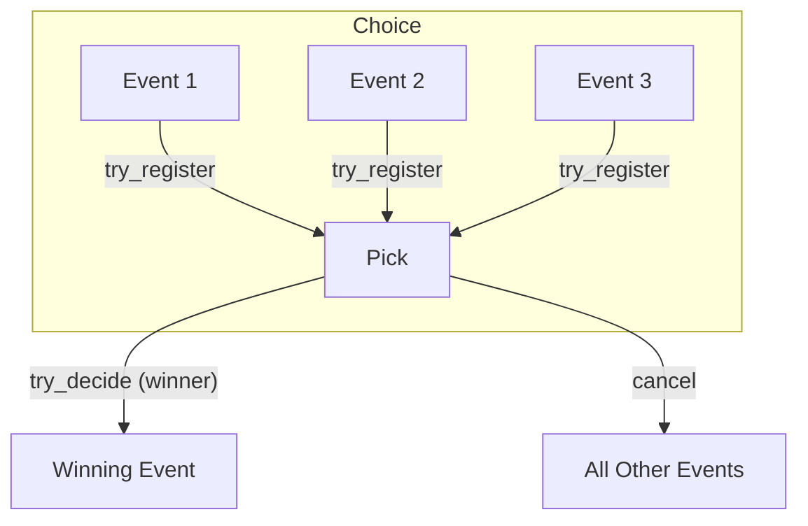
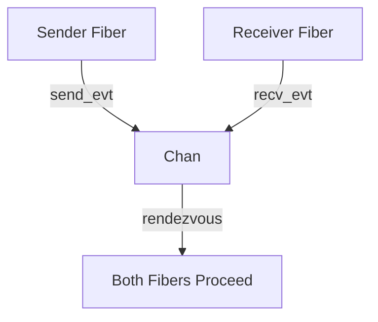

# CML Overview — Event Semantics and Architecture

This document provides a deep dive into the Concurrent ML (CML) runtime implementation in Crystal, explaining the core concepts, event semantics, and architectural decisions.

## Core Concepts

### Events and Synchronization

In CML, an **Event** represents a potential synchronization point that may produce a value when committed. The key insight is that events are **first-class** - they can be composed, transformed, and chosen between.

```crystal
abstract class Event(T)
  abstract def try_register(pick : Pick(T)) : Proc(Nil)
end
```

Every event implements `try_register`, which:
- Attempts to commit the event immediately if possible
- Returns a cancellation procedure if the event is registered
- Never blocks the calling fiber

### Atomic Commit with Pick

The `Pick` class ensures that only one event in a choice succeeds:

```crystal
class Pick(T)
  @winner : T? = nil
  @done = Channel(Nil).new(1)
  @decided = Atomic(Bool).new(false)

  def try_decide(value : T) : Bool
    return false if @decided.get
    if @decided.compare_and_set(false, true)
      @winner = value
      @done.send(nil) rescue nil
      true
    else
      false
    end
  end
end
```

This atomic commit mechanism guarantees the "one pick, one commit" principle - exactly one event in a `choose` will succeed.

## Event Types

### Basic Events

- **`AlwaysEvt(T)`**: Immediately succeeds with a fixed value
- **`NeverEvt(T)`**: Never succeeds (useful for testing)
- **`TimeoutEvt`**: Succeeds after a time duration

### Channel Events

- **`SendEvt(T)`**: Attempts to send a value on a channel
- **`RecvEvt(T)`**: Attempts to receive from a channel

Channels maintain separate queues for senders and receivers, matching them when both are available:

```crystal
def register_send(value : T, pick : Pick(Nil)) : Proc(Nil)
  offer = {value, pick}
  matched = false
  @mtx.synchronize do
    if recv_pick = @recv_q.shift?
      recv_pick.try_decide(value)  # Receiver gets the value
      pick.try_decide(nil)         # Sender gets success
      matched = true
    else
      @send_q << offer
    end
  end
  -> { @mtx.synchronize { @send_q.delete(offer) rescue nil } }
end
```

### Event Combinators

#### `wrap_evt` - Result Transformation
Transforms the result of an event after it succeeds:

```crystal
class WrapEvt(A, B) < Event(B)
  def try_register(pick : Pick(B)) : Proc(Nil)
    inner_pick = Pick(A).new
    cancel_inner = @inner.try_register(inner_pick)
    spawn do
      inner_pick.wait
      if inner_pick.decided?
        pick.try_decide(@f.call(inner_pick.value))
      end
    end
    cancel_inner
  end
end
```

#### `guard_evt` - Lazy Event Construction
Defers event creation until registration time:

```crystal
class GuardEvt(T) < Event(T)
  def try_register(pick : Pick(T)) : Proc(Nil)
    evt = @block.call  # Create the event only when needed
    evt.try_register(pick)
  end
end
```

#### `nack_evt` - Cancellation Cleanup
Executes cleanup code when an event is cancelled:

```crystal
class NackEvt(T) < Event(T)
  def try_register(pick : Pick(T)) : Proc(Nil)
    won = Atomic(Bool).new(false)
    wrapped = WrapEvt(T, T).new(@inner) { |x| won.set(true); x }
    cancel_inner = wrapped.try_register(pick)
    spawn do
      pick.wait
      unless won.get
        @on_cancel.call  # Only called if event didn't win
      end
    end
    -> { cancel_inner.call }
  end
end
```

#### `choose_evt` - Event Racing
Races multiple events, allowing only one to succeed:

```crystal
class ChooseEvt(T) < Event(T)
  def try_register(pick : Pick(T)) : Proc(Nil)
    cancels = @evts.map(&.try_register(pick))
    spawn do
      pick.wait
      cancels.each &.call  # Cancel all losers
    end
    -> { cancels.each &.call }  # Cancel all if outer cancelled
  end
end
```

## Synchronization Protocol

The `sync` function orchestrates the entire event lifecycle:

```crystal
def self.sync(evt : Event(T)) : T forall T
  pick = Pick(T).new
  cancel = evt.try_register(pick)  # Non-blocking registration
  pick.wait                        # Block until decision
  cancel.call                      # Cleanup
  pick.value                       # Return result
end
```

This protocol ensures:
1. **Non-blocking registration**: `try_register` never blocks
2. **Deterministic waiting**: `pick.wait` blocks until decision
3. **Proper cleanup**: `cancel.call` ensures no resource leaks

## Design Principles

### 1. One Pick, One Commit
Every `Pick` instance can be decided at most once, ensuring exactly one event in a choice succeeds.

### 2. Zero Blocking in Registration
`try_register` must never block - all blocking is deferred to `pick.wait`.

### 3. Fiber-Safe Cancellation
Every registered event returns a cancellation procedure that can be safely called from any fiber.

### 4. Deterministic Behavior
The system behaves predictably regardless of fiber scheduling order.

## Memory Safety

- All event types are classes (not structs) to avoid recursion issues
- Cancellation procedures clean up all registered state
- Atomic operations prevent race conditions
- Mutex protection for channel queue operations

## Performance Characteristics

- **Low overhead**: Event creation and registration are lightweight
- **Scalable**: Designed to work efficiently with thousands of fibers
- **GC-friendly**: Minimal allocations in hot paths
- **Lock-free where possible**: Uses atomic operations for pick decisions

This architecture provides a solid foundation for building complex concurrent coordination patterns while maintaining simplicity and correctness.

---

## Diagrams

### Pick Commit Cell (One Commit Invariant)



### choose Flow (Event Racing)

```mermaid
graph TD
  A[choose([evt1, evt2, evt3])]
  A -- try_register --> E1[evt1]
  A -- try_register --> E2[evt2]
  A -- try_register --> E3[evt3]
  E1 -- completes first --> Pick
  E2 -- cancelled --> X2[Cancelled]
  E3 -- cancelled --> X3[Cancelled]
```

### Chan Rendezvous (Send/Recv)

