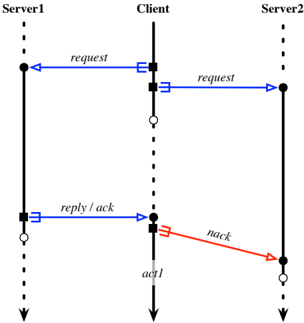
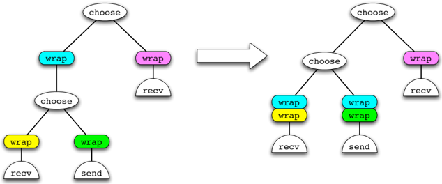
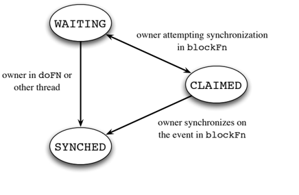
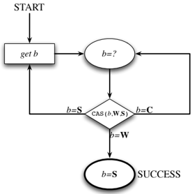
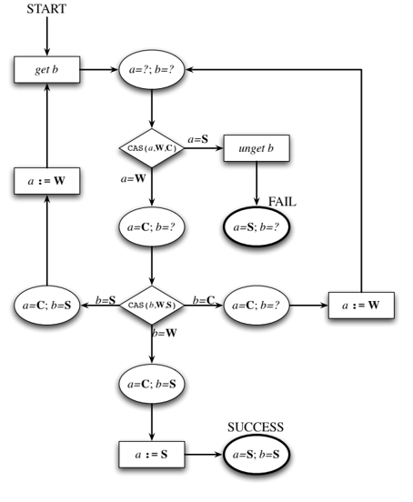

John Reppy

University of Chicago jhr@cs.uchicago.edu

## Abstract

Concurrent ML (CML) is a high-level message-passing language that supports the construction of first-class synchronous abstractions called events. This mechanism has proven quite effective over the years and has been incorporated in a number of other languages. While CML provides a concurrent programming model, its implementation has always been limited to uniprocessors. This limitation is exploited in the implementation of the synchronization protocol that underlies the event mechanism, but with the advent of cheap parallel processing on the desktop (and laptop), it is time for Parallel CML.

Parallel implementations of CML-like primitives for Java and Haskell exist, but build on high-level synchronization constructs that are unlikely to perform well. This paper presents a novel, parallel implementation of CML that exploits a purpose-built optimistic concurrency protocol designed for both correctness and performance on shared-memory multiprocessors. This work extends and completes an earlier protocol that supported just a strict subset of CML with synchronization on input, but not output events. Our main contributions are a model-checked reference implementation of the protocol and two concrete implementations. This paper focuses on Manticore's functional, continuation-based implementation but briefly discusses an independent, thread-based implementation written in C# and running on Microsoft's stock, parallel runtime. Although very different in detail, both derive from the same design. Experimental evaluation of the Manticore implementation reveals good performance, dispite the extra overhead of multiprocessor synchronization.

## Parallel Concurrent ML

Claudio V. Russo

Microsoft Research crusso@microsoft.com

## Yingqi Xiao

University of Chicago xiaoyq@cs.uchicago.edu

ML [MTHM97]. CML extends SML with synchronous message passing over typed channels and a powerful abstraction mechanism, called fi rst-class synchronous operations , for building synchronization and communication abstractions. This mechanism allows programmers to encapsulate complicated communication and synchronization protocols as first-class abstractions, which encourages a modular style of programming where the actual underlying channels used to communicate with a given thread are hidden behind data and type abstraction. CML has been used successfully in a number of systems, including a multithreaded GUI toolkit [GR93], a distributed tuple-space implementation [Rep99], and a system for implementing partitioned applications in a distributed setting [YYS + 01]. The design of CML has inspired many implementations of CML-style concurrency primitives in other languages. These include other implementations of SML [MLt], other dialects of ML [Ler00], other functional languages, such as HASKELL [Rus01], SCHEME [FF04], and other high-level languages, such as JAVA [Dem97].

Categories and Subject Descriptors D.3.0 [ Programming Languages ]: General; D.3.2 [ Programming Languages ]: Language Classifications-Applicative (functional) languages; Concurrent, distributed, and parallel languages; D.3.3 [ Programming Languages ]: Language Constructs and Features-Concurrent programming structures

General Terms

Languages, Performance

Keywords

concurrency, parallelism, message passing

## 1. Introduction

Concurrent ML (CML) [Rep91, Rep99] is a statically-typed higher-order concurrent language that is embedded in Standard

Permission to make digital or hard copies of all or part of this work for personal or classroom use is granted without fee provided that copies are not made or distributed for profit or commercial advantage and that copies bear this notice and the full citation on the first page. To copy otherwise, to republish, to post on servers or to redistribute to lists, requires prior specific permission and/or a fee.

One major limitation of the CML implementation is that it is single-threaded and cannot take advantage of multicore or multiprocessor systems. 1 With the advent of the multicore and manycore era, this limitation must be addressed. In a previous workshop paper, we described a partial solution to this problem; namely a protocol for implementing a subset of CML, called Asymmetric CML (ACML), that supports input operations, but not output, in choice contexts [RX08]. This paper builds on that previous result by presenting an optimistic-concurrency protocol for CML synchronization that supports both input and output operations in choices. In addition to describing this protocol, this paper makes several additional contributions beyond the previous work.

- We present a reference implementation of the protocol written in SML extended with first-class continuations.
- To check the correctness of the protocol, we have used stateless model-checking techniques to test the reference code.
- We have two different parallel implementations of this protocol: one in the Manticore system and one written in C#. While the implementations are very different in their details e.g. , the Manticore implementation relies heavily on first-class continuations, which do not exist in C# - both implementations were derived from the reference implementation.
- We describe various messy, but necessary, aspects of the implementation.
- Wepresent an empirical evaluation of the Manticore implementation, which shows that it provides acceptable performance (about 2 . 5 × slower than the single-threaded implementation).

1 In fact, almost all of the existing implementations of events have this limitation. The only exceptions are presumably the Haskell and Java implementations, which are both built on top of concurrency substrates that support multiprocessing.

The remainder of this paper is organized as follows. In the next section, we give highlights of the CML design. We then describe the single-threaded implementation of CML that is part of the SML/NJ system in Section 3. This discussion leads to Section 4, which highlights a number of the challenges that face a parallel implementation of CML. Section 5 presents our main result, which is our optimistic-concurrency protocol for CML synchronization. We have three implementations of this protocol. In Section 6, we describe our reference implementation , which is written in SML using first-class continuations. We have model checked this implementation, which we discuss in Section 7. There are various implementation details that we omitted from the reference implementation, but which are important for a real implementation. We discuss these in Section 8. We then give an overview of our two parallel implementations of the protocol: one in the Manticore system and one in C#. We present performance data for both implementations in Section 10 and then discuss related work in Section 11.

## 2. A CML overview

Concurrent ML is a higher-order concurrent language that is embedded into Standard ML [Rep91, Rep99]. It supports a rich set of concurrency mechanisms, but for purposes of this paper we focus on the core mechanism of communication over synchronous channels. The interface to these operations is

```
val spawn : (unit -> unit) -> unit

    type 'a chan

    val channel : unit -> 'a chan
    val recv : 'a chan -> 'a
    val send : ('a chan * 'a) -> unit

we spawn operation creates new threads, the channel function
```

The spawn operation creates new threads, the channel function creates new channels, and the send and recv operations are used for message passing. Because channels are synchronous, both the send and recv operations are blocking.

## 2.1 First-class synchronization

The most notable feature of CML is its support for fi rst-class synchronous operations . This mechanism was motivated by two observations about message-passing programs [Rep88, Rep91, Rep99]:

1. Most inter-thread interactions involve two or more messages ( e.g. , client-server interactions typically require a request, reply, and acknowledgment messages).
2. Threads need to manage simultaneous communications with multiple partners ( e.g. , communicating with multiple servers or including the possibility of a timeout in a communication).

For example, consider the situation where a client is interacting with two servers. Since the time that a server needs to fill a request is indeterminate, the client attempts both transactions in parallel and then commits to whichever one completes first. Figure 1 illustrates this interaction for the case where the first server responds first. The client-side code for this interaction might look like that in Figure 2. In this code, we allocate fresh reply channels and condition variables 2 for each server and include these with the request message. The client then waits on getting a reply from one or the other server. Once it gets a reply, it signals a negative acknowledgement to the other server to cancel its request and then applies the appropriate action function to the reply message. Notice how the interactions for the two servers are intertwined. This property

2 By condition variable, we mean a write-once unit-valued synchronization variable. Waiting on the variable blocks the calling thread until it is signaled by some other thread. Once a variable has been signaled, waiting on it no longer blocks.



The image depicts a line graph with two axes labeled "Server 1" and "Client 1". The graph is titled "Server 1" and "Client 1". The x-axis represents the number of requests, while the y-axis represents the number of clients. The graph shows a line that starts at the point where the "request" axis intersects the "Client 1" axis. The line then goes up and down, with the "request" axis extending to the right. The "request" axis is labeled as "request" and the "client 1" axis is labeled as "client 1".

The graph shows a line that starts at the point where the "request" axis intersects the "Client 1" axis. The line then goes up and down, with the "request" axis extending to the right. The "request" axis is labeled as "request" and the "client 1" axis is labeled as "client 1

Figure 1. A possible interaction between a client and two servers

```
of
  us
      let val replCh1 = channel() and nack1 = cvar()
            val replCh2 = channel() and nack2 = cvar()
      in
        send (reqCh1, (req1, replCh1, nack1));
        send (reqCh2, (req2, replCh2, nack2));
        select [
            (replCh1, fn repl1 => (
                signal nack2; action1 repl1)),
            (replCh2, fn repl2 => (
                signal nack1; action2 repl2))
        ]
      end
end

```

Figure 2. Implementing interaction with two servers

```

```

Figure 3. CML's event API

makes the code harder to read and maintain. Furthermore, adding a third or fourth server would greatly increase the code's complexity.

The standard Computer Science solution for this kind of problem is to create an abstraction mechanism. CML follows this approach by making synchronous operations first class. These values are called event values and are used to support more complicated interactions between threads in a modular fashion. Figure 3 gives the signature for this mechanism. Base events constructed by sendEvt and recvEvt describe simple communications on channels. There are also two special base-events: never , which is never enabled and always , which is always enabled for syn-

```
datatype server
        = S of (req * repl chan * unit event) chan

    fun rpcEvt (S ch, req) = withNack (
          fn nack => let
            val replCh = channel()
            in
                send (ch, (req, replCh, nack));
                recvEvt replCh
            end)

```

Figure 4. The implementation of rpcEvt

chronization. These events can be combined into more complicated event values using the event combinators:

- Event wrappers ( wrap ) for post-synchronization actions.
- Event generators (combinators guard and withNack ) for pre-synchronization actions and cancellation ( withNack ).
- Choice ( choose ) for managing multiple communications. In CML, this combinator takes a list of events as its argument, but we restrict it to be a binary operator here. Choice of a list of events can be constructed using choose as a 'cons' operator and never as 'nil.'

To use an event value for synchronization, we apply the sync operator to it.

Event values are pure values similar to function values. When the sync operation is applied to an event value, a dynamic instance of the event is created, which we call a synchronization event . A single event value can be synchronized on many times, but each time involves a unique synchronization event.

Returning to our client-server example, we can now isolate the client-side of the protocol behind an event-valued abstraction.

```
type server
    type req = ...
    type repl = ...
    val rpcEvt : (server * req) -> repl event

```

With this interface, the client-side code becomes much cleaner

```
sync (choose (
        wrap (rpcEvt (server1, req1), action1),
        wrap (rpcEvt (server2, req2), action2)
     ))

```

The implementation of the rpcEvt function is also straightforward and is given in Figure 4. Most importantly, the details of the client-server protocol are now hidden behind an abstraction, which improves the code's readability, modularity, and maintainability.

## 3. The single-threaded implementation

Our parallel protocol has a similar high-level structure and eventrepresentation as the original single-threaded implementation of CML [Rep99]. In this section, we review these aspects of the single-threaded design to set the stage for the next section.

## 3.1 Event representation

An event value is represented as a binary tree, where the leaves are wrapped base-event values and the interior nodes are choice operators. 3 This canonical representation of events relies on the following equivalences for pushing wrapper functions to the leaves:

3 Strictly speaking, the CML implementation represents events as a twolevel tree, where the root is a list of base-events, but we are treating choice as a binary operator in this paper.

```
wrap(wrap(ev,g),f)   =   wrap(ev,f ~o g)
    wrap(choose(ev1,ev2),f1)   =
                choose(wrap(ev1,f),wrap(ev2,f))

```

Figure 5 illustrates the mapping from a nesting of wrap and choose combinators to its canonical representation.

## 3.2 Synchronization

The heart of the implementation is the protocol for synchronization on a choice of events. The implementation of this protocol is split between the sync operator and the base-event constructors ( e.g. , sendEvt and recvEvt ). As described above, the base events are the leaves of the event representation. Each base event is a record of three functions: pollFn , which tests to see if the base-event is enabled ( e.g. , there is a message waiting); doFn , which is used to synchronize on an enabled event; and blockFn , which is used to block the calling thread on the base event. In the single-threaded implementation of CML, we rely heavily on the fact that sync is executed as an atomic operation. The single-threaded protocol is as follows:

1. Poll the base events in the choice to see if any of them are enabled. This phase is called the polling phase .
2. If one or more base events are enabled, pick one and synchronize on it using its doFn . This phase is called the commit phase .
3. If no base events are enabled we execute the blocking phase , which has the following steps:
4. (a) Enqueue a continuation for the calling thread on each of the base events using its blockFn .
5. (b) Switch to some other thread.
6. (c) Eventually, some other thread will complete the synchronization.

Because the implementation of sync is atomic, the single-threaded implementation does not have to worry about the state of a base event changing between when we poll it and when we invoke the doFn or blockFn on it.

## 4. Issues

There are a number of challenges that must be met in the design of a protocol for CML synchronization.

One issue that implementations must address is that a given event may involve multiple occurrences of the same channel. For example, the following code nondeterministicly tags the message received from ch with either 1 or 2 :

```
sync (choose (
      wrap (recvEvt ch, fn x => (1, x)),
      wrap (recvEvt ch, fn y => (2, y))
    ))

```

A na¨ ıve implementation might lock all of the channels involved in a synchronization, which would result in deadlock, unless reentrant locks were used.

One must also avoid deadlock when multiple threads are simultaneously attempting communication on the same channel. For example, if thread P is executing

```
device                sync  (choose  (recvEvt  ch1,  recvEvt  ch2))
  the              at the same time that thread Q is executing

                  sync  (choose  (recvEvt  ch2,  recvEvt  ch1))
two-

```

we have a potential deadlock if the implementation of sync attempts to hold a lock on both channels simultaneously ( i.e. , where

Figure 5. The canonical-event transformation



In this image, there is a diagram showing a sequence of steps. The diagram is labeled with the following text: "choose", "wrap", "recv", "wrap", "choose", "recy", "wrap", "send", "choose", "recv", "wrap", "choose", "recv", "wrap", "choose", "recv", "wrap", "choose", "recv", "wrap", "choose", "recv", "wrap", "choose", "recv", "wrap", "choose", "recv", "wrap", "choose", "recv", "wrap", "choose", "recv", "wrap", "choose", "recv", "wrap", "choose", "recv", "wrap", "choose", "recv", "wrap", "choose", "recv", "wrap", "choose", "recv", "wrap", "choose", "recv", "wrap", "

```
type 'a evt

    val choose : ('a evt * 'a evt) -> 'a evt
    val wrap : 'a evt * ('a -> 'b) -> 'b evt
    val sync : 'a evt -> 'a

    type 'a chan
    val recvEvt : 'a chan -> 'a evt
    val sendEvt : ('a chan * 'a) -> unit evt


```

Figure 6. Primitive CML operations

P holds the lock on ch1 and attempts to lock ch2 , while Q holds the lock on ch2 and attempts to lock ch1 ).

Another problem is that a thread can both offer to send and receive on the same channel at the same time as in this example:

```
sync (choose (
      wrap (recvEvt ch, fn x => SOME x),
      wrap (sendEvt ch, fn () => NONE)
    ))

```

In this case, it is important that the implementation not allow these two communications to match. 4

Lastly, the implementation of the withNack combinator requires fairly tricky bookkeeping. Fortunately, it is possible to implement the full set of CML combinators on top of a much smaller kernel of operations, which we call primitive CML . While implementing primitive CML on a multiprocessor is challenging, it is significantly simpler than a monolithic implementation. The signature of this subset is given in Figure 6. 5

To support full CML, we use an approach that was suggested by Matthew Fluet [DF06]. His idea is to move the bookkeeping used to track negative acknowledgments out of the implementation of sync and into guards and wrappers. In this implementation, negative acknowledgments are signaled using the condition variables (cvars) described earlier. Since we must create these variables at synchronization time, we represent events as suspended computations (or thunks ). The event type has the following definition:

```
datatype 'a event
      = E of (cvar list
            * (cvar list * 'a thunk) evt) thunk

```

where the thunk type is type 'a thunk = unit -&gt; 'a . The outermost thunk is a suspension used to delay the evaluation of guards until synchronization time. When evaluated, it produces a list of cvars and a primitive event. The cvars are used to signal the negative acknowledgments for the event. The primitive event, when synchronized, will yield a list of those cvars that need to be signaled and a thunk that is the suspended wrapper action for the event. More details of this implementation can be found in our previous paper [RX08].

4 This problem was not an issue for the asymmetric protocol described in our previous work [RX08].

5 This subset is equivalent to the original version of first-class synchronous operations that appeared in the PML language [Rep88].

## 5. An optimistic protocol for CML

In this section, we present our main result, which is our protocol for CML synchronization on shared-memory multiprocessors. Our approach to avoiding the pitfalls described above is to use an optimistic protocol that does not hold a lock on more than one channel at a time and avoids locking whenever possible. The basic protocol has a similar structure to the sequential one described above, but it must deal with the fact that the state of a base event can change during the protocol. This fact means that the commit phase may fail and that the blocking phase may commit. As before, the synchronization protocol is split between the sync operator and the base events. The sync operator executes the following algorithm:

1. The protocol starts with the polling phase, which is done in a lock-free way.
2. If one or more base events are enabled, pick one and attempt to synchronize on it using its doFn . This attempt may fail because of changes in the base-event state since the polling was done. We repeat until either we successfully commit to an event or we run out of enabled events.
3. If there are no enabled base events (or all attempts to synchronize failed), we enqueue a continuation for the calling thread on each of the base events using its blockFn . When blocking the thread on a particular base event, we may discover that synchronization is now possible, in which case we attempt to synchronize immediately.

This design is guided by the goal of minimizing synchronization overhead and maximizing concurrency.

The implementations of the doFn and blockFn for a particular base-event constructor depend on the details of the underlying communication object, but we can describe the synchronization logic of these operations as state diagrams that abstract away the details of the implementation.

For each dynamic instance of a synchronization, we create an event-state variable that we use to track the state of the protocol. This variable has one of three states:

Figure 7. Allowed event-state-variable transitions



In this image there is a diagram with some text.<end_of_utteranc

Figure 8. State diagram for the doFn protocol



- WAITING -this is the initial state and signifies that the event is available for synchronization.
- CLAIMED - this value signifies that the owner of the event is attempting to complete a synchronization.
- SYNCHED -this value signifies that the event has been synchronized.

The state variable is supplied to the blockFn during the blocking phase and is stored in the waiting queues, etc. of the communication objects. Figure 7 shows the state transitions that are allowed for an event-state variable. This diagram illustrates an important property of state variables: a variable may change from WAITING to SYNCHED at any time (once it is made visible to other threads), but a CLAIMED variable is only changed by its owner.

An important property of the commit phase is that the event state has not yet been 'published' to other threads, so it cannot change asynchronously. This fact means that the doFn part of the protocol is fairly simple, as is shown in Figure 8. We use W , C , and S to represent the event state values in this diagram; states are represented as ovals, actions as rectangles, and atomic compareand-swap (CAS) tests as diamonds. The outgoing edges from a CAS are labelled with the cell's tested value. The first step is to attempt to get a match from the communication object. We expect that such an object exists, because of the polling results, but it might have been consumed before the doFn was called. Assuming that it is present, however, and that it has state variable b , we attempt to synchronize on the potential match. We then attempt to change its state from WAITING to SYNCHED using a CAS instruction. There are three possibilities:

Figure 9. State diagram for the blockFn protocol



In this image, we can see a diagram with some text and a few lines.<end_of_utteranc

- b = WAITING : in this case, the CAS will have changed b to SYNCHED and the doFn has successfully committed the synchronization.
- b = CLAIMED : in this case, the owner is trying to synchronize on some other base event that is associated with b , so we spin until either it succeeds or fails.
- b = SYNCHED : in this case, the event is already synchronized, so we try to get another event.

The state diagram for the blockFn s is more complicated because the state variable for the event may already be enqueued on some other communication object. For example, consider the case where thread A executes the synchronization

<!-- formula-not-decoded -->

Assuming that A calls the blockFn for ch1 fi rst, then some other thread may be attempting to send A a message on ch1 while A is attempting to receive a message on ch2 . Figure 9 gives the state diagram for a thread with event-state variable a , attempting to match a communication being offered by a thread with eventstate variable b . As with the doFn diagram, we start by attempting to get an item from the communication object. Given such an item, with state variable b , we attempt to set our own state variable a to CLAIMED to prevent other threads from synchronizing on our event. We use a CAS operation to do so and there are two possible situations:

- a = WAITING : in this case, the CAS will have changed a to CLAIMED and we continue with the protocol.
- a = SYNCHED : in this case, A 's event has already been synchronized and we can schedule some other thread to run, but before

```
type 'a queue

    val queue : unit -> 'a queue
    val isEmpty : 'a queue -> bool
    val enqueue : ('a queue * 'a) -> unit
    val dequeue : 'a queue -> 'a option
    val dequeueMatch : ('a queue * ('a -> bool)) -> 'a option
    val undequeue : ('a * 'a queue) -> unit


```

Figure 10. Specification of queue operations

doing so, we need to put b back into the communication object's queue.

Once we have successfully set a to CLAIMED , we know that its value will not be changed by another thread. At this point, we attempt to change b from WAITING to SYNCHED as we did in the doFn diagram. There are three possibilities:

- b = WAITING : in this case, the CAS will have changed b to SYNCHED , so we set a to SYNCHED to mark that we have successfully committed the synchronization.
- b = CLAIMED : in this case, the owner is trying to synchronize on some other base event that is associated with b , so we reset a to WAITING and spin try to match b again.
- b = SYNCHED : in this case, the event is already synchronized, so we reset a to WAITING and try to get another event.

This protocol is somewhat similar to a two-variable STM transaction, except that we do not need a read log, since we never reset b 's value and we always reset a to WAITING when rolling back.

## 6. A reference implementation

To make the protocol more concrete, we present key excerpts from our reference implementation in this section.

## 6.1 Preliminaries

We present our reference implementation using SML syntax with a few extensions. To streamline the presentation, we elide several aspects that an actual implementation must address, such as thread IDs and processor affinity, but we discuss these in Section 8.

## 6.1.1 Queues

Our implementation uses queues to track pending messages and waiting threads in channels. We omit the implementation details here, but give the interface to the queue operations that we use in Figure 10. Most of these operations are standard and have the expected semantics, but the last two are less common. The dequeueMatch function dequeues the first element of the queue that satisfies the given predicate and the undequeue operation pushes an item onto the front of the queue.

## 6.1.2 Threads and thread scheduling

As in the uniprocessor implementation of CML, we use first-class continuations to implement threads and thread-scheduling. The continuation operations have the following specification:

```
type 'a cont
    val callcc : ('a cont -> 'a) -> 'a
    val throw  : 'a cont -> 'a -> 'b
```

We represent the state of a suspended thread as a continuation:

```
type thread = unit cont
```

The interface to the scheduling system is two atomic operations:

```
val enqueueRdy : thread -> unit
    val dispatch : unit -> 'a
```

The first enqueues a ready thread in the scheduling queue and the second transfers control to the next ready thread in the queue.

## 6.1.3 Low-level synchronization

Our implementation also relies on the atomic compare-and-swap instruction. We also assume the existence of spin locks. These lowlevel operations have the following interface:

```
val CAS  : ('a ref * 'a * 'a) -> 'a

    type spin_lock
    val spinLock : spin_lock -> unit
    val spinUnlock : spin_lock -> unit

```

## 6.2 The representation of events

We start with the representation of events and event-states:

```
we          We start with the representation of events and event-states:
    then the
            datatype event_status
              = WAITING | CLAIMED | SYNCED
    b to
    have          type event_state = event_status  ref

            datatype 'a evt
              = BEVT of {
            a to
                        pollFn : unit -> bool,
                        doFn : 'a cont -> unit,
                        blockFn : (event_state * 'a cont) -> unit
                    }
                    | CHOOSE of 'a evt * 'a evt
    asac-
            In our reference implementation we use first-class continuations to
    t (b's
            represent thread state. Notioe that both the doFn and blockFn
```

In our reference implementation we use first-class continuations to represent thread state. Notice that both the doFn and blockFn functions take a continuation argument. This continuation is the resume continuation for when the event is synchronized on.

## 6.3 Implementing sync

The sync operation is given in Figure 11 and directly follows the logic described in the previous section. It starts with a polling phase, then attempts to commit on any enabled events, and, failing that, blocks the thread on the base events. The main omitted detail is that it passes its return continuation as an argument to the doFn and blockFn calls. Note that we also allocate a new event-state variable that is passed into the blockFn calls.

It is worth noting that we implement the sync operation as a single pass of invoking the blockFn for each base event. The problem with this approach is that it implements a biased choice that always favors the left alternative over the right. Although we do not describe it here, the structure that we use allows us to support priorities and/or fairness mechanisms for choice (see Chapter 10 of [Rep99] for more discussion).

## 6.4 Implementing wrap

The implementation of wrap, given in Figure 12, is not directly involved in the synchronization protocol, but it is responsible for maintaining the canonical representation of event values. The wrap function pushes its action argument f to the leaves of the event, where it composes f with the base event's doFn and blockFn functions. This composition requires some horrible continuation hacking to implement.

## 6.5 Implementing sendEvt

To illustrate how the synchronization protocol works in a concrete example, we examine the reference code for the sendEvt event base-event constructor (the recvEvt function follows the same synchronization pattern). This operation works on the following representation of channels:

```
fun sync ev = callcc (fn resumeK => let
  (* optimistically poll the base events *)
    fun poll (BEVT{pollFn, doFn, ...}, enabled) =
          if pollFn()
            then doFn::enabled
          else enabled
      | poll (CHOOSE(ev1, ev2), enabled) =
          poll(ev2, poll(ev1, enabled))
  (* attempt an enabled communication *)
    fun doEvt [] = blockThd()
      | doEvt (doFn::r) = (
          doFn resumeK;
        (* if we get here, that means that the *)
        (* attempt failed, so try the next one *)
        doEvt r)
  (* record the calling thread's continuation *)
    and blockThd () = let
          val flg = ref WAITING
          fun block (BEVT{blockFn, ...}) =
                blockFn (flg, resumeK)
          | block (CHOOSE(ev1, ev2)) = (
              block ev1; block ev2)
          in
            block ev;
            dispatch ()
        end
  in
    doEvt  (poll (ev, []) )
  end)

-----------------------------------------------------------------------------
    Figure 11. The reference implementation of sync
                                                            The
```

Figure 11. The reference implementation of sync

```
fun wrap (BEVT{pollFn, doFn, blockFn}, f) = BEVT{pollFn = pollFn,
                doFn = fn k => calloc (fn retK =>
                    throw k
                    (f (callcc (fn k' => (doFn k';
                                        throw retK ())))))},
                blockFn = fn (flg, k') => calloc (fn retK =>
                    throw k
                    (f (callcc (fn k' => (blockFn(flg, k')';
                                        throw retK ())))))
            }
        | wrap (CHOOSE(ev1, ev2), f) =
            CHOOSE(wrap(ev1, f), wrap(ev2, f))

-------------------------------------------------------------------------------
            Figure 12. The reference implementation of wrap

```

Figure 12. The reference implementation of wrap

```
datatype 'a chan = Ch of {
            lock : spin_lock,
            sendq : (event_state * 'a * unit cont) queue,
            recvq : (event_state * 'a cont) queue
        }

```

Each channel has a pair of queues: one for waiting senders and one for waiting receivers. It also has a spin lock that we use to protect the queues. It is important to note that we only lock one channel at a time, which avoids the problem of deadlock.

The high-level structure of the sendEvt function is

```
The high-level structure of the sendEvt function is
                fun sendEvt  (Ch{lock,  sendq,  recvq,  ...}),  msg)  =
                    let
                    fun pollFn  () = not (isEmpty recvq)
                    fun doFn k = ...
                    fun blockFn (myFlg : event_state, k) = ...
                    in
                    BEVT{
                        pollFn = pollFn,
                        doFn = doFn,
                        blockFn = blockFn}
                end

```

Figure 13. The sendEvt doFn code

```
fun doFn k = let
    fun tryLp () = (case dequeue recvq
            of NONE => spinUnlock lock
            | SOME(flg, recvK) => let
                fun matchLp () = (
                    case CASE (flg, WAITING, SYNCHED)
                    of WAITING => (
                        spinUnlock lock;
                        enqueueRdy k;
                        throw recvK msg)
                    | CLAIMED => matchLp ()
                    | _ => tryLp ()
            (* end case *)
            in
                if (deref flag <> SYNCHED)
                then matchLp ()
                else tryLp ()
            end
            (* end case *))
        in
          spinLock lock;
          tryLp ()
        end

        Figure13. The sendEvt doFn code
```

It defines the three base-event functions for the operation and makes an event value out of them. Note that the polling function just tests to see if the queue of waiting receivers is not empty. There is no point in locking this operation, since the state may change before the doFn is invoked.

The bulk of the sendEvt implementation is in the doFn and blockFn functions, which are given in Figures 13 and 14 respectively. The doFn implementation consists of a single loop ( tryLp ) that corresponds to the cycle in Figure 8. If the doFn is successful in matching a receive operation, it enqueues the sender in the ready queue and throws the message to the receiver's resumption continuation. The blockFn code also follows the corresponding state diagram closely. It consists of two nested loops. The outer loop ( tryLp ) corresponds to the left-hand-side cycle in Figure 9, while the inner loop ( matchLp ) corresponds to the right-hand-side cycle.

## 6.6 Asymmetric operations

In addition to synchronous message passing, CML provides a number of other communication primitives. These primitives have the property that they involve only one active thread at a time (as is the case for asymmetric-CML), which simplifies synchronization. In Figure 15, we give the reference implementation for the cvar type and waitEvt event constructor. In this case, the doFn is trivial, since once a cvar has been signaled its state does not change. The blockFn is also much simplier, because there is only one event-state variable involved.

## 7. Verifying the protocol

Designing and implementing a correct protocol, such as the one described in this paper, is very hard. To increase our confidence in the protocol design, we have used stateless model checking to verify the reference implementation. Our approach is based on the ideas of the CHESS model checker [MQ07], but we built our own tool tailored to our problem. We used this tool to guide the design of the protocol; in the process, we uncovered several bugs and missteps in the design that we were able to correct.

Our approach to model checking was to implement a virtual machine in SML that supported a scheduling infrastructure and memory cells with both atomic and non-atomic operations. The imple-

```
fun blockFn (myFlg : event_state, k) = let                    datatype = fun (flg', _, _) = not(same(myFlg, flg'))
    fun tryLp () = (case dequeueMatch (recvq, notMe)            state
        of SOME(flg', recvK) => let
            (* a receiver blocked since we polled *)
            fun matchLp () = (
                case CAS(myFlg, WAITING, CLAIMED)          fun waiting => (
                    (* try to claim the matching event *)
                    case CAS (flg', WAITING, SYNCED)        fun WAITING => ( (* we got it! *)
                        spinUnlock lock;
                        myFlg := SYNCED;
                        enqueueRdy k;
                        throw recvK msg)
                        | CLAIMED => (
                            myFlg := WAITING;
                            matchLp ())
                        | SYNCED => (
                            myFlg := WAITING;
                            tryLp ())
                        (* end case *)
                    | sts => (
                        undequeue ((flg', recvK), recvq);
                        spinUnlock lock;
                        dispatch ())
                    (* end case *))
                in
                    if (!flg' <> SYNCED)
                        then matchLp ()
                    else tryLp ()
                end
            | NONE => (
                enqueue (sendq, (myFlg, msg, k));
                spinUnlock lock)
            (* end case *))
    in
        spinLock lock;
        tryLp ()
    end

-----------------------------------------------------------------------------
        Figure L4. The sendEvt blockFn code
                                                                                   lowest level.
                                                                                   preempted and
                                                                                   lock, the secodes
                                                                                   and releases
                                                                                   provides a list
```

Figure 15. The waitEvt event constructor

```
datatype cvar = CV of {
  lock : spin_lock,
  state : bool ref,
  waiting : (event_state * thread) list ref
}

fun waitEvt (CV{lock, state, waiting}) = let
    fun pollFn () = !state
    fun doFn k = throw k ()
  WHEN
    fun blockFn (flg : event_state, waitK) = (
      spinLock lock;
      if !state
        then (
            spinUnlock lock;
            case CAS(flg, WAITING, SYNCED)
            of WAITING => throw waitK ()
            | _ => dispatch ()
            (* end case *)
          else let
            val wl = !waiting
            in
              waiting := (flg, waitK) :: wl;
              spinUnlock lock
            end)
    end)
          BEVT{
            pollFn = pollFn,
            doFn = doFn,
            blockFn = blockFn}
    end

-----------------------------------------------------------------------------
    Figure 15. The waitEvt event constructor

```

## 8. The messy bits

To keep the sample code clean and uncluttered, we have omitted several implementation details that we discuss in this section.

## 8.1 Locally-atomic operations

Figure 14. The sendEvt blockFn code

mentation of the virtual machine operations are allowed to inject preemptions into the computation. We used SML/NJ's first-class continuations to implement a roll-back facility that allowed both the preempted and non-preempted execution paths to be explored. To keep the number of paths explored to a tractable number, we bound the number of preemptions to 3 on any given trace. 6

Our reference implementation was then coded as a functor over the virtual machine API. On top of this we wrote a number of test cases that we ran through the checker. These tests required exploring anywhere from 20,000 to over one million distinct execution traces.

Our experience with this tool was very positive. Using this tool exposed both a bug in the basic design of our protocol and a couple of failures to handle various corner cases. We strongly recommend such automated testing approaches to developers of concurrent language implementations. Perhaps the best proof of its usefulness is that when we ported the reference implementation to the Manticore runtime system, it worked 'out of the box.'

6 Experience shows that bounding the preemptive context switches is an effective way to reduce the state space, while still uncovering many concurrency bugs [MQ07].

This implementation uses spin-lock-style synchronization at the lowest level. One problem with spin locks is that if a lock-holder is preempted and a thread on another processor attempts to access the lock, the second thread will spin until the first thread is rescheduled and releases the lock. To avoid this problem, the Manticore runtime provides a lightweight mechanism to mask local preemptions. We run sync as a locally-atomic operation, which has two benefits. One is that threads do not get preempted when holding a spin lock. The second is that certain scheduling structures, such as the perprocessor thread queue, are only by the owning processor and, thus, can be accessed without locking.

## 8.2 Thread affinity

In the above implementation, we assume a single, global, scheduling queue for threads that are ready to run. In the Manticore runtime system, however, there is a separate thread queue for each processor. If a thread on processor P blocks on sending a message and then a thread on processor Q wakes it up by receiving the message, we want the sender to be rescheduled on P 's queue. To this end, we include the thread's host processor in the blocking information.

## 8.3 Avoiding space leaks

Another issue that the implementation must deal with is removing the 'dead' elements from channel waiting queues. While setting the event-state flag to SYNCHED marks a queue item as dead, it does not get removed from the waiting queue. Consider the following loop:

```
fun lp () = sync (choose (
        wrap (recvEvt ch1, fn x => ...),
        wrap (recvEvt ch2, fn x => ...)))

```

If there is a regular stream of messages on channel ch1 , but never a sender on channel ch2 , the waiting-sender queue for channel ch2 will grow longer and longer.

To fix this problem, we need to remove dead items from the waiting queues on insert. Since scanning a queue for dead items is a potentially expensive operation, we want to scan only occasionally. To achieve this goal, we add two counters to the representation of a waiting queue. The first keeps track of the number of elements in the queue and the second defines a threshold for scanning. When inserting an item, if the number of items in the queue exceeds the threshold, then we scan the queue to remove dead items. We then reset the threshold to max( n + k 1 , k 2 ∗ n ) , where n is the number of remaining items, and k 1 and k 2 are tuning parameters. 7 For actively used channels with few senders and receivers, the threshold is never exceeded and we avoid scanning. For actively used channels that have large numbers of senders and receivers, the threshold will grow to accommodate the larger number of waiting threads and will subsequently not be exceeded. But for channels, like ch2 above, that have many dead items, the threshold will stay low (equal to k 1 ) and the queues will not grow without bound.

One should note that there is still the possibility that large data objects can be retained past their lifetime by being inserted into a queue that is only rarely used (and doesn't exceed its threshold). We could address this issue by making the garbage collector aware of the structure of queue items, so that the data-pointer of a dead item could be nullified, but we do not believe that this problem is likely and worth the extra implementation complexity.

## 8.4 Reducing bus traffic

In the reference implementation, we often spin on tight loops performing CAS instructions. In practice, such loops perform badly, because of the bus traffic created by the CAS operation. It is generally recommended to spin on non-atomic operations ( e.g. , loads and conditionals) until it appears that the CAS will succeed [HS08].

## 9. Parallel implementations of the protocol

In Section 6, we presented a reference implementation of the CML synchronization protocol described in Section 5. We have translated this reference implementation into two parallel implementations. One is a continuation-based implementation as part of the Manticore system [FFR + 07]. Although very different in detail, both derive from the same design. In this section, we describe some specific aspects of these translations. We report on the performance of the Manticore and C# implementations in Section 10.

## 9.1 A continuation-based implementation

The Manticore implementation is written in a low-level functional language that serves as one of the intermediate representations of our compiler. This language can be viewed as a stripped-down version of ML with a few extensions. Specifically, it supports firstclass continuations via a continuation binder and it provides access to mutable memory objects 8 and operations (including CAS). While the actual code is more verbose, the translation from the reference implementation was direct.

The Manticore runtime system is designed to emphasize separation between processors [FRR08]. While this design helps with scalability, it does impose certain burdens on the implementation of the CML primitives. One aspect is that each processor has its own local scheduling queue, which other processors are not allowed to access. Thus, to schedule a thread on a remote processor requires pushing it on a concurrent stack that each processor maintains (called the landing pad ) and then waiting until the remote processor notices it and schedules it. The effect of this design is that message passing and remote thread creation have increased latency (cf. Section 10).

7 We currently set k 1 = 10 and k 2 = 1 . 5 .

8 Manticore's surface language does not have mutable storage.

## 9.2 A thread-based implementation

Although we described our CML implementation elegantly using first-class continuations, their use is by no means essential. Any continuations are used at most once and can readily be replaced by calls to threading primitives. To demonstrate this claim, we implemented a version of Parallel CML in C# [TG2] running on Microsoft's Common Language Runtime [CLR].

The CLR does not support first-class continuations but can make use of parallel hardware. The framework libraries provide access to low-level synchronization primitives such as CAS, spin waiting and volatile reads and writes of machine words. This is in addition to the expected higher-level synchronization constructs such as CLR monitors that ultimately map to OS resources. The CLR thus provides a useful test-bed for our algorithms.

CML'sevent constructors have a natural and unsurprising translation to C# classes deriving from an abstract base class of events. The main challenge in translating our CML reference implementation lies in eliminating uses of callcc . However, since CML only uses a value of type 'a cont to denote a suspended computation waiting to be throw n some value, we can represent these continuations as values of the following abstract class:

```
internal abstract class Cont<T> {
            internal void Throw(T res) { Throw(() => res); }
            internal abstract void Throw(Thunk<T> res);
        }
    downly
```

Here, Thunk&lt;T&gt; is the type of a first-class method - a delegate -with no argument and return type T . In general, the thrown value res will be a delayed computation of type Thunk&lt;T&gt; to accommodate the composition of post-synchronization functions using wrap - these must be lazily composed then executed on the receiving end of a synchronization. Now we can capture a waiting thread using a concrete subclass of Cont&lt;T&gt; :

```
receiving end of a synchronization. Now we can capture a waiting
                thread using a concrete subclass of Cont<T>:
        generated
                internal  class  SyncCont<T>  :  Cont<T>  {
            plans.
                private  Thunk<T>  res;
            anti-
                private  bool  Thrown;
            de-
                internal  override  void  Throw(Thunk<T>  res)  {
            spe-
                lock  (this)  {
            of
                    this.res = res;  Thrown = true;
                    Monitor.Pulse(this);
                }
            }
            internal  virtual  T  Wait()  {
            onal
                lock  (this)  {
            of
                    while (!Thrown)  Monitor.Wait(this);
            ver-
            first-
                return  res ();
            ac-
            }
        AS).
        ref-
                In order to suspend itself, a thread allocates a new SyncCont<T>
                value,  k,  does some  work, and eventually  calls  k.Wait()  to
```

In order to suspend itself, a thread allocates a new SyncCont&lt;T&gt; value, k , does some work, and eventually calls k.Wait() to receive the result res() of this or another thread's intervening or future call to k.Throw(res) : k is essentially a condition variable carrying a suspended computation.

For example, consider the callcc -based SML implementation of sync in Figure 11. Note that the current continuation resumeK , that encloses the entire body of sync ev , is just to return to the caller of sync . The call to doFn will either transfer control to the outer resumeK continuation once, when successful, or return if it fails. Similarly, the blockFn may complete synchronization, transferring control to resumeK , or return;

in which case the call to sync ev blocks by entering the scheduler to dispatch another thread. Finally, the scheduler ensures that at most one thread will continue with resumeK .

This is our C# implementation of method Sync :

```
that at most one thread will continue with resumeK.
                This is our C# implementation of method Sync:

            public abstract  class  Evt<T>  {
                internal  abstract
                    List<BEVT<T>> Poll(List<BEVT<T>> enabled) ;
                internal  abstract
                    bool  Block (Evt_State  state,  Cont<T>  resumeK) ;
                public  T  Sync()  {
                    List<BEVT<T>>  enabled = Poll(null);
                    T  t = default(T);
                    while  (enabled != null)  {
                        if  (enabled.head.DoFn(ref t))  return t;
                        enabled = enabled.tail;
                    }
                    var  resumeK = new  SyncCont<T>() ;
                    Block(new  Evt_State(),  resumeK) ;
                    return  resumeK.Wait() ;
                }
            }

            The DoFn (ref  t) method call cannot directly transfer control
            when it succeeds - unlike the CML doFn  resumeK;  application        H

```

The DoFn(ref t) method call cannot directly transfer control when it succeeds - unlike the CML doFn resumeK; application in Figure 11. Instead, DoFn returns true to indicate a successful commit, or false to indicate commit-failure. As a side-effect, it also updates the location t with any T -result that its caller should return. If the commit phase succeeds, the code simply returns the value of t and skips the blocking phase. Otherwise, it allocates a new SyncCont&lt;T&gt; instance, resumeK , queues resumeK on all the base events and exits with a call to resumeK.Wait() , blocking unless the Block call managed to commit. Notice that, unlike the CML code for sync , the C# code delays creating a resumeK continuation until the commit phase is known to have failed, avoiding the additional heap-allocation, synchronization and potential context switch inherent in a more direct translation of the callcc -based code. In the message-passing benchmark of Section 10.4, this optimization improves performance by at least 10% over the literal translation of the reference implementation.

Since CLR threads are expensive operating system threads, it is useful to avoid the overhead of blocking by using asynchronous calls when possible. To this end, we extended the CML event signature with an additional Async operation that, instead of blocking on the return of a value, immediately queues a callback that takes a value, to be invoked as a CLR task on completion of the event. 9 Enabling this requires a new class of continuations whose Throw method queues a CLR task but that has no Wait method:

```
internal class AsyncCont<T> : Cont<T> {
          private Action<T> k;
          internal AsyncCont(Action<T> k) { this.k = k; }
          internal override void Throw(Thunk<T> res)
            { P.QueueTask(() => k(res())); }
        }
```

The code for method Async(k) takes a continuation action k and follows the same logic as Sync :

```
and follows the same logic as Sync:

     public void Async(Action<T> k) {
      List<BEVT<T>> enabled = Poll(null);
      T t = default(T);
      while (enabled != null) {
        if (enabled.head.DoFn(ref t)) {
          QueueTask(() => k(t));
          return;
        }
        enabled = enabled.tail;

```

9 A full implementation would also need to take a failure callback and properly plumb exceptions in the body of method Async(k) .

Spawn benchmark

| System         |   Threads/sec. |   Ratio |
|----------------|----------------|---------|
| CML            |      2,628,000 |    1.00 |
| Manticore (1P) |      1,235,000 |    0.47 |
| Manticore (2P) |        330,300 |    0.13 |

Ping-pong benchmark

| System         |   Messages/sec. |   Ratio |
|----------------|-----------------|---------|
| CML            |       1,608,000 |    1.00 |
| Manticore (1P) |         697,800 |    0.43 |
| Manticore (2P) |         271,400 |    0.17 |

Ping-pong benchmark

```
}
        var resumeK = new AsyncCont<T>(k);
        Block(new Evt_State(), resumeK);
    }

```

Figure 16. Micro-benchmark results

Here, Action&lt;T&gt; is the type of a first-class method expecting a T argument that returns void . Instead of returning t or blocking on resumeK.Wait() , as in the code for Sync() , Async(k) immediately returns control, having either queued () =&gt; k(t) as a new asynchronous task or saved k for a future synchronization through a successful call to Block(...,resumeK) :

The Async method makes it possible to use C# iterators to provide a form of light-weight, user-mode threading. Although somewhat awkward, iterators let one write non-blocking tasks in a sequential style by yield -ing control to a dispatcher that advances the iterator through its states [CS05]. In particular, by yielding CML events, and having the dispatcher queue an action to resume the iteration asynchronously on completion of each event, we can arrange to multiplex a large number of lightweight tasks over a much smaller set of CLR worker threads.

## 10. Performance

This section presents some preliminary benchmark results for our two implementations. To test the Manticore implementation of the protocol, we compare the results against the CML implementation, which is distributed as part of SML/NJ (Version 110.69). These tests were run on a system with four 2GHz dual-core AMD Opteron 870 processors and 8Gb of RAM. The system is running Debian Linux (kernel version 2.6.18-6-amd64). Each benchmark was run ten times; we report the average wall-clock time.

## 10.1 Micro-benchmarks

Our first two experiments measure the cost of basic concurrency operations: namely, thread creation and message passing.

Spawn This program repeatedly spawns a trivial thread and then waits for it to terminate. In the two-processor case, the parent thread runs on one machine and creates children on the other.

Ping-pong This program involves two threads that bounce messages back and forth. In the two-processor case, each thread runs on its own processor.

For Manticore, we measured two versions of these programs: one that runs on a single processor and one that runs on two processors. Note that these benchmarks do not exhibit parallelism; the twoprocessor version is designed to measure the extra overhead of working across processors (see Section 9.1). The results for these experiments are given in Figure 16. For each experiment, we report the measured rate and the ratio between the measured rate and the CML version (a higher ratio is better). As can be seen from these numbers, the cost of scheduling threads on remote processors is significantly higher.

## 10.2 Parallel ping-pong

While the above programs do not exhibit parallelism, it is possible to run multiple copies of them in parallel, which is predictor of aggragate performance across a large collection of independently communicating threads. We ran eight copies ( i.e. , 16 threads) of the ping-pong benchmark simultaneously. For the multiprocessor version, each thread of a communicating pair was assigned to a different processor.

| System         |   Messages/sec. | Ratio     | Ratio    |
|----------------|-----------------|-----------|----------|
|                |                 | (vs. CML) | (vs. 1P) |
| CML            |       1,576,000 | 1.00      |          |
| Manticore (1P) |         724,000 | 0.46      | 1.00     |
| Manticore (2P) |         412,000 | 0.26      | 0.57     |
| Manticore (4P) |         734,000 | 0.47      | 1.01     |
| Manticore (8P) |       1,000,000 | 0.63      | 1.38     |

As expected, this benchmark demonstrates that we will get speedups on parallel hardware when computations are independent. It is worth noting that if we had assigned pairs of communicating threads to the same processor (instead of different ones), we would expect even better results, since we would not be paying the interprocessor communication overhead.

## 10.3 Primes

The Primes benchmark computes the first 2000 prime numbers using the Sieve of Erastothenes algorithm. The computation is structured as a pipeline of filter threads as each new prime is found, a new filter thread is added to the end of pipeline. We ran both single and multiprocessor versions of the program; the filters were assigned in a round-robin fashion. We report the time and speedup relative to the CML version in the following table:

| System         | Time   | Speedup   | Speedup   |
|----------------|--------|-----------|-----------|
|                | (sec.) | (vs. CML) | (vs. 1P)  |
| CML            | 1.34   | 1.00      |           |
| Manticore (1P) | 3.08   | 0.43      | 1.00      |
| Manticore (2P) | 3.37   | 0.40      | 0.91      |
| Manticore (4P) | 1.61   | 0.83      | 1.91      |
| Manticore (8P) | 0.92   | 1.45      | 3.35      |

Even though the computation per message is quite low in this program, we see a speed up on multiple processors.

## 10.4 C# Performance

We also measured the performance of the C# implementation on a system with two 2.33MHz quad-core Intel Xeon E5345 processors and 4GB of memory, running 32-bit Vista Enterprise SP1 and CLR 4.0 Beta 1. Each benchmark was run ten times allowing the OS to schedule on 1 to 8 cores; we report the average wall-clock time. Since we have no uniprocessor implementation (such as CML) to compare with, we resort to taking the single-processor runs as our baseline.

Our first C# benchmark is the parallel ping-pong program from above. The implementations use proper threads synchronising using blocking calls to Sync . The mapping of threads to processors was left to the OS scheduler.

|   # Procs |   Messages/sec. |   Ratio |
|-----------|-----------------|---------|
|         1 |          37,100 |    1.00 |
|         2 |          68,400 |    1.84 |
|         4 |          75,000 |    2.02 |
|         8 |          84,700 |    2.28 |

As before, the benchmark demonstrates that we will get speedups on parallel hardware when computations are independent.

Our second C# benchmark is an asynchronous, task-based implementation of the primes benchmark from above. Note that the synchronous version that uses one CLR thread per prime filter exhausts system resources after around 1000 threads (as expected), but the task based implementation, written using C# iterators yielding Evt&lt;Unit&gt; values, scales better, handling both larger inputs and benefiting from more processors.

|   # Procs |   Time (sec.) |   Speedup |
|-----------|---------------|-----------|
|         1 |          6.68 |      1.00 |
|         2 |          4.70 |      1.42 |
|         4 |          3.07 |      2.17 |
|         8 |          2.49 |      2.68 |

## 10.5 Summary

The results presented in this section demonstrate that the extra overhead required to support parallel execution ( i.e. , atomic memory operations and more complicated protocols) does not prevent acceptable performance. As we would expect, the single-threaded implementation of CML is much faster than the parallel implementations ( e.g. , about 2.5 times faster than the Manticore 1P implementation). Since the performance of most real applications is not dominated by communication costs, we expect that the benefits of parallelism will easily outweigh the extra costs of the parallel implementation. We also expect that improvements in the Manticore compiler, as well as optimization techniques for message-passing programs [RX07], will reduce the performance gap between the single-threaded and multi-threaded implementations.

These experiments also demonstrate that there is a significant cost in communicating across multiple processors in the Manticore system. Scheduling threads for the same processor will reduce message-passing costs. On the other hand, when the two communicating threads can compute in parallel, there is an advantage to having them on separate processors. Thus, we need scheduling policies that keep threads on the same processor when they are not concurrent, but distribute them when they are. There is some existing research on this problem by Vella [Vel98] and more recently Ritson [Rit08] that we may be able to incorporate in the Manticore runtime.

## 11. Related work

Various authors have described implementations of choice protocols using message passing as the underlying mechanism [BS83, Bor86, Kna92, Dem98]. While these protocols could, in principle, be mapped to a shared-memory implementation, we believe that our approach is both simpler and more efficient.

Russell described a monadic implementation of CML-style events on top of Concurrent Haskell [Rus01]. His implementation uses Concurrent Haskell's M-vars for concurrency control and he uses an ordered two-phase locking scheme to commit to communications. A key difference in his implementation is that choice is biased to the left, which means that he can commit immediately to an enabled event during the polling phase. This feature greatly simplifies his implementation, since it does not have to handle changes in event status between the polling phase and the commit phase. Russell's implementation did not support multiprocessors (because Concurrent Haskell did not support them at the time), but presumably would work on a parallel implementation of Concurrent Haskell. Donnelly and Fluet have implemented a version of events that support transactions on top of Haskell's STM mechanism [DF06]. Their mechanism is quite powerful and, thus, their implementation is quite complicated.

This paper builds on our previous protocol for asymmetric CML. In addition to generalizing the protocol to handle output guards, this paper provides a more complete story, including verification, multiple parallel implementations, and performance results.

In earlier work, we reported on specialized implementations of CML's channel operations that can be used when program analysis determines that it is safe [RX07]. Those specialized implementations fit into our framework and can be regarded as complementary.

## 12. Conclusion

We have described what we believe to be the first efficient parallel implementation of CML that supports fully symmetric input and output events. We found the application of state-less model checking to be a valuable tool during the development of the protocol, both uncovering bugs and increasing our confidence in the final design of a reasonably intricate and novel synchronization protocol. Our dual parallel implementations, both the continuation passing for Manticore and the thread-based implementation in C#, demonstrate that the underlying protocols have wider applicability than just Manticore. We evaluated the performance of the continuation based implementation and found it within a factor of 2.5 of the single-threaded implementation. More significantly, the parallel implementation will allows speedups on parallel hardware. Interesting future work would be to further evaluate the performance of the C# implementation and to use Microsoft's CHESS framework to model-check its code.

## Acknowledgments

The extension of the asymmetric protocol [RX08] to the symmetric case was done while the first author was a Visiting Researcher at Microsoft Research Cambridge. The machine used for the benchmarks was supported by NSF award 0454136. This research was also supported, in part, by NSF award 0811389. Mike Rainey provided help with fitting the implementation into the Manticore runtime infrastructure.

## References

| [Bor86]   | Bornat, R. A protocol for generalized occam. SP&E , 16 (9), September 1986, pp. 783-799.                                                                                                                      |
|-----------|---------------------------------------------------------------------------------------------------------------------------------------------------------------------------------------------------------------|
| [BS83]    | Buckley, G. N. and A. Silberschatz. An effective implementa- tion for the generalized input-output construct of CSP. ACM TOPLAS , 5 (2), April 1983, pp. 223-235.                                             |
| [CLR]     | The .NET Common Language Runtime. See http: //msdn.microsoft.com/en-gb/netframework/ .                                                                                                                        |
| [CS05]    | Chrysanthakopoulos, G. and S. Singh. An asynchronous mes- saging library for C#. In Synchronization and Concurrency in Object-Oriented Languages (SCOOL), OOPSLA 2005 Work- shop . UR Research, October 2005. |
| [Dem97]   | Demaine, E. D. Higher-order concurrency in Java. In WoTUG20 , April 1997, pp. 34-47. Available from http: //theory.csail.mit.edu/˜edemaine/papers/ WoTUG20/ .                                                 |
| [Dem98]   | Demaine, E. D. Protocols for non-deterministic commu- nication over synchronous channels. In IPPS/SPDP'98 , March 1998, pp. 24-30. Available from http://theory. csail.mit.edu/˜edemaine/papers/IPPS98/ .     |
| [DF06]    | Donnelly, K. and M. Fluet. Transactional events. In ICFP '06 , Portland, Oregon, USA, 2006. ACM, pp. 124-135.                                                                                                 |

| [FF04]     | Flatt, M. and R. B. Findler. Kill-safe synchronization abstractions. In PLDI '04 , June 2004, pp. 47-58.                                                                                                                                             |
|------------|------------------------------------------------------------------------------------------------------------------------------------------------------------------------------------------------------------------------------------------------------|
| [FFR + 07] | Fluet, M., N. Ford, M. Rainey, J. Reppy, A. Shaw, and Y. Xiao. Status report: The Manticore project. In ML '07 . ACM, October 2007, pp. 15-24.                                                                                                       |
| [FRR08]    | Fluet, M., M. Rainey, and J. Reppy. A scheduling framework for general-purpose parallel languages. In ICFP '08 , Victoria, BC, Candada, September 2008. ACM, pp. 241-252.                                                                            |
| [GR93]     | Gansner, E. R. and J. H. Reppy. A Multi-threaded Higher- order User Interface Toolkit , vol. 1 of Software Trends , pp. 61-80. John Wiley &Sons, 1993.                                                                                               |
| [HS08]     | Herlihy, M. and N. Shavit. The Art of Multiprocessor Programming . Morgan Kaufmann Publishers, New York, NY, 2008.                                                                                                                                   |
| [Kna92]    | Knabe, F. A distributed protocol for channel-based communi- cation with choice. Technical Report ECRC-92-16 , European Computer-industry Research Center, October 1992.                                                                              |
| [Ler00]    | Leroy, X. The Objective Caml System (release 3.00) , April 2000. Available from http://caml.inria.fr .                                                                                                                                               |
| [MLt]      | MLton. Concurrent ML. Available at http://mlton. org/ConcurrentML .                                                                                                                                                                                  |
| [MQ07]     | Musuvathi, M. and S. Qadeer. Iterative context bounding for systematic testing of multithreaded programs. In PLDI '07 , San Diego, CA, June 2007. ACM, pp. 446-455.                                                                                  |
| [MTHM97]   | Milner, R., M. Tofte, R. Harper, and D. MacQueen. The Definition of Standard ML (Revised) . The MIT Press, Cambridge, MA, 1997.                                                                                                                      |
| [Rep88]    | Reppy, J. H. Synchronous operations as first-class values. In PLDI '88 , June 1988, pp. 250-259.                                                                                                                                                     |
| [Rep91]    | Reppy, J. H. CML: A higher-order concurrent language. In PLDI '91 . ACM, June 1991, pp. 293-305.                                                                                                                                                     |
| [Rep99]    | Reppy, J. H. Concurrent Programming in ML . Cambridge University Press, Cambridge, England, 1999.                                                                                                                                                    |
| [Rit08]    | Ritson, C. Multicore scheduling for lightweight communi- cating processes. Talk at the Workshop on Language and Runtime Support for Concurrent Systems , October 2008. Slides available from http://www.mm-net.org.uk/ workshop171008/mmw07-slides . |
| [Rus01]    | Russell, G. Events in Haskell, and how to implement them. In ICFP '01 , September 2001, pp. 157-168.                                                                                                                                                 |
| [RX07]     | Reppy, J. and Y. Xiao. Specialization of CML message- passing primitives. In POPL '07 . ACM, January 2007, pp. 315-326.                                                                                                                              |
| [RX08]     | Reppy, J. and Y. Xiao. Toward a parallel implementation of Concurrent ML. In DAMP '08 . ACM, January 2008.                                                                                                                                           |
| [TG2]      | TG2, E. T. C# language specification. See http:// www.ecma-international.org/publications/ standards/Ecma-334.htm .                                                                                                                                  |
| [Vel98]    | Vella, K. Seamless parallel computing on heterogeneous networks of multiprocessor workstations . Ph.D. dissertation, University of Kent at Canterbury, December 1998.                                                                                |
| [YYS + 01] | Young, C., L. YN, T. Szymanski, J. Reppy, R. Pike, G. Narlikar, S. Mullender, and E. Grosse. Protium, an infrastructure for partitioned applications. In HotOS-X , January 2001, pp. 41-46.                                                          |