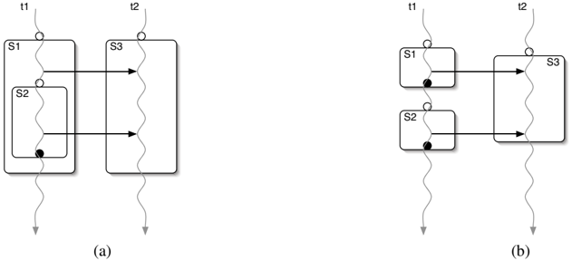
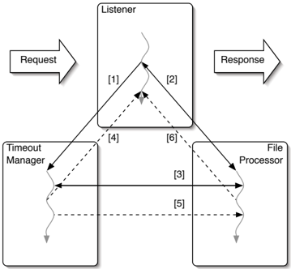
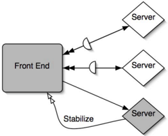
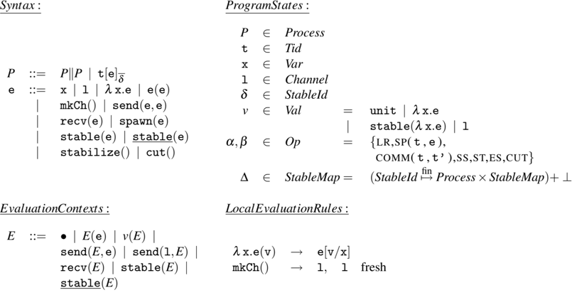
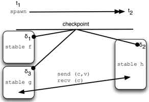
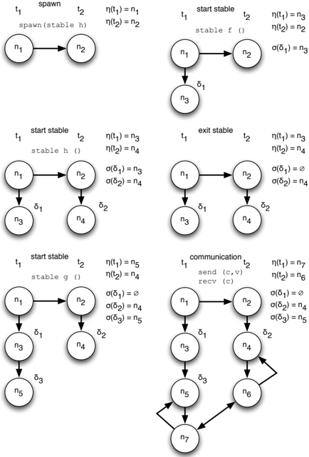
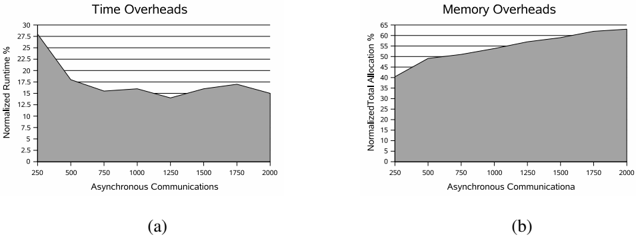
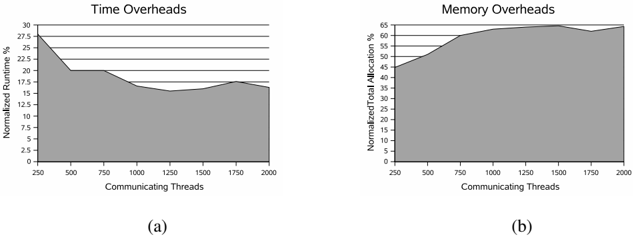
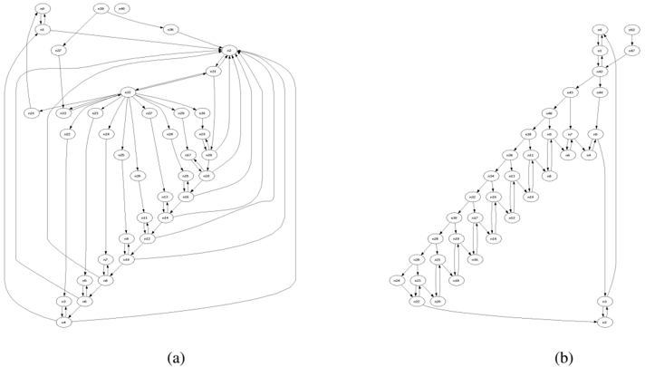
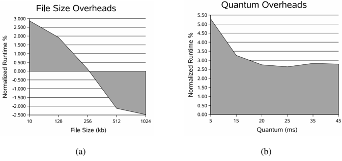

## Lightweight Checkpointing for Concurrent ML

Lukasz Ziarek and Suresh Jagannathan Department of Computer Science Purdue University ( e-mail: [lziarek, suresh]@cs.purdue.edu )

## Abstract

Transient faults that arise in large-scale software systems can often be repaired by re-executing the code in which they occur. Ascribing a meaningful semantics for safe re-execution in multithreaded code is not obvious, however. For a thread to re-execute correctly a region of code, it must ensure that all other threads that have witnessed its unwanted effects within that region are also reverted to a meaningful earlier state. If not done properly, data inconsistencies and other undesirable behavior may result. However, automatically determining what constitutes a consistent global checkpoint is not straightforward since thread interactions are a dynamic property of the program.

In this paper, we present a safe and efficient checkpointing mechanism for Concurrent ML (CML) that can be used to recover from transient faults. We introduce a new linguistic abstraction called stabilizers that permits the specification of per-thread monitors and the restoration of globally consistent checkpoints. Safe global states are computed through lightweight monitoring of communication events among threads (e.g. message-passing operations or updates to shared variables). We present a formal characterization of its design, and provide a detailed description of its implementation within MLton, a whole-program optimizing compiler for Standard ML.

Our experimental results on microbenchmarks as well as several realistic, multithreaded, serverstyle CML applications, including a web server and a windowing toolkit, show that the overheads to use stabilizers are small, and lead us to conclude that they are a viable mechanism for defining safe checkpoints in concurrent functional programs. 1

## 1 Introduction

Atransient fault is an exceptional condition that can be often remedied through re-execution of the code in which it is raised. Typically, these faults are caused by the temporary unavailability of a resource. For example, a program that attempts to communicate through a network may encounter timeout exceptions because of high network load at the time the request was issued. Transient faults may also arise because a resource is inherently unreliable; consider a network protocol that does not guarantee packet delivery. In largescale systems comprised of many independently executing components, failure of one component may lead to transient faults in others even after the failure is detected (Candea et al. , 2004). For example, a client-server application that enters an unrecoverable error state may need to be rebooted; here, the server behaves as a temporarily unavailable resource to its clients who must re-issue requests sent during the period the server was

1 This is a revised and extended version of a paper that appeared in the 2006 ACM SIGPLAN International Conference on Functional Programming.

2

```
fun rpc-server (request, replyCh) =
      let val ans = process request
      in spawn(send(replyCh,ans))
      end handle Exn => ...

```

Fig. 1. A simple server-side RPC abstraction using synchronous communication.

being rebooted. Transient faults may also occur because program invariants are violated. Serializability violations that occur in software transaction systems (Harris &amp; Fraser, 2003; Herlihy et al. , 2003; Welc et al. , 2004) are typically rectified by aborting the offending transaction and having it re-execute.

A simple solution to transient fault recovery would be to capture the global state of the program before an action executes that could trigger such a fault. If the fault occurs and raises an exception, the handler only needs to restore the previously saved program state. Unfortunately, transient faults often occur in long-running server applications that are inherently multithreaded but which must nonetheless exhibit good fault tolerance characteristics; capturing global program state is costly in these environments. On the other hand, simply re-executing a computation without taking prior thread interactions into account can result in an inconsistent program state and lead to further errors, such as serializability violations.

Suppose a communication event via message-passing occurs between two threads and the sender subsequently re-executes this code to recover from a transient fault. A spurious unhandled execution of the (re)sent message may result because the receiver would have no knowledge that a re-execution of the sender has occurred. Thus, it has no need to expect re-transmission of a previously executed message. In general, the problem of computing a sensible checkpoint for a transient fault requires calculating the transitive closure of dependencies manifest among threads and the section of code which must be re-executed.

To alleviate the burden of defining and restoring safe and efficient checkpoints in concurrent functional programs, we propose a new language abstraction called stabilizers . Stabilizers encapsulate three operations. The first initiates monitoring of code for communication and thread creation events, and establishes thread-local checkpoints when monitored code is evaluated. This thread-local checkpoint can be viewed as a restoration point for any transient fault encountered during the execution of the monitored region. The second operation reverts control and state to a safe global checkpoint when a transient fault is detected. The third operation allows previously established checkpoints to be reclaimed.

The checkpoints defined by stabilizers are first-class and composable: a monitored procedure can freely create and return other monitored procedures. Stabilizers can be arbitrarily nested, and work in the presence of a dynamically-varying number of threads and nondeterministic selective communication. We demonstrate the use of stabilizers for several large server applications written in Concurrent ML (Reppy, 1999).

As a more concrete example of exception recovery, consider a typical remote procedure call in Concurrent ML. The code shown below depicts the server-side implementation of the RPC:

Suppose the request to the server is sent asynchronously , allowing the client to compute other actions concurrently with the server; it eventually waits on replyCh for the server's answer. It may be the case that the server raises an exception during its processing of a client's request. When this happens, how should client state be reverted to ensure it can retry its request, and have any effects it performed based on the assumption For example, if the client is waiting on the reply channel, the server must ensure exception handlers communicate information back on the channel, to make sure the client does not deadlock waiting for a response. Moreover, if the client must retry its request, any effects performed by its asynchronous computation must also be reverted. Weaving fault remediation protocols can be complex and unwieldy. Stabilizers, on the other hand, provide the ability to unroll cross-thread computation in the presence of exceptions quickly and efficiently.

Stabilizers provide a middle ground between the transparency afforded by operating systems or compiler-injected checkpoints, and the precision afforded by user-injected checkpoints. In our approach, thread-local state immediately preceding a non-local action (e.g. thread communication, thread creation, etc.) is regarded as a possible checkpoint for that thread. In addition, applications may explicitly identify program points where local checkpoints should be taken, and can associate program regions with these specified points. When a rollback operation occurs, control reverts to one of these saved checkpoints for each thread. Rollbacks are initiated to recover from transient faults. The exact set of checkpoints chosen is determined by safety conditions that ensure a globally consistent state is preserved. When a thread is rolled back to a thread-local checkpoint state C , our approach guarantees other threads with which the thread has communicated will be placed in states consistent with C .

This paper makes the following contributions:

1. The design and semantics of stabilizers , a new modular language abstraction for transient fault recovery in concurrent programs. To the best of our knowledge, stabilizers are the first language-centric design of a checkpointing facility that provides global consistency and safety guarantees for transient fault recovery in programs with dynamic thread creation, and selective message-passing communication.
2. Alightweight dynamic monitoring algorithm faithful to the semantics that constructs efficient global checkpoints based on the context in which a restoration action is performed. Efficiency is defined with respect to the amount of rollback required to ensure that all threads resume execution after a checkpoint is restored to a consistent global state.
3. A formal semantics along with soundness theorems that formalize the correctness and efficiency of our design.
4. A detailed explanation of an implementation built as an extension of the Concurrent ML library (Reppy, 1999) within the MLton (http://www.mlton.org, n.d.) compiler. The library includes support for synchronous, selective communication, threading primitives, exceptions, shared memory, as well as event and synchronous channel based communication.
5. An evaluation study that quantifies the cost of using stabilizers on various opensource server-style applications. Our results reveal that the cost of defining and monitoring thread state is small, typically adding roughly no more than 4-6% overhead to overall execution time. Memory overheads are equally modest.

4

The remainder of the paper is structured as follows. Section 2 describes the stabilizer abstraction. Section 3 provides a motivating example that highlights the issues associated with transient fault recovery in a highly multithreaded web server, and how stabilizers can be used to alleviate complexity and improve robustness. An operational semantics is given in Section 4. A strategy for incremental construction of checkpoint information is given in Section 5; the correctness and efficiency of this approach is examined in Section 6. Implementation details are provided in Section 7. A detailed evaluation of the overhead of using stabilizers for transient fault recovery is given in Section 8, related work is presented in Section 9, and conclusions are given in Section 10.

## 2 Programming Model

Stabilizers are created, reverted, and reclaimed through the use of three primitives with the following signatures:

```
stable      : ('a -> 'b)  -> 'a -> 'b
    stabilize   : unit -> 'a
    cut          : unit -> unit

```

A stable section is a monitored section of code whose effects are guaranteed to be reverted as a single unit. The primitive stable is used to define stable sections. Given function f the evaluation of stable f yields a new function f ' identical to f except that interesting communication, shared memory access, locks, and spawn events are monitored and grouped. Thus, all actions within a stable section are associated with the same checkpoint. This semantics is in contrast to classical checkpointing schemes where there is no manifest grouping between a checkpoint and a collection of actions.

The second primitive, stabilize , reverts execution to a dynamically calculated global state; this state will always correspond to a program state that existed immediately prior to execution of a stable section, communication event, or thread spawn point for each thread. We qualify this claim by observing that external irrevocable operations that occur within a stable section that needs to be reverted (e.g., I/O, foreign function calls, etc.) must be handled explicitly by the application prior to an invocation of a stabilize action. Note that similar to operations like raise or exit that also do not return, the result type of stabilize is synthesized from the context in which it occurs.

Informally, a stabilize action reverts all effects performed within a stable section much like an abort action reverts all effects within a transaction. However, whereas a transaction enforces atomicity and isolation until a commit, stabilizers enforce these properties only when a stabilize action occurs. Thus, the actions performed within a stable section are immediately visible to the outside; when a stabilize action occurs these effects along with their witnesses are reverted.

The third primitive, cut , establishes a point beyond which stabilization cannot occur. Cut points can be used to prevent the unrolling of irrevocable actions within a program (e.g., I/O). A cut prevents reversion to a checkpoint established logically prior it. Informally, a cut executed by a thread T requires that any checkpoint restored for T be associated with a program point that logically follows the cut in program order. Thus, if there is an irrevocable action A (e.g., 'launch missile') that cannot be reverted, the expression: atomic ( A ; cut() ) ensures that any subsequent stabilization action does not cause control to revert to a stable section established prior to A . If such control transfer and state restoration were permitted, it would (a) necessitate revision of A 's effects, and (b) allow A to be re-executed, neither of which is possible. The execution of the irrevocable action A and the cut() must be atomic to ensure that another thread does not perform a stabilization action in between the execution of A and cut() .

Fig. 2. Interaction between stable sections. Clear circles indicate thread-local checkpoints, dark circles represent stabilization actions.



In the image there are two circuits. In the first circuit, there are two switches and in the second circuit, there are two switches.<end_of_utteranc

Unlike classical checkpointing schemes or exception handling mechanisms, the result of invoking stabilize does not guarantee that control reverts to the state corresponding to the dynamically-closest stable section. The choice of where control reverts depends upon the actions undertaken by the thread within the stable section in which the stabilize call was triggered.

Composability is an important design feature of stabilizers: there is no a priori classification of the procedures that need to be monitored, nor is there any restriction against nesting stable sections. Stabilizers separate the construction of monitored code regions from the capture of state. When a monitored procedure is applied, or inter-thread communication action is performed, a potential thread-local restoration point is established. The application of such a procedure may in turn result in the establishment of other independently constructed monitored procedures. In addition, these procedures may themselves be applied and have program state saved appropriately; thus, state saving and restoration decisions are determined without prejudice to the behavior of other monitored procedures.

## 2.1 Interaction of Stable Sections

When a stabilize action occurs, matching inter-thread events are unrolled as pairs. If a send is unrolled, the matching receive must also be reverted. If a thread spawns another thread within a stable section that is being unrolled, this new thread (and all its actions) must also be discarded. All threads which read from a shared variable must be reverted if the thread that wrote the value is unrolled to a state prior to the write. A program state is stable with respect to a statement if there is no thread executing in this state affected by the statement (e.g., all threads are in a point within their execution prior to the execution of the statement and its transitive effects).

For example, consider thread t 1 that enters a stable section S 1 and initiates a communication event with thread t 2 (see Fig. 2(a)). Suppose t 1 subsequently enters another stable section S 2, and again establishes a communication with thread t 2. Suppose further that t 2 receives these events within its own stable section S 3. The program states immediately prior to S 1 and S 2 represent feasible checkpoints as determined by the programmer, depicted as white circles in the example. If a rollback is initiated within S 2, then a consistent global state would require that t 2 revert back to the state associated with the start of S 3 since it has received a communication from t 1 initiated within S 2. However, discarding the actions within S 3 now obligates t 1 to resume execution at the start of S 1 since it initiated a communication event within S 1 to t 2 (executing within S 3). Such situations can also arise without the presence of nested stable sections. Consider the example in Fig. 2(b). Once again, the program is obligated to revert t 1, since the stable section S 3 spans communication events from both S 1 and S 2.

Consider the RPC example presented in the introduction rewritten to utilize stabilizers.

```
Consider the KFC example presented in the introduction to utilize some
          stable fn () => let fun rpc-server (request, replyCh) =
                                  let val ans = process request
                                  in spawn(send(replyCh,ans))
                                  end handle Exn -> ...
                                      stabilize()

              in rpc-server
              end

If an exception occurs while the request is being processed, the request and the
```

If an exception occurs while the request is being processed, the request and the client are unrolled to a state prior to the RPC. The client is free to retry the RPC, or perform some other computation. Much like exceptions in ML, we envision extending stabilizers to be value carrying. We believe such extensions are straightforward and discuss them in Sec. 10.

## 3 Motivating Example

Swerve (http://www.mlton.org, n.d.) (see Fig. 3) is an open-source third-party web server wholly written in Concurrent ML. The server is composed of five separate interacting modules. Communication between modules makes extensive use of CML message passing semantics. Threads communicate over explicitly defined channels on which they can either send or receive values. To motivate the use of stabilizers, we consider the interactions of three of Swerve 's modules: the Listener , the File Processor , and the Timeout Manager . The Listener module receives incoming HTTP requests and delegates file serving requirements to concurrently executing processing threads. For each new connection, a new listener is spawned; thus, each connection has one main governing entity. The File Processor module handles access to the underlying file system. Each file that will be hosted is read by a file processor thread that chunks the file and sends it via messagepassing to the thread delegated by the listener to host the file. Timeouts are processed by the Timeout Manager through the use of timed events. Our implementation supports all CML synchronization primitives on channels. Threads can poll these channels to check if there has been a timeout. In the case of a timeout, the channel will hold a flag signaling time has expired, and is empty otherwise.

Timeouts are the most frequent transient fault present in the server, and difficult to deal with naively. Indeed, the system's author notes that handling timeouts in a modular way is

Fig. 3. Swerve module interactions for processing a request (solid lines) and error handling control and data flow (dashed lines) for timeouts. The number above the lines indicates the order in which communication actions occur.



In this image, we can see a diagram. There are two lines, which are labeled as Timeout Manager and Response. There are two numbers, which are labeled as [1] and [2].<end_of_utteranc

'tricky' and devotes an entire section of the user manual explaining the pervasive crossmodule error handling in the implementation. Consider the typical execution flow given in Fig. 3. When a new request is received, the listener spawns a new thread for this connection that is responsible for hosting the requested page. This hosting thread first establishes a timeout quantum with the timeout manager (1) and then notifies the file processor (2). If a file processing thread is available to process the request, the hosting thread is notified that the file can be chunked (2). The hosting thread passes to the file processing thread the channel on which it will receive its timeout notification (2). The file processing thread is now responsible to check for explicit timeout notification (3).

Since a timeout can occur before a particular request starts processing a file (4) (e.g. within the hosting thread defined by the Listener module) or during the processing of a file (5) (e.g. within the File Processor ), the resulting error handling code is cumbersome. Moreover, the detection of the timeout itself is handled by a third module, the Timeout Manager . The result is a complicated message passing procedure that spans multiple modules, each of which must figure out how to deal with timeouts appropriately. The unfortunate side effect of such code organization is that modularity is compromised. The code now contains implicit interactions that cannot be abstracted (6) (e.g. the File Processor must explicitly notify the Listener of the timeout). The Swerve design illustrates the general problem of dealing with transient faults in a complex concurrent system: how can we correctly handle faults that span multiple modules without introducing explicit cross-module dependencies to handle each such fault?

Fig. 4 shows the definition of fileReader , a Swerve function in the file processing module that sends a requested file to the hosting thread by chunking the file contents into a series of smaller packets. The file is opened by BinIOReader , a utility function in the File Processing module. The fileReader function must check in every iteration of the file processing loop whether a timeout has occurred by calling the Timeout.expired function due to the restriction that CML threads cannot be explicitly interrupted. If a timeout has

8

```
fun fileReader name abort consumer =
  let fun loop strm =
      ifTimeout.expired abort
      then CML.send(consumer, XferTimeout)
      else let val chunk =
                  BinIO.inputN(strm, fileChunk)
            in read a chunk of the file and send to receiver
                loop strm)
            end
    in (case BinIO.Reader.openIt abort name
               of NONE => ()
            | SOME h => (loop (BinIO.Reader.get h);
                            BinIO.Reader.closeIt h)
    end

```

## end

```
fun fileReader name abort consumer =
      let fun loop strm =
        let val chunk =
              BinIO.inputN(strm, fileChunk)
        in  read a chunk of the file and send to receiver
            loop strm)
        end
      in stable fn() =>
            (case BinIOReader.openIt abort name
              of NONE    =>()
              | SOME h =>(loop (BinIOReader.get h);
                              BinIOReader.closeIt h))  ()
        end
  . An excerpt of the the File Processing module in Sverve. The code fragment
bottom shows the code modified to use stabilizers. Italics mark areas in the original
```

Fig. 4. An excerpt of the the File Processing module in Swerve . The code fragment displayed on the bottom shows the code modified to use stabilizers. Italics mark areas in the original where the code is changed.

occurred, the procedure is obligated to notify the receiver (the hosting thread) through an explicit send on channel consumer the value XferTimeout ; timeout information is propagated from the Timeout module to the fileReader via the abort argument which is polled.

Stabilizers allow us to abstract this explicit notification process by wrapping the file processing logic in a stable section. Suppose a call to stabilize replaced the call to CML.send(consumer, Timeout) . This action would result in unrolling both the actions of sendFile as well as the receiver, since the receiver is in the midst of receiving file chunks.

However, a cleaner solution presents itself. Suppose that we modify the definition of the Timeout module to invoke stabilize , and wrap its operations within a stable section. Now, there is no need for any thread to poll for the timeout event. Since the hosting thread establishes a timeout quantum by communicating with Timeout and passes this information to the file processor thread, any stabilize action performed by the Timeout Manager will unroll all actions related to processing this file. This transformation therefore allows us to specify a timeout mechanism without having to embed non-local timeout

```
fn() =>
      let fun receiver() =
        case recv(consumer)
          of Info info     => (sendInfo info);...()
          | Chunk bytes   => (sendBytes bytes; ...)
          | timeout   => error handling code
          | Done          => ...
      ...
      in ... ; loop receiver
      end

```

Fig. 5. An excerpt of the Listener module in Swerve . The main processing of the hosting thread is wrapped in a stable section and the timeout handling code can be removed. The code fragment on the bottom shows the modifications made to use stabilizers. Italics in the code fragment on the top mark areas in the original where the code is removed in the version modified to use stabilizers.

```
let fun receiver() =
                  case recv(consumer)
                    of Info info      => (sendInfo info); ...)
                    | Chunk bytes    => (sendBytes bytes); ...)
                    | timeout    => error handling code
                    | Done            => ...
                ...
                in ... ; loop receiver
                end


        stable fn () =>
          let fun receiver() =
            case recv(consumer)
              of Info info      => (sendInfo info); ...)
                | Chunk bytes    => (sendBytes bytes); ...)
                | Done            => ...
          ...
          in ... ; loop receiver
          end
 5. An excerpt of the Listener module in Swarev. The main processing of the hosting
appended in a stable section and the timeout handling code can be removed. The code fragment
bottom shows the modifications made to use stabilizers. Italics in the code fragment or
```

handling logic within each thread that potentially could be affected. The hosting thread itself is also simplified (as seen in Fig. 5); by wrapping its logic within a stable section, we can remove all of its timeout error handling code as well. A timeout is now handled completely through the use of stabilizers localized within the Timeout module. This improved modularization of concerns does not lead to reduced functionality or robustness. Indeed, a stabilize action causes the timed-out request to be transparently re-processed, or allows the web server to process a new request, depending on the desired behavior.

## 3.1 Cut

The cut primitive can be used to delimit the effects of stabilize calls. Consider the example presented in Fig. 6, which depicts three separate servers operating in parallel. A central coordinator dispatches requests to individual servers and acts as the front-end for handling user requests. The dispatch code, presented below, is wrapped in a stable section and each server has its request processing (as defined in the previous section) wrapped in stable sections. After each request is completed, the server establishes a cut point so that the request is not repeated if an error is detected on a different server.

Servers utilize stabilizers to handle transient faults. Since the servers are independent of one another, a transient fault local to one server should not affect another. The request allocated only to that server must be re-executed.

10

Fig. 6. A multi-server implementation which utilizes a central coordinator and multiple servers. A series of requests is multi-plexed between the servers by the coordinator. Each server handles its own transient faults. The shaded portions represent computation which is unrolled due to the stabilize action performed by the server. Single arrows represent communication to servers and double arrows depict return communication. Circular wedges depict communications which are not considered because a cut operation limits their effects.



When the coordinator discovers an error it calls stabilize to unroll request processing. All requests which encountered an error will be unrolled and automatically retried. Those which completed will not be affected.

```
which completed will not be affected.

          fun multirequest(requestList) =
            foreach
              fn (request,replyCh) =>
                let val serverCh = freeServer()
                in spawn
                      fn () => (send(serverCh, request);
                                let val reply = recv(serverCh)
                                in (send(replyCh,reply);
                                  cut())
                            end)
                end
            requestList
    The code above depicts a front-end function which handles multiple request
    ing them among a number of servers. The function freeServer finds
```

The code above depicts a front-end function which handles multiple requests by dispatching them among a number of servers. The function freeServer fi nds the next available server to process the request. Once the front-end receives a reply from the server, subsequent stabilize actions by other threads will not result in the revocation of previously satisfied requests. This is because the cut() operation prevents rollback of any previously satisfied request. If a stabilization action does occur, the cut() avoids the now satisfied request to this server from being reexecuted; only the server that raised the exception is unrolled.

## 4 Semantics

Our semantics is defined in terms of a core call-by-value functional language with threading primitives (see Fig. 7 and Fig. 8). For perspicuity, we first present an interpretation of stabilizers in which evaluation of stable sections immediately results in the capture of a consistent global checkpoint. Furthermore, we restrict the language to capture checkpoints only upon entry to stable sections, rather than at any communication or thread creation action. This semantics reflects a simpler characterization of checkpointing than the informal description presented in Section 2. In Section 5, we refine this approach to construct checkpoints incrementally, and to allow checkpoints to be captured at any communication or thread creation action.

Fig. 7. A core call-by-value language for stabilizers.



In this image, there is a table with some text and numbers.<end_of_utteranc

In the following, we use metavariables v to range over values, and d to range over stable sections or checkpoint identifiers. We also use P for thread terms, and e for expressions. We use over-bar to represent a finite ordered sequence, for instance, f represents f 1 f 2 . . . fn . The term a . a denotes the prefix extension of the sequence a with a single element a , a . a the suffix extension, aa ′ denotes sequence concatenation, f denotes empty sequences and sets, and a ≤ a ′ holds if a is a prefix of a ′ . We write | a | to denote the length of sequence a .

Our communication model is a message-passing system with synchronous send and receive operations. We do not impose a strict ordering of communication actions on channels; communication actions on the same channel are paired non-deterministically. To model asynchronous sends, we simply spawn a thread to perform the send. 2 To this core language we add three new primitives: stable , stabilize , and cut . When a stable function is applied, a global checkpoint is established, and its body, denoted as stable ( e ) , is evaluated in the context of this checkpoint. The second primitive, stabilize , is used to initiate a rollback and the third, cut , prevents further rollback in the thread in which it executes due to a stabilize action.

The syntax and semantics of the language are given in Fig. 7 and Fig 8. Expressions include variables, locations that represent channels, l -abstractions, function applications, thread creations, channel creations, communication actions that send and receive messages

2 Asynchronous receives are not feasible without a mailbox abstraction.

## GLOBAL EVALUATION RULES:

<!-- formula-not-decoded -->

Fig. 8. A core call-by-value language for stabilizers.

on channels, or operations which define stable sections, stabilize global state to a consistent checkpoint, or bound checkpoints. We do not consider references in this core language as they can be modeled in terms of operations on channels.

A program is defined as a set of threads and we utilize f to denote the empty program. Each thread is uniquely identified, and is also associated with a stable section identifier (denoted by d ) that indicates the stable section the thread is currently executing within. Stable section identifiers are ordered under a relation that allows us to compare them (e.g. they could be thought of as integers incremented by a global counter). For convention we assume d s range from 0 to d max , where d max is the numerically largest identifier (e.g., the last created identifier). Thus, we write t [ e ] d if a thread with identifier t is executing expression e in the context of the stable section with identifier d ; since stable sections can be nested, the notation generalizes to sequences of stable section identifiers with sequence order reflecting nesting relationship. We omit decorating a term with stable section identifiers when not necessary. Our semantics is defined up to congruence of threads ( P ‖ P ′ ≡ P ′ ‖ P ). We write P ⊖{ t [ e ] } to denote the set of threads that do not include a thread with identifier t , and P ⊕{ t [ e ] } to denote the set of threads that contain a thread executing expression e with identifier t . We use evaluation contexts to specify order of evaluation within a thread, and to prevent premature evaluation of the expression encapsulated within a spawn expression.

A program state consists of a collection of evaluating threads ( P ) and a stable map ( D ) that defines a finite function associating stable section identifiers to states. A program begins evaluation with an empty stable map ( ⊥ ). Program evaluation is specified by a global reduction relation, P , D , a = ⇒ P ′ , D ′ , that maps a program state to a new program state. We tag each evaluation step with an action, a , that defines the effects induced by evaluating the expression. We write a = ⇒ ∗ to denote the reflexive, transitive closure of this relation. The actions of interest are those that involve communication events, or manipulate stable sections. We use labels LR to denote local reduction actions, SP ( t ) to denote thread creation, COMM ( t , t ′ ) to denote thread communication, SS to indicate the start of a stable section, ST to indicate a stabilize operation, ES to denote the exit from a stable section, and CUT to indicate a cut action.

Local reductions within a thread are specified by an auxiliary relation, e → e ′ that evaluates expression e within some thread to a new expression e ′ . The local evaluation rules are standard: function application substitutes the value of the actual parameter for the formal in the function body; channel creation results in the creation of a new location that acts as a container for message transmission and receipt; and, supplying a stable function as an argument to a stable expression simply yields the stable function.

There are seven global evaluation rules. The first (rule LOCAL) simply models global state change to reflect thread local evaluation. The second (rule SPAWN) describes changes to the global state when a thread is created to evaluate expression e ; the new thread evaluates e in a context without any stable identifier. The third (rule COMM) describes how a communication event synchronously pairs a sender attempting to transmit a value along a specific channel in one thread with a receiver waiting on the same channel in another thread. Evaluating cut (rule CUT) discards the current global checkpoint. The existing stable map is replaced by an empty one. This rule ensures that no subsequent stabilization action will ever cause a thread to revert to a state that existed logically prior to the cut . While certainly safe, the rule is also very conservative, affecting all threads even those that have had no interaction (either directly or indirectly) with the thread performing the cut . We present a more refined treatment in Sec. 5.

The remaining rules are ones involving stable sections. When a stable section is newly entered (rule STABLE), a new stable section identifier is generated; these identifiers are related under a total order that allows the semantics to express properties about lifetimes and scopes of such sections. The newly created identifier is associated with its creating thread. The checkpoint for this identifier is computed as either the current state if no checkpoint exists, or the current checkpoint. In this case, our checkpointing scheme is conservative: if a stable section begins execution, we assume it may have dependencies to

14

```
let fun f() = ...
        fun g() = ... recv(c) ...
        fun h() = ... send(c,v) ...
    in spawn(stable h);
        (stable g) (stable f ())
    end

Fig 9  An example used to illustrate the interaction of
```

Fig. 9. An example used to illustrate the interaction of inter-thread communication and stable sections.

Fig. 10. An example of global checkpoint construction.



all other currently active stable sections. Therefore, we set the checkpoint for the newly entered stable section to the checkpoint taken at the start of the oldest active stable section. When a stable section exits (rule STABLE-EXIT), the thread context is appropriately updated to reflect that the state captured when this section was entered no longer represents an interesting checkpoint; the stable section identifier is removed from its creating thread. A stabilize action (rule STABILIZE) simply reverts the state to the current global checkpoint.

Note that the stack of stable section identifiers recorded as part of the thread context is not strictly necessary since there is a unique global checkpoint that reverts the entire program state upon stabilization. However, we introduce it here to help motivate our next semantics that synthesizes global checkpoints from partial ones, and for which maintaining such a stack is essential.

## 4.1 Example

Consider the example program shown in Fig 9. We illustrate how global checkpoints would be constructed for this program in Fig. 10. Initially, thread t 1 spawns thread t 2. Afterwards, t 1 begins a stable section, creating a global checkpoint prior to the start of the stable section. Additionally, it creates an identifier ( d 1) for this stable section. We establish a binding between d 1 and the global checkpoint in the stable map, D . Next, thread t 2 begins its stable section. Since D is non-empty, t 2 maps its identifier d 2 to the checkpoint stored by the least d , namely the checkpoint taken by d 1, rather than creating a new checkpoint. Then, thread t 1 exits its stable section, removing the binding for d 1 from D . It subsequently begins execution within a new stable section with identifier d 3. Again, instead of taking a new global checkpoint, d 3 is mapped to the checkpoint taken by the least d , in this case d 2. Notice that d 2's checkpoint is the same as the one taken for d 1. Lastly, t 1 and t 2 communicate. Observe that the same state is restored regardless of whether we revert to either d 2 or d 3. In either case, the checkpoint that would be restored would be the one initially created by d 1. This checkpoint gets cleared only once no thread is executing within a stable section.

## 4.2 Soundness

The soundness of the semantics is defined by an erasure property on stabilize actions. Consider the sequence of actions a that comprise a potential execution of a program; initially, the program has not established any stable section, i.e., d = f . Suppose that there is a stabilize operation that occurs after a . The effect of this operation is to revert the current global program state to an earlier checkpoint. However, given that program execution successfully continued after the stabilize call, it follows that there exists a sequence of actions from the checkpoint state that yields the same state as the original, but which does not involve execution of stabilize . In other words, stabilization actions can never manufacture new states, and thus have no effect on the final state of program evaluation.

<!-- formula-not-decoded -->

equivalent evaluation E t , P f [ e ] , D a . b = ⇒ ∗ P ′′ ‖ t [ v ] , D f such that a ′ ≤ a .

Proof sketch . By assumption and rules STABLE and STABILIZE, there exists evaluation sequences of the form:

<!-- formula-not-decoded -->

<!-- formula-not-decoded -->

Moreover, a ′ ≤ a since the state recorded by the STABLE operation must precede the evaluation of the stabilize action that reverts to that state. ✷

## 5 Incremental Construction

While easily defined, the semantics is highly conservative because there may be checkpoints that involve less unrolling that the semantics does not identify. Consider again the example given in Fig. 9. The global checkpoint calculation reverts execution to the program state prior to execution of f even if f successfully completed. Furthermore, communication events that establish inter-thread dependencies are not considered in the checkpoint calculation. Thus, all threads, even those unaffected by effects that occur in the interval between when the checkpoint is established and when it is restored, are unrolled. A better alternative would restore thread state based on the actions witnessed by threads within checkpoint intervals. If a thread T observes action a performed by thread T ′ and T is restored to a state that precedes the execution of a , T ′ can be restored to its latest local checkpoint state that precedes its observance of a . If T witnesses no actions of other threads, it is unaffected by any stabilize calls those threads might make. This strategy leads to an improved checkpoint algorithm by reducing the severity of restoring

and a checkpoint, limiting the impact to only those threads that witness global effects, and establishing their rollback point to be as temporally close as possible to their current state.

Figs. 11 and 12 present a refinement to the semantics that incrementally constructs a dependency graph as part of program execution. Checkpointing is now defined with respect to the capture of the communication, spawn, and stable actions performed by threads within a graph data structure. This structure consists of a set of nodes representing interesting program points, and edges that connect nodes that have shared dependencies. Nodes are indexed by ordered node identifiers, and hold thread state and record the actions that resulted in their creation. We also define maps to associate threads with nodes ( h ), and stable section identifiers with nodes ( s ) in the graph.

Informally, the actions of each thread in the graph are represented by a chain of nodes that define temporal ordering on thread-local actions. Back-edges are established to nodes representing stable sections; these nodes define possible per-thread checkpoints. Sources of backedges are communication actions that occur within a stable section, or the exit of a nested stable section. Edges also connect nodes belonging to different threads to capture inter-thread communication events.

The evaluation relation P , G a ❀ P ′ , G ′ evaluates a process P executing action a with respect to a communication graph G to yield a new process P ′ and new graph G ′ . As usual, a ❀ ∗ denotes the reflexive, transitive closure of this relation. Programs initially begin evaluation with respect to an empty graph. The auxiliary relation t [ e ] , G ⇓ G ′ models intrathread actions within the graph (see rules BUILD). It establishes a new node to capture thread-local state, and sets the current node marker for the thread to this node. In addition, if the action occurs within a stable section, a back-edge is established from that node to this section. This back-edge is used to identify a potential rollback point. If a node has a back-edge the restoration point will be determined by traversing these back-edges; thus, it is safe to not store thread contexts with such nodes ( ⊥ is stored in the node in that case). New nodes added to the graph are created with a node identifier guaranteed to be greater than any existing node.

When a new thread is spawned (rule SPAWN), a new node and a new stack for the thread are created. An edge is established from the parent to the child thread in the graph. When a communication action occurs (rule COMM) a bi-directional edge is added between the current node of the two threads participating in the communication.

When a cut action is evaluated (rule CUT), a new node is added to the graph that records the action. A subsequent stablization action that traverses the graph must not visit this node, which acts as a barrier to prevent restoration of thread state that existed before it. When a stable section is entered (rule STABLE), a new stable section identifier and a new node are created. A new graph that contains this node is constructed, and an association between the thread and this node is recorded. When a stable section exits (rule STABLE-EXIT), this association is discarded, although a node is also adde to the graph.

Graph reachability is used to ascertain a global checkpoint when a stabilize action is performed (rule STABILIZE): when thread T performs a stabilize call, all nodes reachable from T 's current node in the graph are examined, and the context associated with the least such reachable node (as defined by the node's index) for each thread is used as the thread-local checkpoint for that thread. If a thread is not affected (transitively) by the actions of the thread performing the rollback, it is not reverted to any earlier state. The collective set of such checkpoints constitutes a global state. The graph resulting from a stabilize action does not contain these reachable nodes; the expression G / n defines the graph in which all nodes reachable from node n are removed from G . Here, n is the node indexed by the most recent stable section ( d ) in the thread performing the stabilization. An important consistency condition imposed on the resulting graph is that it not contain a CUT node. This prevents stablization from incorrectly reverting control to a stable section established prior to a cut. Besides threads that are affected by a stabilize action because of dependencies, there maybe other threads that are unaffected. If P ′ is the set of processes affected by a stabilize call, then Ps = P ⊖ P ′ , the set difference between P and P ′ , represents the set of threads unaffected by a stabilize action; the set P ′ ⊕ Ps is therefore the set that, in addition to unaffected threads, also includes those thread states representing globally consistent local checkpoints among threads affected by a stabilize call.

## 5.1 Example

To illustrate the semantics, consider the sequence of actions shown in Fig. 13 that is based on the example given in Fig. 9. Initially thread t 1 spawns the thread t 2, creating a new node n 2 for thread t 2 and connecting it to node n 1 with a directed edge. The node n 3 represents the start of the stable section monitoring function f with identifier d 1. Next, a monitored instantiation of h is called, and a new node ( n 4) associated with this context is allocated in the graph and a new identifier is generated ( d 2). No changes need to be made to the graph when f exits its stable section, however, since d 1 cannot be restored by a stabilize call within this thread - it is mapped to f in s . Monitoring of function g results in a new node ( n 5) added to the graph. A backedge between n 5 and n 3 is not established because control has exited from the stable section corresponding to n 3. Similarly as before, we generate a new identifier d 3 that becomes associated with n 5. Lastly, consider the exchange of a value on channel c by the two threads. Nodes corresponding to the communication actions are created, along with back-edges to their respective stable sections. Additionally, a bi-directional edge is created between the two nodes.

Recall the global checkpointing scheme would restore to a global checkpoint created at the point the monitored version of f was produced, regardless of where a stabilization action took place. In contrast, a stabilize call occurring within the execution of either g or h using this incremental scheme would restore the first thread to the continuation stored in node n 3 (corresponding to the context immediately preceding the call to g ), and would restore the second thread to the continuation stored in node n 2 (corresponding to the context immediately preceding the call to h ).

## 6 Efficiency

We have demonstrated the safety of stabilization actions for global checkpoints: the state restored from a global checkpoint must have been previously encountered during execution of the program. We now introduce the notion of efficiency . Informally, incremental checkpoints are more efficient than global ones because the amount of computation that must be performed following restoration of an incremental checkpoint is less than the computation

18

<!-- formula-not-decoded -->

<!-- formula-not-decoded -->

<!-- formula-not-decoded -->

<!-- formula-not-decoded -->

Fig. 11. Incremental Checkpoint Construction.

that must be performed following restoration of a global one. To prove this, we show that from the state restored by a global checkpoint, we can take a sequence of evaluation steps that leads to the same state restored by an incremental checkpoint. Note that efficiency also implies safety: since the state restored by a global checkpoint can eventually lead to the state produced by an incremental one, and global checkpoints are safe (by Theorem [Safety]), it follows that incremental ones must be safe as well.

The following lemma states that if a sequence of actions do not modify the dependency graph, then all those actions must have been LR.

## GLOBAL EVALUATION RULES

<!-- formula-not-decoded -->

Fig. 12. Incremental Checkpoint Construction (cont.).

Lemma 1. [Safety of LR]:

If

then a = LR .

The proof follows from the structure of the rules since only global rules augments G , and local reductions do not. ✷

A thread's execution, as defined by the semantics, corresponds to an ordered series of nodes within the communication graph. As an example, consider Fig. 13 which illustrates how a graph is constructed from a series of evaluation steps. Threads t 1 and t 2 are represented as paths, [ n 1 , n 3 , n 5 , n 7] for t 1 and [ n 2 , n 4 , n 6] for t 2, in the graph depicted in Fig. 13(f).

We define a path in the graph G for a thread as a sequence of nodes, where (a) the first node in the sequence either has no incoming edges, or a single spawn edge whose source is a node from a different thread, and (b) the last node either has no outgoing edges, or a single communication back-edge to another node. Thus, a path is a chain of nodes with the same thread identifier. Then a graph is a set of paths connected with communication and spawn edges. A well-formed graph is a set of unique paths, one for each thread. Each edge in this path corresponds to a global action.

Let P G t be a path extracted from graph G for thread t . By the definition of ⇓ every node in this path contains (a) the identity of the thread which performed the action that led to the insertion of the node in the graph; (b) the action performed by the thread that triggered the insertion; and (c) the remaining computation for the thread at the point where the action

<!-- formula-not-decoded -->

20

Fig. 13. An example of incremental checkpoint construction.



The image is a diagrammatic representation of a flowchart, which is a graphical method of diagramming processes. The flowchart is structured with a series of interconnected circles, labeled with different variables and functions. Each circle represents a different process or function, and the arrows between the circles indicate the direction of flow.

Here is a detailed description of the flowchart:

1. **Start Point**:
   - The first circle labeled "Start" represents the initial state or state of the process. It is connected to the "spawn" circle, which is connected to the "spawn" circle.

2. **Spawn Process**:
   - The second circle labeled "Spawn" represents the process that starts the process. It is connected to the "spawn" circle.

3. **Spawn Process**:
   - The third circle labeled "Spawn" represents the process that starts the process. It is connected to the "spawn" circle.

4. **

was performed. An action can be of the form SP ( e , t ′ ) indicating that a new thread t ′ was spawned with label ( e , t ′ ) , COMM ( t , t ′ ) indicating that a communication action between the current thread ( t ) and another thread ( t ′ ) has occurred, or SS reflecting the entry of a stable section by the executing thread. A schedule S G t is a temporally ordered sequence of tuples extracted from P G t that represents all actions performed by t on G .

We now proceed to define a new semantic relation ↦→ (see Fig. 14) that takes a graph G , a set of schedules T , and a given program state P and produces a new set of thread schedules T ′ , and a new program state P ′ . Informally, ↦→ examines the continuations in schedules obtained from the communication graph to define a specific evaluation sequence. It operates over schedules based on the following observation: given an element p = ( t , a , e ) in a schedule in which an expression e represents the computation still to be performed by t , the next element in the schedule p ′ can be derived by performing the action a , and some number of thread local reductions.

The rule for SPAWN in Fig. 14 holds when a thread t whose first action in its recorded schedule within the communication graph is a spawn action. The rule performs this action by yielding a new process state that includes the new thread, and a new schedule that reflects the execution of the action. The rule for communication (rule COMM) takes the

<!-- formula-not-decoded -->

Fig. 14. The relation ↦→ defines how to evaluate a schedule T derived from a graph G .

schedules of two threads that were waiting for initiating a communication with one another, and yields a new process state in which the effects of the communication are recorded. Entry into a stable section (rule STABLE) establishes a thread local checkpoint. Rules EXIT STABLE and CUT installs the operation's continuation and removes the action from the schedule.

These rules skip local reductions. This is safe because if there existed a reduction that augmented the graph it would be present in some schedule (such a reduction obviously does not include stabilize ). The following lemma formalizes this intuition. (If N is the set of nodes reachable from the roots of G ', then G / G ′ denotes the graph that results from removing N and nodes reachable from N from G .)

Lemma 2. [Schedule Soundness] Suppose there exists G and G ′ such that P , G a ❀ ∗ P ′ , G ′ and ST ̸ ∈ a . Let T be the schedule derived from G ′′ where G ′′ = G ′ / G . Then, T , P ↦→ ∗ G ′′ f , P ′ .

The proof is by induction on the size of G ′ / G . The base case has G = G ′ , and therefore | G ′′ | = 0. By Lemma 1, a = LR which implies P = P ′ . Since a schedule only includes actions derived from the graph G ′ / G , which is empty, T = f . Suppose the theorem holds for | G ′′ | = n . To prove the inductive step, consider P , G a ❀ P 1 , G 1 a ❀ P ′ , G ′ where | G 1 / G | = n . By the induction hypothesis, we know T , P a ↦→ G ′′ T ′ , P 1 and T , P a ↦→ G 1 / G f , P 1. Now, if a = LR, then by Lemma 1, G 1 = G ′ , thus | G 1 / G | = n , and T ′ = f . Otherwise, a ∈ { SS,ES,COMM( t , t ′ ), SP( t , e ) } . Since all the rules add a node to the graph, we know by the definition of ↦→ , there is a transition for each of these actions that guarantees T ′ , P 1 a ↦→ G ′′ f , P ′ .

Lemma 3. [Adequacy] Let Gs and Gf be two well-formed graphs, G = Gf / Gs , and let P and P ′ be process states. If T is the schedule derived from G , and if T , P a ↦→ ∗ G T ′ , P ′ then P , Gs a ′ ❀ P ′ , G ′ f and | a | ≤ | a ′ | .

By definition of Gf , Gs , and ↦→ , all tags in a are contained in a ′ . By lemma 1, this implies that a ≤ a ′ . ✷

Furthermore, both global and incremental checkpointing yield the same process states in the absence of a stabilize action.

Lemma 4. [Correspondence] If P , G a ❀ P ′ , G ′ and ST / ∈ a , then P , D a = ⇒ P ′ , D .

The proof follows trivially from the definition of ❀ and = ⇒ . ✷

Using these lemmas, we can formally characterize our notion of efficiency:

Theorem [Efficiency]:

If

and

and

<!-- formula-not-decoded -->

<!-- formula-not-decoded -->

then there exists b such that P ′ , D ′ b = ⇒ ∗ P ′′ , D ′′ .

The proof is by induction on the length of a . The base case considers sequences of length one since a stabilize action can only occur within the dynamic context of a stable section (tag SS). Then, P = P ′ = P ′′ , b = f , and the theorem holds trivially.

Assume the theorem holds for sequences of length n -1. Let a = b 1 . b 2 and | b 1 | = n -m , | b 2 | = m . By our hypothesis, we know

<!-- formula-not-decoded -->

<!-- formula-not-decoded -->

Without loss of generality, assume Pn -m = P ′ . Intuitively, any checkpoint restored by the global checkpointing semantics corresponds to a state previously seen during evaluation. Since both evaluations begin with the same a sequence, they must share the same program states, thus we know Pn -m exists in both sequences.

By the definition of ❀ , we know G ′′ and Gn -m are well formed. Let G = G ′′ / Gn -m . G is well formed since Gn -m and G ′′ are. Thus, there is a path P G t associated with every thread t , and a schedule S G t that can be constructed from this path; let T be the set of schedules derived from G .

By Lemma 2, we know there is some sequence of actions a ′ such that T , P ′ a ′ ↦→ ∗ G f , P ′′ .

By Lemma 3, we know P ′ , Gn -m b ❀ ∗ P ′′ , G ′′ , and | a ′ |≤| b | . By definition of ↦→ , ❀ and by Lemma 2, we know that ST ̸∈ b since it differs from a ′ only with respect to LR actions,

and a ′ does not contain any ST tags. By Lemma 4, we know P ′ , D ′ b = ⇒ ∗ P ′′ , D ′′ ✷

## 7 Implementation

Our implementation is incorporated within MLton (http://www.mlton.org, n.d.), a wholeprogram optimizing compiler for Standard ML. The main changes to the underlying infrastructure were the insertion of write barriers to track shared memory updates, and hooks to the Concurrent ML (Reppy, 1999) library to update the communication graph. State restoration is thus a combination of restoring continuations as well as reverting references. The implementation is roughly 2K lines of code to support our data structures, checkpointing, and restoration code, as well as roughly 200 lines of changes to CML.

## 7.1 Supporting First-Class Events

Because our implementation is an extension of the core CML library, it supports first-class events (Reppy, 1999) as well as channel-based communication. The handling of events is no different than our treatment of messages. If a thread is blocked on an event with an associated channel, we insert an edge from that thread's current node to the channel. We support CML's selective communication with no change to the basic algorithm - recall that our operations only update the checkpoint graph on base events; complex events such as choose , wrap , or guard are thus unaffected. Since CML imposes a strict ordering of communication events, each channel must be purged of spurious or dead data after a stabilize action. We leverage the same process CML uses for clearing channels of spurious data after a selective communication, to deal with stabilize actions that roll back channel state.

## 7.2 Handling References

We have thus far elided details on how to track shared memory access to properly support state restoration actions in the presence of references. Naively tracking each read and write separately would be inefficient. There are two problems that must be addressed: (1) unnecessary writes should not be logged; and (2) spurious dependencies induced by reads should be avoided.

Notice that for a given stable section, it is enough to monitor the first write to a given memory location since each stable section is unrolled as a single unit. To monitor writes, we create a log in which we store reference/value pairs. For each reference in the list, its matching value corresponds to the value held in the reference prior to the execution of the stable section. When the program enters a stable section, we create an empty log for this section. When a write is encountered within a monitored procedure, a write barrier is executed that checks if the reference being written is in the log maintained by the section. If there is no entry for the reference, one is created, and the current value of the reference is recorded. Otherwise, no action is required. To handle references occurring outside stable sections, we create a log for the most recently taken checkpoint for the writing thread.

Until a nested stable section exits it is possible for a call to stabilize to unroll to the start of this section. A nested section is created when a monitored procedure is defined within the dynamic context of another monitored procedure. Nested sections require maintaining their own logs. Log information in these sections must be propagated to the outer section upon exit. However, the propagation of information from nested sections to outer ones is not trivial; if the outer section has monitored a particular memory location that has also been updated by the inner one, we only need to store the outer section's log, and the value preserved by the inner one can be discarded.

Efficiently monitoring read dependencies requires us to adopt a different methodology. We assume read operations occur much more frequently that writes, and thus it would be impractical to have barriers on all read operations record dependency information in the communication graph. Our solution assumes race-free programs: every shared reference is assumed to be consistently protected by the same set of locks. We believe this assumption is not particularly onerous in a language like CML where references are generally used sparingly. Under this assumption, it is sufficient to monitor lock acquires/releases to infer shared memory dependencies. By incorporating happens-before dependency edges on lock operations (Manson et al. , 2005), stabilize actions initiated by a writer to a shared location can be effectively propagated to readers that mediate access to that location via a common lock. A lock acquire is dependent on the previous acquisition of the lock.

## 7.3 Graph Representation

The main challenge in the implementation was developing a compact representation of the communication graph. We have implemented a number of node/edge compaction algorithms allowing for fast culling of redundant information. For instance, any two nodes that share a back-edge can be collapsed into a single node. We also ensure that there is at most one edge between any pair of nodes. Any addition to the graph affects at most two threads. We use thread-local meta-data to find the most recent node for each thread. The graph is thus never traversed in its entirety. The size of the communication graph grows with the number of communication events, thread creation actions, lock acquires, and stable sections entered. However, we do not need to store the entire graph for the duration of program execution. The leaves of the graph data structure are distributed among threads. Specifically, a thread has a reference to its current node (which is always a leaf). When a new node is added, the reference is updated. Any node created within a stable section establishes a backedge to the node that represents that section. Thus, any unreachable node can be safely reclaimed by the garbage collector. As we describe below, memory overheads are thus minimal.

A stabilize action has complexity linear in the number of nodes and edges in the graph. Our implementation utilizes a combination of depth-first search and bucket sorting to calculate the resulting graph after a stabilize call in linear time. DFS identifies the part of the graph which will be removed after the stabilize call. Only sections of the graph reachable from the stabilize call are traversed, resulting in a fast restoration procedure.

## 7.4 Handling Exceptions

Special care must be taken to deal with exceptions since they can propagate out of stable sections. When an exception is raised within a stable section but its handler's scope encompasses the stable section itself, we must record this event in our graph. When an exception propagates out of a stable section, the stable section is no longer active. To illustrate why such tracking is required consider the following example code given in Fig 15.

```
let fun g () =
      let val f stable fn () =>
                  (... raise error ...)
      in ...; f () handle error => stabilize()
      end
    in stable g ()
    end
      Fig.15. Sample code utilizing exceptions and stabilizers.

```

The example program consists of two functions f and g , both of which execute within stable sections. Functions f 's execution is also wrapped in an exception handler, which catches the error exception. Notice that this handler is outside of the scope of the stable section for f . During execution, two checkpoints will be taken, one at the call site of g and the other at f 's call site. When the exception error is raised and handled, the program executes a call to stabilize . The correct checkpoint which should be restored is the captured checkpoint at g 's call site. Without exception tracking, f 's checkpoint would be incorrectly restored.

To implement exception tracking, we wrap stable sections with generic exception handlers. Such handlers catch all exceptions, modify our run-time graph, and finally re-raise the exception to allow it to propagate to is appropriate handler. Exceptions that have handlers local to the stable section in which they occur are not affected. Modifications required to the dependency graph are limited - they are just a stable section exit. Since an exception propagating out of a stable section is modeled as a stable section exit, nesting does not introduce additional complexity.

## 7.5 The rest of CML

Besides channel and event communication, the CML library offers many other primitives for thread communication and synchronization. The most notable of these are synchronous variables (M-vars, I-vars, and sync vars) which support put and get operations. We instrumented stabilizers to monitor synchronous variables in much the same manner as shared references. The rest of the CML primitives, such as IVars and MVars, are created from either the basic channel and event building blocks or synchronous variables and do not need special support in the context of stabilizers. 3 CML also provides various communication protocols, such as multicast, which are constructed from a specified collection of channels and a series of communication actions. Again, by instrumenting the fundamental building blocks of CML, no special hooks or monitoring infrastructure must be inserted.

## 8 Performance Results

To measure the cost of stabilizers with respect to various concurrent programming paradigms, we present a synthetic benchmark to quantify pure memory and time overheads, and examine several server-based open-source CML benchmarks to illustrate average overheads in real programs. The benchmarks were run on an Intel P4 2.4 GHz machine with 1 GB of RAMrunning Gentoo Linux, compiled and executed using MLton release 20041109.

3 If an application relies heavily on such constructs it may be more efficient to make stabilizers aware of the abstraction itself instead of its component building blocks.

Table 1. Benchmark characteristics and dynamic counts.

|           |                 |         |          | Comm.   | Shared   | Shared   |
|-----------|-----------------|---------|----------|---------|----------|----------|
| Benchmark | LOC incl. eXene | Threads | Channels | Events  | Writes   | Reads    |
| Triangles | 16501           | 205     | 79       | 187     | 88       | 88       |
| N-Body    | 16326           | 240     | 99       | 224     | 224      | 273      |
| Pretty    | 18400           | 801     | 340      | 950     | 602      | 840      |
| Swerve    | 9915            | 10532   | 231      | 902     | 9339     | 80293    |

Table 2. Benchmark graph sizes and normalized overheads.

|           | Graph Overheads (%)   |         |        |
|-----------|-----------------------|---------|--------|
| Benchmark | Size(MB)              | Runtime | Memory |
| Triangles | .19                   | 0.59    | 8.62   |
| N-Body    | .29                   | 0.81    | 12.19  |
| Pretty    | .74                   | 6.23    | 20.00  |
| Swerve    |                       |         |        |
|           |                       |         | 4.08   |
|           | 5.43                  |         |        |
|           |                       | 2.85    |        |

To measure the costs of our abstraction, our benchmarks are executed in three different ways: one in which the benchmark is executed with no actions monitored, and no checkpoints constructed; one in which the entire program is monitored, effectively wrapped within a stable section, but in which no checkpoints are actually restored; and one in which relevant sections of code are wrapped within stable sections, exception handlers dealing with transient faults are augmented to invoke stabilize , and faults are dynamically injected to trigger restoration.

## 8.1 Synthetic Benchmarks

Our first benchmark, Asynchronous Communication , measures the costs of building and maintaining our graph structure as well as the cost of stabilize actions in the presence of asynchronous communication. The benchmark spawns two threads, a source and a sink, that communicate asynchronously. We measure the cost of our abstraction with regard to an ever increasing load of asynchronous communications. To measure overheads for recording checkpoints, the source and sink threads are wrapped within a stable section. The source thread spawns a number of new threads which all send values on a predefined channel. The sink thread loops until all messages are received and then performs a stabilize action. Since both threads are wrapped in stable sections, the effect of stabilization is to unroll the entire program, when stabilize is called from the source thread. Notice that if we called stabilize from the sink, every worker thread that was spawned would be unrolled, but the source thread would not since it does not directly communicate with the sink.

Fig. 16. Asynchronous Communication overheads.



The image is a scatter plot with two sets of data points. The x-axis is labeled "Asynchronous Communications" and the y-axis is labeled "Normal Rated Utilization (% of Total Allocation)." The data points are represented by a linear scale of range 0 to 65 on the y-axis, and a linear scale of range 0 to 65 on the x-axis, with a minimum of 0 and a maximum of 65.

The data points are represented by a linear scale of range 0 to 65 on the y-axis, with a minimum of 0 and a maximum of 65 on the x-axis. The points are colored in gray, with the color representing the normalized Rated Utilization (% of Total Allocation).

The x-axis has two categories: "Asynchronous Communications" and "Memory Overheads." The y-axis has two categories: "Normal Rat

Fig. 17. Communication Pipeline overheads.



The image is a line graph titled "Time Overheads" and is segmented into two sections: "Normalized Time Overheads" and "Memory Overheads." The x-axis represents the "Communication Threads" while the y-axis represents "Normalized Time Overheads." Both sections are labeled with the same title, "Time Overheads."

The graph has a linear scale of range 0 to 65 on the y-axis, with a minimum of 0 and a maximum of 65 on the x-axis. The graph has two lines, one for "Normalized Time Overheads" and the other for "Memory Overheads."

The "Normalized Time Overheads" line is shown to be decreasing from 2000 to 2000, with a gradual decrease from 2000 to 2000. The "Memory Overheads" line is shown to be increasing from 2000 to

The second benchmark, Communication Pipeline , measures similar effects as the first, but captures the behavior of computations that generate threads which communicate in a synchronous pipeline fashion. The benchmark spawns a series of threads, each of which defines a channel used to communicate with its predecessor. Each thread blocks until it receives a value on its input channel and then sends an acknowledgment to the thread spawned before it. The first and last threads in the chain are connected to form a circular pipeline. This structure establishes a chain of communications over a number of channels, all of which must be unrolled if a stabilize action is initiated. To correctly reach a consistent checkpoint state, an initial thread, responsible for creating the threads in the pipeline, is wrapped within a stable section. Since the initial thread begins by spawning worker threads, unrolling it will lead to a state that does not reflect any communication events or thread creation actions.

These benchmarks measure the overhead of logging program state and communication dependencies with no opportunity for amortizing these costs among other non-stabilizer related operations. These numbers therefore represent worst case overheads for monitoring thread interactions. The versions of the benchmarks with injected stabilizers were compared to a vanilla MLton implementation of CML with no additional instrumentation. On average the programs take about 15-20% longer to run and consume about 50% more memory.

Fig. 18. Communication graphs for Asynchronous Communication (a) and Communication Pipeline (b).



The image depicts a geometric figure with a grid of interconnected lines. The grid is made up of multiple lines, each of which is connected to the others. The lines are arranged in a way that creates a pattern of interconnected loops. The loops are of different lengths and are connected to each other in a way that creates a continuous loop.

Here is a detailed description of the image:

### Description of the Image:

- **Grid**: The image is a grid of interconnected lines. The lines are of different lengths and are connected to each other in a way that creates a continuous loop.
- **Lengths**: The grid is made up of multiple lines, each of which is of different lengths. The lengths of the lines are not uniform, but they are arranged in a way that creates a continuous loop.
- **Interconnected Lines**: The lines are connected to each other in a way that creates a continuous loop.
- **Intersections**: There are multiple loops

The runtime overheads for the synthetic benchmarks are presented in Fig. 16(a) and Fig. 17(a), and the total allocation overheads are presented in Fig. 16(b) and Fig. 17(b). As expected, the cost to simply maintain the graph grows linearly with the number of communications performed and runtime overheads remain constant. There is a significant initial memory and runtime cost because we pre-allocate hash tables used by the graph.

The protocols inherent in these benchmarks are captured at runtime via the communication graph. We present two sample graphs, one for each of the microbenchmarks, in Fig. 18. In the graph for asynchronous communication we notice a complex tree-like communication structure generated from the single thread source communicating asynchronously with the sink. The branching structure occurs from the spawning of new threads, each of which communicates once with the sink. In the communication pipeline we see a much different communication structure. The threads communicate in a pre-defined ordered creating a simple stream. Both graphs were generated from the stabilizer communication graph and fed to DOT to generate the visual representation. 4

## 8.2 Open-Source Benchmarks

Our other benchmarks include several eXene (Gray &amp; Reuter, 1993) benchmarks: Triangles and Nbody , mostly display programs that create threads to draw objects; and Pretty , a pretty printing library written on top of eXene . The eXene toolkit is a library for X Windows that implements the functionality of xlib , written in CML and comprises roughly 16K lines of Standard ML. Events from the X server and control messages between widgets are distributed in streams (coded as CML event values) through the window hierarchy. eXene manages the X calls through a series of servers, dynamically spawned for each connection and screen. The last benchmark we consider is Swerve , a web server written in CMLwhosemajor modules communicate with one another using message-passing channel communication; it makes no use of eXene . All the benchmarks create various CML threads to handle various events; communication occurs mainly through a combination of messagepassing on channels, with occasional updates to shared data.

4 We have discovered that utilizing the visualization of the communication graph is a useful tool for software development and debugging CML programs. We believe stabilizers can be utilized during testing and development to assist the programmer in constructing complex communication protocols.

Table 3. Restoration of the entire web server.

|      | Graph   | Channels   | Channels   | Threads Affected   | Runtime (milli-seconds)   |
|------|---------|------------|------------|--------------------|---------------------------|
| Reqs | Size    | Num        | Cleared    | Threads Affected   | Runtime (milli-seconds)   |
| 20   | 1130    | 85         | 42         | 470                | 5                         |
| 40   | 2193    | 147        | 64         | 928                | 19                        |
| 60   | 3231    | 207        | 84         | 1376               | 53                        |
| 80   | 4251    | 256        | 93         | 1792               | 94                        |
| 100  | 5027    | 296        | 95         | 2194               | 13                        |

Table 4. Instrumented recovery.

|           | Channels   | Channels   | Threads   | Threads   | Runtime         |
|-----------|------------|------------|-----------|-----------|-----------------|
| Benchmark | Num        | Cleared    | Total     | Affected  | (milli-seconds) |
| Swerve    | 38         | 4          | 896       | 8         | 3               |
| eXene     | 158        | 27         | 1023      | 236       | 19              |

For these benchmarks, stabilizers exhibit a runtime slow down up to 6% over a CML program in which monitoring is not performed (see Tables 1- 2). For a highly-concurrent application like Swerve , the overheads are even smaller, on the order of 3%. The cost of using stabilizers is only dependent on the number of inter-thread actions and shared data dependencies that are logged. These overheads are well amortized over program execution.

Memory overheads to maintain the communication graph are larger, although in absolute terms, they are quite small. Because we capture continuations prior to executing communication events and entering stable sections, part of the memory cost is influenced by representation choices made by the underlying compiler. Nonetheless, benchmarks such as Swerve that create over 10K threads, and employ non-trivial communication patterns, require only 5MB to store the communication graph, a roughly 4% overhead over the memory consumption of the original program.

To measure the cost of calculating and restoring a globally consistent checkpoint, we consider three experiments. The first is a simple unrolling of Swerve (see Table. 3), in which a call to stabilize is inserted during the processing of a varying number of concurrent web requests. This measurement illustrates the cost of restoring to a consistent global state that can potentially affect a large number of threads. Although we expect large checkpoints to be rare, we note that restoration of such checkpoints is nonetheless quite fast. The graph size is presented as the total number of nodes. Channels can be affected by an unrolling in two different ways: a channel may contain a value sent on it by a communicating thread but that has not been consumed by a receiver, or a channel may connect two threads that have successfully exchanged a value. In the first case we must clear the channel of the value if the thread which placed the value on the channel is unrolled; in the latter case no direct processing on the channel is required. The table also shows the total number of affected channels and those which must cleared.

Fig. 19. Swerve benchmark overheads.



The image is a bar chart titled "File Size Overheads." The x-axis represents "File Size (kb)" while the y-axis represents "Normalized Runtime %." The chart compares the file size of two different types of files: "Normalized Runtime" and "Unnormalized Runtime." The file sizes are measured in kilobits per second (kB/s) and kilobits per second (kbps), respectively.

### Description of the Bar Chart:
- **X-Axis (File Size (kb)):**
  - The x-axis represents "File Size (kb)" in kilobits per second (kB/s).
- **Y-Axis (Normalized Runtime %):**
  - The y-axis represents "Normalized Runtime %" in kilobits per second (kbps) in kilobits per second (kbps).

### Analysis:
- **Normal

## 8.3 Injecting Stabilizers

To quantify the cost of using stabilizers in practice, we extended Swerve and eXene and replaced some of their error handling mechanisms with stabilizers (see Table 4). For Swerve , the implementation details are given in Section 3. Our benchmark manually injects a timeout every ten requests, stabilizes the program, and re-requests the page.

For eXene , we augment a scrollbar widget used by the pretty printer. In eXene , the state of a widget is defined by the state of its communicating threads, and no state is stored in shared data. The scroll bar widget is composed of three threads which communicate over a set of channels. The widget's processing is split between two helper threads and one main controller thread. Any error handled by the controller thread must be communicated to the helper threads and vice versa. We manually inject the loss of packets into the X server, stabilize the widget, and wait for new interaction events. The loss of packets is injected by simply dropping every tenth packet which is received from the X server. Ordinarily, if eXene ever loses an X server packet, its default behavior is to terminate execution since there is no easy mechanism available to restore the state of the widget to a globally consistent point. Using stabilizers, however, packet loss exceptions can be safely handled by the widget. By stabilizing the widget, we return it to a state prior to the failed request. Subsequent requests will redraw the widget as we would expect; thus, stabilizers permit the scroll bar widget to recover from a lost packet without pervasive modification to the underlying eXene implementation.

Finally, to measure the sensitivity of stabilization to application-specific parameters, we compare our stabilizer-enabled version of Swerve to the stock configuration by varying two program attributes: file size and quantum. Since stabilizers eliminate the need for polling during file processing, runtime costs would improve as file sizes increase. Our tests were run on both versions of Swerve ; for a given file size, 20 requests are processed. The results (see Fig. 19(a)) indicate that for large file sizes (upward of 256KB) our implementation is slightly more efficient than the original. Our slow down for small file sizes (on the order of 10KB) is proportional to our earlier benchmark results.

Since our graph algorithm requires monitoring various communication events, lowering the time quantum allocated to each thread may adversely affect performance, since the overhead for monitoring the graph consumes a greater fraction of a thread's computation per quantum. Our tests compared the two versions of Swerve , keeping file size constant at 10KB, but varying the allocated quantum (see Fig. 19(b)). Surprisingly, the results indicate that stabilizer overheads become significant only when the quantum is less than 5 ms. As a point of comparison, CML's default quantum is 20ms.

## 9 Related Work

Being able to checkpoint and rollback parts or the entirety of an execution has been the focus of notable research in the database (Chrysanthis &amp; Ramamritham, 1992) as well as the parallel and distributed computing communities (Elnozahy et al. , 2002; Kasbekar &amp; Das, 2001; Li et al. , 1990). Checkpoints have been used to provide fault tolerance for long-lived applications, for example in scientific computing (Tantawi &amp; Ruschitzka, 1984; Agarwal et al. , 2004) but have been typically regarded as heavyweight entities to construct and maintain.

Existing checkpoint approaches can be classified into four broad categories: (a) schemes that require applications to provide their own specialized checkpoint and recovery mechanisms (Bronevetsky et al. , 2003; Bronevetsky et al. , 2004); (b) schemes in which the compiler determines where checkpoints can be safely inserted (Beck et al. , 1994); (c) techniques that require operating system or hardware monitoring of thread state (Chen et al. , 1997; Hulse, 1995; Li et al. , 1990); and (d) library implementations that capture and restore state (Dieter &amp; Jr, 1999). Checkpointing functionality provided by an application or a library relies on the programmer to define meaningful checkpoints. For many multithreaded applications, determining these points is non-trivial because it requires reasoning about global, rather than thread-local, invariants. Compiler and operating-system injected checkpoints are transparent to the programmer. However, transparency comes at a notable cost: checkpoints may not be semantically meaningful or efficient to construct.

The ability to revert to a prior point within a concurrent execution is essential to transaction systems (Adya et al. , 1995; Gray &amp; Reuter, 1993; Kung &amp; Robinson, 1981); outside of their role for database concurrency control, such approaches can improve parallel program performance by profitably exploiting speculative execution (Rinard, 1999; Welc et al. , 2005). Harris et al. proposes a transactional memory system (Harris et al. , 2005) for Haskell that introduces a retry primitive to allow a transactional execution to safely abort and be re-executed if desired resources are unavailable. However, this work does not propose to track or revert effectful thread interactions within a transaction. In fact, such interactions are explicitly rejected by the Haskell type-system. There has also been recent interest in providing transactional infrastructures for ML (Ringenburg &amp; Grossman,

2005), and in exploring the interaction between transactional semantics and first-class synchronous operations (Donnelly &amp; Fluet, 2008). Our work shares obvious similarities with all these efforts insofar as stabilizers also require support for logging and revert program state.

In addition to stabilizers, functional language implementations have utilized continuations for similar tasks. For example, Tolmach and Appel (Tolmach &amp; Appel, 1990) described a debugging mechanism for SML/NJ that utilized captured continuations to checkpoint the target program at given time intervals. This work was later extended (Tolmach &amp; Appel, 1991) to support multithreading, and was used to log non-deterministic thread events to provide replay abilities.

Another possibility for fault recovery is micro-reboot (Candea et al. , 2004), a finegrained technique for surgically recovering faulty application components which relies critically on the separation of data recovery and application recovery. Micro-reboot allows for a system to be restarted without ever being shut down by rebooting separate components. Unlike checkpointing schemes, which attempt to restore a program to a consistent state within the running application, micro-reboot quickly restarts an application component, but the technique itself is oblivious to program semantics.

Recent work in the programming languages community has explored abstractions and mechanisms closely related to stabilizers and their implementation for maintaining consistent state in distributed environments (Field &amp; Varela, 2005), detecting deadlocks (Christiansen &amp; Huch, 2004), and gracefully dealing with unexpected termination of communicating tasks in a concurrent environment (Flatt &amp; Findler, 2004). For example, kill-safe thread abstractions (Flatt &amp; Findler, 2004) provide a mechanism to allow cooperating threads to operate even in the presence of abnormal termination. Stabilizers can be used for a similar goal, although the means by which this goal is achieved is quite different. Stabilizers rely on unrolling thread dependencies of affected threads to ensure consistency instead of employing specific runtime mechanisms to reclaim resources.

Safe futures (Welc et al. , 2005) bear some similarity to the speculative abstraction defined here insofar as both provide a revocation mechanism based on tracking dynamic data and control-flow. However, safe futures do not easily compose with other Java concurrency primitives, and the criteria for revocation is automatically determined based on dependency violations, and is thus not under user control.

Transactional Events (Donnelly &amp; Fluet, 2008; Effinger-Dean et al. , 2008) are an emerging trend in concurrent functional language design. They rely on a dynamic search thread strategy to explore communication patterns, thus guaranteeing atomicity of communication protocols. We believe stabilizers could be utilized by transactional events to implement optimistic search thread strategies. The monitoring and rollback properties of stabilizers could be leveraged to create an adaptive search mechanism that utilizes monitored information from previous searches to guide future ones.

## 10 Conclusions and Future Work

Stabilizers are a novel modular checkpointing abstraction for concurrent functional programs. Unlike other checkpointing schemes, stabilizers are not only able to identify the smallest subset of threads which must be unrolled, but also provide useful safety guar- antees. As a language abstraction, stabilizers can be used to simplify program structure especially with respect to error handling, debugging, and consistency management. Our results indicate that stabilizers can be implemented with small overhead and thus serve as an effective and promising checkpointing abstraction for high-level concurrent programs.

There are several important directions we expect to pursue in the future. While the use of cut can delimit the extent to which control is reverted as a result of a stabilize call, a more general and robust approach would be to integrate a rational compensation semantics (Bruni et al. , 2005) for stabilizers in the presence of stateful operations. We also plan to explore richer ways to describe the interaction between stable sections and their restoration, for example by providing a facility to have threads restore program state in other executing threads, and to investigate the interaction of stabilizers with other transactionbased concurrency control mechanisms. Additionally we would like to extend stabilizers to carry values much like exceptions do in ML. This would allow programs to adjust based on the faults or exceptions that caused the reversion to take place.

Although our benchmarks indicate that stabilizers are a lightweight checkpointing mechanism, there are a number of optimizations we wish to pursue to limit the overheads of logging and re-execution. Our logging infrastructure would benefit from partial or incremental continuation grabbing to limit memory overheads. During a stabilize action many threads and computations may be reverted. However, only a small number of such computations may actually change during their subsequent re-execution. Identifying such sections of code could greatly reduce the cost of re-execution after a checkpoint is restored. Function memoization in a multithreaded program with channel based communication requires additional monitoring of thread interactions. Such information is already present within our communication graph and can be leveraged to assist function memoization (Ziarek et al. , 2009).

## Acknowledgements

We thank the reviewers for their careful reading and valuable suggestions. This work is supported by the National Science Foundation under grants CCF-0701832 and CCF0811631.

## References

- Adya, A., Gruber, R., Liskov, B., &amp; Maheshwari, U. (1995). Efficient Optimistic Concurrency Control Using Loosely Synchronized Clocks. SIGMOD Record , 24 (2), 23-34.
- Agarwal, Saurabh, Garg, Rahul, Gupta, Meeta S., &amp; Moreira, Jose E. (2004). Adaptive Incremental Checkpointing for Massively Parallel Systems. Pages 277-286 of: Proceedings of the 18th Annual International Conference on Supercomputing .
- Beck, Micah, Plank, James S., &amp; Kingsley, Gerry. (1994). Compiler-Assisted Checkpointing . Tech. rept. University of Tennessee, Knoxville, TN, USA.
- Bronevetsky, Greg, Marques, Daniel, Pingali, Keshav, &amp; Stodghill, Paul. (2003). Automated Application-Level Checkpointing of MPI Programs. Pages 84-94 of: Proceedings of the 9th ACM SIGPLAN Symposium on Principles and Practice of Parallel Programming .
- Bronevetsky, Greg, Marques, Daniel, Pingali, Keshav, Szwed, Peter, &amp; Schulz, Martin. (2004). Application-Level Checkpointing for Shared Memory Programs. Pages 235-247 of: Proceedings

of the 11th International Conference on Architectural Support for Programming Languages And Operating Systems .

- Bruni, R., Melgratti, H., &amp; Montanari, U. (2005). Theoretical Foundations for Compensations in Flow Composition Languages. Pages 209-220 of: Proceedings of the 32nd ACM SIGPLAN Symposium on Principles of Programming Languages .
- Candea, G., Kawamoto, S., Fujiki, Y., Friedman, G., &amp; Fox, A. (2004). Microreboot - A Technique for Cheap Recovery. Page 3 of: Proceedings of the 6th ACM Symposium on Operating Systems Design and Implementation .
- Chen, Yuqun, Plank, James S., &amp; Li, Kai. (1997). CLIP: A Checkpointing Tool for MessagePassing Parallel Programs. Pages 1-11 of: Proceedings of the 1997 ACM/IEEE Conference on Supercomputing .
- Christiansen, Jan, &amp; Huch, Frank. (2004). Searching for Deadlocks while Debugging Concurrent Haskell Programs. Pages 28-39 of: Proceedings of the 9th ACM SIGPLAN International Conference on Functional Programming .
- Chrysanthis, Panos K., &amp; Ramamritham, Krithi. (1992). ACTA: the SAGA continues. Pages 349397 of: Database Transaction Models for Advanced Applications .
- Dieter, William R., &amp; Jr, James E. Lumpp. (1999). A User-level Checkpointing Library for POSIX Threads Programs. Page 224 of: Proceedings of the 29th Annual International Symposium on Fault-Tolerant Computing .
- Donnelly, Kevin, &amp; Fluet, Matthew. (2008). Transactional Events. The Journal of Functional Programming , 18 , 649-706.
- Effinger-Dean, Laura, Kehrt, Matthew, &amp; Grossman, Dan. (2008). Transactional Events for ML. Pages 103-114 of: Proceedings of the 13th ACM SIGPLAN International Conference on Functional Programming .
- Elnozahy, E. N. (Mootaz), Alvisi, Lorenzo, Wang, Yi-Min, &amp; Johnson, David B. (2002). A Survey of Rollback-Recovery Protocols in Message-Passing Systems. Acm computing surveys , 34 (3).
- Field, John, &amp; Varela, Carlos A. (2005). Transactors: a Programming Model for Maintaining Globally Consistent Distributed State in Unreliable Environments. Pages 195-208 of: Proceedings of the 32nd ACM SIGPLAN Symposium on Principles of Programming Languages .
- Flatt, Matthew, &amp; Findler, Robert Bruce. (2004). Kill-Safe Synchronization Abstractions. Pages 4758 of: Proceedings of the ACM SIGPLAN 2004 Conference on Programming Language Design and Implementation .
- Gray, Jim, &amp; Reuter, Andreas. (1993). Transaction Processing . Morgan-Kaufmann.
- Harris, Tim, &amp; Fraser, Keir. (2003). Language Support for Lightweight Transactions. Pages 388402 of: Proceedings of the ACM SIGPLAN Conference on Object-Oriented Programming Systems, Languages, and Applications .
- Harris, Tim, Marlow, Simon, Peyton Jones, Simon, &amp; Herlihy, Maurice. (2005). Composable Memory Transactions. Pages 48 - 60 of: Proceedings of the 10th ACM SIGPLAN Conference on Principles and Practice of Parallel Programming .
- Herlihy, Maurice, Luchangco, Victor, Moir, Mark, &amp; Scherer, III, William N. (2003). Software Transactional Memory for Dynamic-Sized Data Structures. Pages 92-101 of: Proceedings of the ACM Conference on Principles of Distributed Computing .
- http://www.mlton.org.
- Hulse, D. (1995). On Page-Based Optimistic Process Checkpointing. Page 24 of: Proceedings of the 4th International Workshop on Object-Orientation in Operating Systems .
- Kasbekar, Mangesh, &amp; Das, Chita. (2001). Selective Checkpointing and Rollback in Multithreaded Distributed Systems. Proceedings of the 21 st International Conference on Distributed Computing Systems .

- Kung, H. T., &amp; Robinson, John T. (1981). On Optimistic Methods for Concurrency Control. ACM Transactions on Database Systems , 6 (2), 213-226.
- Li, Kai, Naughton, Jeffrey, &amp; Plank, James. (1990). Real-time Concurrent Checkpoint for Parallel Programs. Pages 79-88 of: Proceedings of the ACM SIGPLAN Symposium on Principles and Practice of Parallel Programming .
- Manson, Jeremy, Pugh, William, &amp; Adve, Sarita V. (2005). The Java Memory Model. Pages 378-391 of: Proceedings of the 32nd ACM SIGPLAN Symposium on Principles of Programming Languages .
- Reppy, John. (1999). Concurrent Programming in ML . Cambridge University Press.
- Rinard, Martin. (1999). Effective Fine-Grained Synchronization for Automatically Parallelized Programs Using Optimistic Synchronization Primitives. ACMTransactions on Computer Systems , 17 (4), 337-371.
- Ringenburg, Michael F., &amp; Grossman, Dan. (2005). AtomCaml: First-Class Atomicity Via Rollback. Pages 92-104 of: Proceedings of the 10th ACM SIGPLAN International Conference on Functional Programming .
- Tantawi, Asser N., &amp; Ruschitzka, Manfred. (1984). Performance Analysis of Checkpointing Strategies. ACM Transactions on Computer Systems , 2 (2), 123-144.
- Tolmach, Andrew P., &amp; Appel, Andrew W. (1990). Debugging Standard ML Without Reverse Engineering. Pages 1-12 of: Proceedings of the 1990 ACM Conference on LISP and Functional Programming .
- Tolmach, Andrew P., &amp; Appel, Andrew W. (1991). Debuggable Concurrency Extensions for Standard ML. Pages 120-131 of: Proceedings of the 1991 ACM/ONR Workshop on Parallel and Distributed Debugging .
- Welc, Adam, Jagannathan, Suresh, &amp; Hosking, Antony L. (2004). Transactional Monitors for Concurrent Objects. Pages 519-542 of: Proceedings of the European Conference on ObjectOriented Programming .
- Welc, Adam, Jagannathan, Suresh, &amp; Hosking, Antony. (2005). Safe Futures for Java. Pages 439453 of: Proceedings of the 20th ACM SIGPLAN Conference on Object-Oriented Programming Systems, Languages, and Applications .
- Ziarek, Lukasz, Sivaramakrishnan, K.C., &amp; Jagannathan, Suresh. (2009). Partial Memoization of Concurrency and Communication. Pages 161-172 of: Proceedings of the 14th ACM SIGPLAN International Conference on Functional Programming .