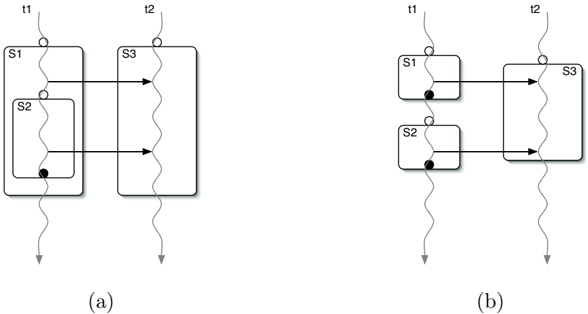
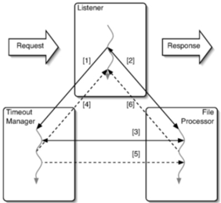
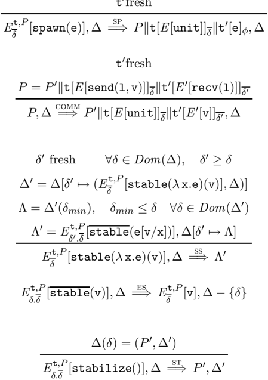
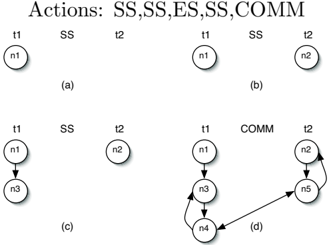
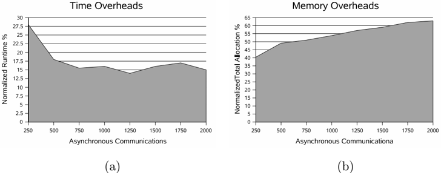
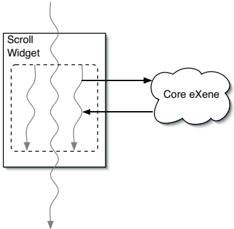

## Abstract

Transient faults that arise in large-scale software systems can often be repaired by re-executing the code in which they occur. Ascribing a meaningful semantics for safe re-execution in multi-threaded code is not obvious, however. For a thread to correctly re-execute a region of code, it must ensure that all other threads which have witnessed its unwanted effects within that region are also reverted to a meaningful earlier state. If not done properly, data inconsistencies and other undesirable behavior may result. However, automatically determining what constitutes a consistent global checkpoint is not straightforward since thread interactions are a dynamic property of the program.

In this paper, we present a safe and efficient checkpointing mechanism for Concurrent ML (CML) that can be used to recover from transient faults. We introduce a new linguistic abstraction called stabilizers that permits the specification of per-thread monitors and the restoration of globally consistent checkpoints. Global states are computed through lightweight monitoring of communication events among threads (e.g. message-passing operations or updates to shared variables). Our checkpointing abstraction provides atomicity and isolation guarantees during state restoration ensuring restored global states are safe.

Our experimental results on several realistic, multithreaded, server-style CML applications, including a web server and a windowing toolkit, show that the overheads to use stabilizers are small, and lead us to conclude that they are a viable mechanism for defining safe checkpoints in concurrent functional programs. Our experiments conclude with a case study illustrating how to build open nested transactions from our checkpointing mechanism.

Keywords: Concurrent programming, error recovery, checkpointing, transactions, Concurrent ML, exception handling, atomicity

- 1 Email: lziarek@cs.purdue.edu
- 2 Email: schatzp@cs.purdue.edu
- 3 Email: suresh@cs.purdue.edu


Electronic Notes in Theoretical Computer Science 174 (2007) 85-115

[www.elsevier.com/locate/entcs](http://www.elsevier.com/locate/entcs)

## Modular Checkpointing for Atomicity

## 1

Lukasz Ziarek

Department of Computer Science Purdue University West Lafayette, USA

## Philip Schatz 2

Department of Computer Science Purdue University West Lafayette, USA

## Suresh Jagannathan 3

Department of Computer Science Purdue University West Lafayette, USA

ElectronicNotes in TheoreticalComputer Science

## 1 Introduction

A transient fault is an exceptional condition that can be often remedied through re-execution of the code in which it is raised. Typically, these faults are caused by the temporary unavailability of a resource. For example, a program that attempts to communicate through a network may encounter timeout exceptions because of high network load at the time the request was issued. Transient faults may also arise because a resource is inherently unreliable; consider a network protocol that does not guarantee packet delivery. In large-scale systems comprised of many independently executing components, failure of one component may lead to transient faults in others even after the failure is detected [7]. For example, a client-server application that enters an unrecoverable error state may need to be rebooted; here, the server behaves as a temporarily unavailable resource to its clients who must re-issue requests sent during the period the server was being rebooted. Transient faults may also occur because program invariants are violated. Serializability violations that occur in software transaction systems [18,20,40] are typically rectified by aborting the offending transaction and having it re-execute.

A simple solution to transient fault recovery would be to capture the global state of the program before an action executes that could trigger such a fault. If the fault occurs and raises an exception, the handler only needs to restore the previously saved program state. Unfortunately, transient faults often occur in long-running server applications that are inherently multi-threaded but which must nonetheless exhibit good fault tolerance characteristics; capturing global program state is costly in these environments. On the other hand, simply re-executing a computation without taking prior thread interactions into account can result in an inconsistent program state and lead to further errors, such as serializability violations. When a thread is reverted all of its effects must be isolated from the rest of the program.

Suppose a communication event via message-passing occurs between two threads and the sender subsequently re-executes this code to recover from a transient fault. A spurious unhandled execution of the (re)sent message may result because the receiver would have no knowledge that a re-execution of the sender has occurred. Thus, it has no need to expect re-transmission of a previously executed message. In general, the problem of computing a sensible checkpoint for a transient fault requires calculating the transitive closure of dependencies manifest among threads and the section of code which must be re-executed.

To alleviate the burden of defining and restoring safe and efficient checkpoints in concurrent functional programs, we propose a new language abstraction called stabilizers . Stabilizers encapsulate two operations. The first initiates monitoring of code for communication and thread creation events, and establishes thread-local checkpoints when monitored code is evaluated. This thread-local checkpoint can be viewed as a restoration point for any transient fault encountered during the execution of the monitored region. The second operation reverts control and state to a safe global checkpoint when a transient fault is detected. When control is reverted atomicity and isolation of the monitored region are enforced. The monitored region is unrolled atomically and all of its global effects are also reverted.

The checkpoints defined by stabilizers are first-class and composable: a monitored procedure can freely create and return other monitored procedures. Stabilizers can be arbitrarily nested, and work in the presence of a dynamically-varying number of threads and non-deterministic selective communication. We demonstrate the use of stabilizers for several large server applications written in Concurrent ML and we provide a case study describing how to extend stabilizers into transactions by providing atomicity and isolation guarantees during the execution of monitored code.

Stabilizers provide a middle ground between the transparency afforded by operating systems or compiler-injected checkpoints, and the precision afforded by userinjected checkpoints. In our approach, thread-local state immediately preceding a non-local action (e.g. thread communication, thread creation, etc.) is regarded as a possible checkpoint for that thread. In addition, applications may explicitly identify program points where local checkpoints should be taken, and can associate program regions with these specified points. When a rollback operation occurs, control reverts to one of these saved checkpoints for each thread. Rollbacks are initiated to recover from transient faults. The exact set of checkpoints chosen is determined by safety conditions, namely that monitored code is reverted atomically and all its effects are isolated, that ensure a globally consistent state is preserved. When a thread is rolled-back to a thread-local checkpoint state C , our approach guarantees other threads with which the thread has communicated will be placed in states consistent with C .

This paper makes four contributions:

- (i) The design and semantics of stabilizers , a new modular language abstraction for concurrent functional programs which provides atomicity and isolation guarantees on rollback. To the best of our knowledge, stabilizers are the first language-centric design of a checkpointing facility that provides global consistency and safety guarantees for transient fault recovery in programs with dynamic thread creation, and selective communication [31].
- (ii) A lightweight dynamic monitoring algorithm faithful to the semantics that constructs efficient global checkpoints based on the context in which a restoration action is performed. Efficiency is defined with respect to the amount of rollback required to ensure that all threads resume execution after a checkpoint is restored to a consistent global state.
- (iii) A detailed evaluation study for Concurrent ML that quantifies the cost of using stabilizers on various open-source server-style applications. Our results reveal that the cost of defining and monitoring thread state is small, typically adding roughly no more than four to six percent overhead to overall execution time. Memory overheads are equally modest.
- (iv) A case study illustrating how to extend stabilizers and their atomicity and isolation guarantees to implement software transactions. Our case study defines an extension to stabilizers which supports open nesting.

The remainder of the paper is structured as follows. Section 2 describes the stabilizer abstraction. Section 3 provides a motivating example that highlights the issues associated with transient fault recovery in a highly multi-threaded webserver, and how stabilizers can be used to alleviate complexity and improve robustness. An operational semantics is given in Section 4. A strategy for incremental construction of checkpoint information is given in Section 5. Implementation details are provided in Section 6. Adetailed evaluation on the costs and overheads of using stabilizers for transient fault recovery is given in Section 7, a case study showing how to implement software transactions is given in Section 8, related work is presented in Section 9, and conclusions are given in Section 10.

## 2 Programming Model

Stabilizers are created, reverted, and reclaimed through the use of two primitives with the following signatures:

```
stable     : ('a -> 'b)   -> 'a -> 'b
      stabilize   : unit -> 'a

```

A stable section is a monitored section of code whose effects are guaranteed to be reverted as a single unit. The primitive stable is used to define stable sections. Given function f the evaluation of stable f yields a new function f' identical to f except that interesting communication, shared memory access, locks, and spawn events are monitored and grouped. Thus, all actions within a stable section are associated with the same checkpoint. This semantics is in contrast to classical checkpointing schemes where there is no manifest grouping between a checkpoint and a collection of actions.

The second primitive, stabilize reverts execution to a dynamically calculated global state; this state will always correspond to a program state that existed immediately prior to execution of a stable section, communication event, or thread spawn point for each thread. We qualify this claim by observing that external nonrevocable operations that occur within a stable section that needs to be reverted (e.g. I/O, foreign function calls, etc.) must be handled explicitly by the application prior to an invocation of a stabilize action. Note that similar to operations like raise or exit that also do not return, the result type of stabilize is synthesized from the context in which it occurs.

Informally, a stabilize action reverts all effects performed within a stable section much like an abort action reverts all effects within a transaction. However, whereas a transaction enforces atomicity and isolation until a commit occurs, stabilizers enforce these properties only when a stabilize action occurs. Thus, the actions performed within a stable section are immediately visible to the outside; when a stabilize action occurs these effects along with their witnesses are reverted.

Unlike classical checkpointing schemes [34] or exception handling mechanisms, the result of invoking stabilize does not guarantee that control reverts to the state corresponding to the dynamically-closest stable section. The choice of where control reverts depends upon the actions undertaken by the thread within the stable section in which the stabilize call was triggered.

Fig. 1. Interaction between stable sections.



In the image there are two circuits connected with a wire. The first circuit is labeled S1 and the second circuit is labeled S2.<end_of_utteranc

Composability is an important design feature of stabilizers: there is no a priori classification of the procedures that need to be monitored, nor is there any restriction against nesting stable sections. Stabilizers separate the construction of monitored code regions from the capture of state. It is only when a monitored procedure is applied that a potential thread-local restoration point is established. The application of such a procedure may in turn result in the establishment of other independently constructed monitored procedures. In addition, these procedures may themselves be applied and have program state saved appropriately; thus, state saving and restoration decisions are determined without prejudice to the behavior of other monitored procedures.

## 2.1 Interaction of Stable Sections

When a stabilize action occurs, matching inter-thread events are unrolled as pairs. If a send is unrolled, the matching receive must also be reverted. If a thread spawns another thread within a stable section that is being unrolled, this new thread (and all its actions) must also be discarded. All threads which read from a shared variable must be reverted if the thread that wrote the value is unrolled to a state prior to the write. A program state is stable with respect to a statement if there is no thread executing in this state affected by the statement (e.g. all threads are in a point within their execution prior to the execution of the statement and its transitive effects).

For example, consider thread t 1 that enters a stable section S 1 and initiates a communication event with thread t 2 (see Fig. 1(a)). Suppose t 1 subsequently enters another stable section S 2 , and again establishes a communication with thread t 2 . Suppose further that t 2 receives these events within its own stable section S 3 . The program states immediately prior to S 1 and S 2 represent feasible checkpoints as determined by the programmer, depicted as white circles in the example. If a rollback is initiated within S 2 , then a consistent global state would require that t 2 revert back to the state associated with the start of S 3 since it has received a communication from t 1 initiated within S 2 . However, discarding the actions within S 3 now obligates t 1 to resume execution at the start of S 1 since it initiated a communication event within S 1 to t 2 (executing within S 3 ). Such situations can also arise without the presence of nested stable sections. Consider the example in Fig. 1(b). Once again, the program is obligated to revert t 1 , since the stable section S 3 spans communication events from both S 1 and S 2 .

Fig. 2. Swerve module interactions for processing a request (solid lines) and error handling control and data flow (dashed lines) for timeouts. The number above the lines indicates the order in which communication actions occur.



In this image there is a diagram, which is a diagram of a tree, which is a tree diagram, which is a tree diagram, which is a tree diagram, which is a tree diagram, which is a tree diagram, which is a tree diagram, which is a tree diagram, which is a tree diagram, which is a tree diagram, which is a tree diagram, which is a tree diagram, which is a tree diagram, which is a tree diagram, which is a tree diagram, which is a tree diagram, which is a tree diagram, which is a tree diagram, which is a tree diagram, which is a tree diagram, which is a tree diagram, which is a tree diagram, which is a tree diagram, which is a tree diagram, which is a tree diagram, which is a tree diagram, which is a tree diagram, which is a tree diagram, which is a tree diagram, which is a tree diagram, which is a tree diagram, which is a tr

## 3 Motivating Example

Swerve [22] (see Fig. 2) is an open-source third-party Web server wholly written in Concurrent ML. The server is composed of five separate interacting modules. Communication between modules and threads makes extensive use of CML message passing semantics. Threads communicate over explicitly defined channels on which they can either send or receive values. To motivate the use of stabilizers, we consider the interactions of three of Swerve 's modules: the Listener , the File Processor , and the Timeout Manager . The Listener module receives incoming HTTP requests and delegates file serving requirements to concurrently executing processing threads. For each new connection, a new listener is spawned; thus, each connection has one main governing entity. The File Processor module handles access to the underlying file system. Each file that will be hosted is read by a file processor thread that chunks the file and sends it via message-passing to the thread delegated by the listener to host the file. Timeouts are processed by the Timeout Manager through the use of timed events 4 on channels. Threads can poll these channels to check if there has been a timeout. In the case of a timeout, the channel will hold a flag signaling time has expired, and is empty otherwise.

Timeouts are the most frequent transient fault present in the server, and difficult to deal with naively. Indeed, the system's author notes that handling timeouts in a modular way is 'tricky' and devotes an entire section of the user manual explaining the pervasive cross-module error handling in the implementation. Consider the typical execution flow given in Fig. 2. When a new request is received, the listener

4 The actual implementation utilizes C-vars, we provide an abstract description in terms of channels for simplicity. Our implementation supports all CML synchronization variables.

```
L.Zarke et al. / Electronic Notes in Theoretical Computer Science 174 (2007) 85-115        91

    fun fileReader name abort consumer =
    let fun sendFile() =
      let fun loop strm =
        if Timeout.expired abort
        then CML.send(consumer, Timeout)
        else let val chunk =
                  BinIO.inputN(strm, fileChunk)
                  in ..  read a chunk of the file
                  ..  loop and send to receiver
                  loop strm)
            end
      in (case BinIO.Reader.openIt abort name
               of NONE => ()
               | SOME h => (loop (BinIOReader.get h);
                              BinIOReader.closeIt h)
    end

  fun fileReader name abort consumer =
  let fun sendFile() =
    let fun loop strm =
      let val chunk =
            BinIO.inputN(strm, fileChunk)
      in ... read a chunk of the file
          ..  and send to receiver
          loop strm)
      end
    in stable fn() =>
            (case BinIOReader.openIt abort name
              of NONE   =>()
              | SOME h =>(loop (BinIOReader.get h);
                              BinIOReader.closeIt h))  ()

    end

  Fig. 3. An excerpt of the The File Processing module in Sverwe. The top shows the code modified to
  use stabilizers. Itcals mark areas in the original where the code is changed.


  spawns a new thread for this connection that is responsible for hosting the requested
  page.  This hosting thread first establishes a timeout quantum with the timeout
```

spawns a new thread for this connection that is responsible for hosting the requested page. This hosting thread first establishes a timeout quantum with the timeout manager (1) and then notifies the file processor (2). If a file processing thread is available to process the request, the hosting thread is notified that the file can be chunked (2). The hosting thread passes to the file processing thread the channel on which it will receive its timeout notification (2). The file processing thread is now responsible to check for explicit timeout notification (3).

Since a timeout can occur before a particular request starts processing a file (4) (e.g. within the hosting thread defined by the Listener module) or during the processing of a file (5) (e.g. within the File Processor ), the resulting error handling code is cumbersome. Moreover, the detection of the timeout itself is handled by a third module, the Timeout Manager . The result is a complicated message passing procedure that spans multiple modules, each of which must figure out how to deal with timeouts appropriately. The unfortunate side effect of such code organization is that modularity is compromised. The code now contains implicit interactions that cannot be abstracted (6) (e.g. the File Processor must explicitly notify the Listener of the timeout). The Swerve design illustrates the general problem of dealing with transient faults in a complex concurrent system: how can we correctly handle faults that span multiple modules without introducing explicit cross-module dependencies to handle each such fault?

Fig. 3 shows the definition of fileReader , a Swerve function in the file processing module that sends a requested file to the hosting thread by chunking the file contents into a series of smaller packets. The file is opened by BinIOReader , a

```
let fun expired (chan) = isSome (CML.poll chan)
      fun trigger (chan)  =  CML.send(chan, timeout)
    in ...; trigger(chan)
  end

  let fun trigger (chan) = stabilize()
    ...
  in stable (fn() => ... ; trigger(chan)) ()
  end

  Fig. 4. An excerpt of the Timeout Manager module in Swever. The top shows the code modified to use
  stabilizers. The expired function can be removed and a trigger now calls stabilize. Itals mark areas
  in the original where the code is changed.

```

```
fn () =>
      let fun receiver() =
        case CML.recv consumer
          of info     => (sendInfo info; ...)
            | chunk    => (sendBytes bytes; ...)
            | timeout   =>  error handling code
            | done      => ...
        ...
        in ... ; loop receiver
        end

    stable fn () =>
      let fun receiver() =
        case CML.recv consumer
          of info     => (sendInfo info; ...)
            | chunk    => (sendBytes bytes; ...)
            | done      => ...
        ...
      in ... ; loop receiver
      end

    Fig. 5.  An except of the Listener module in Swire.  The main processing of the posting thread is
    wrapped in a stable section and the timeout handling code can be removed.  The top shows the code
    modified to use stabilizers. Italics mark areas in the original where the code is changed.


    utility function in the File Processing module.  The fileReader function must
```

utility function in the File Processing module. The fileReader function must check in every iteration of the file processing loop whether a timeout has occurred by calling the Timeout.expired function due to the restriction that CML threads cannot be explicitly interrupted. If a timeout has occurred, the procedure is obligated to notify the receiver (the hosting thread) through an explicit send on channel consumer .

Stabilizers allow us to abstract this explicit notification process by wrapping the file processing logic of sendFile in a stable section. Suppose a call to stabilize replaced the call to CML.send(consumer, Timeout) . This action would result in unrolling both the actions of sendFile as well as the receiver, since the receiver is in the midst of receiving file chunks.

However, a cleaner solution presents itself. Suppose that we modify the definition of the Timeout module to invoke stabilize , and wrap its operations within a stable section as shown in Fig. 4. Now, there is no need for any thread to poll for the timeout event. Since the hosting thread establishes a timeout quantum by communicating with Timeout and passes this information to the file processor thread, any stabilize action performed by the Timeout Manager will unroll all actions related to processing this file. This transformation therefore allows us to specify a timeout mechanism without having to embed non-local timeout handling logic within each thread that potentially could be affected. The hosting thread itself is also simplified (as seen in Fig. 5); by wrapping its logic within a stable section, we can remove all of its timeout error handling code as well. A timeout is now handled completely through the use of stabilizers localized within the Timeout module. This improved modularization of concerns does not lead to reduced functionality or robustness. Indeed, a stabilize action causes the timed-out request to be transparently re-processed, or allows the webserver to process a new request, depending on the desired behavior. Thus, each module only has to manage its own components and does not have to explicitly communicate with other modules in the case of a timeout error.

## 4 Semantics

Our semantics is defined in terms of a core call-by-value functional language with threading primitives (see Fig. 6). For perspicuity, we first present an interpretation of stabilizers in which evaluation of stable sections immediately results in the capture of a consistent global checkpoint. Furthermore, we restrict the language to capture checkpoints only upon entry to stable sections, rather than at any communication or thread creation action. This semantics reflects a simpler characterization of checkpointing than the informal description presented in Section 2. In Section 5, we refine this approach to construct checkpoints incrementally.

In the following, we use metavariables v to range over values, and δ to range over stable section or checkpoint identifiers. We also use P for thread terms, and e for expressions. We use over-bar to represent a finite ordered sequence, for instance, f represents f 1 f 2 . . . f n . The term α.α denotes the prefix extension of the sequence α with a single element α , α.α the suffix extension, αα ′ denotes sequence concatenation, φ denotes empty sequences and sets, and α ≤ α ′ holds if α is a prefix of α ′ . We write | α | to denote the length of sequence α .

Our communication model is a message-passing system with synchronous send and receive operations. We do not impose a strict ordering of communication actions on channels; communication actions on the same channel are paired nondeterministically. To model asynchronous sends, we simply spawn a thread to perform the send 5 . To this core language we add two new primitives: stable and stabilize . When a stable function is applied, a global checkpoint is established, and its body, denoted as stable ( e ), is evaluated in the context of this checkpoint and the second primitive, stabilize , is used to initiate a rollback.

The syntax and semantics of the language are given in Fig. 6 and Fig. 7. Expressions are variables, locations to represent channels, λ -abstractions, function applications, thread creations, communication actions to send and receive messages on channels, or operations to define stable sections, and to stabilize global state to a consistent checkpoint. We do not consider references in this core language as they can be modeled in terms of operations on channels. We describe how to handle references efficiently in an implementation in Section 6.2.

5 Asynchronous receives are not feasible without a mailbox abstraction.

## Syntax:

<!-- formula-not-decoded -->

## Evaluation Contexts:

<!-- formula-not-decoded -->

<!-- formula-not-decoded -->

## Program States:

P ∈ Process

t

∈

Tid

x

∈

Var

l ∈ Channel

δ ∈ StableId

v

∈

Val

α, β

Λ

∆

∈

∈

∈

Op

StableState

StableMap

## Local Evaluation Rules:

<!-- formula-not-decoded -->

Fig. 6. A core call-by-value language for stabilizers.

A program is defined as a collection of threads. Each thread is uniquely identified, and is also associated with a stable section identifier (denoted by δ ) that indicates the stable section the thread is currently executing within. Stable section identifiers are ordered under a relation that allows us to compare them (e.g. they could be thought of as integers incremented by a global counter). Thus, we write

=

=

=

=

unit

|

λ

x

.

e

|

stable

lr,sp,comm,ss,st,es

{

Process

(

}

×

StableMap

StableId fin

→

StableState

λ

x

e

.

)

|

l

## Global Evaluation Rules:

## t ′ fresh

Fig. 7. A core call-by-value language for stabilizers.



The image is a page from a textbook. The page is titled "t fresh" and contains a series of equations. The equations are written in LaTeX and are formatted in a tabular format. The equations are as follows:

1. **E_t,P**
2. **E_t,P**
3. **E_t,P**
4. **E_t,P**
5. **E_t,P**
6. **E_t,P**
7. **E_t,P**
8. **E_t,P**
9. **E_t,P**
10. **E_t,P**
11. **E_t,P**
12. **E_t,P**
13. **E_t,P**
14. **E_t,P**
15. **E_t,P

t [ e ] δ if a thread with identifier t is executing expression e in the context of stable section δ ; since stable sections can be nested, the notation generalizes to sequences of stable section identifiers with sequence order reflecting nesting relationships. We omit decorating a term with stable section identifiers when appropriate. Our semantics is defined up to congruence of threads ( P ‖ P ′ ≡ P ′ ‖ P ). We write P ⊖{ t [ e ] } to denote the set of threads that do not include a thread with identifier t , and P ⊕{ t [ e ] } to denote the set of threads that contain a thread executing expression e with identifier t .

We use evaluation contexts to specify order of evaluation within a thread, and to prevent premature evaluation of the expression encapsulated within a spawn expression. We define a thread context E t ,P δ [ e ] to denote an expression e available for execution by thread t ∈ P within context E ; the sequence δ indicates the ordered sequence of nested stable sections within which the expression evaluates.

A program state consists of a collection of evaluating threads ( P ) and a stable map (∆) that defines a finite function associating stable section identifiers to states. A program begins evaluation with an empty stable map. Program evaluation is specified by a global reduction relation, P, ∆ , α = ⇒ P ′ , ∆ ′ , that maps a program state to a new program state. We tag each evaluation step with an action, α , that defines the effects induced by evaluating the expression. We write α = ⇒ ∗ to denote the reflexive, transitive closure of this relation. The actions of interest are those that involve communication events, or manipulate stable sections. We use labels lr to denote local reduction actions, sp to denote thread creation, comm to denote thread communication, ss to indicate the start of a stable section, st to indicate a stabilize operation, and es to denote the exit from a stable section.

Local reductions within a thread are specified by an auxiliary relation, e → e ′ that evaluates expression e within some thread to a new expression e ′ . The local evaluation rules are standard: function application substitutes the value of the actual parameter for the formal in the function body, and channel creation results in the creation of a new location that acts as a container for message transmission and receipt.

There are five global evaluation rules. The first describes changes to the global state when a thread to evaluate expression e is created; the new thread evaluates e in a context without any stable identifier. The second describes how a communication event synchronously pairs a sender attempting to transmit a value along a specific channel in one thread with a receiver waiting on the same channel in another thread.

The remaining three, and most interesting, global evaluation rules are ones involving stable sections. When a stable section is newly entered, a new stable section identifier is generated; these identifiers are related under a total order that allows the semantics to express properties about lifetimes and scopes of such sections. The newly created identifier is mapped to the current global state and this mapping is recorded in the stable map. This state represents a possible checkpoint. The actual checkpoint for this identifier is computed as the state in the stable map that is mapped by the least stable identifier. This identifier represents the oldest active checkpointed state. This state is either the state just checkpointed, in the case when the stable map is empty, or represents some earlier checkpoint state taken by another stable section. In this case our checkpointing scheme is conservative, if a stable section begins execution we assume it may have dependencies to all other currently active stable sections. Therefore, we set the checkpoint for the newly entered stable section to the checkpoint taken at the start of the oldest active stable section.

When a stable section exits, the thread context is appropriately updated to reflect that the state captured when this section was entered no longer represents an interesting checkpoint; the stable section identifier is removed from the resulting stable map. A stabilize action simply reverts to the state captured at the start of the stable section.

While easily defined, the semantics is highly conservative because there may be checkpoints that involve less unrolling that the semantics does not identify. Consider the example given in Fig. 8 where two threads execute calls to monitored functions f, h, g in that order. Because f is monitored, a global checkpoint is taken prior to its call. Now, suppose that the call to h by Thread 2 occurs before the call Thread 1

<!-- formula-not-decoded -->

Fig. 8. The interaction of thread communication and stable sections.

to f completes. Observe that h communicates with function g via a synchronous communication action on channel c . Assuming no other threads in the program, h cannot complete until g accepts the communication. Thus, when g is invoked, the earliest global checkpoint calculated by the stable section associated with the call is the checkpoint established by the stable section associated with f , which happens to be the checkpoint referenced by the stable section that monitors h . In other words, stabilize actions performed within either h or g would result in the global state reverting back to the start of f 's execution, even though f completed successfully. This strategy, while correct, is unnecessarily conservative as we describe in the next section.

The soundness of the semantics is defined by an erasure property on stabilize actions. Consider the sequence of actions α that comprise a possible execution of a program. Suppose that there is a stabilize operation that occurs after α . The effect of this operation is to revert the current global program state to an earlier checkpoint. However, given that program execution successfully continued after the stabilize call, it follows that there exists a sequence of actions from the checkpoint state that yields the same state as the original, but which does not involve execution of the stabilize operation. In other words, stabilize actions can never manufacture new states, and thus have no effect on the final state of program evaluation. We formalize this property in the following safety theorem.

## Theorem 4.1 (Safety) : Let

<!-- formula-not-decoded -->

If α is non-empty, there exists an equivalent evaluation

<!-- formula-not-decoded -->

such that α ′ ≤ α .

## 5 Incremental Construction

Although correct, our semantics is overly conservative because a global checkpoint state is computed upon entry to every stable section. Furthermore, communication events that establish inter-thread dependencies are not considered in the checkpoint calculation. Thus, all threads, even those unaffected by effects that occur in the interval between when the checkpoint is established and when it is restored, are unrolled. A better alternative would restore thread state based on the actions witnessed by threads within checkpoint intervals. If a thread T observes action α performed by thread T ′ and T is restored to a state that precedes the execution of α , T ′ can be restored to its latest local checkpoint state that precedes its observance of α . If T witnesses no actions of other threads, it is unaffected by any stabilize calls those threads might make. This strategy leads to an improved checkpoint algorithm by reducing the severity of restoring a checkpoint, limiting the impact to only those threads that witness global effects, and establishing their rollback point to be as temporally close as possible to their current state.

Fig. 10, Fig. 11, and Fig. 12 present a refinement to the semantics that incrementally constructs a dependency graph as part of program execution. This new definition does not require stable section identifiers or stable maps to define checkpoints. Instead, it captures the communication actions performed by threads within a data structure. This structure consists of a set of nodes representing interesting program points, and edges that connect nodes that have shared dependencies. Nodes are indexed by ordered node identifiers, and hold thread state. We also define maps to associate threads with nodes, and their set of active stable sections.

Informally, the actions of each thread in the graph are represented by a chain of nodes that define temporal ordering on thread-local actions. Backedges are established to nodes representing stable sections; these nodes define possible per-thread checkpoints. Sources of backedges are communication actions that occur within a stable section, or the exit of a nested stable section. Edges also connect nodes belonging to different threads to capture inter-thread communication events.

Graph reachability is used to ascertain a global checkpoint when a stabilize action is performed: when thread T performs a stabilize call, all nodes reachable from T 's current node in the graph are examined, and the context associated with the least such reachable node for each thread is used as the thread-local checkpoint for that thread. If a thread is not affected (transitively) by the actions of the thread performing the rollback, it is not reverted to any earlier state. The collective set of such checkpoints constitutes a global state.

The evaluation relation P, G α ❀ P ′ , G ′ evaluates a process P executing action α with respect to a communication graph G to yield a new process P ′ and new graph G ′ . As usual, α ❀ ∗ denotes the reflexive, transitive closure of this relation. Programs initially begin evaluation with respect to an empty graph. The auxiliary relation t [ e ] , G ⇓ G ′ models intra-thread actions within the graph. It creates a new node to capture thread-local state, and sets the current node marker for the thread to this node. In addition, if the action occurs within a stable section, a back-edge is established from that node to this section. This backedge is used to identify a potential rollback point. If a node has a backedge the restoration point will be determined by traversing these backedges, thus it is safe to not store thread contexts with such nodes ( ⊥ is stored in the node in that case). New nodes added to the graph are created with a node identifier guaranteed to be greater than any existing node.

## Program States

<!-- formula-not-decoded -->

Fig. 10. Incremental Checkpoint Construction.

When a stabilization action occurs, the set of nodes reachable from the node representing the enclosing stable section is calculated. The new graph reflects the restoration; G/N is the graph G with the subgraph rooted at nodes n ∈ N removed.

We define the following theorem that formalizes the intuition that incremental checkpoint construction results in less rollback than a global point-in-time checkpoint strategy:

## Theorem 5.1 (Efficiency) : If

<!-- formula-not-decoded -->

<!-- formula-not-decoded -->

and

Fig. 9. An example of incremental checkpoint construction.



In this image, we can see a diagram with some text and numbers.<end_of_utteranc

## Syntax and Evaluation Contexts

<!-- formula-not-decoded -->

## Global Evaluation Rules

<!-- formula-not-decoded -->

Fig. 11. Incremental Checkpoint Construction.

<!-- formula-not-decoded -->

## 5.1 Example

To illustrate the semantics, consider the sequence of actions shown in Fig. 9 that is based on the example given in Fig. 8. The node n 1 represents the start of the stable section monitoring function f (a). Next, a monitored instantiation of h is created, and a new node associated with this context is allocated in the graph (b). No changes need to be made to the graph when f exits its stable section. Monitoring of function g results in a new node to the first thread with an edge from the previous node joining the two (c). Lastly, consider the exchange of a value on channel c by the two threads. Nodes corresponding to the communication are created, along with backedges to their respective stable sections (d).

Recall the global checkpointing scheme would restore to a global checkpoint created at the point the monitored version of f was produced, regardless of where a stabilization action took place. In contrast, a stabilize call occurring within the execution of either g or h using this incremental scheme would restore the first thread to the local checkpoint stored in node n 3 (corresponding to the context immediately preceding the call to g ), and would restore the second thread to the checkpoint stored in node n 2 (corresponding to the context immediately preceding

## Global Evaluation Rules Continued

<!-- formula-not-decoded -->

<!-- formula-not-decoded -->

Fig. 12. Incremental Checkpoint Construction.

the call to h ).

## 6 Implementation

Our implementation is incorporated within MLton [22], a whole-program optimizing compiler for Standard ML. The main changes to the underlying infrastructure were the insertion of write barriers to track shared memory updates, and hooks to the Concurrent ML [31] library to update the communication graph. State restoration is thus a combination of restoring continuations as well as reverting references. The implementation is roughly 2K lines of code to support our data structures, checkpointing, and restoration code, as well as roughly 200 lines of changes to CML.

## 6.1 Supporting First-Class Events

Because our implementation is an extension of the core CML library, it supports first-class events [31] as well as channel-based communication. The handling of events is no different than our treatment of messages. If a thread is blocked on an event with an associated channel, we insert an edge from that thread's current node to the channel. We support CML's selective communication with no change to the basic algorithm. Since CML imposes a strict ordering of communication events, each channel must be purged of spurious or dead data after a stabilize action. CMLutilizes transaction identifiers for each communication action, or in the case of selective communication, a series of communication actions. CML already implements clearing channels of spurious data when a sync operation occurs on a selective communication. This is done lazily by tagging the transaction identifier as consumed . Communication actions check and remove any data so tagged. We utilize this same process for clearing channels during a stabilize action.

## 6.2 Handling References

We have thus far elided details on how to track shared memory access to properly support state restoration actions in the presence of references. Naively tracking each read and write separately would be inefficient. There are two problems that must be addressed: (1) unnecessary writes should not be logged; and (2) spurious dependencies induced by reads should be avoided.

Notice that for a given stable section, it is enough to monitor the first write to a given memory location since each stable section is unrolled as a single unit. To monitor writes, we create a version list in which we store reference/value pairs. For each reference in the list, its matching value corresponds to the value held in the reference prior to the execution of the stable section. When the program enters a stable section, we create an empty version list for this section. When a write is encountered within a monitored procedure, a write barrier is executed that checks if the reference being written is in the version list maintained by the section. If there is no entry for the reference, one is created, and the current value of the reference is recorded. Otherwise, no action is required. To handle references occurring outside stable sections, we create a version list for the most recently taken checkpoint for the writing thread.

Until a nested stable section exits it is possible for a call to stabilize to unroll to the start of this section. A nested section is created when a monitored procedure is defined within the dynamic context of another monitored procedure. Nested sections require maintaining their own version lists. Version list information in these sections must be propagated to the outer section upon exit. However, the propagation of information from nested sections to outer ones is not trivial; if the outer section has monitored a particular memory location that has also been updated by the inner one, we only need to store the outer section's version, and the value preserved by the inner one can be discarded.

Efficiently monitoring read dependencies requires us to adopt a different method- ology. We assume read operations occur much more frequently that writes, and thus it would be impractical to have barriers on all read operations to record dependency information in the communication graph. However, we observe that for a program to be correctly synchronized, all reads and writes on a location l must be protected by a lock. Therefore, it is sufficient to monitor lock acquires/releases to infer shared memory dependencies. By incorporating happens-before dependency edges on lock operations, stabilize actions initiated by a writer to a shared location can be effectively propagated to readers that mediate access to that location via a common lock. A lock acquire is dependent on the previous acquisition of the lock.

Table 1 Benchmark characteristics, dynamic counts, and normalized overheads.

|           |                 |         |          | Comm.   | Shared   | Shared   | Graph    | Overheads (%)   | Overheads (%)   |
|-----------|-----------------|---------|----------|---------|----------|----------|----------|-----------------|-----------------|
| Benchmark | LOC incl. eXene | Threads | Channels | Events  | Writes   | Reads    | Size(MB) | Runtime         | Memory          |
| Triangles | 16501           | 205     | 79       | 187     | 88       | 88       | .19      | 0.59            | 8.62            |
| N-Body    | 16326           | 240     | 99       | 224     | 224      | 273      | .29      | 0.81            | 12.19           |
| Pretty    | 18400           | 801     | 340      | 950     | 602      | 840      | .74      | 6.23            | 20.00           |
| Swerve    | 9915            | 10532   | 231      | 902     | 9339     | 80293    | 5.43     | 2.85            | 4.08            |

## 6.3 Graph Representation

The main challenge in the implementation was developing a compact representation of the communication graph. We have implemented a number of node/edge compaction algorithms allowing for fast culling of redundant information. For instance, any two nodes that share a backedge can be collapsed into a single node. We also ensure that there is at most one edge between any pair of nodes. Any addition to the graph affects at most two threads. We use thread-local meta-data to find the most recent node for each thread. The graph is thus never traversed in its entirety. The size of the communication graph grows with the number of communication events, thread creation actions, lock acquires, and stable sections entered. However, we do not need to store the entire graph for the duration of program execution. As the program executes, parts of the graph will become unreachable. The graph is implemented using weak references to allow unreachable portions to be safely reclaimed by the garbage collector. As we describe below, memory overheads are thus minimal.

A stabilize action has complexity linear in the number of nodes and edges in the graph. Our implementation utilizes a combination of depth-first search and bucket sorting to calculate the resulting graph after a stabilize call in linear time. DFS identifies the part of the graph which will be removed after the stabilize call and a modified bucket sort actually performs the removal. Only sections of the graph reachable from the stabilize call are traversed, resulting in a fast restoration procedure.

Fig. 13. Synthetic benchmark overheads.



The image is a line graph titled "Time Overheads" and "Memory Overheads." The x-axis represents "Asynchronous Communications" while the y-axis represents "Normalized Rune Time (% of Total Allocation." The graph shows a downward trend in the "Normalized Rune Time (% of Total Allocation)" as the years increase. The graph is labeled with the title "Time Overheads" and the subtitle "Memory Overheads."

The graph has two axes: one labeled "Asynchronous Communications" and the other labeled "Memory Overheads." The x-axis is labeled "Asynchronous Communications" and the y-axis is labeled "Normalized Rune Time (% of Total Allocation)." The graph shows a downward trend in the "Normalized Rune Time (% of Total Allocation)" as the years increase.

There are two lines on the graph: one for "Normalized Rune Time (% of Total Allocation)" and th

## 7 Performance Results

To measure the cost of stabilizers with respect to various concurrent programming paradigms, we present a synthetic benchmark to quantify pure memory and time overheads, and examine several server-based open-source CML benchmarks to illustrate average overheads in real programs. The benchmarks were run on an Intel P4 2.4 GHz machine with one GByte of memory running Gentoo Linux, compiled and executed using MLton release 20041109.

To measure the costs of our abstraction, our benchmarks are executed in three different ways: one in which the benchmark is executed with no actions monitored, and no checkpoints constructed; one in which the entire program is monitored, effectively wrapped within a stable call, but in which no checkpoints are actually restored; and one in which relevant sections of code are wrapped within stable sections, exception handlers dealing with transient faults are augmented to invoke stabilize , and faults are dynamically injected to trigger restoration.

## 7.1 Synthetic Benchmark

Our synthetic benchmark spawns two threads, a source and a sink, that communicate asynchronously. We measure the cost of our abstraction with regard to an ever increasing load of asynchronous communication events. This benchmark measures the overhead of logging program state and communication dependencies with no opportunity for amortizing these costs among other non-stabilizer related operations. These numbers represent worst case overheads for monitoring thread interactions.

The runtime overhead is presented in Fig. 13(a), and the total allocation overhead is presented in Fig. 13(b). As expected, the cost to simply maintain the graph grows linearly with the number of asynchronous communications performed and runtime overheads remain constant. There is a significant initial memory and runtime cost because we pre-allocate hash tables used to by the graph.

## 7.2 Open-Source Benchmarks

Our other benchmarks include several eXene [16] benchmarks, Triangles and Nbody , mostly display programs that create threads to draw objects; and Pretty , a pretty printing library written on top of eXene . The eXene toolkit is a library for X Windows, implementing the functionality of xlib , written in CML and comprising roughly 16K lines of Standard ML. Events from the X server and control messages between widgets are distributed in streams (coded as CML event values) through the window hierarchy. eXene manages the X calls through a series of servers, dynamically spawned for each connection and screen. The last benchmark we consider is Swerve , a webserver written in CML whose major modules communicate with one another using message-passing channel communication; it makes no use of eXene . All the benchmarks create various CML threads to handle various events; communication occurs mainly through a combination of message-passing on channels, with occasional updates to shared data.

For these benchmarks, stabilizers exhibit a runtime slow down up to approximately 6% over a CML program in which monitoring is not performed (see Table 1). For a highly-concurrent application like Swerve , the overheads are even smaller, on the order of 3%. The cost of using stabilizers is only dependent on the number of inter-thread actions and shared data dependencies that are logged. These overheads are well amortized over program execution.

Memory overheads to maintain the communication graph are larger, although in absolute terms, they are quite small. Because we capture continuations prior to executing communication events and entering stable sections, part of the memory cost is influenced by representation choices made by the underlying compiler. Nonetheless, benchmarks such as Swerve that create over 10K threads, and employ non-trivial communication patterns, require only 5MB to store the communication graph, a roughly 4% overhead over the memory consumption of the original program.

Table 2 Restoration of the entire webserver.

|      |   Graph Size | Channels   | Channels   |   Threads Affected |   Runtime (seconds) |
|------|--------------|------------|------------|--------------------|---------------------|
| Reqs |              | Num        | Cleared    |                    |                     |
| 20   |         1130 | 85         | 42         |                470 |               0.005 |
| 40   |         2193 | 147        | 64         |                928 |               0.019 |
| 60   |         3231 | 207        | 84         |               1376 |               0.053 |
| 80   |         4251 | 256        | 93         |               1792 |               0.094 |
| 100  |         5027 | 296        | 95         |               2194 |               0.132 |

To measure the cost of calculating and restoring a globally consistent checkpoint, we consider three experiments. The first is a simple unrolling of Swerve (see Table. 2), in which a call to stabilize is inserted during the processing of a varying number of concurrent web requests. This measurement illustrates the cost of restoring to a consistent global state that can potentially affect a large number of threads. Although we expect large checkpoints to be rare, we note that restoration of such checkpoints is nonetheless quite fast. The graph size is presented as the total number of nodes. Channels can be affected by an unrolling in two different ways: a channel may contain a value sent on it by a communicating thread but which has not been consumed by a receiver, or a channel may connect two threads which have successfully exchanged a value. In the first case we must clear the channel of the value if the thread which placed the value on the channel is unrolled; in the latter case no direct processing on the channel is required. The table also shows the total number of affected channels and those which must cleared.

Table 3 Instrumented recovery.

|           | Channels   | Channels   | Threads   | Threads   | Runtime   |
|-----------|------------|------------|-----------|-----------|-----------|
| Benchmark | Num        | Cleared    | Total     | Affected  | (seconds) |
| Swerve    | 38         | 4          | 896       | 8         | .003      |
| eXene     | 158        | 27         | 1023      | 236       | .019      |

Fig. 14. An eXene scroll bar widget spawns several independent threads, including a control thread that communicates with other eXene components.



## 7.3 Injecting Stabilizers

To quantify the cost of using stabilizers in practice, we extended Swerve and eXene and replaced some of their error handling mechanisms with stabilizers (see Table 3). For Swerve , the implementation details were given in Section 3. Our benchmark manually injects a timeout every ten requests, stabilizes the program, and re-requests the page.

For eXene , we augment a scrollbar widget used by the pretty printer. In eXene the state of a widget is defined by the state of its communicating threads, and no state is stored in shared data. The scroll bar widget is composed of three threads which communicate over a set of channels. The widget's processing is split between two helper threads and one main controller thread. Any error handled by the controller thread must be communicated to the helper threads and vice versa. The interactions of the scroll bar widget and the rest of eXene is depicted in Fig. 14. The dotted box represents a stable section encompassing the processing of the widget. We manually inject the loss of packets to the X server, stabilize the widget, and wait for new interaction events. The loss of packets is injected by simply dropping every tenth packet which is received from the X server. Ordinarily, if eXene ever loses an X server packet, its default behavior is to terminate execution since there is no easy mechanism available to restore the state of the widget to a globally consistent point. Using stabilizers, however, packet loss exceptions can be safely handled by the widget. By stabilizing the widget, we return it to a state prior to the failed request. Subsequent requests will redraw the widget as we would expect; thus, stabilizers permit the scroll bar widget to recover from a lost packet without pervasive modification to the underlying eXene implementation.

## 8 Case Study - Transactions

Stabilizers provide a facility for unrolling and restarting computation, while guaranteeing atomicity for each stable section which is reverted. We show how to extend the stabilizer framework to support open nested transactions which provide atomicity and selective isolation guarantees. Our transactions provide isolation guarantees on shared memory, but we relax this restriction on nested transactions allowing them to release values speculatively before the parent commits. We structure the case study as follows, Section 8.1 provides an short overview of software transactions and basic definitions, Section 8.2 motivates open nesting and provides a short example, Section 8.3 gives implementation details on our transactional extension to Stabilizers. Lastly, Section 8.4 addresses open questions from the case study.

## 8.1 Transactions

Concurrent programs are difficult to reason about due to the non-deterministic nature of schedulers. Worse, concurrency control primitives [32], such as locks [27], often have subtle interactions which can lead to undesirable and unpredictable behavior. Utilizing such primitives requires the programmer to reason about complex thread interactions. Transactions allow concurrent applications to be structured around local computational units instead of global lock acquisition protocols, providing several advantages [21] over lock-based implementations. Transactions do not suffer from deadlock or priority inversion [38] and they can be composed [19] to create scalable [17] and robust applications [24]. They are not sensitive to granularity [14] and provide a transparent rollback/retry mechanism [39]. Transactions have also been shown to provide notable improvements in run-time performance over lock-based programs when contention on shared data is low [40].

By providing isolation and atomicity guarantees, transactions permit guarded regions of code to execute concurrently. The effects of any concurrently executing transactional regions can always be reordered to match some serial execution of those regions. Therefore, the observable behavior of the program is consistent with some serial execution of the transactional regions (i.e. as if they were protected by locks). Isolation of transactional regions guarantees that each region has a consistent view of the data on which it operates. For example, a transactional region which repeatedly reads from a shared variable will always see the same value, unless it itself writes to the shared variable. Consequently, each transactional region will only see its own updates until the region completes and commits.

We define an open nested transaction [37] as any nested transaction [30] which commits its changes to shared memory upon its successful completion regardless of the current state of its parent transaction. Such commits can only be regarded as speculative since they depend on the successful commit of the parent transaction. Open nesting provides a uniform execution model for transactions and does not rely on the dynamic context of a transaction to define its operation. Namely, a transaction commits its changes to shared memory whether it is nested or not. This differs from classic definitions of open nested transactions in the database community. Such definitions do not consider nested commits as speculative. Instead they rely on an implicit compensation mechanism, usually synthesized from a log of events. During the abort of a parent transaction, compensating actions are triggered to unroll the transitive effects of any committed child transactions. We opt for a speculative definition to provide a simple execution model for concurrent programs. Speculation in functional languages can be achieved through the capture and restoration of continuations, however shared state must be handled explicitly.

A nested transaction will either speculatively commit or abort once it finishes execution. We define a speculative commit as commit of any transaction which is dependent on a transaction that has not been committed. A transaction which performs a speculative commit can still have its changes revoked if one of its dependent transactions aborts. A speculative commit will only fully commit once all of the transactions on which it depends commit; cascading aborts are enforced dynamically. Any execution which depends on data which has only been committed speculatively, is itself speculative.

## 8.2 Motivation

Open nesting provides a simple semantic model for nested transactions, namely the successful completion of a transaction results in its effects being visible. This allows the programmer to reason about transactions without having to keep track of each context in which they maybe invoked. Open nesting provides a number of pragmatic benefits besides a simpler semantic model. Consider a function f , defined in a library that is not written to utilize transactions. Assume f synchronizes with another thread within the library through a synchronous channel c . If f is called within a transaction, f 's semantics will be violated due to the isolation imposed by its encompasing transaction. The execution of f will always block when it atempts to place a value on c since its writes are isolated. In fact, f will never complete because its write will never be seen until the transaction commits and its execution cannot proceed until another thread consumes the value f writes to c . One way to

```
L.Ziarek et al. /Electronic Notes in Theoretical Computer Science,
            1 let val accounts = ...
                fun compoundInterest(acc) =
                    let val checking = acc.checking
                        val savings   = acc.savings
                        val _ = checking := checking * 1.02
                        val _ = savings   := savings * 1.05
                in ()
                end
            fun dailyWork(accounts) =
                List.forEach accounts fn(acc) =>
                    trans compoundInterest acc

            fun transfer(srcAcc, destAcc, amt) =
                let val src   = srcAcc.savings
                    val dest = destAcc.savings
                    val _ = src   := !src  - amt
                    val _ = dest := !dest + amt
                in ()
                end

        in (spawn(trans dailyWork, accounts);
             spawn(trans transfer, ...))
        end

                        Fig. 15. Example banking application utilizing open
```

Fig. 15. Example banking application utilizing open nested transactions.

alleviate such concerns is to allow isolation to be broken through the use of open nesting 6 . In general, open nesting is a method that can be employed to facilitate the combination of transactional software with classically synchronized libraries. Open nesting also has a clear use for long lived transactions, allowing them to relinquish data they may no longer be utilizing. This can allow other threads, which may have been waiting for the long lived transaction to finish, to proceed with their calculations. As an example, consider what occurs when a transaction operates on disjoint sets of memory locations in the following section.

## 8.2.1 Example

To illustrate the use of open nested transactions we consider a banking example (Fig 15). The example executes three functions concurrently: compoundInterest , dailyWork , and transfer . The function transfer allows users to move money between two accounts. The function dailyWork calls compoundInterest on each account to compound daily interest. This function is executed transactionally so that interest is computed once for each account stored within the bank. Without this transaction, consider what happens when a user transfers money from an account which has already accrued interest to an account for which interest has not yet been calculated. The amount transferred would accrue interest a second time when interest was computed on the destination account.

Each interest calculation is done in an inner transaction. When the interest is calculated for each account, open nesting allows the new values to be made visible immediately after the inner transaction completes (line 11 in Fig 15). The bank may process its normal functionality during interest computations, as long as any transfer appears to have executed either entirely before or after dailyWork . Without open nesting, any transfer made on accounts which have had interest calculated would have to be aborted, since the new values would not be globally visible. Since the function dailyWork both reads and writes to all accounts present within the bank, this is equivalent to the bank shutting down until the interest computations complete. The only concurrency to be gained in such a case would be from other read only functions.

6 An alternative characterization of open nesting might allow all writes to be made visible immediately.

## 8.3 Implementation

The implementation of open nested transactions is built on top of our stabilizer abstractions. We first present how to build general purpose transactions from our checkpoints and then show how to utilize dependency tracking within our graph to create open nested transactions. A transaction is abstractly denoted through the use of the primitive stable and an abort corresponds to a call to stabilize . Whereas a call to stable is explicit, calls to stabilize are implicitly called. Since transactions are isolated, stabilize will only revert the transaction itself. The graph, however, does not contain enough information to determine when a transaction can safely commit or when it must abort. The following subsections describe changes to the underlying infrastructure to support a serializability checker.

For open nesting we utilize the graph to track dependencies between open nested transactions and the rest of the program. Our graph building algorithm for tracking transitive dependencies remains largely the same and allows us to track dependencies on speculatively committed data. If a speculatively committed transaction is unrolled, due to its parent being aborted, all threads which are transitively dependent upon the speculatively committed data of the child are also returned to a dynamically calculated consistent state.

## 8.3.1 Low Contention Transactions

Our implementation of transactions is similar to the Welc et. al. implementation of transactions for low contention [40]. Since open nested transactions can potentially lead to cascading aborts, a low contention concurrency scheme is more appropriate than a high contention scheme. A low contention concurrency protocol scheme is based on the assumption that for a given reference, the number of reads outnumbers the number of writes.

We utilize stable sections to denote transactional regions and modify references so that they contain a counter to simplify consistency checking. Each transaction contains a version list in which we store reference/value pairs. For each reference in the list, its matching value corresponds to the value the transaction wishes to write. When the program enters a top-level transaction, we create an empty version list for this section. Achild transaction inherits the version list from the parent transaction. Each write occurring within the transaction is redirected to the version list. Reads are also redirected to the version list if the transaction has previously written to that location. Unlike our standard implementation of stabilizers, we are unable to rely on lock acquires and releases to infer shared memory dependencies. Instead we make use of lightweight read and write barriers, similar to other transaction schemes. Write barriers are utilized so that transactions write to the version list instead of directly to memory. This provides isolation for transactions. Read barriers are utilized for consistency verification. Each transaction monitors the counters of the references it reads. These counters are utilized at commit time to verify the transaction is serializable.

When a transaction completes its execution, we utilize the read counters to guarantee the transaction is serializable with the rest of the program. This is accomplished by comparing the read counters stored in the transaction to the counters in shared memory. If they are the same the transaction can safely commit. A top level transaction which commits propagates the values stored in its version list to shared memory. Nested transactions delay their propagation until their parent commits. This is accomplished by merging the child's version list with the parent's on a successful commit.

## 8.3.2 Adding Open Nesting

To support open nesting we must first extend our version list to also contain the value stored in the reference prior to write (as in our stabilizer implementation). This value is needed in case shared memory must be unrolled due to an abort of a speculative commit triggered by a parent transaction. In such a case all speculative writes must be unrolled. This is accomplished precisely as defined by a call to stabilize.

Dependencies on speculative values are monitored through our graph. Therefore, the read barriers described above are extended to modify the graph by adding a dependency edge to the writer of the value read. At commit time, a transaction can check if it depends on a speculative value by consulting the graph. If there are any communication edges connecting the committing transaction to any speculative transaction, the transaction is currently dependent on speculative data. We force closed transactions to abort if they are dependent on speculative data.

## 8.4 Open Questions

Allowing generalized open nesting raises a number of interesting semantic and implementation questions; should we allow closed transactions to speculatively commit? By allowing such transactions to speculatively commit, the semantics for commit become hazy. In such a situation, a transaction's life time exceeds its syntactic region. Namely, a transaction which speculatively commits at top level can be still be aborted even though its executing thread is no longer within an enclosing transaction. Such a generalized speculative execution model is non-intuitive although it supports a more generalized form of open nesting.

With open nesting it is possible to write child transactions which violate atomicity properties of their parents. Consider a top level transaction which itself contains two open nested transactions which both write to a location l . No thread can witness the first open write to the location l safely, since this violates the atomicity properties of the closed parent transaction. Consider what occurs when a closed parent transaction creates a new reference which is then made visible through a open nested child transaction. Without open nesting, the newly created reference would remain local and isolated through the lifetime of the parent. Therefore, if such a reference is made visible through the use of open nesting, it violates assumptions made by the parent transaction. Synchronization of threads through open nesting is also non obvious. A thread which synchronizes with a transaction twice, through the use of open nesting, is clearly not atomic and cannot be serialized. Such problems are exacerbated when transactions are made first class and dynamically composable.

Since stabilizers allow us to track thread spawns and dynamic thread interactions it is possible to make transactional regions multi-threaded. We constrain that any thread which is spawned within a transaction has its lifetime bounded by the transaction. Without this constraint it is unclear how to define a concise commit point for both threads. Immediately another semantic question arises, what are the isolation and atomicity properties of spawned threads executing within the same transaction with regard to one another? We can enforce that the two threads are serializable with one another and that their execution is equivalent to a single threaded transaction. Alternatively, we can adhere only to the simple execution model of transactions, namely serializability of transactional regions. In such a situation the programmer would have to provide any synchronization needed between threads executing within the same transaction.

## 9 Related Work

Being able to checkpoint and rollback parts or the entirety of an execution has been the focus of notable research in the database [10] as well as the parallel and distributed computing communities [13]. Checkpoints have been used to provide fault tolerance for long-lived applications, for example in scientific computing [34,2] but have been typically regarded as heavyweight entities to construct and maintain.

Existing checkpoint approaches can be classified into four broad categories: (a) schemes that require applications to provide their own specialized checkpoint and recovery mechanisms [4]; (b) schemes in which the compiler determines where checkpoints can be safely inserted [3]; (c) techniques that require operating system or hardware monitoring of thread state [8,28]; and (d) library implementations that capture and restore state [11]. Checkpointing functionality provided by an application or a library relies on the programmer to define meaningful checkpoints. For many multi-threaded applications, determining these points is non-trivial because it requires reasoning about global, rather than thread-local, invariants. Compiler and operating-system injected checkpoints are transparent to the programmer. However, transparency comes at a notable cost: checkpoints may not be semantically meaningful or efficient to construct.

Recent work in the programming languages community has explored abstractions and mechanisms closely related to stabilizers and their implementation for maintaining consistent state in distributed environments [14], detecting deadlocks [9], and gracefully dealing with unexpected termination of communicating tasks in a concurrent environment [15]. For example, kill-safe thread abstractions [15] provide a mechanism to allow cooperating threads to operate even in the presence of ab- normal termination. Stabilizers can be used for a similar goal, although the means by which this goal is achieved is quite different. Stabilizers rely on unrolling thread dependencies of affected threads to ensure consistency instead of employing specific runtime mechanisms to reclaim resources.

In addition to stabilizers, functional language implementations have utilized continuations for similar tasks. For example, Tolmach and Appel [35] described a debugging mechanism for SML/NJ that utilized captured continuations to checkpoint the target program at given time intervals. This work was later extended [36] to support multithreading, and was used to log non-deterministic thread events to provide replay abilities.

Another possibility for fault recovery is micro-reboot [7], a fine-grained technique for surgically recovering faulty application components which relies critically on the separation of data recovery and application recovery. Micro-reboot allows for a system to be restarted without ever being shut down by rebooting separate components. Unlike checkpointing schemes, which attempt to restore a program to a consistent state within the running application, micro-reboot quickly restarts an application component, but the technique itself is oblivious to program semantics.

The ability to revert to a prior point within a concurrent execution is essential to transaction systems [1,16,27]; outside of their role for database concurrency control, such approaches can improve parallel program performance by profitably exploiting speculative execution [32,39]. Harris et al. proposes a transactional memory system [19] for Haskell that introduces a retry primitive to allow a transactional execution to safely abort and be re-executed if desired resources are unavailable. However, this work does not propose to track or revert effectful thread interactions within a transaction. In fact, such interactions are explicitly rejected by the Haskell type-system. There has also been recent interest in providing transactional infrastructures for ML [33], and in exploring the interaction between transactional semantics and first-class synchronous operations [12]. Our work shares obvious similarities with all these efforts.

## 10 Conclusions and Future Work

Stabilizers are a novel checkpointing abstraction for concurrent functional programs. Unlike other checkpointing schemes, stabilizers are not only able to identify the smallest subset of threads which must be unrolled, but also provide useful safety guarantees. As a language abstraction, stabilizers can be used to simplify program structure especially with respect to error handling, debugging, and consistency management. Our results indicate that stabilizers can be implemented with small overhead and thus serve as an effective and promising checkpointing abstraction for high-level concurrent programs. The atomicity properties provided by stabilizers on roll-back make them particularly suited for implementing other higher level abstractions such as transactions.

There are several important directions we expect to pursue in the future. We plan to integrate a rational compensation semantics [6] for stabilizers in the pres- ence of stateful operations. We also plan to explore richer ways to describe the interaction between stable sections and their restoration, for example by providing a facility to have threads restore program state in other executing threads, and to investigate the interaction of stabilizers with other transaction-based concurrency control mechanisms.

## References

- [1] A. Adya, R. Gruber, B. Liskov, and U. Maheshwari. Efficient Optimistic Concurrency Control Using Loosely Synchronized Clocks. SIGMOD Record (ACM Special Interest Group on Management of Data) , 24(2):23-34, June 1995.
- [2] Saurabh Agarwal, Rahul Garg, Meeta S. Gupta, and Jose E. Moreira. Adaptive Incremental Checkpointing for Massively Parallel Systems. In ICS '04: Proceedings of the 18th annual international conference on Supercomputing , pages 277-286, New York, NY, USA, 2004. ACM Press.
- [3] Micah Beck, James S. Plank, and Gerry Kingsley. Compiler-Assisted Checkpointing. Technical report, University of Tennessee, Knoxville, TN, USA, 1994.
- [4] Greg Bronevetsky, Daniel Marques, Keshav Pingali, and Paul Stodghill. Automated Application-Level Checkpointing of MPI Programs. In PPoPP '03: Proceedings of the ninth ACM SIGPLAN symposium on Principles and practice of parallel programming , pages 84-94, New York, NY, USA, 2003. ACM Press.
- [5] Greg Bronevetsky, Daniel Marques, Keshav Pingali, Peter Szwed, and Martin Schulz. Application-Level Checkpointing for Shared Memory Programs. In ASPLOS-XI: Proceedings of the 11th international conference on Architectural support for programming languages and operating systems , pages 235-247, New York, NY, USA, 2004. ACM Press.
- [6] R. Bruni, H. Melgratti, and U. Montanari. Theoretical Foundations for Compensations in Flow Composition Languages. In POPL '05: Proceedings of the 32nd ACM SIGPLAN-SIGACT sysposium on Principles of programming languages , pages 209-220, New York, NY, USA, 2005. ACM Press.
- [7] G. Candea, S. Kawamoto, Y. Fujiki, G. Friedman, and A. Fox. Microreboot -A Technique for Cheap Recovery. In 6th Symposium on Operating Systems Design and Implementation , San Francisco, California, 2004.
- [8] Yuqun Chen, James S. Plank, and Kai Li. CLIP: A Checkpointing Tool for Message-Passing Parallel Programs. In Supercomputing '97: Proceedings of the 1997 ACM/IEEE conference on Supercomputing , pages 1-11, New York, NY, USA, 1997. ACM Press.
- [9] Jan Christiansen and Frank Huch. Searching for Deadlocks while Debugging Concurrent Haskell Programs. In ICFP '04: Proceedings of the ninth ACM SIGPLAN international conference on Functional programming , pages 28-39, New York, NY, USA, 2004. ACM Press.
- [10] Panos K. Chrysanthis and Krithi Ramamritham. ACTA: the SAGA continues. In Database Transaction Models for Advanced Applications , pages 349-397. Morgan Kaufmann Publishers Inc., San Francisco, CA, USA, 1992.
- [11] William R. Dieter and James E. Lumpp Jr. A User-level Checkpointing Library for POSIX Threads Programs. In FTCS '99: Proceedings of the Twenty-Ninth Annual International Symposium on FaultTolerant Computing , page 224, Washington, DC, USA, 1999. IEEE Computer Society.
- [12] Kevin Donnelly and Matthew Fluet. Transactional events. In ICFP '06: Proceedings of the Eleventh ACM SIGPLAN International Conference on Functional Programming , New York, NY, USA, 2006. ACM Press.
- [13] E. N. (Mootaz) Elnozahy, Lorenzo Alvisi, Yi-Min Wang, and David B. Johnson. A Survey of RollbackRecovery Protocols in Message-Passing Systems. ACM Comput. Surv. , 34(3):375-408, 2002.
- [14] John Field and Carlos A. Varela. Transactors: a Programming Model for Maintaining Globally Consistent Distributed State in Unreliable Environments. In POPL '05: Proceedings of the 32nd ACM SIGPLAN-SIGACT sysposium on Principles of programming languages , pages 195-208, New York, NY, USA, 2005. ACM Press.
- [15] Matthew Flatt and Robert Bruce Findler. Kill-safe Synchronization Abstractions. In PLDI '04: Proceedings of the ACM SIGPLAN 2004 conference on Programming language design and implementation , pages 47-58, New York, NY, USA, 2004. ACM Press.
- [16] Jim Gray and Andreas Reuter. Transaction Processing . Morgan-Kaufmann, 1993.

- [17] Nicolas Haines, Darrell Kindred, Gregory Morrisett, Scott Nettles, and Jeannette Wing. Composing First-Class Transactions. ACM Transactions on Programming Languages and Systems , 16(6):17191736, 1994.
- [18] Tim Harris and Keir Fraser. Language support for lightweight transactions. In Proceedings of the ACM SIGPLAN Conference on Object-Oriented Programming Systems, Languages, and Applications , pages 388-402. ACM Press, 2003.
- [19] Tim Harris, Simon Marlow, Simon Peyton Jones, and Maurice Herlihy. Composable Memory Transactions. In ACM Conference on Principles and Practice of Parallel Programming , 2005.
- [20] Maurice Herlihy, Victor Luchangco, Mark Moir, and William N. Scherer, III. Software transactional memory for dynamic-sized data structures. In ACM Conference on Principles of Distributed Computing , pages 92-101, 2003.
- [21] Maurice Herlihy and J. Eliott B. Moss. Transactional Memory: Architectural Support for Lock-Free Data Structures. In Proceedings of the 1993 International Symposium on Computer Architecture , 1993.
- [22] [http://www.mlton.org .](http://www.mlton.org/)
- [23] D. Hulse. On Page-Based Optimistic Process Checkpointing. In IWOOOS '95: Proceedings of the 4th International Workshop on Object-Orientation in Operating Systems , page 24, Washington, DC, USA, 1995. IEEE Computer Society.
- [24] Suresh Jagannathan and Jan Vitek. Optimistic concurrency semantics for transactions in coordination languages. In Rocco De Nicola, Gian Luigi Ferrari, and Greg Meredith, editors, Proceedings of the International Conference on Coordination Models and Languages , volume 2949 of Lecture Notes in Computer Science , pages 183-198. Springer-Verlag, 2004.
- [25] Suresh Jagannathan, Jan Vitek, Adam Welc, and Antony L. Hosking. A transactional object calculus. Science of Computer Programming , 57(2):164-186, 2005.
- [26] Mangesh Kasbekar and Chita Das. Selective Checkpointing and Rollback in Multithreaded Distributed Systems. In 21 st International Conference on Distributed Computing Systems , 2001.
- [27] H. T. Kung and John T. Robinson. On Optimistic Methods for Concurrency Control. TODS , 6(2):213226, 1981.
- [28] Kai Li, Jeffrey Naughton, and James Plank. Real-time Concurrent Checkpoint for Parallel Programs. In ACM SIGPLAN Symposium on Principles and Practice of Parallel Programming , pages 79-88, 1990.
- [29] E. B Moss. Nested transactions: An approach to reliable distributed computing. In Tech. rep., Massachusetts Institute of Technology , 1981.
- [30] E. B Moss. Open nested transactions: Semantics and support. In 4th Workshop on Memory Performance Issues , 2006.
- [31] John Reppy. Concurrent Programming in ML . Cambridge University Press, 1999.
- [32] Martin Rinard. Effective Fine-Grained Synchronization for Automatically Parallelized Programs Using Optimistic Synchronization Primitives. ACM Transactions on Computer Systems , 17(4):337-371, November 1999.
- [33] Michael F. Ringenburg and Dan Grossman. Atomcaml: first-class atomicity via rollback. In ICFP '05: Proceedings of the Tenth ACM SIGPLAN International Conference on Functional Programming , pages 92-104, New York, NY, USA, 2005. ACM Press.
- [34] Asser N. Tantawi and Manfred Ruschitzka. Performance Analysis of Checkpointing Strategies. ACM Trans. Comput. Syst. , 2(2):123-144, 1984.
- [35] Andrew P. Tolmach and Andrew W. Appel. Debugging Standard ML Without Reverse Engineering. In LFP '90: Proceedings of the 1990 ACM conference on LISP and functional programming , pages 1-12, New York, NY, USA, 1990. ACM Press.
- [36] Andrew P. Tolmach and Andrew W. Appel. Debuggable Concurrency Extensions for Standard ML. In PADD '91: Proceedings of the 1991 ACM/ONR workshop on Parallel and distributed debugging , pages 120-131, New York, NY, USA, 1991. ACM Press.
- [37] Gerhard Weikum and Hans-Jorg Schek. Concepts and applications of multilevel transactions and open nested transactions. In Database Transaction Models for Advanced Applications , pages 515-553. 1992.
- [38] Adam Welc, Antony L. Hosking, and Suresh Jagannathan. Preemption-based avoidance of priority inversion for Java. In Proceedings of the International Conference on Parallel Processing , pages 529538. IEEE Computer Society, 2004.
- [39] Adam Welc, Suresh Jagannathan, and Antony Hosking. Safe futures for java. In Proceedings of the ACM SIGPLAN Conference on Object-Oriented Programming Systems, Languages, and Applications , pages 439-453. ACM Press, 2005.
- [40] Adam Welc, Suresh Jagannathan, and Antony L. Hosking. Transactional Monitors for Concurrent Objects. In European Conference on Object-Oriented Programming , pages 519-542, 2004.