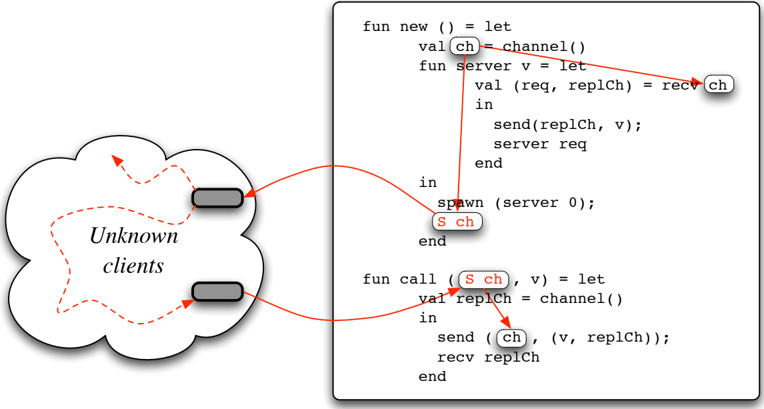
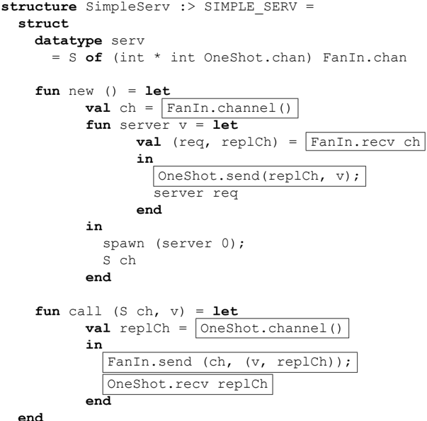
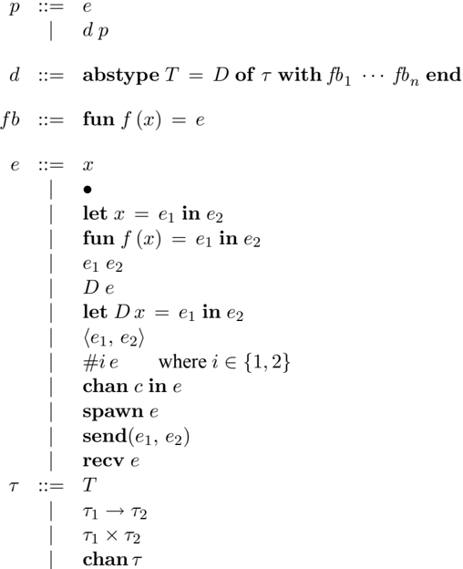
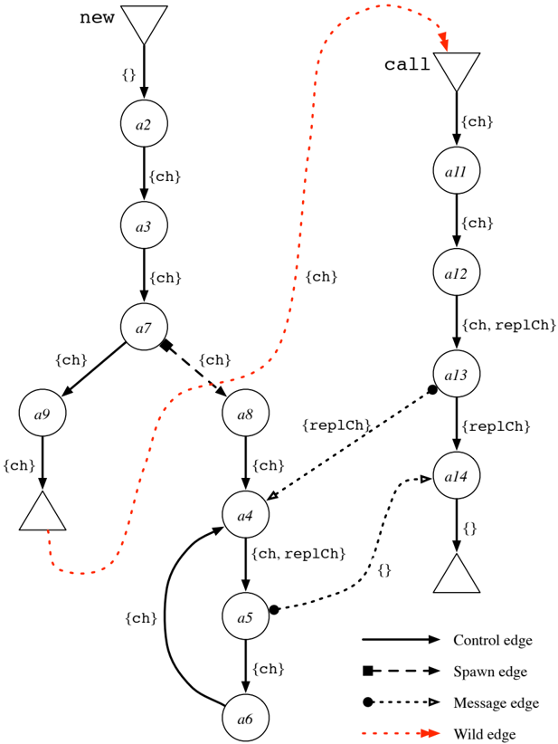
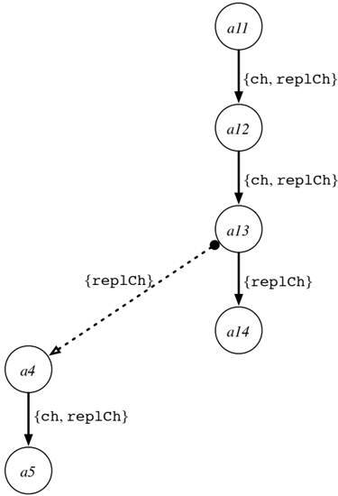

## TOWARD OPTIMIZATION OF CONCURRENT ML

## YINGQI XIAO THE UNIVERSITY OF CHICAGO

## ADVISOR: JOHN REPPY

## DECEMBER 2005

## Abstract

Concurrent ML (CML) is a statically-typed higher-order concurrent language that is embedded in Standard ML. Its most notable feature are fi rst-class synchronous operations , which allow programmers to encapsulate complicated communication and synchronization protocols as first-class abstractions. This feature encourages a modular style of programming, where the actual underlying channels used to communicate with a given thread are hidden behind data and type abstraction.

While CML has been in active use for well over a decade, little attention has been paid to optimizing CML programs. In this paper, we present a new program analysis for statically-typed higher-order concurrent languages that is a significant step toward optimization of CML. Our technique is modular ( i.e. , it analyses and optimizes a single unit of abstraction at a time), which plays to the modular style of many CML programs. The analysis consists of two major components: the first is a type-sensitive control-flow analysis that uses the program's type-abstractions to compute more precise results. We then construct a control-flow graph from the results of the CFA and analyze the flow of known channel values using the graph. Our analysis is designed to detect special patterns of use, such as one-shot channels, fan-in channels, and fan-out channels. These special patterns can be exploited by using more efficient implementations of channel primitives. We show that our analysis is correct.

## 1 Introduction

Concurrent ML (CML) [Rep91, Rep99] is a statically-typed higher-order concurrent language that is embedded in Standard ML [MTHM97]. CML extends SML with synchronous message passing over typed channels and a novel abstraction mechanism, called first-class synchronous operations , for building synchronization and communication abstractions. This mechanism allows programmers to encapsulate complicated communication and synchronization protocols as firstclass abstractions, which encourages a modular style of programming, where the actual underlying channels used to communicate with a given thread are hidden behind data and type abstraction. CML has been used successfully in a number of systems, including a multithreaded GUI toolkit [GR93], a distributed tuple-space implementation [Rep99], and a system for implementing partitioned applications in a distributed setting [YYS + 01]. The design of CML has inspired many implementations of CML-style concurrency primitives in other languages. These include other implementations of SML [MLt], other dialects of ML [Ler00], other functional languages, such as HASKELL [Rus01], SCHEME [FF04], our own MOBY language [FR99], and other high-level languages, such as JAVA[Dem97].

While CML has been in active use for well over a decade, little attention has been paid to optimizing CML programs. In this paper, we present a new program analysis for statically-typed higherorder concurrent languages that is a significant step toward optimization of CML. Our technique is modular ( i.e. , it analyses and optimizes a single unit of abstraction at a time), which plays to the modular style of many CML programs. The analysis consists of two major components. The first is a new twist on traditional control-flow analysis (CFA) that we call type-sensitive CFA [Rep05]. This analysis is a modular 0-CFA that tracks values of abstract type ( i.e. , types defined in the module that are abstract outside the module) that escape 'into the wild.' Because of type abstraction, we known that any value of an abstract type that comes in from the wild must have previously escaped from the module. The second component is a data-flow analysis that uses an extended control-flow graph (CFG) constructed from the result of the CFA. This extended CFG has extra edges to represent process creation, values communicated by message-passing, and values communicated via the outside world (a.k.a. the wild). Our analysis computes an approximation of the number of processes that send or receive messages on the channel, as well as an approximation of the number of messages sent on the channel. This information allows us to detect special patterns of use (or topologies), such as one-shot channels, fan-in channels, and fan-out channels. These special patterns can then be exploited by using more efficient implementations of channel primitives.

The paper has the following organization. In the next section, we discuss various specialized versions of channel operations. We also present an example of a prototypical server as is found in many CML applications and use it to illustrate the opportunities for specialized communication. In Section 3, we define the small concurrent language that we use to present our analysis and we give a dynamic semantics for it. This semantics has the property that it explicitly tracks the execution history of individual processes; we use these execution histories to characterize the dynamic prop- erties of channels that must be guaranteed to safely use the specialized forms. The main technical content of the paper is the presentation of our analysis, which we break up into five sections. In Section 4, we present the type-sensitive CFA for our language. The full details of our algorithm is presented in Section A. This analysis is defined for a single unit of abstraction (e.g., module) and its result allows us to characterize a subset of the defined channels as known channels ; i.e. , channels whose send and receive sites are all statically known. We then present the construction of the extended CFG in Section 5. The edges in this graph are labeled with the set of known channels that are live across the edge. In Section 6, we describe the analysis of the CFG that results in an approximation of the module's communication topology and the static properties that allow safe specialization of communication primitives. The correctness of our analysis is proved In Section 7. The full details of proof is presented in Section B. We then revisit the example from Section 2 and present the extended CFG for the example and its analysis. We discuss related work in Section 9 and the implementation status and future work in Section 10. Finally we conclude in Section 11.

## 2 Specialization of communication primitives

The underlying protocols used to implement CML's communication and synchronization primitives ( e.g. , channels) are necessarily general, since they must function correctly and fairly in arbitrary contexts. In practice, most uses of these primitives fall into one of a number of common patterns that may be amenable to more efficient implementation. As is often the case, the hard part of this optimization technique is developing an effective, but efficient, analysis that identifies when it is safe to specialize.

CML's design emphasizes a modular programming style based on user-defined concurrency abstractions. While the motivation for this programming style is to promote more robust software, it also allows modular analysis algorithms to compute high-quality information which can enable useful optimizations. In particular, the abstraction provided by user-defined communication mechanisms allows our modular analysis to effectively determine the communication topology which describes how threads communicate with each other on channels. In this section, we explain how specific communication topologies can lead to more efficient implementation and discuss the problem of determining such topologies via static program analysis.

## 2.1 Specialized channel operations

In general, a CML channel must support communication involving multiple sending and receiving processes transmitting multiple messages in arbitrary contexts. This generality requires a compli- cated protocol to implement with commiserate overhead. 1 Because of this generality, the protocol used to implement channel communication involves locking overhead. In practice, however, many (if not most) channels are used in restricted ways, such as for point-to-point and single message communication. Assuming that the basic communication primitive is a buffered channel, then we consider the following possible communication topologies:

| senders   | number of receivers   | messages   | topology              |
|-----------|-----------------------|------------|-----------------------|
| ≤ 1       | ≤ 1                   | ≤ 1        | one-shot              |
| ≤ 1       | ≤ 1                   | > 1        | point-to-point        |
| ≤ 1       | > 1                   | > 1        | one-to-many (fan-out) |
| > 1       | ≤ 1                   | > 1        | many-to-one (fan-in)  |
| > 1       | > 1                   | > 1        | many-to-many          |

In this table, the notation &gt; 1 denotes the possibility that more than one thread or message may be involved and the notation ≤ 1 denotes that at most one thread or message is involved. For example, a point-to-point topology involves arbitrary numbers of messages, but at most one sender and receiver. An analysis is safe if whenever it approximates the number of messages of threads as ≤ 1 , then that property holds for all possible executions. It is always safe to return an approximation of &gt; 1 .

We believe that specialized implementations of channel operations (and possibly channel representations) can have a significant impact on communication overhead. For example, CML provides I-variables , which are a form of synchronous memory that supports write-once semantics [ANP89]. Using I-variables in place of channels for one-shot communications can reduce synchronization and communication costs by 35% [Rep99]. Demaine [Dem98] proposes a dead-lock free protocol for the efficient implementation of a generalized alternative construct, where fan-out and fan-in channel operations can be implemented with fewer message cycles per user-level communication than many-to-many channel operations. Thus, we expect these specialized channel operations can be implemented more efficiently for distributed or multithreaded implementations.

While programmers could apply these optimizations by hand, doing so would complicate the programming model and lead to less reliable software. Furthermore, correctness of the protocol depends on the properties of the chosen primitives. Changes to the protocol may require changes in the choice of primitives, which makes the protocol harder to maintain. For these reasons, we believe that an automatic optimization technique based on program analysis and compiler transformations is necessary.

1 Chapter 10 of Concurrent Programming in ML describes CML's implementation, while Knabe has described a similar protocol in a distributed setting [Kna92].

## 2.2 An example

To illustrate how the analysis and optimization might proceed, consider the simple service implemented in Figure 1. 2

The new function creates a new instance of the service by allocating a new channel and spawning a new server thread to handle requests on the channel. The representation of the service is the request channel, but it is presented as an abstract type. The call function sends a request to a given instance of the service. The request message consists of the request and a fresh channel for the reply. Because the connection to the service is represented as an abstract type, we know that even though it escapes out of the SimpleServ module, it cannot be directly accessed by unknown code. Figure 2 illustrates the data-flow of the service's request channel. Specifically, we observe the following facts:

- For a given instance of the service, the request channel has a many-to-one (or fan-in) communication pattern.
- For a given client request, the reply channel is used at most once and has a one-to-one (or one-shot) communication pattern.

We can exploit these facts to specialize the communication operations, which results in the optimized version of the service shown in Figure 3. We have highlighted the specialized code and have assumed the existence of a module FanIn that implements channels specialized for the many-toone pattern and a module OneShot that is specialized for one-shot channels.

Because of the signature ascription, we know all of the send and receive sites for the ch and replCh channels, but if we added the function

```
fun reveal (S ch) = ch
```

to the service's interface, then the above transformation would no longer be safe, since clients could use the reveal function to gain direct access to the server's request channel and use it to send and receive messages in ways not supported by the specialized channels.

The technical challenge is to develop program analyses that can detect the patterns described in Section 2.1 automatically when they are present, but also recognize the situation where access to the channel is not limited (as with the reveal function). Other issues that the analysis must address is distinguishing between multiple threads that are created at the same spawn point. For example, say we have

2 To keep the example concise, we use direct operations on channels instead of CML's event operations, but the analysis handles event values without difficulty.

```
signature SIMPLE_SERV =
  sig
    type serv
    val new : unit -> serv
    val call : (serv * int) -> int
  end

structure SimpleServ :: SIMPLE_SERV =
  struct
    datatype serv = S of (int * int chan) chan

    fun new () = let
          val ch = channel()
          fun server v = let
                val (req, replCh) = recv ch
                in
                  send(replCh, v);
                  server req
                end
          in
            spawn (server 0);
            S ch
          end

    fun call (S ch, v) = let
        val replCh = channel()
        in
            send (ch, (v, replCh));
            recv replCh
        end
  end

Figure 1: A simple service with an abstract client-server protocol
```

Figure 1: A simple service with an abstract client-server protocol



In this image, we can see a tree diagram with a few nodes. The nodes are connected with arrows.<end_of_utteranc

Figure 2: Data-flow of the server's request channel

```
fun twice f = (f ()); f ())

```

and we create two servers sharing a common request channel using the code

```
twice (fn () => spawn(server 0)) );
```

Then our analysis should detect that the request channel ch is not a fan-in channel. Note, however, that replCh is still a one-shot channel.

## 3 A concurrent language

We present our algorithm in the context of a small statically-typed concurrent language. This language is a monomorphic subset of Core SML [MTHM97] with explicit types and concurrency primitives. Standard ML and other ML-like languages use modules to organize code and signature ascription to define abstraction. For this paper, we use the abstype declaration to define abstractions in lieu of modules. We further simplify this declaration form to only have a single data constructor. Figure 4 gives the abstract syntax for this simple language. A program p is a sequence of zero or more abstype declarations followed by an expression. The analysis that we present below is modular and works on each abstype declaration ( d ) independently. Each abstype definition defines a new abstract type ( T ) and corresponding data constructor ( C ) and a collection of functions ( fb i ). Outside the abstype declaration, the type T is abstract ( i.e. , the data constructor C is not in scope). The sequential expression forms include let-bindings, nested function bindings, function application, data-constructor application and deconstruction, 3 and pair construction and projection. In addition, there are four concurrent expression forms: channel definition, process spawning, message sending, and message receiving. Types include abstract types ( T ), function types, pair types, and channel types. Abstract types are either predefined types ( e.g. , unit , int , bool , etc. ) or are defined by an abstype declaration.

Figure 3: A version of Figure 1 with specialized communication operations



In this image, we can see a diagram.<end_of_utteranc

This language does not include CML's event types or the corresponding event combinators, but based on experience with our prototype implementation, we believe that it is fairly straightforward to add these to the analysis framework, so we omit them to keep the presentation more compact.

3 In a language with sum types, deconstruction would be replaced by a case expression.

Figure 4: A simple concurrent language



In this image there is a table.<end_of_utteranc

We assume that variables, abstract-type names, and data-constructor names are globally unique. We also assume that variables and constructors are annotated with their type. We omit this type information most of the time for the sake of brevity, but, when necessary, we write it as a superscript ( e.g. , x τ ). One should think of this language as a compiler's intermediate representation following typechecking.

We use LVAR to denote the set of variables defined in the program, GVAR to denote variables defined elsewhere, and VAR = LVAR ∪ GVAR for all variables defined or mentioned in the program. We denote the known function identifiers by FUNID ⊂ LVAR ( i.e. , those variables that are defined by function bindings) and the known channel identifiers by CHANID ⊂ LVAR ( i.e. , those variables that are defined by channel bindings). The set ABSTY is the set of abstract type names and DATACON is the set of data constructors.

## 3.1 Dynamic semantics

Following Colby [Col95], the semantics for our language tracks execution history on a per-process basis. This information is necessary to characterize the dynamic usage of channels. Since abstype declarations do not play a rˆ ole in the dynamic semantics of the language, we think of a program as a sequence of nested function bindings. For example,

<!-- formula-not-decoded -->

<!-- formula-not-decoded -->

In the dynamic semantics for our language, we represent the state of a computation as a tree, where nodes are process states and edges represent transition from the parent to the child. Branches in the tree represent process creations. For a given program p , we assume that each expression in p is labeled with a unique program point a ∈ PROGPT. We write a : e to denote that e is the expression at program point a . Furthermore, we assume that for each a ∈ PROGPT, there is a ¯ a ∈ PROGPT. The ¯ a labels are not used to label expressions, but serve to distinguish between parent and child threads in control paths. A control path is a finite sequence of program points: CTLPATH = PROGPT ∗ . We use π to denote an arbitrary control path and juxtaposition to denote concatenation. We say that π ⪯ π ′ if π is a prefix of π ′ . Control paths are used to uniquely label dynamic instances of channels, which we write c @ π , where c ∈ CHANID. We also use k to denote dynamic channel values, and K to denote all the dynaic channel values.

Evaluation of the sequential features of the language follows a standard small-step presentation based on evaluation contexts [FF86]. We modify the syntax of expression terms to distinguish values as follows:

<!-- formula-not-decoded -->

The unit value ( · ) was already part of the syntax, but we add function values, dynamic channel values, and pairs of values. With these definitions, we can define the sequential evaluation relation e ⇝ e ′ by the rules in Figure 5. Evaluation contexts are defined in the standard call-by-value way:

is treated as

<!-- formula-not-decoded -->

Figure 5: Sequential evaluation

<!-- formula-not-decoded -->

We use these below in the definition of concurrent evaluation.

For the semantics of concurrent evaluation, we represent the state of a computation as a tree, where the nodes of the tree are labeled with expressions representing process states and edges are labeled with the program point corresponding to the evaluation step taken from the parent to the child. The leaves of the tree represent the current states of the processes in the computation. Because a tree captures the history of the computation as well as its current state, we call it a trace . Nodes in a trace are uniquely named by control paths that describe the path from the root to the node. In defining traces, it is useful to view them as prefix-closed finite functions from control paths to expressions. If t is a trace, then we write t.π to denote the node one reaches by following π from the root, and if t.π is a leaf of t , a is a program point, and e an expression, then t ∪ { πa ↦→ e } is the trace with a child e added to t.π with the new edge labeled by a . For a program p , the initial trace will be the map { ϵ ↦→ p } , where ϵ is the empty control path. Let p be a program and let c be a channel identifier in p . For any trace t ∈ Trace( p ) and k = c @ π occurring in t , we define the dynamic send and receive sites of k as follows:

<!-- formula-not-decoded -->

To record the communication history between the dynamic send and receive sites, we define the communication history set H as follows:

<!-- formula-not-decoded -->

where ( π 1 , k, π 2 ) ∈ H if there is communication between the dynamic receive site π 1 and send site π 2 on channel instance k .

We define concurrent evaluation as the smallest relation ( ⇒ ) satisfying the following four rules. The first rule lifts sequential evaluation to traces.

<!-- formula-not-decoded -->

The second rule deals with channel creation.

<!-- formula-not-decoded -->

The third rule deals with process creation.

<!-- formula-not-decoded -->

The last rule deals with communication.

<!-- formula-not-decoded -->

The set of traces of a program represents all possible executions of the program. It is defined as

<!-- formula-not-decoded -->

## 3.2 Properties of traces

We say that c has the single-sender property if for any t ∈ Trace( p ) , k = c @ π occurring in t , and π 1 , π 2 ∈ Sends t ( k ) , either π 1 ⪯ π 2 or π 2 ⪯ π 1 . The intuition here is that if π 1 ⪯ π 2 then π 1 is before π 2 and the sends can not be concurrent. On the other hand, if π 1 and π 2 are not related by ⪯ , then they may be concurrent. 4 Note that the single-sender property allows multiple processes to send messages on a given channel, they are just not allowed to do it concurrently. Likewise, we say that c has the single-receiver property if for any t ∈ Trace( p ) , k = c @ π occurring in t , and π 1 , π 2 ∈ Recvs t ( k ) , either π 1 ⪯ π 2 or π 2 ⪯ π 1 .

We can now state the special channel topologies from Section 2.1 as properties of the set of traces of a program. For a channel identifier c in a program p , we can classify its topology as follows:

- The channel c is a one-shot channel if for any t ∈ Trace( p ) and k = c @ π occurring in t , | Sends t ( k ) | ≤ 1 .

4 There may be other causal dependencies, such as synchronizations, that would order π 1 and π 2 , but our model does not take these into account.

- The channel c is point-to-point if it has both the single-sender and single-receiver properties.
- The channel c is a fan-out channel if it has the single-sender property, but not the singlereceiver.
- The channel c is a fan-in channel if it has the single-receiver property, but not the singlesender.

Our analysis computes safe approximations of these properties, which we describe in Section 6.1.

## 4 Type-sensitive control-flow analysis for CML

The first step in our analysis is a type-sensitive control-flow analysis (CFA) [Rep05]. This analysis is based on Serrano's 0-CFA algorithm [Ser95], but has the additional property that it exploits type abstraction, such as provided by ML signature ascription or abstype definitions, to track escaping values. The full details of our algorithm can be found in the appendix A; here we cover main ideas of 0-CFA and those aspects of the analysis that are unique to our situation.

## 4.1 Introduction of 0-CFA

Traditional compiler optimization techniques require a knowledge of the control flow of programs. Control flow analysis serves to construct such control flow graph for programs. Higher-order programming languages (HOL) such as Scheme and ML, allow programs to take functions as first class values, where functions can be passed as arguments to other functions and returned as results from functions calls. Therefore, for HOL, control-flow and data-flow interdepend on each other; the control-flow can not be be determined from the program text at compile time.

This fact makes optimization for higher-order languages harder than for first-order languages. Shivers defines his control flow analysis for Scheme in [Shi88], called 0-CFA. Shivers's algorithm uses continuation passing style (CPS) as intermediate language. By CPS representation, all control transfers are represented by tail recursive function calls. Thus control-flow graph construction reduces to determing the set of all functions that could be called from each call site. Note that in Shivers's analysis, a function is represented as a lambda/contour. His analysis computes a approximation of that set by using a abstract interpretation. The analysis is called zeroth order control flow analysis, because the approximation identifies all functions that have the same lambda expressions. Although this approximation may introduce more control-flow edges than exist at runtime, it is safe; that is, any control-flow edge at runtime is included in the control-flow graph. Serrano's 0-CFA adapts Shivers' analysis to deal with the full Scheme language, which is direct style instead of CPS. The analysis also statically computes an approximation of the set of functions that could be called from each call site. Our analysis described below is based on Serrano's algorithm.

## 4.2 Abstract values

Our analysis computes a mapping from variables to approximate values, which are given by the following grammar:

<!-- formula-not-decoded -->

where D ∈ DATACON, F ∈ 2 FUNID , C ∈ 2 CHANID , and T ∈ ABSTY. We use ⊥ to denote undefined or not yet computed values, Dv for an approximate value constructed by applying D to v , 〈 v 1 , v 2 〉 for an approximate pair, F for a set of known functions, and C for a set of known channels. Our analysis will only compute sets of functions F and sets of channels where all the members have the same type (see [Rep05] for a proof of this property) and so we extend our type annotation syntax to include such sets. In addition to the single top value found in most presentations of CFA, we have a family of top values ( ̂ τ ) indexed by type. The value ̂ τ represents an unknown value of type τ (where τ is either a function or abstract type). The auxiliary function U : TYPE → VALUE maps types to their corresponding top value:

<!-- formula-not-decoded -->

Lastly, the ⊤ value is used to cutoff expansion of recursive types as described below.

We define the join of two approximate values as follows:

<!-- formula-not-decoded -->

̂

̂

Note that this operation is not total, but it is defined for any two approximate values of the same type and we show in [Rep05] that it preserves types. One technical complication is that we need to keep our approximate values finite; we discuss this issue in the appendix.

## 4.3 Type-sensitive CFA

Our analysis algorithm computes a 4-tuple of approximations: A = ( V , C , R , T ) , where

V ∈ VAR → VALUE

C ∈ CHANID → VALUE

variable approximation

channel message approximation

R ∈ FUNID → VALUE function-result approximation

T ∈ ABSTY → VALUE

escaping abstract-value

approximation

Our V approximation corresponds to Serrano's A . The C approximation is an approximation of the messages sent on a given known channel; the R approximation records an approximation of function results for each known function; this approximation is used in lieu of analyzing a function's body when the function is already being analysed and is needed to guarantee termination. We use the T approximation to interpret abstract values of the form ̂ T .

Our algorithm follows the same basic structure as that of Serrano[Ser95], so we only cover the major differences here. The appendix has the complete algorithm. One major difference is the treatment of escaping values. In Serrano's analysis (and any other modular CFA that we are aware of), escaping values are treated conservatively. For example, the analysis assumes that any escaping function can be called on any value, so the functions parameters are approximated as ⊤ . For escaping channels, this would mean assuming arbitrary senders and receivers and arbitrary messages, which would make modular analysis of typical CML modules, such as our example, useless. To avoid this problem, our analysis tracks escaping values of abstract type by recording them in the T approximation. In turn, T is used to approximate values of abstract type that come in from the wild.

The other major difference from Serrano's algorithm is that our language has channels. Send operations on channels are treated much the same way as function calls. If the approximation of the first argument to a send is C and the second argument is v , then we add v to the approximation of message values sent on each channel c ∈ C . We use C to track this information. The message receive operation is treated much like a function entry, the possible values are taken from the C approximation.

## 4.4 Properties

The analysis presented in the previous section allows one to compute certain static approximations of the dynamic properties described in Section 3.2. Figure 6 gives the approximation of the send

<!-- formula-not-decoded -->

Figure 6: Approximation of channel send and receive sites

and receive sites for a given channel. If the channel escapes (denoted Esc( c ) ), then we use ⊤ to denote the set. A channel for which we know all of the send and receive sites is called a known channel .

## 5 The extended CFG

With the information from the CFA in hand, the next step of our analysis is to construct an extended control-flow graph (CFG) for the module that we are analyzing. We then use this extended CFG to compute approximate trace fragments that can be used to analyse the topology of the program.

There is a node in the graph for each program point; in addition, there are is an entry and exit node for each function definition. A node with a label a corresponds to the point in the program's execution where the next redux is labeled with a . The graph has four kinds of edges. The first two of these represent control flow, while the other two are used to trace the flow of channel values.

1. Control edges represent normal sequential control-flow.
2. Spawn edges represent process creation. If there is an expression a 1 : spawn e and a 2 is the label of the first redux in e , then there will be a spawn edge from a 1 to a 2 .
3. Message edges are added from send sites to known receiver sites.
4. Wild edges are added to represent the potential flow of abstract values from functions in the module to another.

The graph is constructed such that following a control edge from a 1 to a 2 corresponds to an edge labeled with a 1 in a trace that leads to the trace node labeled by a 2 . Similarly, following a spawn edge from a 1 to a 2 corresponds to ¯ a 1 in a trace. More formally, the sets of nodes and edges are defined to be

```
n = NODE   =   PROGPTU (FUNID x {entry, exit})
		EGLABEL   =   {ctl,spawn, msg, wild}
			EDGE   =   NODE x EGLABEL x NODE
	G = GRAPH   =   2"NODE x 2"EDGE

```

The successors of a node n in a graph G are defined to be Succ G ( n ) = { n ′ | ( n, l, n ′ ) is an edge in G } .

Constructing the CFG is done in three steps. First we create the basic graph with control and spawn edges in the obvious way. One important point is that we use the results of the CFA to determine the edges from call sites to known functions. Note that because we are only interested in tracking known channels, which by definition cannot have escaped the module, we can ignore calls to unknown functions when constructing the graph. Message edges are added in much the same way as control edges for known function calls. Let a : send ( e 1 , e 2 ) be a send in the program and assume that the CFA computed C as the approximation of e 1 . Then for each channel c ∈ C and a ′ ∈ ̂ RecvSites( c ) , we add a send edge from a to a ′ to the graph. We add wild edges from any site where an abstract value escapes the module to any site where such a value can return from the wild. And we add wild edges from any site where an abstract value escapes the module to any receive site of unknown channels. Once we have constructed the graph, we use a liveness analysis to label the edges with the set of known channels that are live across the edge. As described in the next section, we use these edge labels to limit the scope of the analysis on a per-channel basis.

## 6 Analyzing the CFG

The final stage of our analysis involves using the CFG to determine the communication topology. We do this analysis independently for each channel starting at the CFG node that corresponds to the site where the channel is created. Because the analysis is concerned with only a single channel c at a time, we can ignore those parts of the graph where c is not live (essentially remove any edge that does not contain c in its label set). The analysis computes a finite map ̂ P that maps program points to an approximation of the control paths that one follows to get to the program point.

<!-- formula-not-decoded -->

where the set of abstract control paths is defined by the syntax

<!-- formula-not-decoded -->

For an approximate control paths ̂ π , we split the path into a process ID part before the ' : ' and a path. The process ID can either be ' ∗ ', which is used to represent an unknown set of processes, or a path that uniquely identifies the process. We define an ordering ⊑ on abstract control paths as follows: π 1 : π ′ 1 ⊑ π 2 : π ′ 2 if π 1 = π 2 and π ′ 1 ⪯ π ′ 2 . In other words, ̂ π 1 ⊑ ̂ π 2 if they are in the same process and ̂ π 1 is a prefix of ̂ π 2 . The following notation is used to project the process ID part from an approximate control path:

<!-- formula-not-decoded -->

We lift ̂ Proc to sets of control paths in the standard way. If A is a set of approximate control paths, then we define the number of distinct processes in A as follows:

<!-- formula-not-decoded -->

The analysis of the CFG is defined by a pair of mutually recursive functions:

<!-- formula-not-decoded -->

The definition of these functions can be found in Figure 7, where ̂ P empty = { a ↦→∅| a ∈ PROGPT } is the finite map that assigns the empty path set to every program point. If a known channel c is defined at a : chan c in e , then we compute ̂ P c = N c G [ [ a ] ] ϵ : ϵ ̂ P empty .

The N c G function is defined based on the kind of graph node. For a function entry it follows the unique control edge to the first program point of the function, for a function exit it computes the union of the analysis for all outgoing edges. These edges will either be control edges to f 's call sites, when f is a known function, or wild edges, when f is an escaping function. For programpoint nodes, we have three subcases. If the approximation ̂ P already contains a path pid : π 1 aπ 2 that precedes ̂ π and pid : π 1 ∈ ̂ P ( a ) , then we have looped (the loop is a → π 2 → a ) and can stop. If the number of processes that can reach the program point a is greater than one, then we stop. 5 Otherwise, we record the visit to a in ̂ P ′ and compute the union over the outgoing edges.

The E c G function is defined by cases on the edge kind. When the edge is a control edge, we analyze the destination node passing the extended path ̂ πa . When the edge is a spawn edge, we analyze the destination node passing a new process ID paired with the empty path. For message edges, we analyze the receive site using the extended control path to send-site program point as a new process ID. This choice of process ID distinguishes the send from other sends that target the same receive sites, but in conflates multiple receive sites that are targets of the same send, which is safe since only one receive site can actually receive the message. For wild edges, we analyze the destination node using ' ∗ ' as the process ID. This value represents the fact than any number of threads might call the target of the wild edge with the same dynamic instance of the channel c .

5 Recall that we are interested in channels that have single senders or receivers.

<!-- formula-not-decoded -->

Figure 7: Analyzing the CFG G for channel c

## 6.1 Static classification of channels

Once we have computed ̂ P c for a known channel c , we can statically classify the channel by examining ̂ P . First we define the approximate send and receive contexts for c as follows:

<!-- formula-not-decoded -->

These are the static approximations of the Sends and Recvs sets from Section 3.1. We say that a known channel c has the static single sender (resp. static single receiver ) property if ̂ NumProcs( ̂ S c ) ≤ 1 (resp. ̂ NumProcs( ̂ R c ) ≤ 1 ). The static classification of channels then follows the dynamic classification from Section 3.1.

̸

- If ̂ NumProcs( ̂ S c ) ≤ 1 and ̸ ∃ ̂ π 1 , ̂ π 2 ∈ ̂ S c with ̂ π 1 = ̂ π 2 and ̂ π 1 ⊑ ̂ π 2 , then c is a one-shot channel.
- If c has both the static single-sender and static single-receiver properties, then it is a point-topoint channel.
- If c has the static single-sender property, but not the static single-receiver, then it is a fan-out channel.
- If c has the static single-receiver property, but not the static single-sender, then it is a fan-in channel.

## 7 Algorithm Soundness

In this section, we show that the static classification of channels from Section 6 correctly follows the dynamic classfication from Section 3.2, that is, Our analysis computes safe approximations of the properties from Section 3.2. The full details about proof can be found in the appendix B; here we cover the ideas underlying the proof. For our notation, we use π ( i ) to denote the i-th program point in π from left, and π ( -i ) to denote the i-th program point in π from right. Let p be a program and let c be a channel identifier in p .

Given any channel instance k in trace t ∈ Trace ( p ) , the following definitions gives us the circumstance in which our analysis will be considered.

Definition 1 For any channel instance k in trace t ∈ Trace ( p ) , the live projection of trace t on k denoted by t ↓ k is the forest created by removing all the nodes from t in which k dose not occur.

We say π is in t ↓ k , if for any two adjacent nodes π ( i ) , π ( i +1) occurring in π , there is a edge from π ( i ) to π ( i +1) in t ↓ k . Note that ϵ is in any t ↓ k .

Definition 2 For any channel instance k in trace t ∈ Trace ( p ) , and control path π in t , the live projection of π on k is denoted by π ↓ k s.t.

<!-- formula-not-decoded -->

Given any path π in t ∈ Trace ( p ) , π may contain program points in the wild. However, our CFG only consists of nodes with program points in the module. Then we use the following definitions and lemma to relate paths in the CFG with paths in the trace.

Given any path π in t ∈ Trace ( p ) , the following definition of Partition : PATH → PATH ∗ partitions the π into sub-paths which are in the module or in the wild.

Definition 3 For any path π in t ∈ Trace ( p ) , Partition ( π ) = &lt; π 1 , π 2 , ..., π m &gt; , where π 1 π 2 ...π m = π and for any π i ∈ Partition ( π ) , π i is the longest sub-path in π s.t. the program points in π i are either all in the module or all in the wild.

Given any path π in t ∈ Trace ( p ) and Partition ( π ) = &lt; π 1 , π 2 , ..., π m &gt; , the following definition of ApproxPath : PATH → PATH gives us the paths in our CFG corresponding to π i ∈ Partition ( π ) .

## Definition 4

<!-- formula-not-decoded -->

Given any trace t of program p , channel instance k in t , and any path π in t ↓ k , the following lemma shows that there is an approximation path in our CFG corresponding to the path.

Lemma 1 For any trace t ∈ Trace ( p ) , channel instance c @ π ′ , and any path π in t ↓ c @ π ′ , ∃ ̂ π = ApproxPath ( π 1 ) ...ApproxPath ( π m ) ∈ ̂ G c , where &lt; π 1 , ..., π m &gt; = Partition ( π )

Although Lemma 1 shows that there is a corresponding approximation path in our CFG, our analysis algorithm starts from channel instance creation site. The following definition and lemma show that there is an approximation path in our CFG starting from instance creation site and reaching the corresponding approximation path; that is that our algorithm will traverse the corresponding approximation path if needed.

Given any trace of program p , channel instance in that trace, and any control path in that trace, the following definition of PathH tk : PATH → PATH ∗ gives us the history in which channel instance k goes through in trace t . For example, PathH tk ( π ) = &lt; π 1 , π 2 &gt; , this means from creation site of k the program follows path π 1 reaching sendsite of some other channel, and over the channel value k is sent to π 2 , and π 2 is the live projection of π on k .

Definition 5 For any trace t ∈ Trace ( p ) , channel instance k = c @ π ′ , and control path π ∈ Sends t ( k ) ∪ Recvs t ( k ) , let π = π ′′′ π ′′ where π ′′ = π ↓ k ,

<!-- formula-not-decoded -->

Given any trace of program p , channel instance in that trace, and any control path in that trace, the following lemma shows that there is an approximation path in our CFG corresponding to the communication history of that control path, that is, our analysis algorithm will traverse the control path if needed.

Lemma 2 For any trace t ∈ Trace ( p ) , channel instance k , and control path π ∈ Sends t ( k ) ∪ Recvs t ( k ) , ∃ ̂ π = ̂ π 1 ̂ π 2 ... ̂ π m ∈ ̂ G c , where PathH tk ( π ) = &lt; π 1 , ..., π m &gt; .

Although Lemma 2 shows that our analysis algorithm will traverse the approximation path corresponding to the control path's communication history if needed, we still need to show that our static classification of the channel holds the properties of all traces of the program. Theorem OneShot Soundness shows that if there are more than one control path in some trace reaching to the channel sendsite, then our analysis algorithm will not classify the channel as oneshot channel. Theorem Single Sender (Receiver) Soundness shows that if there is more than one process which sent(received) message over the channel instance, then our analysis algorithm will not classify the channel as single sender(receiver) channel.

## Theorem 3 ONE-SHOT SOUNDNESS

̸

If ∃ t ∈ Trace ( p ) s.t. for any channel instance c @ π in t , | Sends t ( c @ π ) | ≥ 2 , then ∃ ̂ π 1 , ̂ π 2 ∈ ̂ S c s.t. ̂ π 1 = ̂ π 2 , or ̂ NumProcs( ̂ S c ) ≥ 2 .

## Theorem 4 SINGLE-SENDER SOUNDNESS

If ∃ t ∈ Trace ( p ) and for any channel instance c @ π in t , ∃ π , π ∈ Sends ( c @ π )

̸

1 2 t , ̂ .

Proc ( π 1 ) = Proc ( π 2 ) , then ̂ NumProcs( S c ) ≥ 2

## Theorem 5 SINGLE-RECEIVER SOUNDNESS

If ∃ t ∈ Trace ( p ) and for any channel instance c @ π in t , ∃ π , π ∈ Recvs ( c @ π ) ,

̸

1 2 t Proc ( π 1 ) = Proc ( π 2 ) , then ̂ NumProcs( ̂ R c ) ≥ 2 .

## 8 Analyzing the example

To understand the CFG construction and the intuition behind the analysis, we revisit the example of Figure 1. We recast this example using the notation of our simple language (with a few syntactic liberties) and include program-point labels.

```
end include program-point labels.

          a1 :   fun new () = (
          a2 :     chan ch in
          a3 :     fun server v = (
          a4 :     let (w', replCh') = recv ch in
          a5 :       send (replCh', v);
          a6 :       server w')
                  in
          a7 :     spawn (a8: server 0);
          a9 :      S ch)

        a0 :   fun call (s, w) = (
        a11 :     let S ch' = s in
        a12 :     chan replCh in
        a13 :      send (ch, (w, replCh));
        a14 :      recv replCh)

for this example will produce the following information
```

The CFA for this example will produce the following information

```
Synchronize(ch)   =   {a1y}
            RecvSites(ch)   =   {a4}
        Synchronize(replCh)   =   {a5}
        RecvSites(replCh)   =   {a14}
```

Thus, both ch and replCh are known channels. The CFG for this example is given in Figure 8. We have labeled each edge with the set of known channels that are live across the edge.

There are three ways that a channel can be shared among multiple threads (and thus have multiple senders/receivers):

1. A process is spawned that has the channel in its closure. This is represented by the channel being in the label of the spawn edge (e.g., ch on the edge from a 7 to a 8 ).
2. The channel is sent in a message from one process to another. This is represented by the channel being in the label of the message edge (e.g., replCh on the edge from a 13 to a 4 ).
3. The channel escapes into the wild and then returns as the argument to an exported function. This is represented by the channel being in the label of a wild edge from the exit of one function to the entry of another (e.g., ch on the edge from the exit of new to the entry of call ).

Figure 8: The CFG for the example



In this image, we can see a diagram. In the diagram, we can see a line, a circle, a triangle, a square, a circle, a square, a triangle, a circle, a square, a circle, a square, a triangle, a circle, a square, a circle, a square, a triangle, a circle, a square, a circle, a square, a triangle, a circle, a square, a circle, a square, a triangle, a circle, a square, a circle, a square, a triangle, a circle, a square, a circle, a square, a triangle, a circle, a square, a circle, a square, a triangle, a circle, a square, a circle, a square, a triangle, a circle, a square, a circle, a square, a triangle, a circle, a square, a circle, a square, a triangle, a circle, a square, a circle, a square,

Figure 9: The sub-CFG for replCh



In this image, we can see a diagram with some text and numbers.<end_of_utteranc

When analyzing the usage pattern of the channels created at a given site, we restrict ourselves to the subset of the graph where the channel actually flows. For example, when analyzing the use of replCh (created at a 12 ), we restrict the analysis to the subgraph in Figure 9. Notice that although replCh is received by the server in its loop, the fact that replCh is not live after node a 5 means that we do not analyze the loop in this case and thus we avoid confusing different instances of replCh with each other. Computing ̂ P replCh = N replCh G [ [ a 12 ] ] ϵ : ϵ ̂ P empty results in

<!-- formula-not-decoded -->

From this information, we see that replCh is a one-shot channel.

<!-- formula-not-decoded -->

Figure 10: Analysis result for ch

The analysis for ch is more interesting, since it involves spawning, loops, and wild edges. Applying the analysis algorithm to the relevant subgraph produces the approximation shown in Figure 10.

where π = a 2 a 3 ¯ a 7 . From this approximation, we see that

<!-- formula-not-decoded -->

and thus ch is a fan-in channel.

## 9 Related work

There are a number of papers that describe various program analyses for message-passing languages such as CSP [Hoa78] and CML. These analyses can be organized by the techniques used. A number of researchers have used effect-based type systems to analyse the communication behavior of message-passing programs. Nielson and Nielson developed an effects-based analysis for detecting when programs written in a subset of CML have fi nite topology and thus can be mapped onto a finite processor network [NN94]. Debbabi et al. developed a type-based control-flow analysis for a CML subset [DFT96], but did not propose any applications for their analysis.

In addition to being used as the basis for analysis algorithms, type systems have been proposed that can be used to specify and verify properties of protocols. For example, Vasconcelos et al. have proposed a small message-passing language that uses session types to describe the sequence of operations in complex protocols [VRG04]. While this approach is not a program analysis, session types may be a useful way to represent behaviors in an analysis. In particular, the might provide an alternative to our sets of approximate control paths.

There have also been a number of abstract interpretation-style analyses of concurrent languages that are closer in style to the analysis we described in Section 4. Mercouroff designed and implemented an abstract-interpretation style analysis for CSP programs [Mer91] based on an approximation of the number of messages sent between processes. While this analysis is one of the earliest for message-passing programs, it is of limited utility for our purposes, since it is limited to a very static language. Jagannathan and Weeks proposed an analysis for parallel SCHEME programs that distinguishes memory accesses/updates by thread [JW94]. Unfortunately, their analysis is not fine-grained enough for our problem since it collapses multiple threads that have the same spawn point to a single approximate thread. Marinescu and Goldberg have developed a partial evaluation technique for CSP [MG97]. Their algorithm can eliminate redundant synchronization, like Mercouroff's work, it is limited to programs with static structure. Martel and Gengler have developed a control-flow analysis that determines an approximation of a CML program's communication topology [MG00]. The analysis uses finite automata to approximate the synchronization behavior of a thread and then extracts the topology from the product automata.

The closest work to ours is probably Colby's abstract-interpretation for a subset of CML [Col95], which analyses the communication topology of CML programs. His analysis is based on a semantics that uses control paths ( i.e. , an execution trace) to identify threads. Unlike using spawn points to identify threads (as in [JW94]), control paths distinguish multiple threads created at the same spawn point, which is a necessary condition to understand the topology of a program. The method used to abstract control-paths is left as a 'tunable' parameter in his presentation, so it is not immediately obvious how to use his approach to provide the information that we need. His analysis is also a whole-program analysis.

## 10 Status and future work

We have implemented the type-sensitive CFA for a language that is slightly larger than the one in the paper (it has tuples, basic values, conditionals, and a subset of the CML event combinators). We are extending this implementation to include the CFG construction and analysis. The next stage will be to extend the analysis to the full set of CML primitives and SML features, such as modules, datatypes, and polymorphism (see [Rep05] for a discussion of the latter). We are also implementing multi-threaded communication protocols for CML. The next stage will be to measure the performance benifit from specialized operations. Eventually, we plan to implement the analysis and optimization as a source-to-source tool for optimizing CML modules.

Another dimension of interest is whether a channel is used in choice contexts, since there is additional overhead in the implementation of channels to support fairness and negative acknowledgments in choice contexts. A channel that is not used in choice contexts can have a simpler, and more efficient, implementation. In the future, we plan to extend our analysis to specialize this kind of channel operations.

## 11 Conclusion

We have presented a new analysis technique for analyzing concurrent languages that use message passing, such as CML. Our technique is designed to be applied on individual units of abstraction ( e.g. , modules). For a given module it determines an approximation of the communication topology for the channels defined in the module. We have shown how this information can be used to replace general-purpose channel operations with more specialized ones.

The analysis consists of two major components. The first is a new variation of control-flow analysis that we call type-sensitive CFA. The type sensitivity of the analysis is what allows us to effectively analyze modules independently of their use. The second component of the analysis uses a CFG constructed from the CFA results to approximate the numbers of messages and processes involved in communicating with known channels.

We have presented the analysis for a simple concurrent language, but we expect that it will be straightforward to extend to richer languages. The analysis may also be useful for statically detecting other properties of concurrent programs ( e.g. , deadlock), but we have not explored this direction yet.

## References

- [ANP89] Arvind, R. S. Nikhil, and K. K. Pingali. I-structures: Data structures for parallel computing. ACM Transactions on Programming Languages and Systems , 11 (4), October 1989, pp. 598-632.
- [Col95] Colby, C. Analyzing the communication topology of concurrent programs. In PEPM'95 , June 1995, pp. 202-213.
- [Dem97] Demaine, E. D. Higher-order concurrency in Java. In WoTUG20 , April 1997, pp. 34-47. Available from http://theory.csail.mit.edu/˜edemaine/ papers/WoTUG20/ .
- [Dem98] Demaine, E. D. Protocols for non-deterministic communication over synchronous channels. In Proceedings of the 12th International Parallel Processing Symposium and

9th Symposium on Parallel and Distributed Processing (IPPS/SPDP'98) , March 1998, pp. 24-30. Available from http://theory.csail.mit.edu/˜edemaine/ papers/IPPS98/ .

- [DFT96] Debbabi, M., A. Faour, and N. Tawbi. Efficient type-based control-flow analysis of higher-order concurrent programs. In Proceedings of the International Workshop on Functional and Logic Programming, IFL'96 , vol. 1268 of LNCS , New York, N.Y., September 1996. Springer-Verlag, pp. 247-266.
- [FF86] Felleisen, M. and D. P. Friedman. Control operators, the SECD-machine, and the λ -calculus. In M. Wirsing (ed.), Formal Description of Programming Concepts - III , pp. 193-219. North-Holland, New York, N.Y., 1986.
- [FF04] Flatt, M. and R. B. Findler. Kill-safe synchronization abstractions. In PLDI'04 , June 2004. (to appear).
- [FR99] Fisher, K. and J. Reppy. The design of a class mechanism for Moby. In PLDI'99 , May 1999, pp. 37-49.
- [GR93] Gansner, E. R. and J. H. Reppy. A Multi-threaded Higher-order User Interface Toolkit , vol. 1 of Software Trends , pp. 61-80. John Wiley &amp; Sons, 1993.
- [Hoa78] Hoare, C. A. R. Communicating sequential processes. Communications of the ACM , 21 (8), August 1978, pp. 666-677.
- [JW94] Jagannathan, S. and S. Weeks. Analyzing stores and references in a parallel symbolic language. In LFP'94 , New York, NY, June 1994. ACM, pp. 294-305.
- [Kna92] Knabe, F. A distributed protocol for channel-based communication with choice. Technical Report ECRC-92-16 , European Computer-industry Research Center, October 1992.
- [Ler00] Leroy, X. The Objective Caml System (release 3.00) , April 2000. Available from http://caml.inria.fr .
- [Mer91] Mercouroff, N. An algorithm for analyzing communicating processes. In 7th International Conference on the Mathematical Foundations of Programming Semantics , vol. 598 of LNCS , New York, NY, March 1991. Springer-Verlag, pp. 312-325.
- [MG97] Marinescu, M. and B. Goldberg. Partial-evaluation techniques for concurrent programs. In PEPM'97 , June 1997, pp. 47-62.
- [MG00] Martel, M. and M. Gengler. Communication topology analysis for concurrent programs. In 7th International SPIN Workshop , vol. 1885 of LNCS , New York, NY, September 2000. Springer-Verlag, pp. 265-286.

- [MLt] http://mlton.org/ConcurrentML .
- [MTHM97] Milner, R., M. Tofte, R. Harper, and D. MacQueen. The Definition of Standard ML (Revised) . The MIT Press, Cambridge, MA, 1997.
- [NN94] Nielson, H. R. and F. Nielson. Higher-order concurrent programs with finite communication topology. In POPL'94 , January 1994, pp. 84-97.
- [Rep91] Reppy, J. H. CML: A higher-order concurrent language. In PLDI'91 , New York, NY, June 1991. ACM, pp. 293-305.
- [Rep99] Reppy, J. H. Concurrent Programming in ML . Cambridge University Press, Cambridge, England, 1999.
- [Rep05] Reppy, J. Type-sensitive control-flow analysis. Technical Report TR-2005-11 , Department of Computer Science, University of Chicago, July 2005. Available from http: //www.cs.uchicago.edu/research/publications/techreports .
- [Rus01] Russell, G. Events in Haskell, and how to implement them. In ICFP'01 , September 2001, pp. 157-168.
- [Ser95] Serrano, M. Control flow analysis: a functional languages compilation paradigm. In SAC '95: Proceedings of the 1995 ACM symposium on Applied Computing , New York, NY, 1995. ACM, pp. 118-122.
- [Shi88] Shivers, O. Control flow analysis in scheme. In PLDI'88 , New York, NY, June 1988. ACM, pp. 164-174.
- [VRG04] Vasconcelos, V., A. Ravara, and S. Gay. Session types for functional multithreading. In CONCUR'04 , vol. 3170 of LNCS . Springer-Verlag, New York, NY, September 2004, pp. 497-511.
- [YYS + 01] Young, C., L. YN, T. Szymanski, J. Reppy, R. Pike, G. Narlikar, S. Mullender, and E. Grosse. Protium, an infrastructure for partitioned applications. In Proceedings of the Eighth IEEE Workshop on Hot Topics in Operating Systems (HotOS) , January 2001, pp. 41-46.

## A The type-sensitive CFA algorithm

In this appendix, we present the details of our type-sensitive CFA algorithm. For our notation, we use SML syntax extended with mathematical notation such as set operations, and the ∨ operation on approximate values. We use the notation [ [ e ] ] to denote an object-language syntactic form e and V [ x ↦→ v ] to denote the functional update of an approximation (likewise for R and T ).

One technical complication is that we need to keep our approximate values finite. For example, consider the following pathological example:

<!-- formula-not-decoded -->

If we are not careful, our analysis might diverge computing ever larger approximations of C ∞ ( ⊥ ) as the result of f . To avoid this problem, we define a limit on the depth of approximations for recursive types as follows:

<!-- formula-not-decoded -->

where D ⊂ DATACON is a set of constructors. We write ⌈ v ⌉ for ⌈ v ⌉ ∅ . We use ⊤ to cutoff the expansion of approximate values instead of ̂ T the approximation of escaping values of type T may not be an accurate approximation of the nested values. This definition does not allow nested applications of the same constructor. For example, the analysis will be forced to approximate the escaping values of type T by D ⊤ in the above example.

Our unit of analysis is the abstype declaration. Our algorithm analyses the function definitions in the declaration repeatedly until a fixed-point is reached. The initial approximation map local variables, function results, and abstract types to ⊥ , and map global variables and external types to unknown values.

̸

```
fun cfa [abstype T = D of t with fb_1 :: fb_n end] = let
       fun iterate  A0 = let
              val A_1 = cfaFB  (A0,  fb_1)
           ...
           val A_n = cfaFB  (A_n-1,  fb_n)
           in
              if (A0  #  A_n)
                 then iterate  A_n
                 else A0
           end
       let  \y = {x => \l | x \in LVAR}
                   \U {x => U(t) | x^= GVAR}
       let  C = {c => \l | c \in CHANID}
       let  R = {f => \l | f \in FUNID}
       let  T = {T => \l} U {S => \S | S \in (ABSTYPE \{T})}
       in
           iterate  (V,  C,  R,  T)
       end


The cfaFB functionanalyses a function binding in the abstype declaration
```

The cfaFB function analyses a function binding in the abstype declaration by 'applying' the function to the top value of the function's argument type. The result is then recorded as escaping.

```
fun cfaFB (A, [fun f(x^) = e]) = let
           val (A, v) = applyFun ({}, A, f, U(ct))
           in
            escape ({}, A, v)
         end

```

The applyFun function analyses the application of a known function f to an approximate value v . The first argument to applyFun is a set M ∈ 2 FUNID of known functions that are currently being analysed; if f is in this set, then we use the approximation R instead of recursively analyzing the f 's body. This mechanism is necessary to guarantee termination when analyzing recursive functions. We assume the existence of the function bindingOf that maps known function names to their bindings in the source.

```
fun applyFun (M, A as (V, C, R, T), f, v) =
          if f e M
            then (A,  R(f))
            else let
              val [fun f (x) = e] = bindingOf (f)
              val V = V[xmap> [V(x) V v]]
              val ((V, C, R, T), r) =
                  cfaExp (M U {f}, (V, C, R, T), [e])
              val R = R[f]-> [R(f) V r]]
              in
                ((V, C, R, T), r)
              end

    The escape function records the fact that a value escapes into the wild. If the
```

The escape function records the fact that a value escapes into the wild. If the value has an abstract type, then it is added to the approximation of wild values for the type; if it is a set of known functions, then we apply them to the appropriate top value; and if it is a tuple, we record that its subcomponents are escaping. The escape function also takes the set of currently active functions as its first argument.

```
subcomponents are escaping. The escape function also takes the set of currently
    as its first argument.

        fun escape  (_,  (v,  C,  R,  T) ,  D v)  =
                (v,  R,  T[T >>= [T(T) V D v]])
        |  escape  (M,  A,  F)  =  let
                fun esc (f*i -> *i2,  A) = let
                        val  (A, v) = applyFun(M,  A,  f,  U(tau))
                        in A end
                in
                fold esc  A  F
                end
        | escape (M,  (v),  C,  R,  T),  C') = let
                fun esc  (c*,  C) = C[c >>= [C(c) V \hat]]
                in
                (V,  fold esc  C C,  R,  T)
                end
        | escape (M,  A,  (v1, v2))  = let
                val  A = escape  (M,  A,  v1)
                val  A = escape  (M,  A,  v2)
                in  A end
        | escape  (_,  A,  v)  = A

    Expressions are analysed by the cfaExp function, whose code is given in Fig5.


```

Expressions are analysed by the cfaExp function, whose code is given in Figure 11 and Figure 12.

This function takes the set of active functions, an approximation triple, and an syntactic expression as arguments and returns updated approximations and a value that approximates the result of

```
fun cfaExp (M, A as (V, C, R, T), [x]) =
      if x in FUNID orelse x in CCHANID
          then (A, {x})
          else (A, V(x))
    | cfaExp (M, A, [@]) = @
    | cfaExp (M, A, [let x = e1 in e2]) = let
        val ((V, R, T), v) = cfaExp (M, A, [e1])
        val V = V[x-> [V(x) V v]]
        in
          cfaExp (M, (V, R, T), [e2])
        end
    | cfaExp (M, A, [fun f(x) = e1 in e2]) =
        cfaExp (M, A, [e2])
    | cfaExp (M, A, [e1 e2]) = let
        val (A, v1) = cfaExp (M, A, [e1])
        val (A, v2) = cfaExp (M, A, [e2])
        in
          apply (M, A, v1, v2)
        end
    | cfaExp (M, A, [[D e]] = let
        val (A, v) = cfaExp (M, A, [e])
        in
          (A, D v)
        end
    | cfaExp (M, A, [[let D x = e1 in e2]] = let
        val ((V, R, T), v) = cfaExp (M, A, [e1])
        val V = decon (V, T, [[Dx]], v)
        in
          cfaExp (M, (V, R, T), [e2])
        end

```

Figure 11: CFA for expressions Part I

```
| cfaExp  (M,  A,  [(e1, e2)]) = let
    val (A, v1) = cfaExp  (M,  A,  [e1])
    val (A, v2) = cfaExp  (M,  A,  [e2])
    in
      (A, (v1, v2))
    end
| cfaExp  (M,  A,  [[#ie]) = let
    val  (A,  (v1, ..., vn)) = cfaExp  (M,  A,  [e])
    in
      (A,  v1)
    end
| cfaExp  (M,  A,  [chan c in e]) =
    cfaExp (M,  A,  [e])
| cfaExp  (M,  A,  [spawn e]) = (
    cfaExp (M,  A,  [e]));  @}
| cfaExp  (M,  A,  [send(e1, e2)]) = let
    val (A, v1) = cfaExp  (M,  A,  [e1])
    val (A, v2) = cfaExp  (M,  A,  [e2])
    in
      send  (M,  A,  v1, v2)
    end
| cfaExp  (M,  A,  [recv e]) = let
    val (A, v) = cfaExp  (M,  A,  [e])
    in
      receive (A, v)
    end

```

Figure 12: CFA for expressions Part II

the expression. For function applications, we use the apply helper function (discussed below) and for value deconstruction, we use the decon helper function, which handles the deconstruction of approximate values and their binding to variables. When the value is unknown ( i.e. , ̂ T ), then we use the T approximation to determine the value being deconstructed.

```
fun decon (v, T, [C x], C v) = \v[x |> \\/(x) \v[]]
      | decon (v, T, [C^~T x], T) = (case T(T)
          of T => \\/[x] -> \\/(x) \u(T)]
            | v => decon(\, T, [C x], v)
          (* end case *)))

```

The apply function records the fact that an approximate function value is being applied to a approximate argument. When the approximation is a set of known functions, then we apply each function in the set to the argument compute the join of the results. When the function is unknown ( i.e. , a top value), then the argument is marked as escaping and the result is the top value for the function's range.

```
(fun, a) fun,
      function's range.

          fun apply  (M,  A,  F,  arg) = let
                  fun applyf  (f,  (A, res)) = let
                      val  (A,  v)  = applyFun  (M,  A,  f,  arg)
                      in
                        (A,  res V v)
                      end
                  in
                  fold applyf  (V,  T)  F
              end
          | apply  (M,  A,  \wide.a)  v = let
              val  A  = escape(M,  A,  v)
              in
                (A,  \wide.a)
              end

      The send function is used to analyse message-send operations.

```

The send function is used to analyse message-send operations.

```
fun send (M, (V, C, R, T), C, v) = let
            fun esc (c, C) = C[c->[C(c)V v]]
            in
              ((V), fold esc C, C, R, T), *)
          end
      | send (M, A, _, v) = (escape (M, A, v), *)

```

The receive function is used to analyse message-receive operations. If the approximation of the channel is a set of known channels ( C ), then the approximation of the received message is the join of the approximations of the messages sent on all the channels in C .

```
fun receive ((\, C, \, R, \, T) , \, C) = \vee_c(C)
    | receive (A, v) = \widehat { \tau }

```

## B Algorithm Soundness

In this appendix, we present the details of the correctness proof for our analysis.

Lemma 1 For any trace t ∈ Trace ( p ) , channel instance c @ π ′ , and any path π in t ↓ c @ π ′ , ∃ ̂ π = ApproxPath ( π 1 ) ...ApproxPath ( π m ) ∈ ̂ G c , where &lt; π 1 , ..., π m &gt; = Partition ( π ) Proof : &lt; π 1 , ..., π m &gt; = Partition ( π ) ⇒ π 1 π 2 ...π m = π

First we show that for each π i , ∃ ̂ π i = ApproxPath ( π i ) ∈ ̂ G c . If ApproxPath ( π i ) = ϵ , then all the program points are in the wild. And the 'wild' edge in our CFG collapses all the program points in the wild. So, if ApproxPath ( π i ) = ϵ , ∃ ̂ π i = ApproxPath ( π i ) ∈ ̂ G c . If ApproxPath ( π i ) = π i , then all the program points are in the module. And according to our CFG construction, it is obvious, ∃ ̂ π i = ApproxPath ( π i ) ∈ ̂ G c . Then we need to show that ∃ ̂ π = ApproxPath ( π 1 ) ...ApproxPath ( π m ) ∈ ̂ G c . We'll prove by induction of the number of the elements in Partition ( π )

Basis : | Partition ( π ) | = 1 showed above Induction step:

Assume when | Partition ( π ) | = n -1 , ∃ ̂ π = ApproxPath ( π 1 ) ... ApproxPath ( π n -1 ) ∈ ̂ G c . When | Partition ( π ) | = n , there must be π i ∈ Partition ( π ) , s.t. ApproxPath ( π i ) = ϵ . And from assumption, for path π 1 ...π i -1 and π i +1 ...π n , ∃ ApproxPath ( π 1 ) ...ApproxPath ( π i -1 ) ∈ ̂ G c , ∃ ApproxPath ( π i +1 ) ...ApproxPath ( π n ) ∈ ̂ G c . Since ApproxPath ( π i ) = ϵ , we have that channel c escapes from π i -1 to the wild and come from the wild into π i +1 . According to our CFG construction, we have wild edge between ApproxPath ( π 1 ) ... ApproxPath ( π i -1 ) and ApproxPath ( π i +1 ) ...ApproxPath ( π n ) , hence ∃ ̂ π ∈ ̂ G c

Lemma 2 For any trace t ∈ Trace ( p ) , channel instance k , and control path π ∈ Sends t ( k ) ∪ Recvs t ( k ) , ∃ ̂ π = ̂ π 1 ̂ π 2 ... ̂ π m ∈ ̂ G c , where PathH tk ( π ) = &lt; π 1 , ..., π m &gt; .

Proof : Prove by induction of the number of elements in PathH tk ( π ) .

Basis: | PathH tk ( π ) | = 1 . This is showed by Lemma 1.

Induction step: Assume for any control path π s.t. | PathH tk ( π ) | = n -1 , ∃ ̂ π = ̂ π 1 . ̂ π 2 ... ̂ π n -1 ∈ ̂ G c , where PathH tk ( π ) = &lt; π 1 , ..., π n -1 &gt; . Now consider any control path π s.t. | PathH tk ( π ) | = n . Let PathH tk ( π ) = &lt; π 1 , π 2 , ..., π n -1 , π n &gt; . From Lemma 1, we know that for each π i ∈ PathH tk ( π ) , ∃ ̂ π i ∈ ̂ G c . From PathH tk definition, we have π ( -1) n -1 : send ( k n , v ) , π (1) n : recv k n , for some channel instance k n and value v . According to our CFG construction, there is msg or wild edge connecting ̂ π ( n -1) and ̂ π n . By induction, we have ̂ π 1 . ̂ π 2 ... ̂ π n -1 ∈ ̂ G c . So we have ∃ ̂ π = ̂ π 1 . ̂ π 2 ... ̂ π m ∈ ̂ G c .

̸

If there is program point in π ′ i or π ′′ j is in the wild, then according to our algorithm, there must be

̸

Lemma 6 For any trace t ∈ Trace ( p ) , channel instance k in t , and any control path π 1 , π 2 ∈ Sends t ( k ) ∪ Recvs t ( k ) , if π 1 = π 2 then PathH tk ( π 1 ) = PathH tk ( π 2 ) .

̸

Proof : This is obvious from dynamic semantics on Section 3.1.

## Theorem 3 ONE-SHOT SOUNDNESS

̸

<!-- formula-not-decoded -->

If ∃ t ∈ Trace ( p ) s.t. for any channel instance c @ π in t , | Sends t ( c @ π ) | ≥ 2 , then ∃ ̂ π 1 , ̂ π 2 ∈ ̂ S c and ̂ π 1 = ̂ π 2 , or ̂ NumProcs( ̂ S c ) ≥ 2 .

̸

<!-- formula-not-decoded -->

We'll prove in the following cases.

̸

<!-- formula-not-decoded -->

<!-- formula-not-decoded -->

<!-- formula-not-decoded -->

From Lemma 6, we have π ′ 1 ...π ′ m = π ′′ 1 ...π ′′ n . So there must be some program point in π ′ i or π ′′ i that is in the wild. According to our algorithm, there must be some π 3 and ∗ : π 3 ∈ ̂ S c . So we have ̂ NumProcs( ̂ S c ) ≥ 2

̸

## Theorem 4 SINGLE-SENDER SOUNDNESS

̸

If ∃ t ∈ Trace ( p ) and for any channel instance c @ π in t , ∃ π 1 , π 2 ∈ Sends t ( c @ π ) , Proc ( π 1 ) = Proc ( π 2 ) , then ̂ NumProcs( ̂ S c ) ≥ 2 .

Proof : Let

<!-- formula-not-decoded -->

We'll prove in the following cases.

<!-- formula-not-decoded -->

If there is program point in π ′ m or π ′′ n is in the wild, then according to our algorithm, there must be ∗ : π 3 ∈ ̂ S c . So ̂ NumProcs( ̂ S c ) ≥ 2 .

From π ′ m = π ′′ n , We have that π ′ (1) m , π ′′ (1) n must be receive sites for some channel instance.

So we only need to consider all program points in π ′ m and π ′′ n are in the module.

̸

̸

<!-- formula-not-decoded -->

some π 3 and ∗ : π 3 ∈ ̂ S c . So ̂ NumProcs( ̂ S c ) ≥ 2 .

̸

From Lemma 6, we know that π ′ 1 ...π ′ m -1 = π ′′ 1 ...π ′′ n -1 . And because there is no program point in the wild, so ̂ π ′ 1 ... ̂ π ′ m -1 = ̂ π ′′ 1 ... ̂ π ′′ n -1 . So we have ̂ NumProcs( ̂ S c ) ≥ 2 . 2)If π ′ (1) m = π ′′ (1) n = π ( -1) .

̸

1)If π ′ (1) m , π ′′ (1) n are both receive sites.

̸

Then | PathH tk ( π 1 ) | = | PathH tk ( π 2 ) | = 1 (reaching from channel instance creation site). Suppose Proc ( π 1 ) = ππ ′ , P roc ( π 2 ) = ππ ′′ , then ̂ Proc ( ̂ π 1 ) = π ′ , ̂ Proc ( ̂ π 2 ) = π ′′ . Because π ′ = π ′′ , we have ̂ NumProcs( ̂ S c ) ≥ 2 .

<!-- formula-not-decoded -->

Suppose π ′′ 1 = π 0 a . Then there exists some π 1 , π 2 such that π 0 ¯ aπ 1 : π 2 ∈ ̂ PATHTO ( π ( -1) 2 ) . Because a is a not spawn site, π 0 ¯ aπ 1 / ∈ ̂ Proc ( ̂ PATHTO ( π ( -1) 1 )) . So ̂ NumProcs( ̂ S c ) ≥ 2 .

## Theorem 5 SINGLE-RECEIVER SOUNDNESS

If ∃ t ∈ Trace ( p ) and for any channel instance c @ π in t , ∃ π 1 , π 2 ∈ Recvs t ( c @ π ) ,

̸

<!-- formula-not-decoded -->

Proof : This is similar to the proof of Theorem 4.